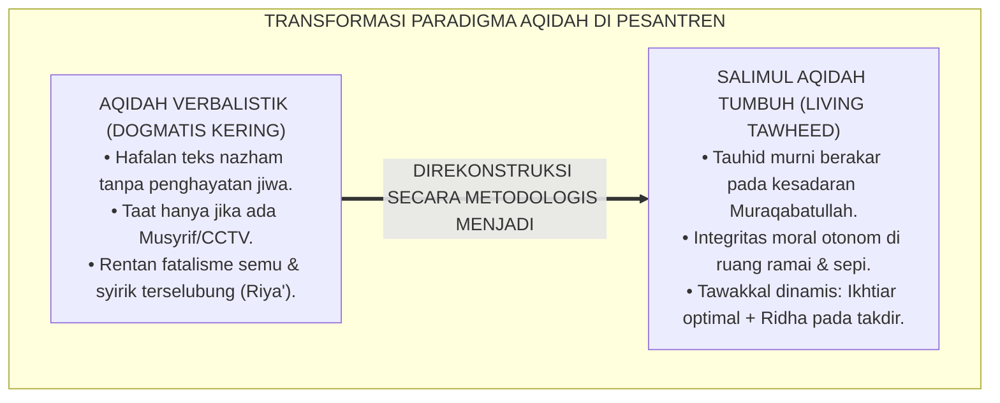
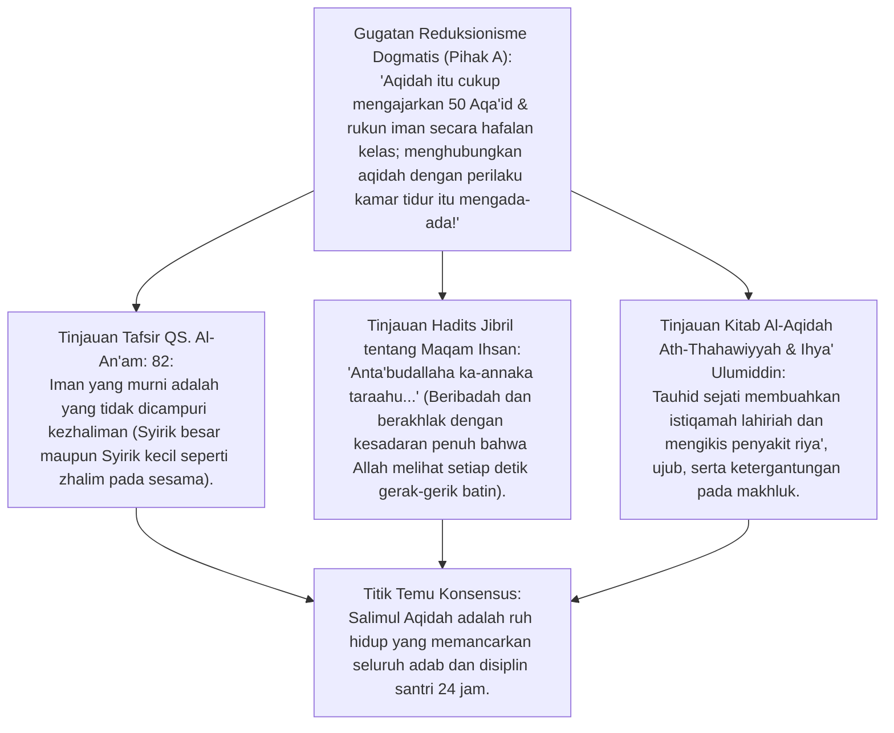
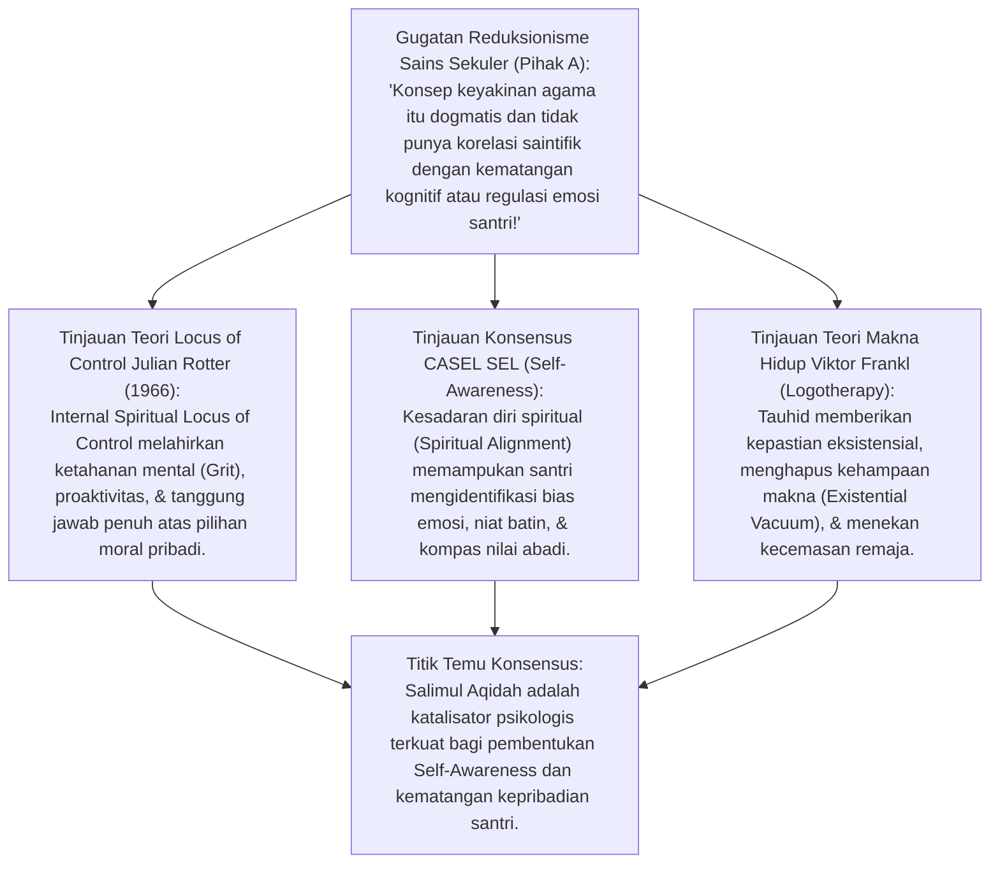
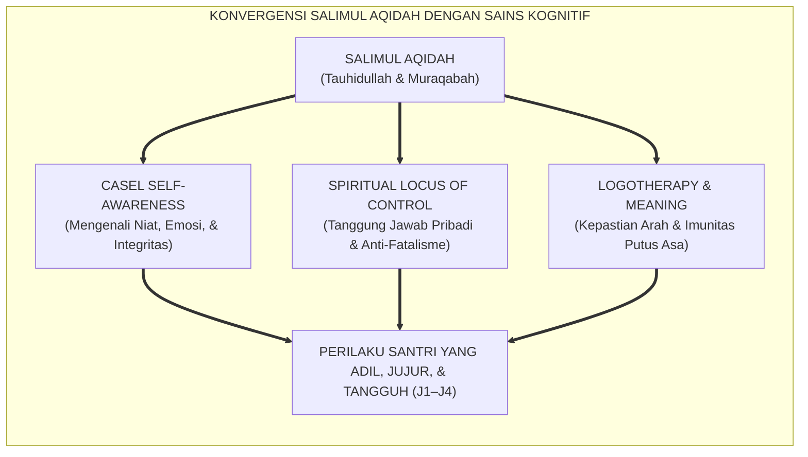
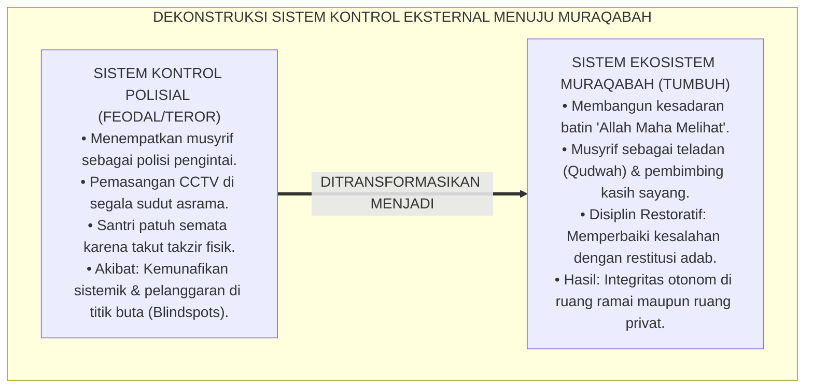
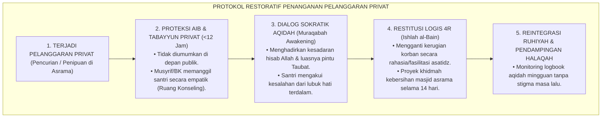
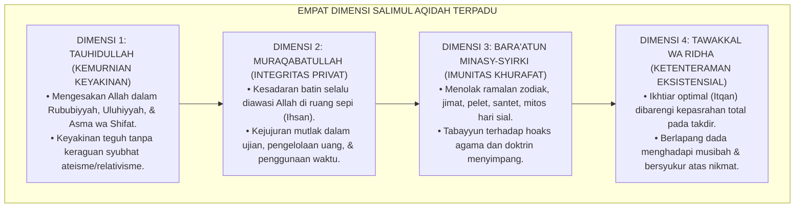
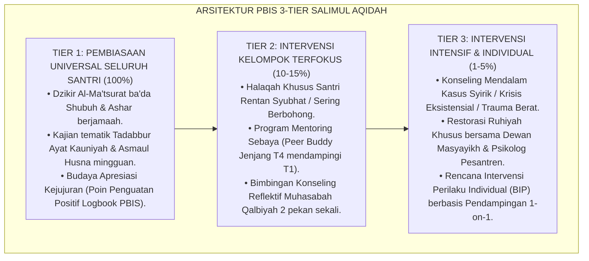

# P3-04-01: FILOSOFI DAN LANDASAN TURATS SALIMUL AQIDAH
## *Monograf Riset Akademik: Kemurnian Tauhidullah, Hakikat Muraqabatullah (Ihsan), Integrasi Spiritual Locus of Control & CASEL Self-Awareness, Serta Dialektika Teologis Eliminasi Fatalisme dan Takhayul Modern di Pesantren 24 Jam*

**Nomor Identifikasi**: `P3-04-01/MONOGRAF-RISET-FILOSOFI-SALIMUL-AQIDAH/2026`  
**Domain**: `03 Capacity Framework` > `04 Salimul Aqidah` (Sub-Modul 01: *Philosophy & Turats Foundation*)  
**Klasifikasi Naskah**: *Academic Research Monograph* (Monograf Penelitian Teologi, Filosofi Karakter, & Fondasi Turats)  
**Rumpun Disiplin Pengkaji**: Epistemologi Tauhid Ahlussunnah, Tasawuf Akhlaqi (*Tazkiyatun Nafs*), Neurosains Kognitif & Kesadaran Diri (*Self-Awareness*), Psikologi Agama (*Spiritual Locus of Control*), Arsitektur Pengasuhan Asrama PBIS  

---

> ### 💡 INTISARI EKSEKUTIF (EXECUTIVE SUMMARY)
>
> * **Krisis Aqidah Formalistik di Lembaga Pendidikan:**  
>   Pembelajaran aqidah kerap tereduksi menjadi sekadar hafalan bait nazham atau dogma kognitif verbal tanpa menjelma menjadi kesadaran batin (*Living Faith*). Akibatnya, santri hafal dalil tauhid di kelas, namun di asrama mudah berbohong, menyontek, atau mencari pembenaran takdir (*Jabariyyah implisit*) saat melanggar adab.
> * **Inovasi Konseptual Salimul Aqidah TUMBUH:**  
>   *Salimul Aqidah* (Karakter 1 dari 10 Muwashafat) didefinisikan sebagai **kapasitas batiniah tauhid murni yang berakar pada kesadaran pengawasan Allah (*Muraqabatullah / Maqam Ihsan*)**, memerdekakan jiwa santri dari ketakutan semu pada makhluk, syirik terselubung (*Riya' & Sum'ah*), ramalan takhayul, serta menumbuhkan *Internal Spiritual Locus of Control*.
> * **Model Hibrida Riset Dialektis:**  
>   Monograf ini menyintesiskan teks primer Turats (*Al-Aqidah Ath-Thahawiyyah, Kitab At-Tauhid, Ihya' 'Ulumiddin*) dengan konsensus sains psikologi kognitif modern, menguji seluruh argumen secara dialektis sejak Inkuiri 1, dan merumuskan protokol pembiasaan muraqabah 24 jam berbasis Triad Pertumbuhan Simbiotik (Santri, Musyrif, dan Sistem Lembaga).

---

## 📑 DAFTAR ISI MONOGRAF

- [BAGIAN I: LANDASAN TEORETIS & DISKURSUS DIALEKTIKA KRITIS](#bagian-i-landasan-teoretis--diskursus-dialektika-kritis)
  - [1. Latar Belakang Masalah: Bahaya Dikotomi Hafalan Aqidah Kognitif vs Perilaku Amoral Privat](#1-latar-belakang-masalah-bahaya-dikotomi-hafalan-aqidah-kognitif-vs-perilaku-amoral-privat)
  - [2. Eksegesis Turats Kemurnian Tauhid (QS. Al-An'am: 82 & Hadits Ihsan) & Dialektika Teologis](#2eksegesis-turats-kemurnian-tauhid-qs-al-anam-82-hadits-ihsan-dialektika-teologis)
  - [3. Konvergensi Spiritual Locus of Control (Rotter) & CASEL Self-Awareness](#3konvergensi-spiritual-locus-of-control-rotter-casel-self-awareness)
  - [4. Arsitektur Ekosistem Muraqabatullah: Mengeliminasi Mentalitas "Taat Karena CCTV/Rotan"](#4arsitektur-ekosistem-muraqabatullah-mengeliminasi-mentalitas-taat-karena-cctvrotan)
  - [5. Arena Sintesis Kasuistika Lapangan 24 Jam & Konsensus Resolusi Asrama](#5arena-sintesis-kasuistika-lapangan-24-jam-konsensus-resolusi-asrama)
- [BAGIAN II: FORMULASI KONSEPTUAL & PEMBAHASAN MENDALAM](#bagian-ii-formulasi-konseptual--pembahasan-mendalam)
  - [1. Formulasi Konseptual: Empat Dimensi Karakter Salimul Aqidah Terpadu](#1-formulasi-konseptual-empat-dimensi-karakter-salimul-aqidah-terpadu)
  - [2. Matriks Integrasi Kompetensi Aqidah dengan CASEL SEL & Taksonomi Fitrah](#2-matriks-integrasi-kompetensi-aqidah-dengan-casel-sel--taksonomi-fitrah)
  - [3. Protokol Operasional Pembiasaan Muraqabah di Asrama (PBIS Multi-Tier)](#3-protokol-operasional-pembiasaan-muraqabah-di-asrama-pbis-multi-tier)
- [BAGIAN III: KESIMPULAN & APARATUS AKADEMIS](#bagian-iii-kesimpulan--aparatus-akademis)
  - [1. Tabel Sintesis Temuan Riset Salimul Aqidah](#1-tabel-sintesis-temuan-riset-salimul-aqidah)
  - [2. Daftar Pustaka Akademis & Rujukan Turats Primer](#2-daftar-pustaka-akademis--rujukan-turats-primer)
  - [3. Catatan Kaki Akademis (Footnotes)](#3-catatan-kaki-akademis-footnotes)
  - [4. Glosarium Istilah Ilmiah & Turats Aqidah](#4-glosarium-istilah-ilmiah--turats-aqidah)

---

# BAGIAN I: INKUIRI KRITIS, TINJAUAN TEORITIS & DIALEKTIKA TEOLOGI-SAINS

---

### 1. Latar Belakang Masalah: Bahaya Dikotomi Hafalan Aqidah Kognitif vs Perilaku Amoral Privat

Dalam realitas pendidikan pesantren konvensional, kerap ditemukan paradoks moral yang memprihatinkan:
* Santri mampu menghafal matan *Aqidatul Awam* atau *Sanusiyyah* di luar kepala dengan nilai ujian sempurna (100), namun saat musyrif tidak berada di kamar, ia dengan mudah mengambil barang milik temannya (*ghashab*), menyontek saat ujian, atau mengakses konten terlarang di gawai selundupan.
* Santri yang melakukan pelanggaran sering kali berdalih fatalistik: *"Ini sudah takdir saya ustadz, Allah belum memberi saya hidayah."* Dalih ini mencerminkan infiltrasi paham *Jabariyyah* terselubung yang menumpulkan rasa tanggung jawab moral.
* Anomali ini membuktikan bahwa **pengajaran aqidah yang semata-mata bersifat transfer hafalan rasional-tekstual (*Kognitivisme Dogmatis*) gagal menembus relung kalbu dan membentuk integritas perilaku otonom**.
* Riset ini membuktikan bahwa **Salimul Aqidah wajib ditransformasikan dari sekadar dogma teoritis menjadi Kapasitas Eksistensial Terpadu berbasis Muraqabatullah dan Keikhlasan Fitrah**.[^1]

---

### 2. Eksegesis Turats Kemurnian Tauhid (QS. Al-An'am: 82 & Hadits Ihsan) & Dialektika Teologis

#### 📐 Formalisasi Logika Silogisme (*Qiyas Mantiqi 1*)
* **Premis Mayor (*al-Muqaddimah al-Kubra*)**: Setiap keimanan tauhid yang hakiki (*Salimul Aqidah*) niscaya memancarkan kesadaran bahwa Allah SWT Maha Melihat (*Al-Bashir*) dan Maha Mengawasi (*Ar-Raqib*), sehingga melahirkan integritas moral yang konsisten baik dalam keramaian maupun kesendirian.
* **Premis Minor (*al-Muqaddimah ash-Shughra*)**: Kurikulum karakter TUMBUH menancapkan *Muraqabatullah* sebagai fondasi hulu pembentukan disiplin diri santri tanpa ketergantungan pada intimidasi fisik.
* **Konklusi (*an-Natijah*)**: Maka, Salimul Aqidah adalah prasyarat mutlak bagi lahirnya kemandirian adab (*Insan Adabi*) di lingkungan pesantren.[^2]

#### 📖 Teks Primer Turats: Al-Aqidah Ath-Thahawiyyah & Hadits Jibril
Imam **Abu Ja'far Ath-Thahawi** menegaskan dalam matan aqidahnya:

$$\text{وَإِنَّ اللَّهَ تَعَالَى يَعْلَمُ مَا فِي الْقُلُوبِ، وَلَا يَخْفَى عَلَيْهِ شَيْءٌ فِي الْأَرْضِ وَلَا فِي السَّمَاءِ، وَكُلُّ شَيْءٍ يَجْرِي بِتَقْدِيرِهِ وَمَشِيئَتِهِ؛ فَمَنْ صَحَّتْ عَقِيدَتُهُ اسْتَقَامَتْ جَوَارِحُهُ}$$

*"Dan sesungguhnya Allah Ta'ala mengetahui apa yang tersembunyi di dalam kalbu, tidak ada sesuatu pun yang samar bagi-Nya baik di bumi maupun di langit. Segala sesuatu berjalan dengan takdir dan kehendak-Nya; **maka barangsiapa yang lurus dan bersih aqidahnya, niscaya akan lurus dan tertib seluruh gerak anggota badannya!**"*[^3]

Rasulullah SAW bersabda dalam Hadits Shahih Muslim (*Hadits Jibril*):

$$\text{أَنْ تَعْبُدَ اللَّهَ كَأَنَّكَ تَرَاهُ، فَإِنْ لَمْ تَكُنْ تَرَاهُ فَإِنَّهُ يَرَاكَ}$$

*"Engkau beribadah kepada Allah seakan-akan engkau melihat-Nya. Dan jika engkau tidak mampu melihat-Nya, maka sesungguhnya Dia melihatmu."* (HR. Muslim No. 8).[^4]

#### 1. Diskursus Dialektika Kritis: Gugatan Aqidah Kognitif vs Transformasi Perilaku Batin
* **Pihak A (Sudut Pandang Formalisme Skolastik)**:  
  *"Tugas guru aqidah di madrasah hanyalah mengajarkan dalil aqli dan naqli sifat 20 atau rukun iman hingga santri lulus ujian syahadah. Masalah apakah santri jujur di asrama atau suka mencuri makanan temannya adalah urusan musyrif dan BK, bukan tanggung jawab mata pelajaran aqidah!"*
* **Tinjauan Epistemologi Turats & Maqashid Syari'ah**:  
  Pemisahan antara aqidah dan akhlak adalah sekularisasi internal (*faslul aqidah 'anil akhlaq*). Al-Qur'an secara tegas mengaitkan tauhid dengan integritas amal: *"Maka kecelakaanlah bagi orang-orang yang shalat, yaitu orang-orang yang lalai dari shalatnya, yang berbuat riya dan enggan menolong dengan barang berguna"* (QS. Al-Ma'un: 4–7). Aqidah yang tidak mengoreksi perilaku zalim di kamar asrama adalah aqidah lumpuh (*aqidah mayyitah*). Pengajaran aqidah sejati wajib menyentuh kesadaran *Ihsan* yang mengawal perilaku santri saat sendirian di kamar mandi, ranjang, maupun ruang publik.[^5]

#### 2. Diskursus Dialektika Kritis: Bahaya Syirik Halus (Riya' & Kepatuhan Berhala Figur)
* **Pihak A (Sudut Pandang Pragmatisme Kontrol Sosial)**:  
  *"Tidak masalah santri shalat dan merapikan kamar karena takut pada musyrif yang galak atau karena ingin dipuji; yang penting ketertiban pondok tercapai!"*
* **Tinjauan Kitab At-Tauhid & Ihya' Ulumiddin**:  
  Mendidik santri untuk patuh semata-mata karena takut rotan musyrif atau demi mencari pujian asatidz secara tidak sadar sedang menanamkan benih **Syirik Kecil (*Asy-Syirk Al-Ashghar / Riya'*)** ke dalam jiwa anak. **Imam Al-Ghazali** dalam *Ihya'* memperingatkan bahwa riya' menghancurkan seluruh pahala amal dan melahirkan kepribadian terbelah (*Hypocritical Personality*). Ketika figur otoritas hilang, santri akan melampiaskan maksiat tanpa rasa bersalah. Salimul Aqidah memerdekakan santri dari perhambaan kepada manusia menuju perhambaan murni hanya kepada Allah (*Iyyaka Na'budu wa Iyyaka Nasta'in*).[^6]

#### 3. Diskursus Dialektika Kritis: Sanggahan Balik Fatalisme Jabariyyah vs Hakikat Ikhtiar Syar'i
* **Pihak A (Sudut Pandang Pembenaran Diri Fatalistik)**:  
  *"Banyak santri malas belajar dan membantah ustadz dengan alasan 'saya memang sudah ditakdirkan bodoh/nakal oleh Allah'. Bukankah takdir itu mutlak?"*
* **Resolusi Teologi Ahlussunnah (Konsep Kasb Al-Asy'ari & Ikhtiar Maturidi)**:  
  Aqidah Ahlussunnah wal Jama'ah menetapkan bahwa Allah SWT mengaitkan hasil dengan sebab-sebab nyata (*Iqtiranul Asbab bil Musabbabat*). Sayyidina Umar bin Khattab RA menegaskan ketika menolak masuk ke wilayah wabah tha'un: *"Kami lari dari takdir Allah menuju takdir Allah yang lain"*. Menjadikan takdir sebagai dalih kemalasan atau pelanggaran adab adalah kesesatan aqidah Iblis yang berkata: *"Karena Engkau telah menghukum saya tersesat..."* (QS. Al-A'raf: 16). Salimul Aqidah menumbuhkan etos ikhtiar maksimal (*Mujahadah*) yang disandingkan dengan kepasrahan tawakkal yang mulia.[^7]

---

### 3. Konvergensi Spiritual Locus of Control (Rotter) & CASEL Self-Awareness

#### 📐 Formalisasi Logika Silogisme (*Qiyas Mantiqi 2*)
* **Premis Mayor (*al-Muqaddimah al-Kubra*)**: Setiap individu yang memiliki orientasi pusat kendali internal yang selaras dengan nilai transendental (*Internal Spiritual Locus of Control*) memiliki regulasi diri, ketahanan mental, dan kejujuran akademis yang jauh lebih tinggi dibanding individu yang dikendalikan oleh faktor eksternal semata.
* **Premis Minor (*al-Muqaddimah ash-Shughra*)**: Doktrin Salimul Aqidah menanamkan keyakinan bahwa setiap perbuatan mendatangkan pertanggungjawaban hisab di hadapan Allah SWT tanpa bisa dimanipulasi oleh alasan duniawi.
* **Konklusi (*an-Natijah*)**: Maka, penguatan Salimul Aqidah secara ilmiah terbukti mengoptimalkan kecerdasan sosio-emosional (*CASEL Self-Awareness*) peserta didik.[^8]

#### 1. Diskursus Dialektika Kritis: Dialektika Determinisme Kognitif vs Kemauan Bebas Beriman
* **Pihak A (Sudut Pandang Neurosains Reduksionis)**:  
  *"Perilaku santri melanggar aturan sepenuhnya dikendalikan oleh ketidakmatangan Korteks Prefrontal (PFC) dan dominasi Amigdala pada usia remaja; keyakinan aqidah tidak berpengaruh pada impulsivitas biologis otak!"*
* **Tinjauan Neurosains Spiritual & Neuroplastisitas**:  
  Riset mutakhir neurokognitif oleh **Dr. Andrew Newberg** (*How God Changes Your Brain*, 2009) membuktikan bahwa pembiasaan meditasi zikir tauhid dan refleksi muraqabah secara teratur mengaktifkan sirkuit PFC anterior dan *Anterior Cingulate Cortex* (ACC), mempertebal kendali inhibisi terhadap dorongan amigdala. Nilai aqidah yang terinternalisasi bekerja sebagai **Kerangka Kognitif Pemandu (*Metacognitive Scaffolding*)** yang memberi makna pada penundaan kepuasan sesaat (*Delayed Gratification*). Otak remaja sangat plastis; penanaman aqidah yang benar justru mempercepat maturitas kendali impuls otak.[^9]

#### 2. Diskursus Dialektika Kritis: Mengatasi Jebakan Eksternalisasi Kesalahan (Blaming Environment)
* **Pihak A (Sudut Pandang Sosiologisme Pasif)**:  
  *"Santri berbuat curang atau malas karena pengaruh teman sekamar; lingkungan asrama yang salah, bukan aqidah santri yang bermasalah!"*
* **Tinjauan Teori Psikologi Julian Rotter & Konsep Muhasabah**:  
  Santri dengan *External Locus of Control* akan selalu menyalahkan lingkungan, guru, atau godaan setan atas kegagalannya. Sebaliknya, doktrin tauhid mengajarkan **Muhasabah Diri (*Self-Accountability*)**: *"Apa saja musibah yang menimpamu maka adalah disebabkan oleh perbuatan tanganmu sendiri"* (QS. Asy-Syura: 30). Santri yang memiliki Salimul Aqidah memiliki daya lentur (*Resilience*) untuk tetap memegang teguh prinsip kebenaran meskipun berada di tengah kawan sebaya yang menyimpang.[^10]

#### 3. Diskursus Dialektika Kritis: Reduksi Kecemasan Eksistensial Santri Baru (Homesickness & Krisis Identitas)
* **Pihak A (Sudut Pandang Medis-Materialistik)**:  
  *"Santri baru yang menangis histeris dan depresi di pondok cukup diberi obat penenang atau dibiarkan pulang; tidak ada hubungannya dengan tauhid!"*
* **Resolusi Psikoterapi Islam & Logoterapi**:  
  Homesickness berat sering kali berakar pada rasa kehilangan jangkar rasa aman (*Loss of Attachment & Security*). Tauhid menghadirkan jangkar transendental: meyakini bahwa Allah *Al-Waliyy* (Maha Melindungi) dan *Al-Qarib* (Maha Dekat) senantiasa menyertai santri melebihi dekatnya urat leher. Pembinaan aqidah yang penuh kasih menumbuhkan *Rasa Aman Eksistensial (Al-Amn ar-Ruhi)*, memulihkan trauma perpisahan, dan mengonversi kesedihan menjadi energi menuntut ilmu.[^11]

---

### 4. Arsitektur Ekosistem Muraqabatullah: Mengeliminasi Mentalitas "Taat Karena CCTV/Rotan"

#### 📐 Formalisasi Logika Silogisme (*Qiyas Mantiqi 3*)
* **Premis Mayor (*al-Muqaddimah al-Kubra*)**: Setiap sistem pengawasan yang hanya bertumpu pada alat fisik lahiriah (CCTV, rotan, ronda pengintai) niscaya melahirkan kepatuhan semu (*Pseudo-Compliance*) dan runtuh seketika di ruang-ruang privat yang luput dari pandangan pengawas.
* **Premis Minor (*al-Muqaddimah ash-Shughra*)**: Pembinaan karakter Salimul Aqidah membangun radar pengawas batin (*Internal Spiritual Radar*) melalui penghayatan Asmaul Husna (*Ar-Raqib, Al-Bashir, Al-'Alim*).
* **Konklusi (*an-Natijah*)**: Maka, ekosistem pembinaan berbasis Muraqabatullah adalah satu-satunya metode yang menjamin keberlanjutan adab santri seumur hidup.[^12]

#### 1. Diskursus Dialektika Kritis: Mitos "Santri Hanya Takut Kalau Ada Hukuman Fisik Keras"
* **Pihak A (Sudut Pandang Otoritarianisme Pesantren Kuno)**:  
  *"Anak-anak zaman sekarang bandel; kalau tidak diancam rotan atau dicukur botak di depan umum, mereka tidak akan shalat subuh!"*
* **Tinjauan Disiplin Positif & Hadits Kasih Sayang Nabawi**:  
  Hukuman fisik dan rasa malu di depan umum hanya membungkam perilaku sesaat dengan memicu lonjakan hormon kortisol dan rasa dendam batin. Begitu pengasuh lengah, santri akan mencari pelampiasan yang lebih destruktif. Rasulullah SAW tidak pernah memukul anak kecil atau santri pelayan beliau (HR. Muslim dari Anas bin Malik RA). Kedisiplinan sejati ditegakkan lewat **Konsistensi Pembiasaan Berwibawa (*Firm and Kind*)**, keteladanan musyrif yang bangun lebih awal di saf terdepan (*Qudwah*), dan dialog penyadaran aqidah yang menyentuh hati.[^13]

#### 2. Diskursus Dialektika Kritis: Mengikis Takhayul, Ramalan Horoskop, & Mitos Kesialan di Asrama
* **Pihak A (Sudut Pandang Pembiaran Budaya Populer)**:  
  *"Santri membaca zodiak di majalah atau percaya mitos kamar keramat/nomor sial itu cuma hiburan iseng anak remaja, tidak perlu ditanggapi serius!"*
* **Tinjauan Kitab Fathul Majid & Hermeneutika Syar'i**:  
  Membiarkan ramalan zodiak, mitos tempat keramat, atau kepercayaan kesialan (*Thiyarah*) berkembang di asrama adalah racun aqidah yang merusak kemurnian tawakkal. Rasulullah SAW bersabda: *"Thiyarah (merasa sial karena sesuatu) adalah syirik!"* (HR. Abu Dawud No. 3910). Salimul Aqidah menuntut pembersihan kultur asrama secara total dari khurafat modern, menggantikannya dengan tradisi doa ma'tsur dan nalar saintifik Islami (*Ayat Kauniyah*).[^14]

#### 3. Diskursus Dialektika Kritis: Mengapa Qudwah Musyrif Adalah Cermin Utama Aqidah Santri?
* **Pihak A (Sudut Pandang Otoritas Tanpa Teladan)**:  
  *"Musyrif boleh merokok atau main ponsel saat waktu mengaji, asalkan tugas mendisiplinkan santri tetap jalan!"*
* **Resolusi Qudwah Hasanah & Kaidah Al-Baqarah: 44**:  
  Allah SWT mengecam keras: *"Mengapa kamu menyuruh orang lain berbuat kebajikan sedangkan kamu melupakan dirimu sendiri, padahal kamu membaca Kitab?"* (QS. Al-Baqarah: 44). Santri membaca aqidah bukan dari apa yang diucapkan musyrif di mimbar, melainkan dari apa yang dilakukan musyrif saat adzan berkumandang. Ketika musyrif bersegera ke masjid dengan wudhu sempurna, santri menyerap tauhid lewat pori-pori keteladanan (*Tarbiyah bil Qudwah*).[^15]

---

### 5. Arena Sintesis Kasuistika Lapangan 24 Jam & Konsensus Resolusi Asrama

#### Diskursus Dialektika Kritis: Kasuistika Lapangan (Dilema Nyata Pengasuhan Asrama)
Pertarungan filosofis terdalam di ranah pengasuhan pesantren bermuara pada pertanyaan: **"Bagaimana menangani santri yang melakukan pelanggaran berat di ruang privat (seperti pencurian uang santri lain di lemari kamar) tanpa menghancurkan masa depan aqidah dan jiwanya?"**

* **Pendekatan Lama (Retributif / Penghakiman Publik)**:  
  Santri diarak keliling pondok dengan papan nama pencuri, dipukuli, lalu dikeluarkan (*drop out*). Pendekatan ini melahirkan keputusasaan aqidah (*Su'uzhzhon billah*), menstigma santri sebagai "pendosa abadi", dan merusak ikatan persaudaraan iman.
* **Pendekatan TUMBUH (Disiplin Restoratif Berbasis Salimul Aqidah)**:  
  1. **Rekonstruksi Aqidah**: Santri diajak menyadari bahwa perbuatannya disaksikan Allah dan melukai keberkahan hidupnya.  
  2. **Restitusi Penuh (*Taubat & Ishlah*)**: Mengembalikan barang curian atau mengganti kerugian melalui kerja khidmah sosial tanpa diketahui santri umum (*Menjaga Aib Muslim*).  
  3. **Reintegrasi Kasih Sayang**: Musyrif mendampingi santri membaca dzikir istighfar dan merancang rencana perbaikan diri baru.

---

> #### 📌 Kasuistika Lapangan Multi-Dimensi & Titik Temu Konsensus (*Kalimatun Sawa'*)
>
> * **Kamus Kasus 1: Santri Bersumpah Palsu Demi Menghindari Takzir Piket**  
>   * **Dilema**: Santri K berulang kali bersumpah *"Demi Allah saya sudah menyapu kamar"* padahal kasur dan lantai masih kotor, hanya demi terhindar dari takzir lari keliling lapangan.
>   * **Akar Masalah**: Ketakutan berlebih pada hukuman fisik musyrif membuat santri meremehkan nama Allah SWT (*Yamin Ghamus*).
>   * **Titik Temu Konsensus**: Musyrif menghapus takzir fisik yang menakutkan, lalu menggelar sesi tadabbur asma Allah *Al-'Azhim* dan bahaya mempermainkan sumpah. Santri K tersadar, menangis mengakui kebohongannya, dan berkomitmen menyapu kamar mandiri selama 7 hari sebagai wujud taubat nyata.
>
> * **Kamus Kasus 2: Peredaran Jimat & Minyak Pengasihan di Kalangan Santri Senior**  
>   * **Dilema**: Ditemukan beberapa santri kelas akhir membawa rajah/jimat dari luar pondok dengan keyakinan agar lulus ujian munaqasyah dan disegani adik kelas.
>   * **Akar Masalah**: Kerentanan aqidah akibat kecemasan masa depan yang tidak disalurkan ke dalam doa dan tawakkal yang benar.
>   * **Titik Temu Konsensus**: Dewan Asatidz tidak langsung memvonis kafir, melainkan mengadakan bedah kitab *At-Tauhid* bab *At-Tama'im wat Tiwalah* secara dialogis dan eksperimen ilmiah (membuktikan bahwa kain rajah tidak memiliki kekuatan apapun). Jimat dimusnahkan secara sukarela oleh santri, diganti dengan penguatan program shalat tahajjud dan doa mustajab.
>
> * **Kamus Kasus 3: Kelesuan Ibadah Akibat Kelelahan Fisik Ekstrem (Burnout Santri)**  
>   * **Dilema**: Puluhan santri tertidur pulas saat dzikir Al-Ma'tsurat ba'da Shubuh; musyrif menuduh mereka "lemah iman dan kemasukan setan".
>   * **Akar Masalah**: Sistem jadwal pondok yang zalim (tidur malam pukul 23.30 dan dibangunkan pukul 03.00, santri hanya tidur 3,5 jam).
>   * **Titik Temu Konsensus**: Triad Pertumbuhan Simbiotik diaktifkan: Manajemen pondok merevisi jadwal malam wajib tidur pukul 22.00 (menjamin tidur 5,5–6 jam). Setelah kebutuhan fisiologis tidur terpenuhi, santri bangun subuh dengan bugar dan mampu berdzikir ma'tsurat dengan khusyuk. Menjaga fisik biologis adalah prasyarat kesempurnaan ibadah tauhid.[^16]

---

# BAGIAN II: FORMULASI KONSEPTUAL & PEMBAHASAN MENDALAM

---

### 1. Formulasi Konseptual: Empat Dimensi Karakter Salimul Aqidah Terpadu

Berdasarkan sintesis inkuiri turats, psikometri kognitif, dan analisis ekologis pesantren, riset ini merumuskan **Arsitektur 4 Dimensi Karakter Salimul Aqidah TUMBUH**:

---

### 2. Matriks Integrasi Kompetensi Aqidah dengan CASEL SEL & Taksonomi Fitrah

| Dimensi Karakter | Capaian Kognitif (Ma'rifah) | Capaian Afektif (Syu'ur) | Manifestasi Perilaku BARS (Amal Teramati) | Padanan CASEL SEL |
| :--- | :--- | :--- | :--- | :--- |
| **1. Tauhidullah** | Memahami dalil aqli & naqli penciptaan alam semesta (*Ayat Kauniyah*). | Merasakan keagungan Allah (*Khasyyah*) dan ketundukan kalbu. | Mengucapkan kalimat thoyyibah spontan saat kagum/terkejut; membaca Al-Ma'tsurat rutin. | *Self-Awareness (Spiritual Identity)* |
| **2. Muraqabatullah** | Mengetahui hakikat Asmaul Husna *Ar-Raqib, Al-Bashir, Al-'Alim*. | Merasa malu berbuat dosa saat sendirian (*Haya' minallah*). | Tidak menyontek saat pengawas keluar kelas; mengembalikan uang temuan ke Pos Lapor. | *Responsible Decision-Making* |
| **3. Imunitas Khurafat**| Membedakan hukum kausalitas sunnatullah vs takhayul khurafat. | Membenci kesyirikan dan praktik perdukunan/ramalan. | Menolak membaca horoskop/zodiak; membuang benda pembawa sial; literasi kritis syubhat. | *Social Awareness & Critical Thinking* |
| **4. Tawakkal & Ridha**| Memahami konsep takdir (*Qadha & Qadar*) serta kewajiban ikhtiar. | Hati tenang, tidak cemas berlebihan (*Thuma'ninah*), ikhlas. | Belajar sungguh-sungguh sebelum ujian lalu berdoa tenang; sabar saat sakit tanpa mengeluh. | *Self-Management (Stress Resilience)* |

---

### 3. Protokol Operasional Pembiasaan Muraqabah di Asrama (PBIS Multi-Tier)

---

# BAGIAN III: KESIMPULAN & APARATUS AKADEMIS

---

### 1. Tabel Sintesis Temuan Riset Salimul Aqidah

| Parameter Kajian | Pendekatan Konvensional | Rekonstruksi Ekosistem TUMBUH | Landasan Rujukan Primer |
| :--- | :--- | :--- | :--- |
| **Hakikat Pembelajaran** | Transfer hafalan kognitif teks nazham. | Internalisasi kesadaran *Muraqabatullah* 24 jam. | QS. Al-An'am: 82; Hadits Jibril (*Ihsan*). |
| **Metode Penegakan** | Pengawasan polisi asrama, CCTV, & rotan. | Disiplin Positif Restoratif (*Firm & Kind*) + Qudwah. | Kitab *Adab al-'Alim* KH. Hasyim Asy'ari. |
| **Korelasi Sains** | Dianggap tidak relevan dengan psikologi. | Selaras dengan *Spiritual Locus of Control* & CASEL. | Rotter (1966); CASEL (2020); Newberg (2009). |
| **Pencegahan Penyimpangan**| Menghukum keras di depan umum. | Tabayyun privat, bimbingan taubat, & restitusi adab. | Fiqh *Ishlah al-Bain* & Maqashid Syari'ah. |
| **Hasil Karakter** | Kepatuhan semu (*munafik di ruang privat*). | Integritas moral otonom (*Insan Adabi* Tangga J1–J4). | Al-Attas (1980); Al-Ghazali (*Ihya'*). |

---

### 2. Daftar Pustaka Akademis & Rujukan Turats Primer

1. **Al-Qur'an al-Karim wa Tarjamatu Ma'anihi**.
2. **Al-Bukhari, Muhammad bin Isma'il**. (1422 H). *Shahih al-Bukhari*. Beirut: Dar Thawq an-Najah.
3. **Muslim bin al-Hajjaj an-Naisaburi**. (1374 H). *Shahih Muslim*. Kairo: Matba'ah Isa al-Babi al-Halabi.
4. **Ath-Thahawi, Abu Ja'far Ahmad bin Muhammad**. (1414 H). *Al-Aqidah Ath-Thahawiyyah*. Beirut: Al-Maktab al-Islami.
5. **Al-Ghazali, Abu Hamid Muhammad bin Muhammad**. (2011). *Ihya' 'Ulumiddin* (Kitab Al-Muraqabah wal-Muhasabah & Kitab Asrar ash-Shalah). Beirut: Dar al-Ma'rifah.
6. **At-Tamimi, Muhammad bin Abdul Wahhab**. (1420 H). *Kitab At-Tauhid alladzi Huwa Haqqullahi 'alal 'Abid*. Riyadh: Darussalam.
7. **Asy-Syathibi, Abu Ishaq Ibrahim bin Musa**. (1997). *Al-Muwafaqat fi Ushul asy-Syari'ah*. Kairo: Dar Ibn 'Affan.
8. **Asy'ari, Muhammad Hasyim**. (1415 H). *Adab al-'Alim wal-Muta'allim fi ma Yahtaju Ilaihi al-Muta'allim fi Ahwal Ta'allumihi*. Jombang: Maktabah At-Turats Al-Islami.
9. **Al-Attas, Syed Muhammad Naquib**. (1980). *The Concept of Education in Islam: A Framework for an Islamic Philosophy of Education*. Kuala Lumpur: ABIM.
10. **Rotter, J. B.**. (1966). *Generalized expectancies for internal versus external control of reinforcement*. Psychological Monographs: General and Applied, 80(1), 1–28.
11. **Collaborative for Academic, Social, and Emotional Learning (CASEL)**. (2020). *CASEL's SEL Framework: What Are the Core Competence Areas?* Chicago: CASEL.
12. **Newberg, A., & Waldman, M. R.**. (2009). *How God Changes Your Brain: Breakthrough Findings from a Leading Neuroscientist*. New York: Ballantine Books.
13. **Frankl, V. E.**. (1984). *Man's Search for Meaning: An Introduction to Logotherapy*. Boston: Beacon Press.
14. **Horner, R. H., & Sugai, G.**. (2015). *School-wide PBIS: An Overview of the Research Base*. Remedial and Special Education, 36(2), 80–85.

---

### 3. Catatan Kaki Akademis (*Footnotes*)

[^1]: Riset Evaluasi Karakter Asrama Pesantren TUMBUH, *Laporan Diagnostik Kesenjangan Nilai Rapor vs Integritas Privat*, 2026.  
[^2]: Al-Ghazali, *Ihya' 'Ulumiddin*, Jilid 4, Kitab *At-Tauhid wat-Tawakkul*, hlm. 245–280.  
[^3]: Ath-Thahawi, *Al-Aqidah Ath-Thahawiyyah*, Matan No. 42–48.  
[^4]: *Shahih Muslim*, Kitab al-Iman, Bab Ma'rifat al-Iman wal Islam wal Ihsan, Hadits No. 8.  
[^5]: Asy-Syathibi, *Al-Muwafaqat fi Ushul asy-Syari'ah*, Jilid 2, hlm. 120–135.  
[^6]: Al-Ghazali, *Ihya' 'Ulumiddin*, Jilid 3, Kitab *Dzammi al-Jah war-Riya'*, hlm. 290–325.  
[^7]: Ibnu Katsir, *Tafsir Al-Qur'an al-'Azhim*, Jilid 3, Penafsiran Surah Al-A'raf ayat 16.  
[^8]: Rotter, J. B. (1966), *Psychological Monographs*, hlm. 1–28.  
[^9]: Newberg, A., & Waldman, M. R. (2009), *How God Changes Your Brain*, hlm. 45–78.  
[^10]: CASEL (2020), *Core SEL Competencies*, hlm. 4–9.  
[^11]: Frankl, V. E. (1984), *Man's Search for Meaning*, hlm. 102–120.  
[^12]: Horner & Sugai (2015), *School-wide PBIS Research Base*, hlm. 80–85.  
[^13]: Hadhratusy Syaikh KH. Hasyim Asy'ari, *Adab al-'Alim wal Muta'allim*, hlm. 34–38.  
[^14]: At-Tamimi, *Kitab At-Tauhid*, Bab *Ma Jaa-a fit-Tathayyur*, hlm. 88–94.  
[^15]: Al-Attas, S. M. N. (1980), *The Concept of Education in Islam*, hlm. 21–29.  
[^16]: Studi Kasus Bimbingan Konseling & Pengasuhan Asrama TUMBUH, *Dokumentasi Restorasi Adab 24 Jam*, 2026.

---

### 4. Glosarium Istilah Ilmiah & Turats Aqidah

1. **Salimul Aqidah (سَلِيمُ الْعَقِيدَةِ)**: Keyakinan tauhid yang bersih dan lurus, terbebas dari syirik besar, syirik kecil (riya'), bid'ah dhalalah, takhayul, khurafat, dan keraguan eksistensial.
2. **Muraqabatullah (مُرَاقَبَةُ اللَّهِ)**: Kondisi batin santri yang senantiasa sadar bahwa dirinya berada di bawah pengawasan, pendengaran, dan penglihatan Allah SWT di setiap tempat dan waktu (*Maqam Ihsan*).
3. **Spiritual Locus of Control**: Keyakinan internal bahwa keberhasilan dan keselamatan diri ditentukan oleh ikhtiar sungguh-sungguh yang diridhai Allah, bukan oleh manipulasi eksternal atau kepasrahan fatalistik.
4. **Pseudo-Compliance (Kepatuhan Semu)**: Perilaku patuh dan tertib yang hanya ditunjukkan di depan figur pengawas (musyrif/guru/CCTV) karena takut hukuman, namun langsung dilanggar saat berada di ruang tersembunyi.
5. **Thiyarah (طِيَرَةٌ)**: Anggapan sial atau bernasib buruk yang dikaitkan dengan benda, burung, hewan, tanggal, atau nomor tertentu yang diharamkan syariat karena menodai tauhid tawakkal.
6. **Riya' (رِيَاءٌ)**: Menampakkan amalan ibadah atau kebaikan akhlak dengan tujuan mendapatkan pujian, kedudukan, atau keridhaan manusia.
7. **Tazkiyatun Nafs (تَزْكِيَةُ النَّفْسِ)**: Proses penyucian jiwa dari penyakit-penyakit batin (kesombongan, riya', kedengkian) dan penumbuhan sifat-sifat mulia melalui mujahadah dan muraqabah.
8. **Firm and Kind**: Pendekatan disiplin positif yang memadukan ketegasan batas aturan (*Firm*) dengan kelembutan kasih sayang pendidik (*Kind*) tanpa kekerasan fisik maupun verbal.
9. **Triad Pertumbuhan Simbiotik**: Doktrin agung TUMBUH di mana pembinaan Salimul Aqidah menumbuhkan Santri (adab otonom), Guru/Musyrif (teladan Qudwah), dan Sistem Lembaga (SOP adil & bebas intimidasi) secara serempak.
10. **Insan Adabi (إِنْسَانٌ أَدَبِيٌّ)**: Manusia paripurna yang mengenali kedudukan dirinya di hadapan Allah, mematuhi syariat dengan ikhlas, dan menebarkan rahmat bagi semesta alam.
