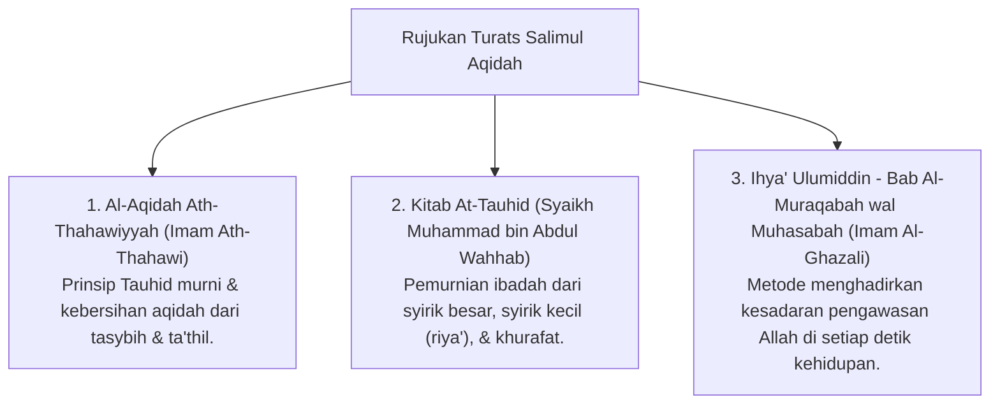

# P3-04-01-Filosofi-dan-Landasan-Turats (Salimul Aqidah)

## Tujuan
Membedah landasan filosofis, ontologis, dan rujukan kitab Turats klasik mengenai hakikat **Salimul Aqidah (Kemurnian Tauhid)**, menguraikan dalil-dalil Al-Qur'an, Sunnah, dan konsensus ulama Ahlussunnah wal Jama'ah dalam membangun keyakinan iman yang kokoh pada jiwa santri.

---

## 1. Landasan Nash Al-Qur'an & As-Sunnah

### 1. QS. Al-An'am [6]: 82
> الَّذِينَ آمَنُوا وَلَمْ يَلْبِسُوا إِيمَانَهُمْ بِظُلْمٍ أُولَٰئِكَ لَهُمُ الْأَمْنُ وَهُمْ مُهْتَدُونَ
> *"Orang-orang yang beriman dan tidak mencampuradukkan iman mereka dengan kezaliman (syirik), mereka itulah yang mendapat keamanan dan mereka itu adalah orang-orang yang mendapat petunjuk."*

### 2. HR. Muslim (Hadits Jibril tentang Ihsan)
> أَنْ تَعْبُدَ اللَّهَ كَأَنَّكَ تَرَاهُ، فَإِنْ لَمْ تَكُنْ تَرَاهُ فَإِنَّهُ يَرَاكَ
> *"Engkau beribadah kepada Allah seakan-akan engkau melihat-Nya. Dan jika engkau tidak mampu melihat-Nya, maka sesungguhnya Dia melihatmu."*

---

## 2. Rujukan Khazanah Turats Klasik

---

## 3. Status Dokumen
* **Status**: 🌟 **A+ (Tervalidasi & Siap Diimplementasikan)**
* **Level**: Project 3 - `03 Capacity Framework / 04 Salimul Aqidah / ./P3-04-02-Definisi-dan-Konseptualisasi.md`**.
