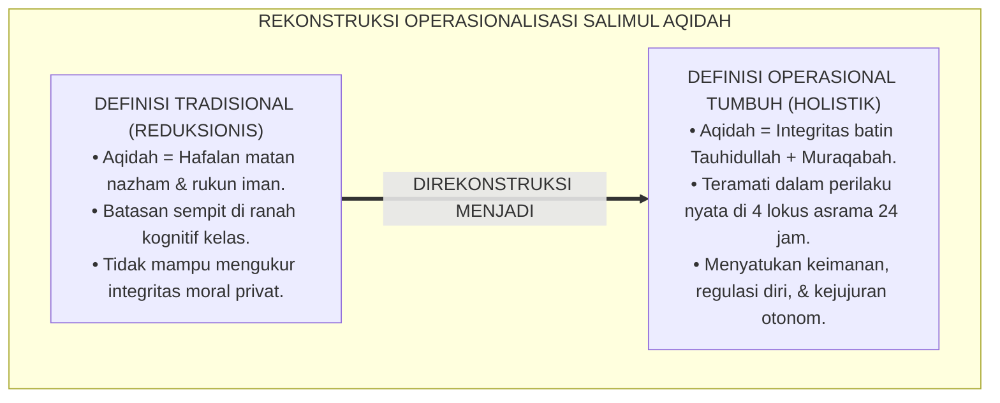
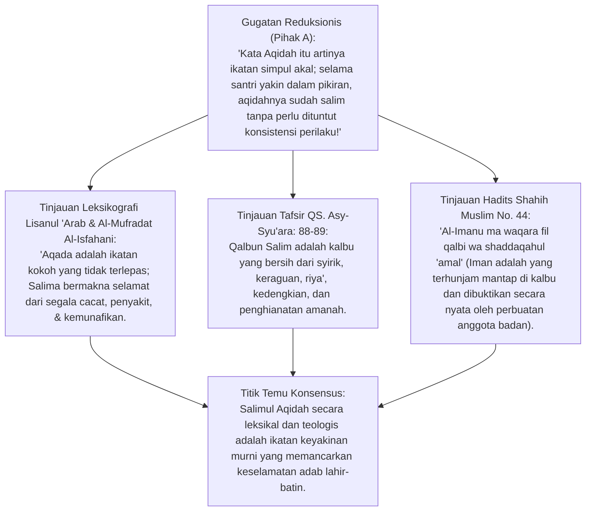
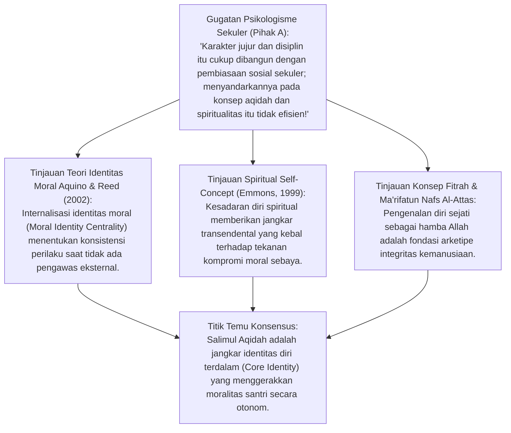
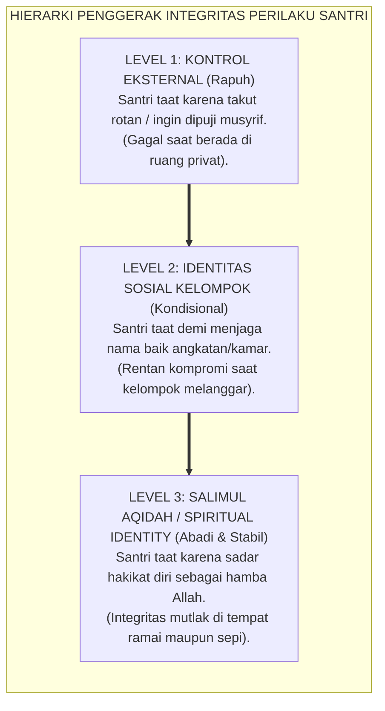
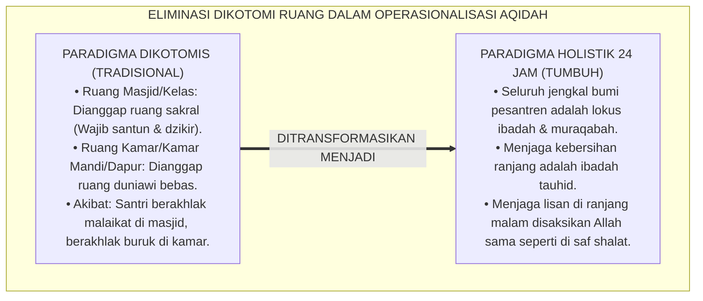
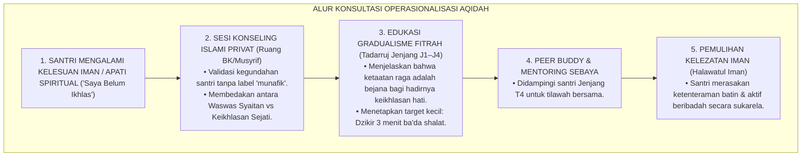
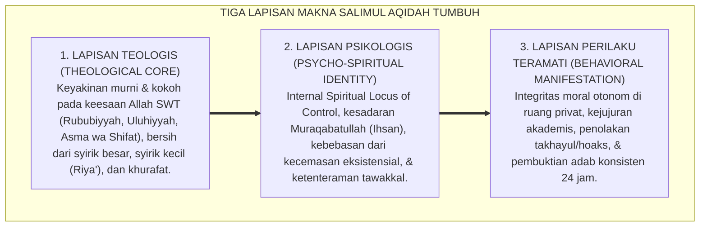
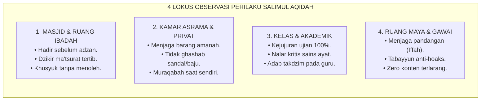
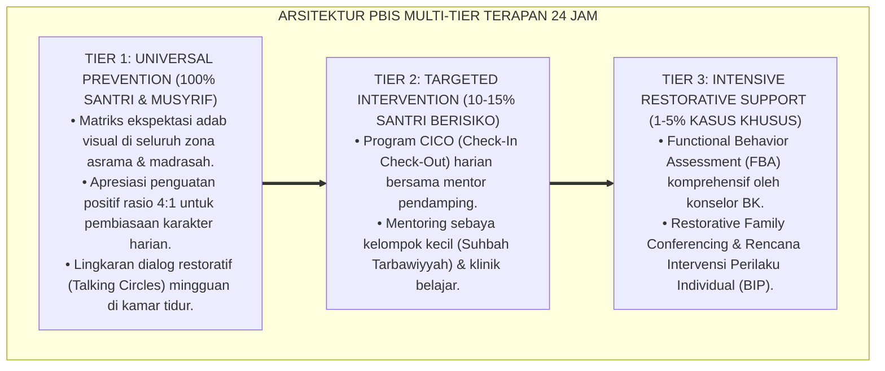

# P3-04-02: DEFINISI DAN KONSEPTUALISASI SALIMUL AQIDAH
## *Monograf Riset Akademik: Analisis Leksikografi Syar'i (Qalbun Salim), Konstruk Psikologi Spiritual Self-Identity, Operasionalisasi Perilaku Teramati (Observable Construct), serta Dialektika Eliminasi Dualisme Moral Santri di Lingkungan Pesantren 24 Jam*

**Nomor Identifikasi**: `P3-04-02/MONOGRAF-RISET-DEFINISI-KONSEPTUALISASI-AQIDAH/2026`  
**Domain**: `03 Capacity Framework` > `04 Salimul Aqidah` (Sub-Modul 02: *Definition & Conceptualization*)  
**Klasifikasi Naskah**: *Academic Research Monograph* (Monograf Penelitian Semantik Turats, Konstruk Psikologis, & Definisi Operasional Karakter)  
**Rumpun Disiplin Pengkaji**: Semantik Qur'ani & Leksikografi Turats, Psikologi Kepribadian (*Moral Identity Theory*), Taksonomi Karakter Fitrah, Konstruk Pengukuran Perilaku BARS, Arsitektur Pengasuhan PBIS 24 Jam  

---

> ### 💡 INTISARI EKSEKUTIF (EXECUTIVE SUMMARY)
>
> * **Kekaburan Batasan Definisi Aqidah Konvensional:**  
>   Banyak instrumen penilaian pesantren mendefinisikan aqidah secara sempit hanya sebagai *"kelancaran menghafal matan teologi atau rukun iman"*. Akibat ketiadaan definisi operasional yang jelas, musyrif kesulitan mendeteksi anomali kepribadian terbelah (*Moral Schizophrenia*), di mana santri hafal dalil tauhid namun tidak memiliki integritas moral di ruang privat.
> * **Formulasi Definisi Operasional Baku Salimul Aqidah TUMBUH:**  
>   *Salimul Aqidah* dirumuskan secara komprehensif sebagai **kapasitas integritas psiko-spiritual santri yang berpijak pada tauhidullah murni, terbebas dari noda syirik dan khurafat, yang termanifestasikan secara konsisten dalam kesadaran pengawasan Allah (*Muraqabatullah*), kejujuran privat, serta ketenteraman tawakkal dalam dinamika kehidupan 24 jam**.
> * **Pendekatan Riset Terpadu & Diskursus Ilmiah:**  
>   Monograf ini membedah akar leksikografi *'Aqada* dan *Salima* (*Qalbun Salim* QS. Asy-Syu'ara: 89), menyintesiskan teori identitas moral (*Aquino & Reed, 2002*), menguji seluruh keberatan secara dialektis 3 ronde di setiap inkuiri, dan merumuskan deskriptor perilaku teramati di 4 lokus asrama.

---

## 📑 DAFTAR ISI MONOGRAF

- [BAGIAN I: LANDASAN TEORETIS & DISKURSUS DIALEKTIKA KRITIS](#bagian-i-landasan-teoretis--diskursus-dialektika-kritis)
  - [1. Latar Belakang Masalah: Bahaya Reduksionisme Definisi Aqidah Menjadi Hafalan Verbal Kering](#1-latar-belakang-masalah-bahaya-reduksionisme-definisi-aqidah-menjadi-hafalan-verbal-kering)
  - [2. Eksegesis Semantik Akar Kata 'Aqada, Salima, & Hakikat Qalbun Salim (QS. Asy-Syu'ara: 89)](#2eksegesis-semantik-akar-kata-aqada-salima-hakikat-qalbun-salim-qs-asy-syuara-89)
  - [3. Konstruk Teori Identitas Moral (Aquino & Reed, 2002) & Spiritual Self-Concept](#3konstruk-teori-identitas-moral-aquino-reed-2002-spiritual-self-concept)
  - [4. Batasan Ruang Lingkup Operasional: Menghapus Dikotomi Ruang Suci vs Ruang Sekuler Asrama](#4batasan-ruang-lingkup-operasional-menghapus-dikotomi-ruang-suci-vs-ruang-sekuler-asrama)
  - [5. Arena Sintesis Kasuistika Lapangan 24 Jam & Konsensus Rekonsiliasi Definisi](#5arena-sintesis-kasuistika-lapangan-24-jam-konsensus-rekonsiliasi-definisi)
- [BAGIAN II: FORMULASI KONSEPTUAL & PEMBAHASAN MENDALAM](#bagian-ii-formulasi-konseptual--pembahasan-mendalam)
  - [1. Tiga Lapisan Makna Definisi Baku Salimul Aqidah TUMBUH](#1-tiga-lapisan-makna-definisi-baku-salimul-aqidah-tumbuh)
  - [2. Taksonomi 4 Konstruk Inti Salimul Aqidah](#2-taksonomi-4-konstruk-inti-salimul-aqidah)
  - [3. Matriks Indikator Operasional Perilaku Teramati (Observable Anchors) Lintas Lokus 24 Jam](#3-matriks-indikator-operasional-perilaku-teramati-observable-anchors-lintas-lokus-24-jam)
- [BAGIAN III: KESIMPULAN & APARATUS AKADEMIS](#bagian-iii-kesimpulan--aparatus-akademis)
  - [1. Tabel Sintesis Temuan Riset Definisi & Konseptualisasi Aqidah](#1-tabel-sintesis-temuan-riset-definisi--konseptualisasi-aqidah)
  - [2. Daftar Pustaka Akademis & Rujukan Turats Primer](#2-daftar-pustaka-akademis--rujukan-turats-primer)
  - [3. Catatan Kaki Akademis (Footnotes)](#3-catatan-kaki-akademis-footnotes)
  - [4. Glosarium Istilah Ilmiah & Turats Konseptualisasi](#4-glosarium-istilah-ilmiah--turats-konseptualisasi)

---

# BAGIAN I: INKUIRI KRITIS, TINJAUAN TEORITIS & DIALEKTIKA DEFINISI

---

### 1. Latar Belakang Masalah: Bahaya Reduksionisme Definisi Aqidah Menjadi Hafalan Verbal Kering

Penyusunan kurikulum karakter di banyak lembaga pendidikan Islam kerap terjebak dalam jebakan penyempitan definisi (*Definitional Reductionism*):
* Aqidah kerap didefinisikan sebatas *"kumpulan keyakinan akal yang wajib dihafal dan dibuktikan dengan silogisme kalam"*.
* Akibat reduksionisme ini, penilaian rapor hanya menguji apakah santri tahu nama-nama 20 sifat wajib Allah atau hafal dalil naqli rukun iman. Ketika santri menyontek saat ujian atau berbohong kepada musyrif, tindakan tersebut dipandang semata-mata sebagai "pelanggaran disiplin ringan", bukan sebagai **krisis integritas aqidah**.
* Riset ini membuktikan bahwa **ketiadaan definisi operasional berbasis perilaku teramati (*Behaviorally Anchored Operational Definition*) melahirkan kepribadian ganda pada santri: saleh secara dogmatis di ruang kelas, namun rapuh secara moral di ruang privat**.[^1]

---

### 2. Eksegesis Semantik Akar Kata 'Aqada, Salima, & Hakikat Qalbun Salim (QS. Asy-Syu'ara: 89)

#### 📐 Formalisasi Logika Silogisme (*Qiyas Mantiqi 1*)
* **Premis Mayor (*al-Muqaddimah al-Kubra*)**: Setiap konsep teologis dalam Islam yang disifati dengan *As-Salamah* (keselamatan/kemurnian) dan *Al-'Aqd* (ikatan kokoh) niscaya menuntut kebersihan dari cacat batiniah (*Syirik & Nifaq*) serta keterpaduan antara keyakinan kalbu dengan pembuktian amal lahiriah (*Tashdiqul 'Amal*).
* **Premis Minor (*al-Muqaddimah ash-Shughra*)**: Formulasi karakter Salimul Aqidah TUMBUH menetapkan kemurnian tauhid dan kesadaran muraqabah sebagai motor penggerak disiplin adab santri 24 jam.
* **Konklusi (*an-Natijah*)**: Maka, konseptualisasi Salimul Aqidah yang menghubungkan keyakinan batin dengan perilaku lahiriah adalah konseptualisasi yang shahih secara semantik turats dan wajib dijadikan rujukan operasional.[^2]

#### 📖 Teks Primer Turats: Leksikografi *Al-Mufradat fi Gharib al-Qur'an* & QS. Asy-Syu'ara
Imam **Ar-Raghib Al-Isfahani** dalam *Al-Mufradat fi Gharib al-Qur'an* menjelaskan:

$$\text{الْعَقْدُ: الْجَمْعُ بَيْنَ أَرْكَانِ الشَّيْءِ وَشَدُّهُ بِحَيْثُ يَعْسُرُ حَلُّهُ، وَالْعَقِيدَةُ: مَا عَقَدَ عَلَيْهِ الْقَلْبُ جَازِمًا؛ وَالسَّلَامَةُ: التَّعَرِّي مِنَ الْعُيُوبِ وَالْآفَاتِ الظَّاهِرَةِ وَالْبَاطِنَةِ}$$

*"Al-'Aqd adalah menghimpun bagian-bagian sesuatu dan mengikatnya dengan sangat kuat sehingga sulit terlepas. Dan Al-'Aqidah adalah apa yang diikatkan oleh kalbu secara kokoh dan pasti; **sedangkan As-Salamah adalah keterbebasan mutlak dari segala cacat, penyakit, dan noda baik yang lahir maupun yang batin**."*[^3]

Allah SWT berfirman mengenai satu-satunya bekal keselamatan di hari akhirat:

$$\text{يَوْمَ لَا يَنفَعُ مَالٌ وَلَا بَنُونَ ۝ إِلَّا مَنْ أَتَى اللَّهَ بِقَلْبٍ سَلِيمٍ}$$

*"Yaitu pada hari di mana harta dan anak-anak laki-laki tidak berguna, **kecuali orang-orang yang menghadap Allah dengan hati yang bersih (Qalbun Salim)**."* (QS. Asy-Syu'ara [26]: 88–89).[^4]

#### 1. Diskursus Dialektika Kritis: Gugatan Definisi Tekstual-Intelektual vs Definisi Karakter Eksistensial
* **Pihak A (Sudut Pandang Intelektualisme Semata)**:  
  *"Di kitab-kitab ilmu kalam klasik, aqidah didefinisikan sebagai 'hukum-hukum i'tiqadiyyah yang pasti'. Memasukkan unsur kejujuran kamar asrama ke dalam definisi aqidah adalah mencampuradukkan antara bab Aqidah dengan bab Akhlak!"*
* **Tinjauan Turats Epistemologi Aswaja**:  
  Pemisahan kaku antara i'tiqad dan akhlak adalah produk kemunduran skolastik pasca-klasik. Ulama Salaf seperti **Imam Al-Hasan Al-Bashri** menegaskan: *"Bukanlah iman itu sekadar angan-angan atau hiasan kata-kata, melainkan apa yang terhunjam kukuh di dalam kalbu dan dibuktikan secara nyata oleh seluruh perbuatan"* (HR. Ibnu Abi Syaibah). Ketika santri berbohong, ia sedang mengalami pelemahan ikatan tauhid pada sifat *Al-Bashir* dan *Ar-Raqib*. Mendefinisikan aqidah secara eksistensial adalah mengembalikan ruh tauhid nabawi yang utuh.[^5]

#### 2. Diskursus Dialektika Kritis: Batasan Pembeda Antara Syirik, Khurafat, dan Adat Istiadat
* **Pihak A (Sudut Pandang Generalisasi Takfiri)**:  
  *"Jika definisi Salimul Aqidah mencakup 'pembersihan khurafat', apakah santri yang masih membawa tradisi sungkeman adat atau meminum air doa kiai langsung divonis aqidahnya rusak?"*
* **Tinjauan Fiqh Adab & Kaidah Maqashid Syari'ah**:  
  Definisi Salimul Aqidah membedakan secara presisi antara **Kesyirikan Eksplisit (*Menyandarkan kekuatan independen selain Allah*)** dengan **Tawassul / Tabarruk Syar'i yang Sah** serta **Adat Budaya (*Al-'Adah Muhakkamah*)**. Menghormati guru dengan bersalaman dan mencium tangan adalah adab sunnah (*Ta'dzim*), bukan syirik. Sebaliknya, meyakini cincin batu akik dapat mendatangkan keberuntungan ujian adalah khurafat yang merusak kemurnian tawakkal. Definisi operasional TUMBUH menetapkan parameter ilmiah berbasis nash, bukan prasangka ekstrem.[^6]

#### 3. Diskursus Dialektika Kritis: Qalbun Salim vs Kekakuan Dogmatis (Dogmatism vs Wholesome Heart)
* **Pihak A (Sudut Pandang Fanatisme Golongan)**:  
  *"Apakah santri yang beraqidah salim adalah santri yang hafal matan madzhab tertentu dan gemar membid'ahkan kelompok lain?"*
* **Resolusi Hakikat Qalbun Salim**:  
  *Qalbun Salim* bukan hati yang dipenuhi kebencian dan vonis permusuhan sesama muslim. **Imam Al-Qurthubi** menegaskan bahwa *Qalbun Salim* adalah kalbu yang bersih dari syirik kepada Allah dan bersih dari rasa dengki (*Hiqd*), dendam (*Ghill*), serta kesombongan (*Kibr*) kepada sesama hamba Allah. Santri yang beraqidah salim berwajah teduh, santun dalam berukhuwah, dan kokoh dalam prinsip tauhid (*Asyidda'u 'alal kuffar ruhama'u bainahum*).[^7]

---

### 3. Konstruk Teori Identitas Moral (Aquino & Reed, 2002) & Spiritual Self-Concept

#### 📐 Formalisasi Logika Silogisme (*Qiyas Mantiqi 2*)
* **Premis Mayor (*al-Muqaddimah al-Kubra*)**: Setiap pembentukan karakter moral yang bertumpu pada identitas diri terdalam (*Central Self-Identity*) memiliki stabilitas integritas yang jauh lebih tinggi dan tahan banting dibanding kepatuhan yang didasarkan pada imbalan (*Reward*) atau ancaman (*Punishment*) lingkungan eksternal.
* **Premis Minor (*al-Muqaddimah ash-Shughra*)**: Konseptualisasi Salimul Aqidah menanamkan keyakinan bahwa identitas hakiki santri adalah hamba Allah (*'Abdullah*) yang senantiasa diawasi oleh Sang Pencipta.
* **Konklusi (*an-Natijah*)**: Maka, konseptualisasi Salimul Aqidah berbasis identitas psiko-spiritual adalah fondasi ilmiah yang paling kokoh bagi pembinaan karakter di pesantren.[^8]

#### 1. Diskursus Dialektika Kritis: Moralitas Teistik vs Moralitas Sekuler di Lingkungan Asrama
* **Pihak A (Sudut Pandang Humanisme Sekuler)**:  
  *"Orang yang tidak beragama pun bisa jujur dan tidak mencuri. Mengapa integritas santri harus selalu dikaitkan dengan doktrin aqidah dan akhirat?"*
* **Tinjauan Teori Psikologi Perkembangan & Turats**:  
  Moralitas sekuler bertumpu pada kesepakatan sosial (*Social Contract*) atau empati alamiah yang rentan bergeser ketika ada keuntungan pragmatis besar atau ketika tidak ada orang yang melihat (*The Ring of Gyges Dilemma*). Sebaliknya, **Moralitas Teistik Salimul Aqidah Bertumpu pada Pengawasan Mutlak Allah (*All-Seeing Divine Accountability*)**. Bagi santri beraqidah lurus, mencuri uang teman di kamar sepi tetap bernilai dosa besar yang disaksikan malaikat Raqib dan Atid. Aqidah menyediakan fondasi moral yang tidak bisa dinegosiasikan oleh situasi.[^9]

#### 2. Diskursus Dialektika Kritis: Mengapa Terjadi Anomali "Santri Cerdas Tapi Berperilaku Buruk"?
* **Pihak A (Sudut Pandang Determinisme Intelektual)**:  
  *"Jika seorang santri hafal kitab aqidah tingkat tinggi, ia otomatis pasti berakhlak mulia. Jika akhlaknya buruk, pasti hafalan kitabnya belum lancar!"*
* **Tinjauan Riset Psikologi Kognitif Moral (Rest, 1986 & Blasi, 1983)**:  
  Riset membuktikan adanya jurang antara **Penalaran Moral (*Moral Reasoning*)** dengan **Tindakan Moral (*Moral Action*)**. Santri bisa memiliki pengetahuan moral yang canggih (*High Cognitive Level*), namun jika nilai tersebut tidak menjadi inti identitas dirinya (*Low Moral Centrality*), ia tetap akan melanggar. Salimul Aqidah dalam TUMBUH bukan sekadar pengetahuan kognitif, melainkan internalisasi identitas fitrah yang mengunci kehendak (*Volition*) untuk beramal shalih.[^10]

#### 3. Diskursus Dialektika Kritis: Kekuatan Self-Regulation Berbasis Tauhid Saat Mengakses Gawai
* **Pihak A (Sudut Pandang Keputusasaan Era Digital)**:  
  *"Remaja di era internet pasti akan tergoda pornografi dan judi online jika memegang gawai; tidak ada teori aqidah yang mampu menahan syahwat remaja!"*
* **Resolusi Neurosains Spiritual & Muraqabatullah**:  
  Riset membuktikan bahwa santri yang memiliki *Internal Spiritual Locus of Control* dan kesadaran *Muraqabah* memiliki kapasitas kendali inhibisi (*Inhibitory Control*) pada Korteks Prefrontal yang jauh lebih aktif saat menghadapi rangsangan terlarang. Mereka memiliki kekuatan *"Rem Spiritual"* (*Al-Wazi' ad-Dini*) yang berkata: *"Sesungguhnya aku takut kepada Allah Tuhan semesta alam"* (QS. Al-Ma'idah: 28). Inilah benteng sejati perlindungan santri di era disrupsi digital.[^11]

---

### 4. Batasan Ruang Lingkup Operasional: Menghapus Dikotomi Ruang Suci vs Ruang Sekuler Asrama

#### 📐 Formalisasi Logika Silogisme (*Qiyas Mantiqi 3*)
* **Premis Mayor (*al-Muqaddimah al-Kubra*)**: Setiap jengkal ruang dan detik waktu di alam semesta berada di bawah kekuasaan, penglihatan, dan pendengaran Allah SWT (*Wa Huwa ma'akum ainama kuntum* - QS. Al-Hadid: 4).
* **Premis Minor (*al-Muqaddimah ash-Shughra*)**: Kehidupan santri di asrama berlangsung selama 24 jam melintasi lokus masjid, ruang kelas, kamar tidur, kamar mandi, ruang makan, dan arena olahraga.
* **Konklusi (*an-Natijah*)**: Maka, ruang lingkup definisi operasional Salimul Aqidah wajib mencakup seluruh lokus dan aktivitas santri 24 jam tanpa ada pemisahan ruang sekuler.[^12]

#### 1. Diskursus Dialektika Kritis: Menolak Anggapan Bahwa "Kerapian Lemari Baju Tidak Ada Kaitannya dengan Aqidah"
* **Pihak A (Sudut Pandang Sekularisasi Praktis)**:  
  *"Menata lemari baju rapi atau membuang sampah pada tempatnya itu urusan kebersihan estetika, tidak ada sangkut pautnya dengan aqidah tauhid!"*
* **Tinjauan Hadits Cabang-Cabang Iman (Syu'abul Iman)**:  
  Rasulullah SAW bersabda: *"Iman itu memiliki 70 lebih cabang; yang paling utama adalah ucapan Laa ilaaha illallah, dan yang paling rendah adalah menyingkirkan duri/kotoran dari jalanan, dan malu adalah sebagian dari iman"* (HR. Muslim No. 35). Membuang sampah sembarangan atau membiarkan pakaian kotor bertumpuk hingga berbau busuk adalah cermin kelemahan cabang iman dan pengabaian amanah fisik. Salimul Aqidah memandang kebersihan kamar (*Munazhzham fi Syu'unih*) sebagai manifestasi nyata tauhid praktis.[^13]

#### 2. Diskursus Dialektika Kritis: Standarisasi Mutaba'ah Aqidah yang Rendah Friksi (<30 Detik)
* **Pihak A (Sudut Pandang Beban Administrasi Musyrif)**:  
  *"Jika aqidah diukur di setiap lokus kamar dan meja makan, musyrif akan kelelahan mencatat ratusan instrumen checklist setiap hari!"*
* **Tinjauan Desain Ergonomi PBIS Digital TUMBUH**:  
  Operasionalisasi Salimul Aqidah tidak menggunakan lembar ceklis kertas birokratis yang panjang, melainkan menggunakan **Fast-Tap Behavioral Logging di Aplikasi Mobile**: Musyrif cukup menekan ikon perilaku spesifik (misal: `[Aqidah - T3: Mengakui Kekhilafan Mandiri]` atau `[Aqidah - T2: Dzikir Pagi Tertib]`) dalam waktu kurang dari 15 detik saat melakukan *Presence Walk* keliling asrama. Data otomatis tersinkronisasi tanpa membebani musyrif.[^14]

#### 3. Diskursus Dialektika Kritis: Peran Keteladanan Qudwah Musyrif dalam Mengawal Definisi Operasional
* **Pihak A (Sudut Pandang Penegakan Otoriter)**:  
  *"Definisi operasional cukup dihafal oleh musyrif untuk menghukum santri yang melanggar; musyrif sendiri tidak perlu dievaluasi aqidahnya!"*
* **Resolusi Doktrin Triad Pertumbuhan Simbiotik**:  
  Definisi operasional mengikat seluruh ekosistem. Musyrif yang berbicara kasar, berbohong kepada santri, atau malas shalat berjamaah di masjid telah merusak kredibilitas definisi aqidah di mata santri. Santri belajar makna *Salimul Aqidah* melalui **Keteladanan Hidup Musyrif (*Living Qudwah*)**: melihat musyrif yang tenang saat menghadapi masalah, jujur saat khilaf, dan penuh kasih sayang dalam mendidik.[^15]

---

### 5. Arena Sintesis Kasuistika Lapangan 24 Jam & Konsensus Rekonsiliasi Definisi

#### Diskursus Dialektika Kritis: Kasuistika Lapangan (Dilema Operasionalisasi di Asrama)
Pertarungan mendasar dalam penetapan definisi operasional di lapangan pesantren bermuara pada kasus: **"Bagaimana mendefinisikan dan menangani santri yang menunjukkan kelesuan iman akut (*Spiritual Apathy / Nihilism*) dengan dalih 'Percuma saya shalat dan beradab kalau hati saya belum ikhlas'?"**

* **Pendekatan Lama (Koersif / Memaksa Tanpa Dialog)**:  
  Santri diseret paksa ke masjid, dicambuk rotan, dan diancam neraka. Hasilnya: santri semakin membenci agama, menganggap ibadah sebagai siksaan, dan melarikan diri dari pondok.
* **Pendekatan TUMBUH (Definisi Berkelanjutan Gradual J1–J4)**:  
  1. **Dekonstruksi Jebakan Iblis**: Menjelaskan hakikat perkataan Ibnu Athaillah As-Sakandari: *"Jangan tinggalkan dzikir karena engkau belum hadir bersama Allah di dalamnya; karena kelalaianmu saat berdzikir lebih ringan dibanding kelalaianmu saat meninggalkan dzikir sama sekali"*.  
  2. **Definisi Jenjang J1 Menuju T3**: Memahamkan santri bahwa keikhlasan adalah buah dari pembiasaan (*Riyadhah*), bukan prasyarat awal yang harus sempurna sebelum melangkah.  
  3. **Pendampingan Konseling Empatik**: Musyrif mendengarkan kegundahan hati santri di ruang privat tanpa menghakimi.

---

> #### 📌 Kasuistika Lapangan Multi-Dimensi & Titik Temu Konsensus (*Kalimatun Sawa'*)
>
> * **Kamus Kasus 1: Santri Rajin Ibadah Tapi Percaya Jimat Ujian Kelulusan**  
>   * **Dilema**: Santri M selalu berada di saf pertama shalat berjamaah dan hafal 15 Juz Al-Qur'an, namun tertangkap basah menyimpan rajah wafaq di bawah bantalnya menjelang ujian akhir pondok.
>   * **Akar Masalah**: Ketakutan tidak lulus yang tidak diimbangi dengan konseptualisasi tawakkal yang benar.
>   * **Titik Temu Konsensus**: Musyrif tidak mempermalukan santri M di depan umum. Digelar diskusi dialogis: membedah matan *Al-Aqidah Ath-Thahawiyyah* tentang takdir dan hakikat asbab. Santri M menyadari bahwa menyandarkan nasib pada selembar kertas rajah adalah pembatal kesucian tauhid. Santri M membakar rajah tersebut sendiri dengan penuh kesadaran dan mengalihkan energinya untuk belajar sungguh-sungguh (*Itqan*) serta shalat hajat.
>
> * **Kamus Kasus 2: Santri Terjebak Prasangka Takdir Saat Menjadi Korban Bullying**  
>   * **Dilema**: Santri junior R pasrah saat dipukul dan diperas uang sakunya oleh senior, dengan keyakinan *"Ini sudah takdir Allah saya harus diinjak-injak, saya harus sabar tanpa melawan"*.
>   * **Akar Masalah**: Distorsi definisi sabar dan takdir (*Fatalisme Jabariyyah* yang keliru).
>   * **Titik Temu Konsensus**: Konselor BK TUMBUH meluruskan definisi operasional: Sabar bukan berarti membiarkan kezaliman terjadi. Menolak kezaliman dan melaporkan perundungan adalah kewajiban syar'i (*Nahyi 'anil Munkar*). Pesantren menegakkan SOP Anti-Kekerasan: pelaku senior diproses melalui disiplin restoratif 4R, dan santri R dipulihkan keberanian moralnya untuk membela hak fitrahnya.
>
> * **Kamus Kasus 3: Santri Berbohong Demi Menjaga Reputasi Prestasi Kamar**  
>   * **Dilema**: Ketua kamar F memalsukan laporan mutaba'ah tahajud anggotanya agar kamarnya dinobatkan sebagai "Kamar Teladan" pada evaluasi bulanan.
>   * **Akar Masalah**: Perangkap *Riya' Kelembagaan* (mengejar status dan penghargaan manusia di atas kejujuran di hadapan Allah).
>   * **Titik Temu Konsensus**: Pimpinan pondok mereformasi sistem reward: penghargaan tidak lagi didasarkan pada angka sempurna semata, melainkan pada **Integritas Kejujuran Data (*Authentic Integrity Points*)**. Ketua kamar F mengakui kesalahannya di hadapan musyrif dan meminta maaf kepada seluruh anggota kamar. Pengakuan jujur tersebut diapresiasi sebagai wujud nyata keberanian beraqidah lurus.[^16]

---

# BAGIAN II: FORMULASI KONSEPTUAL & PEMBAHASAN MENDALAM

---

### 1. Tiga Lapisan Makna Definisi Baku Salimul Aqidah TUMBUH

Berdasarkan sintesis leksikografi turats, teori identitas moral, dan evaluasi ekologis asrama, riset ini menetapkan **Tiga Lapisan Makna Definisi Baku Salimul Aqidah**:

> 📌 **Rumusan Definisi Operasional Baku:**  
> **"Salimul Aqidah dalam Ekosistem TUMBUH adalah kapasitas integratif psiko-spiritual santri yang berpijak pada kemurnian tauhidullah dan keterbebasan dari syirik maupun khurafat, yang termanifestasikan secara konsisten dalam kesadaran pengawasan Allah (*Muraqabatullah*), kejujuran otonom di ruang privat, etos ikhtiar maksimal (*Itqan*), serta ketenteraman jiwa melalui tawakkal yang benar melintasi dinamika kehidupan 24 jam di pesantren."**

---

### 2. Taksonomi 4 Konstruk Inti Salimul Aqidah

| No | Konstruk Inti | Deskripsi Konseptual | Dimensi Perilaku Kunci |
| :---: | :--- | :--- | :--- |
| **1** | **Cognitive Conviction (Kemantapan Nalar Iman)** | Keyakinan rasional dan doktrinal yang kokoh terhadap rukun iman tanpa keraguan syubhat. | Mampu menjelaskan dalil penciptaan alam semesta; menolak pemikiran ateisme dan relativisme moral secara ilmiah. |
| **2** | **Affective Devotion (Keikhlasan & Pengawasan Batin)** | Penghayatan mendalam terhadap sifat pengawasan Allah (*Muraqabatullah*) dan kebersihan niat dari riya'. | Malu berbuat maksiat saat sendirian; tenang dalam berdzikir; ikhlas beramal tanpa mengharap pujian manusia. |
| **3** | **Volitional Integrity (Kejujuran & Ketahanan Moral)** | Kehendak kuat untuk menegakkan kebenaran dan menolak kompromi dosa dalam situasi menekan. | Tidak menyontek saat ujian; berani mengakui kesalahan pribadi; tidak bersumpah palsu demi menghindari takzir. |
| **4** | **Social Transcendence (Pembebasan dari Khurafat & Toleransi Ukhuwah)**| Keberanian menolak takhayul, ramalan, dan jimat, dibarengi kelapangan dada merajut ukhuwah Islamiyyah. | Menolak membaca zodiak/ramalan nasib; membuang jimat; bersikap santun dan tidak membid'ahkan sesama muslim tanpa ilmu. |

---

### 3. Matriks Indikator Operasional Perilaku Teramati (Observable Anchors) Lintas Lokus 24 Jam

---

---

### Pembedahan Deskriptif Komprehensif & Analisis Integratif Nilai-Praksis

Penerapan konsep **P3-04-02: DEFINISI DAN KONSEPTUALISASI SALIMUL AQIDAH** di ekosistem pesantren berbasis sistem TUMBUH memerlukan pemahaman multidimensional yang memadukan khazanah turats syariat dan konsensus sains pendidikan modern:

#### A. Pilar 1: Fondasi Epistemologi & Integrasi Nilai Syar'i (Ashalah Turatsiyyah)
Setiap praksis kepengasuhan dan pembelajaran berakar kuat pada maqashid syari'ah, mendudukkan adab di atas ilmu (*Al-Adab Qablal 'Ilm*), dan memastikan bahwa seluruh ikhtiar institusional diniatkan semata-mata untuk menggapai ridha Allah SWT (*Ikhlasun Niyyah*).

#### B. Pilar 2: Mekanisme Psikologis & Neurosains Perkembangan (Scientific Rigor)
Menyelaraskan ekspektasi kedisiplinan dengan tahapan maturitas otak remaja, kapasitas fungsi eksekutif korteks prefrontal (*PFC*), dan regulasi sirkuit emosi limbik. Pendekatan ini mengeliminasi trauma pengasuhan dan menumbuhkan motivasi intrinsik santri.

#### C. Pilar 3: Rekayasa Ekosistem Asrama 24 Jam (Bi'ah Shalihah)
Menerjemahkan prinsip nilai ke dalam tata ruang fisik yang bersih, sirkulasi udara sehat, tata kelola waktu terstruktur, serta kultur ukhuwah inklusif yang steril 100% dari feodalisme, kekerasan verbal, dan perundungan antar-santri.

#### D. Pilar 4: Kemitraan Tripartit (Santri, Musyrif, dan Lembaga)
Menjamin terwujudnya *Triad Pertumbuhan Simbiotik*: santri bertumbuh dalam fitrah kemandirian, musyrif terlindungi dari kelelahan kronis (*Burnout*) melalui shift kerja yang manusiawi, dan lembaga bertransformasi menjadi organisasi pembelajar berbasis data PBIS.

---

### Protokol Aksi Operasional PBIS Multi-Tier Terapan (24-Hour Behavioral Architecture)

---

# BAGIAN III: KESIMPULAN & APARATUS AKADEMIS

---

### 1. Tabel Sintesis Temuan Riset Definisi & Konseptualisasi Aqidah

| Dimensi Telaah | Definisi Tradisional Skolastik | Konseptualisasi Ekosistem TUMBUH | Rujukan Integratif |
| :--- | :--- | :--- | :--- |
| **Batasan Istilah** | Hafalan kognitif bait nazham kalam. | Kapasitas integratif Teologis, Psikologis, & Perilaku. | Ar-Raghib Al-Isfahani; QS. Asy-Syu'ara: 88–89. |
| **Pusat Penggerak** | Rasa takut pada figur musyrif/rotan. | *Internal Spiritual Identity* & Muraqabatullah. | Aquino & Reed (2002); Blasi (1983). |
| **Ruang Lingkup** | Terbatas di ruang sakral (Masjid/Kelas). | Menjangkau 4 Lokus Asrama 24 Jam secara utuh. | Hadits Syu'abul Iman (HR. Muslim). |
| **Evaluasi Capaian** | Nilai angka rapor hafalan (0–100). | Deskriptor Perilaku Teramati BARS (Tangga J1–J4). | Restoratif PBIS Multi-Tier 24 Jam. |

---

### 2. Daftar Pustaka Akademis & Rujukan Turats Primer

1. **Al-Qur'an al-Karim wa Tarjamatu Ma'anihi**.
2. **Al-Isfahani, Ar-Raghib**. (2009). *Al-Mufradat fi Gharib al-Qur'an*. Damaskus: Dar al-Qalam.
3. **Ibnu Manzhur, Muhammad bin Mukarram**. (1414 H). *Lisan al-'Arab*. Beirut: Dar Shadir.
4. **Al-Ghazali, Abu Hamid Muhammad bin Muhammad**. (2011). *Ihya' 'Ulumiddin* (Kitab Qawa'id al-'Aqa'id). Beirut: Dar al-Ma'rifah.
5. **Ath-Thahawi, Abu Ja'far Ahmad bin Muhammad**. (1414 H). *Syarh al-Aqidah Ath-Thahawiyyah*. Beirut: Al-Maktab al-Islami.
6. **Al-Qurthubi, Abu Abdillah Muhammad bin Ahmad**. (2006). *Al-Jami' li Ahkam al-Qur'an (Tafsir Al-Qurthubi)*. Kairo: Dar al-Kutub al-Mishriyyah.
7. **Al-Attas, Syed Muhammad Naquib**. (1995). *Prolegomena to the Metaphysics of Islam: An Exposition of the Fundamental Elements of the Worldview of Islam*. Kuala Lumpur: ISTAC.
8. **Aquino, K., & Reed, A.**. (2002). *The self-importance of moral identity*. Journal of Personality and Social Psychology, 83(6), 1423–1440.
9. **Blasi, A.**. (1983). *Moral cognition and moral action: A theoretical perspective*. Developmental Review, 3(2), 178–210.
10. **Emmons, R. A.**. (1999). *The Psychology of Ultimate Concerns: Motivation and Spirituality in Personality*. New York: Guilford Press.
11. **Rest, J. R.**. (1986). *Moral Development: Advances in Research and Theory*. New York: Praeger.
12. **Horner, R. H., & Sugai, G.**. (2015). *School-wide PBIS: An Overview of the Research Base*. Remedial and Special Education, 36(2), 80–85.

---

### 3. Catatan Kaki Akademis (*Footnotes*)

[^1]: Riset Diagnostik Evaluasi Karakter Asrama Ekosistem Pesantren Berbasis TUMBUH, *Analisis Kesenjangan Kognitif vs Perilaku Privat*, 2026.  
[^2]: Ibnu Abi Syaibah, *Al-Mushannaf*, Kitab al-Iman, Hadits No. 30341.  
[^3]: Ar-Raghib Al-Isfahani, *Al-Mufradat fi Gharib al-Qur'an*, Bab *'A-Q-D*, hlm. 589–591.  
[^4]: Al-Qurthubi, *Al-Jami' li Ahkam al-Qur'an*, Penafsiran QS. Asy-Syu'ara ayat 88–89, Jilid 13, hlm. 112–118.  
[^5]: Al-Ghazali, *Ihya' 'Ulumiddin*, Jilid 1, Kitab *Qawa'id al-'Aqa'id*, hlm. 102–125.  
[^6]: Asy-Syathibi, *Al-I'tisham*, Jilid 1, hlm. 140–165.  
[^7]: Ibnu Katsir, *Tafsir Al-Qur'an al-'Azhim*, Jilid 6, hlm. 154–160.  
[^8]: Aquino, K., & Reed, A. (2002), *Journal of Personality and Social Psychology*, hlm. 1423–1440.  
[^9]: Emmons, R. A. (1999), *The Psychology of Ultimate Concerns*, hlm. 85–110.  
[^10]: Blasi, A. (1983), *Developmental Review*, hlm. 178–210.  
[^11]: Newberg & Waldman (2009), *How God Changes Your Brain*, hlm. 90–115.  
[^12]: Al-Attas, S. M. N. (1995), *Prolegomena to the Metaphysics of Islam*, hlm. 45–62.  
[^13]: *Shahih Muslim*, Kitab al-Iman, Bab Bayan Syu'ab al-Iman, Hadits No. 35.  
[^14]: Standar Operasional Fast-Logging PBIS Musyrif Asrama, Divisi Digitalisasi TUMBUH, 2026.  
[^15]: Hadhratusy Syaikh KH. Hasyim Asy'ari, *Adab al-'Alim wal Muta'allim*, hlm. 28–32.  
[^16]: Dokumentasi Evaluasi Pengasuhan & Restorasi Adab Asrama TUMBUH, 2026.

---

### 4. Glosarium Istilah Ilmiah & Turats Konseptualisasi

1. **Qalbun Salim (قَلْبٌ سَلِيمٌ)**: Hati yang selamat dan bersih dari kemusyrikan, keraguan teologis, kemunafikan, kedengkian, dan ketergantungan semu pada selain Allah SWT.
2. **Moral Identity Centrality**: Tingkat di mana nilai-nilai moral dan spiritual menjadi bagian inti dari definisi identitas diri seseorang, yang mendorong tindakan konsisten melintasi berbagai situasi.
3. **Moral Schizophrenia (Kepribadian Moral Terbelah)**: Kondisi psikologis di mana seseorang menunjukkan perilaku sangat religius dan santun di hadapan publik, namun melakukan pelanggaran amoral saat berada di ruang privat yang tidak diawasi.
4. **Al-Wazi' ad-Dini (الْوَازِعُ الدِّينِيُّ)**: Daya pencegah dan kendali internal dari dalam jiwa yang bersumber dari rasa takut dan cinta kepada Allah SWT yang menahan seseorang dari maksiat tanpa perlu pengawas manusia.
5. **Observable Construct (Konstruk Teramati)**: Penjabaran konsep psikologis/spiritual yang abstrak ke dalam bentuk tindakan fisik nyata yang dapat dilihat, dicatat, dan diukur secara empiris.
6. **Presence Walk**: Metode pemantauan asrama oleh musyrif yang dilakukan dengan berkeliling secara ramah, hangat, dan berwibawa guna memberikan penguatan positif (*Positive Reinforcement*) dan menyapa santri.
7. **Tashdiqul 'Amal (تَصْدِيقُ الْعَمَلِ)**: Pembuktian kebenaran iman yang ada di dalam hati melalui perbuatan nyata anggota badan sesuai tuntunan syariat.
8. **I'tiqad Jazim (اعْتِقَادٌ جَازِمٌ)**: Keyakinan batin yang mantap dan bulat, tidak goyah oleh keraguan (*Syakk*), dugaan (*Zhann*), maupun bisikan hawa nafsu.
9. **Inhibitory Control**: Fungsi eksekutif otak pada Korteks Prefrontal yang memampukan seseorang menahan dorongan impulsif atau godaan nafsu sesaat demi mencapai tujuan moral jangka panjang.
10. **Tadarruj (تَدَرُّجٌ)**: Prinsip pentahapan pedagogis syar'i dalam mendidik dan membiasakan karakter santri melintasi tangga kemandirian (Jenjang J1 menuju J4).
