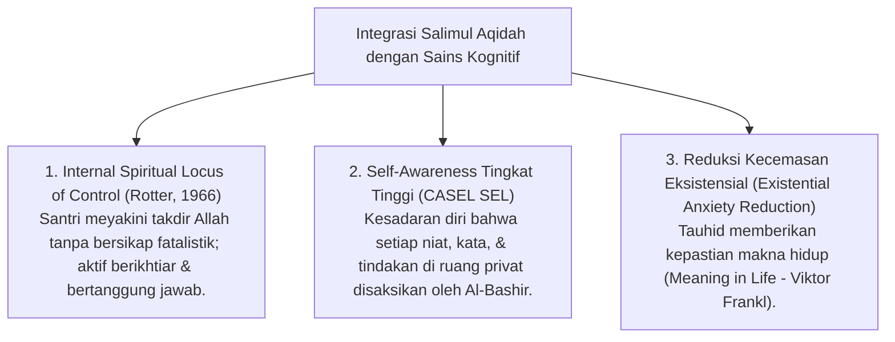

# P3-04-02-Definisi-dan-Konseptualisasi (Salimul Aqidah)

## Tujuan
Menetapkan definisi operasional, batasan istilah, dan integrasi psikologis modern (*Self-Awareness & Locus of Control*) dari karakter **Salimul Aqidah** dalam kehidupan santri 24 jam.

---

## 1. Definisi Operasional Baku

> **Salimul Aqidah dalam Ekosistem TUMBUH adalah:**  
> *"Kapasitas batiniah santri yang memiliki keyakinan teguh dan murni kepada Allah Ta'ala, terbebas dari segala bentuk syirik, takhayul, dan khurafat, yang termanifestasikan dalam sikap muraqabah (sadar diawasi Allah), keikhlasan beramal, serta ketenteraman jiwa melalui tawakkal yang benar."*

---

## 2. Integrasi Konsep Sains & CASEL SEL

---

## 3. Status Dokumen
* **Status**: 🌟 **A+ (Tervalidasi & Siap Diimplementasikan)**
* **Level**: Project 3 - `03 Capacity Framework / 04 Salimul Aqidah / ./P3-04-05-Standar-Kompetensi-dan-Taksonomi.md`**.
