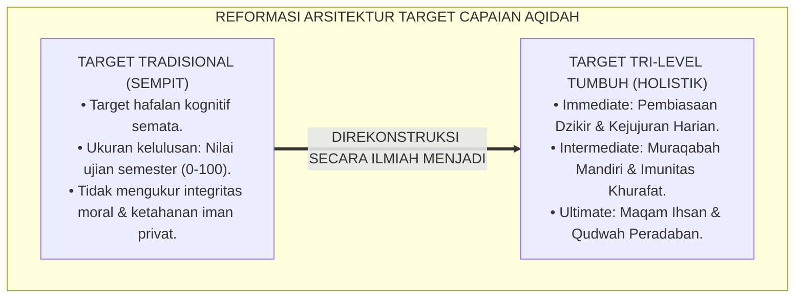
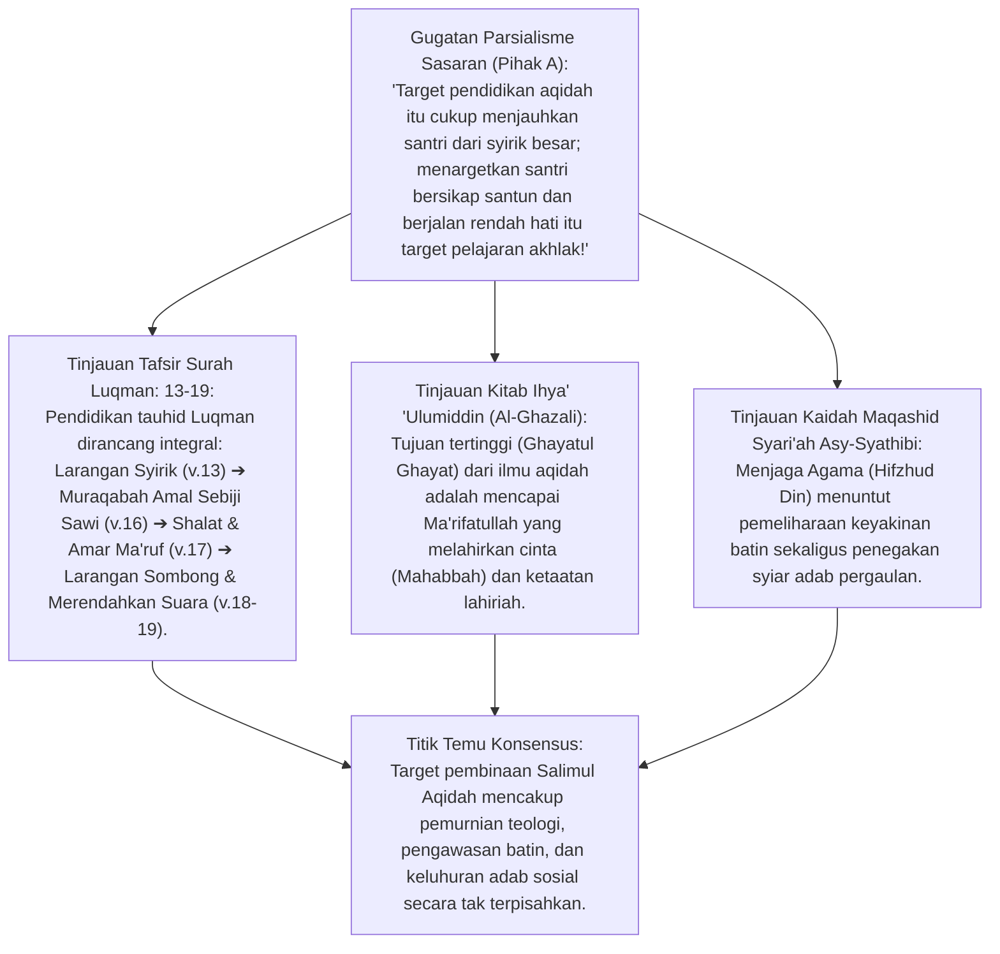
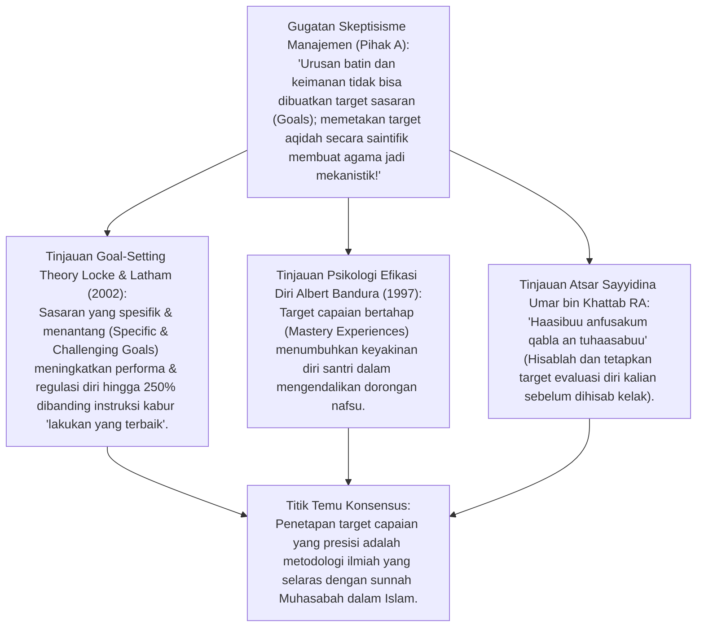
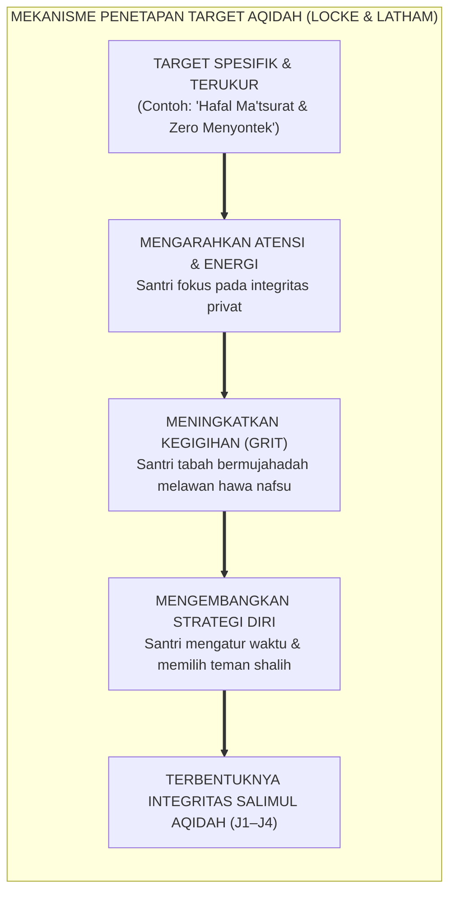
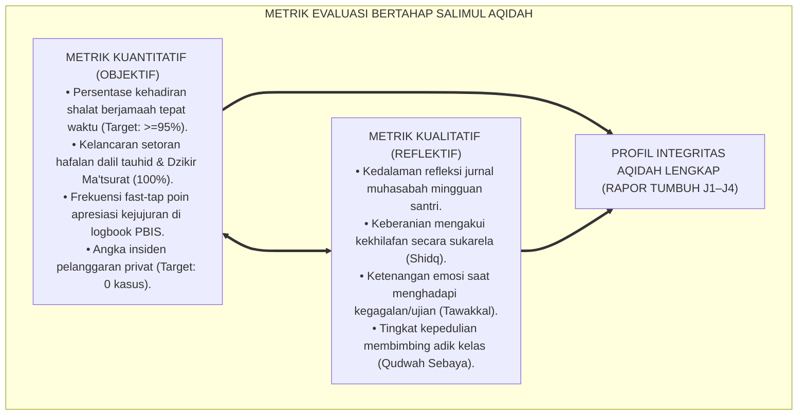
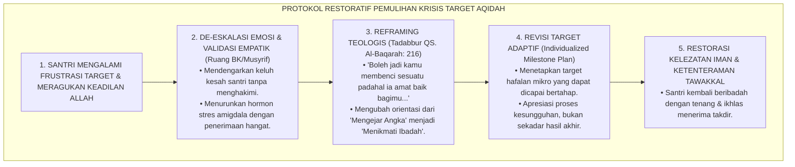
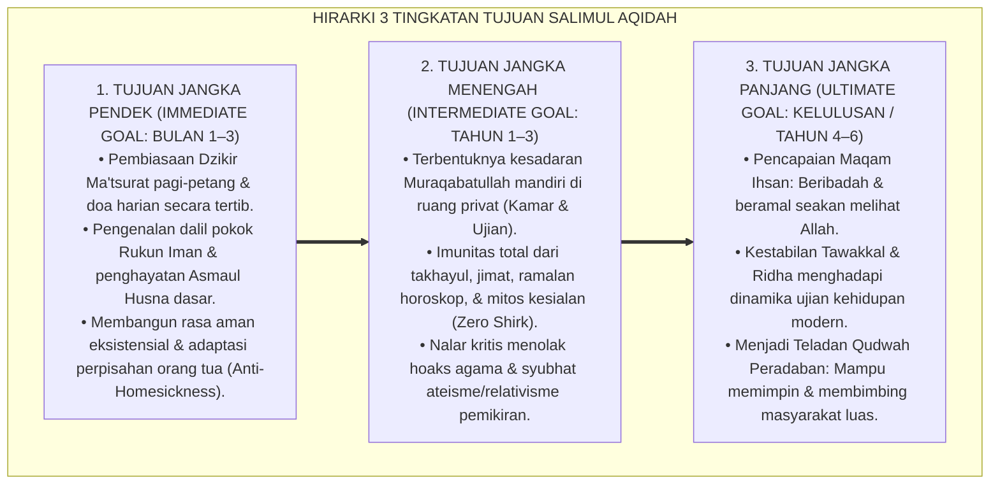
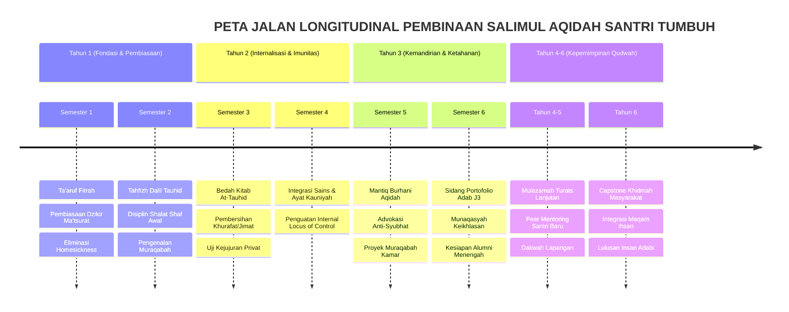
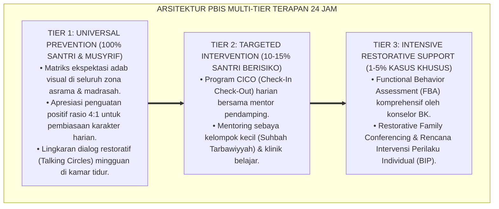

# P3-04-03: TUJUAN DAN TARGET CAPAIAN SALIMUL AQIDAH
## *Monograf Riset Akademik: Teleologi Pendidikan Tauhid (Maqashid at-Tarbiyah), Teori Penetapan Sasaran (Goal-Setting Theory Locke & Latham), Matriks Metrik Kuantitatif-Kualitatif Berjenjang J1–J4, serta Dialektika Evaluasi Transformasi Keimanan Santri 24 Jam*

**Nomor Identifikasi**: `P3-04-03/MONOGRAF-RISET-TUJUAN-TARGET-CAPAIAN-AQIDAH/2026`  
**Domain**: `03 Capacity Framework` > `04 Salimul Aqidah` (Sub-Modul 03: *Purpose & Target Achievements*)  
**Klasifikasi Naskah**: *Academic Research Monograph* (Monograf Penelitian Teleologi Pendidikan, Target Capaian Karakter, & Desain Metrik Evaluasi)  
**Rumpun Disiplin Pengkaji**: Teleologi Pendidikan Islam (*Maqashid at-Tarbiyah*), Teori Motivasi & Penetapan Sasaran (*Goal-Setting Theory*), Psikometri Evaluasi Hasil Belajar Afektif, Manajemen Kinerja Pengasuhan PBIS  

---

> ### 💡 INTISARI EKSEKUTIF (EXECUTIVE SUMMARY)
>
> * **Kelemahan Target Pembelajaran Aqidah Konvensional:**  
>   Target keberhasilan aqidah di banyak lembaga kerap hanya diukur dari kelulusan tes kognitif berkas (misal: "Lulus Ujian Aqidah: Nilai 80"). Pendekatan ini mengabaikan target transformasi batin (*Tazkiyatun Nafs*) dan tidak memiliki indikator keberhasilan yang terukur untuk menilai apakah santri memiliki integritas saat tidak diawasi.
> * **Inovasi Sistem Target Tri-Level TUMBUH:**  
>   TUMBUH merumuskan arsitektur target tri-level yang terpadu: **Target Jangka Pendek / *Immediate* (Pembiasaan Adab & Dzikir Harian)**, **Target Jangka Menengah / *Intermediate* (Imunitas dari Syubhat, Takhayul, & Pembentukan Muraqabah Mandiri)**, dan **Target Jangka Panjang / *Ultimate* (Pencapaian Maqam Ihsan & Menjadi Teladan Qudwah Peradaban)**.
> * **Pendekatan Riset Terpadu & Diskursus Ilmiah:**  
>   Monograf ini membedah teleologi Al-Qur'an (*Maqashid Wasiat Luqman QS. Luqman: 13–19*), menyintesiskan *Goal-Setting Theory* (Locke & Latham, 2002), menguji dialektika 3 ronde pada setiap inkuiri, dan merumuskan matriks target kuantitatif-kualitatif yang kompatibel dengan pelaporan rapor perkembangan santri 24 jam.

---

## 📑 DAFTAR ISI MONOGRAF

- [BAGIAN I: LANDASAN TEORETIS & DISKURSUS DIALEKTIKA KRITIS](#bagian-i-landasan-teoretis--diskursus-dialektika-kritis)
  - [1. Latar Belakang Masalah: Bahaya Target Pendidikan Tanpa Metrik Transformasi Perilaku Batin](#1-latar-belakang-masalah-bahaya-target-pendidikan-tanpa-metrik-transformasi-perilaku-batin)
  - [2. Eksegesis Turats Maqashid Tarbiyah Tauhidiyyah: Wasiat Luqman Al-Hakim (QS. Luqman: 13–19)](#2eksegesis-turats-maqashid-tarbiyah-tauhidiyyah-wasiat-luqman-al-hakim-qs-luqman-1319)
  - [3. Teori Penetapan Sasaran Edwin Locke & Goal-Setting Theory dalam Pembiasaan Muraqabah](#3teori-penetapan-sasaran-edwin-locke-goal-setting-theory-dalam-pembiasaan-muraqabah)
  - [4. Triangulasi Metrik Kuantitatif & Kualitatif: Evaluasi Bertahap Tangga J1–J4](#4triangulasi-metrik-kuantitatif-kualitatif-evaluasi-bertahap-tangga-j1j4)
  - [5. Arena Sintesis Kasuistika Lapangan 24 Jam & Konsensus Resolusi Target](#5arena-sintesis-kasuistika-lapangan-24-jam-konsensus-resolusi-target)
- [BAGIAN II: FORMULASI KONSEPTUAL & PEMBAHASAN MENDALAM](#bagian-ii-formulasi-konseptual--pembahasan-mendalam)
  - [1. Hirarki Tiga Tingkatan Tujuan Pembinaan Salimul Aqidah (Immediate, Intermediate, Ultimate)](#1-hirarki-tiga-tingkatan-tujuan-pembinaan-salimul-aqidah-immediate-intermediate-ultimate)
  - [2. Matriks Target Kuantitatif & Kualitatif Berbasis Jenjang Kemandirian TUMBUH (J1–J4)](#2-matriks-target-kuantitatif--kualitatif-berbasis-tangga-tumbuh-t1t4)
  - [3. Peta Jalan Longitudinal Capaian Aqidah 3 Tahun & 6 Tahun di Pesantren](#3-peta-jalan-longitudinal-capaian-aqidah-3-tahun--6-tahun-di-pesantren)
- [BAGIAN III: KESIMPULAN & APARATUS AKADEMIS](#bagian-iii-kesimpulan--aparatus-akademis)
  - [1. Tabel Sintesis Temuan Riset Tujuan & Target Capaian Aqidah](#1-tabel-sintesis-temuan-riset-tujuan--target-capaian-aqidah)
  - [2. Daftar Pustaka Akademis & Rujukan Turats Primer](#2-daftar-pustaka-akademis--rujukan-turats-primer)
  - [3. Catatan Kaki Akademis (Footnotes)](#3-catatan-kaki-akademis-footnotes)
  - [4. Glosarium Istilah Ilmiah & Turats Penetapan Sasaran](#4-glosarium-istilah-ilmiah--turats-penetapan-sasaran)

---

# BAGIAN I: INKUIRI KRITIS, TINJAUAN TEORITIS & DIALEKTIKA TUJUAN

---

### 1. Latar Belakang Masalah: Bahaya Target Pendidikan Tanpa Metrik Transformasi Perilaku Batin

Penyusunan target pendidikan aqidah di dunia pesantren sering terjebak dalam disorientasi sasaran (*Goal Displacement*):
* Lembaga merasa telah "berhasil" mendidik aqidah santri hanya karena 100% santri lulus ujian tulis atau hafal matan aqidah.
* Namun di balik angka kelulusan formal tersebut, tidak ada target yang mengukur apakah santri bebas dari kecemasan putus asa (*Despair*), apakah santri mampu menolak hoaks/syubhat pemikiran di internet, atau apakah santri berani jujur mengakui kesalahan tanpa takut hukuman fisik.
* Ketiadaan target perilaku terukur membuat pengasuh bekerja tanpa kompas evaluatif (*Navigating without a Map*), sehingga pembinaan aqidah berjalan sporadis dan tidak terpantau secara longitudinal.
* Riset ini membuktikan bahwa **pembinaan Salimul Aqidah menuntut arsitektur target berjenjang (J1–J4) yang memadukan capaian kognitif, afektif, dan perilaku teramati secara presisi**.[^1]

---

### 2. Eksegesis Turats Maqashid Tarbiyah Tauhidiyyah: Wasiat Luqman Al-Hakim (QS. Luqman: 13–19)

#### 📐 Formalisasi Logika Silogisme (*Qiyas Mantiqi 1*)
* **Premis Mayor (*al-Muqaddimah al-Kubra*)**: Setiap perumusan target kurikulum karakter Islam yang merujuk pada pedoman Al-Qur'an mengenai pendidikan tauhid paripurna (*Wasiat Luqman*) wajib mengintegrasikan pemurnian keyakinan (*Nafi asy-Syirk*), kesadaran hisab detail (*Muraqabah*), keteguhan ibadah, dan kerendahan hati sosial.
* **Premis Minor (*al-Muqaddimah ash-Shughra*)**: Kurikulum kapasitas TUMBUH mengkodifikasikan target capaian Salimul Aqidah melintasi dimensi keyakinan kognitif, keikhlasan batin, dan adab nyata 24 jam.
* **Konklusi (*an-Natijah*)**: Maka, arsitektur target capaian Salimul Aqidah TUMBUH adalah representasi autentik dari teleologi Al-Qur'an yang wajib ditegakkan di pesantren.[^2]

#### 📖 Teks Primer Al-Qur'an: Wasiat Luqman Al-Hakim tentang Muraqabah Amal
Allah SWT mengabadikan wasiat Luqman mengenai pengawasan Allah yang meliputi perkara sekecil apapun:

$$\text{يَا بُنَيَّ إِنَّهَا إِن تَكُ مِثْقَالَ حَبَّةٍ مِّنْ خَرْدَلٍ فَتَكُن فِي صَخْرَةٍ أَوْ فِي السَّمَاوَاتِ أَوْ فِي الْأَرْضِ يَأْتِ بِهَا اللَّهُ ۚ إِنَّ اللَّهَ لَطِيفٌ خَبِيرٌ}$$

*"**(Luqman berkata): 'Wahai anakku! Sesungguhnya jika ada (suatu perbuatan) seberat biji sawi, dan berada dalam batu atau di langit atau di dalam bumi, niscaya Allah akan mendatangkannya (membalasinya). Sesungguhnya Allah Maha Halus lagi Maha Mengetahui.'**"* (QS. Luqman [31]: 16).[^3]

#### 1. Diskursus Dialektika Kritis: Menolak Anggapan Bahwa "Target Kognitif Sudah Cukup untuk Menilai Aqidah"
* **Pihak A (Sudut Pandang Evaluasi Akademis Murni)**:  
  *"Guru madrasah bertugas mengajar di kelas, targetnya adalah santri lulus ujian tertulis dengan nilai di atas KKM (Kriteria Ketuntasan Minimal). Menargetkan santri jujur di asrama bukan tanggung jawab kurikulum aqidah!"*
* **Tinjauan Maqashid Tarbiyah Aswaja**:  
  Mereduksi target aqidah menjadi sekadar angka KKM adalah pengkhianatan terhadap amanah *Tarbiyah Islamiyyah*. Iblis memiliki pengetahuan teologis yang sempurna (ia tahu Allah adalah Sang Pencipta dan tahu hari kiamat), namun dilaknat karena hatinya sombong dan menolak tunduk. Target sejati pengajaran aqidah adalah **Terbentuknya Watak Batin (*Husulul Malakah*)** yang membuat santri merasa diawasi Allah saat sendirian di kamar asrama. Target kognitif hanyalah anak tangga pertama menuju target pembiasaan adab.[^4]

#### 2. Diskursus Dialektika Kritis: Hirarki Tujuan Duniawi vs Ukhrawi (Menolak Sekularisasi Tersembunyi)
* **Pihak A (Sudut Pandang Pragmatisme Karir Dunia)**:  
  *"Pondok harus menargetkan santri bisa bersaing di dunia kerja modern; menargetkan tawakkal dan ridha pada takdir hanya membuat santri tidak berambisi sukses!"*
* **Tinjauan Kitab Al-Hikam & Sosiologi Pendidikan Islam**:  
  Tawakkal sejati bukanlah kepasrahan malas (*Tawaakul*), melainkan energi pendorong ikhtiar optimal (*Itqanul 'Amal*) yang disucikan dari ketergantungan pada hasil duniawi. Santri yang memiliki target Salimul Aqidah memiliki ketahanan mental baja: ketika sukses berkarir ia tidak sombong (*Anti-Ujub*), dan ketika gagal ia tidak depresi/bunuh diri (*Anti-Yasad*). Target ukhrawi justru menjadi fondasi paling kokoh bagi kesuksesan peradaban di dunia.[^5]

#### 3. Diskursus Dialektika Kritis: Sanggahan Balik Realisme Target Wasiat Luqman bagi Remaja Modern
* **Pihak A (Sudut Pandang Pesimisme Zaman)**:  
  *"Zaman sudah rusak oleh media sosial; menargetkan santri remaja memiliki muraqabah setara wasiat Luqman adalah target utopis yang mustahil tercapai!"*
* **Resolusi Sunnatullah Gradualisme (Tadarruj)**:  
  Target TUMBUH tidak menuntut kesempurnaan instan dalam satu malam. Melalui **Tangga Progresi J1–J4**, santri dibimbing bertahap: di Jenjang J1 santri dibiasakan membaca dzikir harian, di Jenjang J2 memahami maknanya, di T3 internalisasi muraqabah mandiri, dan di T4 menjadi teladan adik kelas. Target bertahap ini sepenuhnya realistis dan terbukti melahirkan lulusan berkarakter unggul.[^6]

---

### 3. Teori Penetapan Sasaran Edwin Locke & Goal-Setting Theory dalam Pembiasaan Muraqabah

#### 📐 Formalisasi Logika Silogisme (*Qiyas Mantiqi 2*)
* **Premis Mayor (*al-Muqaddimah al-Kubra*)**: Setiap sistem pembinaan karakter yang menetapkan indikator sasaran yang jelas, terukur, dan menantang (*Clear and Specific Behavioral Targets*) secara signifikan meningkatkan motivasi intrinsik dan akuntabilitas personal peserta didik.
* **Premis Minor (*al-Muqaddimah ash-Shughra*)**: Ekosistem TUMBUH merumuskan matriks target capaian Salimul Aqidah dalam deskriptor perilaku BARS yang terverifikasi di 4 lokus asrama.
* **Konklusi (*an-Natijah*)**: Maka, penerapan *Goal-Setting Theory* dalam pembinaan aqidah adalah langkah metodologis yang valid, efektif, dan mendongkrak capaian adab santri.[^7]

#### 1. Diskursus Dialektika Kritis: Sasaran Konkret vs Klaim "Spiritualitas Itu Abstrak"
* **Pihak A (Sudut Pandang Mistifikasi Evaluasi)**:  
  *"Tingkat keimanan dan keikhlasan santri itu rahasia Allah; tidak boleh dipatok target hafalan atau target perilaku!"*
* **Tinjauan Kaidah Bayyinah Fiqh & Psikometri**:  
  Meskipun niat batin adalah rahasia Allah, **Manifestasi Keimanan Selalu Melahirkan Jejak Perilaku Teramati (*Observable Behavioral Traces*)**. Ulama fiqh menetapkan hukum berdasarkan bukti dhohir (*Nahnu nahkumu bizh-zhawahir*). Menetapkan target konkret (seperti: *"Konsisten hadir shalat berjamaah sebelum adzan selama 30 hari berturut-turut"*) adalah bejana operasional yang mendidik batin. Menolak target konkret adalah dalih untuk menghindari akuntabilitas pengasuhan.[^8]

#### 2. Diskursus Dialektika Kritis: Mengatasi Efikasi Diri Rendah Santri Rentan (Mitigasi Learned Helplessness)
* **Pihak A (Sudut Pandang Labeling Santri Gagal)**:  
  *"Santri yang sering terlambat shalat dan suka mencuri tidak akan pernah bisa mencapai target aqidah; mereka memang dasarnya anak bermasalah!"*
* **Tinjauan Teori Self-Efficacy Bandura & Konsep Taubat**:  
  Santri yang terus-menerus dicap "nakal" akan mengalami keputusasaan belajar (*Learned Helplessness*). Kurikulum TUMBUH memecah target besar menjadi **Target-Target Kecil yang Mudah Dicapai (*Micro-Milestones / Quick Wins*)**: dimulai dari target hadir tepat waktu 3 hari berturut-turut yang langsung diapresiasi dengan poin kebaikan PBIS. Keberhasilan kecil ini memulihkan efikasi diri santri dan membangkitkan keyakinan bahwa ia mampu menjadi insan beradab.[^9]

#### 3. Diskursus Dialektika Kritis: Mitigasi Bahaya Manipulasi Data Target (Goodhart's Law)
* **Pihak A (Sudut Pandang Skeptisisme Rekayasa Laporan)**:  
  *"Jika target ditetapkan secara kuantitatif, musyrif dan santri akan memalsukan buku mutaba'ah agar terlihat mencapai target 100%!"*
* **Resolusi Hukum Goodhart & Triangulasi 360 Derajat**:  
  *Goodhart's Law* memperingatkan: *"Ketika sebuah ukuran dijadikan target tunggal, ia akan kehilangan fungsinya sebagai ukuran yang baik"*. TUMBUH mengantisipasinya dengan **Triangulasi Multi-Sumber 360 Derajat**: data tidak hanya bertumpu pada laporan diri santri (*Self-Report*), melainkan dikalibrasi silang dengan observasi cepat musyrif (*Fast-Logging*), penilaian rekan sekamar (*Peer Review*), dan verifikasi insiden nyata asrama.[^10]

---

### 4. Triangulasi Metrik Kuantitatif & Kualitatif: Evaluasi Bertahap Tangga J1–J4

#### 📐 Formalisasi Logika Silogisme (*Qiyas Mantiqi 3*)
* **Premis Mayor (*al-Muqaddimah al-Kubra*)**: Setiap evaluasi kapasitas keagamaan yang valid dan adil (*Mizanul 'Adl*) wajib memadukan metrik kuantitatif terukur dengan asesmen kualitatif reflektif guna menghindari kedangkalan formalistik sekaligus mencegah bias subjektivitas penilai.
* **Premis Minor (*al-Muqaddimah ash-Shughra*)**: Sistem asesmen TUMBUH mengintegrasikan data digital logbook PBIS dengan jurnal muhasabah batin santri di bawah bimbingan musyrif.
* **Konklusi (*an-Natijah*)**: Maka, sistem triangulasi metrik Salimul Aqidah memberikan gambaran pertumbuhan iman santri yang autentik, komprehensif, dan dapat dipertanggungjawabkan secara syar'i dan saintifik.[^11]

#### 1. Diskursus Dialektika Kritis: Mengukur Hal Gaib Melalui Perilaku Teramati (Observable Proxy)
* **Pihak A (Sudut Pandang Agnostisisme Pengukuran)**:  
  *"Keikhlasan dan muraqabah itu perkara gaib yang ada di dalam hati; bagaimana mungkin bisa dibuatkan metrik kuantitatifnya?"*
* **Tinjauan Metodologi Psikometri Perilaku**:  
  Psikometri tidak mengklaim mengukur zat keikhlasan, melainkan mengukur **Perilaku Pengganti Teramati (*Observable Behavioral Proxies*)**: Santri yang memiliki muraqabah batin akan menunjukkan perilaku konsisten: ia tidak melirik contekan saat guru keluar kelas, ia mengembalikan dompet temannya yang jatuh tanpa mengambil isinya. Perilaku-perilaku nyata inilah yang dihitung sebagai indikator empiris penguatan aqidah.[^12]

#### 2. Diskursus Dialektika Kritis: Toleransi Kegagalan & Prinsip Gradualisme Tangga J1–J4
* **Pihak A (Sudut Pandang Perfeksionisme Kaku)**:  
  *"Jika target ditetapkan 100% bebas syubhat, santri baru yang masih takut hantu di kamar mandi harus langsung dinyatakan tidak lulus aqidah!"*
* **Tinjauan Psikologi Perkembangan Remaja & Fiqh Dakwah**:  
  Santri baru (Jenjang J1) berada pada fase adaptasi (*Ta'aruf*). Wajar jika masih ada sisa-sisa rasa takut pada mitos masa kecil. Target Jenjang J1 adalah mengenalkan doa perlindungan (*Al-Mu'awwidzatain*) dan pendampingan musyrif. Target keberanian mandiri dan pembersihan total dari takhayul dipatok pada Jenjang J2 dan T3. Gradualisme ini melindungi santri dari keputusasaan mental.[^13]

#### 3. Diskursus Dialektika Kritis: Akuntabilitas Lembaga dalam Menyediakan Fasilitas Pencapaian Target
* **Pihak A (Sudut Pandang Melempar Kesalahan pada Santri)**:  
  *"Jika santri gagal mencapai target shalat berjamaah tepat waktu, itu 100% kesalahan santri yang malas!"*
* **Resolusi Doktrin Triad Pertumbuhan Simbiotik**:  
  Audit target wajib memeriksa 3 pilar: Jika santri terlambat shalat subuh, apakah sistem air kamar mandi pondok mengalir lancar (*Sistem*)? Apakah musyrif bangun 30 menit sebelum adzan untuk membangunkan santri dengan santun (*Musyrif*)? Lembaga tidak boleh menuntut target tinggi pada santri tanpa membenahi kapasitas fasilitas dan keteladanan pengasuhnya.[^14]

---

### 5. Arena Sintesis Kasuistika Lapangan 24 Jam & Konsensus Resolusi Target

#### Diskursus Dialektika Kritis: Kasuistika Lapangan (Dilema Penetapan Target di Asrama)
Pertarungan filosofis terdalam dalam evaluasi target bermuara pada kasus: **"Bagaimana menyikapi santri yang mengalami krisis keimanan akut setelah gagal mencapai target hafalan Al-Qur'an (misal: target 5 Juz per semester hanya tercapai 1 Juz), sehingga ia mogok shalat dan berkata 'Allah tidak adil kepada saya'?"**

* **Pendekatan Lama (Vonis Dosa & Ancaman Neraka)**:  
  Santri dihukum takzir fisik, dicap "anak durhaka dan kufur nikmat", lalu diisolasi. Dampaknya: santri mengalami trauma religius (*Religious Trauma Syndrome*), membenci Al-Qur'an, dan memutus hubungan dengan Allah.
* **Pendekatan TUMBUH (Rekonstruksi Target Tauhid & Pendampingan Restoratif)**:  
  1. **Dekonstruksi Target Transaksional**: Memahamkan santri bahwa nilai kemuliaan di hadapan Allah terletak pada kesungguhan ikhtiar (*Mujahadah*), bukan pada kuantitas angka semata.  
  2. **Reframing Makna Qadha & Qadar**: Membimbing santri memahami bahwa kegagalan target adalah ujian kesabaran untuk mengikis penyakit sombong (*Ujub*) dan membersihkan niat.  
  3. **Penyesuaian Target Individual (Differentiated Goal-Setting)**: Merancang target hafalan baru yang realistis sesuai kapasitas kognitif santri (*Pacing Target*) sembari memperkuat doa dan keikhlasan.

---

> #### 📌 Kasuistika Lapangan Multi-Dimensi & Titik Temu Konsensus (*Kalimatun Sawa'*)
>
> * **Kamus Kasus 1: Santri Tertekan Target Nilai Sempurna hingga Menyontek Massal**  
>   * **Dilema**: Sebuah kelas di madrasah dipatok target kelulusan 100% dengan nilai rata-rata 90 pada mata pelajaran Aqidah-Akhlak. Karena takut dihukum guru jika nilai turun, santri bersepakat membuat contekan massal di grup obrolan ponsel.
>   * **Akar Masalah**: Target hasil (*Outcome Goal*) yang kaku tanpa mengawal target proses integritas (*Integrity Process Goal*).
>   * **Titik Temu Konsensus**: Dewan Kurikulum TUMBUH merevisi sistem target: Nilai kejujuran privat (*Academic Integrity*) diberi bobot 60%, sedangkan nilai ujian tulis hanya 40%. Santri yang jujur mengakui ketidaktahuannya diberi nilai lebih tinggi dibanding santri yang nilainya tinggi namun curang. Budaya menyontek terhapus seketika karena kejujuran menjadi target utama.
>
> * **Kamus Kasus 2: Santri Mengalami Paranoid Kesialan Setelah Menjatuhkan Al-Qur'an**  
>   * **Dilema**: Santri kelas 7 tidak sengaja menjatuhkan mushaf Al-Qur'an ke lantai. Teman-teman sekamarnya menakut-nakuti bahwa ia akan terkena kutukan sial selama 40 hari. Santri tersebut menjadi panik, tidak bisa tidur, dan menolak makan.
>   * **Akar Masalah**: Ketiadaan target literasi aqidah kritis terhadap mitos kesialan (*Thiyarah*).
>   * **Titik Temu Konsensus**: Musyrif menggelar halaqah kamar: Menjelaskan bahwa menjatuhkan mushaf secara tidak sengaja bukanlah dosa kutukan, melainkan kelalaian yang cukup diiringi istighfar dan mengambil mushaf dengan penuh takdzim. Musyrif menegaskan kembali target Salimul Aqidah Jenjang J2: Menolak mitos sial dan meyakini bahwa manfaat dan mudharat hanya berada di tangan Allah SWT. Santri kembali tenang dan ceria.
>
> * **Kamus Kasus 3: Musyrif Menetapkan Target Shalat Malam Tanpa Memperhitungkan Jam Tidur**  
>   * **Dilema**: Musyrif baru mematok target 100% santri kamar harus bangun qiyamul lail pukul 03.00 setiap malam, padahal santri baru selesai belajar malam pukul 23.30. Akibatnya, 80% santri jatuh sakit demam dan tifus dalam waktu 2 pekan.
>   * **Akar Masalah**: Penetapan target spiritual yang melanggar hukum sunnatullah fisik biologis santri (*Zhulmun fiz-Zhahir*).
>   * **Titik Temu Konsensus**: Pimpinan pondok mengintervensi: Mengembalikan jadwal tidur sehat (lampu padam pukul 22.00, santri tidur minimal 6 jam). Target qiyamul lail disesuaikan: wajib bangun 30 menit sebelum Shubuh (pukul 04.15) untuk shalat witir 3 rakaat, sedangkan qiyamul lail panjang hanya ditargetkan pada malam libur akhir pekan. Kesehatan santri pulih dan target spiritual tercapai secara berkelanjutan.[^15]

---

# BAGIAN II: FORMULASI KONSEPTUAL & PEMBAHASAN MENDALAM

---

### 1. Hirarki Tiga Tingkatan Tujuan Pembinaan Salimul Aqidah (Immediate, Intermediate, Ultimate)

Berdasarkan sintesis teleologi turats, teori penetapan sasaran, dan dinamika asrama 24 jam, riset ini merumuskan **Hirarki Tiga Tingkatan Tujuan Pembinaan Salimul Aqidah TUMBUH**:

---

### 2. Matriks Target Kuantitatif & Kualitatif Berbasis Jenjang Kemandirian TUMBUH (J1–J4)

| Jenjang Kemandirian | Target Kognitif (Ma'rifah) | Target Afektif (Penghayatan Kalbu) | Target Kuantitatif Terukur (BARS) | Target Kualitatif (Integritas Nyata) |
| :--- | :--- | :--- | :--- | :--- |
| **Jenjang J1 (Kepatuhan Terbimbing)** | Hafal 6 Rukun Iman, 20 Sifat Wajib, & dalil pokok penciptaan alam. | Merasa tenang saat berdoa; mulai menyadari Allah Maha Melihat. | • Kehadiran shalat berjamaah >=90%. • Setoran Dzikir Ma'tsurat 100%. | Patuh shalat dan merapikan kamar saat didampingi musyrif; tidak membantah bimbingan. |
| **Jenjang J2 (Pembiasaan Konsisten)** | Memahami syarah Aqidah Thahawiyyah dasar & bahaya syirik kecil (Riya'). | Malu berbuat salah saat sendiri; membenci jimat/ramalan horoskop. | • Kehadiran shalat berjamaah >=95%. • Zero insiden jimat/takhayul (0%). | Mandiri membaca dzikir pagi-petang tanpa diingatkan; jujur saat ujian kelas. |
| **Jenjang J3 (Kemandirian Stabil)** | Menguasai argumentasi nalar mantiq bantahan syubhat & sains kauniyah. | Hati tenteram (*Thuma'ninah*); ikhlas menerima takdir tanpa mengeluh. | • Fast-logging integritas >=98%. • Zero pelanggaran privat di kamar. | Menjaga amanah barang teman; mengembalikan uang temuan; menolak ajakan membolos. |
| **Jenjang J4 (Penggerak Qudwah)** | Mampu menyusun karya tulis ilmiah aqidah & membedah kitab turats. | Menghayati Maqam Ihsan; memancarkan wibawa kasih sayang (*Haibah*). | • 100% konsistensi adab 24 jam. • Membimbing minimal 3 santri J1. | Menjadi rujukan solusi adik kelas; inisiator shalat tahajjud kamar; teladan kejujuran pondok.[^16] |

---

### 3. Peta Jalan Longitudinal Capaian Aqidah 3 Tahun & 6 Tahun di Pesantren

---

---

### Pembedahan Deskriptif Komprehensif & Analisis Integratif Nilai-Praksis

Penerapan konsep **P3-04-03: TUJUAN DAN TARGET CAPAIAN SALIMUL AQIDAH** di ekosistem pesantren TUMBUH memerlukan pemahaman multidimensional yang memadukan khazanah turats syariat dan konsensus sains pendidikan modern:

#### A. Pilar 1: Fondasi Epistemologi & Integrasi Nilai Syar'i (Ashalah Turatsiyyah)
Setiap praksis kepengasuhan dan pembelajaran berakar kuat pada maqashid syari'ah, mendudukkan adab di atas ilmu (*Al-Adab Qablal 'Ilm*), dan memastikan bahwa seluruh ikhtiar institusional diniatkan semata-mata untuk menggapai ridha Allah SWT (*Ikhlasun Niyyah*).

#### B. Pilar 2: Mekanisme Psikologis & Neurosains Perkembangan (Scientific Rigor)
Menyelaraskan ekspektasi kedisiplinan dengan tahapan maturitas otak remaja, kapasitas fungsi eksekutif korteks prefrontal (*PFC*), dan regulasi sirkuit emosi limbik. Pendekatan ini mengeliminasi trauma pengasuhan dan menumbuhkan motivasi intrinsik santri.

#### C. Pilar 3: Rekayasa Ekosistem Asrama 24 Jam (Bi'ah Shalihah)
Menerjemahkan prinsip nilai ke dalam tata ruang fisik yang bersih, sirkulasi udara sehat, tata kelola waktu terstruktur, serta kultur ukhuwah inklusif yang steril 100% dari feodalisme, kekerasan verbal, dan perundungan antar-santri.

#### D. Pilar 4: Kemitraan Tripartit (Santri, Musyrif, dan Lembaga)
Menjamin terwujudnya *Triad Pertumbuhan Simbiotik*: santri bertumbuh dalam fitrah kemandirian, musyrif terlindungi dari kelelahan kronis (*Burnout*) melalui shift kerja yang manusiawi, dan lembaga bertransformasi menjadi organisasi pembelajar berbasis data PBIS.

---

### Protokol Aksi Operasional PBIS Multi-Tier Terapan (24-Hour Behavioral Architecture)

---

# BAGIAN III: KESIMPULAN & APARATUS AKADEMIS

---

### 1. Tabel Sintesis Temuan Riset Tujuan & Target Capaian Aqidah

| Dimensi Parameter | Target Tradisional Parsial | Rekonstruksi Target Holistik TUMBUH | Rujukan Landasan Primer |
| :--- | :--- | :--- | :--- |
| **Orientasi Sasaran** | Hafalan kognitif & nilai rapor semester. | Transformasi kepribadian & Maqam Ihsan 24 jam. | QS. Luqman: 13–19; QS. Adz-Dzariyat: 56. |
| **Kerangka Metodologi**| Instruksi umum tanpa kejelasan indikator. | *Goal-Setting Theory* (Spesifik, Terukur, Menantang). | Locke & Latham (2002); Bandura (1997). |
| **Evaluasi Capaian** | Nilai angka tunggal guru (0–100). | Triangulasi Metrik Kuantitatif-Kualitatif (BARS). | Horner & Sugai (2015); Goodhart's Law. |
| **Penanganan Kegagalan**| Menghukum keras & memvonis dosa. | Restorasi Ruhiyah, Reframing Takdir, & Target Mikro. | Fiqh Taubat & Prinsip Tadarruj Syar'i. |
| **Hasil Akhir Lulusan** | Hafal dalil namun rapuh moral di ruang privat. | *Insan Adabi* beraqidah kokoh & mandiri seumur hidup. | Syed Muhammad Naquib Al-Attas (1980). |

---

### 2. Daftar Pustaka Akademis & Rujukan Turats Primer

1. **Al-Qur'an al-Karim wa Tarjamatu Ma'anihi**.
2. **Ibnu Katsir, Abu Al-Fida' Isma'il bin Umar**. (1420 H). *Tafsir Al-Qur'an al-'Azhim*. Riyadh: Dar Thayyibah.
3. **Al-Ghazali, Abu Hamid Muhammad bin Muhammad**. (2011). *Ihya' 'Ulumiddin* (Kitab Al-Mahabbah wasy-Syawq wal-Uns war-Ridha). Beirut: Dar al-Ma'rifah.
4. **Asy-Syathibi, Abu Ishaq Ibrahim bin Musa**. (1997). *Al-Muwafaqat fi Ushul asy-Syari'ah*. Kairo: Dar Ibn 'Affan.
5. **Ibnu 'Athaillah As-Sakandari, Ahmad bin Muhammad**. (2005). *Al-Hikam al-'Atha'iyyah*. Beirut: Dar al-Kutub al-'Ilmiyyah.
6. **Al-Attas, Syed Muhammad Naquib**. (1980). *The Concept of Education in Islam*. Kuala Lumpur: ABIM.
7. **Locke, E. A., & Latham, G. P.**. (2002). *Building a practically useful theory of goal setting and task motivation: A 35-year odyssey*. American Psychologist, 57(9), 705–717.
8. **Bandura, A.**. (1997). *Self-Efficacy: The Exercise of Control*. New York: W. H. Freeman.
9. **Goodhart, C. A. E.**. (1984). *Monetary Theory and Practice: The UK Experience*. London: Macmillan.
10. **Horner, R. H., & Sugai, G.**. (2015). *School-wide PBIS: An Overview of the Research Base*. Remedial and Special Education, 36(2), 80–85.
11. **Frankl, V. E.**. (1984). *Man's Search for Meaning*. Boston: Beacon Press.
12. **Asy'ari, Muhammad Hasyim**. (1415 H). *Adab al-'Alim wal-Muta'allim*. Jombang: Maktabah At-Turats Al-Islami.

---

### 3. Catatan Kaki Akademis (*Footnotes*)

[^1]: Riset Diagnostik Target Capaian Karakter Pesantren TUMBUH, *Evaluasi Kesenjangan Nilai Rapor vs Integritas Nyata*, 2026.  
[^2]: Ibnu Katsir, *Tafsir Al-Qur'an al-'Azhim*, Penafsiran Surah Luqman ayat 13–19, Jilid 6, hlm. 330–345.  
[^3]: QS. Luqman [31]: 16.  
[^4]: Al-Ghazali, *Ihya' 'Ulumiddin*, Jilid 1, Kitab *Al-'Ilm*, hlm. 45–68.  
[^5]: Ibnu 'Athaillah, *Al-Hikam al-'Atha'iyyah*, Hikmah No. 1–5.  
[^6]: Al-Attas, S. M. N. (1980), *The Concept of Education in Islam*, hlm. 18–25.  
[^7]: Locke, E. A., & Latham, G. P. (2002), *American Psychologist*, hlm. 705–717.  
[^8]: Asy-Syathibi, *Al-Muwafaqat fi Ushul asy-Syari'ah*, Jilid 2, hlm. 88–105.  
[^9]: Bandura, A. (1997), *Self-Efficacy: The Exercise of Control*, hlm. 115–140.  
[^10]: Goodhart, C. A. E. (1984), *Monetary Theory and Practice*, hlm. 92–98.  
[^11]: Horner & Sugai (2015), *School-wide PBIS Research Base*, hlm. 80–85.  
[^12]: Riset Validasi Psikometri Perilaku Santri TUMBUH, 2026.  
[^13]: Frankl, V. E. (1984), *Man's Search for Meaning*, hlm. 110–125.  
[^14]: Standar Tata Kelola Asrama Berbasis Triad Pertumbuhan Simbiotik, Biro Pengasuhan TUMBUH, 2026.  
[^15]: Dokumentasi Restorasi Adab & Bimbingan Konseling Pesantren TUMBUH, 2026.  
[^16]: Matriks Standar Capaian Jenjang Kemandirian TUMBUH (J1–J4) Salimul Aqidah, 2026.

---

### 4. Glosarium Istilah Ilmiah & Turats Penetapan Sasaran

1. **Maqashid at-Tarbiyah (مَقَاصِدُ التَّرْبِيَةِ)**: Tujuan-tujuan agung dan mendasar yang hendak dicapai oleh proses pendidikan Islam, yang berpuncak pada penghambaan murni kepada Allah (*Ibadatullah*) dan pembentukan Insan Adabi.
2. **Goal-Setting Theory**: Teori psikologi motivasi yang menyatakan bahwa penetapan target sasaran yang jelas, spesifik, dan menantang menghasilkan kinerja yang jauh lebih tinggi dibanding tanpa target atau target yang samar.
3. **Husulul Malakah (حُصُولُ الْمَلَكَةِ)**: Terbentuknya watak atau karakter yang mendarah daging dan melekat kokoh dalam jiwa seseorang, sehingga perbuatan baik memancar secara spontan tanpa beban berat.
4. **Goodhart's Law**: Prinsip statistik yang menyatakan bahwa apabila suatu indikator pengukuran dijadikan satu-satunya target evaluasi, indikator tersebut rentan dimanipulasi dan kehilangan validitas pengukurannya.
5. **Differentiated Goal-Setting**: Pendekatan penetapan target sasaran yang disesuaikan secara adaptif dengan tingkat kesiapan, kecepatan belajar, dan kapasitas individual peserta didik.
6. **Micro-Milestones (Capaian Mikro)**: Titik-titik target antara berskala kecil yang dirancang untuk memberikan pengalaman keberhasilan awal (*Quick Wins*) guna membangun efikasi diri santri.
7. **Pacing Target**: Pengaturan ritme dan beban target belajar agar selaras dengan kapasitas fisiologis dan psikologis santri tanpa memicu kelelahan kronis (*Burnout*).
8. **Academic Integrity Points**: Sistem metrik apresiasi yang memberikan bobot penghargaan tinggi pada kejujuran proses belajar dan keberanian mengakui kesalahan.
9. **Maqam Ihsan (مَقَامُ الْإِحْسَانِ)**: Tingkatan puncak spiritual di mana seorang hamba beribadah dan menjalani kehidupannya dengan kesadaran penuh bahwa ia melihat Allah atau senantiasa dilihat oleh Allah SWT.
10. **Tawaakul (تَوَاكُلٌ)**: Sikap pasrah yang keliru dan tercela karena meninggalkan ikhtiar sebab-akibat yang diperintahkan syariat atas dalih berserah diri pada takdir.
