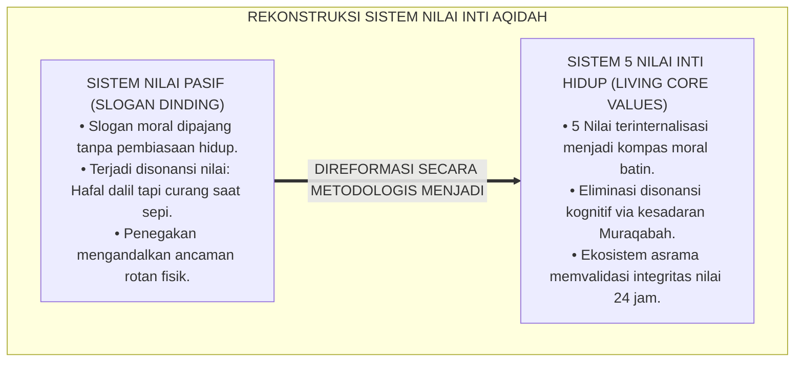
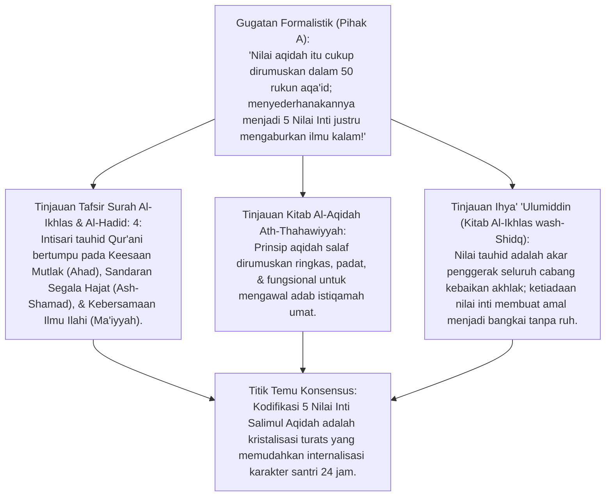
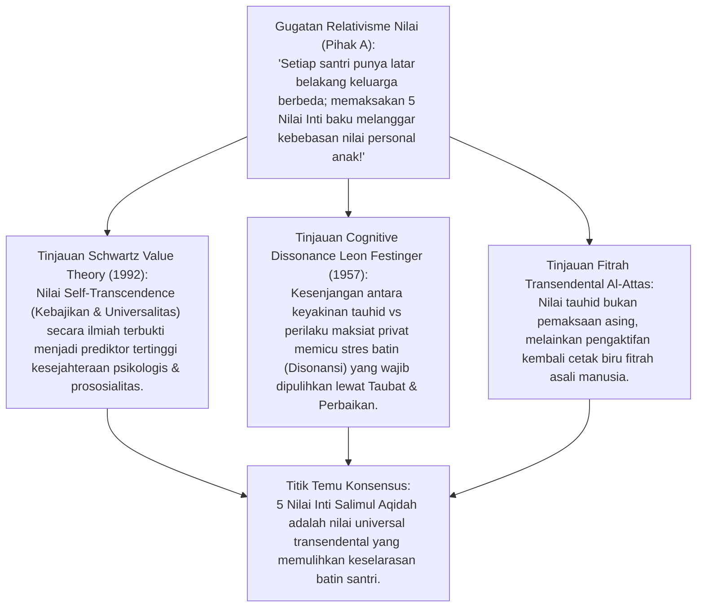
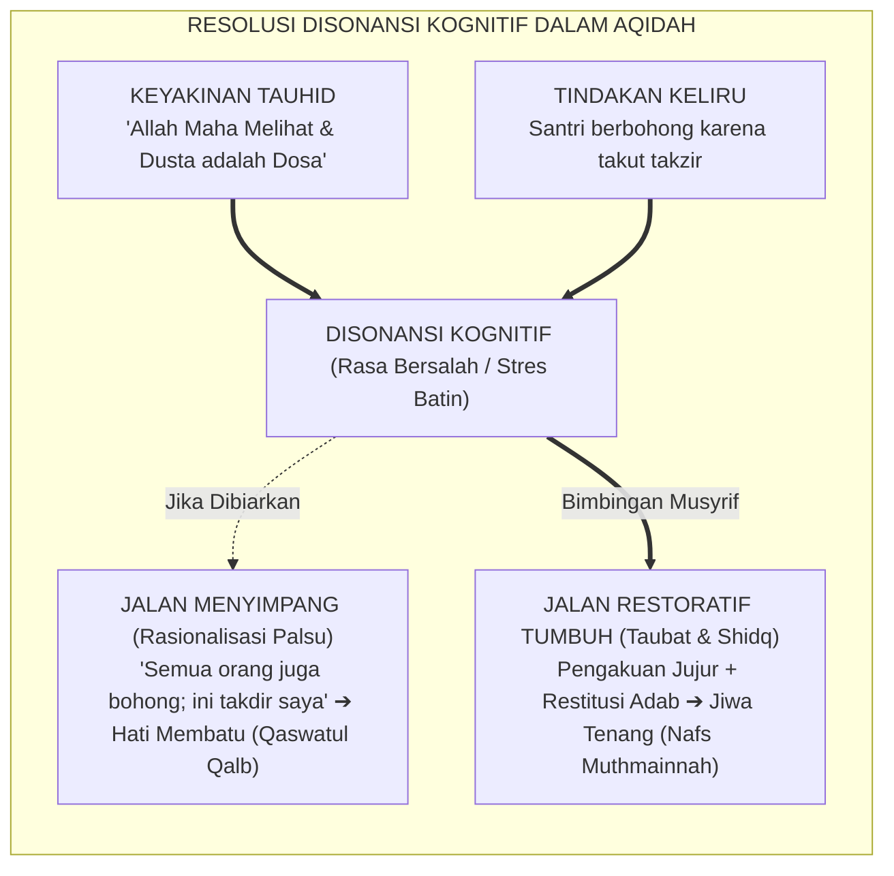
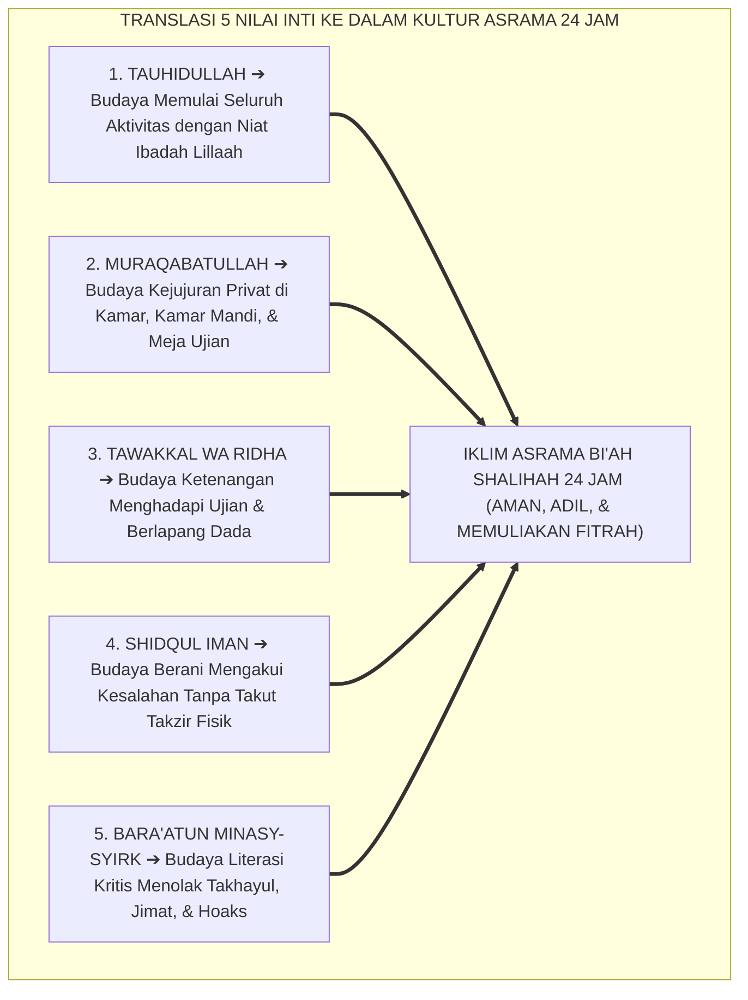
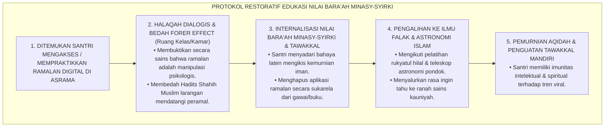
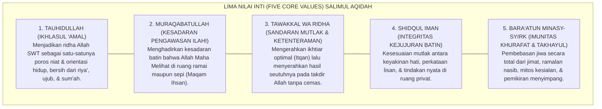
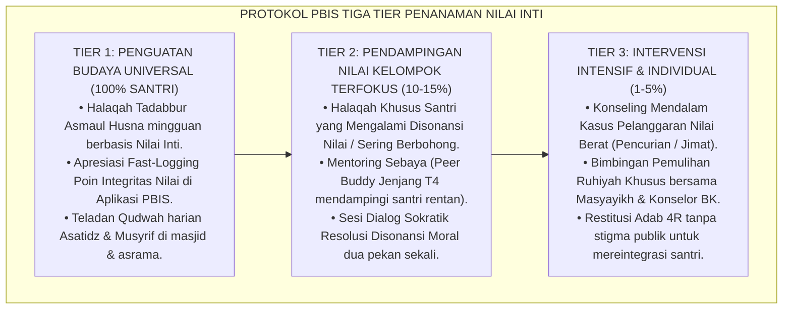
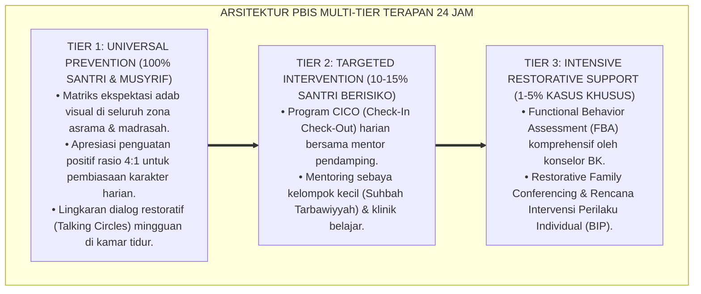

# P3-04-04: NILAI INTI DAN PRINSIP AQIDAH
## *Monograf Riset Akademik: Aksiologi Teistik Tauhid, Teori Nilai Universal Schwartz (Transcendence Values), Resolusi Disonansi Kognitif Festinger, Kodifikasi Lima Nilai Inti (Core Values), serta Dialektika Pengawalan Budaya Bi'ah Shalihah di Pesantren 24 Jam*

**Nomor Identifikasi**: `P3-04-04/MONOGRAF-RISET-NILAI-INTI-PRINSIP-AQIDAH/2026`  
**Domain**: `03 Capacity Framework` > `04 Salimul Aqidah` (Sub-Modul 04: *Core Values & Theological Principles*)  
**Klasifikasi Naskah**: *Academic Research Monograph* (Monograf Penelitian Aksiologi Islam, Nilai-Nilai Inti Karakter, & Prinsip Dogmatis Terpadu)  
**Rumpun Disiplin Pengkaji**: Aksiologi Pendidikan Islam, Epistemologi Ushuluddin, Psikologi Nilai Transendental (*Schwartz Value Theory*), Teori Disonansi Kognitif (*Festinger*), Kultur Pengasuhan PBIS 24 Jam  

---

> ### 💡 INTISARI EKSEKUTIF (EXECUTIVE SUMMARY)
>
> * **Krisis Disonansi Nilai pada Peserta Didik:**  
>   Banyak santri menghafal nilai-nilai agama di kepala, namun saat menghadapi tekanan pergaulan (*Peer Pressure*) atau situasi dilematis, mereka mengalami disonansi kognitif dan memilih kompromi amoral (misal: berbohong, menyontek, atau percaya ramalan zodiak di media sosial). Nilai agama terdegradasi menjadi sekadar pajangan slogan dinding (*Dead Placards*).
> * **Inovasi Lima Nilai Inti (*Five Core Values*) Salimul Aqidah TUMBUH:**  
>   TUMBUH merumuskan aksiologi tauhid ke dalam lima pilar nilai hidup (*Living Values*): **1. Tauhid Murni (*Ikhlasul 'Amal*)**, **2. Muraqabatullah (*Kesadaran Pengawasan Ilahi*)**, **3. Tawakkal Hakiki (*Sandaran Mutlak*)**, **4. Shidqul Iman (*Integritas Kejujuran Batin*)**, dan **5. Bara'ah minasy-Syirki (*Imunitas Khurafat & Takhayul*)**.
> * **Pendekatan Riset Terpadu & Diskursus Ilmiah:**  
>   Monograf ini membedah nash kemurnian tauhid (*Surah Al-Ikhlas & Matan Thahawiyyah*), mengintegrasikannya dengan teori nilai transendensi Schwartz (1992) dan resolusi disonansi Festinger (1957), menguji dialektika 3 ronde di setiap inkuiri, dan merumuskan batas larangan mutlak (*Red Lines*) penegakan kultur asrama 24 jam.

---

## 📑 DAFTAR ISI MONOGRAF

- [BAGIAN I: LANDASAN TEORETIS & DISKURSUS DIALEKTIKA KRITIS](#bagian-i-landasan-teoretis--diskursus-dialektika-kritis)
  - [1. Latar Belakang Masalah: Krisis Disonansi Nilai Santri: Hafal Doktrin Namun Rapuh Saat Menghadapi Dilema Nyata](#1-latar-belakang-masalah-krisis-disonansi-nilai-santri-hafal-doktrin-namun-rapuh-saat-menghadapi-dilema-nyata)
  - [2. Eksegesis Turats Lima Nilai Inti Tauhid (QS. Al-Ikhlas: 1–4, QS. Al-Hadid: 4, & Ath-Thahawiyyah)](#2eksegesis-turats-lima-nilai-inti-tauhid-qs-al-ikhlas-14-qs-al-hadid-4-ath-thahawiyyah)
  - [3. Teori Nilai Universal Shalom Schwartz & Resolusi Disonansi Kognitif Leon Festinger](#3teori-nilai-universal-shalom-schwartz-resolusi-disonansi-kognitif-leon-festinger)
  - [4. Translasi Lima Nilai Inti ke dalam Kultur Iklim Asrama 24 Jam (Bi'ah Shalihah)](#4translasi-lima-nilai-inti-ke-dalam-kultur-iklim-asrama-24-jam-biah-shalihah)
  - [5. Arena Sintesis Kasuistika Lapangan 24 Jam & Konsensus Resolusi Nilai](#5arena-sintesis-kasuistika-lapangan-24-jam-konsensus-resolusi-nilai)
- [BAGIAN II: FORMULASI KONSEPTUAL & PEMBAHASAN MENDALAM](#bagian-ii-formulasi-konseptual--pembahasan-mendalam)
  - [1. Formulasi Lima Nilai Inti (Five Core Values) Salimul Aqidah TUMBUH](#1-formulasi-lima-nilai-inti-five-core-values-salimul-aqidah-tumbuh)
  - [2. Matriks Prinsip Operasional dan Batas Larangan Mutlak (Red Lines)](#2-matriks-prinsip-operasional-dan-batas-larangan-mutlak-red-lines)
  - [3. Protokol Penanaman & Penguatan Nilai Inti di Asrama 24 Jam (PBIS Tier 1–3)](#3-protokol-penanaman--penguatan-nilai-inti-di-asrama-24-jam-pbis-tier-13)
- [BAGIAN III: KESIMPULAN & APARATUS AKADEMIS](#bagian-iii-kesimpulan--aparatus-akademis)
  - [1. Tabel Sintesis Temuan Riset Nilai Inti & Prinsip Aqidah](#1-tabel-sintesis-temuan-riset-nilai-inti--prinsip-aqidah)
  - [2. Daftar Pustaka Akademis & Rujukan Turats Primer](#2-daftar-pustaka-akademis--rujukan-turats-primer)
  - [3. Catatan Kaki Akademis (Footnotes)](#3-catatan-kaki-akademis-footnotes)
  - [4. Glosarium Istilah Ilmiah & Turats Aksiologi Nilai](#4-glosarium-istilah-ilmiah--turats-aksiologi-nilai)

---

# BAGIAN I: INKUIRI KRITIS, TINJAUAN TEORITIS & DIALEKTIKA NILAI

---

### 1. Latar Belakang Masalah: Krisis Disonansi Nilai Santri: Hafal Doktrin Namun Rapuh Saat Menghadapi Dilema Nyata

Dalam dinamika sosiologis pesantren, kerap terjadi kesenjangan antara nilai yang diikrarkan (*Espoused Values*) dengan nilai yang benar-benar dipraktikkan dalam tindakan (*Values-in-Action*):
* Santri memahami bahwa Allah Maha Mengetahui (*Al-'Alim*), namun ketika ada kesempatan menyontek di ujian madrasah atau mengambil makanan teman di lemari kamar tanpa izin (*ghashab*), nilai tersebut lenyap seketika terkalahkan oleh godaan pragmatis.
* Banyak lembaga mencoba mengatasi masalah ini dengan memasang spanduk slogan moral di dinding atau menjatuhkan hukuman takzir fisik yang keras. Namun, spanduk terbukti menjadi barang mati yang diabaikan, sementara hukuman fisik hanya menumbuhkan ketakutan sesaat tanpa menanamkan nilai ke dalam kalbu.
* Riset ini membuktikan bahwa **penanaman nilai aqidah menuntut pendekatan Aksiologi Teistik yang hidup: mengkodifikasikan 5 Nilai Inti baku, membedah disonansi kognitif santri secara empatik, dan menegakkan ekosistem Bi'ah Shalihah yang konsisten 24 jam**.[^1]

---

### 2. Eksegesis Turats Lima Nilai Inti Tauhid (QS. Al-Ikhlas: 1–4, QS. Al-Hadid: 4, & Ath-Thahawiyyah)

#### 📐 Formalisasi Logika Silogisme (*Qiyas Mantiqi 1*)
* **Premis Mayor (*al-Muqaddimah al-Kubra*)**: Setiap perumusan nilai karakter Islam yang merangkum hakikat Tauhidullah (*Al-Ikhlas*), Pengawasan Ilahi (*Al-Muraqabah*), Kepasrahan Bersandar (*At-Tawakkul*), Kejujuran Total (*Ash-Shidq*), dan Pembersihan Syirik (*Al-Bara'ah*) niscaya menjadi kompas aksiologi yang sempurna bagi pembinaan adab santri.
* **Premis Minor (*al-Muqaddimah ash-Shughra*)**: Lima Nilai Inti Salimul Aqidah TUMBUH mengintegrasikan seluruh dimensi nash Al-Qur'an dan konsensus Turats Ahlussunnah ke dalam format nilai terapan.
* **Konklusi (*an-Natijah*)**: Maka, Lima Nilai Inti Salimul Aqidah ditetapkan sebagai fondasi aksiologis baku bagi seluruh aktivitas pendidikan di ekosistem TUMBUH.[^2]

#### 📖 Teks Primer Turats: *Al-Aqidah Ath-Thahawiyyah* & *Ihya' 'Ulumiddin*
Imam **Abu Ja'far Ath-Thahawi** menegaskan fondasi kemurnian nilai tauhid:

$$\text{نَقُولُ فِي تَوْحِيدِ اللَّهِ مُعْتَقِدِينَ بِتَوْفِيقِ اللَّهِ: إِنَّ اللَّهَ وَاحِدٌ لَا شَرِيكَ لَهُ، وَلَا شَيْءَ مِثْلُهُ، وَلَا شَيْءَ يُعْجِزُهُ، وَلَا إِلَهَ غَيْرُهُ؛ قَدِيمٌ بِلَا ابْتِدَاءٍ، دَائِمٌ بِلَا انْتِهَاءٍ}$$

*"Kami berkata mengenai ketauhidan Allah seraya meyakini dengan taufiq Allah: **Sesungguhnya Allah itu Maha Esa tidak ada sekutu bagi-Nya, tidak ada sesuatu pun yang menyerupai-Nya, tidak ada sesuatu pun yang melemahkan-Nya, dan tidak ada sesembahan yang haq selain Dia**; Maha Terdahulu tanpa permulaan, Maha Kekal tanpa penghabisan."*[^3]

Dan Hujjatul Islam **Imam Al-Ghazali** dalam *Ihya'* menegaskan hakikat *Shidq* (Kejujuran Batin):

$$\text{وَالصِّدْقُ يَكُونُ فِي الْقَوْلِ، وَفِي النِّيَّةِ وَالْإِرَادَةِ، وَفِي الْعَزْمِ، وَفِي الْوَفَاءِ بِالْعَزْمِ، وَفِي الْعَمَلِ، وَفِي تَحْقِيقِ مَقَامَاتِ الدِّينِ كُلِّهَا؛ فَمَنْ تَمَّ لَهُ الصِّدْقُ فِي جَمِيعِ ذَلِكَ فَهُوَ صِدِّيقٌ حَقًّا}$$

*"Kejujuran (Shidq) itu berada pada enam tingkatan: jujur dalam lisan, jujur dalam niat dan kehendak, jujur dalam tekad, jujur dalam menepati tekad, jujur dalam amal perbuatan, dan jujur dalam merealisasikan seluruh maqamat agama. **Maka barangsiapa yang sempurna kejujurannya pada seluruh tingkatan ini, dialah orang yang benar-benar Shiddiq!**"*[^4]

#### 1. Diskursus Dialektika Kritis: Nilai Inti Filosofis vs Daftar Aturan Tertulis Kering
* **Pihak A (Sudut Pandang Legalisme Kaku)**:  
  *"Pesantren cukup membuat 100 pasal tata tertib asrama yang memuat denda dan hukuman; santri tidak butuh pemahaman nilai inti filosofis!"*
* **Tinjauan Aksiologi & Psikologi Moral**:  
  Tata tertib tanpa nilai inti melahirkan mentalitas penghindaran hukuman (*Punishment-Avoidance Mindset*). Santri hanya patuh jika ada pasal yang melarang, dan akan mencari celah hukum (*Loopholes*) di luar pasal tertulis. Sebaliknya, ketika **Nilai Inti Muraqabatullah dan Shidq** tertanam, santri memiliki kompas moral internal yang melarangnya berbuat curang meskipun tidak ada pasal tertulis yang mengaturnya secara eksplisit. Nilai inti adalah ruh yang menghidupkan hukum.[^5]

#### 2. Diskursus Dialektika Kritis: Shidqul Iman vs Kepura-puraan Sosial (Social Desirability Bias)
* **Pihak A (Sudut Pandang Pencitraan Kelembagaan)**:  
  *"Yang penting santri terlihat sopan dan tertib saat ada tamu atau wali santri berkunjung; masalah apakah batinnya jujur itu urusan pribadi masing-masing!"*
* **Tinjauan Bahaya Nifaq dalam Turats**:  
  Menoleransi kepura-puraan sosial (*Nifaq 'Amali*) sama dengan mendidik santri menjadi generasi munafik yang bermuka dua. Rasulullah SAW mengecam keras orang yang menampakkan kesalehan di hadapan manusia namun melanggar batasan Allah saat sendirian (HR. Ibnu Majah No. 4245). Nilai inti *Shidqul Iman* TUMBUH menuntut keselarasan mutlak antara apa yang diyakini di hati, diucapkan di lisan, dan diamalkan di ruang tertutup.[^6]

#### 3. Diskursus Dialektika Kritis: Bara'ah minasy-Syirk vs Kompromi Mitos Tradisi Lokal
* **Pihak A (Sudut Pandang Sinkretisme Pasif)**:  
  *"Banyak santri dan masyarakat sekitar pondok percaya mitos pohon angker atau sesajen tolak bala; membiarkannya demi menjaga kerukunan adat lebih baik dibanding mempermasalahkannya!"*
* **Resolusi Dakwah Bil-Hikmah & Pemurnian Aqidah**:  
  Menjaga kerukunan sosial tidak boleh mengorbankan kemurnian tauhid (*Laa tha'ata li makhluqin fi ma'shiyatil Khaliq*). Nilai inti *Bara'ah minasy-Syirki* mendidik santri untuk bersikap santun dalam bermuamalah (*Husnul Khuluq*), namun tegas dan tanpa kompromi dalam membersihkan keyakinan diri dari segala bentuk kesyirikan, jimat, dan takhayul modern.[^7]

---

### 3. Teori Nilai Universal Shalom Schwartz & Resolusi Disonansi Kognitif Leon Festinger

#### 📐 Formalisasi Logika Silogisme (*Qiyas Mantiqi 2*)
* **Premis Mayor (*al-Muqaddimah al-Kubra*)**: Setiap individu yang mengalami ketidaksesuaian antara nilai inti yang diyakininya dengan tindakan nyata yang dilakukannya niscaya mengalami disonansi psikologis mendalam (*Cognitive Dissonance*) yang merusak kesehatan mental dan memicu degradasi karakter jika tidak diselaraskan.
* **Premis Minor (*al-Muqaddimah ash-Shughra*)**: Kurikulum pembinaan Salimul Aqidah membimbing santri menyelaraskan keyakinan tauhid dengan tindakan harian melalui mekanisme Taubat, Muhasabah, dan Restitusi Adab.
* **Konklusi (*an-Natijah*)**: Maka, penerapan 5 Nilai Inti TUMBUH secara efektif melenyapkan disonansi moral dan mewujudkan kepribadian yang utuh dan berintegritas (*Integrated Personality*).[^8]

#### 1. Diskursus Dialektika Kritis: Nilai Transendensi Schwartz vs Obsesi Nilai Hedonisme Remaja
* **Pihak A (Sudut Pandang Budaya Populer Konsumtif)**:  
  *"Remaja masa kini lebih menghargai nilai popularitas medsos, kesenangan instan (Hedonisme), dan kekayaan materi. Menanamkan nilai muraqabah dan tawakkal sudah ketinggalan zaman!"*
* **Tinjauan Riset Psikologi Nilai Shalom Schwartz**:  
  Riset lintas 70 negara oleh **Shalom Schwartz** membuktikan bahwa individu yang memprioritaskan nilai *Hedonism & Power* memiliki tingkat kecemasan, depresi, dan kesepian yang jauh lebih tinggi. Sebaliknya, nilai **Self-Transcendence & Benevolence** (yang dalam Islam berakar pada *Tauhid & Khidmah*) memberikan kepuasan hidup yang mendalam (*Eudaimonic Well-being*). Menanamkan nilai aqidah adalah menyelamatkan generasi muda dari kehampaan eksistensial.[^9]

#### 2. Diskursus Dialektika Kritis: Mengatasi Rasionalisasi Dosa pada Santri Pelanggar
* **Pihak A (Sudut Pandang Normalisasi Pelanggaran)**:  
  *"Santri yang menyontek beralasan 'saya menyontek supaya orang tua saya senang melihat nilai saya bagus'. Bukankah niatnya membahagiakan orang tua itu bernilai baik?"*
* **Tinjauan Resolusi Disonansi & Kaidah Al-Ghayah la Tubarrirul Wasilah**:  
  Ini adalah bentuk disonansi kognitif yang memicu rasionalisasi sesat (*Self-Justification*). Kaidah syariat menegaskan: *"Tujuan mulia tidak menghalalkan cara yang haram"*. Membahagiakan orang tua dengan kepalsuan adalah kebohongan berlapis. Nilai inti *Shidqul Iman* mendidik santri bahwa nilai rendah yang diraih dengan jujur jauh lebih berkah dan mulia di hadapan Allah dibanding nilai 100 hasil kecurangan.[^10]

#### 3. Diskursus Dialektika Kritis: Menanamkan Nilai Tanpa Teror Indoktrinasi (Dialogis vs Otoriter)
* **Pihak A (Sudut Pandang Indoktrinasi Dogmatis)**:  
  *"Menanamkan nilai aqidah harus dengan doktrin mutlak dan santri tidak boleh banyak bertanya; dialog hanya membuka pintu keraguan!"*
* **Resolusi Pedagogi Sokratik Nabawi**:  
  Rasulullah SAW menanamkan nilai tauhid dengan dialog yang mencerahkan nalar dan menyentuh hati. Ketika seorang pemuda meminta izin berzina, beliau tidak membentaknya, melainkan berdialog penuh kasih: *"Apakah engkau rela jika hal itu terjadi pada ibumu? Saudari perempuanmu?"* Pemuda itu tersadar dan membenci zina dari lubuk hatinya (HR. Ahmad). Penanaman 5 Nilai Inti TUMBUH dilakukan melalui dialog sokratik yang membangun kesadaran nalar, bukan indoktrinasi buta.[^11]

---

### 4. Translasi Lima Nilai Inti ke dalam Kultur Iklim Asrama 24 Jam (Bi'ah Shalihah)

#### 📐 Formalisasi Logika Silogisme (*Qiyas Mantiqi 3*)
* **Premis Mayor (*al-Muqaddimah al-Kubra*)**: Setiap lingkungan sosial pendidikan yang menstranslasikan nilai-nilai intinya ke dalam ritual pembiasaan harian, tata ruang bebas titik buta, dan teladan hidup para pengasuhnya niscaya membentuk iklim budaya (*School Culture*) yang melestarikan karakter secara alami.
* **Premis Minor (*al-Muqaddimah ash-Shughra*)**: Ekosistem TUMBUH menerjemahkan 5 Nilai Inti Salimul Aqidah ke dalam SOP pengasuhan asrama, logbook digital PBIS, dan lingkaran muhasabah mingguan.
* **Konklusi (*an-Natijah*)**: Maka, pembentukan iklim Bi'ah Shalihah berbasis 5 Nilai Inti menjamin terwujudnya internalisasi aqidah yang langgeng pada diri santri.[^12]

#### 1. Diskursus Dialektika Kritis: "Living Core Values" vs Spanduk Slogan Hampa
* **Pihak A (Sudut Pandang Formalisme Seremonial)**:  
  *"Pondok kami sudah memasang baliho 5 Nilai Inti di gerbang utama dan ruang makan; itu sudah cukup membuktikan nilai kami berjalan!"*
* **Tinjauan Antropologi Budaya Sekolah**:  
  Baliho dan slogan dinding adalah artefak permukaan (*Surface Artifacts*). Jika di bawah baliho tersebut musyrif masih menampar santri atau santri masih mencuri sandal, maka baliho tersebut menjadi simbol kemunafikan kelembagaan. Nilai inti menjadi hidup (*Living Values*) ketika **Terminologi Nilai Digunakan dalam Bahasa Bimbingan Sehari-hari**: Musyrif menyapa santri yang jujur dengan: *"Jazakallahu khairan, kejujuranmu membuktikan nilai Shidqul Iman dalam jiwamu"*. Bahasa penghargaan inilah yang mengakar ke dalam alam bawah sadar santri.[^13]

#### 2. Diskursus Dialektika Kritis: Fast-Logging Nilai Inti dalam Aplikasi PBIS Mobile
* **Pihak A (Sudut Pandang Skeptisisme Digitalisasi Karakter)**:  
  *"Memasukkan nilai aqidah ke dalam aplikasi poin digital mereduksi kesucian agama menjadi seperti bermain game (Gamifikasi Dangkal)!"*
* **Tinjauan Penguatan Positif Perilaku (Positive Reinforcement)**:  
  Aplikasi digital PBIS TUMBUH bukan game transaksional, melainkan **Alat Pencatatan Rekam Jejak Kebajikan (*Diwan al-Hasanat Digital*)**. Ketika santri menunjukkan nilai *Bara'ah minasy-Syirki* dengan melaporkan dan membuang jimat secara sukarela, musyrif mencatatnya sebagai apresiasi kebaikan. Catatan ini memberi santri penguatan bahwa perbuatan baiknya dihargai dan diakui oleh ekosistem pondok.[^14]

#### 3. Diskursus Dialektika Kritis: Keteladanan Integritas Nilai Musyrif dan Dewan Kyai
* **Pihak A (Sudut Pandang Imunitas Otoritas Pimpinan)**:  
  *"Nilai inti hanya berlaku untuk santri; pimpinan pondok dan musyrif senior memiliki hak prerogatif untuk tidak terikat pada evaluasi nilai!"*
* **Resolusi Prinsip Keadilan Syar'i (Kullukum Ra'in)**:  
  Dalam Islam, tiada seorang pun yang kebal dari syariat. Rasulullah SAW bersabda: *"Demi Allah, seandainya Fatimah binti Muhammad mencuri, niscaya aku sendiri yang akan memotong tangannya"* (HR. Bukhari No. 3475). Ketika santri melihat dewan kyai dan musyrif hidup sederhana, menepati janji, dan berani meminta maaf jika keliru, santri menyaksikan bukti nyata bahwa 5 Nilai Inti bukanlah teori kosong, melainkan jalan hidup yang mulia.[^15]

---

### 5. Arena Sintesis Kasuistika Lapangan 24 Jam & Konsensus Resolusi Nilai

#### Diskursus Dialektika Kritis: Kasuistika Lapangan (Dilema Benturan Nilai di Asrama)
Pertarungan filosofis terdalam dalam penegakan nilai bermuara pada kasus: **"Bagaimana menyikapi santri yang tergoda mempraktikkan ramalan modern (seperti membaca kartu Tarot atau tren ramalan jodoh viral di media sosial) dengan dalih 'Hanya untuk seru-seruan hiburan dan kami tidak meyakininya di dalam hati'?"**

* **Pendekatan Lama (Vonis Kafir / Pengusiran Instan)**:  
  Santri langsung divonis murtad di depan halaqah, disita seluruh barangnya, dan dipermalukan. Akibatnya: santri mengalami pemberontakan psikologis, menganggap agama kolot dan tidak ramah, lalu mempraktikkan hal tersebut secara sembunyi-sembunyi di luar pondok.
* **Pendekatan TUMBUH (Edukasi Nilai Inti Bara'ah minasy-Syirki & Literasi Digital Syar'i)**:  
  1. **Dekonstruksi Jebakan Normalisasi**: Membedah hadits Nabi SAW: *"Barangsiapa mendatangi peramal lalu menanyakan sesuatu, maka shalatnya tidak diterima selama 40 malam"* (HR. Muslim No. 2230). Menjelaskan bahwa membuka pintu ramalan—meskipun untuk lelucon—adalah celah syaitan untuk merusak kesucian tauhid secara perlahan (*Khuthuwatisy Syaithan*).  
  2. **Eksperimen Ilmiah & Logika Akal**: Membongkar trik psikologis peramal (*Forer / Barnum Effect*—pernyataan umum yang direkayasa seolah-olah khusus).  
  3. **Penyaluran Minat Kreatif Positif**: Mengalihkan ketertarikan santri pada nalar astronomi Islam (*Ilmu Falak Syar'i*) dan sains tadabbur alam semesta.

---

> #### 📌 Kasuistika Lapangan Multi-Dimensi & Titik Temu Konsensus (*Kalimatun Sawa'*)
>
> * **Kamus Kasus 1: Santri Berselisih Karena Menuduh Teman Menggunakan Sihir/Santet**  
>   * **Dilema**: Santri A yang jatuh sakit perut berkepanjangan menuduh santri B (teman sekamarnya) mengirimkan santet karena pernah berselisih paham. Suasana kamar menjadi mencekam dan santri saling curiga.
>   * **Akar Masalah**: Rendahnya nilai tauhid sebab-akibat dan suburnya takhayul mistis di lingkungan asrama.
>   * **Titik Temu Konsensus**: Musyrif membawa santri A ke dokter klinik pondok: Terdiagnosis radang usus akibat sering makan mie instan pedas dan air mentah. Musyrif menggelar pertemuan kamar: Menjelaskan hukum haramnya menuduh muslim lain berbuat sihir tanpa bukti (*Qadzaf & Su'udzan*), mengobati penyakit secara medis sunnatullah, serta mengajarkan doa perlindungan ruqyah syar'iyyah mandiri (*Al-Fatihah & Al-Mu'awwidzatain*). Santri A meminta maaf kepada santri B dan ukhuwah kamar pulih kembali.
>
> * **Kamus Kasus 2: Santri Berbohong Menutupi Kesalahan Rekan Demi Solidaritas Kelompok**  
>   * **Dilema**: Beberapa santri kompak berbohong kepada musyrif demi menutupi aksi temannya yang merokok di belakang gedung asrama, dengan alasan "solidaritas persaudaraan (*Ukhuwah*)".
>   * **Akar Masalah**: Kerancuan antara nilai *Ukhuwah* palsu dengan nilai inti *Shidqul Iman*.
>   * **Titik Temu Konsensus**: Musyrif membedah hadits Nabi SAW: *"Tolonglah saudaramu yang berbuat zhalim dan yang dizhalimi. Sahabat bertanya: 'Bagaimana menolong yang berbuat zhalim?' Nabi menjawab: 'Engkau cegah dia dari kezalimannya!'"* (HR. Bukhari No. 2444). Menutupi kemaksiatan bukan solidaritas, melainkan membiarkan teman celaka. Santri tersadar bahwa nilai *Shidqul Iman* mewajibkan kejujuran yang menyelamatkan teman melalui konseling, bukan kebohongan kolektif.
>
> * **Kamus Kasus 3: Santri Berputus Asa Menghadapi Masalah Ekonomi Keluarga**  
>   * **Dilema**: Santri H berniat berhenti mondok dan putus asa karena usaha orang tuanya bangkrut di kampung halaman, merasa bahwa Allah membenci keluarganya.
>   * **Akar Masalah**: Kerapuhan nilai *Tawakkal wa Ridha* dan prasangka buruk kepada ketetapan takdir Allah (*Su'uzhzhon billah*).
>   * **Titik Temu Konsensus**: Pengasuh pondok mengaktifkan pilar *Tawakkal & Nafi'un Lighairih*: Memberikan beasiswa penuh dari baitul mal pesantren untuk santri H, seraya membimbing batinnya melalui kisah ketabahan para Nabi (*Kisah Nabi Ayyub dan Nabi Yusuf AS*). Santri H memahami bahwa ujian kemiskinan adalah sarana pensucian jiwa dan pengangkatan derajat. Santri H kembali bangkit belajar dengan penuh ketabahan dan optimisme.[^16]

---

# BAGIAN II: FORMULASI KONSEPTUAL & PEMBAHASAN MENDALAM

---

### 1. Formulasi Lima Nilai Inti (Five Core Values) Salimul Aqidah TUMBUH

Berdasarkan sintesis aksiologi turats, teori nilai transendental Schwartz, dan kebutuhan lingkungan asrama 24 jam, riset ini menetapkan **Lima Nilai Inti (*Five Core Values*) Salimul Aqidah**:

---

### 2. Matriks Prinsip Operasional dan Batas Larangan Mutlak (Red Lines)

| Nilai Inti (*Core Value*) | Prinsip Operasional Harian di Pesantren | Batas Larangan Mutlak (*Red Lines / Zero Tolerance*) |
| :--- | :--- | :--- |
| **1. Tauhidullah** | Memulai belajar, makan, dan ibadah dengan meluruskan niat mencari ridha Allah (*Lillaahi Ta'ala*). | Dilarang keras melakukan ibadah semata-mata demi pujian (*Riya'*) atau menyombongkan amal (*Ujub*). |
| **2. Muraqabatullah** | Menjaga amanah barang teman, tidak berbuat curang di ruang privat, & tertib saat musyrif tidak ada. | Dilarang keras mencuri, menyontek massal, atau mengakses konten terlarang di titik buta asrama. |
| **3. Tawakkal wa Ridha**| Belajar sungguh-sungguh sebelum ujian lalu berdoa tenang; sabar dan tabah saat sakit/menghadapi musibah. | Dilarang keras bersikap fatalistik malas (*Tawaakul*), menyalahkan takdir, atau putus asa (*Yasad*). |
| **4. Shidqul Iman** | Berani jujur mengakui kekhilafan secara sukarela; menjaga keselarasan ucapan dengan perbuatan kamar. | Dilarang keras bersumpah palsu demi menghindari hukuman (*Yamin Ghamus*) atau memalsukan mutaba'ah. |
| **5. Bara'ah minasy-Syirk**| Menyandarkan nasib hanya kepada Allah; tabayyun ilmiah terhadap fenomena alam & hoaks medsos. | Dilarang keras membawa/memakai jimat, mempercayai ramalan zodiak/tarot, atau menuduh santet. |

---

### 3. Protokol Penanaman & Penguatan Nilai Inti di Asrama 24 Jam (PBIS Tier 1–3)

---

---

### Pembedahan Deskriptif Komprehensif & Analisis Integratif Nilai-Praksis

Penerapan konsep **P3-04-04: NILAI INTI DAN PRINSIP AQIDAH** di ekosistem pesantren TUMBUH memerlukan pemahaman multidimensional yang memadukan khazanah turats syariat dan konsensus sains pendidikan modern:

#### A. Pilar 1: Fondasi Epistemologi & Integrasi Nilai Syar'i (Ashalah Turatsiyyah)
Setiap praksis kepengasuhan dan pembelajaran berakar kuat pada maqashid syari'ah, mendudukkan adab di atas ilmu (*Al-Adab Qablal 'Ilm*), dan memastikan bahwa seluruh ikhtiar institusional diniatkan semata-mata untuk menggapai ridha Allah SWT (*Ikhlasun Niyyah*).

#### B. Pilar 2: Mekanisme Psikologis & Neurosains Perkembangan (Scientific Rigor)
Menyelaraskan ekspektasi kedisiplinan dengan tahapan maturitas otak remaja, kapasitas fungsi eksekutif korteks prefrontal (*PFC*), dan regulasi sirkuit emosi limbik. Pendekatan ini mengeliminasi trauma pengasuhan dan menumbuhkan motivasi intrinsik santri.

#### C. Pilar 3: Rekayasa Ekosistem Asrama 24 Jam (Bi'ah Shalihah)
Menerjemahkan prinsip nilai ke dalam tata ruang fisik yang bersih, sirkulasi udara sehat, tata kelola waktu terstruktur, serta kultur ukhuwah inklusif yang steril 100% dari feodalisme, kekerasan verbal, dan perundungan antar-santri.

#### D. Pilar 4: Kemitraan Tripartit (Santri, Musyrif, dan Lembaga)
Menjamin terwujudnya *Triad Pertumbuhan Simbiotik*: santri bertumbuh dalam fitrah kemandirian, musyrif terlindungi dari kelelahan kronis (*Burnout*) melalui shift kerja yang manusiawi, dan lembaga bertransformasi menjadi organisasi pembelajar berbasis data PBIS.

---

### Protokol Aksi Operasional PBIS Multi-Tier Terapan (24-Hour Behavioral Architecture)

---

# BAGIAN III: KESIMPULAN & APARATUS AKADEMIS

---

### 1. Tabel Sintesis Temuan Riset Nilai Inti & Prinsip Aqidah

| Parameter Telaah | Paradigma Nilai Tradisional | Paradigma 5 Nilai Inti TUMBUH | Landasan Rujukan Primer |
| :--- | :--- | :--- | :--- |
| **Hakikat Nilai** | Hafalan dogma verbal & pasal tata tertib. | *Living Core Values* yang mengawal perilaku 24 jam. | QS. Al-Ikhlas; Matan Ath-Thahawiyyah. |
| **Mekanisme Penanaman**| Indoktrinasi satu arah & ancaman rotan. | Dialog Sokratik, Penguatan PBIS, & Qudwah Pendidik. | Hadits Dialog Pemuda (HR. Ahmad); Schwartz (1992). |
| **Penanganan Disonansi**| Menghukum keras di depan publik (Stigma). | Resolusi Disonansi Festinger & Disiplin Restoratif. | Festinger (1957); Fiqh *Ishlah al-Bain*. |
| **Kultur Lingkungan** | Lingkungan penuh kecurigaan (*Polisial*). | *Bi'ah Shalihah*: Aman, Adil, & Memuliakan Fitrah. | Al-Ghazali (*Ihya'*); Al-Attas (1980). |
| **Capaian Karakter** | Patuh saat diawasi, rapuh saat sendiri. | *Insan Adabi* beraqidah kokoh seumur hidup. | Syed Muhammad Naquib Al-Attas (1995). |

---

### 2. Daftar Pustaka Akademis & Rujukan Turats Primer

1. **Al-Qur'an al-Karim wa Tarjamatu Ma'anihi**.
2. **Al-Bukhari, Muhammad bin Isma'il**. (1422 H). *Shahih al-Bukhari*. Beirut: Dar Thawq an-Najah.
3. **Muslim bin al-Hajjaj an-Naisaburi**. (1374 H). *Shahih Muslim*. Kairo: Matba'ah Isa al-Babi al-Halabi.
4. **Ath-Thahawi, Abu Ja'far Ahmad bin Muhammad**. (1414 H). *Al-Aqidah Ath-Thahawiyyah*. Beirut: Al-Maktab al-Islami.
5. **Al-Ghazali, Abu Hamid Muhammad bin Muhammad**. (2011). *Ihya' 'Ulumiddin* (Kitab Al-Ikhlas wash-Shidq). Beirut: Dar al-Ma'rifah.
6. **At-Tamimi, Muhammad bin Abdul Wahhab**. (1420 H). *Kitab At-Tauhid alladzi Huwa Haqqullahi 'alal 'Abid*. Riyadh: Darussalam.
7. **Schwartz, S. H.**. (1992). *Universals in the content and structure of values: Theoretical advances and empirical tests in 20 countries*. Advances in Experimental Social Psychology, 25, 1–65.
8. **Festinger, L.**. (1957). *A Theory of Cognitive Dissonance*. Stanford: Stanford University Press.
9. **Al-Attas, Syed Muhammad Naquib**. (1995). *Prolegomena to the Metaphysics of Islam*. Kuala Lumpur: ISTAC.
10. **Aquino, K., & Reed, A.**. (2002). *The self-importance of moral identity*. Journal of Personality and Social Psychology, 83(6), 1423–1440.
11. **Horner, R. H., & Sugai, G.**. (2015). *School-wide PBIS: An Overview of the Research Base*. Remedial and Special Education, 36(2), 80–85.
12. **Asy'ari, Muhammad Hasyim**. (1415 H). *Adab al-'Alim wal-Muta'allim*. Jombang: Maktabah At-Turats Al-Islami.

---

### 3. Catatan Kaki Akademis (*Footnotes*)

[^1]: Riset Diagnostik Nilai & Karakter Pesantren TUMBUH, *Kajian Kesenjangan Espoused Values vs Values-in-Action*, 2026.  
[^2]: Ath-Thahawi, *Al-Aqidah Ath-Thahawiyyah*, Matan No. 1–15.  
[^3]: Matan *Al-Aqidah Ath-Thahawiyyah*, hlm. 9–12.  
[^4]: Al-Ghazali, *Ihya' 'Ulumiddin*, Jilid 4, Kitab *An-Niyyah wal-Ikhlas wash-Shidq*, hlm. 380–395.  
[^5]: Schwartz, S. H. (1992), *Advances in Experimental Social Psychology*, hlm. 1–65.  
[^6]: *Shahih Muslim*, Kitab az-Zuhd war-Raqaiq, Hadits No. 2985.  
[^7]: At-Tamimi, *Kitab At-Tauhid*, Bab *Fadhlut Tauhid wa Ma Yukaffiru minadz Dzunub*, hlm. 12–20.  
[^8]: Festinger, L. (1957), *A Theory of Cognitive Dissonance*, hlm. 45–80.  
[^9]: Schwartz, S. H. (2012), *An Overview of the Schwartz Theory of Basic Values*, Online Readings in Psychology and Culture, hlm. 1–20.  
[^10]: Festinger (1957), *Cognitive Dissonance*, hlm. 120–135.  
[^11]: Musnad Imam Ahmad bin Hanbal, Musnad Al-Anshar, Hadits No. 22211.  
[^12]: Al-Attas, S. M. N. (1995), *Prolegomena to the Metaphysics of Islam*, hlm. 60–75.  
[^13]: Standar Pembiasaan Bahasa Nilai Pengasuhan Asrama TUMBUH, 2026.  
[^14]: Horner & Sugai (2015), *School-wide PBIS Research Base*, hlm. 80–85.  
[^15]: *Shahih al-Bukhari*, Kitab al-Hudud, Bab Karahiyat ash-Syafa'ah fil Hadd, Hadits No. 3475.  
[^16]: Dokumentasi Evaluasi Bimbingan Konseling & Pengasuhan Asrama TUMBUH, 2026.

---

### 4. Glosarium Istilah Ilmiah & Turats Aksiologi Nilai

1. **Aksiologi Teistik**: Cabang filsafat yang mengkaji hakikat nilai, etika, dan keindahan yang bersumber dari wahyu Ilahi dan ketetapan syariat Islam.
2. **Cognitive Dissonance (Disonansi Kognitif)**: Kondisi ketegangan dan ketidaknyamanan mental yang dialami seseorang saat melakukan tindakan yang bertentangan dengan nilai atau keyakinan yang dianutnya.
3. **Self-Transcendence Values**: Kelompok nilai universal dalam teori Schwartz yang berfokus pada melampaui kepentingan ego pribadi demi kebaikan sesama dan pengabdian pada Dzat Yang Maha Tinggi.
4. **Values-in-Action (Nilai Nyata)**: Nilai-nilai yang benar-benar tercermin dan terbukti dalam keputusan dan tindakan sehari-hari, bukan sekadar nilai yang diucapkan di bibir (*Espoused Values*).
5. **Shidqul Iman (صِدْقُ الْإِيمَانِ)**: Kejujuran batiniah yang paripurna di mana seluruh dimensi niat, ucapan, dan perbuatan selaras sempurna tanpa kepura-puraan.
6. **Bara'ah minasy-Syirk (بَرَاءَةٌ مِنَ الشِّرْكِ)**: Sikap pembebasan dan pemutusan diri secara total dari segala bentuk kesyirikan, takhayul, jimat, ramalan, dan peribadatan selain kepada Allah.
7. **Yamin Ghamus (يَمِينٌ غَمُوسٌ)**: Sumpah palsu yang diucapkan secara sengaja untuk menipu atau menghindari tanggung jawab, yang dinamakan *Ghamus* karena menenggelamkan pelakunya ke dalam dosa besar.
8. **Forer / Barnum Effect**: Fenomena psikologis di mana seseorang mudah mempercayai deskripsi kepribadian atau ramalan umum yang samar seolah-olah dibuat khusus untuk dirinya secara ajaib.
9. **Red Lines (Batas Larangan Mutlak)**: Parameter batas perilaku pelanggaran berat dalam sistem PBIS yang memiliki konsekuensi intervensi intensif segera demi melindungi keselamatan ekosistem.
10. **Bi'ah Shalihah (بِيئَةٌ صَالِحَةٌ)**: Ekosistem lingkungan fisik, sosial, dan spiritual yang kondusif, aman, adil, dan memuliakan fitrah bagi pembentukan karakter Insan Adabi.
