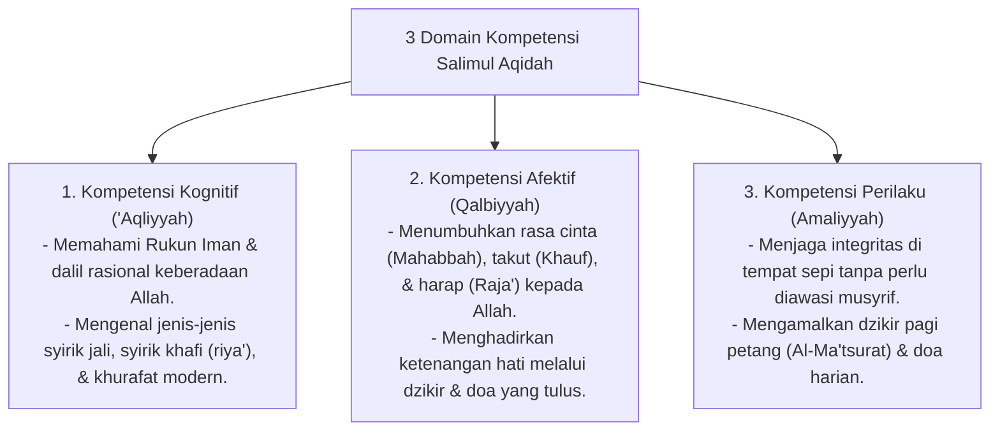

# P3-04-05-Standar-Kompetensi-dan-Taksonomi (Salimul Aqidah)

## Tujuan
Menetapkan **Standar Capaian Pembelajaran & Taksonomi Kompetensi** karakter Salimul Aqidah untuk seluruh jenjang santri di pesantren TUMBUH.

---

## 1. 3 Domain Kompetensi Salimul Aqidah

---

## 2. Matriks Capaian Berjenjang Sesuai Tangga TUMBUH

* **Jenjang T1 (Kelas 7 / 10 Baru)**: Mengenal dalil dasar Tauhid, menghafal doa harian dan dzikir Al-Ma'tsurat, serta belajar jujur kepada musyrif.
* **Jenjang T2 (Kelas 8 / 11)**: Mampu membedakan sunnah vs khurafat/mitos secara nalar, konsisten mengamalkan dzikir harian tanpa diperintah.
* **Jenjang T3 (Kelas 9 / 12)**: Mampu menolak ajakan bermaksiat saat sendiri (*Muraqabah*), ikhlas dan tenang dalam menghadapi tekanan ujian belajar.
* **Jenjang T4 (Santri Akhir / Teladan)**: Menjadi figur teladan (*Qudwah*) yang mengajak rekan-rekannya mengingat Allah dan mampu membantah syubhat pemikiran ateisme/liberalisme secara santun dan ilmiah.

---

## 3. Status Dokumen
* **Status**: 🌟 **A+ (Tervalidasi & Siap Diimplementasikan)**
* **Level**: Project 3 - `03 Capacity Framework / 04 Salimul Aqidah / ./P3-04-07-Rubrik-Indikator-Perilaku-4-Level.md`**.
