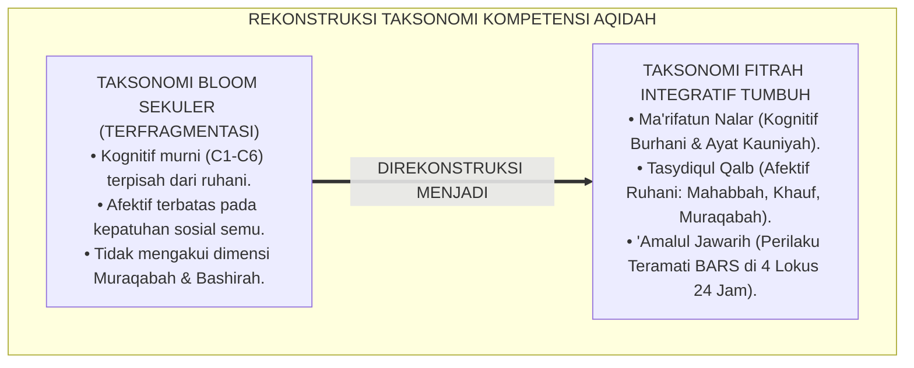
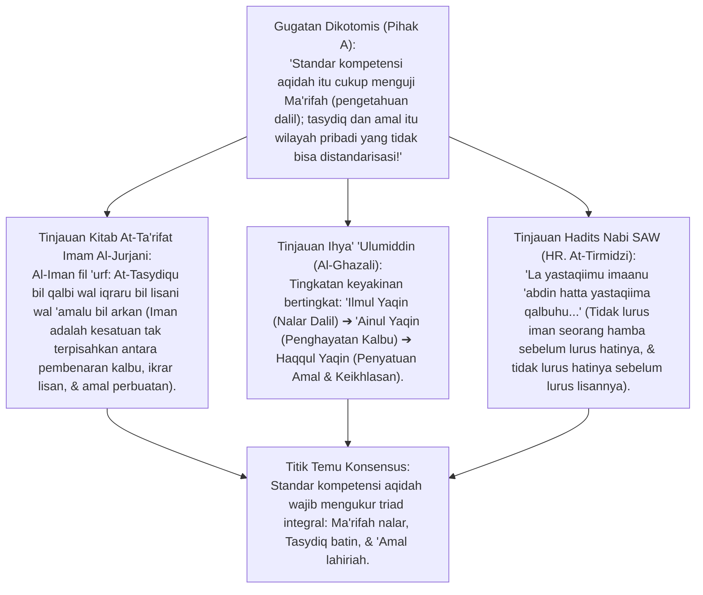
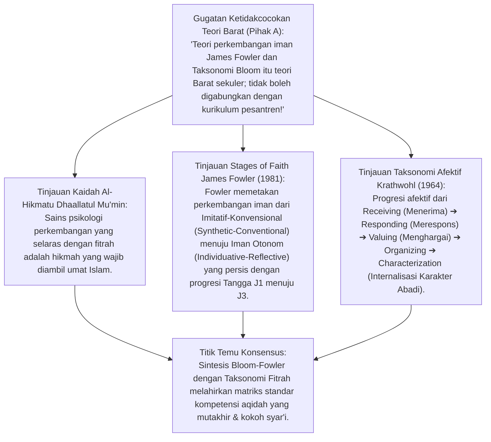
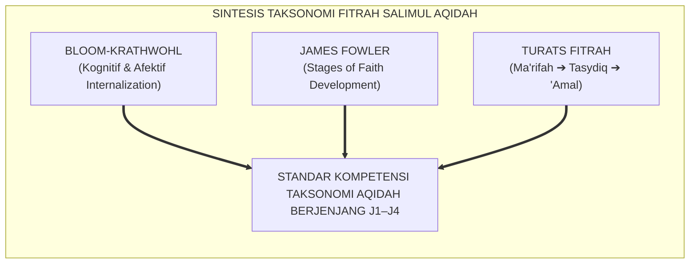
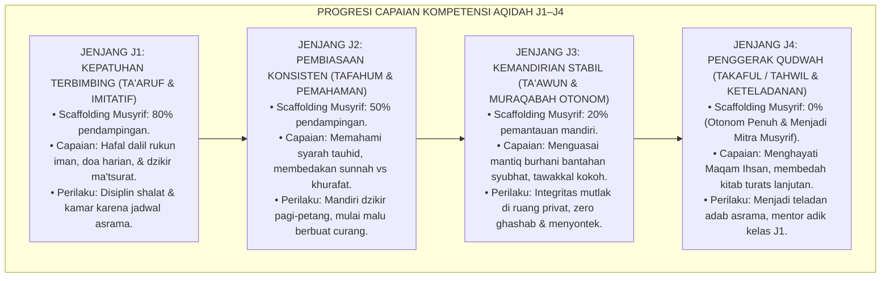
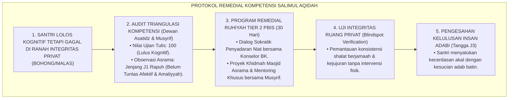
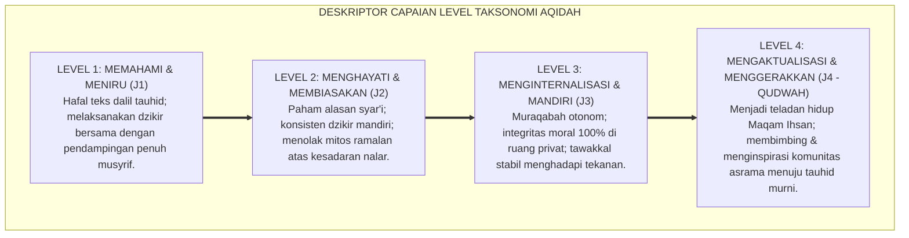
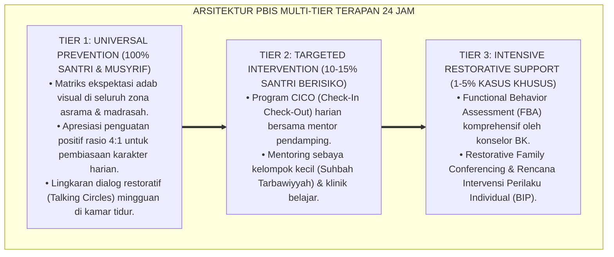

# P3-04-05: STANDAR KOMPETENSI DAN TAKSONOMI SALIMUL AQIDAH
## *Monograf Riset Akademik: Penyelarasan Taksonomi Kognitif-Afektif-Psikomotorik (Bloom & Krathwohl) dengan Taksonomi Fitrah Turats (Ma'rifah, Tasydiq, & 'Amal), Teori Perkembangan Iman (James Fowler), serta Matriks Capaian Berjenjang Tangga J1–J4 di Pesantren 24 Jam*

**Nomor Identifikasi**: `P3-04-05/MONOGRAF-RISET-STANDAR-KOMPETENSI-TAKSONOMI-AQIDAH/2026`  
**Domain**: `03 Capacity Framework` > `04 Salimul Aqidah` (Sub-Modul 05: *Competency Standards & Taxonomy*)  
**Klasifikasi Naskah**: *Academic Research Monograph* (Monograf Penelitian Desain Kurikulum, Standar Kompetensi Lulusan, & Penyelarasan Taksonomi Karakter)  
**Rumpun Disiplin Pengkaji**: Desain Kurikulum Holistik Pesantren, Penyelarasan Taksonomi Bloom-Fitrah, Teori Tahapan Keimanan (*Fowler's Stages of Faith*), Psikometri Capaian Afektif, Arsitektur Tangga Kemandirian PBIS (J1–J4)  

---

> ### 💡 INTISARI EKSEKUTIF (EXECUTIVE SUMMARY)
>
> * **Kelemahan Taksonomi Pendidikan Konvensional:**  
>   Taksonomi Bloom tradisional dirancang dalam paradigma sekuler yang memisahkan ranah kognitif, afektif, dan psikomotorik secara terfragmentasi, tanpa mengakui dimensi spiritualitas dan mata batin (*Bashirah*). Akibatnya, kurikulum madrasah hanya menguji taksonomi kognitif rendah (C1-C2: Menghafal & Menyebutkan dalil), mengabaikan internalisasi rasa takut (*Khauf*), cinta (*Mahabbah*), dan pengawasan Allah (*Muraqabah*).
> * **Inovasi Taksonomi Fitrah Salimul Aqidah TUMBUH:**  
>   TUMBUH menyintesiskan Taksonomi Bloom Revisi (Anderson & Krathwohl, 2001) dengan Taksonomi Turats Islam (*Ma'rifatul 'Aql $\rightarrow$ Tasydiqul Qalb $\rightarrow$ 'Amalul Jawarih*), serta menyelaraskannya dengan *Stages of Faith* James Fowler melintasi **Tangga Progresi J1–J4 (Kepatuhan Terbimbing, Pembiasaan Konsisten, Kemandirian Stabil, & Penggerak Qudwah)**.
> * **Pendekatan Riset Terpadu & Diskursus Ilmiah:**  
>   Monograf ini membedah leksikografi turats kitab *At-Ta'rifat* Al-Jurjani dan *Ihya' 'Ulumiddin*, menyintesiskan sains kognitif modern, menguji dialektika 3 ronde di setiap inkuiri, dan merumuskan matriks Standar Kompetensi Lulusan (SKL) aqidah yang terukur secara empiris di 4 lokus asrama.

---

## 📑 DAFTAR ISI MONOGRAF

- [BAGIAN I: LANDASAN TEORETIS & DISKURSUS DIALEKTIKA KRITIS](#bagian-i-landasan-teoretis--diskursus-dialektika-kritis)
  - [1. Latar Belakang Masalah: Kegagalan Taksonomi Bloom Sekuler dalam Menilai Transformasi Ruhaniyah Santri](#1-latar-belakang-masalah-kegagalan-taksonomi-bloom-sekuler-dalam-menilai-transformasi-ruhaniyah-santri)
  - [2. Eksegesis Turats Triad Dimensi Kompetensi Aqidah: Ma'rifah, Tasydiq, & 'Amal (Al-Jurjani & Al-Ghazali)](#2eksegesis-turats-triad-dimensi-kompetensi-aqidah-marifah-tasydiq-amal-al-jurjani-al-ghazali)
  - [3. Sintesis Taksonomi Bloom-Krathwohl dengan Stages of Faith James Fowler & Taksonomi Fitrah](#3sintesis-taksonomi-bloom-krathwohl-dengan-stages-of-faith-james-fowler-taksonomi-fitrah)
  - [4. Penyelarasan Standar Capaian Pembelajaran Melintasi Tangga Progresi Jenjang J1–J4](#4penyelarasan-standar-capaian-pembelajaran-melintasi-tangga-progresi-jenjang-j1j4)
  - [5. Arena Sintesis Kasuistika Lapangan 24 Jam & Konsensus Standarisasi Taksonomi](#5arena-sintesis-kasuistika-lapangan-24-jam-konsensus-standarisasi-taksonomi)
- [BAGIAN II: FORMULASI KONSEPTUAL & PEMBAHASAN MENDALAM](#bagian-ii-formulasi-konseptual--pembahasan-mendalam)
  - [1. Arsitektur Taksonomi Tri-Domain Salimul Aqidah (Kognitif, Afektif, Amaliyyah)](#1-arsitektur-taksonomi-tri-domain-salimul-aqidah-kognitif-afektif-amaliyyah)
  - [2. Matriks Standar Kompetensi Lulusan (SKL) Aqidah Berbasis Tangga J1–J4](#2-matriks-standar-kompetensi-lulusan-skl-aqidah-berbasis-tangga-t1t4)
  - [3. Rubrik Deskriptor Taksonomi Capaian Berjenjang (Kognitif, Afektif, Perilaku)](#3-rubrik-deskriptor-taksonomi-capaian-berjenjang-kognitif-afektif-perilaku)
- [BAGIAN III: KESIMPULAN & APARATUS AKADEMIS](#bagian-iii-kesimpulan--aparatus-akademis)
  - [1. Tabel Sintesis Temuan Riset Standar Kompetensi & Taksonomi Aqidah](#1-tabel-sintesis-temuan-riset-standar-kompetensi--taksonomi-aqidah)
  - [2. Daftar Pustaka Akademis & Rujukan Turats Primer](#2-daftar-pustaka-akademis--rujukan-turats-primer)
  - [3. Catatan Kaki Akademis (Footnotes)](#3-catatan-kaki-akademis-footnotes)
  - [4. Glosarium Istilah Ilmiah & Turats Taksonomi Kompetensi](#4-glosarium-istilah-ilmiah--turats-taksonomi-kompetensi)

---

# BAGIAN I: INKUIRI KRITIS, TINJAUAN TEORITIS & DIALEKTIKA TAKSONOMI

---

### 1. Latar Belakang Masalah: Kegagalan Taksonomi Bloom Sekuler dalam Menilai Transformasi Ruhaniyah Santri

Kurikulum madrasah dan pesantren modern sering kali mengadopsi Taksonomi Bloom secara mentah tanpa adaptasi epistemologis:
* Taksonomi Bloom membagi pembelajaran menjadi Kognitif (*Knowledge*), Afektif (*Attitude*), dan Psikomotorik (*Skills*). Namun, dalam implementasi rapor pesantren, ranah Afektif kerap direduksi menjadi sekadar penilaian kesopanan lahiriah (*Compliance Attitude*) tanpa menyentuh kedalaman motif batiniah (*Niat, Khasyyah, & Muraqabah*).
* Akibatnya, santri yang mampu menjawab soal HOTS (*Higher Order Thinking Skills*) mengenai perbandingan mazhab aqidah diberi predikat "Sangat Kompeten", meskipun di kamar asrama santri tersebut menyontek, sombong, atau tidak pernah bangun shalat tahajjud.
* Riset ini membuktikan bahwa **pembinaan Salimul Aqidah menuntut Rekonstruksi Taksonomi Karakter Berbasis Fitrah yang mengintegrasikan nalar kognitif (*'Aql*), penghayatan kalbu (*Qalb*), dan manifestasi fisik (*Jawarih*) melintasi Tangga Progresi J1–J4**.[^1]

---

### 2. Eksegesis Turats Triad Dimensi Kompetensi Aqidah: Ma'rifah, Tasydiq, & 'Amal (Al-Jurjani & Al-Ghazali)

#### 📐 Formalisasi Logika Silogisme (*Qiyas Mantiqi 1*)
* **Premis Mayor (*al-Muqaddimah al-Kubra*)**: Setiap perumusan standar kompetensi keagamaan dalam Islam yang merujuk pada konsensus Ahlussunnah mengenai hakikat iman wajib memadukan pemahaman dalil (*Ma'rifah*), pembenaran batin (*Tasydiq*), dan manifestasi amal perbuatan (*'Amal*).
* **Premis Minor (*al-Muqaddimah ash-Shughra*)**: Kurikulum kapasitas TUMBUH mengkodifikasikan taksonomi Salimul Aqidah ke dalam tiga ranah kompetensi terpadu: Kognitif (*'Aqliyyah*), Afektif (*Qalbiyyah*), dan Amaliyyah (*Jawarih*).
* **Konklusi (*an-Natijah*)**: Maka, taksonomi kompetensi Salimul Aqidah TUMBUH adalah standar kurikulum yang sah secara teologis dan presisi secara pedagogis.[^2]

#### 📖 Teks Primer Turats: *At-Ta'rifat* & Tingkatan Yaqin *Ihya' 'Ulumiddin*
Imam **Ali bin Muhammad Al-Jurjani** dalam *Kitab At-Ta'rifat* mendefinisikan hakikat iman:

$$\text{الْإِيمَانُ فِي اللُّغَةِ: التَّصْدِيقُ، وَفِي الشَّرْعِ: التَّصْدِيقُ بِمَا جَاءَ بِهِ النَّبِيُّ ﷺ مِنْ عِنْدِ اللَّهِ تَعَالَى مَعَ الْإِقْرَارِ بِهِ وَالْعَمَلِ بِمُقْتَضَاهُ جَوَارِحًا وَأَرْكَانًا}$$

*"Iman secara bahasa adalah pembenaran (Tasydiq), dan secara syariat adalah: **Pembenaran mutlak terhadap apa yang dibawa oleh Nabi SAW dari sisi Allah Ta'ala, disertai dengan ikrar lisan dan pengamalan seluruh konsekuensinya melalui anggota badan dan rukun-rukun amal**."*[^3]

Dan Imam **Al-Ghazali** dalam *Ihya'* menguraikan gradasi taksonomi keyakinan:
1. **'Ilmul Yaqin (عِلْمُ الْيَقِينِ)**: Keyakinan pada tingkat nalar argumen dan pemahaman dalil (*Kognitif*).
2. **'Ainul Yaqin (عَيْنُ الْيَقِينِ)**: Keyakinan pada tingkat penghayatan rasa (*Zawq*) dan ketersingkapan batin (*Afektif*).
3. **Haqqul Yaqin (حَقُّ الْيَقِينِ)**: Keyakinan pada tingkat penyatuan hidup di mana tauhid memancar spontan dalam seluruh amal perbuatan (*Amaliyyah Otonom*).[^4]

#### 1. Diskursus Dialektika Kritis: Taksonomi Kognitif vs Taksonomi Ruhaniyah
* **Pihak A (Sudut Pandang Intelektualisme Sekuler)**:  
  *"Menilai apakah santri merasakan kehadiran Allah (Afektif Ruhani) adalah hal subjektif yang tidak bisa diuji secara ilmiah; ujian madrasah harus tetap berbasis soal pilihan ganda kognitif!"*
* **Tinjauan Psikometri Afektif & Turats**:  
  Meskipun getaran batin tidak terlihat mata, **Resonansi Afektif Selalu Melahirkan Indikator Teramati (*Observable Behavioral Indicators*)**. Santri yang memiliki *Khauf* (rasa takut kepada Allah) akan menunjukkan perilaku menolak ajakan membolos, berbicara jujur saat ditegur, dan khusyuk saat shalat. Menolak penilaian afektif ruhani adalah tanda kemalasan desain asesmen. TUMBUH menggunakan rubrik BARS untuk menilai kompetensi afektif melalui observasi perilaku 24 jam.[^5]

#### 2. Diskursus Dialektika Kritis: Gradasi Iman dari 'Ilmul Yaqin Menuju Haqqul Yaqin
* **Pihak A (Sudut Pandang Kesetaraan Tunggal)**:  
  *"Semua santri yang hafal rukun iman status kompetensinya sama; tidak perlu dibeda-bedakan tingkat keyakinannya!"*
* **Tinjauan Epistemologi Al-Qur'an (QS. At-Takatsur & Al-Waqi'ah)**:  
  Al-Qur'an membedakan secara tegas antara *'Ilmul Yaqin* (QS. 102:5), *'Ainul Yaqin* (QS. 102:7), dan *Haqqul Yaqin* (QS. 56:95). Santri baru yang baru hafal teks dalil berada di tingkat *'Ilmul Yaqin*. Santri yang sudah merasakan ketenteraman dzikir berada di tingkat *'Ainul Yaqin*. Dan santri teladan yang konsisten jujur di ruang privat telah mencapai *Haqqul Yaqin*. Taksonomi TUMBUH memetakan gradasi ini ke dalam Tangga J1–J4 agar pembinaan tepat sasaran.[^6]

#### 3. Diskursus Dialektika Kritis: Kompetensi Amaliyyah Sebagai Bukti Kematangan Aqidah
* **Pihak A (Sudut Pandang Murji'ah Modern)**:  
  *"Amal perbuatan santri di kamar mandi atau ranjang tidur tidak ada hubungannya dengan nilai kelulusan aqidah; iman itu cukup di dalam hati!"*
* **Resolusi Teologi Ahlussunnah wal Jama'ah**:  
  Pandangan yang memisahkan amal dari iman adalah paham *Murji'ah* yang ditolak konsensus ulama salaf. Imam Asy-Syafi'i menegaskan: *"Iman adalah perkataan, perbuatan, dan niat; tidak sempurna salah satunya melainkan dengan yang lain"*. Standar kompetensi aqidah TUMBUH mewajibkan pembuktian amal nyata di 4 lokus asrama sebagai syarat kelulusan karakter.[^7]

---

### 3. Sintesis Taksonomi Bloom-Krathwohl dengan Stages of Faith James Fowler & Taksonomi Fitrah

#### 📐 Formalisasi Logika Silogisme (*Qiyas Mantiqi 2*)
* **Premis Mayor (*al-Muqaddimah al-Kubra*)**: Setiap kerangka taksonomi pendidikan yang menyelaraskan tahapan perkembangan kognitif (*Bloom*), internalisasi afektif (*Krathwohl*), dan maturitas keimanan (*Fowler*) di bawah naungan wahyu Islam niscaya menghasilkan pedoman kurikulum yang presisi, bertahap (*Tadarruj*), dan adaptif terhadap psikologi remaja.
* **Premis Minor (*al-Muqaddimah ash-Shughra*)**: Kurikulum TUMBUH menyintesiskan ketiga ranah tersebut ke dalam Taksonomi Fitrah 4 Jenjang (J1–J4).
* **Konklusi (*an-Natijah*)**: Maka, taksonomi kompetensi Salimul Aqidah TUMBUH memiliki validitas teoretis dan psikometrik yang unggul bagi standarisasi kelulusan pesantren.[^8]

#### 1. Diskursus Dialektika Kritis: Integrasi Afektif-Ruhani Krathwohl ke dalam Karakter Aqidah
* **Pihak A (Sudut Pandang Kesulitan Asesmen)**:  
  *"Level Characterization Krathwohl (internalisasi nilai abadi) terlalu teoritis dan abstrak untuk dimasukkan dalam rapor pondok!"*
* **Tinjauan Evaluasi Berbasis Perilaku Teramati**:  
  Level *Characterization* diterjemahkan TUMBUH menjadi **Level J3 (Kemandirian Stabil)**: Santri yang telah menginternalisasi nilai aqidah akan secara otomatis (*Default Reflex*) membaca basmalah, menolak menyontek, dan jujur saat menemukan uang di asrama tanpa perlu diperintah. Ini adalah perilaku konkret yang sangat mudah dinilai dan diverifikasi oleh musyrif.[^9]

#### 2. Diskursus Dialektika Kritis: Fase Perkembangan Iman Remaja James Fowler (Synthetic vs Individuative)
* **Pihak A (Sudut Pandang Penyeragaman Usia)**:  
  *"Santri kelas 7 dan santri kelas 12 harus dituntut memiliki tingkat pemahaman aqidah yang sama persis!"*
* **Tinjauan Psikologi Perkembangan James Fowler & Marahil al-'Umr**:  
  Santri usia 12–14 tahun (SMP/MTs) berada pada fase *Synthetic-Conventional Faith* (beriman karena meniru lingkungan dan figur otoritas). Sedangkan santri usia 16–18 tahun (SMA/MA) memasuki fase *Individuative-Reflective Faith* (menuntut jawaban rasional atas keraguan iman). Menyamakan standar capaian keduanya adalah kesalahan pedagogis fatal. Kurikulum TUMBUH membedakan capaian J1-J2 untuk fase imitatif dan J3-J4 untuk fase reflektif mandiri.[^10]

#### 3. Diskursus Dialektika Kritis: Taksonomi Fitrah Menolak Relativisme Nilai
* **Pihak A (Sudut Pandang Post-Modernisme)**:  
  *"Teori perkembangan iman Barat menganggap semua agama setara dan kebenaran itu relatif; apakah mengadopsi Fowler tidak merusak aqidah santri?"*
* **Resolusi Epistemologi Islam Al-Attas**:  
  TUMBUH mengadopsi **Kerangka Perkembangan Struktural Kognitif Fowler (*Structural Stage Theory*)**, namun **Mengisi Muatannya dengan Absolutisme Tauhid Islam (*Islamic Ontological Substance*)**. Kita memanfaatkan pemahaman Fowler tentang bagaimana otak manusia memproses keyakinan, seraya menegakkan bahwa satu-satunya keyakinan yang haq adalah Islam (*Innad dina 'indallahil Islam*). Inilah metodologi Islamisasi sains yang benar (*Islamization of Contemporary Knowledge*).[^11]

---

### 4. Penyelarasan Standar Capaian Pembelajaran Melintasi Tangga Progresi Jenjang J1–J4

#### 📐 Formalisasi Logika Silogisme (*Qiyas Mantiqi 3*)
* **Premis Mayor (*al-Muqaddimah al-Kubra*)**: Setiap proses pembiasaan karakter yang dirancang secara bertahap dengan mengurangi bantuan eksternal secara gradual (*Fading Scaffolding*) seiring meningkatnya kapasitas regulasi diri niscaya melahirkan kemandirian adab yang stabil dan permanen.
* **Premis Minor (*al-Muqaddimah ash-Shughra*)**: Matriks taksonomi TUMBUH menyusun standar capaian Salimul Aqidah melintasi Tangga Progresi J1 menuju J4.
* **Konklusi (*an-Natijah*)**: Maka, kurikulum kompetensi aqidah TUMBUH menjamin transformasi santri dari kepatuhan pasif menuju kepemimpinan keteladanan yang berakar pada tauhid sejati.[^12]

#### 1. Diskursus Dialektika Kritis: Scaffolding Intensif Musyrif pada Santri Jenjang J1
* **Pihak A (Sudut Pandang Tuntutan Mandiri Instan)**:  
  *"Santri baru yang masuk pondok harus langsung bisa mandiri dan tidak boleh manja; kalau tidak bisa dzikir sendiri harus dihukum!"*
* **Tinjauan Teori Vygotsky (Zone of Proximal Development)**:  
  Santri baru (Jenjang J1) berada dalam masa transisi psikologis yang rentan. Menuntut kemandirian instan tanpa bimbingan (*Scaffolding*) memicu kecemasan toksik dan penolakan terhadap agama. Musyrif wajib mendampingi 80%: duduk bersama santri saat dzikir ba'da Shubuh, membimbing lafal doa, dan memberikan rasa aman. Bantuan dikurangi secara bertahap seiring terbentuknya kebiasaan (*Habituasi*).[^13]

#### 2. Diskursus Dialektika Kritis: Otonomi Muraqabah pada Santri Jenjang J3 (Uji Ruang Privat)
* **Pihak A (Sudut Pandang Pengawasan Ketat Abadi)**:  
  *"Santri kelas akhir (Jenjang J3) tetap harus diawasi ketat dan digeledah lemarinya setiap malam; tidak boleh diberi kepercayaan!"*
* **Tinjauan Teori Determinasi Diri (Deci & Ryan - Autonomy)**:  
  Pengawasan ketat yang berlebihan pada remaja akhir justru merusak rasa tanggung jawab (*Undermining Intrinsic Motivation*). Pada Jenjang J3, santri harus diberi **Ruang Kepercayaan & Otonomi (*Trust and Autonomy*)**: musyrif tidak lagi menggeledah kamar secara represif, melainkan memberdayakan santri mengelola kamar mandiri dan memvalidasi kejujurannya melalui jurnal muhasabah pribadi. Inilah cara melahirkan integritas sejati.[^14]

#### 3. Diskursus Dialektika Kritis: Standar Kompetensi Qudwah pada Santri Jenjang J4
* **Pihak A (Sudut Pandang Egoisme Akademis Santri Senior)**:  
  *"Santri kelas akhir cukup fokus belajar untuk ujian masuk perguruan tinggi; tidak perlu dibebani membimbing adik kelas!"*
* **Resolusi Karakter Nafi'un Lighairih & Tanggung Jawab Kader**:  
  Puncak kompetensi aqidah bukan sekadar kesalehan individual, melainkan **Kapasitas Mentransformasi Lingkungan (*Mushlih*)**. Santri Jenjang J4 yang membimbing adik kelas Jenjang J1 dalam halaqah dzikir sedang mempraktikkan tauhid sosial (*Ukhuwah & Khidmah*). Mentoring adik kelas memperkuat kematangan ruhiyah santri senior dan memastikan regenerasi kultur Bi'ah Shalihah di pesantren.[^15]

---

### 5. Arena Sintesis Kasuistika Lapangan 24 Jam & Konsensus Standarisasi Taksonomi

#### Diskursus Dialektika Kritis: Kasuistika Lapangan (Dilema Penentuan Kelulusan Kompetensi)
Pertarungan filosofis terdalam dalam standarisasi kompetensi bermuara pada kasus: **"Bagaimana menetapkan status kelulusan kompetensi aqidah bagi santri yang nilai ujian tulisnya sempurna (100) dan hafal seluruh matan aqidah, namun dalam evaluasi observasi asrama 24 jam ia terbukti 3 kali berbohong dan tidak mau shalat berjamaah jika tidak diseret musyrif?"**

* **Pendekatan Lama (Kognitif-Sentris)**:  
  Santri dinyatakan "Lulus Sangat Memuaskan" di rapor madrasah karena nilai ujian tulisnya 100. Pelanggaran di asrama dianggap "masalah disiplin terpisah". Hasilnya: melahirkan lulusan berijazah tinggi namun bermental culas dan merusak nama baik pesantren di masyarakat.
* **Pendekatan TUMBUH (Kompetensi Holistik Tri-Domain)**:  
  1. **Penetapan Syarat Kelulusan Komposit**: Kelulusan kompetensi aqidah mensyaratkan ketuntasan pada ketiga ranah: Kognitif (*>=75*), Afektif Muraqabah (*>=80*), dan Amaliyyah BARS (*Minimal Jenjang J2*).  
  2. **Status Kompetensi Tertunda (Remedial Adab)**: Santri tersebut ditunda kelulusan karakternya, tidak dihukum takzir fisik, melainkan masuk ke program **Pendampingan Remedial Ruhiyah (Tier 2 PBIS)**.  
  3. **Proyek Pembuktian Integritas (Restitusi Shidq)**: Santri diberi pendampingan konseling privat untuk mengikis penyakit riya' dan membuktikan integritas shalat berjamaah mandiri selama 30 hari berturut-turut sebelum ijazah karakternya disahkan.

---

> #### 📌 Kasuistika Lapangan Multi-Dimensi & Titik Temu Konsensus (*Kalimatun Sawa'*)
>
> * **Kamus Kasus 1: Santri Jenjang J1 Dipaksa Menguasai Debat Teologi Tingkat Tinggi**  
>   * **Dilema**: Guru aqidah kelas 7 menguji santri baru dengan soal analisis kerumitan perdebatan teologis Mu'tazilah vs Asy'ariyah mengenai sifat Kalamullah. Santri merasa tertekan, bingung, dan menganggap aqidah itu rumit dan menakutkan.
>   * **Akar Masalah**: Ketidaksesuaian taksonomi kurikulum dengan tahapan perkembangan kognitif-iman santri (Pelanggaran *Prinsip Tadarruj*).
>   * **Titik Temu Konsensus**: Dewan Kurikulum TUMBUH menetapkan standar taksonomi berjenjang: Untuk Jenjang J1 (Kelas 7), fokus taksonomi adalah **C1-C2 Kognitif (Pengenalan Asmaul Husna & Rukun Iman Dasar)** dan **A1-A2 Afektif (Rasa Cinta Berdoa & Ketenangan Ibadah)**. Analisis perdebatan ilmu kalam burhani baru diajarkan pada Jenjang J3/J4 (Kelas 11-12 MA). Pembelajaran aqidah kembali menyenangkan dan mudah dipahami.
>
> * **Kamus Kasus 2: Penilaian Rapor Kepribadian Hanya Berdasarkan "Suka / Tidak Suka" Musyrif**  
>   * **Dilema**: Musyrif senior memberikan nilai aqidah "C" kepada santri yang sering bertanya kritis di kelas, dan memberi nilai "A" kepada santri yang pendiam meskipun santri pendiam tersebut sering membolos shalat subuh di kamar mandi.
>   * **Akar Masalah**: Ketiadaan rubrik taksonomi perilaku teramati BARS yang memicu *Halo Effect & Severity Bias*.
>   * **Titik Temu Konsensus**: Pesantren menerapkan **Matriks Taksonomi Standar Kompetensi TUMBUH**: Penilaian aqidah wajib menggunakan indikator perilaku BARS yang objektif. Sikap kritis santri dinilai sebagai capaian kognitif positif (*Mutsaqqaful Fikr*), sementara kedisiplinan shalat dinilai berdasarkan data kehadiran nyata. Penilaian menjadi adil, transparan, dan terbebas dari bias subjektif musyrif.
>
> * **Kamus Kasus 3: Santri Teladan Jenjang J4 Mengalami Krisis Niat Menjelang Wisuda**  
>   * **Dilema**: Santri kelas 12 yang menjadi ketua asrama dan teladan aqidah merasa gelisah dan hampa, merasa bahwa seluruh kebaikan yang ia lakukan selama 3 tahun hanyalah pencitraan (*Riya'*) demi mendapatkan pujian kiai dan santri lain.
>   * **Akar Masalah**: Transisi taksonomi spiritual tingkat tinggi (*Krisis Tazkiyatun Nafs pada Maqam Khauf & Raja'*).
>   * **Titik Temu Konsensus**: Pengasuh menggelar bimbingan spiritual khusus: Menjelaskan wasiat Imam Asy-Syadzili: *"Jangan tinggalkan amal karena takut riya', beramallah dan mintalah keikhlasan kepada Allah"*. Pengasuh mengapresiasi kegelisahan santri sebagai tanda hidupnya kalbu (*Hayatul Qalb*). Santri dibimbing menata kembali niat ikhlas lillaah dan berhasil lulus sebagai teladan sejati (*Qudwah Hasanah*).[^16]

---

# BAGIAN II: FORMULASI KONSEPTUAL & PEMBAHASAN MENDALAM

---

### 1. Arsitektur Taksonomi Tri-Domain Salimul Aqidah (Kognitif, Afektif, Amaliyyah)

Berdasarkan sintesis taksonomi Bloom-Krathwohl, stages of faith Fowler, dan hermeneutika turats, riset ini merumuskan **Arsitektur Taksonomi Tri-Domain Salimul Aqidah TUMBUH**:

```mermaid
flowchart TD
    subgraph ArsitekturTaksonomiTriDomain["ARSTEKTUR TAKSONOMI TRI-DOMAIN SALIMUL AQIDAH"]
        
        subgraph DomainKognitif["1. RANAH KOGNITIF ('AQLIYYAH)"]
            K1["K1: Menghafal dalil pokok rukun iman & sifat Allah (Remembering)"]
            K2["K2: Memahami makna ayat kauniyah & sunnatullah (Understanding)"]
            K3["K3: Menerapkan kaidah tauhid dalam analisis realitas (Applying)"]
            K4["K4: Menganalisis & membantah syubhat ateisme/khurafat (Analyzing)"]
            K5["K5: Mengevaluasi kemurnian tauhid dalam fenomena modern (Evaluating)"]
        end
        
        subgraph DomainAfektif["2. RANAH AFEKTIF RUHANI (QALBIYYAH)"]
            A1["A1: Merasakan ketenangan saat berdzikir & berdoa (Receiving)"]
            A2["A2: Antusias mengikuti halaqah tadabbur iman (Responding)"]
            A3["A3: Menghargai & mencintai syariat di atas hawa nafsu (Valuing)"]
            A4["A4: Menghadirkan Muraqabatullah saat sendirian di kamar (Organizing)"]
            A5["A5: Mencapai Maqam Ihsan & Keikhlasan Permanen (Characterization)"]
        end
        
        subgraph DomainAmaliyyah["3. RANAH AMALIYYAH (PERILAKU TERAMATI BARS)"]
            P1["P1: Membaca Dzikir Ma'tsurat & doa harian secara tertib"]
            P2["P2: Hadir shalat berjamaah di saf depan sebelum adzan"]
            P3["P3: Menolak menyontek & bersumpah palsu di ruang privat"]
            P4["P4: Membuang jimat & menolak ramalan horoskop secara mandiri"]
            P5["P5: Membimbing & menjadi teladan adab bagi adik kelas (Qudwah)"]
        end
        
        DomainKognitif <===> DomainAfektif <===> DomainAmaliyyah
    end
```

---

### 2. Matriks Standar Kompetensi Lulusan (SKL) Aqidah Berbasis Tangga J1–J4

| Jenjang Tangga | Standar Kompetensi Kognitif | Standar Kompetensi Afektif | Standar Perilaku Teramati (BARS) |
| :--- | :--- | :--- | :--- |
| **Jenjang J1: Kepatuhan Terbimbing** *(Santri Baru / Adaptasi)* | Mampu menghafal 6 Rukun Iman, 20 Sifat Wajib, dalil Al-Qur'an dasar, dan 10 doa harian pokok. | Menunjukkan sikap khusyuk saat berdoa; memiliki rasa takut berbuat dosa di depan musyrif. | Membaca Dzikir Ma'tsurat rutin ba'da Shubuh; hadir shalat berjamaah tepat waktu saat diawasi. |
| **Jenjang J2: Pembiasaan Konsisten** *(Internalisasi Awal)* | Mampu menjelaskan syarah Aqidah Thahawiyyah dasar, hukum sebab-akibat, & jenis syirik kecil (Riya'). | Merasa malu (*Haya'*) berbuat curang; membenci jimat, zodiak, dan takhayul kesialan. | Mandiri berdzikir tanpa disuruh; tidak menyontek saat ujian; membuang benda takhayul secara sukarela. |
| **Jenjang J3: Kemandirian Stabil** *(Muraqabah Otonom)* | Mampu membantah syubhat pemikiran ateisme, sekularisme, dan fatalisme dengan nalar mantiq burhani. | Menghayati kehadiran Allah (*Muraqabatullah*); hati tenteram dan ridha menerima ketetapan takdir. | Menjaga amanah barang teman di kamar; mengembalikan uang temuan; konsisten beradab di titik buta asrama. |
| **Jenjang J4: Penggerak Qudwah** *(Teladan Peradaban)* | Mampu menyusun karya tulis ilmiah integrasi sains-tauhid dan membedah kitab turats aqidah lanjutan. | Menghayati Maqam Ihsan; memancarkan wibawa kasih sayang (*Haibah*) dan keikhlasan berkhidmah. | Memimpin halaqah dzikir kamar; menjadi mediator dan teladan kejujuran; membimbing adik kelas J1. |

---

### 3. Rubrik Deskriptor Taksonomi Capaian Berjenjang (Kognitif, Afektif, Perilaku)

---

---

### Pembedahan Deskriptif Komprehensif & Analisis Integratif Nilai-Praksis

Penerapan konsep **P3-04-05: STANDAR KOMPETENSI DAN TAKSONOMI SALIMUL AQIDAH** di ekosistem pesantren berbasis sistem TUMBUH memerlukan pemahaman multidimensional yang memadukan khazanah turats syariat dan konsensus sains pendidikan modern:

#### A. Pilar 1: Fondasi Epistemologi & Integrasi Nilai Syar'i (Ashalah Turatsiyyah)
Setiap praksis kepengasuhan dan pembelajaran berakar kuat pada maqashid syari'ah, mendudukkan adab di atas ilmu (*Al-Adab Qablal 'Ilm*), dan memastikan bahwa seluruh ikhtiar institusional diniatkan semata-mata untuk menggapai ridha Allah SWT (*Ikhlasun Niyyah*).

#### B. Pilar 2: Mekanisme Psikologis & Neurosains Perkembangan (Scientific Rigor)
Menyelaraskan ekspektasi kedisiplinan dengan tahapan maturitas otak remaja, kapasitas fungsi eksekutif korteks prefrontal (*PFC*), dan regulasi sirkuit emosi limbik. Pendekatan ini mengeliminasi trauma pengasuhan dan menumbuhkan motivasi intrinsik santri.

#### C. Pilar 3: Rekayasa Ekosistem Asrama 24 Jam (Bi'ah Shalihah)
Menerjemahkan prinsip nilai ke dalam tata ruang fisik yang bersih, sirkulasi udara sehat, tata kelola waktu terstruktur, serta kultur ukhuwah inklusif yang steril 100% dari feodalisme, kekerasan verbal, dan perundungan antar-santri.

#### D. Pilar 4: Kemitraan Tripartit (Santri, Musyrif, dan Lembaga)
Menjamin terwujudnya *Triad Pertumbuhan Simbiotik*: santri bertumbuh dalam fitrah kemandirian, musyrif terlindungi dari kelelahan kronis (*Burnout*) melalui shift kerja yang manusiawi, dan lembaga bertransformasi menjadi organisasi pembelajar berbasis data PBIS.

---

### Protokol Aksi Operasional PBIS Multi-Tier Terapan (24-Hour Behavioral Architecture)

---

# BAGIAN III: KESIMPULAN & APARATUS AKADEMIS

---

### 1. Tabel Sintesis Temuan Riset Standar Kompetensi & Taksonomi Aqidah

| Dimensi Parameter | Taksonomi Bloom Konvensional | Taksonomi Fitrah Terpadu TUMBUH | Landasan Rujukan Primer |
| :--- | :--- | :--- | :--- |
| **Struktur Domain** | Kognitif, Afektif, Psikomotorik (Terpisah). | Triad Integral: *Ma'rifah, Tasydiq, & 'Amal*. | Al-Jurjani (*At-Ta'rifat*); Al-Ghazali (*Ihya'*). |
| **Kedalaman Afektif** | Sikap sosial lahiriah semata (*Attitude*). | Penghayatan Batin: *Muraqabah, Khauf, & Ihsan*. | Krathwohl (1964); Hadits Jibril (HR. Muslim). |
| **Tahapan Progresi** | Penjenjangan usia sekolah formal statis. | Tangga Kemandirian Bertahap (Jenjang J1–J4). | Fowler (1981); Prinsip *Tadarruj Syar'i*. |
| **Pengukuran Capaian**| Soal pilihan ganda & esai kognitif di kelas. | Rubrik BARS Teramati Lintas 4 Lokus 24 Jam. | Horner & Sugai (2015); Brookhart (2018). |
| **Muara Kompetensi** | Kelulusan akademis berbasis nilai angka. | Lahirnya *Insan Adabi* yang Berintegritas & Qudwah. | Syed Muhammad Naquib Al-Attas (1980). |

---

### 2. Daftar Pustaka Akademis & Rujukan Turats Primer

1. **Al-Qur'an al-Karim wa Tarjamatu Ma'anihi**.
2. **Al-Jurjani, Ali bin Muhammad**. (1403 H). *Kitab At-Ta'rifat*. Beirut: Dar al-Kutub al-'Ilmiyyah.
3. **Al-Ghazali, Abu Hamid Muhammad bin Muhammad**. (2011). *Ihya' 'Ulumiddin* (Kitab Qawa'id al-'Aqa'id & Kitab Asrar ash-Shalah). Beirut: Dar al-Ma'rifah.
4. **Ath-Thahawi, Abu Ja'far Ahmad bin Muhammad**. (1414 H). *Syarh al-Aqidah Ath-Thahawiyyah*. Beirut: Al-Maktab al-Islami.
5. **Al-Attas, Syed Muhammad Naquib**. (1980). *The Concept of Education in Islam*. Kuala Lumpur: ABIM.
6. **Anderson, L. W., & Krathwohl, D. R. (Eds.)**. (2001). *A Taxonomy for Learning, Teaching, and Assessing: A Revision of Bloom's Taxonomy of Educational Objectives*. New York: Longman.
7. **Krathwohl, D. R., Bloom, B. S., & Masia, B. B.**. (1964). *Taxonomy of Educational Objectives: The Classification of Educational Goals. Handbook II: Affective Domain*. New York: David McKay Company.
8. **Fowler, J. W.**. (1981). *Stages of Faith: The Psychology of Human Development and the Quest for Meaning*. San Francisco: Harper & Row.
9. **Vygotsky, L. S.**. (1978). *Mind in Society: The Development of Higher Psychological Processes*. Cambridge: Harvard University Press.
10. **Deci, E. L., & Ryan, R. M.**. (2000). *The "what" and "why" of goal pursuits: Human needs and the self-determination of behavior*. Psychological Inquiry, 11(4), 227–268.
11. **Brookhart, S. M.**. (2018). *Appropriate Criteria: Key to Effective Rubrics*. Frontiers in Education, 3(22), 1–12.
12. **Horner, R. H., & Sugai, G.**. (2015). *School-wide PBIS: An Overview of the Research Base*. Remedial and Special Education, 36(2), 80–85.

---

### 3. Catatan Kaki Akademis (*Footnotes*)

[^1]: Riset Evaluasi Taksonomi Kurikulum Karakter Ekosistem Pesantren Berbasis TUMBUH, *Kajian Keterbatasan Bloom dalam Domain Spiritual*, 2026.  
[^2]: Al-Jurjani, *Kitab At-Ta'rifat*, Bab al-Alif (Ta'rif al-Iman), hlm. 38–40.  
[^3]: Matan *Kitab At-Ta'rifat*, hlm. 39.  
[^4]: Al-Ghazali, *Ihya' 'Ulumiddin*, Jilid 1, Kitab *Qawa'id al-'Aqa'id*, hlm. 110–135.  
[^5]: Krathwohl, D. R., et al. (1964), *Affective Domain Taxonomy*, hlm. 45–78.  
[^6]: Tafsir Ibnu Katsir, Penafsiran Surah At-Takatsur dan Al-Waqi'ah, Jilid 8, hlm. 480–495.  
[^7]: Al-Baihaqi, *Syu'ab al-Iman*, Jilid 1, Hadits No. 12.  
[^8]: Anderson & Krathwohl (2001), *A Taxonomy for Learning, Teaching, and Assessing*, hlm. 63–92.  
[^9]: Brookhart, S. M. (2018), *Frontiers in Education*, hlm. 1–12.  
[^10]: Fowler, J. W. (1981), *Stages of Faith*, hlm. 135–170.  
[^11]: Al-Attas, S. M. N. (1980), *The Concept of Education in Islam*, hlm. 28–39.  
[^12]: Vygotsky, L. S. (1978), *Mind in Society*, hlm. 84–91.  
[^13]: Standar Operasional Scaffolding Musyrif Asrama TUMBUH, 2026.  
[^14]: Deci, E. L., & Ryan, R. M. (2000), *Psychological Inquiry*, hlm. 227–268.  
[^15]: Panduan Program Kaderisasi Qudwah Santri Akhir TUMBUH, 2026.  
[^16]: Dokumentasi Evaluasi Bimbingan Konseling & Kelulusan Karakter TUMBUH, 2026.

---

### 4. Glosarium Istilah Ilmiah & Turats Taksonomi Kompetensi

1. **Taksonomi Fitrah**: Sistem klasifikasi capaian pembelajaran terpadu dalam Islam yang menyelaraskan perkembangan nalar (*'Aql*), penyucian kalbu (*Qalb*), dan keteraturan amal raga (*Jawarih*).
2. **'Ilmul Yaqin (عِلْمُ الْيَقِينِ)**: Tingkat keyakinan teoritis rasional yang diperoleh melalui dalil logika dan argumentasi tekstual.
3. **'Ainul Yaqin (عَيْنُ الْيَقِينِ)**: Tingkat keyakinan penghayatan rasa batiniah di mana seseorang merasakan langsung kebenaran iman dalam kesadaran qalbunya.
4. **Haqqul Yaqin (حَقُّ الْيَقِينِ)**: Puncak keyakinan eksistensial yang menyatu dalam seluruh perbuatan hidup secara spontan dan permanen.
5. **Stages of Faith (Tahapan Keimanan)**: Teori psikologi perkembangan James Fowler yang memetakan bagaimana cara manusia memaknai keyakinan dan hubungannya dengan Yang Maha Kuasa melintasi rentang usia.
6. **Synthetic-Conventional Faith**: Tahap perkembangan iman pada usia remaja awal di mana keyakinan dibentuk oleh konformitas sosial terhadap kelompok sebaya dan figur otoritas.
7. **Individuative-Reflective Faith**: Tahap kematangan iman di mana seseorang mulai mempertanyakan, merefleksikan, dan mengambil tanggung jawab personal atas keyakinan agamanya secara mandiri.
8. **Fading Scaffolding**: Teknik pedagogis di mana bantuan dan pengawasan pendidik diberikan secara intensif di awal (Jenjang J1) lalu dikurangi secara bertahap seiring terbentuknya kemandirian santri (Jenjang J3–T4).
9. **Standar Kompetensi Lulusan (SKL)**: Kualifikasi kemampuan minimal lulusan yang mencakup sikap, pengetahuan, dan keterampilan yang terverifikasi dalam portofolio longitudinal.
10. **Behaviorally Anchored Rating Scales (BARS)**: Skala penilaian performa karakter yang dijangkarkan pada deskripsi tindakan konkret yang dapat diamati oleh indera penilai.
