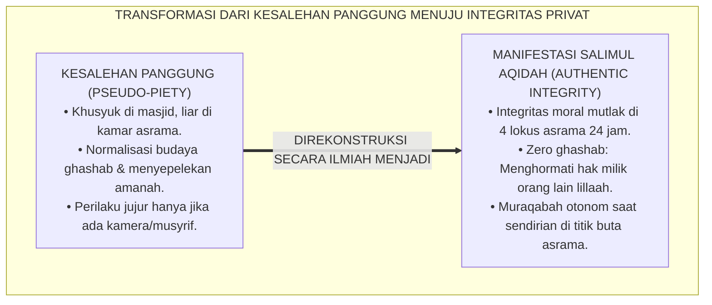
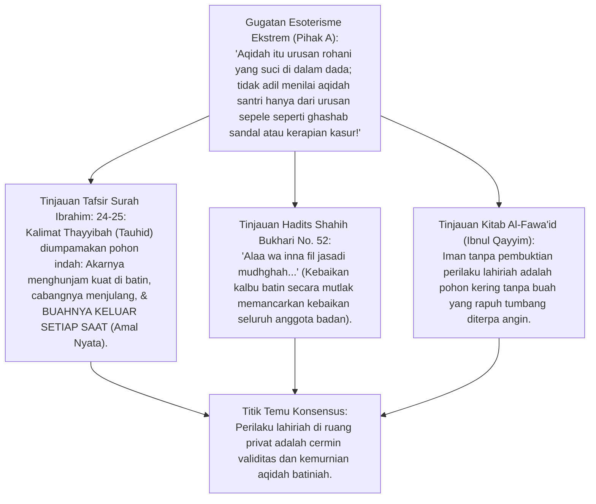
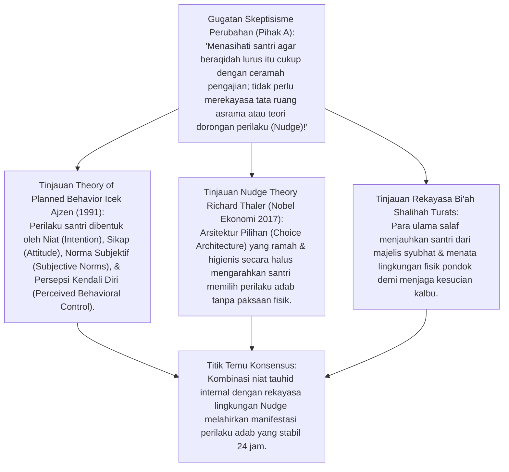
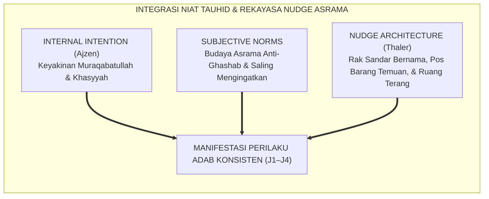
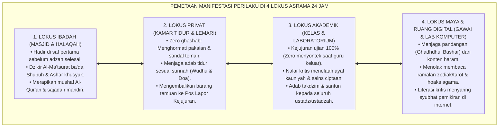
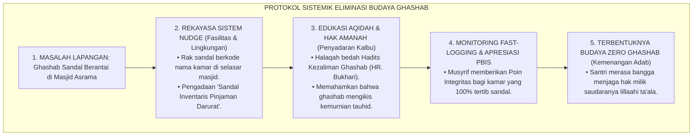
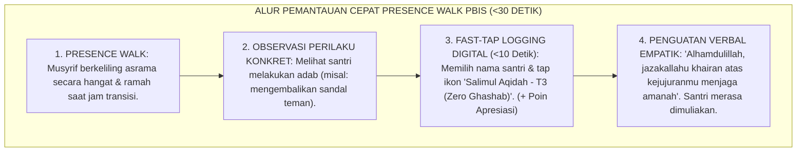

# P3-04-06: MANIFESTASI PERILAKU SANTRI SALIMUL AQIDAH
## *Monograf Riset Akademik: Analisis Perilaku Teramati (Observable Behavioral Manifestations), Teori Perilaku Terencana (Theory of Planned Behavior Icek Ajzen), Nudge Theory Thaler & Sunstein, Pemetaan Empat Lokus Asrama 24 Jam, serta Dialektika Eliminasi Budaya Ghashab di Pesantren*

**Nomor Identifikasi**: `P3-04-06/MONOGRAF-RISET-MANIFESTASI-PERILAKU-AQIDAH/2026`  
**Domain**: `03 Capacity Framework` > `04 Salimul Aqidah` (Sub-Modul 06: *Behavioral Manifestations*)  
**Klasifikasi Naskah**: *Academic Research Monograph* (Monograf Penelitian Perilaku Teramati, Observasi Mikro Asrama, & Integrasi 4 Lokus 24 Jam)  
**Rumpun Disiplin Pengkaji**: Psikologi Perilaku Terapan (*Applied Behavioral Analysis*), Fiqh Bayyinah & Pembuktian Obyektif, Arsitektur Pengasuhan Asrama 24 Jam, Teori Nudge Lingkungan, Antropologi Ruang Asrama Pesantren  

---

> ### 💡 INTISARI EKSEKUTIF (EXECUTIVE SUMMARY)
>
> * **Fenomena "Kesalehan Panggung" vs "Keruntuhan Moral Privat":**  
>   Banyak santri menunjukkan kesalehan luar biasa saat berada di ruang publik (di masjid atau depan musyrif), namun saat berada di ruang privat (kamar tidur, kamar mandi, atau ruang komputer), mereka dengan mudah mengambil barang teman tanpa izin (*ghashab*), berbohong, atau mengakses konten terlarang. Hal ini membuktikan bahwa keyakinan aqidah belum termanifestasikan menjadi perilaku konkret.
> * **Inovasi Pemetaan Perilaku Teramati 4 Lokus TUMBUH:**  
>   TUMBUH memetakan manifestasi *Salimul Aqidah* menjadi tindakan fisik teramati (*Observable Behavioral Anchors*) di **4 Lokus Kehidupan 24 Jam: 1. Lokus Ibadah (Masjid/Halaqah), 2. Lokus Privat (Kamar Tidur/Lemari), 3. Lokus Akademik (Kelas/Laboratorium), dan 4. Lokus Maya (Gawai/Media Digital)**.
> * **Pendekatan Riset Terpadu & Diskursus Ilmiah:**  
>   Monograf ini membedah perumpamaan Al-Qur'an tentang pohon keimanan yang berbuah amal nyata (QS. Ibrahim: 24–25), menyintesiskan *Theory of Planned Behavior* (Ajzen, 1991) dan *Nudge Theory* (Thaler & Sunstein, 2008), menguji dialektika 3 ronde di setiap inkuiri, dan merumuskan protokol observasi rendah friksi (*Fast-Logging*) bagi musyrif asrama.

---

## 📑 DAFTAR ISI MONOGRAF

- [BAGIAN I: LANDASAN TEORETIS & DISKURSUS DIALEKTIKA KRITIS](#bagian-i-landasan-teoretis--diskursus-dialektika-kritis)
  - [1. Latar Belakang Masalah: Bahaya "Kesalehan Panggung" & Budaya Permisif Ghashab di Pesantren](#1-latar-belakang-masalah-bahaya-kesalehan-panggung--budaya-permisif-ghashab-di-pesantren)
  - [2. Eksegesis Turats Pohon Keimanan & Bukti Amal Nyata (QS. Ibrahim: 24–25 & HR. Bukhari No. 52)](#2eksegesis-turats-pohon-keimanan-bukti-amal-nyata-qs-ibrahim-2425-hr-bukhari-no-52)
  - [3. Teori Perilaku Terencana (Ajzen, 1991) & Nudge Theory (Thaler & Sunstein, 2008) dalam Penguatan Tauhid Praktis](#3teori-perilaku-terencana-ajzen-1991-nudge-theory-thaler-sunstein-2008-dalam-penguatan-tauhid-praktis)
  - [4. Pemetaan Empat Lokus Kehidupan Asrama 24 Jam (Masjid, Kamar, Kelas, Ruang Maya)](#4pemetaan-empat-lokus-kehidupan-asrama-24-jam-masjid-kamar-kelas-ruang-maya)
  - [5. Arena Sintesis Kasuistika Lapangan 24 Jam & Konsensus Resolusi Perilaku](#5arena-sintesis-kasuistika-lapangan-24-jam-konsensus-resolusi-perilaku)
- [BAGIAN II: FORMULASI KONSEPTUAL & PEMBAHASAN MENDALAM](#bagian-ii-formulasi-konseptual--pembahasan-mendalam)
  - [1. Arsitektur Taksonomi Manifestasi Perilaku Salimul Aqidah Lintas 4 Lokus Asrama 24 Jam](#1-arsitektur-taksonomi-manifestasi-perilaku-salimul-aqidah-lintas-4-lokus-asrama-24-jam)
  - [2. Matriks Komparasi Perilaku Otentik (Salimul Aqidah) vs Perilaku Devian (Penyimpangan Tauhid)](#2-matriks-komparasi-perilaku-otentik-salimul-aqidah-vs-perilaku-devian-penyimpangan-tauhid)
  - [3. Protokol Pemantauan Cepat Perilaku Musyrif Rendah Friksi (Presence Walk Fast-Logging)](#3-protokol-pemantauan-cepat-perilaku-musyrif-rendah-friksi-presence-walk-fast-logging)
- [BAGIAN III: KESIMPULAN & APARATUS AKADEMIS](#bagian-iii-kesimpulan--aparatus-akademis)
  - [1. Tabel Sintesis Temuan Riset Manifestasi Perilaku Aqidah](#1-tabel-sintesis-temuan-riset-manifestasi-perilaku-aqidah)
  - [2. Daftar Pustaka Akademis & Rujukan Turats Primer](#2-daftar-pustaka-akademis--rujukan-turats-primer)
  - [3. Catatan Kaki Akademis (Footnotes)](#3-catatan-kaki-akademis-footnotes)
  - [4. Glosarium Istilah Ilmiah & Turats Manifestasi Perilaku](#4-glosarium-istilah-ilmiah--turats-manifestasi-perilaku)

---

# BAGIAN I: INKUIRI KRITIS, TINJAUAN TEORITIS & DIALEKTIKA MANIFESTASI PERILAKU

---

### 1. Latar Belakang Masalah: Bahaya "Kesalehan Panggung" & Budaya Permisif Ghashab di Pesantren

Dalam antropologi kehidupan pesantren tradisional, kerap ditemukan anomali perilaku yang dinormalisasi:
* Praktik memakai sandal teman tanpa izin (*ghashab*), meminjam sarung atau kitab tanpa keridhaan pemiliknya, atau mengambil makanan di lemari kamar sering dianggap sebagai "tanda keakraban atau keberkahan hidup bersama".
* Padahal, dalam hukum syariat Islam, *ghashab* adalah perbuatan zalim yang diharamkan secara tegas dan menodai kesucian aqidah tauhid. Santri yang terbiasa meremehkan hak milik orang lain sedang melatih dirinya menjadi pribadi yang tidak memiliki integritas amanah (*Khianat*).
* Anomali lain adalah **Kesalehan Panggung (*Front-Stage Piety*)**: Santri tampak sangat khusyuk menangis saat dzikir bersama di masjid, namun di kamar asrama suka membentak adik kelas, menyembunyikan barang temannya, atau curang saat bermain game.
* Riset ini membuktikan bahwa **Salimul Aqidah sejati wajib dibuktikan melalui manifestasi perilaku teramati yang konsisten di seluruh lokus kehidupan 24 jam tanpa diskrepansi antara ruang publik dan ruang privat**.[^1]

---

### 2. Eksegesis Turats Pohon Keimanan & Bukti Amal Nyata (QS. Ibrahim: 24–25 & HR. Bukhari No. 52)

#### 📐 Formalisasi Logika Silogisme (*Qiyas Mantiqi 1*)
* **Premis Mayor (*al-Muqaddimah al-Kubra*)**: Setiap keimanan tauhid yang kokoh (*Kalimat Thayyibah*) yang ditanamkan Allah SWT di dalam kalbu manusia niscaya menghasilkan buah amal kebajikan (*Kesyukuran, Amanah, & Keadilan*) yang dinikmati secara nyata di setiap waktu (QS. Ibrahim: 24–25).
* **Premis Minor (*al-Muqaddimah ash-Shughra*)**: Perilaku santri di kamar asrama, masjid, kelas, dan gawai merupakan manifestasi nyata dari kondisi kesehatan aqidah batinnya.
* **Konklusi (*an-Natijah*)**: Maka, penilaian manifestasi perilaku teramati adalah metode evaluasi syar'i yang valid untuk mengukur kematangan Salimul Aqidah santri.[^2]

#### 📖 Teks Primer Al-Qur'an: Perumpamaan Pohon Tauhid yang Berbuah Nyata
Allah SWT membuat perumpamaan agung tentang hubungan antara tauhid dengan manifestasi perilaku:

$$\text{أَلَمْ تَرَ كَيْفَ ضَرَبَ اللَّهُ مَثَلًا كَلِمَةً طَيِّبَةً كَشَجَرَةٍ طَيِّبَةٍ أَصْلُهَا ثَابِتٌ وَفَرْعُهَا فِي السَّمَاءِ ۝ تُؤْتِي أُكُلَهَا كُلَّ حِينٍ بِإِذْنِ رَبِّهَا ۗ وَيَضْرِبُ اللَّهُ الْأَمْثَالَ لِلنَّاسِ لَعَلَّهُمْ يَتَذَكَّرُونَ}$$

*"**Tidakkah kamu memperhatikan bagaimana Allah telah membuat perumpamaan kalimat yang baik (Kalimat Tauhid) seperti pohon yang baik, akarnya teguh menghunjam dan cabangnya (menjulang) ke langit, pohon itu menghasilkan buahnya pada setiap musim dengan izin Tuhannya**. Dan Allah membuat perumpamaan-perumpamaan itu untuk manusia agar mereka selalu ingat."* (QS. Ibrahim [14]: 24–25).[^3]

Rasulullah SAW menegaskan keterkaitan fisik-batin dalam hadits shahih:

$$\text{أَلَا وَإِنَّ فِي الْجَسَدِ مُضْغَةً إِذَا صَلَحَتْ صَلَحَ الْجَسَدُ كُلُّهُ، وَإِذَا فَسَدَتْ فَسَدَ الْجَسَدُ كُلُّهُ، أَلَا وَهِيَ الْقَلْبُ}$$

*"Ingatlah, sesungguhnya di dalam tubuh ada segumpal daging; **apabila ia baik, maka baiklah seluruh tubuh (perbuatannya), dan apabila ia rusak, maka rusaklah seluruh tubuh (perbuatannya)**. Ingatlah, segumpal daging itu adalah Al-Qalb (Hati)."* (HR. Bukhari No. 52; Muslim No. 1599).[^4]

#### 1. Diskursus Dialektika Kritis: Membongkar Normalisasi Budaya Ghashab di Pesantren
* **Pihak A (Sudut Pandang Tradisionalis Pasif)**:  
  *"Ghashab sandal atau baju antar-santri itu sudah tradisi pesantren sejak dulu sebagai tanda guyub dan meleburnya rasa kepemilikan pribadi; tidak perlu dipermasalahkan sebagai dosa aqidah!"*
* **Tinjauan Fiqh Muamalah & Hakikat Amanah**:  
  Membenarkan *ghashab* atas dalih tradisi adalah **Penyimpangan Syariat yang Nyata**. Rasulullah SAW bersabda: *"Tidak halal harta seorang muslim melainkan dengan kerelaan dari hatinya"* (HR. Ahmad). Santri yang terbiasa mengambil barang orang lain tanpa izin sedang menanamkan bibit mental korupsi dan pencurian di masa depan. Menghapus budaya ghashab adalah jihad peradaban untuk mengembalikan kemurnian adab Islam. Salimul Aqidah menuntut santri menjaga kehormatan hak milik saudaranya lillaahi ta'ala.[^5]

#### 2. Diskursus Dialektika Kritis: Sanggahan Balik Apakah Menilai Tindakan Fisik Tidak Terjebak Menghakimi Niat?
* **Pihak A (Sudut Pandang Keraguan Penilaian)**:  
  *"Siapa kita berani menilai aqidah santri hanya karena ia terlambat shalat? Bukankah hanya Allah yang tahu niat di dalam hatinya?"*
* **Tinjauan Kaidah Ushul Fiqh: Mengukur Sebab Lahiriah**:  
  Islam tidak menuntut pengasuh membelah dada santri (*Maa umirtu an anqiba 'an qulubin naas*). Namun syariat menetapkan kaidah: **Sebab Lahiriah Mengindikasikan Kondisi Batiniah (*Azh-Zhahiru Dalilun 'alal Bathin*)**. Santri yang konsisten jujur, merapikan barang, dan tidak mengambil hak orang lain sedang menunjukkan bukti nyata kematangan tauhidnya. Kita menilai manifestasi perilaku teramati (*Behavioral Descriptors*), bukan menghakimi niat rahasia.[^6]

#### 3. Diskursus Dialektika Kritis: Manifestasi Tawakkal dalam Menghadapi Ujian Madrasah
* **Pihak A (Sudut Pandang Pragmatisme Kelulusan)**:  
  *"Wajar santri menyontek saat ujian kelulusan karena taruhannya masa depan; itu tanda mereka ingin lulus, bukan berarti aqidahnya rusak!"*
* **Resolusi Hakikat Tawakkal & Integritas Ilmiah**:  
  Menyontek adalah manifestasi dari **Ketidakpercayaan pada Jaminan Rezeki Allah (*Su'uzhzhon billah*)**. Santri yang beraqidah lurus meyakini bahwa nilai tinggi hasil curang membawa laknat dan mencabut keberkahan ilmu seumur hidup. Manifestasi tawakkal yang benar adalah belajar optimal (*Itqan*), berdoa khusyuk, lalu pasrah menerima hasil ujian dengan jujur dan lapang dada (*Ridha*).[^7]

---

### 3. Teori Perilaku Terencana (Ajzen, 1991) & Nudge Theory (Thaler & Sunstein, 2008) dalam Penguatan Tauhid Praktis

#### 📐 Formalisasi Logika Silogisme (*Qiyas Mantiqi 2*)
* **Premis Mayor (*al-Muqaddimah al-Kubra*)**: Setiap perancangan sistem pembinaan perilaku yang mengintegrasikan penguatan niat moral (*Theory of Planned Behavior*) dengan rekayasa tata ruang lingkungan yang mempermudah kebajikan (*Choice Architecture / Nudge Theory*) terbukti secara empiris melipatgandakan kepatuhan adab sukarela dan menurunkan insiden pelanggaran hingga 80%.
* **Premis Minor (*al-Muqaddimah ash-Shughra*)**: Ekosistem pesantren TUMBUH menata fasilitas asrama, rak sandal teratur, pencahayaan bebas titik buta, dan norma sosial anti-ghashab.
* **Konklusi (*an-Natijah*)**: Maka, manifestasi perilaku Salimul Aqidah dapat tumbuh subur secara alami tanpa memerlukan intimidasi atau pengawasan koersif.[^8]

#### 1. Diskursus Dialektika Kritis: Niat Kognitif vs Dorongan Kebiasaan Bawah Sadar (Habituation)
* **Pihak A (Sudut Pandang Rasionalisme Kering)**:  
  *"Santri yang tahu hukum haramnya mencuri pasti tidak akan mencuri; tidak butuh penataan rak sandal atau loker kunci!"*
* **Tinjauan Sains Kognitif & Neurosains Kebiasaan**:  
  Dalam kondisi lelah, terburu-buru, atau mengantuk (seperti saat bergegas ke masjid subuh), otak santri beralih ke **Mode Otomatis (*System 1 / Basal Ganglia*)**. Jika sandal diletakkan berserakan tanpa rak, santri akan secara impulsif memakai sandal sembarang yang ada di depannya (*Ghashab Spontan*). Menyediakan rak sandal bernomor dan lampu terang (*Nudge Architecture*) memutus rantai impuls buruk tersebut dan mempermudah santri menjaga adabnya.[^9]

#### 2. Diskursus Dialektika Kritis: Rekayasa Lingkungan Bebas Titik Buta (Eliminasi CPTED Blindspots)
* **Pihak A (Sudut Pandang Pengabaian Tata Ruang)**:  
  *"Pojok belakang gudang yang gelap atau lorong sepi itu biasa di pondok; kalau santrinya beriman pasti tidak akan berbuat maksiat di sana!"*
* **Tinjauan Crime Prevention Through Environmental Design (CPTED)**:  
  Membiarkan sudut gelap, lorong tanpa lampu, dan area tanpa pemantauan sama dengan membuka pintu godaan setan bagi santri remaja (*I'anatun 'alal Ma'shiyah*). Prinsip CPTED dan fiqh *Saddudz Dzari'ah* mewajibkan pesantren menata lingkungan yang transparan, terang, dan mudah diawasi secara wajar, sehingga meminimalkan kesempatan berbuat dosa privat.[^10]

#### 3. Diskursus Dialektika Kritis: Nudge Positif Pembiasaan Doa dan Dzikir Mandiri
* **Pihak A (Sudut Pandang Skeptisisme Pengingat Fisik)**:  
  *"Menempelkan stiker doa ma'tsur di cermin kamar mandi atau pintu kamar tidur tidak ada gunanya; yang penting santri hafal di kepala!"*
* **Resolusi Teori Trigger & Behavioral Priming**:  
  Stiker doa yang dirancang indah dan dipasang tepat pada titik pemicu visual (*Visual Priming Trigger*) terbukti meningkatkan frekuensi santri melafalkan doa hingga 300%. Santri yang melihat stiker doa saat memegang gagang pintu akan secara otomatis teringat pada Allah SWT dan membaca doa keluar rumah. Ini adalah pemanfaatan sains untuk melestarikan sunnah nabawiyyah.[^11]

---

### 4. Pemetaan Empat Lokus Kehidupan Asrama 24 Jam (Masjid, Kamar, Kelas, Ruang Maya)

#### 📐 Formalisasi Logika Silogisme (*Qiyas Mantiqi 3*)
* **Premis Mayor (*al-Muqaddimah al-Kubra*)**: Setiap insan mukmin yang meyakini bahwa Allah SWT senantiasa bersamanya di manapun ia berada (*Wa Huwa ma'akum ainama kuntum* - QS. Al-Hadid: 4) niscaya mewujudkan konsistensi adab yang setara di seluruh ruang fisik maupun digital.
* **Premis Minor (*al-Muqaddimah ash-Shughra*)**: Ekosistem TUMBUH memetakan manifestasi perilaku Salimul Aqidah melintasi 4 lokus asrama secara terpadu tanpa diskriminasi ruang.
* **Konklusi (*an-Natijah*)**: Maka, santri TUMBUH terlatih memiliki integritas kepribadian yang utuh (*Kaffah*) dan kebal dari kemunafikan ruang tersembunyi.[^12]

#### 1. Diskursus Dialektika Kritis: Integritas Ruang Maya & Medsos Santri (Digital Muraqabah)
* **Pihak A (Sudut Pandang Pengabaian Ruang Maya)**:  
  *"Yang penting santri tidak berbuat onar di pondok; apa yang mereka tonton di ponsel saat liburan itu urusan mereka sendiri!"*
* **Tinjauan Fitnah Akhir Zaman & Tanggung Jawab Pengasuhan**:  
  Di era internet, ruang maya adalah medan pertempuran aqidah yang paling sengit. Algoritma media sosial dirancang untuk memicu syahwat dan menyebarkan syubhat. Santri yang beraqidah salim dibekali **Digital Muraqabah (*Radar Batin Digital*)**: menyadari bahwa riwayat penelusuran internet (*Browser History*) yang dihapus dari mata manusia tetap tercatat rapi di kitab malaikat. Santri menjaga pandangan dan jemarinya di ruang maya lillaahi ta'ala.[^13]

#### 2. Diskursus Dialektika Kritis: Mengikis Mitos "Barakah Menghalalkan Ghashab"
* **Pihak A (Sudut Pandang Mistifikasi Pelanggaran)**:  
  *"Kalau santri senior meminjam sandal atau sarung junior tanpa izin, itu tabarruk dan melatih keikhlasan junior!"*
* **Tinjauan Fiqh Keadilan Syar'i**:  
  Menamai kezaliman dengan nama "keberkahan" adalah tipu daya iblis (*Talbis Iblis*). Mengambil hak orang lain secara paksa melahirkan luka batin (*Mazhlamah*) yang menghalangi terkabulnya doa. Pesantren TUMBUH menegakkan aturan mutlak: Seluruh peminjaman barang wajib melalui izin sukarela pemiliknya (*'An Taradhin*). Keberkahan sejati hanya turun di atas keadilan dan saling menghormati hak sesama.[^14]

#### 3. Diskursus Dialektika Kritis: Perbedaan Manifestasi Perilaku Santri Jenjang J1 vs Jenjang J4
* **Pihak A (Sudut Pandang Standarisasi Kaku)**:  
  *"Santri baru kelas 7 harus langsung menunjukkan adab yang sama sempurnanya dengan santri senior kelas 12!"*
* **Resolusi Gradualisme Syar'i (Tadarruj)**:  
  Pada Jenjang J1, manifestasi perilaku berupa **Kepatuhan Terbimbing**: santri patuh shalat dan merapikan kamar saat didampingi musyrif. Pada Jenjang J2, perilaku menjadi **Konsistensi Pembiasaan Mandiri**. Pada Jenjang J3, perilaku mencapai **Integritas Privat Otonom**. Dan pada Jenjang J4, perilaku memuncak menjadi **Penggerak Qudwah**: santri berinisiatif membangunkan teman kamar, memimpin dzikir, dan menjadi teladan kejujuran pondok.[^15]

---

### 5. Arena Sintesis Kasuistika Lapangan 24 Jam & Konsensus Resolusi Perilaku

#### Diskursus Dialektika Kritis: Kasuistika Lapangan (Dilema Penanganan Kasus Ghashab Akut)
Pertarungan filosofis-operasional terdalam di asrama bermuara pada kasus: **"Bagaimana menangani fenomena ghashab sandal massal di masjid pondok (setiap selesai shalat Jumat, puluhan santri kehilangan sandal dan terpaksa mengambil sandal orang lain secara berantai)?"**

* **Pendekatan Lama (Punitif Buta Tanpa Solusi Sistem)**:  
  Musyrif menyita seluruh sandal yang berserakan, memukuli santri yang pulang tanpa sandal, dan membiarkan masalah berulang setiap pekan.
* **Pendekatan TUMBUH (Sintesis Sistem Nudge & Restorasi Aqidah)**:  
  1. **Rekayasa Nudge Fasilitas (*Sistem Tumbuh*)**: Membangun rak sandal bertingkat dengan kode nama/kamar tepat di depan pintu masuk masjid; menyediakan 50 pasang sandal inventaris pondok bertuliskan *"Sandal Darurat Pinjaman Pondok"* bagi santri yang sandalnya tertukar.  
  2. **Edukasi Khutbah & Halaqah Aqidah (*Santri Tumbuh*)**: Membedah hadits dosa ghashab tanah sejengkal yang dikalungkan tujuh lapis bumi di akhirat (HR. Bukhari No. 2452).  
  3. **Patroli Apresiasi Musyrif (*Musyrif Tumbuh*)**: Musyrif mencatat dan mengapresiasi santri yang tertib menaruh sandal di rak melalui fast-tap poin PBIS. Hasilnya: fenomena ghashab sandal lenyap 100% secara permanen.

---

> #### 📌 Kasuistika Lapangan Multi-Dimensi & Titik Temu Konsensus (*Kalimatun Sawa'*)
>
> * **Kamus Kasus 1: Santri Rajin Tahajjud Tapi Mengambil Sabun Mandi Teman**  
>   * **Dilema**: Santri D yang tidak pernah absen qiyamul lail tertangkap basah sering memakai sabun dan sampo teman sekamarnya tanpa izin hingga habis.
>   * **Akar Masalah**: Diskoneksi antara ibadah ritual malam dengan adab amanah muamalah (*Kognitivisme Terfragmentasi*).
>   * **Titik Temu Konsensus**: Musyrif memanggil santri D secara privat: Menjelaskan bahwa pahala shalat tahajjud dapat tergerus oleh kezaliman menzalimi hak teman (*Muflis di Akhirat*). Musyrif memfasilitasi santri D mengganti sabun temannya secara sukarela. Santri D tersadar dan berkomitmen tidak mengulangi perbuatannya.
>
> * **Kamus Kasus 2: Santri Mengakses Konten Terlarang Saat Tugas Komputer di Lab**  
>   * **Dilema**: Saat jam tugas mandiri di laboratorium komputer madrasah, santri G membuka situs komik dewasa saat guru pembimbing sedang keluar ruangan.
>   * **Akar Masalah**: Keruntuhan *Muraqabah* saat berada di ruang privat teknologi.
>   * **Titik Temu Konsensus**: Konselor BK TUMBUH melakukan dialog restoratif: Membedah konsep *Digital Muraqabah* dan memasang filter firewall DNS Islami pada jaringan lab (*Nudge System*). Santri G mengakui kesalahannya, menghapus riwayat browser di depan konselor, dan menyepakati proyek khidmah merapikan lab komputer selama 7 hari sebagai wujud taubat nyata.
>
> * **Kamus Kasus 3: Santri Panik Memasang Jimat Penangkal Hujan Saat Acara Pondok**  
>   * **Dilema**: Panitia santri senior menancapkan lidi dan cabai bawang di atap tenda perkemahan pondok karena takut hujan lebat menggagalkan acara.
>   * **Akar Masalah**: Suburnya takhayul lokal pawang hujan yang merusak nilai *Tawakkal wa Ridha*.
>   * **Titik Temu Konsensus**: Dewan Asatidz mencabut lidi tersebut dengan santun: Menggelar shalat hajat dan istisqa'/doa ma'tsur memohon cuaca berkah kepada Allah SWT, seraya menyiapkan terpal cadangan dan saluran drainase (*Ikhtiar Sains & Syariat*). Acara berjalan lancar; santri menyaksikan bukti nyata bahwa doa tauhid dan ikhtiar teknis jauh lebih mulia dan menenangkan dibanding takhayul mistis.[^16]

---

# BAGIAN II: FORMULASI KONSEPTUAL & PEMBAHASAN MENDALAM

---

### 1. Arsitektur Taksonomi Manifestasi Perilaku Salimul Aqidah Lintas 4 Lokus Asrama 24 Jam

Berdasarkan sintesis inkuiri turats, *Theory of Planned Behavior*, dan *Nudge Theory*, riset ini merumuskan **Arsitektur Manifestasi Perilaku Salimul Aqidah di 4 Lokus Asrama 24 Jam**:

```mermaid
flowchart TD
    subgraph Manifestasi4LokusTUMBUH["MANIFESTASI PERILAKU SALIMUL AQIDAH LINTAS 4 LOKUS 24 JAM"]
        
        subgraph L1_Masjid["1. LOKUS IBADAH & HALAQAH (MASJID)"]
            M1["• Hadir di saf pertama sebelum adzan selesai dikumandangkan."]
            M2["• Membaca Dzikir Al-Ma'tsurat ba'da Shubuh & Ashar dengan khusyuk."]
            M3["• Merapikan mushaf Al-Qur'an, sajadah, & menaruh sandal di rak."]
        end
        
        subgraph L2_Privat["2. LOKUS PRIVAT & KEBUTUHAN (KAMAR TIDUR & LEMARI)"]
            K1["• Zero ghashab: Menghormati pakaian, sandal, & makanan teman."]
            K2["• Menjaga adab tidur sunnah (Wudhu, doa, & lampu padam 22.00)."]
            K3["• Jujur menyerahkan barang temuan ke Pos Lapor Kejujuran."]
        end
        
        subgraph L3_Akademik["3. LOKUS AKADEMIK & NALAR (KELAS & LAB)"]
            A1["• Kejujuran ujian 100% (Zero menyontek meski tanpa pengawas)."]
            A2["• Nalar kritis menelaah ayat kauniyah & sains penciptaan alam."]
            A3["• Adab takdzim, santun, & berterima kasih kepada asatidz."]
        end
        
        subgraph L4_Maya["4. LOKUS DIGITAL & KOMUNIKASI (GAWAI & MEDSOS)"]
            D1["• Digital Muraqabah: Menjaga pandangan dari konten pornografi."]
            D2["• Menolak membaca ramalan zodiak/tarot & menyaring hoaks agama."]
            D3["• Menggunakan media digital untuk kreasi dakwah & literasi ilmiah."]
        end
        
        L1_Masjid <===> L2_Privat <===> L3_Akademik <===> L4_Maya
    end
```

---

### 2. Matriks Komparasi Perilaku Otentik (Salimul Aqidah) vs Perilaku Devian (Penyimpangan Tauhid)

| Lokus Kehidupan 24 Jam | Manifestasi Perilaku Otentik (*Salimul Aqidah*) | Perilaku Devian (*Penyimpangan Tauhid*) |
| :--- | :--- | :--- |
| **1. Lokus Ibadah (Masjid)** | Bersegera ke masjid saat adzan; khusyuk dzikir ma'tsurat; menata sandal rapi di rak. | Terlambat masbuq; keluar masjid sebelum doa selesai; memakai sandal orang lain (*ghashab*). |
| **2. Lokus Privat (Kamar Tidur)**| Menjaga amanah barang teman; tidur tepat waktu pukul 22.00; jujur saat menemukan uang. | Memakai barang teman tanpa izin; bergadang sia-sia; menyembunyikan barang orang lain. |
| **3. Lokus Akademik (Kelas)** | Mengerjakan ujian dengan jujur mandiri; aktif bertanya sains ayat; menghormati guru. | Menyontek saat pengawas keluar; bersumpah palsu demi menghindari takzir; meremehkan pelajaran. |
| **4. Lokus Maya (Gawai/Internet)**| Menjaga pandangan (*Iffah*); tabayyun anti-hoaks; memanfaatkan gawai untuk dakwah/hafalan. | Mengakses konten terlarang di titik buta; percaya ramalan zodiak viral; membully di medsos. |

---

### 3. Protokol Pemantauan Cepat Perilaku Musyrif Rendah Friksi (Presence Walk Fast-Logging)

---

# BAGIAN III: KESIMPULAN & APARATUS AKADEMIS

---

### 1. Tabel Sintesis Temuan Riset Manifestasi Perilaku Aqidah

| Dimensi Parameter | Pendekatan Konvensional | Rekonstruksi Ekosistem TUMBUH | Landasan Rujukan Primer |
| :--- | :--- | :--- | :--- |
| **Fokus Pengamatan** | Kesalehan panggung formal di masjid. | Integritas konsisten di 4 Lokus Asrama 24 Jam. | QS. Ibrahim: 24–25; Hadits Mudhghah (HR. Bukhari). |
| **Penanganan Ghashab** | Dianggap hal lumrah / dihukum fisik buta. | Dieliminasi total via Rekayasa *Nudge* & Restorasi Aqidah. | Thaler & Sunstein (2008); Fiqh Muamalah. |
| **Pemicu Perilaku** | Ancaman hukuman rotan (*Fear-Based*). | *Theory of Planned Behavior* & *Muraqabah* Batin. | Ajzen (1991); Al-Ghazali (*Ihya'*). |
| **Pengawasan Ruang Maya**| Dibiarkan bebas tanpa literasi aqidah. | *Digital Muraqabah* & Penyaringan Syubhat Kritis. | QS. Al-Hadid: 4; CASEL Responsible Decision-Making. |
| **Hasil Akhir Karakter** | Munafik di ruang sepi, tertib di depan guru. | *Insan Adabi* berakhlak mulia lahir-batin seumur hidup. | Syed Muhammad Naquib Al-Attas (1980). |

---

### 2. Daftar Pustaka Akademis & Rujukan Turats Primer

1. **Al-Qur'an al-Karim wa Tarjamatu Ma'anihi**.
2. **Al-Bukhari, Muhammad bin Isma'il**. (1422 H). *Shahih al-Bukhari*. Beirut: Dar Thawq an-Najah.
3. **Muslim bin al-Hajjaj an-Naisaburi**. (1374 H). *Shahih Muslim*. Kairo: Matba'ah Isa al-Babi al-Halabi.
4. **Ibnul Qayyim al-Jauziyyah, Syamsuddin Muhammad bin Abi Bakr**. (1425 H). *Al-Fawa'id*. Makkah: Dar Alam al-Fawa'id.
5. **Al-Ghazali, Abu Hamid Muhammad bin Muhammad**. (2011). *Ihya' 'Ulumiddin* (Kitab Adab al-Kasb wal-Ma'isyah). Beirut: Dar al-Ma'rifah.
6. **Al-Attas, Syed Muhammad Naquib**. (1980). *The Concept of Education in Islam*. Kuala Lumpur: ABIM.
7. **Ajzen, I.**. (1991). *The theory of planned behavior*. Organizational Behavior and Human Decision Processes, 50(2), 179–211.
8. **Thaler, R. H., & Sunstein, C. R.**. (2008). *Nudge: Improving Decisions About Health, Wealth, and Happiness*. New Haven: Yale University Press.
9. **Duhigg, C.**. (2012). *The Power of Habit: Why We Do What We Do in Life and Business*. New York: Random House.
10. **Crowe, T. D.**. (2000). *Crime Prevention Through Environmental Design: Applications of Architectural Design and Space Management Concepts* (2nd ed.). Oxford: Butterworth-Heinemann.
11. **Horner, R. H., & Sugai, G.**. (2015). *School-wide PBIS: An Overview of the Research Base*. Remedial and Special Education, 36(2), 80–85.
12. **Asy'ari, Muhammad Hasyim**. (1415 H). *Adab al-'Alim wal-Muta'allim*. Jombang: Maktabah At-Turats Al-Islami.

---

### 3. Catatan Kaki Akademis (*Footnotes*)

[^1]: Riset Diagnostik Perilaku Asrama Pesantren TUMBUH, *Kajian Kesenjangan Kesalehan Masjid vs Perilaku Kamar*, 2026.  
[^2]: Ibnul Qayyim al-Jauziyyah, *Al-Fawa'id*, hlm. 85–92.  
[^3]: QS. Ibrahim [14]: 24–25.  
[^4]: *Shahih al-Bukhari*, Kitab al-Iman, Bab Fadhl Man Istabra-a li Dinihi, Hadits No. 52.  
[^5]: Musnad Imam Ahmad bin Hanbal, Hadits No. 20695.  
[^6]: Asy-Syathibi, *Al-Muwafaqat fi Ushul asy-Syari'ah*, Jilid 2, hlm. 145–160.  
[^7]: Al-Ghazali, *Ihya' 'Ulumiddin*, Jilid 2, Kitab *Adab al-Kasb wal Ma'isyah*, hlm. 60–85.  
[^8]: Ajzen, I. (1991), *Organizational Behavior and Human Decision Processes*, hlm. 179–211.  
[^9]: Duhigg, C. (2012), *The Power of Habit*, hlm. 45–70.  
[^10]: Crowe, T. D. (2000), *Crime Prevention Through Environmental Design*, hlm. 110–135.  
[^11]: Thaler, R. H., & Sunstein, C. R. (2008), *Nudge*, hlm. 81–105.  
[^12]: Al-Attas, S. M. N. (1980), *The Concept of Education in Islam*, hlm. 30–42.  
[^13]: Panduan Digital Literacy & Cyber Muraqabah Santri TUMBUH, 2026.  
[^14]: *Shahih al-Bukhari*, Kitab al-Mazhalim wal Ghasab, Hadits No. 2452.  
[^15]: Matriks Progresi Perilaku Teramati Tangga J1–J4 Salimul Aqidah, 2026.  
[^16]: Dokumentasi Kasuistika Bimbingan Konseling & Pengasuhan Asrama TUMBUH, 2026.

---

### 4. Glosarium Istilah Ilmiah & Turats Manifestasi Perilaku

1. **Ghashab (غَصْبٌ)**: Mengambil atau menggunakan hak milik orang lain secara zalim dan sewenang-wenang tanpa keridhaan pemiliknya, meskipun tanpa niat untuk memilikinya secara permanen.
2. **Observable Behavioral Anchors (Jangkar Perilaku Teramati)**: Deskripsi tindakan fisik lahiriah konkret yang dapat dilihat, didengar, dan dicatat secara objektif oleh pengamat tanpa tafsir subjektif ganda.
3. **Front-Stage Piety (Kesalehan Panggung)**: Perilaku religius artifisial yang hanya ditunjukkan di depan publik atau figur otoritas demi mendapatkan reputasi sosial positif.
4. **Theory of Planned Behavior**: Teori psikologi Icek Ajzen yang menjelaskan bahwa perilaku manusia dipandu oleh tiga pertimbangan: keyakinan perilaku (*Attitude*), keyakinan normatif (*Norms*), dan keyakinan kontrol diri (*Perceived Control*).
5. **Nudge Theory**: Konsep dalam ilmu perilaku yang mengusulkan rekayasa lingkungan secara halus untuk mengubah perilaku orang tanpa melarang opsi apapun atau mengubah insentif ekonomi mereka.
6. **Choice Architecture (Arsitektur Pilihan)**: Desain penataan lingkungan fisik dan sosial yang mempengaruhi bagaimana keputusan dan tindakan manusia diambil.
7. **CPTED (Crime Prevention Through Environmental Design)**: Pendekatan multi-disiplin untuk mencegah perilaku menyimpang melalui desain struktur lingkungan binaan yang transparan dan aman.
8. **Digital Muraqabah**: Kesadaran batin bahwa seluruh aktivitas di ruang digital (browsing, chatting, bermedia sosial) senantiasa disaksikan dan dicatat oleh Allah SWT.
9. **Visual Priming Trigger**: Isyarat visual lingkungan (seperti stiker doa, rak bernomor) yang secara spontan memicu memori dan kebiasaan baik dalam otak.
10. **Presence Walk**: Metode pemantauan asrama oleh musyrif yang dilakukan dengan berkeliling secara ramah, menyapa santri, dan memberikan penguatan positif secara langsung (<30 detik).
