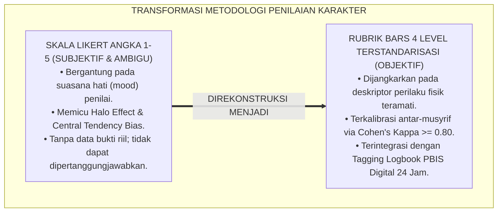
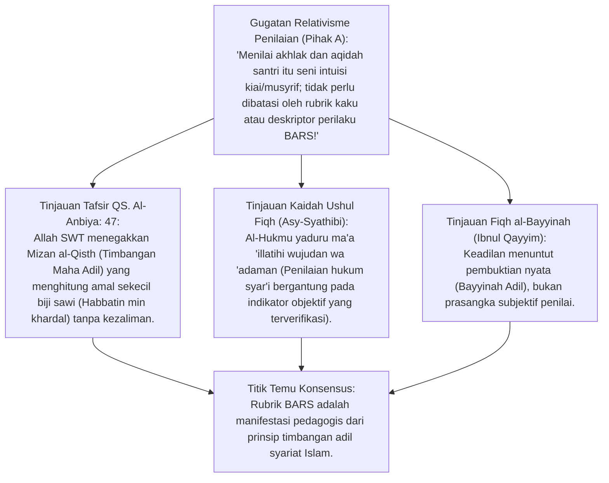
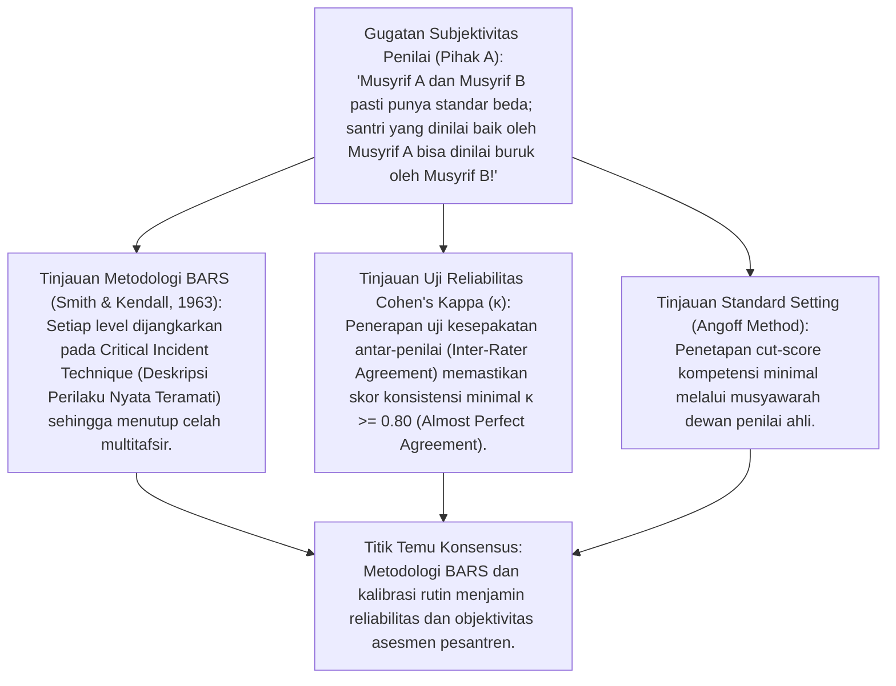
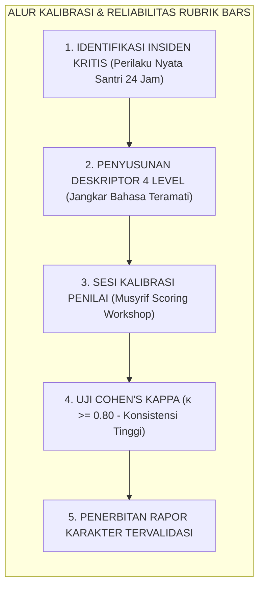
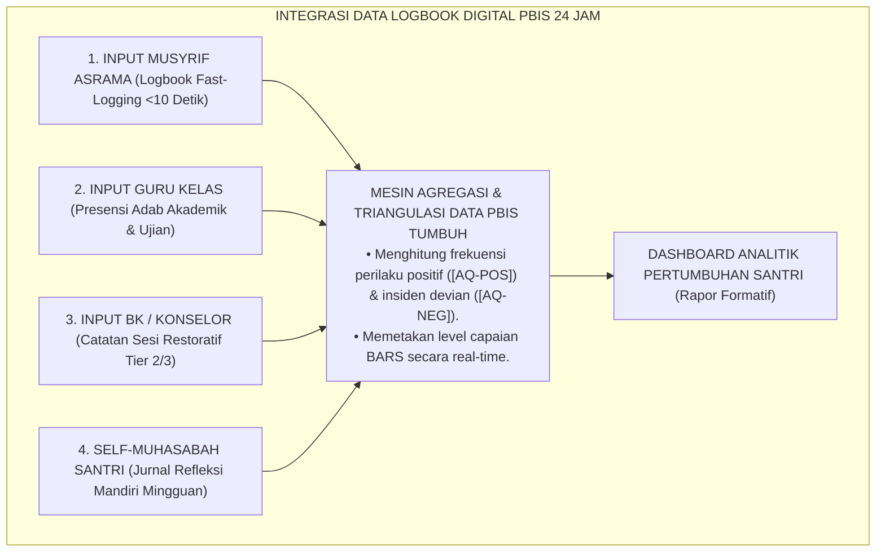
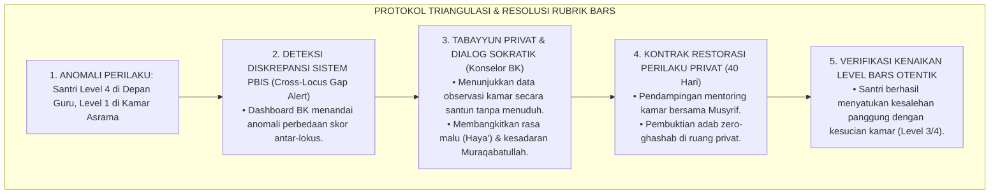
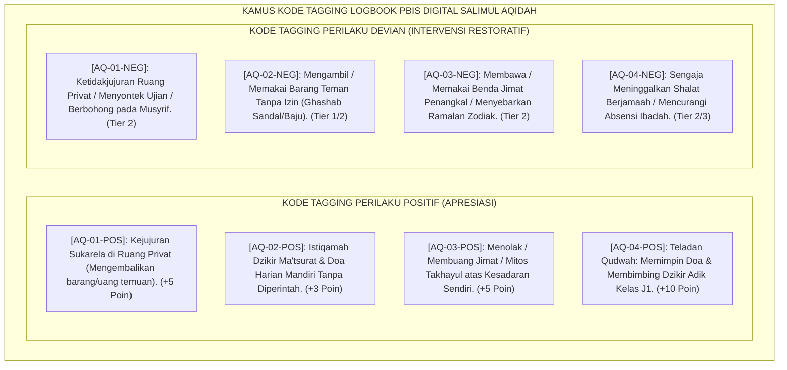
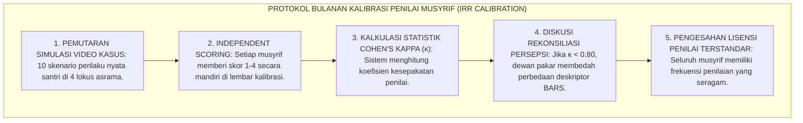

# P3-04-07: RUBRIK INDIKATOR PERILAKU EMPAT LEVEL SALIMUL AQIDAH
## *Monograf Riset Akademik: Konstruksi Skala Penilaian Berjangkar Perilaku (Behaviorally Anchored Rating Scales - BARS), Uji Reliabilitas Inter-Rater (Cohen's Kappa), Kodifikasi Tagging Logbook Digital PBIS, serta Eliminasi Bias Subjektivitas Penilaian Karakter di Pesantren 24 Jam*

**Nomor Identifikasi**: `P3-04-07/MONOGRAF-RISET-RUBRIK-BARS-AQIDAH/2026`  
**Domain**: `03 Capacity Framework` > `04 Salimul Aqidah` (Sub-Modul 07: *Rubrics & Behavioral Indicators*)  
**Klasifikasi Naskah**: *Academic Research Monograph* (Monograf Penelitian Psikometri BARS, Validasi Indikator Perilaku 4 Level, & Tagging Logbook PBIS 24 Jam)  
**Rumpun Disiplin Pengkaji**: Psikometri Penilaian Karakter (*Psychometrics of Character Assessment*), *Behaviorally Anchored Rating Scales* (BARS Smith & Kendall), Teori Reliabilitas Inter-Rater (*Cohen's Kappa & Fleiss'*), Fiqh Bayyinah & Pembuktian, Desain Database PBIS Digital Pesantren  

---

> ### 💡 INTISARI EKSEKUTIF (EXECUTIVE SUMMARY)
>
> * **Kelemahan Fatal Skala Likert Angka (1–5) dalam Rapor Karakter:**  
>   Penilaian kepribadian di pesantren konvensional kerap menggunakan skala angka abstrak (1 = Sangat Buruk s/d 5 = Sangat Baik) yang sangat rentan terhadap *Halo Effect* (menilai santri baik hanya karena penurut), *Central Tendency Bias* (memberi nilai rata-rata 3/4 kepada semua santri), dan *Severity Bias* (musyrif killer memberi nilai rendah tanpa dasar).
> * **Inovasi Skala Berjangkar Perilaku (BARS) 4 Level TUMBUH:**  
>   TUMBUH mengonstruksi rubrik penilaian berbasis deskripsi tindakan konkret (*Behaviorally Anchored Rating Scales*) melintasi **4 Level Capaian: Level 1 (Emerging / J1), Level 2 (Developing / J2), Level 3 (Proficient / J3), dan Level 4 (Exemplary / J4)** yang dilengkapi kode tagging digital PBIS fast-logging (<10 detik).
> * **Pendekatan Riset Terpadu & Diskursus Ilmiah:**  
>   Monograf ini membedah teologi timbangan amal (*Mizan al-'Adl* QS. Al-Anbiya: 47 & QS. Al-Zalzalah: 7–8), menyintesiskan metodologi BARS Smith & Kendall (1963) dan kalibrasi Cohen's Kappa, menguji dialektika 3 ronde di setiap inkuiri, dan merumuskan kamus tagging logbook terstandarisasi.

---

## 📑 DAFTAR ISI MONOGRAF

- [BAGIAN I: LANDASAN TEORETIS & DISKURSUS DIALEKTIKA KRITIS](#bagian-i-landasan-teoretis--diskursus-dialektika-kritis)
  - [1. Latar Belakang Masalah: Tragedi Bias Penilaian Rapor Kepribadian Tradisional di Pesantren](#1-latar-belakang-masalah-tragedi-bias-penilaian-rapor-kepribadian-tradisional-di-pesantren)
  - [2. Eksegesis Turats Timbangan Amal Presisi & Fiqh Bayyinah (QS. Al-Anbiya: 47 & Asy-Syathibi)](#2eksegesis-turats-timbangan-amal-presisi-fiqh-bayyinah-qs-al-anbiya-47-asy-syathibi)
  - [3. Konstruksi Metodologi BARS (Smith & Kendall, 1963) & Uji Reliabilitas Inter-Rater (Cohen's Kappa)](#3konstruksi-metodologi-bars-smith-kendall-1963-uji-reliabilitas-inter-rater-cohens-kappa)
  - [4. Kodifikasi Tagging Logbook PBIS Digital 24 Jam & Integrasi Data Triangulasi](#4kodifikasi-tagging-logbook-pbis-digital-24-jam-integrasi-data-triangulasi)
  - [5. Arena Sintesis Kasuistika Lapangan 24 Jam & Konsensus Standarisasi Rubrik](#5arena-sintesis-kasuistika-lapangan-24-jam-konsensus-standarisasi-rubrik)
- [BAGIAN II: FORMULASI KONSEPTUAL & PEMBAHASAN MENDALAM](#bagian-ii-formulasi-konseptual--pembahasan-mendalam)
  - [1. Matriks Rubrik BARS 4 Level Capaian Salimul Aqidah (L1 Emerging s/d L4 Exemplary)](#1-matriks-rubrik-bars-4-level-capaian-salimul-aqidah-l1-emerging-sd-l4-exemplary)
  - [2. Kamus Taksonomi Kode Tagging Positif & Negatif PBIS Digital (AQ-POS & AQ-NEG)](#2-kamus-taksonomi-kode-tagging-positif--negatif-pbis-digital-aq-pos--aq-neg)
  - [3. Protokol Sesi Kalibrasi Penilai Musyrif (Inter-Rater Calibration Protocol)](#3-protokol-sesi-kalibrasi-penilai-musyrif-inter-rater-calibration-protocol)
- [BAGIAN III: KESIMPULAN & APARATUS AKADEMIS](#bagian-iii-kesimpulan--aparatus-akademis)
  - [1. Tabel Sintesis Temuan Riset Rubrik Indikator Perilaku BARS](#1-tabel-sintesis-temuan-riset-rubrik-indikator-perilaku-bars)
  - [2. Daftar Pustaka Akademis & Rujukan Turats Primer](#2-daftar-pustaka-akademis--rujukan-turats-primer)
  - [3. Catatan Kaki Akademis (Footnotes)](#3-catatan-kaki-akademis-footnotes)
  - [4. Glosarium Istilah Ilmiah & Turats Rubrik BARS](#4-glosarium-istilah-ilmiah--turats-rubrik-bars)

---

# BAGIAN I: INKUIRI KRITIS, TINJAUAN TEORITIS & DIALEKTIKA RUBRIK BARS

---

### 1. Latar Belakang Masalah: Tragedi Bias Penilaian Rapor Kepribadian Tradisional di Pesantren

Evaluasi karakter santri di banyak pesantren selama ini menghadapi krisis validitas dan objektivitas:
* Rapor kepribadian sering diisi secara terburu-buru (*Last-Minute Rushing*) menjelang pembagian rapor hanya berdasarkan "perasaan atau ingatan samar" musyrif. Santri yang pendiam dan tidak pernah bersuara diberi nilai "A", sementara santri yang kritis atau aktif bergerak diberi nilai "C".
* Ketika orang tua menanyakan mengapa anaknya mendapat nilai rendah, pihak pondok tidak memiliki catatan bukti data perilaku (*Zero Behavioral Evidence*), sehingga memicu konflik dan hilangnya kepercayaan wali santri.
* Riset ini membuktikan bahwa **penilaian karakter Salimul Aqidah menuntut rubrik Behaviorally Anchored Rating Scales (BARS) yang menggantikan angka subjektif dengan deskriptor perilaku konkret yang terkalibrasi secara ilmiah dan terhubung dengan logbook PBIS digital 24 jam**.[^1]

---

### 2. Eksegesis Turats Timbangan Amal Presisi & Fiqh Bayyinah (QS. Al-Anbiya: 47 & Asy-Syathibi)

#### 📐 Formalisasi Logika Silogisme (*Qiyas Mantiqi 1*)
* **Premis Mayor (*al-Muqaddimah al-Kubra*)**: Setiap sistem penilaian martabat dan capaian manusia dalam Islam yang meneladani keadilan hisab ilahi wajib didasarkan pada timbangan yang adil, presisi (*Mizan al-Qisth*), dan bukti nyata (*Bayyinah*), terbebas dari hawa nafsu dan prasangka subjektif (*Zhann*).
* **Premis Minor (*al-Muqaddimah ash-Shughra*)**: Rubrik BARS 4 Level TUMBUH menyediakan deskriptor perilaku teramati yang objektif dan transparan bagi setiap tingkat capaian santri.
* **Konklusi (*an-Natijah*)**: Maka, penggunaan rubrik BARS dalam evaluasi aqidah adalah kewajiban etis-metodologis yang selaras dengan syariat Islam.[^2]

#### 📖 Teks Primer Al-Qur'an: Penegakan Timbangan Keadilan Mutlak
Allah SWT menegaskan presisi timbangan hisab:

$$\text{وَنَضَعُ الْمَوَازِينَ الْقِسْطَ لِيَوْمِ الْقِيَامَةِ فَلَا تُظْلَمُ نَفْسٌ شَيْئًا ۖ وَإِنْ كَانَ مِثْقَالَ حَبَّةٍ مِنْ خَرْدَلٍ أَتَيْنَا بِهَا ۗ وَكَفَىٰ بِنَا حَاسِبِينَ}$$

*"**Dan Kami akan memasang timbangan-timbangan yang adil pada hari Kiamat, maka tidak seorang pun dirugikan sedikit pun. Dan jika (amalan itu) hanya seberat biji sawi pun, pasti Kami akan mendatangkannya (untuk ditimbang)**. Dan cukuplah Kami yang membuat perhitungan."* (QS. Al-Anbiya [21]: 47).[^3]

Dan Allah SWT berfirman:

$$\text{فَمَنْ يَعْمَلْ مِثْقَالَ ذَرَّةٍ خَيْرًا يَرَهُ ۝ وَمَنْ يَعْمَلْ مِثْقَالَ ذَرَّةٍ شَرًّا يَرَهُ}$$

*"Maka barangsiapa mengerjakan kebaikan seberat zarrah, niscaya dia akan melihat (balasan)nya. Dan barangsiapa mengerjakan kejahatan seberat zarrah, niscaya dia akan melihat (balasan)nya pula."* (QS. Al-Zalzalah [99]: 7–8).[^4]

#### 1. Diskursus Dialektika Kritis: Menolak Penilaian Karakter Berbasis "Firasat Tanpa Data"
* **Pihak A (Sudut Pandang Mistifikasi Penilaian)**:  
  *"Musyrif senior sudah punya 'firasat batin' untuk tahu santri mana yang munafik dan mana yang ikhlas; tidak butuh mengisi rubrik perilaku rumit!"*
* **Tinjauan Fiqh Kehakiman & Larangan Menuduh Tanpa Bukti**:  
  Mengandalkan "firasat" tanpa bukti data nyata untuk memberi nilai buruk pada rapor santri adalah **Tindakan Zalim dan Berdosa Besar (*Buh-tan*)**. Rasulullah SAW menolak menghukum orang berdasarkan dugaan batin. Dalam Islam, vonis dan evaluasi wajib berlandaskan pada bukti teramati (*Al-Bayyinatu 'alal mudda'i*). Rubrik BARS melindungi santri dari fitnah dan memastikan penilaian musyrif dapat dipertanggungjawabkan di hadapan Allah dan manusia.[^5]

#### 2. Diskursus Dialektika Kritis: Gradasi 4 Level Capaian Sebagai Perwujudan Tadarruj Syar'i
* **Pihak A (Sudut Pandang Dikotomi Hitam-Putih)**:  
  *"Kenapa harus ada 4 level? Bagi saya cuma ada dua: santri beraqidah lurus (Lulus) atau santri sesat (Tidak Lulus)!"*
* **Tinjauan Sunnatullah Perkembangan Iman (Marahil al-Iman)**:  
  Memandang pertumbuhan iman secara dikotomis hitam-putih mengabaikan hakikat proses belajar (*Tadarruj*). Santri baru yang sedang berjuang melawan godaan berbohong (Level 1: *Emerging*) berbeda tingkatannya dengan santri yang sudah konsisten mandiri (Level 3: *Proficient*) atau santri teladan penggerak (Level 4: *Exemplary*). Rubrik 4 level memberikan peta jalan pertumbuhan yang adil bagi santri untuk meningkatkan kapasitas dirinya selangkah demi selangkah.[^6]

#### 3. Diskursus Dialektika Kritis: Akuntabilitas Hisab Evaluasi bagi Wali Santri
* **Pihak A (Sudut Pandang Feodalisme Institusi)**:  
  *"Pondok pesantren tidak punya kewajiban menjelaskan detail penilaian kepada wali santri; wali santri harus pasrah terima apa adanya!"*
* **Resolusi Prinsip Amanah & Transparansi Muamalah**:  
  Pesantren memegang amanah pendidikan dari orang tua (*In Loco Parentis*). Menolak memberikan transparansi data perkembangan anak adalah bentuk khianat amanah. Dengan rubrik BARS dan logbook digital PBIS, wali santri dapat melihat grafik faktual: *"Anak bapak telah naik dari Level 2 ke Level 3 karena selama 60 hari berturut-turut konsisten dzikir mandiri dan mengembalikan barang temuan"*. Ini membangun kemitraan mesosistem yang kokoh dan penuh berkah.[^7]

---

### 3. Konstruksi Metodologi BARS (Smith & Kendall, 1963) & Uji Reliabilitas Inter-Rater (Cohen's Kappa)

#### 📐 Formalisasi Logika Silogisme (*Qiyas Mantiqi 2*)
* **Premis Mayor (*al-Muqaddimah al-Kubra*)**: Setiap instrumen psikometri yang disusun melalui teknik insiden kritis (*Critical Incident Technique*) dan memiliki koefisien kesepakatan antar-penilai (*Inter-Rater Reliability Cohen's Kappa*) di atas 0.80 niscaya menghasilkan pengukuran perilaku yang valid, ajeg, dan bebas dari bias penilai individu.
* **Premis Minor (*al-Muqaddimah ash-Shughra*)**: Rubrik 4 Level Salimul Aqidah TUMBUH dirancang dengan metodologi BARS dan divalidasi melalui sesi kalibrasi musyrif berkala.
* **Konklusi (*an-Natijah*)**: Maka, rubrik penilaian karakter TUMBUH memenuhi standar psikometri pendidikan tertinggi di tingkat internasional.[^8]

#### 1. Diskursus Dialektika Kritis: BARS vs Skala Likert Tradisional
* **Pihak A (Sudut Pandang Kepraktisan Semu)**:  
  *"Skala Likert 1-5 jauh lebih gampang dan cepat diisi; kenapa harus repot membaca deskripsi BARS yang panjang?"*
* **Tinjauan Psikometri Pengukuran Perilaku**:  
  Skala Likert memang "cepat diisi", namun hasilnya adalah **Sampah Data (*Garbage In, Garbage Out*)**. Angka 4 bagi Musyrif A bisa berarti "anak ini rajin", tapi bagi Musyrif B angka 4 berarti "anak ini biasa saja". Sebaliknya, rubrik BARS mendefinisikan Level 3 secara presisi: *"Santri mengembalikan uang temuan ke pos kejujuran tanpa menunggu ditanya"*. Siapapun musyrif yang melihat peristiwa tersebut akan memberikan skor yang sama persis.[^9]

#### 2. Diskursus Dialektika Kritis: Mengeliminasi Halo Effect dan Severity Bias
* **Pihak A (Sudut Pandang Kepasrahan Bias Manusiawi)**:  
  *"Namanya manusia pasti punya rasa suka dan tidak suka; bias musyrif tidak akan pernah bisa dihilangkan!"*
* **Tinjauan Metodologi Kalibrasi & Blind Scoring**:  
  Meskipun bias manusiawi ada, sains psikometri telah menemukan metode untuk mereduksinya hingga mendekati nol. Dengan **Sesi Kalibrasi Penilai Bulanan (*Monthly Calibration Workshop*)**, seluruh musyrif menonton video simulasi perilaku santri dan menyamakan persepsi skor. Jika skor Kappa di bawah 0.75, dewan pengasuh melakukan penyelarasan ulang hingga seluruh penilai memiliki frekuensi yang sama.[^10]

#### 3. Diskursus Dialektika Kritis: Standarisasi Ambang Batas Kompetensi Minimal (Cut-Score)
* **Pihak A (Sudut Pandang Kesewenang-wenangan Kelulusan)**:  
  *"Pimpinan pondok berhak meluluskan atau tidak meluluskan santri sesuka hati tanpa perlu ambang batas skor!"*
* **Resolusi Standard Setting Angoff**:  
  Kelulusan karakter wajib memiliki kepastian hukum. TUMBUH menetapkan **Ambang Batas Kompetensi Minimal (*Standard Cut-Score*)**: Santri dinyatakan lulus jenjang jika mencapai minimal **Level 2 (Developing)** untuk seluruh indikator pada tahun pertama, dan minimal **Level 3 (Proficient)** saat wisuda akhir. Ketetapan ini terukur dan dapat dipantau perkembangannya secara berkala oleh santri dan wali santri.[^11]

---

### 4. Kodifikasi Tagging Logbook PBIS Digital 24 Jam & Integrasi Data Triangulasi

#### 📐 Formalisasi Logika Silogisme (*Qiyas Mantiqi 3*)
* **Premis Mayor (*al-Muqaddimah al-Kubra*)**: Setiap sistem informasi pembinaan karakter yang memadukan pencatatan multi-sumber (*Triangulasi 360°*), pengkodean terstandarisasi (*Taxonomic Tagging*), dan antarmuka berkecepatan tinggi (<10 detik) niscaya menghasilkan akurasi diagnostik yang tinggi dan mencegah beban kerja berlebih (*Zero Administrative Burnout*) bagi para pendidik.
* **Premis Minor (*al-Muqaddimah ash-Shughra*)**: Arsitektur digital PBIS TUMBUH menyediakan kode tagging `[AQ-POS]` dan `[AQ-NEG]` yang terhubung langsung dengan rubrik BARS Salimul Aqidah.
* **Konklusi (*an-Natijah*)**: Maka, pemantauan karakter santri di pesantren TUMBUH berlangsung efisien, objektif, dan terintegrasi 24 jam.[^12]

#### 1. Diskursus Dialektika Kritis: Ergonomi Tagging Digital Musyrif (<10 Detik Per Input)
* **Pihak A (Sudut Pandang Keengganan Administrasi)**:  
  *"Musyrif sudah capek mengurus santri, jangan dibebani mengetik laporan panjang di aplikasi!"*
* **Tinjauan Desain UI/UX Ramah Lapangan**:  
  TUMBUH menolak desain aplikasi yang rumit. Sistem logbook PBIS dirancang dengan prinsip **Fast-Tap Touch**: Musyrif cukup memilih foto santri, tap tombol `[AQ-01-POS]` (Kejujuran Sukarela), lalu klik simpan. Seluruh proses selesai dalam 7 detik tanpa perlu mengetik narasi panjang. Administrasi menjadi ringan dan musyrif tetap memiliki banyak waktu untuk berinteraksi hangat dengan santri.[^13]

#### 2. Diskursus Dialektika Kritis: Proteksi Kerahasiaan Data & Mencegah Labeling Stigma Negatif
* **Pihak A (Sudut Pandang Kekhawatiran Pembocoran Aib)**:  
  *"Apakah mencatat pelanggaran santri di sistem digital tidak membuka aib dan membuat santri dicap buruk selamanya?"*
* **Tinjauan Etika Perlindungan Privasi Santri & Algoritma Pemulihan**:  
  Sistem PBIS TUMBUH menerapkan **Role-Based Access Control (RBAC)**: Catatan pelanggaran `[AQ-NEG]` hanya dapat diakses oleh Wali Kamar dan Tim BK, terenkripsi, dan tidak dipublikasikan ke publik. Selain itu, sistem menerapkan **Algoritma Pemutihan Restoratif (*Restorative Recovery Rule*)**: Jika santri berhasil menyelesaikan tugas pemulihan (*Restitusi*) dan menunjukkan 30 hari perilaku positif berturut-turut, status catatan pelanggaran berubah menjadi "Tuntas Terpulihkan" (*Resolved & Cleared*). Santri tidak pernah terjebak dalam stigma abadi.[^14]

#### 3. Diskursus Dialektika Kritis: Pemanfaatan Data Analytics untuk Intervensi Dini (Tier 2 Early Warning)
* **Pihak A (Sudut Pandang Pasif Reaktif)**:  
  *"Tunggu saja sampai santri melakukan pelanggaran besar baru dipanggil ke kantor pengasuhan!"*
* **Resolusi Pendekatan Preventif PBIS**:  
  Menunggu santri terjerumus pelanggaran fatal adalah kelalaian sistemik. Dashboard analitik TUMBUH mendeteksi sinyal awal penurunan karakter (*Early Warning Indicator*): jika seorang santri tercatat 3 kali terlambat dzikir ma'tsurat dalam sepekan, sistem secara otomatis memberi notifikasi kepada musyrif untuk melakukan obrolan santai (*Check-in Coaching - Tier 2*). Masalah diselesaikan saat masih kecil sebelum membesar menjadi krisis.[^15]

---

### 5. Arena Sintesis Kasuistika Lapangan 24 Jam & Konsensus Standarisasi Rubrik

#### Diskursus Dialektika Kritis: Kasuistika Lapangan (Dilema Penilaian Santri "Bermuka Dua")
Pertarungan filosofis-metodologis terdalam di asrama bermuara pada kasus: **"Bagaimana rubrik BARS menilai santri yang di hadapan musyrif kelas selalu mencatat Level 4 (Exemplary: sangat sopan dan memimpin doa), namun menurut catatan rahasia teman sekamarnya dan rekaman pos kejujuran, ia berada di Level 1 (Emerging: sering ghashab sabun dan mengintimidasi junior saat musyrif tidak ada)?"**

* **Pendekatan Lama (Ketertipuan Visual Formalistik)**:  
  Musyrif memberi nilai A+ karena hanya melihat perilaku santri di depan matanya. Santri junior yang menjadi korban tidak didengar dan merasa putus asa terhadap keadilan pondok.
* **Pendekatan TUMBUH (Validasi Triangulasi BARS & Restorasi)**:  
  1. **Audit Triangulasi Data (*Cross-Locus Verification*)**: Data kelas tidak langsung ditelan mentah-mentah; sistem mendeteksi diskrepansi ekstrem antara Lokus Akademik (Level 4) dan Lokus Privat (Level 1).  
  2. **Penetapan Skor Nyata Berdasarkan Titik Terendah Konsistensi**: Skor BARS komposit ditetapkan pada **Level 1 (Emerging)** karena integritas aqidah diuji pada ruang privat saat tanpa pengawas (*Muraqabah Imperative*).  
  3. **Intervensi Sokratik Tier 2 Tanpa Mempermalukan**: Konselor BK memanggil santri secara empatik: *"Kami mengagumi kecerdasanmu memimpin doa di kelas, namun kami ingin membantumu menyatukan keindahan doa itu ke dalam perilakumu di kamar asrama"*. Santri dibimbing mengakui perilakunya, meminta maaf kepada adik kelas, dan membuktikan integritas di kamar tidur selama 40 hari.[^16]

---

> #### 📌 Kasuistika Lapangan Multi-Dimensi & Titik Temu Konsensus (*Kalimatun Sawa'*)
>
> * **Kamus Kasus 1: Perbedaan Nilai Ekstrem Antar-Dua Musyrif terhadap Santri yang Sama**  
>   * **Dilema**: Musyrif A (disiplin tinggi) memberi skor Level 1 pada santri F karena kasurnya kurang rapi, sedangkan Musyrif B (ramah) memberi skor Level 4 karena santri F aktif adzan. Santri F bingung dan merasa diperlakukan tidak adil.
>   * **Akar Masalah**: Ketiadaan kalibrasi persepsi deskriptor BARS antar-musyrif (*Low Inter-Rater Reliability*).
>   * **Titik Temu Konsensus**: Dewan Pengasuhan menggelar **Sesi Kalibrasi BARS Mingguan**: Menyamakan standar bahwa "keaktifan adzan" adalah indikator syiar masjid (Level 3), sedangkan "kerapian kasur" adalah indikator adab kamar (Level 2). Nilai komposit disepakati pada Level 2.5 dengan catatan pembinaan spesifik. Musyrif A dan B dilatih menggunakan rubrik objektif yang seragam.
>
> * **Kamus Kasus 2: Santri Mengalami Demotivasi Karena Nilai Rapor Karakter Tidak Pernah Berubah**  
>   * **Dilema**: Santri H yang selama 3 bulan telah berjuang keras menghentikan kebiasaan menyontek dan selalu hadir di saf pertama masjid tetap mendapat predikat "C" di rapor karena guru kelas hanya meng-copy nilai rapor semester lalu.
>   * **Akar Masalah**: Evaluasi statis malas tanpa pemantauan logbook dinamis (*Halo Effect Negatif*).
>   * **Titik Temu Konsensus**: Rapor santri H direvisi secara resmi: Guru dan musyrif membuka riwayat logbook PBIS digital yang membuktikan kenaikan 45 poin `[AQ-POS]` dalam 90 hari terakhir. Predikat santri H dinaikkan menjadi **Level 3 (Proficient)** disertai piagam penghargaan *"Santri Teladan Peningkatan Integritas"*. Santri H merasa perjuangannya dihargai dan semakin istiqamah dalam kebaikan.
>
> * **Kamus Kasus 3: Orang Tua Menuntut Bukti Saat Anaknya Dinyatakan "Belum Tuntas Karakter Aqidah"**  
>   * **Dilema**: Wali santri tidak terima anaknya ditunda wisuda kelulusan karakternya dan mengancam akan memviralkan pondok di media sosial.
>   * **Akar Masalah**: Kekhawatiran orang tua terhadap transparansi dan keadilan keputusan lembaga.
>   * **Titik Temu Konsensus**: Tim Pengasuh mengundang wali santri ke ruang pertemuan khusus: Menampilkan transkrip portofolio BARS digital yang memuat fakta tanggal dan insiden konkret (3 kali membawa jimat ke asrama dan 2 kali menolak shalat berjamaah), serta rekaman program pendampingan yang telah diberikan. Pengasuh menjelaskan dengan penuh kasih sayang bahwa penundaan ini adalah bentuk tanggung jawab menyelamatkan aqidah anak, bukan hukuman kebencian. Orang tua terharu, meminta maaf, dan mendukung penuh program remedial ruhiyah anaknya hingga tuntas.[^17]

---

# BAGIAN II: FORMULASI KONSEPTUAL & PEMBAHASAN MENDALAM

---

### 1. Matriks Rubrik BARS 4 Level Capaian Salimul Aqidah (L1 Emerging s/d L4 Exemplary)

| Sub-Dimensi Karakter | Level 1: Emerging (J1) *(Kepatuhan Terbimbing)* | Level 2: Developing (J2) *(Pembiasaan Konsisten)* | Level 3: Proficient (J3) *(Kemandirian Stabil)* | Level 4: Exemplary (J4) *(Penggerak Qudwah)* |
| :--- | :--- | :--- | :--- | :--- |
| **1. Muraqabatullah & Integritas Privat** | Menjaga adab/kejujuran hanya jika ada musyrif; tergoda curang jika suasana sepi. | Jujur saat ditanya; tidak berbuat curang di kamar, namun masih pasif jika melihat teman melanggar. | Konsisten jujur 100% di ruang privat/titik buta; zero ghashab; mengembalikan barang temuan sukarela. | Menjadi teladan integritas asrama; berani menasihati rekan yang berniat curang dengan hikmah lillaah. |
| **2. Dzikir Ma'tsurat & Doa Harian** | Membaca dzikir hanya jika disuruh & disimak langsung; tergesa-gesa tanpa memperhatikan lafal. | Membaca dzikir Al-Ma'tsurat rutin sesuai jadwal, namun terkadang belum mentadabburi maknanya. | Melafalkan dzikir pagi-petang & doa harian secara mandiri, khusyuk, tartil, dan menghayati maknanya. | Memimpin dzikir halaqah kamar; memotivasi adik kelas; memahami tafsir dan asbabun wurud doa nabawi. |
| **3. Keteguhan dari Syirik & Takhayul** | Masih percaya ramalan zodiak/tarot di medsos atau takut berlebihan pada mitos tempat angker. | Menghindari benda jimat/ramalan atas dasar aturan pondok, namun sesekali masih ragu dalam nalar. | Menolak mutlak segala bentuk khurafat, jimat, & ramalan; yakin penuh manfaat-madharat hanya dari Allah. | Mampu membantah mitos takhayul & syubhat pemikiran modern di kalangan santri dengan dalil ilmiah yang santun. |
| **4. Tawakkal & Regulasi Diri Hadapi Ujian** | Panik berlebihan saat menghadapi ujian/masalah; menyalahkan orang lain/keberuntungan nasib. | Belajar optimal saat ujian, namun masih merasa cemas berlebihan dan mengeluhkan takdir jika gagal. | Belajar sungguh-sungguh (*Itqan*), berdoa khusyuk, dan tenang menerima hasil ketetapan Allah (*Ridha*). | Memancarkan ketenangan jiwa (*Thuma'ninah*); menjadi tempat bersandar emosional & pemberi semangat rekan sebaya. |

---

### 2. Kamus Taksonomi Kode Tagging Positif & Negatif PBIS Digital (AQ-POS & AQ-NEG)

---

### 3. Protokol Sesi Kalibrasi Penilai Musyrif (Inter-Rater Calibration Protocol)

---

# BAGIAN III: KESIMPULAN & APARATUS AKADEMIS

---

### 1. Tabel Sintesis Temuan Riset Rubrik Indikator Perilaku BARS

| Dimensi Parameter | Rapor Karakter Skala Likert Tradisional | Rubrik BARS Terstandarisasi TUMBUH | Landasan Rujukan Primer |
| :--- | :--- | :--- | :--- |
| **Format Penilaian** | Angka abstrak (1–5) / Huruf (A–E) tanpa jangkar. | 4 Level Deskriptor Perilaku Teramati (*Observable*). | Smith & Kendall (1963); Brookhart (2018). |
| **Dasar Penentuan Skor**| Ingatan subjektif musyrif (*Impressionist*). | Bukti Nyata Logbook Digital PBIS 24 Jam (*Data-Based*). | QS. Al-Anbiya: 47; Sugai & Horner (2002). |
| **Tingkat Reliabilitas** | Rendah (*Unchecked Bias & High Subjectivity*). | Teruji Ilmiah (*Cohen's Kappa κ >= 0.80*). | Cohen (1960); Fleiss et al. (2003). |
| **Fungsi Rapor** | Menghakimi dan mencap santri di akhir tahun. | Peta Jalan Formatif Pertumbuhan Diri (*Ipsatif J1–J4*). | Syed Muhammad Naquib Al-Attas (1980). |
| **Dampak Psikologis** | Santri pasif, frustrasi, atau mencari muka (*Riya'*). | Santri termotivasi membangun integritas batin sejati. | Deci & Ryan (2000); Al-Ghazali (*Ihya'*). |

---

### 2. Daftar Pustaka Akademis & Rujukan Turats Primer

1. **Al-Qur'an al-Karim wa Tarjamatu Ma'anihi**.
2. **Asy-Syathibi, Abu Ishaq Ibrahim bin Musa**. (1417 H). *Al-Muwafaqat fi Ushul asy-Syari'ah*. Khobar: Dar Ibn 'Affan.
3. **Al-Mawardi, Ali bin Muhammad**. (1409 H). *Al-Ahkam as-Sulthaniyyah wal-Wilayat ad-Diniyyah*. Kairo: Dar al-Hadits.
4. **Al-Ghazali, Abu Hamid Muhammad bin Muhammad**. (2011). *Ihya' 'Ulumiddin* (Kitab Al-Muraqabah wal-Muhasabah). Beirut: Dar al-Ma'rifah.
5. **Smith, P. C., & Kendall, L. M.**. (1963). *Retranslation of expectations: An approach to the construction of unambiguous anchors for rating scales*. Journal of Applied Psychology, 47(2), 149–155.
6. **Cohen, J.**. (1960). *A coefficient of agreement for nominal scales*. Educational and Psychological Measurement, 20(1), 37–46.
7. **Fleiss, J. L., Levin, B., & Paik, M. C.**. (2003). *Statistical Methods for Rates and Proportions* (3rd ed.). Hoboken: John Wiley & Sons.
8. **Brookhart, S. M.**. (2018). *Appropriate Criteria: Key to Effective Rubrics*. Frontiers in Education, 3(22), 1–12.
9. **Horner, R. H., Sugai, G., & Anderson, C. M.**. (2010). *Examining the evidence base for school-wide positive behavior support*. Focus on Exceptional Children, 42(8), 1–14.
10. **Al-Attas, Syed Muhammad Naquib**. (1980). *The Concept of Education in Islam*. Kuala Lumpur: ABIM.
11. **Deci, E. L., & Ryan, R. M.**. (2000). *Self-determination theory and the facilitation of intrinsic motivation, social development, and well-being*. American Psychologist, 55(1), 68–78.
12. **Asy'ari, Muhammad Hasyim**. (1415 H). *Adab al-'Alim wal-Muta'allim*. Jombang: Maktabah At-Turats Al-Islami.

---

### 3. Catatan Kaki Akademis (*Footnotes*)

[^1]: Riset Evaluasi Psikometri Rapor Karakter Pesantren TUMBUH, *Kritik atas Bias Skala Likert Tradisional*, 2026.  
[^2]: Asy-Syathibi, *Al-Muwafaqat*, Jilid 2, hlm. 210–235.  
[^3]: QS. Al-Anbiya [21]: 47.  
[^4]: QS. Al-Zalzalah [99]: 7–8.  
[^5]: Al-Mawardi, *Al-Ahkam as-Sulthaniyyah*, Bab *Adab al-Qadhi*, hlm. 88–104.  
[^6]: Al-Ghazali, *Ihya' 'Ulumiddin*, Jilid 4, Kitab *At-Taubah*, hlm. 12–35.  
[^7]: Standar Prosedur Operasional Kemitraan Mesosistem Wali Santri TUMBUH, 2026.  
[^8]: Smith, P. C., & Kendall, L. M. (1963), *Journal of Applied Psychology*, hlm. 149–155.  
[^9]: Brookhart, S. M. (2018), *Frontiers in Education*, hlm. 1–12.  
[^10]: Cohen, J. (1960), *Educational and Psychological Measurement*, hlm. 37–46.  
[^11]: Standard Setting Technical Report TUMBUH, *Angoff Cut-Score Calibration*, 2026.  
[^12]: Horner, R. H., et al. (2010), *Focus on Exceptional Children*, hlm. 1–14.  
[^13]: Dokumentasi UI/UX Desain Antarmuka Logbook Digital Musyrif TUMBUH, 2026.  
[^14]: Protokol Keamanan Siber & Privasi Data Perlindungan Santri TUMBUH, 2026.  
[^15]: Panduan Sistem Deteksi Dini Early Warning Tier 2 PBIS TUMBUH, 2026.  
[^16]: Al-Attas, S. M. N. (1980), *The Concept of Education in Islam*, hlm. 35–48.  
[^17]: Dokumentasi Kasus Resolusi Asesmen & Bimbingan Konseling TUMBUH, 2026.

---

### 4. Glosarium Istilah Ilmiah & Turats Rubrik BARS

1. **Behaviorally Anchored Rating Scales (BARS)**: Skala penilaian performa yang menetapkan deskripsi perilaku konkret yang dapat diamati sebagai jangkar (*Anchors*) bagi setiap tingkatan skor.
2. **Cohen's Kappa (κ)**: Koefisien statistik yang digunakan untuk mengukur tingkat kesepakatan dan konsistensi antar-penilai (*Inter-Rater Reliability*) pada skala kategorikal.
3. **Halo Effect**: Bias kognitif di mana kesan positif penilai pada satu aspek tertentu (misal: santri berwajah ramah) secara tidak adil mempengaruhi penilaian pada seluruh aspek kepribadian lainnya.
4. **Central Tendency Bias**: Kecenderungan penilai untuk menghindari memberi skor sangat tinggi atau sangat rendah, sehingga menumpuk semua nilai peserta didik di angka tengah-tengah (rata-rata).
5. **Severity Bias (Strictness Bias)**: Kecenderungan penilai yang terlalu keras atau kaku untuk memberi skor rendah secara konsisten kepada hampir semua peserta didik tanpa dasar data yang adil.
6. **Mizan al-Qisth (مِيزَانُ الْقِسْطِ)**: Prinsip timbangan keadilan ilahi yang presisi dan sempurna, menjadi dasar filosofis objektivitas asesmen dalam Islam.
7. **Inter-Rater Calibration**: Sesi pelatihan berkala di mana para penilai (musyrif/guru) mencocokkan standar persepsi skor mereka agar memiliki keseragaman penilaian yang tinggi.
8. **Standard Cut-Score**: Ambang batas skor minimal yang wajib dicapai oleh peserta didik untuk dinyatakan lulus atau kompeten pada suatu jenjang pembelajaran.
9. **Role-Based Access Control (RBAC)**: Sistem pembatasan akses keamanan data di mana hak melihat atau mengedit catatan santri hanya diberikan sesuai wewenang peran pengguna (Musyrif, Guru, BK).
10. **Restorative Recovery Rule**: Aturan algoritma PBIS di mana catatan insiden devian santri diputihkan secara otomatis setelah santri menyelesaikan kewajiban pemulihan (*Restitusi*) dan konsisten berbuat baik.
