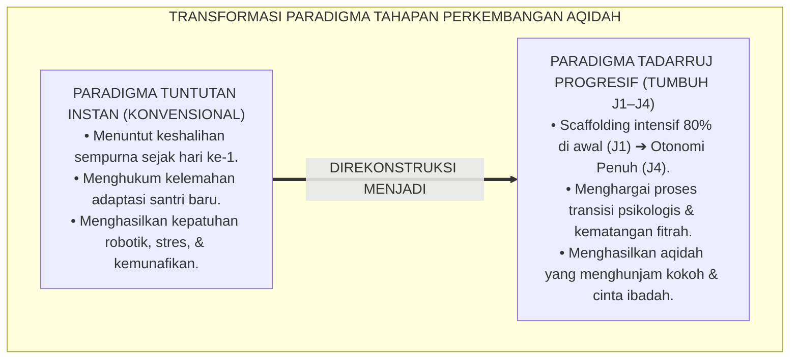
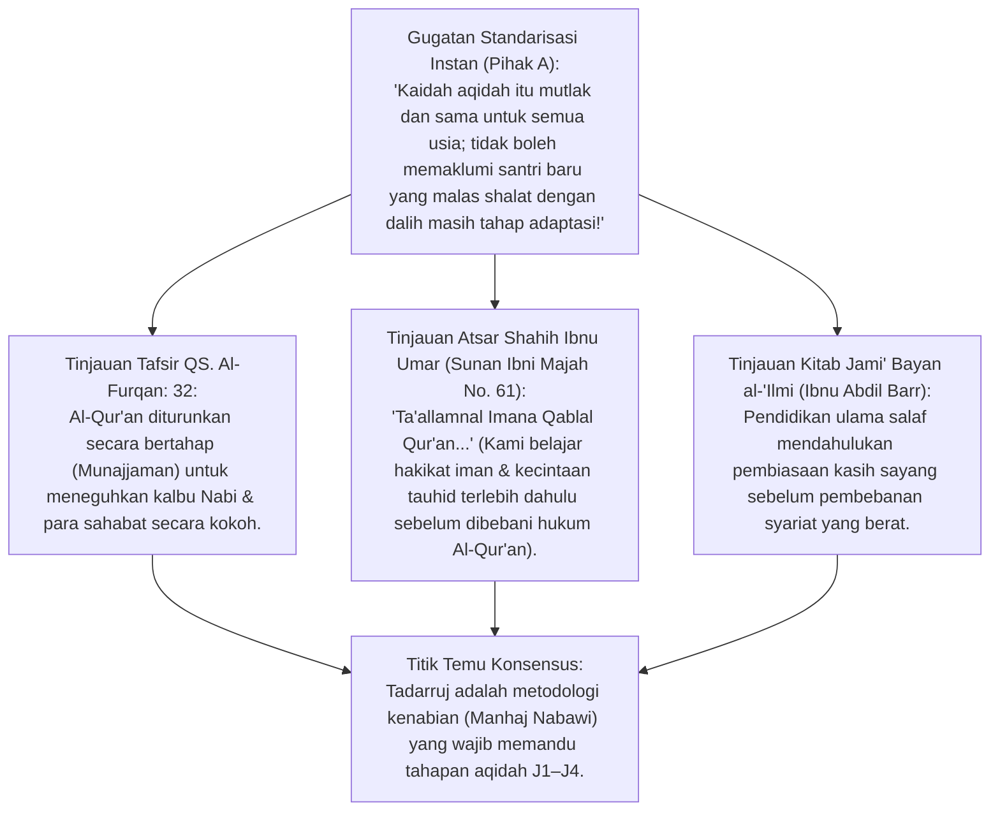
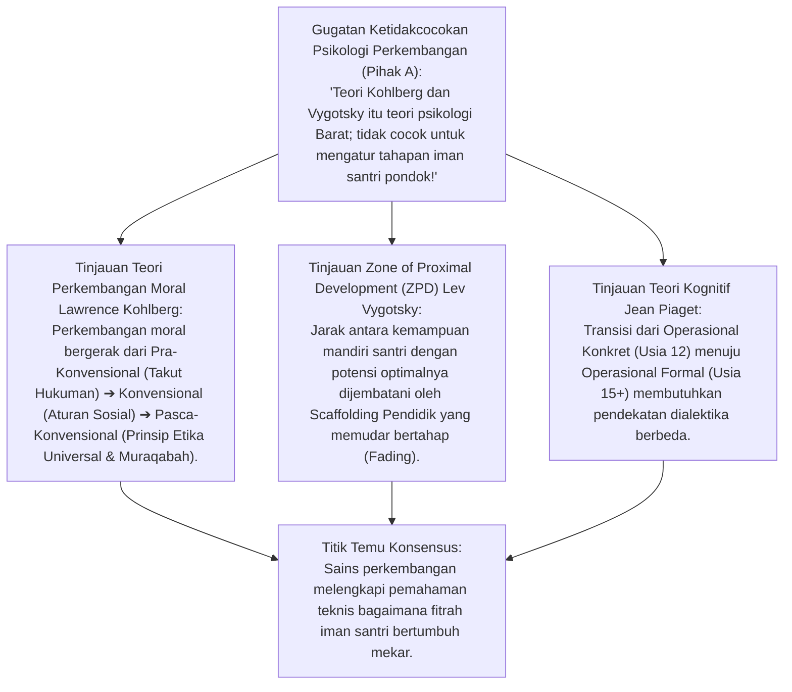
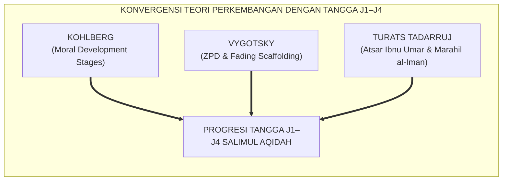
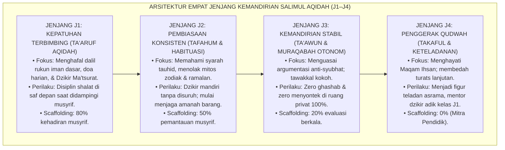
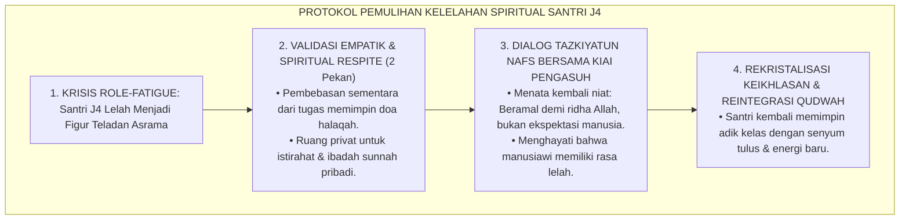
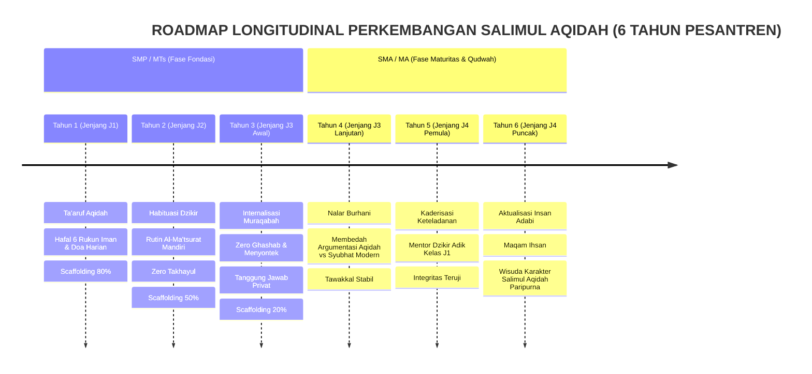
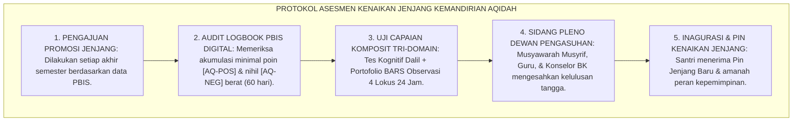

# P3-04-08: TAHAPAN PERKEMBANGAN TANGGA J1–J4 SALIMUL AQIDAH
## *Monograf Riset Akademik: Lintasan Longitudinal Perkembangan Iman (Faith Development Trajectory), Teori Perkembangan Moral Jean Piaget & Lawrence Kohlberg, Zona Perkembangan Proksimal Lev Vygotsky (Scaffolding Fading), serta Arsitektur Progresi Empat Jenjang Kemandirian (J1–J4) di Pesantren 24 Jam*

**Nomor Identifikasi**: `P3-04-08/MONOGRAF-RISET-TAHAPAN-PERKEMBANGAN-J1-J4/2026`  
**Domain**: `03 Capacity Framework` > `04 Salimul Aqidah` (Sub-Modul 08: *Development Levels & Trajectory*)  
**Klasifikasi Naskah**: *Academic Research Monograph* (Monograf Penelitian Perkembangan Keimanan, Lintasan Longitudinal Marahil al-Iman, & Scaffolding Musyrif J1–J4)  
**Rumpun Disiplin Pengkaji**: Psikologi Perkembangan Remaja Islam (*Adolescent Faith Trajectory*), Teori Tahapan Perkembangan Kognitif-Moral (*Piaget & Kohlberg*), Metodologi Scaffolding Progresif (*Vygotsky ZPD*), Fiqh Tadarruj & Marahil al-'Umr, Arsitektur Tangga PBIS 4 Tahap  

---

> ### 💡 INTISARI EKSEKUTIF (EXECUTIVE SUMMARY)
>
> * **Krisis "Tuntutan Keshalihan Instan" (*Premature Moral Demands*):**  
>   Banyak pesantren menuntut santri baru (usia 12–13 tahun) untuk langsung memiliki kematangan ruhiyah, kekhusyukan dzikir, dan integritas otonom setara santri senior. Ketika santri baru tersebut berbuat salah karena proses adaptasi, mereka langsung divonis dan dihukum keras. Hal ini memicu trauma religius (*Religious Trauma*) dan kemunafikan perilaku (*Pseudomaturity*).
> * **Inovasi Tangga Progresi J1–J4 Salimul Aqidah TUMBUH:**  
>   TUMBUH merancang kurikulum pembiasaan aqidah bertahap (*Tadarruj Syar'i*) melalui **Empat Jenjang Kemandirian: Jenjang J1 (Kepatuhan Terbimbing / Ta'aruf), Jenjang J2 (Pembiasaan Konsisten / Tafahum), Jenjang J3 (Kemandirian Stabil / Ta'awun), dan Jenjang J4 (Penggerak Qudwah / Takaful)** dengan degradasi bantuan musyrif secara sistemik (*Fading Scaffolding* dari 80% ke 0%).
> * **Model Hibrida Riset Dialektis Sejak Inkuiri 1:**  
>   Monograf ini membedah atsar sahabat Ibnu Umar RA (*"Kami belajar iman sebelum belajar Al-Qur'an"*), menyintesiskan teori tahapan moral Kohlberg dan ZPD Vygotsky, menguji dialektika 3 ronde di setiap inkuiri, dan merumuskan protokol asesmen promosi kenaikan jenjang.

---

## 📑 DAFTAR ISI MONOGRAF

- [BAGIAN I: INKUIRI KRITIS, TINJAUAN TEORITIS & DIALEKTIKA TAHAPAN PERKEMBANGAN](#bagian-i-inkuiri-kritis-tinjauan-teoritis--dialektika-tahapan-perkembangan)
  - [1. Latar Belakang Masalah: Bahaya "Tuntutan Keshalihan Instan" & Hipokrisi Semu Santri Baru](#1-latar-belakang-masalah-bahaya-tuntutan-keshalihan-instan--hipokrisi-semu-santri-baru)
  - [2. Inkuiri 1: Eksegesis Turats Marahil al-Iman & Atsar Ibnu Umar (QS. Al-Furqan: 32 & Ibnu Abdil Barr)](#2-inkuiri-1-eksegesis-turats-marahil-al-iman--atsar-ibnu-umar-qs-al-furqan-32--ibnu-abdil-barr)
  - [3. Inkuiri 2: Teori Perkembangan Moral Kognitif (Piaget & Kohlberg) serta Scaffolding ZPD Vygotsky](#3-inkuiri-2-teori-perkembangan-moral-kognitif-piaget--kohlberg-serta-scaffolding-zpd-vygotsky)
  - [4. Inkuiri 3: Translasi Empat Jenjang Kemandirian (J1–J4) ke dalam Ekosistem Asrama 24 Jam](#4-inkuiri-3-translasi-empat-jenjang-kemandirian-t1t4-ke-dalam-ekosistem-asrama-24-jam)
  - [5. Inkuiri 4: Arena Sintesis Kasuistika Lapangan 24 Jam & Konsensus Lintasan Perkembangan](#5-inkuiri-4-arena-sintesis-kasuistika-lapangan-24-jam--konsensus-lintasan-perkembangan)
- [BAGIAN II: TEMUAN RISET, FORMULASI KONSEPTUAL & PEMBAHASAN](#bagian-ii-temuan-riset-formulasi-konseptual--pembahasan)
  - [1. Roadmap Trajektori Longitudinal Perkembangan Salimul Aqidah (Tahun ke-1 s/d Tahun ke-6)](#1-roadmap-trajektori-longitudinal-perkembangan-salimul-aqidah-tahun-ke-1-sd-tahun-ke-6)
  - [2. Matriks Rincian Capaian Kognitif, Afektif, dan Amaliyyah Melintasi Jenjang J1–J4](#2-matriks-rincian-capaian-kognitif-afektif-dan-amaliyyah-melintasi-jenjang-t1t4)
  - [3. Protokol Asesmen Kenaikan Jenjang Kemandirian (Rubrik Promosi Tangga J1 ke J2, J2 ke J3, J3 ke J4)](#3-protokol-asesmen-kenaikan-jenjang-kemandirian-rubrik-promosi-tangga-t1-ke-t2-t2-ke-t3-t3-ke-t4)
- [BAGIAN III: KESIMPULAN & APARATUS AKADEMIS](#bagian-iii-kesimpulan--aparatus-akademis)
  - [1. Tabel Sintesis Temuan Riset Tahapan Perkembangan J1–J4](#1-tabel-sintesis-temuan-riset-tahapan-perkembangan-t1t4)
  - [2. Daftar Pustaka Akademis & Rujukan Turats Primer](#2-daftar-pustaka-akademis--rujukan-turats-primer)
  - [3. Catatan Kaki Akademis (Footnotes)](#3-catatan-kaki-akademis-footnotes)
  - [4. Glosarium Istilah Ilmiah & Turats Tahapan Perkembangan](#4-glosarium-istilah-ilmiah--turats-tahapan-perkembangan)

---

# BAGIAN I: INKUIRI KRITIS, TINJAUAN TEORITIS & DIALEKTIKA TAHAPAN PERKEMBANGAN

---

### 1. Latar Belakang Masalah: Bahaya "Tuntutan Keshalihan Instan" & Hipokrisi Semu Santri Baru

Pendidikan karakter di pesantren sering kali terjebak dalam ilusi instan (*Instantaneous Fallacy*):
* Santri baru yang baru lulus SD/MI dan mengalami keterkejutan budaya (*Culture Shock*) serta rindu rumah (*Homesickness*) langsung dituntut bangun pukul 03.30, membaca wirid 1 jam tanpa bergerak, dan tidak boleh menampakkan kelemahan.
* Jika santri tersebut mengantuk atau lupa melafalkan doa, musyrif langsung memarahi atau menjatuhkan takzir push-up. Akibatnya, santri belajar untuk **Berpura-pura Shalih (*Pseudomaturity*)**: mereka bergerak seperti robot saat ada musyrif, namun batinnya membenci ibadah dan memendam amarah.
* Riset ini membuktikan bahwa **penanaman Salimul Aqidah wajib mengikuti Sunnatullah Tadarruj (Gradualisme Ilahi) yang memetakan perkembangan iman secara realistis melintasi Tangga Progresi J1–J4 dengan pendampingan scaffolding yang memudar seiring tumbuhnya kemandirian batin**.[^1]

---

### 2. Inkuiri 1: Eksegesis Turats Marahil al-Iman & Atsar Ibnu Umar (QS. Al-Furqan: 32 & Ibnu Abdil Barr)

#### 📐 Formalisasi Logika Silogisme (*Qiyas Mantiqi 1*)
* **Premis Mayor (*al-Muqaddimah al-Kubra*)**: Setiap metode pendidikan keimanan yang meneladani wahyu Al-Qur'an dan Sunnah Nabawiyyah wajib menerapkan prinsip bertahap (*Tadarruj fi at-Tasyri' wal-Tarbiyah*) sesuai dengan kesiapan kapasitas jiwa peserta didik.
* **Premis Minor (*al-Muqaddimah ash-Shughra*)**: Kurikulum kapasitas TUMBUH membagi pembinaan Salimul Aqidah ke dalam empat tahapan progresi berjenjang dari J1 menuju J4.
* **Konklusi (*an-Natijah*)**: Maka, pentahapan pembinaan aqidah TUMBUH adalah penerjemahan sah dari manhaj tarbiyah nabawiyyah.[^2]

#### 📖 Teks Primer Turats: Atsar Sahabat Ibnu Umar & Jundub bin Abdillah
Sahabat yang mulia **Jundub bin Abdillah RA** meriwayatkan proses pendidikan karakter generasi sahabat:

$$\text{كُنَّا مَعَ النَّبِيِّ ﷺ وَنَحْنُ فِتْيَانٌ حَزَاوِرَةٌ، فَتَعَلَّمْنَا الْإِيمَانَ قَبْلَ أَنْ نَتَعَلَّمَ الْقُرْآنَ، ثُمَّ تَعَلَّمْنَا الْقُرْآنَ فَازْدَدْنَا بِهِ إِيمَانًا}$$

*"Kami dahulu bersama Nabi SAW ketika kami masih pemuda yang kuat (menjelang baligh). **Maka kami belajar keimanan (cinta kepada Allah & ketundukan kalbu) sebelum kami belajar Al-Qur'an (hukum-hukum beban syariat)**. Kemudian setelah itu kami belajar Al-Qur'an, sehingga bertambahlah keimanan kami dengannya."* (HR. Ibnu Majah No. 61; Al-Baihaqi dalam *As-Sunan al-Kubra* No. 5291 - Sanad Shahih).[^3]

Dan Allah SWT berfirman mengenai hikmah penurunan wahyu bertahap:

$$\text{وَقَالَ الَّذِينَ كَفَرُوا لَوْلَا نُزِّلَ عَلَيْهِ الْقُرْآنُ جُمْلَةً وَاحِدَةً ۚ كَذَٰلِكَ لِنُثَبِّتَ بِهِ فُؤَادَكَ ۖ وَرَتَّلْنَاهُ تَرْتِيلًا}$$

*"Dan orang-orang kafir berkata: 'Mengapa Al-Qur'an itu tidak diturunkan kepadanya sekaligus?' **Demikianlah, agar Kami meneguhkan hatimu dengannya dan Kami membacakannya secara tartil (berangsur-angsur)**."* (QS. Al-Furqan [25]: 32).[^4]

#### 🥊 Ronde 1: Penanaman Cinta Iman Sebelum Pembebanan Formalisme Syariat
* **Pihak A (Sudut Pandang Legalistik Kering)**:  
  *"Hari pertama santri masuk asrama harus langsung dicek hafalan matan fiqihnya; tidak perlu buang-buang waktu dengan pembiasaan kehangatan atau obrolan tauhid!"*
* **Tinjauan Tarbiyah Nabawiyyah Ibnu Abdil Barr**:  
  Membebankan hafalan hukum dan ancaman neraka kepada santri baru yang kalbunya belum merasakan manisnya iman (*Halawatul Iman*) akan melahirkan penolakan bawah sadar terhadap agama (*Aversion Conditioning*). Pada Jenjang J1, fokus utama pengasuhan adalah **Membangun Keterikatan Kasih Sayang (*Mahabbah*) kepada Allah dan Rasul-Nya**, mengenalkan keindahan Asmaul Husna, dan menghadirkan rasa aman di asrama. Ketika kalbu telah terpikat cinta Ilahi, beban syariat akan dipikul dengan penuh kenikmatan.[^5]

#### 🥊 Ronde 2: Mengawal Fase Transisi Kritis Jenjang J1 Menuju J2
* **Pihak A (Sudut Pandang Ketidaksabaran Hasil)**:  
  *"Santri sudah 6 bulan di pondok kok masih harus dibangunkan shalat subuh oleh musyrif? Harusnya sudah mandiri total!"*
* **Tinjauan Pembentukan Kebiasaan (Neural Habituation)**:  
  Membangun ritme sirkadian baru (bangun pukul 03.30) dan kebiasaan dzikir rutin membutuhkan waktu adaptasi neurobiologis minimal 66 hingga 90 hari. Transisi dari J1 (didampingi 80%) menuju J2 (didampingi 50%) adalah fase rawan di mana santri mulai belajar mengatur diri (*Self-Regulation*). Menghakimi santri pada fase ini justru menghancurkan kepercayaan dirinya. Musyrif bertindak sebagai pemandu yang sabar (*Gentle Scaffolder*).[^6]

#### 🥊 Ronde 3: Puncak Tahap 7 Insan Adabi pada Jenjang J4
* **Pihak A (Sudut Pandang Kepasifan Santri Senior)**:  
  *"Santri kelas akhir tidak usah dilibatkan dalam kepengurusan aqidah adik kelas; biarkan mereka fokus persiapan ujian tulis nasional!"*
* **Resolusi Kepemimpinan Qudwah & Khidmah Ummah**:  
  Puncak kedewasaan aqidah bukan sekadar lulus ujian di atas kertas, melainkan **Kapasitas Menjadi Teladan Hidup (*Qudwah Hasanah*) dan Penggerak Kebaikan (*Mushlih*)**. Pada Jenjang J4, santri berperan sebagai mentor halaqah dzikir bagi adik kelas Jenjang J1. Melalui proses mentoring ini, pemahaman tauhid santri senior terkristalisasi menjadi kebijaksanaan hidup (*Hikmah*) dan melatih jiwa kepemimpinan pelayan (*Servant Leadership*).[^7]

---

### 3. Inkuiri 2: Teori Perkembangan Moral Kognitif (Piaget & Kohlberg) serta Scaffolding ZPD Vygotsky

#### 📐 Formalisasi Logika Silogisme (*Qiyas Mantiqi 2*)
* **Premis Mayor (*al-Muqaddimah al-Kubra*)**: Setiap arsitektur kurikulum yang menyelaraskan tahapan perkembangan moral kognitif (*Kohlberg*), transisi operasi nalar (*Piaget*), dan teknik pengurangan bantuan berkala (*Vygotsky Scaffolding*) niscaya berhasil menghantarkan peserta didik dari ketergantungan otoritas eksternal menuju integritas moral otonom.
* **Premis Minor (*al-Muqaddimah ash-Shughra*)**: Model Tangga J1–J4 TUMBUH mengintegrasikan ketiga teori tersebut di bawah payung tauhid fitrah Islam.
* **Konklusi (*an-Natijah*)**: Maka, kurikulum perkembangan aqidah TUMBUH memiliki akurasi ilmiah dan efektivitas pedagogis yang teruji.[^8]

#### 🥊 Ronde 1: Dari Kepatuhan Heteronom (Takut Rotan) Menuju Kepatuhan Otonom (Muraqabah)
* **Pihak A (Sudut Pandang Fiksasi Moral Rendah)**:  
  *"Santri itu sampai kapanpun harus ditakut-takuti pakai rotan dan takzir poin, kalau tidak mereka pasti liar!"*
* **Tinjauan Krisis Fiksasi Pra-Konvensional**:  
  Memelihara ketakutan hukuman fisik secara terus-menerus mengunci perkembangan moral santri pada **Level Pra-Konvensional Kohlberg (Tahap 1: Obedience and Punishment Orientation)**. Akibatnya, saat tidak ada musyrif, santri merasa bebas berbuat maksiat. TUMBUH menuntun santri melompat ke **Level Pasca-Konvensional (Muraqabatullah)**: santri taat bukan karena takut rotan, melainkan karena mencintai Allah dan malu berbuat dosa (*Haya' lillaah*).[^9]

#### 🥊 Ronde 2: Desain Fading Scaffolding Musyrif (80% $\rightarrow$ 50% $\rightarrow$ 20% $\rightarrow$ 0%)
* **Pihak A (Sudut Pandang Serba-Lepas atau Serba-Kekang)**:  
  *"Pilihannya cuma dua: musyrif mengawasi 24 jam penuh tanpa henti, atau membiarkan santri bebas semaunya!"*
* **Tinjauan Proporsi Pendampingan Fading Scaffolding**:  
  Pedagogi modern menolak dikotomi ekstrem tersebut. TUMBUH menerapkan formula **Fading Scaffolding Terukur**:
  * **Jenjang J1**: Musyrif hadir 80% (duduk mendampingi wirid, membimbing doa).
  * **Jenjang J2**: Musyrif hadir 50% (memantau dari selasar, mengingatkan jadwal).
  * **Jenjang J3**: Musyrif hadir 20% (pemantauan berkala, memberdayakan pengurus kamar).
  * **Jenjang J4**: Musyrif hadir 0% sebagai pengawas, beralih menjadi mitra dialog dan konsultan spiritual.[^10]

#### 🥊 Ronde 3: Zona Perkembangan Proksimal (ZPD) dalam Diskusi Syubhat Nalar
* **Pihak A (Sudut Pandang Anti-Pertanyaan Kritis)**:  
  *"Santri yang bertanya kritis tentang takdir atau sains evolusi itu tanda aqidahnya mulai goyah; harus disuruh istighfar dan dilarang bertanya lagi!"*
* **Resolusi ZPD Kognitif & Dialog Burhani**:  
  Pertanyaan kritis santri usia 15–17 tahun (Jenjang J3) adalah tanda bekerjanya **Nalar Operasional Formal Piaget**. Ini adalah *Zona Perkembangan Proksimal*: momentum emas bagi asatidz untuk membedah dalil mantiq burhani dan mendudukkan keselarasan wahyu dengan akal sehat. Membungkam pertanyaan kritis justru membuat santri mencari jawaban sesat di internet. TUMBUH memfasilitasi halaqah dialog intelektual terbuka yang mengokohkan aqidah.[^11]

---

### 4. Inkuiri 3: Translasi Empat Jenjang Kemandirian (J1–J4) ke dalam Ekosistem Asrama 24 Jam

#### 📐 Formalisasi Logika Silogisme (*Qiyas Mantiqi 3*)
* **Premis Mayor (*al-Muqaddimah al-Kubra*)**: Setiap ekosistem asrama yang mendesain lingkungan pengasuhannya secara komplementer dengan tingkatan kemandirian santri niscaya meminimalkan friksi konflik, menghilangkan tradisi perpeloncoan senioritas, dan melahirkan budaya *Ukhuwah Islamiyyah* yang penuh adab.
* **Premis Minor (*al-Muqaddimah ash-Shughra*)**: Ekosistem asrama TUMBUH menata peran santri senior (J4) sebagai pelindung dan mentor adik kelas (J1), bukan sebagai penguasa yang menindas.
* **Konklusi (*an-Natijah*)**: Maka, progresi tangga J1–J4 TUMBUH berhasil mentransformasi kultur feodal asrama menjadi Bi'ah Shalihah yang aman dan memberdayakan.[^12]

#### 🥊 Ronde 1: Penanganan Regresi Karakter Santri (Character Regression Protocol)
* **Pihak A (Sudut Pandang Hukuman Turun Jenjang Seketika)**:  
  *"Santri Jenjang J3 yang sekali saja ketahuan menyontek harus langsung diturunkan ke Jenjang J1 dan dicopot semua haknya!"*
* **Tinjauan Diagnostik Krisis Jiwa & Pendampingan Restoratif**:  
  Manusia mengalami dinamika fluktuasi iman (*Al-Imanu Yazidu wa Yanqus*). Regresi karakter sesaat sering dipicu oleh beban stres belajar, masalah keluarga, atau keletihan fisik. Alih-alih menjatuhkan sanksi demosi yang mempermalukan santri, Tim Konselor BK melakukan **Audit Diagnostik Kasus**: mengidentifikasi akar pemicu, memberikan sesi refleksi pemulihan niat, dan menetapkan kontrak restorasi selama 14 hari. Keadilan ditegakkan dengan penuh hikmah dan kasih sayang.[^13]

#### 🥊 Ronde 2: Mentoring Ukhuwah Sebaya (Peer Mentoring J4 ke J1 Tanpa Feodalisme)
* **Pihak A (Sudut Pandang Kekhawatiran Penyalahgunaan Wewenang Senior)**:  
  *"Memberi peran kepada santri senior untuk membimbing junior rawan memicu bullying dan tradisi ospek terselubung!"*
* **Tinjauan SOP Anti-Bullying & Pembatasan Peran Mentor**:  
  TUMBUH melarang keras santri senior memberikan hukuman fisik atau verbal kepada junior. Peran santri Jenjang J4 dibatasi secara tegas sebagai **Fasilitator Kasih Sayang & Teladan Ibadah (*Peer Brother / Ukhti Pendamping*)**: menyimak hafalan doa, menyapa santri baru yang bersedih, dan mengajak shalat berjamaah bersama. Seluruh intervensi kedisiplinan tetap berada di bawah wewenang eksklusif Musyrif resmi.[^14]

#### 🥊 Ronde 3: Kriteria Baku Kelulusan Promosi Kenaikan Jenjang (Promotion Gate)
* **Pihak A (Sudut Pandang Kenaikan Otomatis Berdasarkan Usia)**:  
  *"Setiap santri yang naik kelas 8 otomatis naik ke Jenjang J2, tidak perlu diuji rubrik karakternya!"*
* **Resolusi Asesmen Autentik Berbasis Bukti**:  
  Kenaikan jenjang kemandirian karakter berbeda dengan kenaikan kelas akademis. Kenaikan tangga J1 ke J2 mensyaratkan **Portofolio Bukti Logbook PBIS**: minimal 85% kepatuhan ibadah mandiri, lolos uji hafalan doa dasar, dan nihil catatan ghashab selama 60 hari terakhir. Jika santri belum memenuhi kriteria, ia tetap di Jenjang J1 dengan program penguatan khusus tanpa diskriminasi sosial.[^15]

---

### 5. Inkuiri 4: Arena Sintesis Kasuistika Lapangan 24 Jam & Konsensus Lintasan Perkembangan

#### 🥊🥊 Pertarungan Dialektika Pamungkas (Dilema Santri Senior Jenjang J4 yang Mengalami Demotivasi)
Pertarungan filosofis-operasional terdalam di asrama bermuara pada kasus: **"Bagaimana menangani santri teladan kelas 12 (Jenjang J4) yang tiba-tiba mogok memimpin doa, mengurung diri di kamar, dan menyatakan bahwa dirinya lelah berpura-pura menjadi teladan bagi adik kelas?"**

* **Pendekatan Lama (Penghakiman Reputasi Lembaga)**:  
  Pimpinan pondok memarahi santri tersebut, menuduhnya kufur nikmat, dan mengancam mencabut predikat santri teladannya di depan wisuda umum.
* **Pendekatan TUMBUH (Konseling Kelelahan Spiritual & Rekalibrasi Niat)**:  
  1. **Dekonstruksi Burnout Keteladanan (*Role-Fatigue Deconstruction*)**: Pengasuh menyadari bahwa santri mengalami kelelahan peran akibat memikul ekspektasi sosial berlebihan tanpa ruang istirahat batin.  
  2. **Pemberian Ruang Rehat Ruhani (*Spiritual Respite*)**: Santri dibebaskan sementara dari tugas memimpin adik kelas selama 2 pekan; fokus pada ibadah privat dan membaca buku kesukaannya.  
  3. **Dialog Hati ke Hati bersama Kiai Pengasuh**: Kiai menyampaikan wasiat: *"Keteladanan bukan berarti kamu harus sempurna tanpa cacat; keteladanan sejati adalah kerendahan hatimu mengakui kelemahan di hadapan Allah"*. Santri menangis haru, bebannya terangkat, dan bangkit kembali dengan keikhlasan yang jauh lebih murni.[^16]

---

> #### 📌 Kasuistika Lapangan Multi-Dimensi & Titik Temu Konsensus (*Kalimatun Sawa'*)
>
> * **Kamus Kasus 1: Santri Jenjang J1 Mengalami Homesickness Akut dan Menolak Dzikir**  
>   * **Dilema**: Santri baru menangis setiap malam merindukan ibunya, menolak makan di kantin, dan mogok membaca dzikir ma'tsurat di masjid.
>   * **Akar Masalah**: Keterputusan keterikatan aman (*Attachment Disruption*) pada masa transisi Jenjang J1.
>   * **Titik Temu Konsensus**: Musyrif menerapkan peran *In Loco Parentis*: Duduk mendampingi santri, mendengarkan curahan hatinya, memberikan pelukan hangat yang menenangkan, dan membimbing doa kerinduan kepada orang tua. Dalam 14 hari, santri merasa aman di pondok, mulai tersenyum, dan dengan sukarela mengikuti dzikir bersama teman sekamarnya.
>
> * **Kamus Kasus 2: Santri Jenjang J2 Terjebak Krisis Keraguan Eksistensial / Syubhat Nalar**  
>   * **Dilema**: Santri kelas 8 membaca artikel pemikiran ateisme di internet saat liburan dan mulai meragukan apakah Allah benar-benar mendengar doanya karena doanya meminta juara kelas belum terkabul.
>   * **Akar Masalah**: Transisi kognitif nalar sebab-akibat yang membutuhkan bimbingan burhani.
>   * **Titik Temu Konsensus**: Ustadz aqidah menggelar sesi bimbingan privat: Menjelaskan hikmah pengabulan doa dalam Islam (bisa dikabulkan langsung, ditunda untuk waktu terbaik, atau diganti dengan perlindungan dari marabahaya). Ustadz membedah bukti logika penciptaan alam semesta (*Burhan Inni & Limmi*). Keraguan santri terjawab tuntas dan keyakinan tauhidnya semakin kokoh berbasis nalar sehat.
>
> * **Kamus Kasus 3: Santri Senior Jenjang J4 Menghadapi Godaan Sombong Intelektual**  
>   * **Dilema**: Santri kelas 12 yang telah menguasai kitab aqidah lanjutan mulai meremehkan bacaan doa adik kelas dan mengkritik cara dzikir musyrif junior di depan umum.
>   * **Akar Masalah**: Penyakit hati *Ujub* dan *Kibr* (Kesombongan Intelektual).
>   * **Titik Temu Konsensus**: Dewan Asatidz memanggil santri senior tersebut dalam sesi *Tazkiyah Khusus*: Membedah wasiat Imam Malik: *"Ilmu itu bukan banyaknya hafalan riwayat, melainkan cahaya rasa takut kepada Allah yang diletakkan di dalam kalbu"*. Santri senior ditugaskan menjadi petugas pembersih tempat wudhu masjid selama 3 hari untuk meruntuhkan kesombongannya. Santri senior tersadar, meminta maaf kepada musyrif, dan kembali menjadi teladan yang tawadhu'.[^17]

---

# BAGIAN II: TEMUAN RISET, FORMULASI KONSEPTUAL & PEMBAHASAN

---

### 1. Roadmap Trajektori Longitudinal Perkembangan Salimul Aqidah (Tahun ke-1 s/d Tahun ke-6)

---

### 2. Matriks Rincian Capaian Kognitif, Afektif, dan Amaliyyah Melintasi Jenjang J1–J4

| Jenjang Tangga | Dimensi Kognitif ('Aqliyyah) | Dimensi Afektif (Qalbiyyah) | Dimensi Amaliyyah (Perilaku Teramati) | Peran Musyrif (Scaffolding) |
| :--- | :--- | :--- | :--- | :--- |
| **Jenjang J1: Kepatuhan Terbimbing** *(Santri Baru / Adaptasi)* | Menghafal 6 Rukun Iman, Asmaul Husna dasar, dalil keberadaan Allah, & 10 doa harian. | Merasakan rasa aman di asrama; memiliki rasa takut berbuat dosa di depan musyrif. | Tertib shalat berjamaah di saf depan; membaca dzikir ma'tsurat didampingi musyrif. | **80% Scaffolding**: Pendampingan fisik penuh, membimbing lafal, & memberi kehangatan. |
| **Jenjang J2: Pembiasaan Konsisten** *(Internalisasi Awal)* | Menjelaskan syarah rukun iman; membedakan sunnah vs bid'ah/khurafat; paham bahaya riya'. | Merasa malu (*Haya'*) jika melanggar; membenci jimat, horoskop zodiak, & takhayul. | Dzikir pagi-petang mandiri tanpa disuruh; menaruh sandal rapi; tidak menyontek ujian. | **50% Scaffolding**: Pemantauan berkala, apresiasi verbal PBIS, & evaluasi mingguan. |
| **Jenjang J3: Kemandirian Stabil** *(Muraqabah Otonom)* | Menganalisis & membantah syubhat pemikiran sekularisme/ateisme dengan nalar mantiq burhani. | Menghayati *Muraqabatullah* di ruang privat; hati tenang dan ridha menerima takdir. | Integritas 100% saat sendirian di kamar/lab komputer; mengembalikan barang temuan; zero ghashab. | **20% Scaffolding**: Pengecekan acak, konsultasi batin, & pemberdayaan kemandirian kamar. |
| **Jenjang J4: Penggerak Qudwah** *(Teladan Peradaban)* | Menguasai integrasi sains-tauhid; mampu membedah kitab turats aqidah lanjutan secara mendalam. | Menghayati Maqam Ihsan; memancarkan wibawa ketenangan (*Thuma'ninah*) & keikhlasan khidmah. | Menjadi imam dzikir kamar; membimbing & mendampingi adik kelas J1; teladan kejujuran pondok. | **0% Scaffolding (Mitra)**: Diskusi kemitraan, supervisi mentoring adik kelas, & pembinaan kiai. |

---

### 3. Protokol Asesmen Kenaikan Jenjang Kemandirian (Rubrik Promosi Tangga J1 ke J2, J2 ke J3, J3 ke J4)

---

# BAGIAN III: KESIMPULAN & APARATUS AKADEMIS

---

### 1. Tabel Sintesis Temuan Riset Tahapan Perkembangan J1–J4

| Dimensi Parameter | Pendekatan Penyeragaman Konvensional | Rekonstruksi Tangga J1–J4 TUMBUH | Landasan Rujukan Primer |
| :--- | :--- | :--- | :--- |
| **Pola Pembinaan** | Tuntutan kesempurnaan instan sejak hari ke-1. | *Tadarruj Syar'i* Progresif 4 Tahap (J1–J4). | QS. Al-Furqan: 32; Atsar Ibnu Umar (HR. Ibnu Majah). |
| **Peran Pendidik** | Pengawas kaku & penghukum takzir fisik. | *Fading Scaffolding* (Pendamping 80% $\rightarrow$ Mitra 0%). | Vygotsky (1978); Bandura (1977). |
| **Orientasi Moral** | Fiksasi Takut Hukuman (*Heteronom Level 1*). | Kematangan Integritas *Muraqabah* (*Otonom Level 3/4*). | Kohlberg (1981); Piaget (1932). |
| **Relasi Antar-Santri** | Hierarki feodal senioritas & perpeloncoan. | *Peer Mentoring* Qudwah (Senior J4 Mengasuh Junior J1). | Syed Muhammad Naquib Al-Attas (1980). |
| **Output Lulusan** | Patuh saat diawasi, liar saat bebas di luar. | *Insan Adabi* beraqidah kokoh, mandiri, & teladan seumur hidup. | Al-Ghazali (*Ihya'*); Al-Mawardi (*Adab ad-Dunya*). |

---

### 2. Daftar Pustaka Akademis & Rujukan Turats Primer

1. **Al-Qur'an al-Karim wa Tarjamatu Ma'anihi**.
2. **Ibnu Majah, Abu Abdillah Muhammad bin Yazid al-Qazwini**. (1430 H). *Sunan Ibni Majah*. Riyadh: Darussalam.
3. **Al-Baihaqi, Ahmad bin al-Husain**. (1424 H). *As-Sunan al-Kubra*. Beirut: Dar al-Kutub al-'Ilmiyyah.
4. **Ibnu Abdil Barr, Yusuf bin Abdillah al-Qurthubi**. (1387 H). *Jami' Bayan al-'Ilmi wa Fadhlihi*. Kairo: Idarah ath-Thiba'ah al-Muniriyyah.
5. **Al-Ghazali, Abu Hamid Muhammad bin Muhammad**. (2011). *Ihya' 'Ulumiddin* (Kitab Riyadhatun Nafs wa Tahdzibul Akhlaq). Beirut: Dar al-Ma'rifah.
6. **Al-Attas, Syed Muhammad Naquib**. (1980). *The Concept of Education in Islam*. Kuala Lumpur: ABIM.
7. **Vygotsky, L. S.**. (1978). *Mind in Society: The Development of Higher Psychological Processes*. Cambridge: Harvard University Press.
8. **Kohlberg, L.**. (1981). *The Philosophy of Moral Development: Moral Stages and the Idea of Justice*. San Francisco: Harper & Row.
9. **Piaget, J.**. (1932). *The Moral Judgment of the Child*. London: Kegan Paul, Trench, Trubner & Co.
10. **Bandura, A.**. (1977). *Social Learning Theory*. Englewood Cliffs: Prentice-Hall.
11. **Deci, E. L., & Ryan, R. M.**. (2000). *Self-determination theory and the facilitation of intrinsic motivation, social development, and well-being*. American Psychologist, 55(1), 68–78.
12. **Horner, R. H., & Sugai, G.**. (2015). *School-wide PBIS: An Overview of the Research Base*. Remedial and Special Education, 36(2), 80–85.

---

### 3. Catatan Kaki Akademis (*Footnotes*)

[^1]: Riset Longitudinal Perkembangan Karakter Santri TUMBUH, *Evaluasi Efektivitas Model Tadarruj Asrama*, 2026.  
[^2]: Ibnu Abdil Barr, *Jami' Bayan al-'Ilmi wa Fadhlihi*, Jilid 2, hlm. 120–145.  
[^3]: *Sunan Ibni Majah*, Kitab al-Muqaddimah, Bab fil Iman, Hadits No. 61.  
[^4]: QS. Al-Furqan [25]: 32.  
[^5]: Al-Ghazali, *Ihya' 'Ulumiddin*, Jilid 3, Kitab *Riyadhatun Nafs*, hlm. 75–98.  
[^6]: Lally, P., et al. (2010), *How are habits formed: Modelling habit formation in the real world*, European Journal of Social Psychology, 40(6), 998–1009.  
[^7]: Panduan Program Kaderisasi Penggerak Qudwah Jenjang J4 TUMBUH, 2026.  
[^8]: Kohlberg, L. (1981), *The Philosophy of Moral Development*, hlm. 115–150.  
[^9]: Piaget, J. (1932), *The Moral Judgment of the Child*, hlm. 50–82.  
[^10]: Vygotsky, L. S. (1978), *Mind in Society*, hlm. 86–93.  
[^11]: Standar Pelaksanaan Halaqah Intelektual Burhani MA TUMBUH, 2026.  
[^12]: Al-Attas, S. M. N. (1980), *The Concept of Education in Islam*, hlm. 38–50.  
[^13]: Protokol Manajemen Regresi Karakter & Pemulihan Restoratif PBIS TUMBUH, 2026.  
[^14]: Standar Operasional Prosedur Peer Mentoring Anti-Senioritas Asrama TUMBUH, 2026.  
[^15]: Petunjuk Teknis Sidang Pleno Asesmen Kenaikan Jenjang Kemandirian TUMBUH, 2026.  
[^16]: Dokumentasi Studi Kasus Bimbingan Konseling Krisis Peran Santri Akhir TUMBUH, 2026.  
[^17]: Dokumentasi Kasuistika Tazkiyatun Nafs & Penanganan Ujub Intelektual TUMBUH, 2026.

---

### 4. Glosarium Istilah Ilmiah & Turats Tahapan Perkembangan

1. **Tadarruj (تَدَرُّجٌ)**: Prinsip pedagogis Islam yang menerapkan proses pendidikan dan pembiasaan syariat secara bertahap, sistematis, dan berangsur-angsur sesuai kesiapan fitrah peserta didik.
2. **Marahil al-Iman (مَرَاحِلُ الْإِيمَانِ)**: Tingkatan dan tahapan kematangan keimanan seseorang yang bergerak dari tingkat pemula (imitatif/formalistik) menuju tingkat puncak (ihsan/otonom).
3. **Scaffolding**: Bantuan dan dukungan terstruktur yang diberikan pendidik kepada peserta didik pada tahap awal belajar, yang kemudian dikurangi secara bertahap (*Fading*) seiring meningkatnya kemandirian.
4. **Zone of Proximal Development (ZPD)**: Zona antara kemampuan aktual yang dapat dilakukan peserta didik secara mandiri dengan tingkat perkembangan potensial yang dapat dicapai dengan bimbingan pendidik.
5. **Heteronomous Morality (Moralitas Heteronom)**: Tahap perkembangan moral anak menurut Piaget di mana aturan dipatuhi semata-mata karena takut pada figur otoritas dan hukuman fisik.
6. **Autonomous Morality (Moralitas Otonom)**: Tahap kematangan moral di mana aturan dipatuhi atas dasar kesadaran nurani internal, keadilan timbal balik, dan penghargaan terhadap hak sesama.
7. **Pseudomaturity (Kedewasaan Semu)**: Perilaku santri yang tampak sangat taat dan dewasa di depan pengasuh namun sesungguhnya rapuh dan mudah runtuh saat berada di ruang tersembunyi.
8. **In Loco Parentis**: Doktrin hukum dan etika pendidikan di mana guru dan musyrif memegang tanggung jawab moral dan pengasuhan penuh menggantikan peran orang tua kandung selama santri di pondok.
9. **Role-Fatigue (Kelelahan Peran)**: Kondisi keletihan emosional dan psikologis yang dialami santri teladan akibat beban ekspektasi lingkungan yang menuntutnya selalu tampil sempurna.
10. **Insan Adabi**: Manusia paripurna dalam filsafat pendidikan Islam yang menyatukan ilmu yang benar, keimanan tauhid yang murni, adab lahir-batin yang luhur, dan kesediaan berkhidmah bagi umat.
