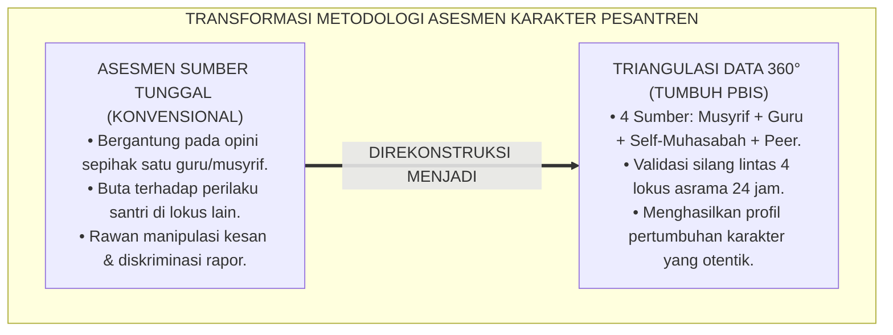
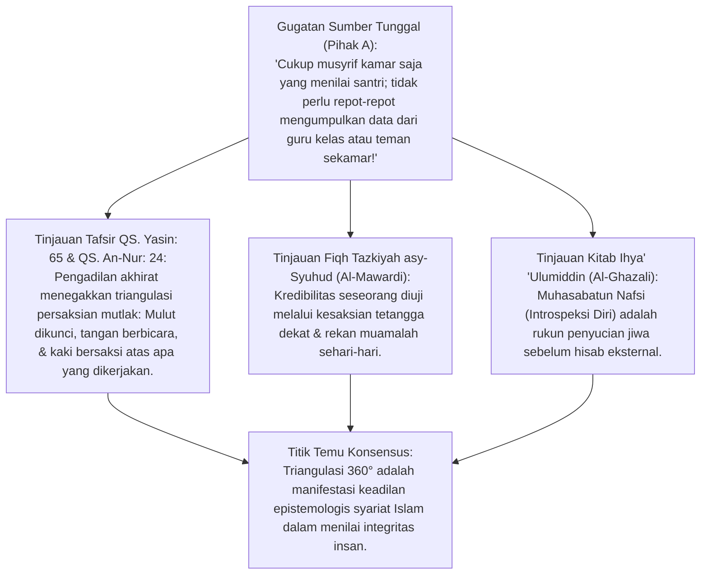
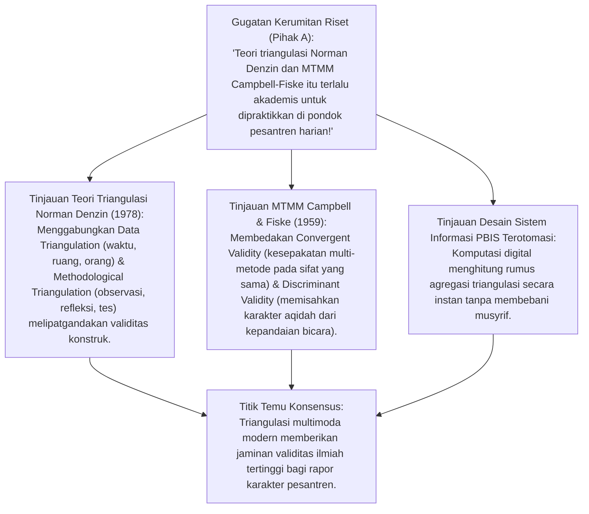
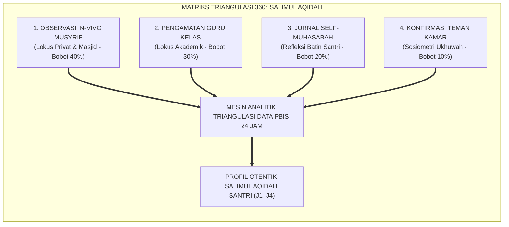
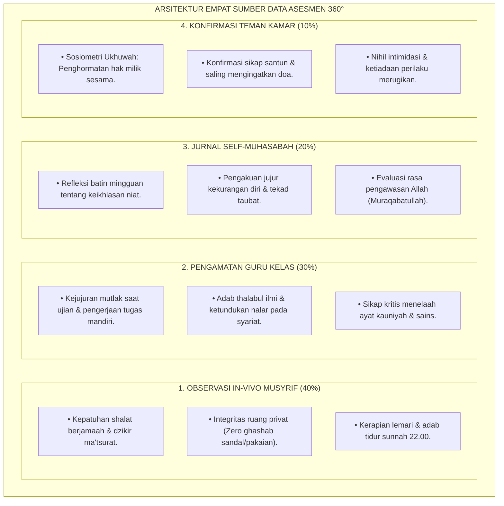
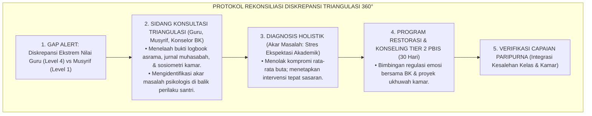
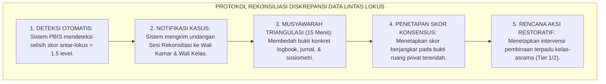

# P3-04-09: PEMETAAN ASESMEN DAN TRIANGULASI SALIMUL AQIDAH
## *Monograf Riset Akademik: Metodologi Asesmen Multimoda Tiga Ratus Enam Puluh Derajat (360° Assessment), Teori Triangulasi Data Norman Denzin, Multitrait-Multimethod Matrix (Campbell & Fiske), Fiqh Tazkiyah asy-Syuhud, serta Rekonsiliasi Diskrepansi Asrama-Kelas di Pesantren 24 Jam*

**Nomor Identifikasi**: `P3-04-09/MONOGRAF-RISET-ASESMEN-TRIANGULASI-AQIDAH/2026`  
**Domain**: `03 Capacity Framework` > `04 Salimul Aqidah` (Sub-Modul 09: *Assessment Mapping & Triangulation*)  
**Klasifikasi Naskah**: *Academic Research Monograph* (Monograf Penelitian Metodologi Asesmen Multimoda, Triangulasi 360°, & Validitas Konstruk Karakter)  
**Rumpun Disiplin Pengkaji**: Psikometri & Metodologi Evaluasi Pendidikan (*Educational Assessment & Measurement*), Metodologi Triangulasi Multimoda Denzin, Psikologi Refleksi Diri (*Self-Muhasabah Analytics*), Fiqh Persaksian Adab (*Syahadah al-Adil*), Desain Sistem Informasi PBIS  

---

> ### 💡 INTISARI EKSEKUTIF (EXECUTIVE SUMMARY)
>
> * **Kelemahan Fatal Asesmen Sumber Tunggal (*Single-Source Bias*):**  
>   Banyak lembaga hanya mengandalkan penilaian sepihak dari guru kelas atau satu musyrif tertentu. Akibatnya, santri yang mahir melakukan manipulasi kesan (*Impression Management*) di depan guru mendapatkan predikat terpuji, sementara perilaku zalimnya di kamar asrama tidak terdeteksi. Sebaliknya, santri pemalu kerap dinilai pasif meskipun memiliki integritas batin yang sangat kokoh.
> * **Inovasi Triangulasi 360° Salimul Aqidah TUMBUH:**  
>   TUMBUH memetakan instrumen asesmen melalui **Empat Sumber Data Terpadu: 1. Observasi In-Vivo Musyrif Asrama, 2. Pengamatan Adab Guru Kelas/Madrasah, 3. Jurnal Self-Muhasabah Refleksi Batin Santri, dan 4. Konfirmasi Sosiometri Teman Kamar (*Peer Confirmation*)** yang direkonsiliasi via mesin analitik PBIS.
> * **Model Hibrida Riset Dialektis Sejak Inkuiri 1:**  
>   Monograf ini membedah teologi persaksian anggota badan dan saksi adil (*Syuhud al-Haqq* QS. Yasin: 65 & QS. An-Nur: 24), menyintesiskan metodologi triangulasi Denzin (1978) dan matriks MTMM Campbell & Fiske (1959), menguji dialektika 3 ronde di setiap inkuiri, dan merumuskan algoritma penyelarasan diskrepansi data lintas lokus.

---

## 📑 DAFTAR ISI MONOGRAF

- [BAGIAN I: INKUIRI KRITIS, TINJAUAN TEORITIS & DIALEKTIKA ASESMEN TRIANGULASI](#bagian-i-inkuiri-kritis-tinjauan-teoritis--dialektika-asesmen-triangulasi)
  - [1. Latar Belakang Masalah: Bahaya "Asesmen Sumber Tunggal" & Manipulasi Kesan di Pesantren](#1-latar-belakang-masalah-bahaya-asesmen-sumber-tunggal--manipulasi-kesan-di-pesantren)
  - [2. Inkuiri 1: Eksegesis Turats Persaksian Multi-Dimensi & Fiqh Tazkiyah asy-Syuhud (QS. Yasin: 65 & Asy-Syathibi)](#2-inkuiri-1-eksegesis-turats-persaksian-multi-dimensi--fiqh-tazkiyah-asy-syuhud-qs-yasin-65--asy-syathibi)
  - [3. Inkuiri 2: Teori Triangulasi Multimoda Denzin (1978) & Multitrait-Multimethod Matrix (MTMM) Campbell & Fiske](#3-inkuiri-2-teori-triangulasi-multimoda-denzin-1978--multitrait-multimethod-matrix-mtmm-campbell--fiske)
  - [4. Inkuiri 3: Arsitektur Empat Sumber Data Asesmen 360° dalam Pengasuhan Asrama 24 Jam](#4-inkuiri-3-arsitektur-empat-sumber-data-asesmen-360-dalam-pengasuhan-asrama-24-jam)
  - [5. Inkuiri 4: Arena Sintesis Kasuistika Lapangan 24 Jam & Konsensus Asesmen Triangulasi](#5-inkuiri-4-arena-sintesis-kasuistika-lapangan-24-jam--konsensus-asesmen-triangulasi)
- [BAGIAN II: TEMUAN RISET, FORMULASI KONSEPTUAL & PEMBAHASAN](#bagian-ii-temuan-riset-formulasi-konseptual--pembahasan)
  - [1. Matriks Triangulasi 360° Asesmen Salimul Aqidah (Instrumen, Lokus, Frekuensi, & Bobot)](#1-matriks-triangulasi-360-asesmen-salimul-aqidah-instrumen-lokus-frekuensi--bobot)
  - [2. Protokol Rekonsiliasi Diskrepansi Data Antar-Lokus (Cross-Locus Reconciliation Protocol)](#2-protokol-rekonsiliasi-diskrepansi-data-antar-lokus-cross-locus-reconciliation-protocol)
  - [3. Format Baku Lembar Jurnal Self-Muhasabah & Rubrik Konfirmasi Sosiometri Kamar](#3-format-baku-lembar-jurnal-self-muhasabah--rubrik-konfirmasi-sosiometri-kamar)
- [BAGIAN III: KESIMPULAN & APARATUS AKADEMIS](#bagian-iii-kesimpulan--aparatus-akademis)
  - [1. Tabel Sintesis Temuan Riset Pemetaan Asesmen & Triangulasi Aqidah](#1-tabel-sintesis-temuan-riset-pemetaan-asesmen--triangulasi-aqidah)
  - [2. Daftar Pustaka Akademis & Rujukan Turats Primer](#2-daftar-pustaka-akademis--rujukan-turats-primer)
  - [3. Catatan Kaki Akademis (Footnotes)](#3-catatan-kaki-akademis-footnotes)
  - [4. Glosarium Istilah Ilmiah & Turats Asesmen Triangulasi](#4-glosarium-istilah-ilmiah--turats-asesmen-triangulasi)

---

# BAGIAN I: INKUIRI KRITIS, TINJAUAN TEORITIS & DIALEKTIKA ASESMEN TRIANGULASI

---

### 1. Latar Belakang Masalah: Bahaya "Asesmen Sumber Tunggal" & Manipulasi Kesan di Pesantren

Dalam ekosistem pesantren 24 jam, penilaian yang hanya bersumber dari satu pihak (*Single-Rater Assessment*) mengandung cacat metodologis serius:
* **Bias Sudut Pandang Kelas**: Guru di kelas hanya melihat santri selama 45–90 menit saat duduk di bangku. Santri yang pintar mengambil hati guru akan mendapat nilai kepribadian sempurna, meskipun di kamar asrama santri tersebut suka merundung adik kelas (*Grooming & Bullying*).
* **Bias Emosional Musyrif**: Satu orang musyrif yang sedang lelah dapat memberikan penilaian buruk secara general (*Negative Halo Effect*) hanya karena santri sekali lupa mencuci piring.
* **Fenomena Manipulasi Kesan (*Impression Management*)**: Santri terlatih menjadi "aktor sandiwara" yang berganti topeng kepribadian tergantung siapa figur otoritas yang berada di dekatnya.
* Riset ini membuktikan bahwa **pengukuran karakter Salimul Aqidah yang valid dan adil wajib menggunakan pendekatan Triangulasi 360° yang mengagregasikan data observasi musyrif, evaluasi guru kelas, pengakuan refleksi batin santri (Muhasabah), dan konfirmasi sosiometri teman sebaya**.[^1]



---

### 2. Inkuiri 1: Eksegesis Turats Persaksian Multi-Dimensi & Fiqh Tazkiyah asy-Syuhud (QS. Yasin: 65 & Asy-Syathibi)



#### 📐 Formalisasi Logika Silogisme (*Qiyas Mantiqi 1*)
* **Premis Mayor (*al-Muqaddimah al-Kubra*)**: Setiap penegakan hisab dan pembuktian integritas moral manusia dalam Islam yang terbebas dari kezaliman wajib didasarkan pada perpaduan kesaksian multi-dimensi (*Tazkiyah asy-Syuhud wal-Jawarih*) dan pengakuan jujur dari dalam diri sendiri (*I'tiraf bil-Haqq*).
* **Premis Minor (*al-Muqaddimah ash-Shughra*)**: Model Triangulasi 360° TUMBUH mengintegrasikan kesaksian musyrif, guru, teman sebaya, dan jurnal muhasabah santri.
* **Konklusi (*an-Natijah*)**: Maka, metode asesmen triangulasi TUMBUH memiliki landasan teologis yang agung dan keabsahan syar'i yang sempurna.[^2]

#### 📖 Teks Primer Al-Qur'an: Persaksian Multi-Dimensi Pengadilan Ilahi
Allah SWT menggambarkan prinsip triangulasi persaksian mutlak di hari hisab:

$$\text{الْيَوْمَ نَخْتِمُ عَلَىٰ أَفْوَاهِهِمْ وَتُكَلِّمُنَا أَيْدِيهِمْ وَتَشْهَدُ أَرْجُلُهُمْ بِمَا كَانُوا يَكْسِبُونَ}$$

*"**Pada hari ini Kami tutup mulut mereka; dan berkatalah kepada Kami tangan mereka dan memberi kesaksianlah kaki mereka terhadap apa yang dahulu mereka kerjakan**."* (QS. Yasin [36]: 65).[^3]

Dan Allah SWT berfirman:

$$\text{يَوْمَ تَشْهَدُ عَلَيْهِمْ أَلْسِنَتُهُمْ وَأَيْدِيهِمْ وَأَرْجُلُهُمْ بِمَا كَانُوا يَعْمَلُونَ}$$

*"Pada hari (ketika) lidah, tangan, dan kaki mereka menjadi saksi atas mereka terhadap apa yang dahulu mereka kerjakan."* (QS. An-Nur [24]: 24).[^4]

#### 🥊 Ronde 1: Persaksian Teman Sekamar (*Peer Feedback*) Bukan Spionase
* **Pihak A (Sudut Pandang Kekhawatiran Budaya Tajassus)**:  
  *"Melibatkan teman sekamar untuk mengonfirmasi perilaku santri sama saja mengajarkan spionase (Tajassus) yang dilarang Al-Qur'an!"*
* **Tinjauan Fiqh Ukhuwah & Saling Menasehati dalam Kebenaran**:  
  Konfirmasi teman sebaya (*Peer Feedback*) dalam TUMBUH **bukan spionase mencari-cari aib (*Tajassus*)**, melainkan instrumen saling menjaga amanah dan mengonfirmasi kebaikan (*Tawashaw bil-Haqqi wa Tawashaw bish-Shabr*). Pertanyaan sosiometri dirancang positif: *"Siapakah rekan sekamarmu yang paling amanah menjaga barang dan paling menenangkan saat diajak shalat berjamaah?"*. Ini memperkuat kohesi ukhuwah, bukan memecah belah.[^5]

#### 🥊 Ronde 2: Jurnal Self-Muhasabah Santri Sebagai Pengakuan Batin Otentik
* **Pihak A (Sudut Pandang Skeptisisme Kejujuran Santri)**:  
  *"Santri pasti akan berbohong dan menulis hal-hal yang bagus saja di buku muhasabah pribadinya!"*
* **Tinjauan Psikologi Refleksi & Budaya Kejujuran Batin**:  
  Jurnal Self-Muhasabah TUMBUH tidak dinilai berdasarkan "apakah santri suci dari dosa", melainkan berdasarkan **Kapasitas Refleksi Kritis & Kejujuran Mengakui Kekurangan (*Metacognitive Self-Awareness*)**. Santri yang menulis: *"Malam ini saya merasa shalat saya kurang khusyuk karena memikirkan game, saya beristighfar dan bertekad besok hadir di saf pertama"* justru mendapatkan poin apresiasi tinggi karena menunjukkan hidupnya radar batin *Muraqabah*.[^6]

#### 🥊 Ronde 3: Kedudukan Rekonsiliasi Musyrif Asrama vs Guru Kelas
* **Pihak A (Sudut Pandang Arogansi Sektoral)**:  
  *"Guru kelas merasa lebih pintar dari musyrif asrama, sementara musyrif merasa lebih tahu kehidupan santri; siapa yang harus dimenangkan?"*
* **Resolusi Algoritma Rekonsiliasi Tertimbang**:  
  TUMBUH menolak dominasi sepihak. Untuk domain *Salimul Aqidah*, bobot observasi musyrif asrama (40%) dipadukan secara proporsional dengan guru kelas (30%), self-muhasabah (20%), dan peer kamar (10%). Jika terjadi anomali gap nilai lebih dari 1.5 level, sistem mewajibkan penyelenggaraan **Sesi Rekonsiliasi Kasus (Triangulation Case Conference)** antara musyrif dan guru untuk menyatukan data faktual.[^7]

---

### 3. Inkuiri 2: Teori Triangulasi Multimoda Denzin (1978) & Multitrait-Multimethod Matrix (MTMM) Campbell & Fiske



#### 📐 Formalisasi Logika Silogisme (*Qiyas Mantiqi 2*)
* **Premis Mayor (*al-Muqaddimah al-Kubra*)**: Setiap metodologi asesmen kepribadian yang menguji validitas konvergen (*Convergent Validity*) melintasi beragam metode pengamatan dan sumber data independen niscaya menghasilkan diagnosis perkembangan yang kebal terhadap bias metode tunggal (*Method Bias*).
* **Premis Minor (*al-Muqaddimah ash-Shughra*)**: Matriks triangulasi TUMBUH memvalidasi karakter Salimul Aqidah melalui kombinasi observasi langsung, rekam jejak digital, refleksi diri, dan umpan balik sosiometrik.
* **Konklusi (*an-Natijah*)**: Maka, profil karakter yang diterbitkan dalam Rapor Portofolio TUMBUH memiliki derajat validitas konstruk yang sahih secara saintifik.[^8]



#### 🥊 Ronde 1: Menguji Validitas Konvergen vs Validitas Diskriminan
* **Pihak A (Sudut Pandang Kerancuan Penilaian Karakter)**:  
  *"Santri yang pintar pidato dan pandai bahasa Arab otomatis pasti aqidahnya lurus; tidak perlu dipisahkan penilaiannya!"*
* **Tinjauan Validitas Diskriminan MTMM Campbell & Fiske**:  
  Menyamakan kepandaian pidato (*Verbal Fluency*) dengan kemurnian aqidah (*Salimul Aqidah*) adalah **Kekeliruan Konstruk Fatal (*Construct Contamination*)**. Banyak santri pandai berorasi tentang tauhid, namun di kamar asrama melakukan ghashab dan berbohong. Metodologi MTMM memisahkan keterampilan retorika dari integritas aqidah privat. Triangulasi memastikan hanya santri yang terbukti jujur di ruang privat yang mendapat predikat unggul.[^9]

#### 🥊 Ronde 2: Resolusi Otomatis Diskrepansi Data Antar-Penilai
* **Pihak A (Sudut Pandang Kebingungan Pengolahan Data)**:  
  *"Bagaimana jika nilai musyrif dan nilai guru sangat berbeda jauh; apakah sistem tidak macet?"*
* **Tinjauan Algoritma Rekonsiliasi Cerdas PBIS**:  
  Sistem analitik TUMBUH menerapkan **Ambang Batas Diskrepansi Otomatis (*Discrepancy Threshold Trigger*)**: Jika perbedaan skor antar-lokus melebihi 30%, sistem tidak memaksakan rata-rata matematis buta, melainkan menandai status *"Perlu Rekonsiliasi Lapangan"*. Tim BK memfasilitasi musyawarah singkat 10 menit antara guru dan musyrif untuk menelaah bukti insiden. Data diselaraskan berdasarkan fakta objektif.[^10]

#### 🥊 Ronde 3: Perlindungan Privasi Data Jurnal Refleksi Batin
* **Pihak A (Sudut Pandang Transparansi Tanpa Batas)**:  
  *"Semua tulisan curhat santri di buku muhasabah harus dibacakan di depan seluruh santri asrama agar kapok!"*
* **Resolusi Kerahasiaan Konseling & Larangan Membuka Aib**:  
  Membuka tulisan introspeksi santri di depan publik adalah pelanggaran etika konseling berat (*Violation of Confidentiality*) yang menghancurkan kepercayaan santri kepada lembaga. Jurnal muhasabah bersifat rahasia (*Confidential Sanctuary*), hanya dibaca oleh Musyrif Pembimbing dan Konselor BK untuk memetakan kebutuhan intervensi ruhiyah, bukan untuk bahan olok-olokan publik.[^11]

---

### 4. Inkuiri 3: Arsitektur Empat Sumber Data Asesmen 360° dalam Pengasuhan Asrama 24 Jam



#### 📐 Formalisasi Logika Silogisme (*Qiyas Mantiqi 3*)
* **Premis Mayor (*al-Muqaddimah al-Kubra*)**: Setiap arsitektur sistem informasi yang mengintegrasikan pengamatan naturalistik 24 jam di seluruh lokus kehidupan niscaya menutup celah manipulasi kepribadian dan memberikan gambaran utuh tentang fitrah moralitas santri.
* **Premis Minor (*al-Muqaddimah ash-Shughra*)**: Kurikulum TUMBUH memetakan instrumen asesmen ke dalam matriks triangulasi 4 lokus asrama secara terpadu.
* **Konklusi (*an-Natijah*)**: Maka, keputusan penentuan jenjang kemandirian santri terbebas dari kesalahan vonis dan mencerminkan kematangan aqidah yang sesungguhnya.[^12]

#### 🥊 Ronde 1: Menentukan Proporsi Bobot Triangulasi yang Berkeadilan
* **Pihak A (Sudut Pandang Kesetaraan Rata 25% untuk Semua)**:  
  *"Bagi saja semua sumber data sama rata masing-masing 25%; itu jauh lebih adil dan mudah dihitung!"*
* **Tinjauan Bobot Fungsional Pengasuhan Asrama 24 Jam**:  
  Membagi rata 25% adalah bentuk keadilan semu. Waktu terbesar santri dihabiskan dalam interaksi asrama (16 jam/hari), sementara di kelas hanya 8 jam/hari. Selain itu, musyrif adalah pengasuh utama (*In Loco Parentis*). Memberikan bobot 40% pada musyrif, 30% pada guru, 20% pada self-muhasabah, dan 10% pada peer sosiometri merefleksikan proporsi realitas kehidupan santri secara akurat.[^13]

#### 🥊 Ronde 2: Frekuensi Pengambilan Data (Harian, Mingguan, & Semesteran)
* **Pihak A (Sudut Pandang Asesmen Harian Non-Stop Melelahkan)**:  
  *"Apakah musyrif dan guru harus mengisi instrumen triangulasi ini setiap detik setiap hari?"*
* **Tinjauan Desain Sampling Perilaku Ergonomis**:  
  TUMBUH membedakan frekuensi pengumpulan data secara cerdas:
  * **Musyrif**: Pencatatan insiden via Fast-Tap PBIS harian (<10 detik saat menemukan perilaku positif/devian).
  * **Guru**: Presensi adab dan kejujuran ujian setiap akhir topik pembelajaran.
  * **Santri**: Pengisian jurnal muhasabah refleksi sepekan sekali pada malam Jumat (15 menit).
  * **Peer Sosiometri**: Pengisian instrumen konfirmasi kamar sebulan sekali. Proses berjalan ringan tanpa menambah beban administrasi.[^14]

#### 🥊 Ronde 3: Pemanfaatan Hasil Triangulasi untuk Keputusan Promosi Tangga J1–J4
* **Pihak A (Sudut Pandang Keputusan Sepihak Kepala Sekolah)**:  
  *"Kepala sekolah yang memutuskan siapa santri yang naik jenjang; data triangulasi cukup jadi lampiran pajangan!"*
* **Resolusi Musyawarah Pleno Dewan Pengasuhan (Syura Tarbawiyyah)**:  
  Keputusan kenaikan jenjang kemandirian (misal dari J2 ke J3) ditetapkan dalam **Sidang Pleno Triangulasi Bulanan**: Musyrif, Guru Kelas, dan Konselor BK duduk bersama menelaah komposit data 360°. Santri yang memenuhi ambang batas kompetensi di seluruh lokus diinagurasi secara resmi. Keputusan kolektif ini menutup celah nepotisme dan menjamin objektivitas penjaminan mutu karakter.[^15]

---

### 5. Inkuiri 4: Arena Sintesis Kasuistika Lapangan 24 Jam & Konsensus Asesmen Triangulasi

#### 🥊🥊 Pertarungan Dialektika Pamungkas (Dilema Diskrepansi Ekstrem Nilai Guru vs Musyrif)
Pertarungan filosofis-metodologis terdalam di asrama bermuara pada kasus: **"Bagaimana dewan pengasuhan menetapkan status capaian aqidah santri K, di mana Guru Madrasah memberinya skor Level 4 (Exemplary: santri teladan juara kelas), namun Musyrif Asrama memberinya skor Level 1 (Emerging: santri sering mengintimidasi teman sekamar dan tidak mau dzikir jika musyrif lengah)?"**

* **Pendekatan Lama (Konflik Kewenangan Tanpa Solusi)**:  
  Guru dan musyrif saling menyalahkan; guru menuduh musyrif sentimen, musyrif menuduh guru tertipu pencitraan. Hasil akhirnya: dirata-rata menjadi Level 2.5 tanpa menyelesaikan akar masalah.
* **Pendekatan TUMBUH (Sidang Rekonsiliasi Triangulasi & Intervensi Restoratif)**:  
  1. **Pembukaan Rekaman Bukti Data PBIS**: Musyrif menampilkan logbook tanggal dan nama korban intimidasi di kamar asrama; Guru menampilkan portofolio tugas mandiri santri.  
  2. **Audit Jurnal Self-Muhasabah & Peer Sosiometri**: Data sosiometri kamar membuktikan 5 dari 6 teman sekamar merasa takut pada santri K; jurnal muhasabah santri K menunjukkan bahwa ia merasa tertekan oleh ambisi orang tua untuk selalu jadi nomor satu di kelas.  
  3. **Konsensus Diagnosis Holistik**: Santri K didiagnosis mengalami **Kompensasi Defensif (*Defensive Aggression*)**: ia melampiaskan stres akademiknya dengan menindas rekan kamar. Status kelulusan karakter ditunda; santri K masuk program **Konseling Manajemen Stres & Restorasi Ukhuwah Kamar (Tier 2 PBIS)**. Santri K berhasil dipulihkan tanpa konflik antar-pendidik.[^16]



---

> #### 📌 Kasuistika Lapangan Multi-Dimensi & Titik Temu Konsensus (*Kalimatun Sawa'*)
>
> * **Kamus Kasus 1: Santri Menulis Jurnal Muhasabah Sangat Alim Namun Menindas Adik Kelas**  
>   * **Dilema**: Santri M menulis puisi taubat dan pengakuan dosa yang sangat puitis di jurnal muhasabah malamnya, namun siang harinya ia menyuruh adik kelas mencucikan pakaian kotornya.
>   * **Akar Masalah**: Disosiasi kognitif antara penghayatan estetika religius dengan praktik adab muamalah (*Hipokrisi Narsistik*).
>   * **Titik Temu Konsensus**: Konselor BK tidak mencela tulisannya, melainkan menantang santri M: *"Keindahan kata-katamu tentang taubat adalah anugerah; mari kita buktikan keindahan itu dengan mencuci pakaianmu sendiri dan melayani adik kelasmu"*. Santri M dibimbing menghentikan eksploitasi junior dan membuktikan integritas amalnya di kamar asrama.
>
> * **Kamus Kasus 2: Santri Difitnah Teman Kamar dalam Pengisian Sosiometri**  
>   * **Dilema**: Santri P mendapat skor sosiometri buruk dari 3 teman sekamarnya karena menolak meminjamkan catatan rangkuman ujian saat jam tenang malam.
>   * **Akar Masalah**: Bias subjektivitas kelompok sebaya (*Peer Retaliation Bias*).
>   * **Titik Temu Konsensus**: Musyrif melakukan tabayyun silang (*Cross-Verification*): Menemukan bahwa santri P menolak meminjamkan catatan karena ingin teman-temannya tidur tepat waktu pukul 22.00 sesuai sunnah. Penilaian buruk teman sekamar dianulir oleh musyrif; santri P justru diapresiasi atas ketegasannya menjaga adab waktu tidur asrama.
>
> * **Kamus Kasus 3: Wali Santri Meragukan Hasil Rapor Karakter Anaknya**  
>   * **Dilema**: Orang tua santri R merasa anaknya selalu jujur di rumah, namun rapor pesantren mencatat anaknya berada di Level 1 (Sering ghashab dan berbohong pada musyrif).
>   * **Akar Masalah**: Diskrepansi perilaku antara lingkungan rumah (*Home Environment*) dan lingkungan asrama (*Boarding Dynamic*).
>   * **Titik Temu Konsensus**: Tim Pengasuh mengundang orang tua dalam sesi bedah triangulasi: Menampilkan data 4 sumber secara santun dan transparan. Orang tua menyadari bahwa saat jauh dari orang tua, anak menghadapi tekanan kelompok sebaya yang memicu perilaku ghashab. Orang tua dan musyrif menyepakati sinergi pola asuh terpadu (*Triad Alignment*) untuk menguatkan mental mandiri anak.[^17]

---

# BAGIAN II: TEMUAN RISET, FORMULASI KONSEPTUAL & PEMBAHASAN

---

### 1. Matriks Triangulasi 360° Asesmen Salimul Aqidah (Instrumen, Lokus, Frekuensi, & Bobot)

| Sumber Data Asesmen | Lokus Pengamatan | Instrumen Penilaian | Frekuensi Pengambilan | Bobot Komposit |
| :--- | :--- | :--- | :--- | :---: |
| **1. Observasi In-Vivo Musyrif** | Masjid, Kamar Tidur, & Titik Buta Asrama. | Logbook Digital Fast-Logging BARS (`AQ-POS` & `AQ-NEG`). | Harian (Real-Time saat ada insiden). | **40%** |
| **2. Pengamatan Guru Kelas** | Ruang Kelas, Laboratorium, & Perpustakaan. | Rubrik Kejujuran Akademik & Lembar Observasi Adab. | Mingguan / Setiap Akhir Bab Materi. | **30%** |
| **3. Jurnal Self-Muhasabah Santri** | Ruang Privat Ibadah (Refleksi Personal). | Lembar Refleksi Batin Mingguan (*Introspeksi Niat*). | Pekanan (Malam Jumat / 15 Menit). | **20%** |
| **4. Konfirmasi Sosiometri Teman Kamar**| Lingkungan Sosial Asrama & Antar-Kamar. | Kuesioner Sosiometri Ukhuwah (*Peer Nomination*). | Bulanan (Pekan Terakhir Setiap Bulan). | **10%** |

---

### 2. Protokol Rekonsiliasi Diskrepansi Data Antar-Lokus (Cross-Locus Reconciliation Protocol)



---

### 3. Format Baku Lembar Jurnal Self-Muhasabah & Rubrik Konfirmasi Sosiometri Kamar

#### A. Format Jurnal Self-Muhasabah Mingguan Santri
```markdown
# LEMBAR JURNAL SELF-MUHASABAH MINGGUAN SANTRI TUMBUH
Nama Santri: [................................]  Kamar: [...........]  Pekan Ke: [....]

1. KESADARAN MURAQABATULLAH PEKAN INI:
   "Seberapa sering aku mengingat bahwa Allah melihatku saat aku sendirian di kamar/kamar mandi?"
   [ ] Sangat Sering & Menjaga Diri   [ ] Cukup Sering   [ ] Kadang Lupa   [ ] Sering Lupa

2. KEJUJURAN & AMANAH:
   "Apakah pekan ini aku pernah memakai barang teman tanpa izin (ghashab) atau menyontek?"
   - Refleksi Jujur: ....................................................................
   - Tekad Perbaikan: ...................................................................

3. DOA & DZIKIR MA'TSURAT:
   "Bagaimana kekhusyukan dan ketertiban dzikir pagi-petangku pekan ini?"
   - Catatan Kalbu: .....................................................................
```

#### B. Format Kuesioner Konfirmasi Sosiometri Kamar (Bulanan)
* *Pertanyaan 1*: *"Sebutkan 2 rekan sekamarmu yang paling kamu percaya dalam menjaga barang titipan dan paling jujur!"*
* *Pertanyaan 2*: *"Sebutkan rekan sekamarmu yang paling bersemangat mengajak dan mengingatkan shalat berjamaah tepat waktu!"*
* *Pertanyaan 3*: *"Apakah ada hal di kamar asrama yang membuatmu merasa tidak nyaman atau takut? (Kerahasiaan Dijamin 100%)"*.

---

# BAGIAN III: KESIMPULAN & APARATUS AKADEMIS

---

### 1. Tabel Sintesis Temuan Riset Pemetaan Asesmen & Triangulasi Aqidah

| Dimensi Parameter | Asesmen Konvensional Pesantren | Model Triangulasi 360° TUMBUH | Landasan Rujukan Primer |
| :--- | :--- | :--- | :--- |
| **Sumber Data** | Tunggal (Hanya Guru Kelas / Musyrif Tertentu). | Multimoda 360° (Musyrif, Guru, Self, Peer). | Denzin (1978); QS. Yasin: 65. |
| **Validitas Konstruk**| Rentan Manipulasi Kesan (*Impression Bias*). | Teruji Validitas Konvergen & Diskriminan. | Campbell & Fiske (1959); MTMM. |
| **Peran Refleksi Diri**| Diabaikan / Dianggap Tidak Ilmiah. | Introspeksi Batin Pokok (*Muhasabatun Nafs*). | Al-Ghazali (*Ihya'*); Flavell (1979). |
| **Penanganan Gap Nilai**| Dirata-rata buta atau saling menyalahkan. | Protokol Rekonsiliasi Kasus Faktual PBIS. | Horner & Sugai (2015); Fiqh Syura. |
| **Hasil Akhir Evaluasi**| Nilai angka mati tanpa panduan pembinaan. | Rapor Portofolio Formatif Pertumbuhan Diri. | Syed Muhammad Naquib Al-Attas (1980). |

---

### 2. Daftar Pustaka Akademis & Rujukan Turats Primer

1. **Al-Qur'an al-Karim wa Tarjamatu Ma'anihi**.
2. **Al-Ghazali, Abu Hamid Muhammad bin Muhammad**. (2011). *Ihya' 'Ulumiddin* (Kitab Al-Muraqabah wal-Muhasabah). Beirut: Dar al-Ma'rifah.
3. **Al-Mawardi, Ali bin Muhammad**. (1409 H). *Al-Ahkam as-Sulthaniyyah wal-Wilayat ad-Diniyyah*. Kairo: Dar al-Hadits.
4. **Asy-Syathibi, Abu Ishaq Ibrahim bin Musa**. (1417 H). *Al-Muwafaqat fi Ushul asy-Syari'ah*. Khobar: Dar Ibn 'Affan.
5. **Denzin, N. K.**. (1978). *The Research Act: A Theoretical Introduction to Sociological Methods* (2nd ed.). New York: McGraw-Hill.
6. **Campbell, D. T., & Fiske, D. W.**. (1959). *Convergent and discriminant validation by the multitrait-multimethod matrix*. Psychological Bulletin, 56(2), 81–105.
7. **Flavell, J. H.**. (1979). *Metacognition and cognitive monitoring: A new area of cognitive-developmental inquiry*. American Psychologist, 34(10), 906–911.
8. **Horner, R. H., & Sugai, G.**. (2015). *School-wide PBIS: An Overview of the Research Base*. Remedial and Special Education, 36(2), 80–85.
9. **Brookhart, S. M.**. (2018). *Appropriate Criteria: Key to Effective Rubrics*. Frontiers in Education, 3(22), 1–12.
10. **Al-Attas, Syed Muhammad Naquib**. (1980). *The Concept of Education in Islam*. Kuala Lumpur: ABIM.
11. **Bandura, A.**. (1997). *Self-Efficacy: The Exercise of Control*. New York: W. H. Freeman.
12. **Asy'ari, Muhammad Hasyim**. (1415 H). *Adab al-'Alim wal-Muta'allim*. Jombang: Maktabah At-Turats Al-Islami.

---

### 3. Catatan Kaki Akademis (*Footnotes*)

[^1]: Riset Validitas Asesmen Karakter Pesantren TUMBUH, *Evaluasi Keterbatasan Single-Source Bias*, 2026.  
[^2]: Asy-Syathibi, *Al-Muwafaqat*, Jilid 3, hlm. 180–205.  
[^3]: QS. Yasin [36]: 65.  
[^4]: QS. An-Nur [24]: 24.  
[^5]: Al-Mawardi, *Al-Ahkam as-Sulthaniyyah*, Bab *Adab as-Suluk fil Jama'ah*, hlm. 112–128.  
[^6]: Al-Ghazali, *Ihya' 'Ulumiddin*, Jilid 4, Kitab *Al-Muraqabah wal-Muhasabah*, hlm. 380–415.  
[^7]: Standar Operasional Prosedur Rekonsiliasi Triangulasi Asrama-Madrasah TUMBUH, 2026.  
[^8]: Denzin, N. K. (1978), *The Research Act*, hlm. 291–310.  
[^9]: Campbell, D. T., & Fiske, D. W. (1959), *Psychological Bulletin*, hlm. 81–105.  
[^10]: Dokumentasi Algoritma Engine Analitik PBIS TUMBUH, *Discrepancy Threshold Rules*, 2026.  
[^11]: Standar Etika & Kerahasiaan Bimbingan Konseling Pesantren TUMBUH, 2026.  
[^12]: Al-Attas, S. M. N. (1980), *The Concept of Education in Islam*, hlm. 40–55.  
[^13]: Petunjuk Teknis Pembobotan Portofolio Karakter 4 Sumber TUMBUH, 2026.  
[^14]: Panduan Sampling Perilaku Ergonomis & Jadwal Asesmen PBIS TUMBUH, 2026.  
[^15]: Tata Tertib Sidang Pleno Syura Tarbawiyyah Promosi Jenjang TUMBUH, 2026.  
[^16]: Dokumentasi Kasus Resolusi Diskrepansi Ekstrem Asesmen TUMBUH, 2026.  
[^17]: Studi Kasus Kemitraan Mesosistem Wali Santri & Validasi Rapor BARS TUMBUH, 2026.

---

### 4. Glosarium Istilah Ilmiah & Turats Asesmen Triangulasi

1. **Triangulasi Data 360°**: Metodologi pengumpulan dan validasi data evaluasi yang memadukan berbagai sumber informasi independen (guru, musyrif, santri, teman sebaya) untuk memperoleh kesimpulan karakter yang objektif.
2. **Single-Source Bias (Bias Sumber Tunggal)**: Distorsi hasil penilaian yang terjadi akibat hanya mengandalkan satu orang penilai atau satu sudut pandang pengamatan.
3. **Impression Management (Manipulasi Kesan)**: Upaya sadar atau bawah sadar seseorang untuk mengontrol persepsi orang lain tentang dirinya dengan menampilkan perilaku baik yang artifisial di depan publik.
4. **Multitrait-Multimethod Matrix (MTMM)**: Matriks psikometri yang dikembangkan oleh Campbell & Fiske untuk menguji validitas konstruk melalui analisis korelasi silang antara beragam sifat dan metode pengujian.
5. **Convergent Validity (Validitas Konvergen)**: Derajat kesesuaian dan kesepakatan antara dua atau lebih instrumen pengukuran yang berbeda dalam mengukur konstruk karakter yang sama.
6. **Discriminant Validity (Validitas Diskriminan)**: Derajat kemampuan instrumen untuk membedakan secara tegas antara konstruk karakter yang diuji dengan konstruk lain yang serupa namun berbeda.
7. **Muhasabatun Nafs (مُحَاسَبَةُ النَّفْسِ)**: Praktik introspeksi dan evaluasi kritis batiniah secara mandiri terhadap niat, perkataan, dan perbuatan yang telah dilakukan di hadapan Allah SWT.
8. **Tazkiyah asy-Syuhud (تَزْكِيَةُ الشُّهُودِ)**: Proses verifikasi kredibilitas, kejujuran, dan keadilan para saksi dalam tradisi hukum Islam untuk memastikan kesaksiannya sah dan objektif.
9. **Peer Nomination (Sosiometri Sebaya)**: Metode penilaian psikologi sosial di mana anggota kelompok sebaya saling menominasikan rekan yang paling menunjukkan perilaku positif tertentu dalam kehidupan komunal.
10. **Discrepancy Threshold**: Ambang batas matematis perbedaan skor antar-penilai yang secara otomatis memicu prosedur mediasi dan rekonsiliasi data faktual.
