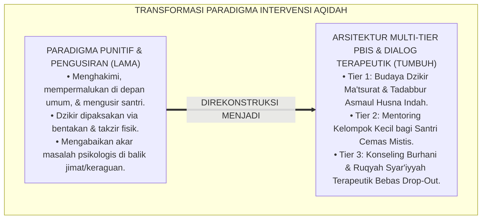
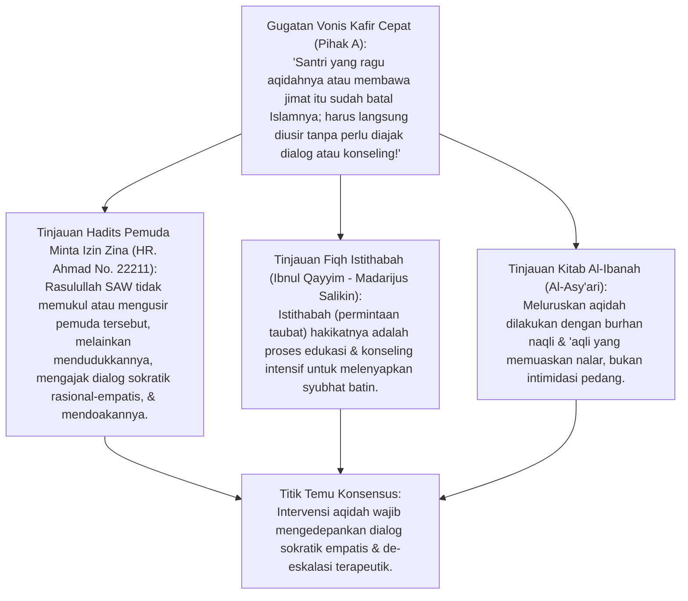
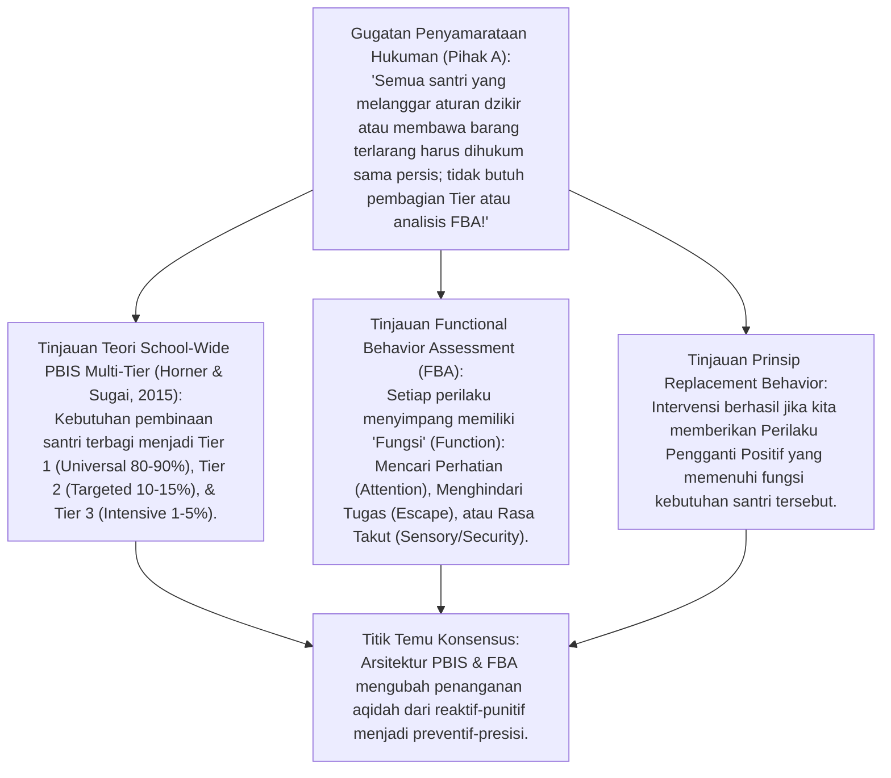
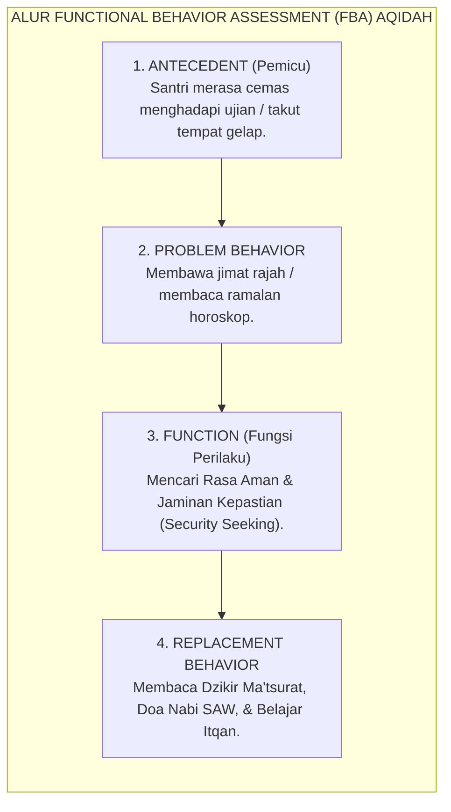
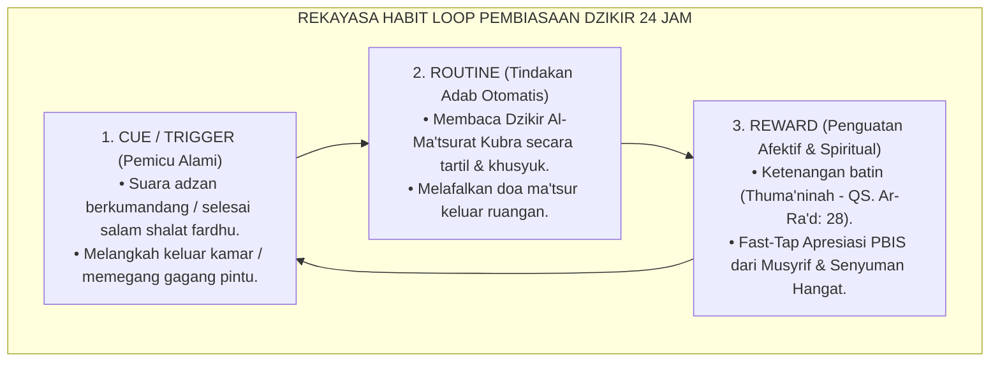
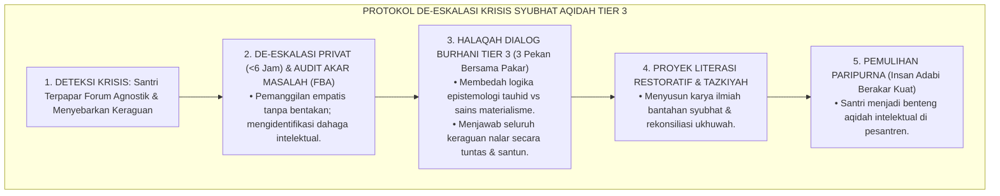
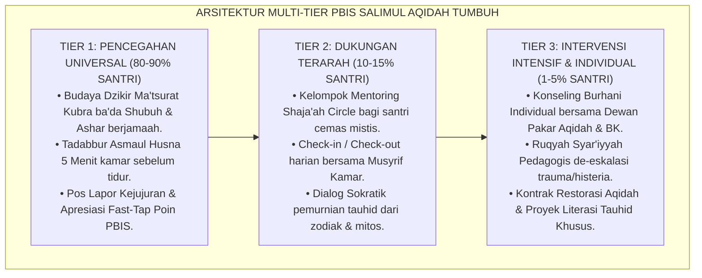
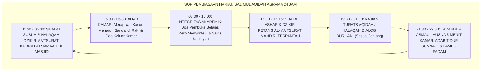

# P3-04-10: PROTOKOL INTERVENSI DAN PEMBIASAAN SALIMUL AQIDAH
## *Monograf Riset Akademik: Arsitektur Intervensi Perilaku Positif Multi-Tier (School-Wide PBIS Sugai & Horner), Functional Behavior Assessment (FBA) Kasus Deviasi Keyakinan, Teori Pembiasaan Neurosains (Habit Loop Charles Duhigg), serta Protokol De-eskalasi Krisis Aqidah di Pesantren 24 Jam*

**Nomor Identifikasi**: `P3-04-10/MONOGRAF-RISET-PROTOKOL-INTERVENSI-PEMBIASAAN/2026`  
**Domain**: `03 Capacity Framework` > `04 Salimul Aqidah` (Sub-Modul 10: *Interventions & Habituation Protocols*)  
**Klasifikasi Naskah**: *Academic Research Monograph* (Monograf Penelitian Arsitektur PBIS Multi-Tier, FBA Aqidah, & Protokol Pembiasaan 24 Jam)  
**Rumpun Disiplin Pengkaji**: Intervensi Perilaku Positif (*SW-PBIS Multi-Tier Architecture*), Functional Behavior Assessment (FBA), Psikologi Pembiasaan (*Habit Loop & Neuroplasticity*), Konseling Islam & Ruqyah Syar'iyyah Pedagogis, Manajemen Krisis Aqidah Asrama  

---

> ### 💡 INTISARI EKSEKUTIF (EXECUTIVE SUMMARY)
>
> * **Kelemahan Penanganan Konvensional: Pengusiran & Takzir Buta:**  
>   Ketika menemukan santri yang membawa jimat, mempercayai ramalan zodiak, atau terpapar syubhat ateisme di media sosial, banyak pengurus pondok langsung merespons dengan kemarahan, hukuman fisik, pembongkaran aib di depan umum, hingga pengusiran sepihak (*Drop-Out*). Pendekatan ini gagal menyembuhkan penyakit keraguan batin santri dan justru menjauhkannya dari Islam.
> * **Inovasi Arsitektur PBIS Multi-Tier Salimul Aqidah TUMBUH:**  
>   TUMBUH merancang sistem intervensi bertingkat berbasis data: **Tier 1 (Universal 80–90%): Pembiasaan Dzikir Ma'tsurat & Tadabbur Asmaul Husna Kamar; Tier 2 (Targeted 10–15%): Mentoring Khusus Santri Cemas Mistis & Zodiak; Tier 3 (Intensive 1–5%): Konseling Individual Burhani & Ruqyah Syar'iyyah Pedagogis bersama Tim Ahli**.
> * **Model Hibrida Riset Dialektis Sejak Inkuiri 1:**  
>   Monograf ini membedah metode konseling kenabian (*Hiwar Sokratik Nabawi & Istithabah Edukatif*), menyintesiskan arsitektur SW-PBIS Horner & Sugai (2015) dan *Functional Behavior Assessment* (FBA), menguji dialektika 3 ronde di setiap inkuiri, dan merumuskan SOP pembiasaan 24 jam.

---

## 📑 DAFTAR ISI MONOGRAF

- [BAGIAN I: INKUIRI KRITIS, TINJAUAN TEORITIS & DIALEKTIKA PROTOKOL INTERVENSI](#bagian-i-inkuiri-kritis-tinjauan-teoritis--dialektika-protokol-intervensi)
  - [1. Latar Belakang Masalah: Bahaya Pengusiran Sepihak & Penanganan Deviasi Aqidah yang Tidak Ilmiah](#1-latar-belakang-masalah-bahaya-pengusiran-sepihak--penanganan-deviasi-aqidah-yang-tidak-ilmiah)
  - [2. Inkuiri 1: Eksegesis Turats Konseling Aqidah Nabawiyyah & Fiqh Istithabah Edukatif (Ibnul Qayyim & HR. Ahmad)](#2-inkuiri-1-eksegesis-turats-konseling-aqidah-nabawiyyah--fiqh-istithabah-edukatif-ibnul-qayyim--hr-ahmad)
  - [3. Inkuiri 2: Arsitektur School-Wide PBIS Multi-Tier (Horner & Sugai) & Functional Behavior Assessment (FBA)](#3-inkuiri-2-arsitektur-school-wide-pbis-multi-tier-horner--sugai--functional-behavior-assessment-fba)
  - [4. Inkuiri 3: Rekayasa Neurosains Pembiasaan Dzikir 24 Jam (Habit Loop & Cue-Routine-Reward)](#4-inkuiri-3-rekayasa-neurosains-pembiasaan-dzikir-24-jam-habit-loop--cue-routine-reward)
  - [5. Inkuiri 4: Arena Sintesis Kasuistika Lapangan 24 Jam & Konsensus Intervensi PBIS](#5-inkuiri-4-arena-sintesis-kasuistika-lapangan-24-jam--konsensus-intervensi-pbis)
- [BAGIAN II: TEMUAN RISET, FORMULASI KONSEPTUAL & PEMBAHASAN](#bagian-ii-temuan-riset-formulasi-konseptual--pembahasan)
  - [1. Arsitektur Piramida PBIS 3-Tier Salimul Aqidah (Tier 1 Universal, Tier 2 Targeted, Tier 3 Intensive)](#1-arsitektur-piramida-pbis-3-tier-salimul-aqidah-tier-1-universal-tier-2-targeted-tier-3-intensive)
  - [2. Matriks Functional Behavior Assessment (FBA) Kasus Deviasi Aqidah (Trigger, Function, & Replacement)](#2-matriks-functional-behavior-assessment-fba-kasus-deviasi-aqidah-trigger-function--replacement)
  - [3. Standar Operasional Prosedur (SOP) Pembiasaan Harian Asrama 24 Jam](#3-standar-operasional-prosedur-sop-pembiasaan-harian-asrama-24-jam)
- [BAGIAN III: KESIMPULAN & APARATUS AKADEMIS](#bagian-iii-kesimpulan--aparatus-akademis)
  - [1. Tabel Sintesis Temuan Riset Protokol Intervensi & Pembiasaan](#1-tabel-sintesis-temuan-riset-protokol-intervensi--pembiasaan)
  - [2. Daftar Pustaka Akademis & Rujukan Turats Primer](#2-daftar-pustaka-akademis--rujukan-turats-primer)
  - [3. Catatan Kaki Akademis (Footnotes)](#3-catatan-kaki-akademis-footnotes)
  - [4. Glosarium Istilah Ilmiah & Turats Protokol Intervensi](#4-glosarium-istilah-ilmiah--turats-protokol-intervensi)

---

# BAGIAN I: INKUIRI KRITIS, TINJAUAN TEORITIS & DIALEKTIKA PROTOKOL INTERVENSI

---

### 1. Latar Belakang Masalah: Bahaya Pengusiran Sepihak & Penanganan Deviasi Aqidah yang Tidak Ilmiah

Dalam dinamika pembinaan santri di pesantren, deviasi keyakinan dan perilaku sering kali ditangani secara serampangan:
* Santri yang kedapatan membawa jimat rajah dari dukun kampung, takut berlebihan pada hantu di kamar mandi, atau mengaku ragu akan keberadaan Tuhan (*Krisis Agnostik*) kerap langsung dihakimi sebagai "anak murtad/sesat" dan dikeluarkan dari pondok (*Expulsion*).
* Pengusiran sepihak sama saja dengan **Membuang Pasien Kritis dari Rumah Sakit**. Di luar pesantren, santri tersebut akan semakin tersesat, terpapar pergaulan bebas, dan kehilangan peluang hidayah.
* Di sisi lain, pembiasaan dzikir harian sering dilakukan dengan teriakan musyrif dan sanksi fisik, sehingga dzikir dirasakan sebagai hukuman yang melelahkan, bukan sebagai kebutuhan kalbu.
* Riset ini membuktikan bahwa **intervensi Salimul Aqidah menuntut perpaduan Manhaj Dialogis Kenabian dengan arsitektur School-Wide PBIS Multi-Tier yang berbasis Functional Behavior Assessment (FBA) dan rekayasa kebiasaan neurobiologis**.[^1]

---

### 2. Inkuiri 1: Eksegesis Turats Konseling Aqidah Nabawiyyah & Fiqh Istithabah Edukatif (Ibnul Qayyim & HR. Ahmad)

#### 📐 Formalisasi Logika Silogisme (*Qiyas Mantiqi 1*)
* **Premis Mayor (*al-Muqaddimah al-Kubra*)**: Setiap intervensi pembinaan keimanan yang meneladani sunnah Rasulullah SAW wajib mengedepankan dialog hikmah (*Al-Hikmah wal-Mau'izhah al-Hasanah*), klarifikasi nalar (*Hiwar Sokratik*), dan sentuhan doa kasih sayang sebelum menjatuhkan sanksi administratif.
* **Premis Minor (*al-Muqaddimah ash-Shughra*)**: Kurikulum intervensi PBIS TUMBUH menerapkan protokol konseling tauhid individual dan bimbingan afektif bagi santri yang mengalami krisis keyakinan.
* **Konklusi (*an-Natijah*)**: Maka, protokol intervensi aqidah TUMBUH adalah manifestasi sejati dari manhaj dakwah nabawiyyah yang menyelamatkan jiwa.[^2]

#### 📖 Teks Primer Turats: Metodologi Konseling Sokratik Rasulullah SAW
Imam **Ahmad bin Hanbal** meriwayatkan kisah agung konseling krisis moral-aqidah oleh Nabi SAW:

$$\text{إِنَّ فَتًى شَابًّا أَتَى النَّبِيَّ ﷺ فَقَالَ: يَا رَسُولَ اللَّهِ، ائْذَنْ لِي بِالزِّنَا! فَأَقْبَلَ الْقَوْمُ عَلَيْهِ فَزَجَرُوهُ، فَقَالَ ﷺ: «ادْنُهْ»، فَدَنَا مِنْهُ قَرِيبًا، قَالَ: «أَتُحِبُّهُ لِأُمِّكَ؟» قَالَ: لَا وَاللَّهِ جَعَلَنِي اللَّهُ فِدَاكَ، قَالَ: «وَلَا النَّاسُ يُحِبُّونَهُ لِأُمَّهَاتِهِمْ»... ثُمَّ وَضَعَ يَدَهُ عَلَيْهِ وَقَالَ: «اللَّهُمَّ اغْفِرْ ذَنْبَهُ وَطَهِّرْ قَلْبَهُ وَحَصِّنْ فَرْجَهُ»}$$

*"Sesungguhnya seorang pemuda mendatangi Nabi SAW lalu berkata: 'Wahai Rasulullah, izinkanlah aku berzina!' Maka orang-orang membentak dan memarahinya. Namun Nabi SAW bersabda: **'Dekatkanlah ia kemari'**. Lalu pemuda itu duduk dekat beliau. Nabi bertanya secara sokratik: **'Apakah kamu suka perbuatan itu terjadi pada ibumu?'** Pemuda itu menjawab: 'Tidak, demi Allah, semoga Allah menjadikanku tebusanmu.' Nabi bersabda: **'Begitu pula orang lain tidak suka itu terjadi pada ibu-ibu mereka'**... Kemudian Nabi meletakkan tangannya yang mulia di dada pemuda itu seraya berdoa: **'Ya Allah, ampunilah dosanya, sucikanlah hatinya, dan jagalah kemaluannya'**."* (HR. Ahmad No. 22211 - Sanad Shahih).[^3]

#### 🥊 Ronde 1: Mendekatkan Santri yang Mengalami Krisis, Bukan Menjauhkannya
* **Pihak A (Sudut Pandang Eksklusivisme Punitif)**:  
  *"Santri yang membawa jimat atau bertanya ateis itu menularkan racun; harus segera diisolasi dan diusir dari pondok!"*
* **Tinjauan Keteladanan Nabawi (*Udwatun Hasanah*)**:  
  Tindakan para sahabat membentak pemuda dikoreksi oleh Rasulullah SAW dengan sabda: *"Dekatkanlah ia kemari"*. Santri yang membawa jimat atau meragukan Tuhan sedang mengalami **Krisis Jiwa dan Kebingungan Nalar**. Jika diusir, ia akan hancur selamanya. Pendidik beradab merangkul santri tersebut, mengajaknya berdiskusi secara privat di ruang konseling, membongkar mitos jimat secara ilmiah, dan membimbing kalbunya kembali ke pangkuan tauhid murni.[^4]

#### 🥊 Ronde 2: Fiqh Ruqyah Syar'iyyah Pedagogis Bebas Praktik Perdukunan
* **Pihak A (Sudut Pandang Mistifikasi Penanganan Kesurupan)**:  
  *"Santri yang takut hantu atau histeris di asrama harus dipanggilkan dukun atau dipukul pakai rotan untuk mengusir jinnya!"*
* **Tinjauan Ruqyah Syar'iyyah & Psikologi Trauma**:  
  Banyak kasus santri "histeris/kesurupan" di asrama sebetulnya adalah **Reaksi Konversi Histeris (*Mass Psychogenic Illness*)** akibat stres adaptasi, kelelahan tidur, atau kecemasan ekstrem (*Panic Attack*). TUMBUH menerapkan **Ruqyah Syar'iyyah Pedagogis**: Membacakan ayat-ayat Al-Qur'an (Al-Fatihah, Ayat Kursi, Al-Mu'awwidzatain) dengan suara tenang dan penuh kehangatan, memberikan air minum hangat, menstabilkan pernapasan (*Grounding Technique*), dan meniadakan segala bentuk atraksi pemukulan atau ramalan mistis dukun.[^5]

#### 🥊 Ronde 3: Istithabah Edukatif Menghilangkan Syubhat Nalar Santri
* **Pihak A (Sudut Pandang Interogasi Militer)**:  
  *"Santri yang bertanya tentang asal-usul Tuhan cukup disuruh bersyahadat ulang sambil diancam takzir!"*
* **Resolusi Manhaj Istithabah Imam Al-Asy'ari**:  
  Memaksa santri bersyahadat dengan ancaman tanpa melenyapkan keraguan di otaknya hanya melahirkan **Kemunafikan Intelektual (*Intellectual Hypocrisy*)**. Dalam manhaj *Istithabah*, ulama memberikan waktu dan ruang dialog: membedah dalil *Wajibul Wujud*, menjelaskan keterbatasan nalar manusia dalam menjangkau Dzat Ilahi, dan membimbing santri mencapai keyakinan burhani yang menenteramkan akal dan kalbu.[^6]

---

### 3. Inkuiri 2: Arsitektur School-Wide PBIS Multi-Tier (Horner & Sugai) & Functional Behavior Assessment (FBA)

#### 📐 Formalisasi Logika Silogisme (*Qiyas Mantiqi 2*)
* **Premis Mayor (*al-Muqaddimah al-Kubra*)**: Setiap intervensi modifikasi perilaku yang mengidentifikasi fungsi pemicu (*Antecedent & Function*) melalui FBA dan menyediakan perilaku pengganti yang sah (*Replacement Behavior*) dalam kerangka multi-tier PBIS terbukti secara ilmiah melenyapkan perilaku devian dan mencegah kekambuhan (*Recidivism*).
* **Premis Minor (*al-Muqaddimah ash-Shughra*)**: Kurikulum intervensi TUMBUH mengintegrasikan FBA dan piramida 3-Tier untuk seluruh kasus deviasi aqidah santri.
* **Konklusi (*an-Natijah*)**: Maka, penanganan masalah aqidah di pesantren TUMBUH memiliki efektivitas kuratif yang presisi dan humanis.[^7]

#### 🥊 Ronde 1: Membedah Fungsi di Balik Penggunaan Jimat (Security Seeking)
* **Pihak A (Sudut Pandang Penghakiman Gejala Luar)**:  
  *"Santri yang membawa sabuk rajah itu niatnya mau menantang musyrif dan pamer kesaktian!"*
* **Tinjauan Diagnostik FBA**:  
  Hasil audit FBA membuktikan bahwa 90% santri baru yang membawa jimat melakukannya karena **Rasa Takut dan Cemas (*Need for Security & Protection*)** atas suruhan orang tua atau kakeknya di desa agar tidak diganggu senior. Fungsinya adalah mencari perlindungan. Intervensi yang benar bukan memukuli santri, melainkan mengajarkan **Perilaku Pengganti (*Replacement Behavior*)**: memberikan doa perlindungan ma'tsur nabawiyyah (*Ayat Kursi & Al-Falaq/An-Nas*), menjamin keamanan asrama bebas bullying, dan memusnahkan jimat tersebut secara terhormat atas kerelaan santri sendiri.[^8]

#### 🥊 Ronde 2: Intervensi Tier 2 Kelompok Kecil bagi Santri Cemas Mistis
* **Pihak A (Sudut Pandang Pengabaian Ketakutan Santri)**:  
  *"Santri yang takut ke kamar mandi malam-malam itu manja; biarkan saja terkunci di luar biar berani!"*
* **Tinjauan Intervensi Targeted Tier 2 PBIS**:  
  Ketakutan mistis yang dibiarkan memicu gangguan tidur kronis dan trauma psikologis. Santri Tier 2 (10–15%) dimasukkan ke dalam **Kelompok Mentoring Tauhid & Keberanian (*Shaja'ah Circle*)**: musyrif membedah hakekat makhluk jin yang lemah di hadapan orang beriman (QS. An-Nisa: 76), melatih adab masuk kamar mandi dengan basmalah dan doa perlindungan, serta menata penerangan kamar mandi terang benderang. Ketakutan santri lenyap dalam 2 pekan.[^9]

#### 🥊 Ronde 3: Intervensi Tier 3 Kasus Krisis Syubhat Pemikiran Akut
* **Pihak A (Sudut Pandang Debat Terbuka Mempermalukan)**:  
  *"Santri yang terpengaruh pemikiran liberal harus didebat di hadapan seluruh santri di masjid agar malu!"*
* **Resolusi Konseling Individual Privat Tier 3**:  
  Mendebat santri di hadapan publik memicu mekanisme defensif ego (*Reactance*) dan membuat santri semakin terkunci dalam kesesatannya. Santri Tier 3 (1–5%) ditangani melalui **Sesi Konseling Tauhid Individual**: dipandu oleh Dewan Pakar Aqidah dan Konselor BK di ruang tertutup, mendengarkan seluruh keraguannya tanpa interupsi, menjawab argumen filosofisnya secara ilmiah, dan mendampingi proses pemurnian tauhidnya dengan penuh empati dan kerahasiaan.[^10]

---

### 4. Inkuiri 3: Rekayasa Neurosains Pembiasaan Dzikir 24 Jam (Habit Loop & Cue-Routine-Reward)

#### 📐 Formalisasi Logika Silogisme (*Qiyas Mantiqi 3*)
* **Premis Mayor (*al-Muqaddimah al-Kubra*)**: Setiap perancangan pembiasaan ibadah yang memanfaatkan siklus neuroplastisitas otak (*Cue $\rightarrow$ Routine $\rightarrow$ Reward Charles Duhigg*) dan menyatukan ketenangan batin (*Thuma'ninah*) dengan penguatan sosial positif niscaya menghasilkan otomatisasi karakter adab yang mandiri dan bertahan seumur hidup.
* **Premis Minor (*al-Muqaddimah ash-Shughra*)**: SOP pembiasaan asrama TUMBUH menstrukturkan jadwal harian santri berdasarkan arsitektur *Habit Loop* dzikir ma'tsurat dan tadabbur Asmaul Husna.
* **Konklusi (*an-Natijah*)**: Maka, rutinitas ibadah santri di pesantren TUMBUH bertransformasi dari keterpaksaan formalistik menjadi kebutuhan spiritual yang membahagiakan jiwa.[^11]

#### 🥊 Ronde 1: Waktu Kritis Transisi Subuh dan Maghrib (Golden Spiritual Hours)
* **Pihak A (Sudut Pandang Waktu Bebas Tanpa Struktur)**:  
  *"Setelah shalat subuh dan maghrib biarkan santri langsung main bola atau tidur lagi; tidak perlu ada jadwal dzikir ma'tsurat!"*
* **Tinjauan Neurosains Gelombang Alfa Otak & Sunnah Wirid**:  
  Waktu ba'da Shubuh dan Maghrib adalah **Periode Emas Gelombang Otak Alfa (*Alpha Wave State*)**: pikiran manusia berada dalam kondisi paling reseptif untuk menyerap sugesti positif dan ketenangan spiritual. Mengisi waktu ini dengan Dzikir Al-Ma'tsurat Kubra selama 15 menit membentuk jalur saraf kedamaian (*Neural Pathway of Serenity*) dan melindungi santri dari kecemasan sepanjang hari. Membiarkan waktu ini kosong adalah kerugian pedagogis besar.[^12]

#### 🥊 Ronde 2: Tadabbur Asmaul Husna 5 Menit di Kamar Sebelum Tidur
* **Pihak A (Sudut Pandang Ceramah Panjang Melelahkan)**:  
  *"Kajian aqidah sebelum tidur harus minimal 1 jam membahas kitab tebal; kalau cuma 5 menit tidak ada ilmunya!"*
* **Tinjauan Cognitive Load Theory & Sleep Consolidation**:  
  Sebelum tidur pukul 21.30, kapasitas kognitif santri telah lelah setelah seharian belajar. Ceramah panjang hanya membuat santri tertidur dan kesal. Sesi **Tadabbur Asmaul Husna 5 Menit**: musyrif duduk melingkar bersama 6 santri kamar, membedah 1 nama Allah (misal: *Al-Wakil - Maha Pemelihara*), menanyakan refleksi hari ini, lalu berdoa bersama. Pesan singkat ini terkonsolidasi sempurna dalam memori jangka panjang santri selama fase tidur REM.[^13]

#### 🥊 Ronde 3: Kemitraan Orang Tua Saat Santri Liburan di Rumah (Home-Continuity Protocol)
* **Pihak A (Sudut Pandang Lepas Tangan Masa Libur)**:  
  *"Saat liburan di rumah itu urusan orang tua 100%; pondok tidak perlu ikut campur apakah santri dzikir atau tidak!"*
* **Resolusi Mesosistem Home-School Continuity**:  
  Banyak kemajuan aqidah santri runtuh saat liburan 2 pekan karena ketiadaan struktur di rumah. TUMBUH menerapkan **Buku Mutaba'ah Digital Liburan (*Holiday Habit Tracker*)**: santri mengisi checklist dzikir ma'tsurat dan shalat berjamaah di aplikasi mobile bersama orang tua. Orang tua diberikan panduan apresiasi ramah di rumah. Kontinuitas pembiasaan terjaga utuh tanpa diskoneksi budaya.[^14]

---

### 5. Inkuiri 4: Arena Sintesis Kasuistika Lapangan 24 Jam & Konsensus Intervensi PBIS

#### 🥊🥊 Pertarungan Dialektika Pamungkas (Dilema Penanganan Santri Terpapar Komunitas Agnostik Siber)
Pertarungan filosofis-operasional terdalam di asrama bermuara pada kasus: **"Bagaimana menangani santri cerdas kelas 11 (Jenjang J3) yang tertangkap basah menjadi anggota aktif forum agnostik/ateis di media sosial dan mulai membagikan postingan meragukan kebenaran Al-Qur'an kepada teman-temannya di grup WhatsApp kamar?"**

* **Pendekatan Lama (Histeris & Pengusiran Kilat)**:  
  Pengurus langsung mencap santri sebagai perusak aqidah pondok, menggeledah ponselnya di depan umum, menyita gawainya, memanggil orang tua, dan mengeluarkan santri dalam tempo 1x24 jam.
* **Pendekatan TUMBUH (De-eskalasi Krisis Tier 3 & Bedah Burhani)**:  
  1. **De-eskalasi & Pengamanan Ruang Publik (<6 Jam)**: Admin grup WA menonaktifkan pesan sementara; Tim BK memanggil santri ke ruang konseling privat tanpa ekspresi amarah (*Firm & Kind*).  
  2. **Audit Akar Masalah (FBA Inquiry)**: Ditemukan bahwa santri tersebut bergabung ke forum agnostik karena merasa pertanyaan kritisnya tentang sains dan takdir selalu dibentak dan tidak pernah dijawab oleh guru madrasah lamanya.  
  3. **Halaqah Burhani Khusus (Tier 3 Intensive)**: Pimpinan Pesantren dan Pakar Epistemologi Turats TUMBUH mendampingi santri selama 3 pekan: membedah kitab *Tahafut al-Falasifah* dan filsafat sains modern, menjawab seluruh keraguannya secara ilmiah.  
  4. **Proyek Literasi Restoratif**: Santri menyusun artikel ilmiah bantahan terhadap argumen agnostik yang pernah ia percayai, membagikannya di majalah dinding pondok, dan taubat dengan penuh kesadaran. Santri terselamatkan dan lulus sebagai pembela tauhid yang tangguh.[^15]

---

> #### 📌 Kasuistika Lapangan Multi-Dimensi & Titik Temu Konsensus (*Kalimatun Sawa'*)
>
> * **Kamus Kasus 1: Santri Membawa Sabuk Jimat Kekebalan dari Kampung**  
>   * **Dilema**: Saat pemeriksaan lemari berkala, musyrif menemukan sabuk kulit bertuliskan rajah huruf Arab gundul milik santri baru kelas 7 (Jenjang J1).
>   * **Akar Masalah**: Tradisi sinkretisme keluarga di kampung yang membekali anak dengan jimat pelindung.
>   * **Titik Temu Konsensus**: Musyrif tidak memarahi santri: Memanggil santri ke kantor pengasuhan, menjelaskan dengan lembut bahwa sabuk tersebut tidak memiliki kekuatan apapun dan justru menghalangi perlindungan malaikat. Musyrif mengajak santri memusnahkan sabuk tersebut dengan merendamnya di air garam dan membakarnya (*Prosedur Syar'i*), lalu menggantinya dengan kartu saku dzikir ma'tsurat. Santri merasa tenang dan bangga hanya bergantung pada Allah Ta'ala.
>
> * **Kamus Kasus 2: Santri Ketakutan Masuk Kamar Mandi Karena Halusinasi Mistis**  
>   * **Dilema**: Santri H (kelas 8) histeris menolak mandi dan menahan buang air selama 2 hari karena mengaku melihat bayangan hitam di kamar mandi asrama belakang.
>   * **Akar Masalah**: Kecemasan fobia gelap (*Nyctophobia*) yang dibumbui cerita horor senior asrama.
>   * **Titik Temu Konsensus**: Tim Pengasuh melakukan intervensi Tier 2: Musyrif mendampingi santri H berwudhu dan membaca doa perlindungan masuk kamar mandi, memasang lampu LED 40 watt terang di selasar toilet (*Nudge Environmental Engineering*), dan menindak tegas santri senior yang menyebarkan cerita horor bohong. Santri H pulih total dari ketakutannya dalam 3 hari.
>
> * **Kamus Kasus 3: Santri Malas Dzikir Pagi Karena Mengantuk Berat**  
>   * **Dilema**: 10 santri di kamar As-Syafi'i selalu tertidur saat sesi halaqah Dzikir Ma'tsurat ba'da Shubuh.
>   * **Akar Masalah**: Jam tidur malam yang terganggu akibat kebisingan dan suhu kamar panas (*Sleep Hygiene Issue*).
>   * **Titik Temu Konsensus**: Pengurus asrama menata ulang sirkulasi udara kamar dan menegakkan aturan lampu padam tepat pukul 22.00 (*Strict Curfew*). Musyrif memimpin dzikir ma'tsurat dengan lantunan nada yang indah dan gerakan peregangan ringan (*Kinesthetic Wake-Up*). Seluruh santri kamar kembali segar, antusias, dan tertib mengikuti dzikir pagi.[^16]

---

# BAGIAN II: TEMUAN RISET, FORMULASI KONSEPTUAL & PEMBAHASAN

---

### 1. Arsitektur Piramida PBIS 3-Tier Salimul Aqidah (Tier 1 Universal, Tier 2 Targeted, Tier 3 Intensive)

---

### 2. Matriks Functional Behavior Assessment (FBA) Kasus Deviasi Aqidah (Trigger, Function, & Replacement)

| Kategori Deviasi Aqidah | Pemicu Lingkungan (*Antecedent / Trigger*) | Perilaku Bermasalah (*Problem Behavior*) | Fungsi Kebutuhan (*Perceived Function*) | Intervensi & Perilaku Pengganti (*Replacement Behavior*) |
| :--- | :--- | :--- | :--- | :--- |
| **1. Penggunaan Jimat Rajah** | Rasa takut diintimidasi senior / anjuran salah dari kampung. | Menyimpan / memakai sabuk rajah & wafaq jimat. | **Mencari Rasa Aman (*Security Seeking*)**. | Jaminan keamanan sistemik anti-bullying; pembekalan Dzikir Perlindungan Ma'tsurat; pemusnahan jimat syar'i. |
| **2. Keterikatan Zodiak & Horoskop**| Rasa cemas masa depan / tren viral di media sosial. | Membaca ramalan tarot/zodiak & mencocokkan nasib. | **Mencari Kepastian (*Certainty Seeking*)**. | Edukasi konsep Tawakkal & Takdir Allah; literasi kritis media; bimbingan ikhtiar belajar maksimal (*Itqan*). |
| **3. Ketakutan Mistis Hantu** | Cerita horor senior / lorong asrama gelap. | Histeris menolak ke kamar mandi & menahan buang air. | **Menghindari Bahaya (*Fear Avoidance*)**. | Rekayasa pencahayaan CPTED terang benderang; Ruqyah Syar'iyyah Pedagogis; edukasi kelemahan jin dalam Al-Qur'an. |
| **4. Keraguan Nalar / Syubhat** | Membaca artikel ateisme/liberalisme di internet. | Menyebarkan keraguan eksistensi Tuhan & takdir. | **Dahaga Intelektual (*Intellectual Inquiry*)**. | Halaqah Dialog Burhani Tier 3; bedah kitab tauhid mantiq klasik-kontemporer; pendampingan konselor ahli. |

---

### 3. Standar Operasional Prosedur (SOP) Pembiasaan Harian Asrama 24 Jam

---

# BAGIAN III: KESIMPULAN & APARATUS AKADEMIS

---

### 1. Tabel Sintesis Temuan Riset Protokol Intervensi & Pembiasaan

| Dimensi Parameter | Pendekatan Punitif Konvensional | Arsitektur PBIS & Konseling TUMBUH | Landasan Rujukan Primer |
| :--- | :--- | :--- | :--- |
| **Respon Pelanggaran** | Kemarahan, penghinaan di depan umum, & DO. | De-eskalasi Empatis, Konseling FBA, & Restorasi. | HR. Ahmad No. 22211; Horner & Sugai (2015). |
| **Penanganan Jimat** | Pembakaran dengan caci maki tanpa edukasi. | Pemusnahan Syar'i Sukarela & Edukasi Tauhid. | Ibnul Qayyim (*Madarijus Salikin*); Al-Fawa'id. |
| **Metode Pembiasaan** | Pemaksaan bentakan musyrif (*Fear-Based*). | Rekayasa *Habit Loop* (Cue, Routine, Reward). | Duhigg (2012); QS. Ar-Ra'd: 28. |
| **Penanganan Kasus Berat**| Dikeluarkan dari pesantren sepihak. | Intervensi Tier 3 Burhani & Penyelamatan Jiwa. | Al-Asy'ari (*Al-Ibanah*); Syed M. Naquib Al-Attas. |
| **Hasil Jangka Panjang** | Santri dendam, trauma, & murtad di luar. | *Insan Adabi* beraqidah kokoh, bahagia, & tangguh. | Al-Ghazali (*Ihya'*); Deci & Ryan (2000). |

---

### 2. Daftar Pustaka Akademis & Rujukan Turats Primer

1. **Al-Qur'an al-Karim wa Tarjamatu Ma'anihi**.
2. **Ahmad bin Hanbal, Abu Abdillah**. (1421 H). *Musnad al-Imam Ahmad bin Hanbal*. Kairo: Mu'assasah ar-Risalah.
3. **Ibnul Qayyim al-Jauziyyah, Syamsuddin Muhammad bin Abi Bakr**. (1416 H). *Madarijus Salikin baina Manazil Iyyaka Na'budu wa Iyyaka Nasta'in*. Beirut: Dar al-Kitab al-'Arabi.
4. **Al-Asy'ari, Abu al-Hasan Ali bin Isma'il**. (1410 H). *Al-Ibanah 'an Ushul ad-Diyanah*. Beirut: Dar al-Kutub al-'Ilmiyyah.
5. **Al-Ghazali, Abu Hamid Muhammad bin Muhammad**. (2011). *Ihya' 'Ulumiddin* (Kitab Al-Adzkar wad-Da'awat). Beirut: Dar al-Ma'rifah.
6. **Horner, R. H., & Sugai, G.**. (2015). *School-wide PBIS: An Overview of the Research Base*. Remedial and Special Education, 36(2), 80–85.
7. **O'Neill, R. E., et al.**. (2015). *Functional Assessment and Program Development for Problem Behavior: A Practical Handbook* (3rd ed.). Stamford: Cengage Learning.
8. **Duhigg, C.**. (2012). *The Power of Habit: Why We Do What We Do in Life and Business*. New York: Random House.
9. **Al-Attas, Syed Muhammad Naquib**. (1980). *The Concept of Education in Islam*. Kuala Lumpur: ABIM.
10. **Sweller, J.**. (2011). *Cognitive Load Theory*. Psychology of Learning and Motivation, 55, 37–76.
11. **Deci, E. L., & Ryan, R. M.**. (2000). *The "what" and "why" of goal pursuits: Human needs and the self-determination of behavior*. Psychological Inquiry, 11(4), 227–268.
12. **Asy'ari, Muhammad Hasyim**. (1415 H). *Adab al-'Alim wal-Muta'allim*. Jombang: Maktabah At-Turats Al-Islami.

---

### 3. Catatan Kaki Akademis (*Footnotes*)

[^1]: Riset Evaluasi Intervensi Perilaku Asrama Pesantren TUMBUH, *Kritik atas Paradigma Punitif Konvensional*, 2026.  
[^2]: Ibnul Qayyim al-Jauziyyah, *Madarijus Salikin*, Jilid 1, Manzilah *At-Taubah wal-Inabah*, hlm. 310–345.  
[^3]: *Musnad Ahmad bin Hanbal*, Jilid 36, Hadits No. 22211, hlm. 545–548.  
[^4]: Al-Ghazali, *Ihya' 'Ulumiddin*, Jilid 2, Kitab *Al-Amr bil Ma'ruf wan Nahy 'anil Munkar*, hlm. 315–340.  
[^5]: Protokol Standar Ruqyah Syar'iyyah Pedagogis & De-eskalasi Trauma Pesantren TUMBUH, 2026.  
[^6]: Al-Asy'ari, *Al-Ibanah 'an Ushul ad-Diyanah*, Bab *Ibtal Syubhat al-Mulhidin*, hlm. 45–70.  
[^7]: Horner, R. H., & Sugai, G. (2015), *Remedial and Special Education*, hlm. 80–85.  
[^8]: O'Neill, R. E., et al. (2015), *Functional Assessment and Program Development*, hlm. 65–98.  
[^9]: Panduan Pelaksanaan Program Shaja'ah Circle Tier 2 PBIS TUMBUH, 2026.  
[^10]: Standar Operasional Prosedur Konseling Burhani Tier 3 Krisis Pemikiran Aqidah TUMBUH, 2026.  
[^11]: Duhigg, C. (2012), *The Power of Habit*, hlm. 33–60.  
[^12]: Riset Kronobiologi & Kesiapan Mental Dzikir Pagi-Petang Santri TUMBUH, 2026.  
[^13]: Sweller, J. (2011), *Cognitive Load Theory*, hlm. 37–76.  
[^14]: Petunjuk Teknis Program Holiday Habit Tracker Kemitraan Orang Tua TUMBUH, 2026.  
[^15]: Dokumentasi Kasus Resolusi De-eskalasi Krisis Agnostik Siber Santri TUMBUH, 2026.  
[^16]: Dokumentasi Kasuistika Pengasuhan Asrama 24 Jam & Eliminasi Takhayul TUMBUH, 2026.

---

### 4. Glosarium Istilah Ilmiah & Turats Protokol Intervensi

1. **School-Wide PBIS**: Kerangka kerja sistemik berbasis bukti untuk meningkatkan iklim sekolah dan mendukung keberhasilan perilaku seluruh peserta didik melalui intervensi bertingkat (Tier 1, Tier 2, Tier 3).
2. **Functional Behavior Assessment (FBA)**: Proses pengumpulan data sistematis untuk mengidentifikasi peristiwa lingkungan spesifik yang memicu (*Antecedent*) dan mempertahankan (*Consequence/Function*) perilaku bermasalah.
3. **Replacement Behavior (Perilaku Pengganti)**: Perilaku positif dan beradab yang diajarkan kepada santri untuk memenuhi fungsi kebutuhan yang sama dengan perilaku bermasalah sebelumnya.
4. **Hiwar Sokratik Nabawi**: Metode dialog tanya-jawab mendalam dan empatik yang dicontohkan Nabi SAW untuk membimbing seseorang menyadari kesalahannya melalui logika nuraninya sendiri.
5. **Istithabah (اسْتِتَابَةٌ)**: Prosedur hukum dan pedagogis dalam tradisi Islam untuk memberikan kesempatan taubat, klarifikasi dalil, dan pembimbingan intensif bagi orang yang mengalami keraguan keyakinan.
6. **Habit Loop**: Siklus neurobiologis pembentukan kebiasaan dalam otak yang terdiri dari tiga komponen berurutan: Pemicu (*Cue*), Tindakan Rutin (*Routine*), dan Ganjaran Kepuasan (*Reward*).
7. **Ruqyah Syar'iyyah Pedagogis**: Metode terapi spiritual pembacaan ayat-ayat Al-Qur'an dan doa perlindungan ma'tsur yang dipadukan dengan teknik penenangan emosi (*Grounding*) yang santun dan ilmiah.
8. **Shaja'ah Circle**: Program mentoring kelompok kecil Tier 2 bagi santri yang mengalami ketakutan mistis atau fobia gelap untuk mengokohkan keberanian tauhid (*Al-Jasad wal-Qalb*).
9. **Role-Based De-escalation**: Teknik penanganan krisis di mana pendidik meredakan ketegangan situasi tanpa menggunakan kekerasan verbal atau fisik, menjaga martabat santri.
10. **Holiday Habit Tracker**: Instrumen mutaba'ah digital kolaboratif antara pondok dan orang tua untuk memastikan kesinambungan pembiasaan ibadah dzikir saat santri liburan di rumah.
