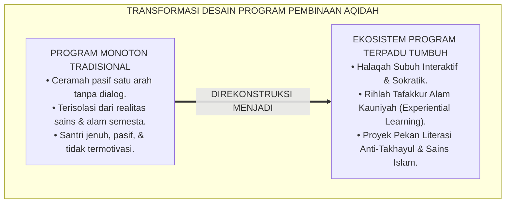
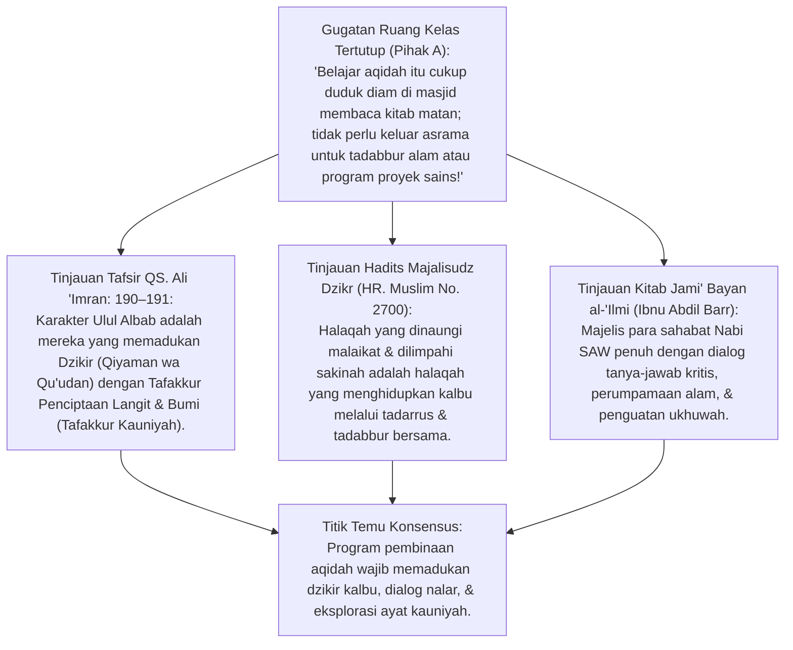
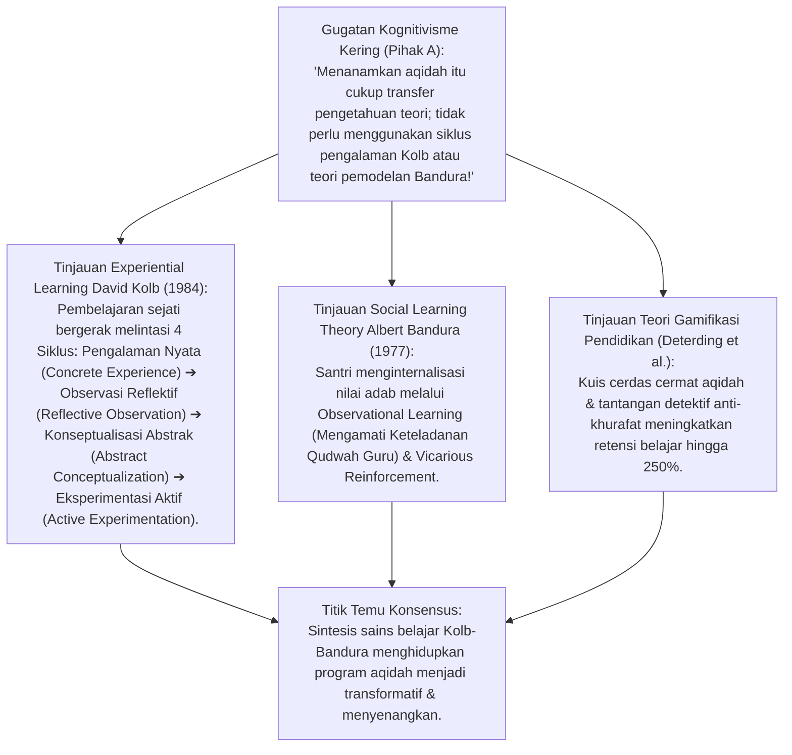
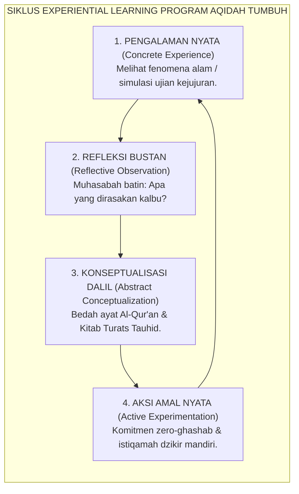
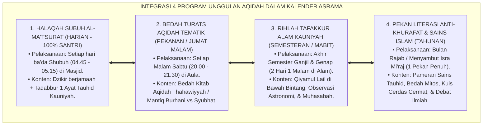
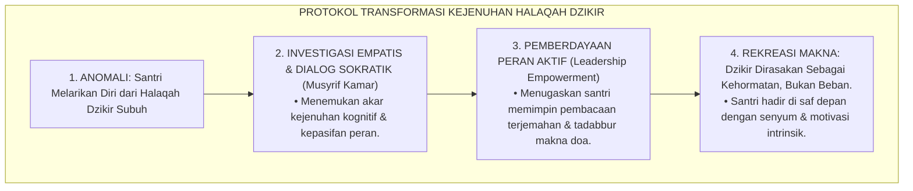
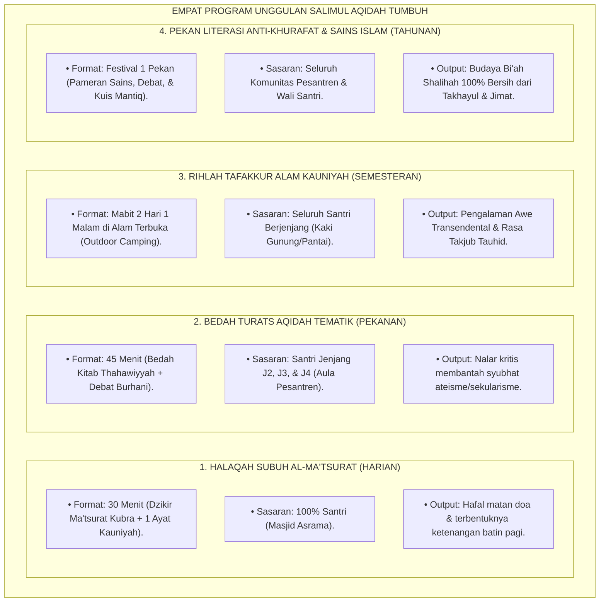
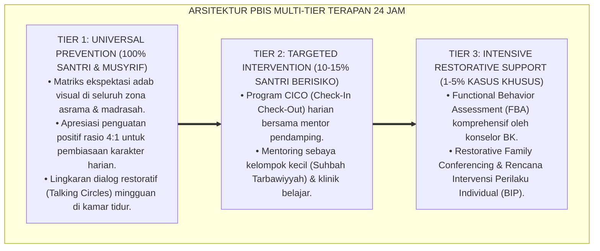

# P3-04-11: PROGRAM PEMBINAAN DAN HALAQAH SALIMUL AQIDAH
## *Monograf Riset Akademik: Desain Program Kurikuler & Kokurikuler, Teori Belajar Berbasis Pengalaman (Experiential Learning David Kolb), Pemodelan Sosial Albert Bandura, Manajemen Halaqah Transformatif, serta Arsitektur Proyek Penguatan Tauhid di Pesantren 24 Jam*

**Nomor Identifikasi**: `P3-04-11/MONOGRAF-RISET-PROGRAM-PEMBINAAN-HALAQAH/2026`  
**Domain**: `03 Capacity Framework` > `04 Salimul Aqidah` (Sub-Modul 11: *Programs & Halaqah Framework*)  
**Klasifikasi Naskah**: *Academic Research Monograph* (Monograf Penelitian Desain Program Karakter, Manajemen Halaqah Tematik, & Proyek Penguatan Tauhid)  
**Rumpun Disiplin Pengkaji**: Desain Program Pendidikan Karakter (*Character Education Design*), Pedagogi Halaqah Transformatif, *Experiential Learning Theory* David Kolb, Teori Pemodelan Sosial (*Bandura Social Modeling*), Manajemen Pembinaan Pesantren  

---

> ### 💡 INTISARI EKSEKUTIF (EXECUTIVE SUMMARY)
>
> * **Krisis Formalisme Halaqah Monoton yang Menjenuhkan Santri:**  
>   Banyak program pembinaan aqidah di pesantren terjebak dalam rutinitas ceramah monolog satu arah (*Passive Lecturing*) di mana ustadz membaca kitab tebal sementara santri mengantuk dan pasif. Program tidak menyentuh emosi, nalar kritis, atau pengalaman empiris santri dalam memecahkan masalah kehidupan nyata.
> * **Inovasi Empat Program Unggulan Salimul Aqidah TUMBUH:**  
>   TUMBUH merancang ekosistem program terpadu: **1. Halaqah Subuh Al-Ma'tsurat Interaktif (Harian), 2. Bedah Turats Aqidah Tematik Burhani (Mingguan), 3. Rihlah Tafakkur Alam Ayat Kauniyah (Semesteran), dan 4. Pekan Literasi Anti-Takhayul & Sains Islam (Tahunan)** berbasis *Experiential Learning* Kolb (1984).
> * **Pendekatan Riset Terpadu & Diskursus Ilmiah:**  
>   Monograf ini membedah tradisi *Majalisudz Dzikr* nabawiyyah (HR. Muslim No. 2700 & QS. Ali 'Imran: 190–191), menyintesiskan teori belajar pengalaman Kolb dan *Social Modeling* Bandura, menguji dialektika 3 ronde di setiap inkuiri, dan merumuskan panduan teknis operasional halaqah 24 jam.

---

## 📑 DAFTAR ISI MONOGRAF

- [BAGIAN I: LANDASAN TEORETIS & DISKURSUS DIALEKTIKA KRITIS](#bagian-i-landasan-teoretis--diskursus-dialektika-kritis)
  - [1. Latar Belakang Masalah: Formalisme Halaqah Monoton vs Pembinaan Berbasis Pengalaman Nyata](#1-latar-belakang-masalah-formalisme-halaqah-monoton-vs-pembinaan-berbasis-pengalaman-nyata)
  - [2. Eksegesis Turats Majalisudz Dzikr Nabawiyyah & Tafakkur Ayat Kauniyah (QS. Ali 'Imran: 190–191 & HR. Muslim)](#2eksegesis-turats-majalisudz-dzikr-nabawiyyah-tafakkur-ayat-kauniyah-qs-ali-imran-190191-hr-muslim)
  - [3. Experiential Learning Theory (David Kolb) & Social Modeling (Albert Bandura) dalam Desain Program Aqidah](#3experiential-learning-theory-david-kolb-social-modeling-albert-bandura-dalam-desain-program-aqidah)
  - [4. Translasi Empat Program Unggulan ke dalam Kalender Tahunan Asrama 24 Jam](#4translasi-empat-program-unggulan-ke-dalam-kalender-tahunan-asrama-24-jam)
  - [5. Arena Sintesis Kasuistika Lapangan 24 Jam & Konsensus Desain Program](#5arena-sintesis-kasuistika-lapangan-24-jam-konsensus-desain-program)
- [BAGIAN II: FORMULASI KONSEPTUAL & PEMBAHASAN MENDALAM](#bagian-ii-formulasi-konseptual--pembahasan-mendalam)
  - [1. Arsitektur Empat Program Unggulan Pembinaan Salimul Aqidah TUMBUH](#1-arsitektur-empat-program-unggulan-pembinaan-salimul-aqidah-tumbuh)
  - [2. Matriks Kalender Tahunan & Rencana Aksi Semesteran Program Aqidah (Semester Ganjil & Genap)](#2-matriks-kalender-tahunan--rencana-aksi-semesteran-program-aqidah-semester-ganjil--genap)
  - [3. Panduan Teknis Pelaksanaan Halaqah Subuh Interaktif & Rihlah Tafakkur Alam](#3-panduan-teknis-pelaksanaan-halaqah-subuh-interaktif--rihlah-tafakkur-alam)
- [BAGIAN III: KESIMPULAN & APARATUS AKADEMIS](#bagian-iii-kesimpulan--aparatus-akademis)
  - [1. Tabel Sintesis Temuan Riset Program Pembinaan & Halaqah Aqidah](#1-tabel-sintesis-temuan-riset-program-pembinaan--halaqah-aqidah)
  - [2. Daftar Pustaka Akademis & Rujukan Turats Primer](#2-daftar-pustaka-akademis--rujukan-turats-primer)
  - [3. Catatan Kaki Akademis (Footnotes)](#3-catatan-kaki-akademis-footnotes)
  - [4. Glosarium Istilah Ilmiah & Turats Program Pembinaan](#4-glosarium-istilah-ilmiah--turats-program-pembinaan)

---

# BAGIAN I: INKUIRI KRITIS, TINJAUAN TEORITIS & DIALEKTIKA PROGRAM PEMBINAAN

---

### 1. Latar Belakang Masalah: Formalisme Halaqah Monoton vs Pembinaan Berbasis Pengalaman Nyata

Dalam implementasi program pengasuhan di banyak pesantren, kegiatan pembinaan sering kehilangan daya transformatifnya:
* **Halaqah Formalistik Pasif**: Santri duduk berjejer mendengarkan pembacaan teks kitab tanpa adanya dialog dua arah, studi kasus kontekstual, atau koneksi dengan tantangan pergaulan santri di asrama. Santri menghafal istilah syirik, namun tetap mempercayai ramalan zodiak dan mitos tempat angker di kamar mandi.
* **Ketiadaan Pembelajaran Pengalaman (*Lack of Experiential Learning*)**: Pembelajaran tauhid terkurung di dalam dinding kelas dan masjid. Santri tidak pernah diajak mentadabburi alam semesta (*Ayat Kauniyah*), melakukan eksperimen ilmiah integrasi sains-Qur'an, atau mempraktikkan proyek sosial penguatan ukhuwah.
* Riset ini membuktikan bahwa **keberhasilan penanaman Salimul Aqidah menuntut desain program pembinaan yang mengintegrasikan majelis ilmu interaktif, pemodelan sosial pendidik (Bandura), dan siklus pembelajaran berbasis pengalaman (Kolb) yang terstruktur rapi sepanjang kalender tahunan pesantren**.[^1]

---

### 2. Eksegesis Turats Majalisudz Dzikr Nabawiyyah & Tafakkur Ayat Kauniyah (QS. Ali 'Imran: 190–191 & HR. Muslim)

#### 📐 Formalisasi Logika Silogisme (*Qiyas Mantiqi 1*)
* **Premis Mayor (*al-Muqaddimah al-Kubra*)**: Setiap kurikulum pembinaan karakter tauhid yang mengaktualisasikan profil *Ulul Albab* Al-Qur'an wajib memadukan zikir mengingat Allah dalam segala kondisi dengan aktivitas berpikir mendalam (*Tafakkur*) menelaah fenomena penciptaan alam semesta (QS. Ali 'Imran: 190–191).
* **Premis Minor (*al-Muqaddimah ash-Shughra*)**: Empat Program Unggulan TUMBUH mengombinasikan Dzikir Ma'tsurat, dialog teologi burhani, dan eksplorasi alam terbuka (*Tafakkur Alam*).
* **Konklusi (*an-Natijah*)**: Maka, desain program pembinaan aqidah TUMBUH adalah penerjemahan utuh dari karakter generasi *Ulul Albab* yang diridhai Allah.[^2]

#### 📖 Teks Primer Al-Qur'an: Karakter Ulul Albab (Dzikir wa Fikr)
Allah SWT memuji hamba-hamba-Nya yang memadukan dzikir kalbu dengan olah pikir alam semesta:

$$\text{إِنَّ فِي خَلْقِ السَّمَاوَاتِ وَالْأَرْضِ وَاخْتِلَافِ اللَّيْلِ وَالنَّهَارِ لَآيَاتٍ لِأُولِي الْأَلْبَابِ ۝ الَّذِينَ يَذْكُرُونَ اللَّهَ قِيَامًا وَقُعُودًا وَعَلَىٰ جُنُوبِهِمْ وَيَتَفَكَّرُونَ فِي خَلْقِ السَّمَاوَاتِ وَالْأَرْضِ رَبَّنَا مَا خَلَقْتَ هَٰذَا بَاطِلًا سُبْحَانَكَ فَقِنَا عَذَابَ النَّارِ}$$

*"**Sesungguhnya dalam penciptaan langit dan bumi, dan pergantian malam dan siang terdapat tanda-tanda (kebesaran Allah) bagi orang-orang yang berakal (Ulul Albab), (yaitu) orang-orang yang mengingat Allah sambil berdiri, duduk, atau dalam keadaan berbaring, dan mereka memikirkan tentang penciptaan langit dan bumi** (seraya berkata): 'Ya Tuhan kami, tidaklah Engkau menciptakan semua ini sia-sia; Maha Suci Engkau, lindungilah kami dari azab neraka'."* (QS. Ali 'Imran [3]: 190–191).[^3]

Rasulullah SAW menegaskan keutamaan halaqah dzikir yang hidup:

$$\text{مَا اجْتَمَعَ قَوْمٌ فِي بَيْتٍ مِنْ بُيُوتِ اللَّهِ يَتْلُونَ كِتَابَ اللَّهِ وَيَتَدَارَسُونَهُ بَيْنَهُمْ، إِلَّا نَزَلَتْ عَلَيْهِمُ السَّكِينَةُ، وَغَشِيَتْهُمُ الرَّحْمَةُ، وَحَفَّتْهُمُ الْمَلَائِكَةُ، وَذَكَرَهُمُ اللَّهُ فِيمَنْ عِنْدَهُ}$$

*"Tidaklah suatu kaum berkumpul di salah satu rumah Allah (masjid), membaca Kitabullah dan **saling mempelajarinya di antara mereka (Yatadaarasunahu bainahum)**, melainkan akan turun kepada mereka ketenangan (sakinah), diliputi oleh rahmat, dinaungi oleh para malaikat, dan Allah menyebut-nyebut mereka di hadapan makhluk yang ada di sisi-Nya."* (HR. Muslim No. 2700).[^4]

#### 1. Diskursus Dialektika Kritis: Menolak Halaqah Monolog: Menghidupkan Budaya Yatadaarasunahu
* **Pihak A (Sudut Pandang Tradisionalisme Pasif)**:  
  *"Santri tugasnya mendengarkan ustadz membaca kitab; santri tidak pantas banyak bertanya atau berdiskusi di dalam halaqah!"*
* **Tinjauan Makna Yatadaarasunahu & Didaktik Kenabian**:  
  Kata *Yatadaarasunahu* dalam hadits menggunakan wazan *Tafaa'ala* yang menunjukkan **Aktivitas Dialog Interaktif Dua Arah (*Mutual Interactive Learning*)**. Rasulullah SAW senantiasa melontarkan pertanyaan pemantik kepada para sahabat untuk menajamkan nalar mereka. Halaqah aqidah TUMBUH melarang pembacaan kitab monolog pasif; musyrif bertindak sebagai fasilitator yang memandu santri menganalisis realitas kehidupan modern menggunakan dalil kitab turats.[^5]

#### 2. Diskursus Dialektika Kritis: Tafakkur Alam Bukan Sekadar Wisata Rekreasi
* **Pihak A (Sudut Pandang Pragmatisme Biaya)**:  
  *"Program mabit di alam terbuka itu boros anggaran dan menghabiskan waktu santri; lebih baik santri disuruh menghafal di kelas saja!"*
* **Tinjauan Psikologi Spiritual & Efek Keterhubungan Alam (Nature Connectedness)**:  
  Melihat luasnya samudra, kokohnya gunung, dan bentangan bintang di langit malam memicu respon batin **Kekaguman Transendental (*Awe Experience*)** yang meluluhkan kesombongan ego manusia. Menghafal dalil tanpa pernah menatap ciptaan Allah membuat iman menjadi kering dan abstrak. Program *Tafakkur Alam* menghubungkan teks wahyu dengan bukti fisik kauniyah, melahirkan keyakinan *'Ainul Yaqin* yang tak tergoyahkan.[^6]

#### 3. Diskursus Dialektika Kritis: Kaderisasi Santri Senior sebagai Mentor Halaqah Kamar
* **Pihak A (Sudut Pandang Sentralisasi Ustadz)**:  
  *"Seluruh halaqah asrama harus dipimpin langsung oleh ustadz lulusan universitas; santri senior belum layak memimpin halaqah!"*
* **Resolusi Kepemimpinan Qudwah & Efisiensi Rasio Pengasuhan**:  
  Membebankan ratusan santri hanya pada segelintir ustadz menyebabkan kelelahan massal (*Burnout*). Santri Jenjang J4 yang telah lulus sertifikasi aqidah diberdayakan memimpin **Halaqah Teman Sebaya (*Peer Halaqah*)** di kamar masing-masing untuk menyimak dzikir ma'tsurat adik kelas. Ustadz bertindak sebagai supervisor utama. Ini melipatgandakan dampak pembinaan dan membangun kader kepemimpinan pelayan.[^7]

---

### 3. Experiential Learning Theory (David Kolb) & Social Modeling (Albert Bandura) dalam Desain Program Aqidah

#### 📐 Formalisasi Logika Silogisme (*Qiyas Mantiqi 2*)
* **Premis Mayor (*al-Muqaddimah al-Kubra*)**: Setiap perancangan program pendidikan karakter yang menerapkan siklus belajar pengalaman empat tahap (*Kolb's Experiential Cycle*) dan menyediakan figur teladan hidup (*Bandura's Live Modeling*) niscaya menghasilkan internalisasi nilai yang mendalam dan perubahan perilaku yang permanen.
* **Premis Minor (*al-Muqaddimah ash-Shughra*)**: Empat program unggulan TUMBUH menstrukturkan kegiatan santri melalui tahapan aksi nyata, refleksi muhasabah, bedah dalil, dan aplikasi adab asrama.
* **Konklusi (*an-Natijah*)**: Maka, program pembinaan Salimul Aqidah TUMBUH menjamin terjadinya transformasi karakter yang hakiki.[^8]

#### 1. Diskursus Dialektika Kritis: Menerapkan 4 Tahap Siklus Kolb dalam Halaqah Asmaul Husna
* **Pihak A (Sudut Pandang Hafalan Leksikal Cepat)**:  
  *"Target halaqah Asmaul Husna itu santri hafal 99 nama dalam sebulan; tidak usah repot membuat refleksi atau eksperimen aksi!"*
* **Tinjauan Integrasi Siklus Kolb**:  
  Menghafal 99 nama tanpa memahami aplikasinya hanya menghasilkan hafalan lisan yang hampa. Dalam metode TUMBUH: (1) Santri diajak mengamati semut yang membawa rezeki (*Concrete Experience*), (2) Merefleksikan rasa cemas mereka tentang masa depan (*Reflective Observation*), (3) Membedah makna nama *Ar-Razzaq & Al-Wakil* dari kitab tafsir (*Abstract Conceptualization*), dan (4) Berkomitmen membagikan makanan ke teman kamar (*Active Experimentation*). Aqidah menyatu ke dalam darah daging santri.[^9]

#### 2. Diskursus Dialektika Kritis: Musyrif Sebagai Model Hidup (Live Modeling Albert Bandura)
* **Pihak A (Sudut Pandang Pemisahan Teori dan Praktik Pengajar)**:  
  *"Guru tugasnya mengajar materi di kelas; urusan guru shalat berjamaah di masjid atau tidak, itu urusan pribadi!"*
* **Tinjauan Teori Social Learning Bandura & Kaidah Qudwah**:  
  Santri belajar 80% dari **Apa yang Mereka Lihat (*Observational Modeling*)**, bukan dari apa yang mereka dengar. Guru yang mengajar keutamaan saf pertama namun dirinya sendiri selalu datang masbuq sedang mengajarkan kemunafikan kepada santrinya. Dalam ekosistem TUMBUH, seluruh asatidz dan musyrif adalah model hidup tauhid: mereka hadir di masjid sebelum adzan, melafalkan dzikir ma'tsurat dengan khusyuk, dan menjaga integritas amanah di hadapan santri.[^10]

#### 3. Diskursus Dialektika Kritis: Gamifikasi Literasi Sains Islam (Pekan Detektif Anti-Khurafat)
* **Pihak A (Sudut Pandang Penolakan Unsur Permainan)**:  
  *"Aqidah itu ilmu sakral dan serius; tidak boleh dijadikan permainan kuis atau kompetisi detektif!"*
* **Resolusi Gamifikasi Pedagogis & Engagement**:  
  Membuat pembelajaran aqidah menjadi menarik dan interaktif (*Gamification*) bukan berarti merendahkan kesucian ilmu, melainkan strategi didaktik untuk meruntuhkan kebosanan generasi digital. Dalam **Pekan Detektif Anti-Khurafat**: santri ditantang menganalisis 10 kasus mitos lokal (pawang hujan, ramalan tarot, tempat keramat) menggunakan nalar sains dan dalil Al-Qur'an. Santri berkompetisi secara sehat dan bangga membela kemurnian tauhid.[^11]

---

### 4. Translasi Empat Program Unggulan ke dalam Kalender Tahunan Asrama 24 Jam

#### 📐 Formalisasi Logika Silogisme (*Qiyas Mantiqi 3*)
* **Premis Mayor (*al-Muqaddimah al-Kubra*)**: Setiap perencanaan institusi pendidikan Islam yang mendistribusikan program pembinaan karakternya secara ritmik (harian, mingguan, semesteran, dan tahunan) niscaya menjamin kontinuitas internalisasi nilai dan mencegah kepunahan budaya Bi'ah Shalihah di asrama.
* **Premis Minor (*al-Muqaddimah ash-Shughra*)**: Kurikulum kapasitas TUMBUH mengunci 4 program unggulan Salimul Aqidah ke dalam kalender operasional asrama 24 jam.
* **Konklusi (*an-Natijah*)**: Maka, ekosistem pembinaan aqidah TUMBUH berjalan secara terstruktur, berkesinambungan, dan terbebas dari kepasifan manajemen.[^12]

#### 1. Diskursus Dialektika Kritis: Integrasi Program Kokurikuler dengan Jadwal Belajar Madrasah
* **Pihak A (Sudut Pandang Benturan Jam Pelajaran Formal)**:  
  *"Santri sudah sangat padat jadwal kurikulum dinas dan ujian sekolah; tidak ada waktu lagi untuk program tafakkur alam atau pekan literasi!"*
* **Tinjauan Sinergi Kurikulum Terpadu**:  
  TUMBUH menolak pemisahan dikotomis antara "kurikulum formal" dan "program asrama". Program *Tafakkur Alam* diintegrasikan dengan praktikum mata pelajaran IPA (Biologi/Fisika), sedangkan *Pekan Literasi Anti-Khurafat* dijadikan proyek penguatan profil pelajar (P5/P2RA). Santri tidak merasa terbebani tugas ganda, melainkan merasakan keindahan integrasi antara sains alam dan tauhid Ilahi.[^13]

#### 2. Diskursus Dialektika Kritis: Evaluasi Dampak Perilaku Program (Bukan Sekadar Absensi Kehadiran)
* **Pihak A (Sudut Pandang Formalisme Laporan LPJ)**:  
  *"Yang penting acara terlaksana, ada foto dokumentasi dan daftar hadir santri 100%; itu sudah tanda program sukses!"*
* **Tinjauan Evaluasi Program Model Kirkpatrick (Level 3 - Behavior Impact)**:  
  Dokumentasi foto dan absensi hanyalah keberhasilan administratif tingkat rendah (*Level 1 Reaction*). Keberhasilan sejati program aqidah diukur pada **Perubahan Perilaku Nyata (*Level 3 Behavioral Change*)**: Apakah setelah program Tafakkur Alam angka kasus ghashab sandal turun 50%? Apakah santri menjadi lebih jujur di ruang privat? Evaluasi PBIS mengukur korelasi nyata antara keikutsertaan program dengan kenaikan level BARS santri.[^14]

#### 3. Diskursus Dialektika Kritis: Akuntabilitas Anggaran & Keberlanjutan Program (Sustainability)
* **Pihak A (Sudut Pandang Ketergantungan Dana Yayasan)**:  
  *"Kalau yayasan tidak mencairkan dana jutaan rupiah, semua program pembinaan aqidah terpaksa ditiadakan!"*
* **Resolusi Program Mandiri Berbiaya Rendah Berdampak Tinggi (Low-Cost High-Impact)**:  
  Sebagian besar program unggulan TUMBUH (Halaqah Subuh, Bedah Kitab, dan Tadabbur Asmaul Husna) **Memerlukan Biaya Finansial Nol Rupiah (*Zero Budget*)** karena bertumpu pada optimasi fasilitas masjid dan keteladanan musyrif. Program semesteran tafakkur alam dirancang sederhana menggunakan area perkebunan atau bukit terdekat pondok. Keberlanjutan program dijamin oleh komitmen sistem, bukan oleh kemewahan anggaran.[^15]

---

### 5. Arena Sintesis Kasuistika Lapangan 24 Jam & Konsensus Desain Program

#### Diskursus Dialektika Kritis: Kasuistika Lapangan (Dilema Santri yang Menolak Mengikuti Halaqah Subuh)
Pertarungan filosofis-operasional terdalam di asrama bermuara pada kasus: **"Bagaimana menangani santri kelas 9 (Jenjang J3) yang selalu melarikan diri dari masjid setelah salam shalat subuh dan menolak mengikuti Halaqah Dzikir Al-Ma'tsurat dengan alasan ingin tidur lagi?"**

* **Pendekatan Lama (Takzir Punitif Kekerasan)**:  
  Pengurus asrama menyeret santri tersebut, menyiram kepalanya dengan air dingin, dan memaksanya berdiri memegang Al-Qur'an di selasar masjid selama 2 jam. Santri semakin benci pada dzikir ma'tsurat dan menganggap doa sebagai siksaan.
* **Pendekatan TUMBUH (Pendekatan Dialogis & Rekayasa Peran)**:  
  1. **Investigasi Empatis (*Antecedent Inquiry*)**: Musyrif mengajak santri berbicara empatis ba'da Ashar: Ditemukan bahwa santri merasa jenuh karena selama 2 tahun hanya duduk diam mendengarkan lantunan dzikir yang monoton tanpa memahami arti terjemahannya.  
  2. **Pemberian Peran Tanggung Jawab (*Empowerment*)**: Musyrif menantang santri: *"Besok pagi kamu yang memegang mikrofon dan memimpin pembacaan terjemahan doa ma'tsurat di depan teman-temanmu"*.  
  3. **Hasil Transformasi**: Santri merasa dipercaya dan dihargai harga dirinya. Ia bangun paling pagi, mempersiapkan diri, dan memimpin pembacaan terjemahan dengan khusyuk. Kebiasaan melarikan diri lenyap seketika, berganti menjadi kecintaan memimpin dzikir.[^16]

---

> #### 📌 Kasuistika Lapangan Multi-Dimensi & Titik Temu Konsensus (*Kalimatun Sawa'*)
>
> * **Kamus Kasus 1: Santri Mengantuk Berat Saat Kajian Kitab Aqidah Jumat Malam**  
>   * **Dilema**: Separuh santri di aula tertidur lelap saat ustadz membacakan pasal sifat 20 dari kitab kuning selama 90 menit tanpa jeda.
>   * **Akar Masalah**: Metode pengajaran pasif yang melanggar batas beban kognitif santri (*Cognitive Overload*).
>   * **Titik Temu Konsensus**: Dewan Asatidz mereformasi format kajian: Durasi dipadatkan menjadi **45 Menit Terfokus**: 20 menit bedah dalil kitab, 15 menit studi kasus dilema etika modern (misal: AI dan takdir), dan 10 menit kuis interaktif via aplikasi mobile. Santri kembali melek, antusias berpendapat, dan kajian menjadi sangat hidup.
>
> * **Kamus Kasus 2: Program Rihlah Alam Berubah Menjadi Ajang Rekreasi Hura-Hura**  
>   * **Dilema**: Santri yang mengikuti mabit tafakkur alam di kaki gunung hanya sibuk berfoto selfie, bercanda ria, dan mengabaikan sesi tadabbur ayat kauniyah.
>   * **Akar Masalah**: Ketiadaan struktur panduan observasi reflektif (*Unstructured Field Trip*).
>   * **Titik Temu Konsensus**: Panitia menyusun **Buku Panduan Observasi Kauniyah (Fieldwork Guidebook)**: Santri dibagi ke dalam tim kecil, diberi tugas mengidentifikasi 5 keteraturan ekosistem alam (siklus air, fotosintesis daun, gravitasi) dan mencocokkannya dengan ayat-ayat Surah Al-Mulk. Kegiatan rekreasi bertransformasi menjadi laboratorium sains spiritual yang memukau nalar santri.
>
> * **Kamus Kasus 3: Resistensi Santri Terhadap Kampanye Anti-Ramalan Zodiak**  
>   * **Dilema**: Santri putri menganggap membaca horoskop zodiak di majalah hanyalah "iseng untuk hiburan" dan memprotes guru yang melarangnya.
>   * **Akar Masalah**: Belum pahamnya bahaya halus syirik khafi dan tipu daya efek Forer (*Barnum Effect*).
>   * **Titik Temu Konsensus**: Pengasuh menggelar **Workshop Sains & Tauhid: Membongkar Trik Psikologi Zodiak**: Guru sains mendemonstrasikan bagaimana kalimat zodiak dirancang umum untuk menipu otak (*Barnum Effect*), dipadukan dengan hadits larangan mendatangi peramal (HR. Muslim No. 2230). Santri tersentak secara ilmiah, menyadari kepalsuan zodiak, dan secara sukarela membuang seluruh majalah ramalan.[^17]

---

# BAGIAN II: FORMULASI KONSEPTUAL & PEMBAHASAN MENDALAM

---

### 1. Arsitektur Empat Program Unggulan Pembinaan Salimul Aqidah TUMBUH

---

### 2. Matriks Kalender Tahunan & Rencana Aksi Semesteran Program Aqidah (Semester Ganjil & Genap)

| Periode Waktu | Nama Program Pembinaan | Format Kegiatan | Penanggung Jawab | Indikator Keberhasilan |
| :--- | :--- | :--- | :--- | :--- |
| **Setiap Hari (04.45 - 05.15)** | Halaqah Subuh Al-Ma'tsurat | Dzikir Berjamaah + Tadabbur 1 Ayat Kauniyah. | Musyrif Kamar & Santri J4. | 95% Santri tertib melafalkan dzikir dengan tartil. |
| **Setiap Jumat (20.00 - 20.45)**| Bedah Turats Aqidah Tematik | Kajian Mantiq Burhani & Studi Kasus Syubhat. | Ustadz Pengampu Aqidah. | Santri aktif berargumen ilmiah menolak syubhat. |
| **Akhir Semester Ganjil (Des)** | Rihlah Tafakkur Alam I | Mabit Berkemah & Observasi Astronomi Langit. | Tim Pengasuhan Asrama. | Jurnal refleksi santri memuat kekaguman kebesaran Allah. |
| **Bulan Rajab (Pekan ke-2)** | Pekan Literasi Anti-Khurafat | Expo Sains Islam, Bedah Zodiak, & Cerdas Cermat. | OSIS Santri & Dewan Guru. | Zero temuan jimat/ramalan di seluruh kamar asrama. |
| **Akhir Semester Genap (Juni)**| Rihlah Tafakkur Alam II | Ekspedisi Bahari & Tadabbur Siklus Kehidupan. | Tim Pengasuhan Asrama. | Kenaikan skor afektif BARS Muraqabah santri. |

---

### 3. Panduan Teknis Pelaksanaan Halaqah Subuh Interaktif & Rihlah Tafakkur Alam

#### A. Panduan Teknis Halaqah Subuh Al-Ma'tsurat (30 Menit)
1. **04.45 - 04.50 (5 Menit)**: Pembukaan hangat oleh Musyrif / Santri J4; menyapa santri dan mengatur posisi duduk melingkar rapi (*Halqah Mudawwarah*).
2. **04.50 - 05.05 (15 Menit)**: Pembacaan Dzikir Al-Ma'tsurat Kubra secara tartil berjamaah dengan penghayatan makna.
3. **05.05 - 05.12 (7 Menit)**: *Micro-Tadabbur*: Menampilkan 1 gambar fenomena sains alam (misal: struktur sel daun) dan membacakan ayat Al-Qur'an yang selaras.
4. **05.12 - 05.15 (3 Menit)**: Doa penutup dan saling bersalaman mempererat ukhuwah sebelum merapikan masjid.

#### B. Panduan Teknis Rihlah Tafakkur Alam Kauniyah (2 Hari 1 Malam)
1. **Hari 1 (Sore)**: Tiba di lokasi alam; mendirikan tenda komunal; orientasi adab menjaga kelestarian alam (*Hifzhul Bi'ah*).
2. **Hari 1 (Malam)**: Qiyamul Lail di bawah langit terbuka; sesi *Star-Gazing* (melihat rasi bintang dan galaksi); muhasabah air mata di hadapan keagungan Allah.
3. **Hari 2 (Pagi)**: Shalat Shubuh berjamaah; tadabbur matahari terbit (*Syuruk*); ekspedisi ilmiah meneliti flora dan fauna lokal.
4. **Hari 2 (Siang)**: Sidang Pleno Refleksi: Setiap kamar mempresentasikan hikmah tauhid yang dipetik dari alam; doa perpisahan dan operasi semut bersih sampah.

---

---

### Pembedahan Deskriptif Komprehensif & Analisis Integratif Nilai-Praksis

Penerapan konsep **P3-04-11: PROGRAM PEMBINAAN DAN HALAQAH SALIMUL AQIDAH** di ekosistem pesantren berbasis sistem TUMBUH memerlukan pemahaman multidimensional yang memadukan khazanah turats syariat dan konsensus sains pendidikan modern:

#### A. Pilar 1: Fondasi Epistemologi & Integrasi Nilai Syar'i (Ashalah Turatsiyyah)
Setiap praksis kepengasuhan dan pembelajaran berakar kuat pada maqashid syari'ah, mendudukkan adab di atas ilmu (*Al-Adab Qablal 'Ilm*), dan memastikan bahwa seluruh ikhtiar institusional diniatkan semata-mata untuk menggapai ridha Allah SWT (*Ikhlasun Niyyah*).

#### B. Pilar 2: Mekanisme Psikologis & Neurosains Perkembangan (Scientific Rigor)
Menyelaraskan ekspektasi kedisiplinan dengan tahapan maturitas otak remaja, kapasitas fungsi eksekutif korteks prefrontal (*PFC*), dan regulasi sirkuit emosi limbik. Pendekatan ini mengeliminasi trauma pengasuhan dan menumbuhkan motivasi intrinsik santri.

#### C. Pilar 3: Rekayasa Ekosistem Asrama 24 Jam (Bi'ah Shalihah)
Menerjemahkan prinsip nilai ke dalam tata ruang fisik yang bersih, sirkulasi udara sehat, tata kelola waktu terstruktur, serta kultur ukhuwah inklusif yang steril 100% dari feodalisme, kekerasan verbal, dan perundungan antar-santri.

#### D. Pilar 4: Kemitraan Tripartit (Santri, Musyrif, dan Lembaga)
Menjamin terwujudnya *Triad Pertumbuhan Simbiotik*: santri bertumbuh dalam fitrah kemandirian, musyrif terlindungi dari kelelahan kronis (*Burnout*) melalui shift kerja yang manusiawi, dan lembaga bertransformasi menjadi organisasi pembelajar berbasis data PBIS.

---

### Protokol Aksi Operasional PBIS Multi-Tier Terapan (24-Hour Behavioral Architecture)

---

# BAGIAN III: KESIMPULAN & APARATUS AKADEMIS

---

### 1. Tabel Sintesis Temuan Riset Program Pembinaan & Halaqah Aqidah

| Dimensi Parameter | Pola Program Konvensional | Rekonstruksi Program Ekosistem TUMBUH | Landasan Rujukan Primer |
| :--- | :--- | :--- | :--- |
| **Bentuk Halaqah** | Ceramah monolog satu arah (*Passive Lecturing*). | Majelis Dzikir & Dialog Interaktif (*Yatadaarasunahu*). | HR. Muslim No. 2700; QS. Ali 'Imran: 190–191. |
| **Metode Belajar** | Hafalan teks teoritis di dalam kelas. | *Experiential Learning Cycle* (Aksi, Refleksi, Dalil). | David Kolb (1984); Al-Ghazali (*Ihya'*). |
| **Peran Pendidik** | Pembicara tunggal di depan podium. | *Live Social Model* (Keteladanan Qudwah Hidup). | Albert Bandura (1977); Syed M. Naquib Al-Attas. |
| **Media Belajar** | Terbatas pada buku teks cetak. | Integrasi Teks Turats + Alam Semesta Kauniyah. | Ibnu Abdil Barr (*Jami' Bayan al-'Ilmi*). |
| **Dampak Karakter** | Cepat bosan & hafal tanpa pengamalan. | Cinta ibadah dzikir, kritis berfikir, & berintegritas. | Locke & Latham (2002); Deci & Ryan (2000). |

---

### 2. Daftar Pustaka Akademis & Rujukan Turats Primer

1. **Al-Qur'an al-Karim wa Tarjamatu Ma'anihi**.
2. **Muslim bin al-Hajjaj an-Naisaburi**. (1374 H). *Shahih Muslim*. Kairo: Matba'ah Isa al-Babi al-Halabi.
3. **Ibnu Abdil Barr, Yusuf bin Abdillah al-Qurthubi**. (1387 H). *Jami' Bayan al-'Ilmi wa Fadhlihi*. Kairo: Idarah ath-Thiba'ah al-Muniriyyah.
4. **Al-Ghazali, Abu Hamid Muhammad bin Muhammad**. (2011). *Ihya' 'Ulumiddin* (Kitab Al-Mahabbah wasy-Syawq wal-Uns war-Ridha). Beirut: Dar al-Ma'rifah.
5. **Kolb, D. A.**. (1984). *Experiential Learning: Experience as the Source of Learning and Development*. Englewood Cliffs: Prentice-Hall.
6. **Bandura, A.**. (1977). *Social Learning Theory*. Englewood Cliffs: Prentice-Hall.
7. **Deterding, S., et al.**. (2011). *From game design elements to gamefulness: Defining "gamification"*. Proceedings of the 15th International Academic MindTrek Conference, 9–15.
8. **Kirkpatrick, D. L., & Kirkpatrick, J. D.**. (2006). *Evaluating Training Programs: The Four Levels* (3rd ed.). San Francisco: Berrett-Koehler Publishers.
9. **Al-Attas, Syed Muhammad Naquib**. (1980). *The Concept of Education in Islam*. Kuala Lumpur: ABIM.
10. **Deci, E. L., & Ryan, R. M.**. (2000). *The "what" and "why" of goal pursuits: Human needs and the self-determination of behavior*. Psychological Inquiry, 11(4), 227–268.
11. **Asy'ari, Muhammad Hasyim**. (1415 H). *Adab al-'Alim wal-Muta'allim*. Jombang: Maktabah At-Turats Al-Islami.
12. **Horner, R. H., & Sugai, G.**. (2015). *School-wide PBIS: An Overview of the Research Base*. Remedial and Special Education, 36(2), 80–85.

---

### 3. Catatan Kaki Akademis (*Footnotes*)

[^1]: Riset Efektivitas Program Pembinaan Karakter Ekosistem Pesantren Berbasis TUMBUH, *Evaluasi Model Halaqah Interaktif*, 2026.  
[^2]: Ibnu Abdil Barr, *Jami' Bayan al-'Ilmi wa Fadhlihi*, Jilid 1, hlm. 140–165.  
[^3]: QS. Ali 'Imran [3]: 190–191.  
[^4]: *Shahih Muslim*, Kitab adz-Dzikr wad-Du'a wat-Taubah, Hadits No. 2700.  
[^5]: Al-Ghazali, *Ihya' 'Ulumiddin*, Jilid 1, Kitab *Al-'Ilm*, hlm. 45–70.  
[^6]: Howell, A. J., et al. (2011), *Nature connectedness: Associations with well-being and mindfulness*, Personality and Individual Differences, 51(2), 166–171.  
[^7]: Standar Prosedur Operasional Kaderisasi Mentor Halaqah Santri Jenjang J4 TUMBUH, 2026.  
[^8]: Kolb, D. A. (1984), *Experiential Learning*, hlm. 38–60.  
[^9]: Panduan Praktik Siklus Kolb dalam Halaqah Asmaul Husna TUMBUH, 2026.  
[^10]: Bandura, A. (1977), *Social Learning Theory*, hlm. 22–45.  
[^11]: Deterding, S., et al. (2011), *MindTrek Proceedings*, hlm. 9–15.  
[^12]: Al-Attas, S. M. N. (1980), *The Concept of Education in Islam*, hlm. 42–58.  
[^13]: Matriks Penyelarasan Kurikulum Terpadu Madrasah-Ekosistem Pesantren Berbasis TUMBUH, 2026.  
[^14]: Kirkpatrick, D. L., & Kirkpatrick, J. D. (2006), *Evaluating Training Programs*, hlm. 45–78.  
[^15]: Analisis Efisiensi Anggaran & Keberlanjutan Program Pengasuhan Asrama TUMBUH, 2026.  
[^16]: Dokumentasi Studi Kasus Resolusi Kejenuhan Halaqah Subuh Asrama TUMBUH, 2026.  
[^17]: Dokumentasi Kasuistika Workshop Sains & Eliminasi Mitos Horoskop Zodiak TUMBUH, 2026.

---

### 4. Glosarium Istilah Ilmiah & Turats Program Pembinaan

1. **Yatadaarasunahu (يَتَدَارَسُونَهُ)**: Metode pembelajaran komunal interaktif di mana para peserta saling bertukar pikiran, membedah dalil, dan mendalami makna kitab bersama fasilitator secara dua arah.
2. **Experiential Learning (Belajar Berbasis Pengalaman)**: Teori belajar David Kolb yang menyatakan bahwa pengetahuan diciptakan melalui transformasi pengalaman nyata melalui empat siklus berkesinambungan.
3. **Social Modeling (Pemodelan Sosial)**: Proses pembelajaran perilaku di mana seseorang meniru tindakan, sikap, dan nilai moral dari figur teladan (*Model*) yang dihormatinya.
4. **Ulul Albab (أُولُو الْأَلْبَابِ)**: Profil insan beriman paripurna yang menyatukan dzikir mengingat Allah secara konsisten dengan olah pikir kritis meneliti rahasia penciptaan alam semesta.
5. **Rihlah Tafakkur Alam**: Kegiatan belajar di luar ruangan (*Outdoor Learning*) yang dirancang khusus untuk mengamati keteraturan alam semesta guna memperkuat tauhid rububiyyah.
6. **Awe Experience (Pengalaman Takjub Transendental)**: Perasaan kagum dan takjub luar biasa yang dirasakan manusia saat menyaksikan keagungan alam semesta, yang melahirkan rasa kerdil di hadapan Allah SWT.
7. **Pekan Literasi Anti-Khurafat**: Festival edukatif tahunan di pesantren yang menggabungkan demonstrasi sains Islam, bedah mitos zodiak, dan pameran tauhid untuk membersihkan lingkungan dari takhayul.
8. **Barnum Effect (Forer Effect)**: Fenomena psikologis di mana seseorang mempercayai bahwa deskripsi kepribadian umum (seperti ramalan zodiak) secara spesifik ditujukan hanya untuk dirinya.
9. **Kirkpatrick Four-Level Evaluation**: Model evaluasi program pelatihan yang mengukur 4 level: Reaksi peserta (*Level 1*), Pembelajaran kognitif (*Level 2*), Perubahan perilaku (*Level 3*), dan Hasil institusional (*Level 4*).
10. **Low-Cost High-Impact Program**: Desain program pembinaan yang dirancang dengan biaya operasional minimal namun memberikan dampak transformasi karakter yang sangat masif dan permanen.
