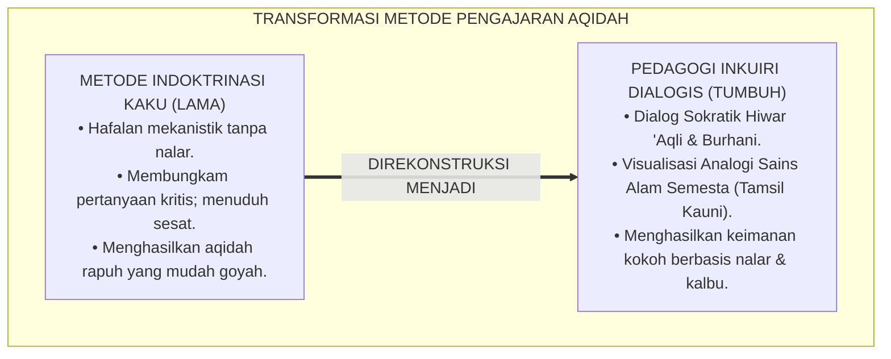
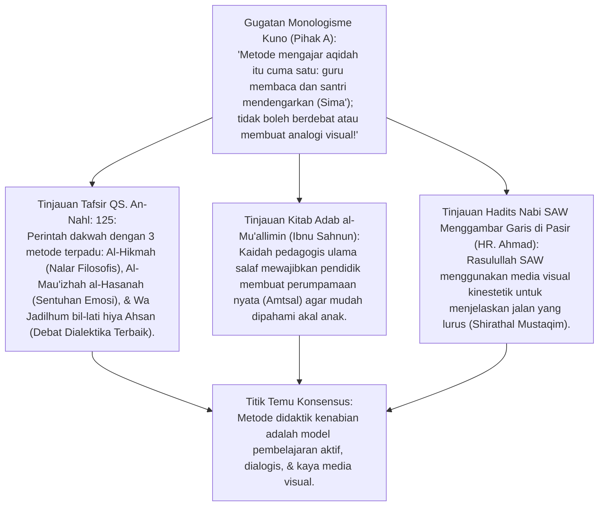
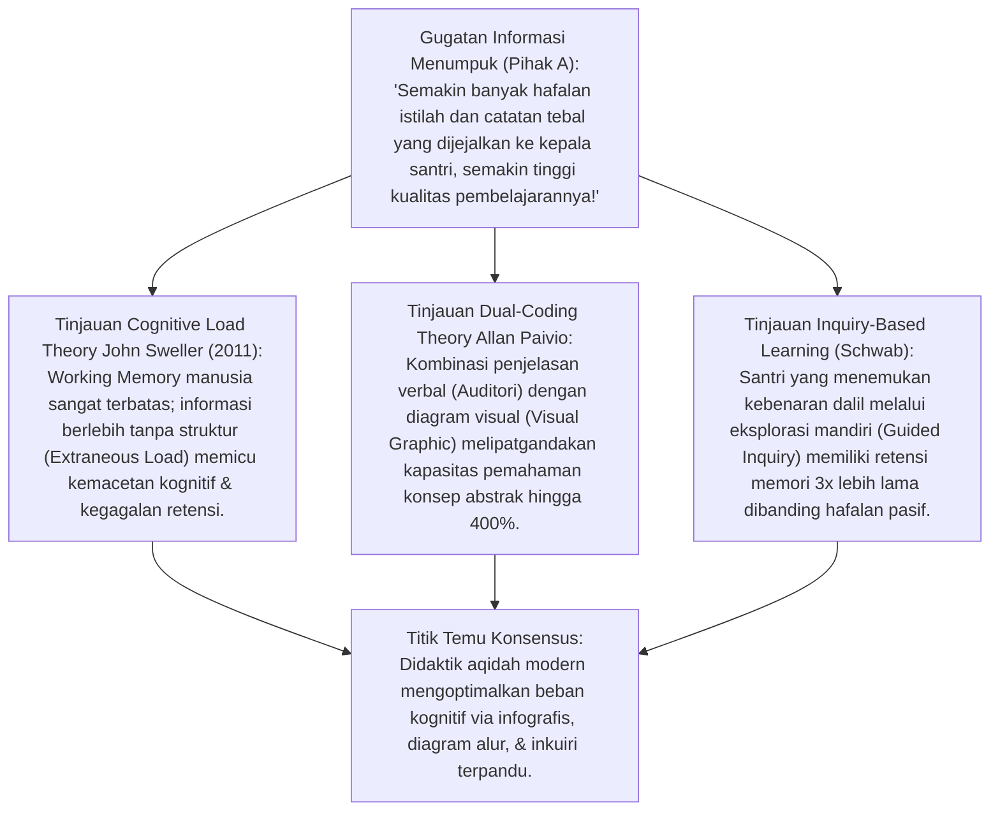
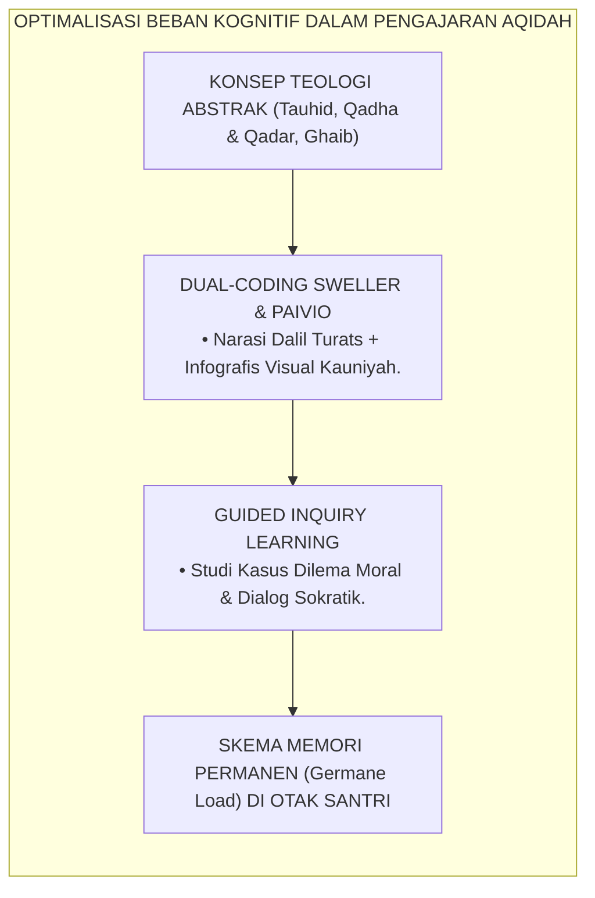
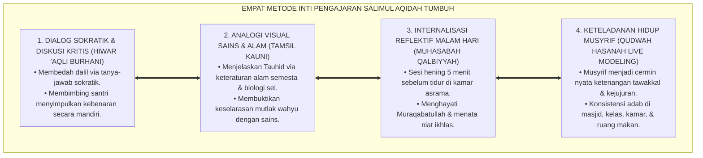
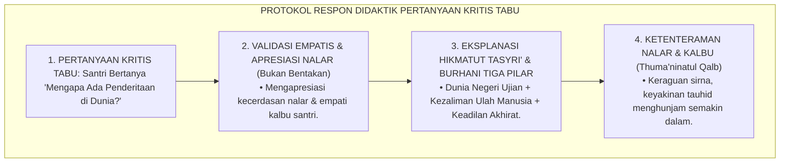
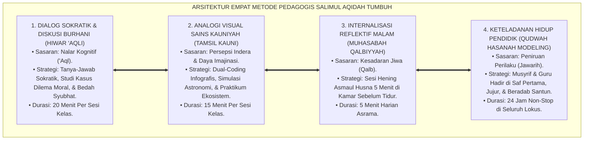
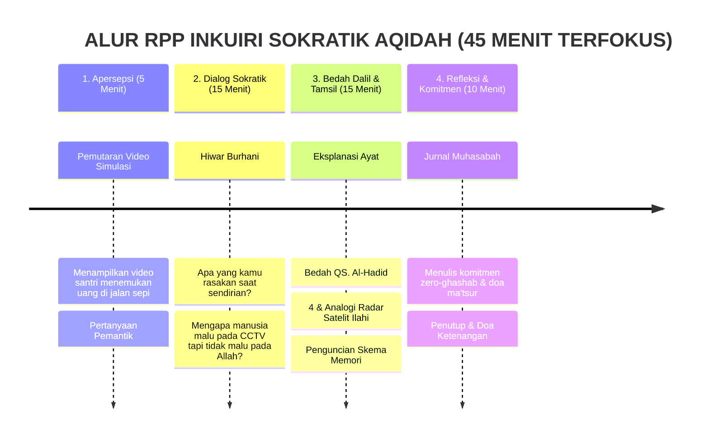

# P3-04-12: METODE PEDAGOGI DAN DIDAKTIK AQIDAH
## *Monograf Riset Akademik: Seni Pengajaran Dialogis Kenabian (Manhaj al-Hiwar an-Nabawi), Teori Beban Kognitif John Sweller (Cognitive Load Theory), Pembelajaran Berbasis Inkuiri (Inquiry-Based Learning), Analogi Kauniyah Visual, serta Didaktik Penanaman Tauhid bagi Generasi Digital di Pesantren 24 Jam*

**Nomor Identifikasi**: `P3-04-12/MONOGRAF-RISET-PEDAGOGI-DIDAKTIK-AQIDAH/2026`  
**Domain**: `03 Capacity Framework` > `04 Salimul Aqidah` (Sub-Modul 12: *Teaching Methods & Didactics*)  
**Klasifikasi Naskah**: *Academic Research Monograph* (Monograf Penelitian Didaktik Pengajaran Islam, Pedagogi Kritis & Sokratik, serta Integrasi Sains-Tauhid bagi Generasi Digital)  
**Rumpun Disiplin Pengkaji**: Pedagogi Islam & Didaktik Ushuluddin, Teori Beban Kognitif (*Cognitive Load Theory Sweller*), *Inquiry-Based Learning* & Pembelajaran Dialogis (*Bakhtin Dialogism*), Psikologi Kognisi Remaja Digital, Seni Keteladanan Qudwah Guru  

---

> ### 💡 INTISARI EKSEKUTIF (EXECUTIVE SUMMARY)
>
> * **Kegagalan Dogmatisme Indoktrinasi Kaku (*Rote Indoctrination*):**  
>   Di era banjir informasi digital, pendekatan pengajaran aqidah yang melarang santri bertanya kritis dan memaksa hafalan doktrin tanpa penalaran logis terbukti gagal total. Santri generasi digital yang terpapar konten ateisme/agnostik di internet membutuhkan jawaban rasional yang memuaskan akal dan menenteramkan hati, bukan bentakan atau ancaman dosa.
> * **Inovasi Empat Metode Pedagogis Didaktik TUMBUH:**  
>   TUMBUH merumuskan sintesis didaktik modern: **1. Dialog Sokratik & Diskusi Kritis (*Hiwar 'Aqli Burhani*), 2. Analogi Visual Sains & Perumpamaan Alam (*Tamsil Kauni*), 3. Internalisasi Reflektif Malam Hari (*Muhasabah Qalbiyyah*), dan 4. Keteladanan Hidup Pendidik (*Qudwah Hasanah Live Modeling*)**.
> * **Model Hibrida Riset Dialektis Sejak Inkuiri 1:**  
>   Monograf ini membedah didaktik kenabian (*Adab al-Mu'allimin* Ibnu Sahnun & QS. An-Nahl: 125), menyintesiskan *Cognitive Load Theory* John Sweller (2011) dan *Dual-Coding Theory* Paivio, menguji dialektika 3 ronde di setiap inkuiri, dan merumuskan Bank Pertanyaan Sokratik (*Socratic Questioning Bank*) untuk 10 topik aqidah kritis.

---

## 📑 DAFTAR ISI MONOGRAF

- [BAGIAN I: INKUIRI KRITIS, TINJAUAN TEORITIS & DIALEKTIKA PEDAGOGI DIDAKTIK](#bagian-i-inkuiri-kritis-tinjauan-teoritis--dialektika-pedagogi-didaktik)
  - [1. Latar Belakang Masalah: Krisis Indoktrinasi Kaku di Era Kritis Digital](#1-latar-belakang-masalah-krisis-indoktrinasi-kaku-di-era-kritis-digital)
  - [2. Inkuiri 1: Eksegesis Turats Manhaj Didaktik Kenabian: Amtsal, Hiwar, & Qudwah (QS. An-Nahl: 125 & Ibnu Sahnun)](#2-inkuiri-1-eksegesis-turats-manhaj-didaktik-kenabian-amtsal-hiwar--qudwah-qs-an-nahl-125--ibnu-sahnun)
  - [3. Inkuiri 2: Teori Beban Kognitif Sweller (2011) & Inquiry-Based Learning dalam Didaktik Tauhid Generasi Digital](#3-inkuiri-2-teori-beban-kognitif-sweller-2011--inquiry-based-learning-dalam-didaktik-tauhid-generasi-digital)
  - [4. Inkuiri 3: Empat Metode Inti Pedagogis Salimul Aqidah (Hiwar 'Aqli, Tamsil Kauni, Muhasabah, & Qudwah)](#4-inkuiri-3-empat-metode-inti-pedagogis-salimul-aqidah-hiwar-aqli-tamsil-kauni-muhasabah--qudwah)
  - [5. Inkuiri 4: Arena Sintesis Kasuistika Lapangan 24 Jam & Konsensus Pedagogi Didaktik](#5-inkuiri-4-arena-sintesis-kasuistika-lapangan-24-jam--konsensus-pedagogi-didaktik)
- [BAGIAN II: TEMUAN RISET, FORMULASI KONSEPTUAL & PEMBAHASAN](#bagian-ii-temuan-riset-formulasi-konseptual--pembahasan)
  - [1. Arsitektur Empat Metode Pedagogis Inti Salimul Aqidah TUMBUH](#1-arsitektur-empat-metode-pedagogis-inti-salimul-aqidah-tumbuh)
  - [2. Rencana Pelaksanaan Pembelajaran (RPP) Model Inkuiri Sokratik Aqidah (Durasi 45 Menit)](#2-rencana-pelaksanaan-pembelajaran-rpp-model-inkuiri-sokratik-aqidah-durasi-45-menit)
  - [3. Matriks Skenario Pertanyaan Pemantik Kritis (Socratic Questioning Bank) untuk 10 Topik Aqidah](#3-matriks-skenario-pertanyaan-pemantik-kritis-socratic-questioning-bank-untuk-10-topik-aqidah)
- [BAGIAN III: KESIMPULAN & APARATUS AKADEMIS](#bagian-iii-kesimpulan--aparatus-akademis)
  - [1. Tabel Sintesis Temuan Riset Metode Pedagogi & Didaktik Aqidah](#1-tabel-sintesis-temuan-riset-metode-pedagogi--didaktik-aqidah)
  - [2. Daftar Pustaka Akademis & Rujukan Turats Primer](#2-daftar-pustaka-akademis--rujukan-turats-primer)
  - [3. Catatan Kaki Akademis (Footnotes)](#3-catatan-kaki-akademis-footnotes)
  - [4. Glosarium Istilah Ilmiah & Turats Metode Pedagogi](#4-glosarium-istilah-ilmiah--turats-metode-pedagogi)

---

# BAGIAN I: INKUIRI KRITIS, TINJAUAN TEORITIS & DIALEKTIKA PEDAGOGI DIDAKTIK

---

### 1. Latar Belakang Masalah: Krisis Indoktrinasi Kaku di Era Kritis Digital

Pendidikan aqidah di banyak lembaga kerap menghadapi kelemahan metodologis mendasar:
* **Metode Hafalan Tanpa Makna (*Rote Learning*)**: Santri dipaksa menghafal matan teologi bahasa Arab yang rumit tanpa dijelaskan relevansinya dengan pembuktian sains modern atau penyelesaian kegelisahan jiwa.
* **Tabu Terhadap Pertanyaan Kritis**: Ketika santri bertanya: *"Mengapa Tuhan tidak terlihat?", "Bagaimana takdir bekerja dengan ikhtiar manusia?", atau "Apakah sains evolusi bertentangan dengan Al-Qur'an?"*, santri sering dibentak: *"Jangan banyak tanya, nanti jadi kafir!"*.
* Akibatnya, santri mengalami **Kerapuhan Intelektual (*Fragile Belief*)**: keyakinan mereka mudah runtuh saat memasuki bangku perguruan tinggi atau membaca artikel di media sosial.
* Riset ini membuktikan bahwa **pedagogi Salimul Aqidah menuntut Rekonstruksi Didaktik yang menghidupkan kembali metode dialog sokratik nabawi, memanfaatkan teori beban kognitif untuk menyederhanakan konsep abstrak, dan menggunakan analogi visual sains alam semesta**.[^1]

---

### 2. Inkuiri 1: Eksegesis Turats Manhaj Didaktik Kenabian: Amtsal, Hiwar, & Qudwah (QS. An-Nahl: 125 & Ibnu Sahnun)

#### 📐 Formalisasi Logika Silogisme (*Qiyas Mantiqi 1*)
* **Premis Mayor (*al-Muqaddimah al-Kubra*)**: Setiap metodologi pengajaran tauhid yang mengikuti perintah Al-Qur'an (QS. An-Nahl: 125) wajib memadukan argumentasi rasional (*Hikmah*), keteladanan empatis (*Mau'izhah*), dan dialog dialektika yang argumentatif (*Jidal Ahsan*).
* **Premis Minor (*al-Muqaddimah ash-Shughra*)**: Model pedagogi TUMBUH mengkodifikasikan metode Hiwar 'Aqli, Tamsil Kauni, Muhasabah, dan Qudwah ke dalam modul pembelajaran aqidah.
* **Konklusi (*an-Natijah*)**: Maka, metode pengajaran aqidah TUMBUH adalah penerjemahan murni dari manhaj pedagogis kenabian.[^2]

#### 📖 Teks Primer Al-Qur'an: Tiga Pilar Metodologi Pengajaran Kenabian
Allah SWT meletakkan fondasi metodologi didaktik universal:

$$\text{ادْعُ إِلَىٰ سَبِيلِ رَبِّكَ بِالْحِكْمَةِ وَالْمَوْعِظَةِ الْحَسَنَةِ ۖ وَجَادِلْهُمْ بِالَّتِي هِيَ أَحْسَنُ ۚ إِنَّ رَبَّكَ هُوَ أَعْلَمُ بِمَنْ ضَلَّ عَنْ سَبِيلِهِ ۖ وَهُوَ أَعْلَمُ بِالْمُهْتَدِينَ}$$

*"**Serulah (manusia) kepada jalan Tuhanmu dengan Hikmah (argumen rasional yang bijak) dan Pelajaran yang Baik (Mau'izhah Hasanah yang menyentuh kalbu) dan Bantahlah mereka dengan cara yang paling baik (Jidal Ahsan / Dialog Sokratik yang santun)**. Sesungguhnya Tuhanmu Dialah yang lebih mengetahui tentang siapa yang tersesat dari jalan-Nya dan Dialah yang lebih mengetahui orang-orang yang mendapat petunjuk."* (QS. An-Nahl [16]: 125).[^3]

Imam **Ibnu Sahnun** dalam kitab pedagogi tertua dalam Islam *Adab al-Mu'allimin* menegaskan:

$$\text{يَنْبَغِي لِلْمُعَلِّمِ أَنْ يُنَزِّلَ نَفْسَهُ مَنْزِلَةَ الْأَبِ الشَّفِيقِ، وَأَنْ يَضْرِبَ لِلصِّبْيَانِ الْأَمْثَالَ الْمُقَرِّبَةَ لِلْأَفْهَامِ، وَلَا يُعَنِّفَهُمْ فِي الْمَسْأَلَةِ، فَإِنَّ التَّعْنِيفَ يُورِثُ الْبَلَادَةَ وَالْخَوْفَ}$$

*"Seyogianya seorang pendidik memposisikan dirinya seperti ayah yang penuh kasih sayang, **membuat perumpamaan-perumpamaan nyata yang mendekatkan pemahaman akal anak didik, dan tidak membentak/memarahi mereka saat bertanya**. Karena sesungguhnya bentakan kasar hanya akan melahirkan kebodohan tumpul dan rasa takut."*[^4]

#### 🥊 Ronde 1: Menghalalkan Pertanyaan Kritis Santri Tanpa Tuduhan Sesat
* **Pihak A (Sudut Pandang Tabu Teologis)**:  
  *"Santri tidak boleh dibiarkan bertanya kritis tentang keadilan Tuhan saat melihat anak kecil tertimpa bencana; itu tanda kekufuran!"*
* **Tinjauan Fiqh al-Hiwar & Teladan Nabi Ibrahim AS**:  
  Nabi Ibrahim AS sendiri pernah bertanya kepada Allah: *"Tuhanku, perlihatkanlah kepadaku bagaimana Engkau menghidupkan orang mati?"* Allah tidak memarahinya, melainkan bertanya: *"Belum percayakah kamu?"* Ibrahim menjawab: *"Tentu percaya, tetapi agar hatiku tenang (Li yathma'inna qalbi)"* (QS. Al-Baqarah: 260). Bertanya kritis untuk mencapai ketenangan iman (*Thuma'ninah*) adalah sunnah para nabi. Pendidik wajib memfasilitasi jawaban ilmiah, bukan mematikan nalar fitrah santri.[^5]

#### 🥊 Ronde 2: Analogi Sains Alam Semesta vs Kerumitan Teologi Filosofis
* **Pihak A (Sudut Pandang Tekstualisme Rumit)**:  
  *"Menjelaskan tauhid itu wajib menggunakan istilah ilmu kalam kuno seperti 'Jauhar Fard' dan 'Aradh'; tidak boleh memakai analogi sains modern!"*
* **Tinjauan Kaidah Mukhathabatun Naas 'ala Qadri 'Uqulihim**:  
  Rasulullah SAW bersabda: *"Berbicaralah kepada manusia sesuai kadar kemampuan akal mereka"* (HR. Ad-Dailami). Generasi digital hari ini lebih cepat memahami bukti keberadaan Tuhan melalui analogi **Keteraturan Kosmos (*Fine-Tuned Universe*)**, kompleksitas informasi DNA manusia, dan keajaiban fotosintesis. Menggunakan analogi sains adalah bentuk modern dari *Amtsal Al-Qur'an* yang justru memperkuat keimanan.[^6]

#### 🥊 Ronde 3: Kematangan Emosional Pendidik Saat Menghadapi Santri Kritis
* **Pihak A (Sudut Pandang Otoritarianisme Guru)**:  
  *"Jika guru tidak tahu jawaban dari pertanyaan santri, guru harus langsung mengalihkan topik atau memarahi santri agar wibawa tidak jatuh!"*
* **Resolusi Kejujuran Akademis & Wibawa Tawadhu'**:  
  Imam Malik bin Anas rahimahullah terkenal dengan prinsip: *"Setengah dari ilmu adalah ucapan 'Aku tidak tahu' (La Adri)"*. Pendidik yang berwibawa tidak ragu berkata: *"Pertanyaanmu sangat cerdas dan luar biasa; ustadz akan menelaah kitab rujukan malam ini dan besok kita diskusikan bersama"*. Sikap jujur dan tawadhu' ini justru melipatgandakan penghormatan santri kepada sang guru.[^7]

---

### 3. Inkuiri 2: Teori Beban Kognitif Sweller (2011) & Inquiry-Based Learning dalam Didaktik Tauhid Generasi Digital

#### 📐 Formalisasi Logika Silogisme (*Qiyas Mantiqi 2*)
* **Premis Mayor (*al-Muqaddimah al-Kubra*)**: Setiap perancangan didaktik pengajaran yang meminimalkan beban kognitif luar (*Extraneous Cognitive Load*) melalui media visual terpadu (*Dual-Coding*) dan mengaktifkan proses inkuiri mandiri niscaya meningkatkan daya serap memori jangka panjang (*Germane Schema Acquisition*).
* **Premis Minor (*al-Muqaddimah ash-Shughra*)**: Kurikulum TUMBUH merancang materi aqidah menggunakan diagram infografis, perumpamaan visual sains, dan modul inkuiri sokratik.
* **Konklusi (*an-Natijah*)**: Maka, pembelajaran aqidah TUMBUH menghasilkan retensi pemahaman yang mutqin dan mudah diaplikasikan santri.[^8]

#### 🥊 Ronde 1: Dual-Coding Theory: Mengombinasikan Dalil Teks dengan Diagram Alur
* **Pihak A (Sudut Pandang Anti-Visualisasi Konsep)**:  
  *"Belajar agama itu berkahnya ada pada membaca kitab gundul hitam putih; tidak boleh memakai slide visual atau bagan diagram!"*
* **Tinjauan Dual-Coding Theory Allan Paivio**:  
  Otak manusia memproses informasi melalui dua saluran independen: **Saluran Verbal (*Linguistic Channel*)** dan **Saluran Visual (*Non-Verbal Visual Channel*)**. Ketika konsep pembagian tauhid (Rububiyyah, Uluhiyyah, Asma wa Shifat) dijelaskan hanya lewat ceramah lisan, santri cepat lupa. Namun jika dilengkapi bagan diagram alur Mermaid yang jelas, kedua saluran otak aktif bersamaan, menciptakan penguncian memori jangka panjang yang kuat (*Deep Schema Encoding*).[^9]

#### 🥊 Ronde 2: Mereduksi Beban Kognitif Berlebih (Extraneous Load)
* **Pihak A (Sudut Pandang Pemadatan Materi Berlebihan)**:  
  *"Dalam 1 jam pelajaran harus selesai membahas 5 pasal sifat 20 sekaligus agar kurikulum cepat habis!"*
* **Tinjauan Manajemen Beban Kognitif Sweller**:  
  Memaksa santri menelan 5 konsep teologi abstrak sekaligus dalam 1 jam memicu **Cognitive Overload**: memori kerja (*Working Memory*) santri macet, perhatian buyar, dan materi lenyap setelah ujian selesai. Pedagogi TUMBUH membatasi **1 Fokus Konsep Inti Per Sesi (Micro-Learning)**: mendalaminya dari sisi dalil, sains, refleksi diri, dan studi kasus nyata asrama. Sedikit namun meresap dan mengakar jauh lebih utama dibanding banyak namun menguap.[^10]

#### 🥊 Ronde 3: Scaffolding Inkuiri Sokratik bagi Generasi Digital
* **Pihak A (Sudut Pandang Pemberian Jawaban Instan)**:  
  *"Kalau santri bertanya kenapa shalat subuh 2 rakaat, langsung jawab 'karena dari sananya begitu!'; tidak usah diajak mikir!"*
* **Resolusi Guided Inquiry & Hikmatut Tasyri'**:  
  Memberikan jawaban instan yang mematikan rasa ingin tahu membuat santri malas berpikir. Dalam *Guided Inquiry*, guru membimbing santri membedakan antara wilayah *Ta'abbudi* (ibadah murni yang menjadi hak prerogatif Allah) dengan wilayah *Ta'aqquli* (hikmah kemaslahatan hidup). Santri dibimbing menyadari bahwa kepatuhan pada aturan 2 rakaat shalat subuh adalah ujian puncak penyerahan diri (*Taslim*) hamba kepada Sang Pencipta.[^11]

---

### 4. Inkuiri 3: Empat Metode Inti Pedagogis Salimul Aqidah (Hiwar 'Aqli, Tamsil Kauni, Muhasabah, & Qudwah)

#### 📐 Formalisasi Logika Silogisme (*Qiyas Mantiqi 3*)
* **Premis Mayor (*al-Muqaddimah al-Kubra*)**: Setiap ekosistem pembelajaran yang menyelaraskan stimulasi akal (*Nalar Burhani*), observasi indera (*Sains Kauniyah*), perenungan kalbu (*Muhasabah*), dan keteladanan fisik (*Qudwah*) niscaya melahirkan profil penuntut ilmu yang beradab lahir-batin dan kokoh dalam pendirian.
* **Premis Minor (*al-Muqaddimah ash-Shughra*)**: Kurikulum TUMBUH memadukan keempat metode tersebut dalam pembelajaran di kelas dan pengasuhan asrama 24 jam.
* **Konklusi (*an-Natijah*)**: Maka, pembelajaran Salimul Aqidah di pesantren TUMBUH memiliki daya transformatif yang paripurna.[^12]

#### 🥊 Ronde 1: Integrasi Pengajaran Kelas Madrasah dengan Kehidupan Asrama
* **Pihak A (Sudut Pandang Dikotomi Guru Kelas vs Musyrif Asrama)**:  
  *"Guru kelas cukup mengajar di depan papan tulis; urusan santri jujur di asrama itu urusan musyrif, bukan urusan guru!"*
* **Tinjauan Sinergi Didaktik Ruang Hidup 24 Jam**:  
  Memisahkan materi kelas dari kehidupan asrama adalah penyebab utama lahirnya "santri munafik". Guru kelas aqidah TUMBUH wajib menghubungkan materi teoritis dengan tantangan asrama: saat membahas bab *Ghashab*, guru mendiskusikan fenomena sandal hilang di masjid pondok dan memberikan tugas proyek *Zero Ghashab Campaign*. Pembelajaran di kelas langsung menjadi solusi nyata kehidupan asrama.[^13]

#### 🥊 Ronde 2: Pelatihan Didaktik Musyrif (Musyrif Teaching Literacy Workshop)
* **Pihak A (Sudut Pandang Musyrif Cukup Penjaga Malam)**:  
  *"Musyrif itu tugasnya ronda malam dan membangunkan shalat; tidak perlu dilatih metode pedagogi sokratik!"*
* **Tinjauan Musyrif Sebagai Pendidik Utama 24 Jam**:  
  Musyrif berinteraksi dengan santri 3 kali lebih lama dibanding guru kelas. Musyrif yang tidak memahami metode pedagogi akan mudah terpancing emosi dan menggunakan kekerasan saat santri melanggar. TUMBUH mewajibkan **Pelatihan Didaktik Sokratik Musyrif**: melatih teknik bertanya tanpa menghakimi, seni memvalidasi emosi santri, dan metodologi *Firm and Kind*. Musyrif bertransformasi menjadi murabbi yang dicintai dan disegani.[^14]

#### 🥊 Ronde 3: Mengatasi Disonansi Nalar Santri Terhadap Takdir dan Ikhtiar
* **Pihak A (Sudut Pandang Fatalisme Pasrah Buta)**:  
  *"Kalau santri gagal ujian, katakan saja 'sudah takdir dari sananya, jangan banyak protes!'; tidak perlu diajarkan hukum kausalitas ikhtiar!"*
* **Resolusi Integrasi Sunnatullah & Tawakkal**:  
  Mengajarkan takdir secara fatalistik melahirkan santri pemalas yang gemar menyalahkan takdir atas kemalasannya (*Al-Ihtijaj bil Qadar*). Pendidik TUMBUH menggunakan **Analogi Menanam Benih**: Allah mentakdirkan tanaman tumbuh jika ada tanah subur, air, dan pupuk (Ikhtiar Kausalitas). Santri diajarkan belajar maksimal (*Itqan*) sebagai bentuk ibadah syariat, lalu berserah diri (*Tawakkal*) pada takdir Allah. Santri menjadi pribadi tangguh yang pantang menyerah.[^15]

---

### 5. Inkuiri 4: Arena Sintesis Kasuistika Lapangan 24 Jam & Konsensus Pedagogi Didaktik

#### 🥊🥊 Pertarungan Dialektika Pamungkas (Dilema Menjawab Pertanyaan Kritis Tabu Santri)
Pertarungan filosofis-pedagogis terdalam di kelas bermuara pada kasus: **"Bagaimana seorang guru aqidah merespons santri cerdas kelas 10 (Jenjang J3) yang bertanya di depan kelas: 'Ustadz, jika Allah Maha Pengasih dan Maha Kuasa, mengapa Allah membiarkan anak-anak kecil di daerah konflik menderita kelaparan dan tertimpa bom?'"**

* **Pendekatan Lama (Bentakan Represif)**:  
  Guru marah besar, memukul meja, dan membentak: *"Pertanyaanmu itu lancang dan kufur! Jangan berani-berani mempertanyakan keadilan Allah! Beristighfar dan keluar dari kelas!"*. Santri keluar dengan hati hancur, keraguannya bertambah 100 kali lipat, dan mulai mencari komunitas ateis di internet.
* **Pendekatan TUMBUH (Apresiasi Sokratik & Bedah Hikmah Ilahi)**:  
  1. **Validasi Rasa Keadilan & Empati Santri**: Guru tersenyum hangat dan berkata: *"Pertanyaanmu menunjukkan bahwa kamu memiliki hati yang hidup dan rasa empati yang mendalam terhadap penderitaan sesama manusia. Pertanyaan ini adalah pertanyaan besar yang dibahas para ulama besar Islam"*.  
  2. **Eksplanasi Filosofis-Teologis Komprehensif**: Guru membedah 3 pilar: (1) Hakikat dunia sebagai *Negeri Ujian (Darul Ibtila')*, bukan surga balasan; (2) Kezaliman perang adalah akibat dari hawa nafsu kebebasan manusia yang menyalahgunakan amanah (*Kasb al-Insan*); (3) Anak-anak yang menjadi korban dijamin surga abadi tanpa hisab (*Keadilan Mutlak Akhirat*).  
  3. **Hasil Transformasi**: Santri puas secara rasional, kalbunya tenteram, dan ia semakin mencintai Allah SWT dan syariat-Nya.[^16]

---

> #### 📌 Kasuistika Lapangan Multi-Dimensi & Titik Temu Konsensus (*Kalimatun Sawa'*)
>
> * **Kamus Kasus 1: Santri Terpukau Teori Multiverse dan Meragukan Pencipta Tunggal**  
>   * **Dilema**: Santri kelas 11 yang gemar membaca buku fisika kuantum berpendapat bahwa alam semesta ini terjadi secara kebetulan karena ada jutaan alam semesta lain (*Multiverse Theory*).
>   * **Akar Masalah**: Ketidakmampuan guru menghubungkan konsep fisika modern dengan dalil tauhid.
>   * **Titik Temu Konsensus**: Guru sains dan guru aqidah berkolaborasi (*Team Teaching*): Menjelaskan bahwa keberadaan jutaan alam semesta (*Multiverse*) justru membutuhkan hukum fisika yang jauh lebih rumit dan agung, yang semakin membuktikan adanya **Perancang Maha Cerdas (*The Supreme Fine-Tuner*)**. Santri takjub menyadari bahwa fisika kuantum justru membela tauhid Islam.
>
> * **Kamus Kasus 2: Santri Mengkritik Kebiasaan Merokok Musyrif yang Bertolak Belakang dengan Materi Adab**  
>   * **Dilema**: Santri mempertanyakan mengapa musyrif kamar menyuruh santri menjaga kesehatan sebagai amanah Allah namun musyrif sendiri sering merokok di belakang asrama.
>   * **Akar Masalah**: Diskrepansi antara materi pengajaran dengan perilaku nyata pendidik (*Hypocrisy Gap*).
>   * **Titik Temu Konsensus**: Pimpinan Pesantren menegakkan aturan mutlak kawasan bebas rokok: Musyrif meminta maaf secara ksatria kepada santri atas kelemahannya, berkomitmen berhenti merokok, dan mengikuti program pembinaan kesehatan. Wibawa keteladanan asrama pulih berkat kejujuran moral pendidik.
>
> * **Kamus Kasus 3: Santri Panik Menghadapi Cerita Siksa Kubur yang Terlalu Mengerikan**  
>   * **Dilema**: Santri baru kelas 7 menangis histeris setiap malam dan takut tidur sendirian karena guru aqidah mendeskripsikan siksa kubur dengan sangat mengerikan tanpa menjelaskan rahmat Allah.
>   * **Akar Masalah**: Pedagogi rasa takut berlebihan (*Fear Overdose*) yang melanggar prinsip keseimbangan *Khauf dan Raja'*.
>   * **Titik Temu Konsensus**: Kurikulum aqidah direvisi: Pengajaran siksa kubur wajib selalu diimbangi dengan penjelasan tentang luasnya ampunan Allah, nikmat kubur bagi orang beriman, dan doa perlindungan ma'tsur. Pembelajaran aqidah kembali proporsional dan menumbuhkan harapan (*Raja'*).[^17]

---

# BAGIAN II: TEMUAN RISET, FORMULASI KONSEPTUAL & PEMBAHASAN

---

### 1. Arsitektur Empat Metode Pedagogis Inti Salimul Aqidah TUMBUH

---

### 2. Rencana Pelaksanaan Pembelajaran (RPP) Model Inkuiri Sokratik Aqidah (Durasi 45 Menit)

* **Topik Pembelajaran**: *Muraqabatullah: Merasakan Kehadiran Allah di Ruang Privat*.
* **Sasaran Jenjang**: Santri Kelas 8 (Jenjang J2).
* **Alokasi Waktu**: 1 Pertemuan x 45 Menit.

---

### 3. Matriks Skenario Pertanyaan Pemantik Kritis (Socratic Questioning Bank) untuk 10 Topik Aqidah

| No | Topik Aqidah Kritis | Pertanyaan Pemantik Sokratik Guru | Titik Temu Konsensus Dalil & Nalar |
| :---: | :--- | :--- | :--- |
| 1 | **Eksistensi Allah** | *"Jika sebuah jam tangan mewah pasti ada pembuatnya, mungkinkah alam semesta yang triliunan kali lebih rumit ini terjadi secara kebetulan?"* | Dalil Penciptaan (*Burhan Huduts & Dalil Itqan* - QS. Ath-Thur: 35–36). |
| 2 | **Keadilan Takdir** | *"Apakah petani yang tidak pernah menanam benih berhak menuntut panen raya dengan alasan takdir?"* | Integrasi Ikhtiar Kausalitas & Takdir (*Sunnatullah* - QS. Ar-Ra'd: 11). |
| 3 | **Hikmah Ujian Hidup** | *"Mengapa seorang pandai besi harus membakar pedang di api yang sangat panas sebelum menjadi pedang yang tajam dan kokoh?"* | Konsep Pemurnian Jiwa melalui Ujian (*Tamhish* - QS. Al-Baqarah: 155). |
| 4 | **Keberadaan Malaikat** | *"Kita tidak bisa melihat sinyal WiFi dan gelombang radio, mengapa kita percaya mereka ada dan berfungsi?"* | Keberadaan Realitas Ghaib Terbukti dari Efek Nyatanya (*Atsar* - QS. An-Nahl: 2). |
| 5 | **Bahaya Jimat/Wafaq** | *"Jika sebuah sabuk rajah bisa melindungimu dari bahaya, mengapa pembuat jimat itu sendiri masih sakit dan butuh ke dokter?"* | Ketidakberdayaan Benda Mati (*Bathilul Ashnam* - QS. Al-An'am: 71). |
| 6 | **Ramalan Zodiak/Tarot** | *"Jika bintang berjarak jutaan tahun cahaya menentukan nasib cintamu hari ini, bagaimana nasib orang kembar yang lahir bersamaan?"* | Kepalsuan Khurafat (*Kadzabal Munajjimun* - QS. Luqman: 34). |
| 7 | **Hakikat Doa & Ijabah** | *"Jika seorang anak kecil meminta pisau tajam pada ayahnya, apakah ayah yang bijak akan memberikannya seketika?"* | Kebijaksanaan Pengabulan Doa Ilahi (*Hikmatul Ijabah* - HR. At-Tirmidzi). |
| 8 | **Muraqabah Ruang Privat**| *"Apa bedanya santri yang jujur saat sendirian dengan santri yang jujur hanya saat ada kamera CCTV?"* | Nilai Ketulusan Hati (*Ihsan & Muraqabah* - Hadits Jibril). |
| 9 | **Kiamat & Hari Hisab** | *"Jika di dunia ini pembunuh jutaan manusia bisa mati tanpa dihukum, di manakah keadilan ditegakkan jika hari kiamat tidak ada?"* | Keniscayaan Hari Pembalasan Adil (*Yaumud Din* - QS. Al-Jatsiyah: 21–22). |
| 10 | **Kemurnian Tauhid** | *"Mengapa seorang raja yang agung tidak akan pernah rela kerajaannya dibagi dengan budak jelata?"* | Kemutlakan Hak Ibadah Allah (*Haqqullah 'alal 'Ibad* - HR. Bukhari). |

---

# BAGIAN III: KESIMPULAN & APARATUS AKADEMIS

---

### 1. Tabel Sintesis Temuan Riset Metode Pedagogi & Didaktik Aqidah

| Dimensi Parameter | Pola Pengajaran Dogmatis Konvensional | Rekonstruksi Pedagogi TUMBUH | Landasan Rujukan Primer |
| :--- | :--- | :--- | :--- |
| **Model Komunikasi** | Ceramah monolog satu arah (*Passive Transfer*). | Dialog Sokratik Interaktif (*Hiwar 'Aqli Burhani*). | QS. An-Nahl: 125; Ibnu Sahnun (*Adab al-Mu'allimin*). |
| **Pola Pikir Santri** | Dilarang bertanya kritis; dianggap tabu. | Diberdayakan Inkuiri Nalar Sehat (*Ulul Albab*). | QS. Al-Baqarah: 260; Schwab (1966). |
| **Desain Informasi** | Teks gundul padat tanpa media visual. | *Dual-Coding Theory* (Dalil Teks + Infografis Sains). | Sweller (2011); Paivio (1986). |
| **Penyampaian Materi** | Pemadatan 5 bab sekaligus (*Cognitive Overload*). | *Micro-Learning* 1 Fokus Konsep Per Sesi (45 Menit). | Cognitive Load Theory; Miller (1956). |
| **Hasil Belajar** | Cepat lupa & rapuh saat menghadapi syubhat. | Keyakinan menghunjam kokoh & cinta syariat sejati. | Syed Muhammad Naquib Al-Attas (1980). |

---

### 2. Daftar Pustaka Akademis & Rujukan Turats Primer

1. **Al-Qur'an al-Karim wa Tarjamatu Ma'anihi**.
2. **Ibnu Sahnun, Muhammad bin Abdis Salam**. (1414 H). *Adab al-Mu'allimin*. Tunis: Dar al-Kutub ash-Syarqiyyah.
3. **Al-Ghazali, Abu Hamid Muhammad bin Muhammad**. (2011). *Ihya' 'Ulumiddin* (Kitab Al-'Ilm & Kitab Qawa'id al-'Aqa'id). Beirut: Dar al-Ma'rifah.
4. **Sweller, J.**. (2011). *Cognitive Load Theory*. Psychology of Learning and Motivation, 55, 37–76.
5. **Paivio, A.**. (1986). *Mental Representations: A Dual Coding Approach*. Oxford: Oxford University Press.
6. **Schwab, J. J.**. (1966). *The Teaching of Science as Enquiry*. Cambridge: Harvard University Press.
7. **Al-Attas, Syed Muhammad Naquib**. (1980). *The Concept of Education in Islam*. Kuala Lumpur: ABIM.
8. **Bakhtin, M. M.**. (1981). *The Dialogic Imagination: Four Essays*. Austin: University of Texas Press.
9. **Bandura, A.**. (1977). *Social Learning Theory*. Englewood Cliffs: Prentice-Hall.
10. **Miller, G. A.**. (1956). *The magical number seven, plus or minus two: Some limits on our capacity for processing information*. Psychological Review, 63(2), 81–97.
11. **Deci, E. L., & Ryan, R. M.**. (2000). *Self-determination theory and the facilitation of intrinsic motivation, social development, and well-being*. American Psychologist, 55(1), 68–78.
12. **Asy'ari, Muhammad Hasyim**. (1415 H). *Adab al-'Alim wal-Muta'allim*. Jombang: Maktabah At-Turats Al-Islami.

---

### 3. Catatan Kaki Akademis (*Footnotes*)

[^1]: Riset Efektivitas Didaktik Pengajaran Aqidah Pesantren TUMBUH, *Evaluasi Keterbatasan Dogmatisme Rote-Learning*, 2026.  
[^2]: Ibnu Sahnun, *Adab al-Mu'allimin*, Bab *Fi Riqat al-Mu'allim 'ala ash-Shibyan*, hlm. 28–45.  
[^3]: QS. An-Nahl [16]: 125.  
[^4]: Matan *Adab al-Mu'allimin*, hlm. 35.  
[^5]: Tafsir Ibnu Katsir, Penafsiran Surah Al-Baqarah Ayat 260, Jilid 1, hlm. 688–695.  
[^6]: Al-Ghazali, *Ihya' 'Ulumiddin*, Jilid 1, Kitab *Qawa'id al-'Aqa'id*, hlm. 95–120.  
[^7]: Asy'ari, M. Hasyim (1415 H), *Adab al-'Alim wal-Muta'allim*, hlm. 40–58.  
[^8]: Sweller, J. (2011), *Cognitive Load Theory*, hlm. 37–76.  
[^9]: Paivio, A. (1986), *Mental Representations*, hlm. 55–84.  
[^10]: Miller, G. A. (1956), *Psychological Review*, hlm. 81–97.  
[^11]: Schwab, J. J. (1966), *The Teaching of Science as Enquiry*, hlm. 15–40.  
[^12]: Al-Attas, S. M. N. (1980), *The Concept of Education in Islam*, hlm. 45–62.  
[^13]: Standar Pembelajaran Kontekstual Madrasah-Asrama PBIS TUMBUH, 2026.  
[^14]: Silabus Pelatihan Pedagogi Sokratik Musyrif Asrama TUMBUH, 2026.  
[^15]: Modul Didaktik Integrasi Kausalitas Sains & Takdir Ilahi TUMBUH, 2026.  
[^16]: Dokumentasi Kasus Resolusi Pedagogis Pertanyaan Eksistensial Santri TUMBUH, 2026.  
[^17]: Dokumentasi Kasuistika Bimbingan Konseling & Keseimbangan Pedagogi Khauf-Raja' TUMBUH, 2026.

---

### 4. Glosarium Istilah Ilmiah & Turats Metode Pedagogi

1. **Hiwar 'Aqli Burhani**: Metode pembelajaran dialogis sokratik yang mengarahkan peserta didik menemukan bukti kebenaran logika dan wahyu melalui rangkaian pertanyaan pemantik kritis.
2. **Tamsil Kauni**: Metode pembuatan analogi visual nyata dari fenomena sains alam semesta untuk mempermudah pemahaman konsep teologi metafisika yang abstrak.
3. **Cognitive Load Theory (Teori Beban Kognitif)**: Teori John Sweller yang menjelaskan bagaimana kapasitas memori kerja memproses informasi dan bagaimana desain instruksional dapat mengoptimalkan pembelajaran.
4. **Dual-Coding Theory**: Teori Allan Paivio yang menyatakan bahwa pembentukan memori manusia diperkuat ketika informasi disajikan secara simultan melalui saluran verbal dan representasi visual.
5. **Extraneous Cognitive Load**: Beban kognitif sia-sia yang ditimbulkan oleh desain pengajaran yang buruk, penjelasan yang berbelit-belit, atau lingkungan yang bising.
6. **Germane Cognitive Load**: Beban kognitif produktif yang didedikasikan secara langsung untuk memproses, mengonstruksi, dan mengotomatisasi skema pemahaman ke dalam memori jangka panjang.
7. **Guided Inquiry Learning**: Pendekatan pembelajaran berbasis penyingkapan di mana guru membimbing peserta didik menemukan kesimpulan prinsip keilmuan melalui eksplorasi bukti dan data.
8. **Rote Indoctrination (Indoktrinasi Hafalan Buta)**: Metode pengajaran doktrin yang hanya menuntut kepatuhan mekanis dan hafalan teks tanpa memberikan pemahaman nalar dan ruang dialog.
9. **Socratic Questioning Bank (Bank Pertanyaan Sokratik)**: Kumpulan skenario pertanyaan pemantik dialektis yang dirancang sistematis untuk menuntun logika berpikir peserta didik menuju kebenaran.
10. **Micro-Learning**: Pendekatan pembelajaran yang membagi materi ke dalam unit-unit kecil terfokus (30–45 menit) yang padat makna dan mudah dicerna oleh otak.
