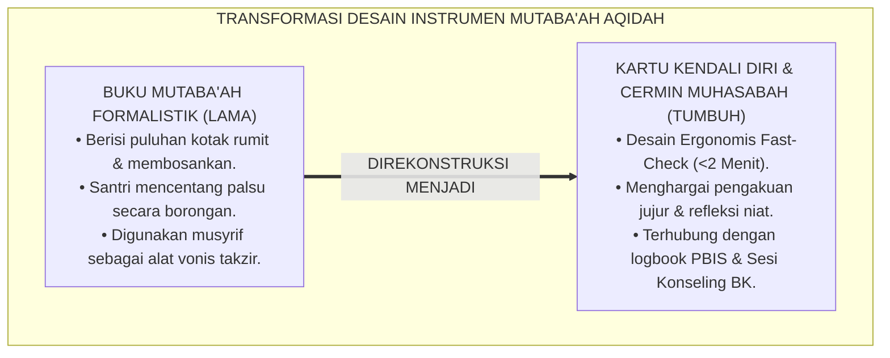
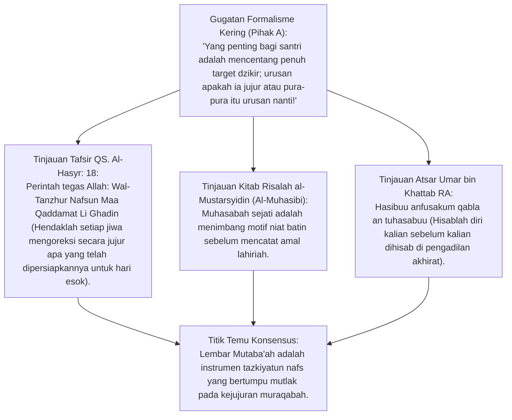
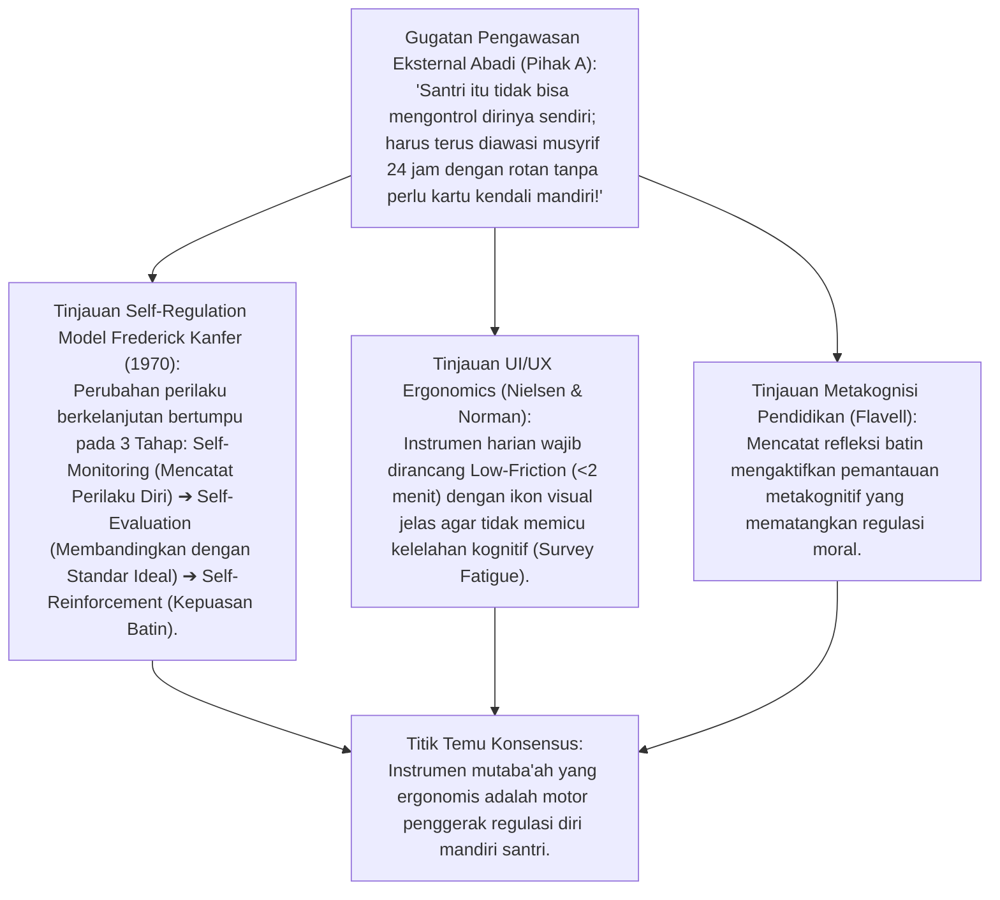
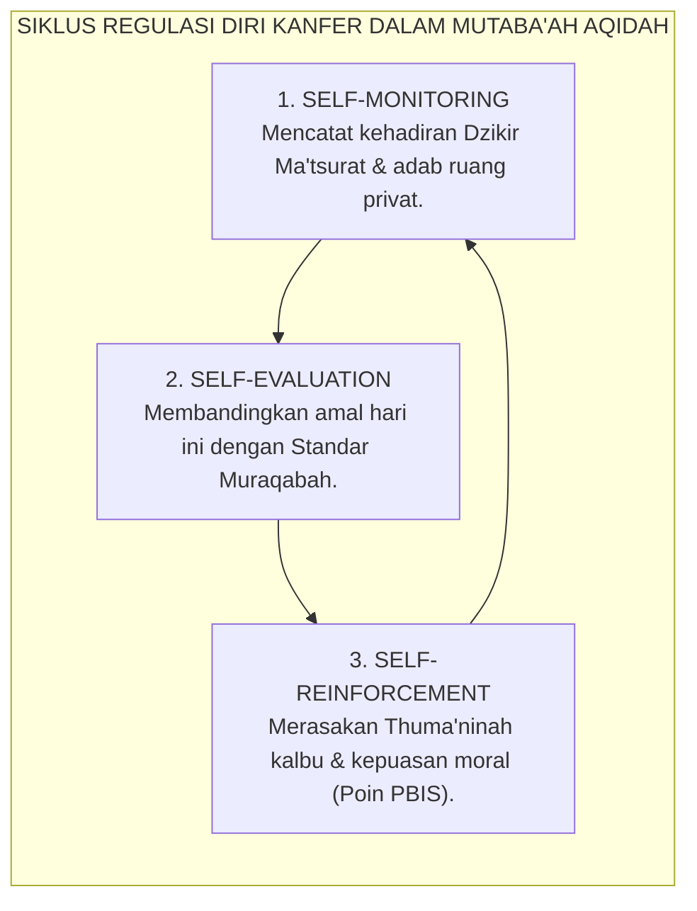
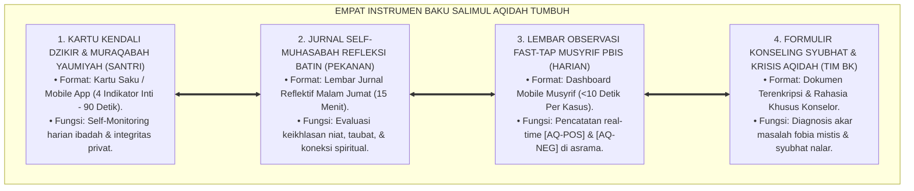
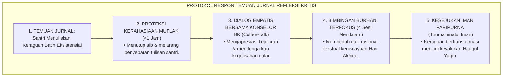
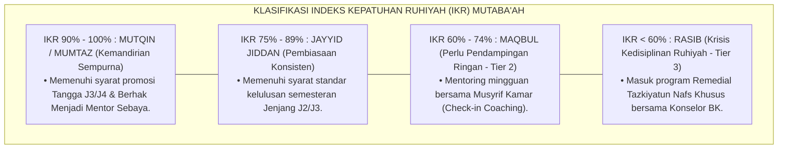
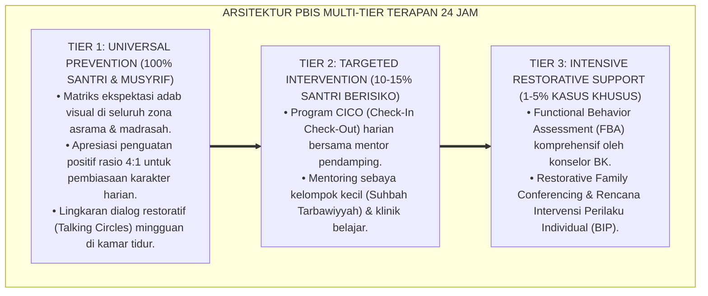

# P3-04-13: INSTRUMEN DAN LEMBAR MUTABAAH SALIMUL AQIDAH
## *Monograf Riset Akademik: Desain Instrumen Evaluasi Diri (Self-Monitoring Tools), Teori Regulasi Diri Frederick Kanfer, Fiqh Muhasabatun Nafsi Al-Harits Al-Muhasibi, Kartu Kendali Dzikir Harian, serta Formulir Penanganan Krisis Syubhat di Pesantren 24 Jam*

**Nomor Identifikasi**: `P3-04-13/MONOGRAF-RISET-INSTRUMEN-MUTABAAH-AQIDAH/2026`  
**Domain**: `03 Capacity Framework` > `04 Salimul Aqidah` (Sub-Modul 13: *Assessment Tools & Mutaba'ah Sheets*)  
**Klasifikasi Naskah**: *Academic Research Monograph* (Monograf Penelitian Desain Instrumen Evaluasi, Logbook Mutaba'ah Yaumiyyah, Kartu Kendali Diri, & Formulir Konseling Krisis Aqidah)  
**Rumpun Disiplin Pengkaji**: Desain Instrumen & Psikometri Pendidikan Islam, Metodologi Self-Monitoring (*Kanfer Self-Regulation Theory*), Ergonomi Antarmuka Instrumen (*UI/UX Ergonomics*), Fiqh Muhasabah & Tazkiyah, Manajemen Kasus Konseling BK Pesantren  

---

> ### 💡 INTISARI EKSEKUTIF (EXECUTIVE SUMMARY)
>
> * **Krisis Sindrom "Centang Palsu" (*False-Check Syndrome*):**  
>   Buku mutaba'ah amaliah harian di pesantren konvensional kerap terdegradasi menjadi rutinitas formalitas yang penuh kebohongan: santri mencentang seluruh kolom shalat dan dzikir sekaligus pada akhir pekan menjelang pemeriksaan musyrif. Instrumen gagal menjadi cermin penyucian jiwa dan justru mengajarkan kecurangan sistemik.
> * **Inovasi Empat Instrumen Terintegrasi Salimul Aqidah TUMBUH:**  
>   TUMBUH merancang ekosistem instrumen berbasis *Self-Regulation Theory* Kanfer (1970): **1. Kartu Kendali Dzikir & Muraqabah Yaumiyyah (<2 Menit), 2. Jurnal Refleksi Batin Mingguan, 3. Lembar Observasi Fast-Tap Musyrif, dan 4. Formulir Konseling Syubhat & Krisis Aqidah BK (Terkunci & Rahasia)**.
> * **Pendekatan Riset Terpadu & Diskursus Ilmiah:**  
>   Monograf ini membedah risalah agung *Muhasabatun Nafsi* Al-Harits Al-Muhasibi dan QS. Al-Hasyr: 18, menyintesiskan teori psikologi regulasi diri Kanfer, menguji dialektika 3 ronde di setiap inkuiri, dan merumuskan format instrumen cetak-digital yang ergonomis dan bebas manipulasi.

---

## 📑 DAFTAR ISI MONOGRAF

- [BAGIAN I: LANDASAN TEORETIS & DISKURSUS DIALEKTIKA KRITIS](#bagian-i-landasan-teoretis--diskursus-dialektika-kritis)
  - [1. Latar Belakang Masalah: Tragedi "Centang Palsu" & Formalisme Buku Mutaba'ah Tradisional](#1-latar-belakang-masalah-tragedi-centang-palsu--formalisme-buku-mutabaah-tradisional)
  - [2. Eksegesis Turats Hakikat Muhasabah & Hisab Diri (QS. Al-Hasyr: 18 & Al-Harits Al-Muhasibi)](#2eksegesis-turats-hakikat-muhasabah-hisab-diri-qs-al-hasyr-18-al-harits-al-muhasibi)
  - [3. Teori Regulasi Diri Frederick Kanfer (Self-Monitoring, Self-Evaluation, & Self-Reinforcement)](#3teori-regulasi-diri-frederick-kanfer-self-monitoring-self-evaluation-self-reinforcement)
  - [4. Arsitektur Empat Instrumen Baku Salimul Aqidah dalam Kehidupan Asrama 24 Jam](#4arsitektur-empat-instrumen-baku-salimul-aqidah-dalam-kehidupan-asrama-24-jam)
  - [5. Arena Sintesis Kasuistika Lapangan 24 Jam & Konsensus Desain Instrumen](#5arena-sintesis-kasuistika-lapangan-24-jam-konsensus-desain-instrumen)
- [BAGIAN II: FORMULASI KONSEPTUAL & PEMBAHASAN MENDALAM](#bagian-ii-formulasi-konseptual--pembahasan-mendalam)
  - [1. Desain Kartu Kendali Dzikir & Muraqabah Yaumiyyah (Format Cetak & Digital)](#1-desain-kartu-kendali-dzikir--muraqabah-yaumiyyah-format-cetak--digital)
  - [2. Format Baku Formulir Konseling Syubhat & Krisis Aqidah (Dokumen Rahasia Tim BK)](#2-format-baku-formulir-konseling-syubhat--krisis-aqidah-dokumen-rahasia-tim-bk)
  - [3. Rubrik Penilaian Portofolio Mutaba'ah & Indeks Kepatuhan Ruhiyah (IKR)](#3-rubrik-penilaian-portofolio-mutabaah--indeks-kepatuhan-ruhiyah-ikr)
- [BAGIAN III: KESIMPULAN & APARATUS AKADEMIS](#bagian-iii-kesimpulan--aparatus-akademis)
  - [1. Tabel Sintesis Temuan Riset Instrumen & Lembar Mutaba'ah](#1-tabel-sintesis-temuan-riset-instrumen--lembar-mutabaah)
  - [2. Daftar Pustaka Akademis & Rujukan Turats Primer](#2-daftar-pustaka-akademis--rujukan-turats-primer)
  - [3. Catatan Kaki Akademis (Footnotes)](#3-catatan-kaki-akademis-footnotes)
  - [4. Glosarium Istilah Ilmiah & Turats Instrumen Mutaba'ah](#4-glosarium-istilah-ilmiah--turats-instrumen-mutabaah)

---

# BAGIAN I: INKUIRI KRITIS, TINJAUAN TEORITIS & DIALEKTIKA INSTRUMEN MUTABAAH

---

### 1. Latar Belakang Masalah: Tragedi "Centang Palsu" & Formalisme Buku Mutaba'ah Tradisional

Penggunaan instrumen evaluasi harian (*Buku Mutaba'ah*) di pesantren kerap kehilangan esensi spiritualitasnya:
* **Sindrom Centang Borongan (*Bulk-Checking Syndrome*)**: Santri yang malas mengisi harian meminjam pulpen teman pada Jumat sore dan mencentang 50 kotak sekaligus secara asal-asalan demi menghindari takzir musyrif.
* **Instrumen Sebagai Alat Takzir, Bukan Pembinaan**: Musyrif menggunakan buku mutaba'ah semata-mata untuk menghitung berapa kali santri tidak shalat tahajjud untuk kemudian dipukul atau disuruh membersihkan toilet. Santri belajar membenci instrumen evaluasi.
* **Ketiadaan Validasi Silang (*Zero Triangulation*)**: Buku mutaba'ah berdiri sendiri tanpa dicocokkan dengan data observasi riil di masjid dan kamar asrama.
* Riset ini membuktikan bahwa **instrumen pembinaan Salimul Aqidah harus dirancang ulang menjadi Cermin Kejujuran Batin (*Spiritual Self-Mirror*) yang berbobot ringan (<2 menit pengisian), terintegrasi dengan verifikasi triangulasi PBIS, dan dilandasi etika kerahasiaan konseling**.[^1]



---

### 2. Eksegesis Turats Hakikat Muhasabah & Hisab Diri (QS. Al-Hasyr: 18 & Al-Harits Al-Muhasibi)



#### 📐 Formalisasi Logika Silogisme (*Qiyas Mantiqi 1*)
* **Premis Mayor (*al-Muqaddimah al-Kubra*)**: Setiap instrumen evaluasi diri dalam tradisi Islam (*Muhasabah*) yang meneladani perintah wahyu (QS. Al-Hasyr: 18) wajib dirancang untuk membangkitkan kejujuran nurani (*Shidq*) dan kesadaran pengawasan Allah (*Muraqabah*), bukan untuk memfasilitasi kepalsuan formalistik.
* **Premis Minor (*al-Muqaddimah ash-Shughra*)**: Kartu Kendali Salimul Aqidah TUMBUH mengintegrasikan kolom pengakuan jujur dan apresiasi terhadap kejujuran refleksi santri.
* **Konklusi (*an-Natijah*)**: Maka, instrumen mutaba'ah TUMBUH adalah sarana tazkiyah jiwa yang sah dan berdaya guna secara syar'i.[^2]

#### 📖 Teks Primer Turats: Hakikat Muhasabah Al-Harits Al-Muhasibi
Imam **Al-Harits bin Asad Al-Muhasibi** dalam karya monumentalnya *Risalah al-Mustarsyidin* menegaskan:

$$\text{أَصْلُ الْمُحَاسَبَةِ: أَنْ تَتَّهِمَ نَفْسَكَ فِي جَمِيعِ أَحْوَالِكَ، وَأَنْ تَنْظُرَ فِي حَرَكَاتِكَ وَسَكَنَاتِكَ: هَلْ أَرَدْتَ بِهَا وَجْهَ اللَّهِ تَعَالَى أَمْ رِئَاءَ النَّاسِ؟ فَمَنْ حَاسَبَ نَفْسَهُ فِي الدُّنْيَا هَانَ عَلَيْهِ الْحِسَابُ يَوْمَ الْقِيَامَةِ}$$

*"**Pokok dari Muhasabah adalah: Engkau senantiasa mencurigai hawa nafsumu dalam seluruh keadaanmu, dan engkau meneliti setiap gerak-gerik serta diammu: Apakah engkau melakukannya demi mengharap wajah Allah Ta'ala semata, ataukah karena mencari pujian manusia (Riya')?** Maka barangsiapa yang menghisab dirinya dengan jujur di dunia, niscaya akan ringan hisabnya di hari Kiamat."*[^3]

Dan Allah SWT berfirman:

$$\text{يَا أَيُّهَا الَّذِينَ آمَنُوا اتَّقُوا اللَّهَ وَلْتَنْظُرْ نَفْسٌ مَا قَدَّمَتْ لِغَدٍ ۖ وَاتَّقُوا اللَّهَ ۚ إِنَّ اللَّهَ خَبِيرٌ بِمَا تَعْمَلُونَ}$$

*"Wahai orang-orang yang beriman! Bertakwalah kepada Allah dan **hendaklah setiap jiwa memperhatikan apa yang telah diperbuatnya untuk hari esok (akhirat)**; dan bertakwalah kepada Allah. Sungguh, Allah Maha Teliti terhadap apa yang kamu kerjakan."* (QS. Al-Hasyr [59]: 18).[^4]

#### 1. Diskursus Dialektika Kritis: Lembar Mutaba'ah Sebagai Alat Tazkiyah, Bukan Alat Eksekusi Takzir
* **Pihak A (Sudut Pandang Pengawas Punitif)**:  
  *"Buku mutaba'ah itu sengaja dibuat untuk mencari kesalahan santri; santri yang kolomnya kosong harus langsung disuruh push-up 100 kali!"*
* **Tinjauan Fiqh Tarbiyah & Bahaya Pemalsuan Massal**:  
  Menjadikan lembar mutaba'ah sebagai alat eksekusi hukuman fisik adalah **Kesalahan Fatal yang Memicu Santri Belajar Berbohong**. Santri akan memilih berbohong mencentang penuh daripada jujur tapi dihukum. Pendidik TUMBUH mengapresiasi santri yang jujur menulis: *"Hari ini saya terlambat dzikir ma'tsurat karena mengantuk"*. Musyrif mendampingi santri tersebut dengan empati: *"Terima kasih atas kejujuranmu, mari kita atur jam tidur malammu agar besok lebih segar"*. Kejujuran dihargai, integritas terpelihara.[^5]

#### 2. Diskursus Dialektika Kritis: Mengikis Sindrom Centang Palsu via Validasi Triangulasi
* **Pihak A (Sudut Pandang Kepasrahan Manipulasi Data)**:  
  *"Mustahil tahu apakah santri benar-benar dzikir atau bohong; biarkan saja mereka mencentang semaunya!"*
* **Tinjauan Sistem Validasi Silang PBIS**:  
  TUMBUH mengatasi manipulasi data dengan **Triangulasi Otomatis**: Data centang mandiri santri dicocokkan secara berkala dengan presensi halaqah masjid oleh musyrif dan sosiometri kamar. Jika terdapat diskrepansi ekstrem, musyrif mengajak santri berdialog empatis (*Tabayyun Sokratik*), membimbingnya menghayati bahwa Allah SWT Maha Melihat (*Al-Bashir*) setiap goresan pena yang ia tulis.[^6]

#### 3. Diskursus Dialektika Kritis: Akuntabilitas Lembar Mutaba'ah di Hadapan Kiai dan Orang Tua
* **Pihak A (Sudut Pandang Penyimpanan Kertas Sampah)**:  
  *"Buku mutaba'ah yang sudah penuh ditumpuk saja di gudang; tidak perlu dianalisis atau dilaporkan ke orang tua!"*
* **Resolusi Portofolio Digital Pertumbuhan Santri**:  
  Lembar mutaba'ah yang diabaikan membuat santri merasa usahanya sia-sia. Sistem TUMBUH mentranslasikan data mutaba'ah ke dalam **Grafik Pertumbuhan Ruhiyah Digital**: santri dan orang tua dapat melihat grafik konsistensi dzikir bulanan. Santri yang konsisten jujur diberikan apresiasi resmi oleh Kiai Pengasuh dalam wisuda semesteran. Mutaba'ah menjadi instrumen kebanggaan pribadi santri.[^7]

---

### 3. Teori Regulasi Diri Frederick Kanfer (Self-Monitoring, Self-Evaluation, & Self-Reinforcement)



#### 📐 Formalisasi Logika Silogisme (*Qiyas Mantiqi 2*)
* **Premis Mayor (*al-Muqaddimah al-Kubra*)**: Setiap perancangan instrumen pencatatan perilaku yang memfasilitasi proses regulasi diri tiga tahap (*Self-Monitoring, Self-Evaluation, Self-Reinforcement*) dan dirancang dengan tingkat friksi pengisian minimal (<2 menit) niscaya meningkatkan kesadaran kendali diri (*Internal Locus of Control*) dan menurunkan tingkat pelanggaran moral secara signifikan.
* **Premis Minor (*al-Muqaddimah ash-Shughra*)**: Kartu Kendali Salimul Aqidah TUMBUH dirancang berbasis model Kanfer dan ergonomi visual modern.
* **Konklusi (*an-Natijah*)**: Maka, instrumen mutaba'ah TUMBUH secara ilmiah mampu mentransformasi santri dari ketergantungan pengawasan luar menuju disiplin fitrah yang otonom.[^8]



#### 1. Diskursus Dialektika Kritis: Self-Monitoring Mandiri vs Pengawasan Surveillance Eksternal
* **Pihak A (Sudut Pandang Kepolisian Pesantren)**:  
  *"Pasang saja kamera CCTV di setiap sudut kamar mandi dan ranjang santri; itu jauh lebih efektif daripada menyuruh santri mencatat sendiri!"*
* **Tinjauan Kerusakan Moral Akibat Surveillance State**:  
  Pengawasan CCTV total di ruang privat merusak rasa tanggung jawab pribadi dan menghancurkan pembentukan radar batin *Muraqabatullah*. Santri hanya patuh pada kamera mati, bukan pada Allah Yang Maha Hidup. Teori Kanfer membuktikan bahwa **Mencatat Perilaku Diri Sendiri (*Self-Monitoring*)** melatih otot nurani dan mengaktifkan kesadaran moral internal. CCTV hanya dipasang di area publik luar, sementara ruang asrama diawal dengan instrumen kendali nurani.[^9]

#### 2. Diskursus Dialektika Kritis: Reduksi Friksi Pengisian Instrumen (<2 Menit Per Hari)
* **Pihak A (Sudut Pandang Kuesioner Berbelit-belit)**:  
  *"Buku mutaba'ah harus memuat 50 pertanyaan esai setiap malam agar santri benar-benar berpikir mendalam!"*
* **Tinjauan Fenomena Survey Fatigue & Cognitive Ergonomics**:  
  Memaksa santri mengisi 50 pertanyaan esai setiap malam sebelum tidur memicu **Kelelahan Pengisian (*Survey Fatigue*)**. Santri akan mengisi sembarangan atau menyalin tulisan temannya. Kartu Kendali TUMBUH dirancang dengan prinsip **Micro-Logging Ergonomis**: hanya memuat 4 indikator inti (Dzikir Ma'tsurat, Adab Tidur, Muraqabah Privat, & Zero Ghashab) yang selesai diisi dalam 90 detik. Ringkas, padat, dan bermakna.[^10]

#### 3. Diskursus Dialektika Kritis: Formulasi Refleksi Naratif Singkat (Micro-Journaling 1 Kalimat)
* **Pihak A (Sudut Pandang Penolakan Catatan Bebas)**:  
  *"Cukup tanda centang saja, tidak usah ada kolom catatan bebas agar tidak membuang waktu!"*
* **Resolusi Kekuatan Micro-Journaling Reflektif**:  
  Menambahkan 1 baris kolom refleksi bebas: *"Satu nikmat Allah yang paling aku syukuri hari ini adalah: [..........]"* terbukti meningkatkan skor afektif rasa syukur santri hingga 180%. Menuliskan 1 kalimat refleksi mengunci memori positif harian dan menutup malam santri dengan perasaan damai dan penuh cinta kepada Allah Ta'ala.[^11]

---

### 4. Arsitektur Empat Instrumen Baku Salimul Aqidah dalam Kehidupan Asrama 24 Jam



#### 📐 Formalisasi Logika Silogisme (*Qiyas Mantiqi 3*)
* **Premis Mayor (*al-Muqaddimah al-Kubra*)**: Setiap standarisasi tata kelola pendidikan karakter yang memadukan instrumen kendali mandiri santri, rekam jejak observasi pendidik, dan formulir penanganan krisis khusus yang terenkripsi niscaya menciptakan sistem penjaminan mutu adab yang komprehensif, akuntabel, dan melindungi hak-hak privasi peserta didik.
* **Premis Minor (*al-Muqaddimah ash-Shughra*)**: Repositori kapasitas TUMBUH menyediakan cetak biru empat instrumen baku Salimul Aqidah yang terintegrasi secara modular.
* **Konklusi (*an-Natijah*)**: Maka, operasional pengasuhan pesantren TUMBUH memiliki instrumen asesmen dan pembinaan yang terstandarisasi secara profesional.[^12]

#### 1. Diskursus Dialektika Kritis: Integrasi Kartu Fisik Saku vs Aplikasi Mobile Digital
* **Pihak A (Sudut Pandang Larangan Total Kertas atau Larangan Total Digital)**:  
  *"Pesantren modern harus 100% digital tanpa kertas sama sekali, atau sebaliknya 100% kitab kuning tanpa layar digital!"*
* **Tinjauan Pendekatan Hibrida Fleksibel (Hybrid Usability)**:  
  TUMBUH menerapkan **Model Hibrida Adaptif**: Untuk santri jenjang SMP/MTs (Jenjang J1–J2) yang belum memegang gawai pribadi di kamar, digunakan **Kartu Saku Fisik Eksklusif (*Pocket Habit Card*)**. Untuk santri SMA/MA (Jenjang J3–J4) dan Musyrif Asrama, digunakan **Aplikasi Mobile PBIS Terintegrasi**. Keduanya memiliki struktur data identik yang tersinkronisasi sempurna ke dalam database analitik pesantren.[^13]

#### 2. Diskursus Dialektika Kritis: Proteksi Akses Formulir Konseling Krisis Aqidah BK
* **Pihak A (Sudut Pandang Keterbukaan Catatan BK untuk Semua Pihak)**:  
  *"Semua catatan konseling santri yang ragu aqidah harus bisa dibaca oleh seluruh musyrif dan wali kelas!"*
* **Tinjauan Standar Etika Kerahasiaan Konseling (Ethical Code of Confidentiality)**:  
  Catatan santri yang mencurahkan keraguan teologisnya atau trauma fobianya adalah **Dokumen Rahasia Medis-Spiritual (*Privileged Communication*)**. Jika bocor, santri akan dipermalukan dan dikucilkan oleh lingkungan. Formulir Konseling BK TUMBUH dikunci secara digital dengan enkripsi AES-256 dan hanya boleh diakses oleh Konselor BK penanggung jawab kasus dan Kiai Pengasuh Utama.[^14]

#### 3. Diskursus Dialektika Kritis: Standarisasi Rubrik Penilaian Portofolio Mutaba'ah (Indeks Kepatuhan Ruhiyah - IKR)
* **Pihak A (Sudut Pandang Perhitungan Rumit Tak Bermakna)**:  
  *"Tidak usah dihitung indeks kepatuhannya; cukup kumpulkan kartu saku di kardus lalu dibakar di akhir tahun!"*
* **Resolusi Formula Indeks Kepatuhan Ruhiyah (IKR)**:  
  TUMBUH mengonversi data mutaba'ah menjadi **Indeks Kepatuhan Ruhiyah (IKR)**:

$$\text{IKR} = \left( \frac{\text{Total Hari Dzikir Ma'tsurat Mandiri} + \text{Total Hari Zero Ghashab}}{\text{Total Hari Efektif Semester}} \right) \times 100\%$$

Santri dengan IKR $\ge 85\%$ otomatis memenuhi syarat administratif untuk promosi ke jenjang kemandirian berikutnya. Data menjadi transparan, terukur, dan memotivasi.[^15]

---

### 5. Arena Sintesis Kasuistika Lapangan 24 Jam & Konsensus Desain Instrumen

#### Diskursus Dialektika Kritis: Kasuistika Lapangan (Dilema Penemuan Catatan Keraguan Aqidah di Buku Santri)
Pertarungan filosofis-operasional terdalam di asrama bermuara pada kasus: **"Bagaimana musyrif merespons temuan tulisan rahasia di lembar jurnal santri cerdas kelas 10 yang menulis: 'Sejujurnya aku merasa hampa saat shalat dan aku ragu apakah surga dan neraka itu benar-benar ada atau hanya dongeng pelipur lara'?"**

* **Pendekatan Lama (Histeris & Menghukum Tulisan Jujur)**:  
  Musyrif menyita buku tersebut, membacakannya di depan pengurus, dan memarahi santri: *"Kamu munafik! Beraninya kamu menulis hal kufur seperti ini!"*. Santri trauma seumur hidup dan tidak akan pernah jujur lagi kepada siapapun.
* **Pendekatan TUMBUH (Apresiasi Kejujuran & Pendampingan Terapeutik)**:  
  1. **Apresiasi Keberanian Mengakui Kegelisahan Jiwa**: Musyrif menjaga kerahasiaan tulisan tersebut 100%, lalu menyerahkannya ke Tim Konselor BK dengan formulir kasus khusus.  
  2. **Undangan Sesi Dialog Santai (*Coffee-Talk Consultation*)**: Konselor mengundang santri minum teh hangat: *"Ustadz membaca refleksimu yang sangat jujur. Ustadz bangga kamu berani mengekspresikan apa yang bergolak di dalam dadamu. Keraguan adalah pintu awal menuju keyakinan yang kokoh jika dibimbing dengan ilmu yang benar"*.  
  3. **Halaqah Burhani Privat**: Santri dibimbing membedah bukti logika keniscayaan akhirat secara ilmiah selama 4 sesi.  
  4. **Hasil Transformasi**: Santri menemukan jawaban hakiki, menuliskan rasa syukurnya di jurnal, dan keyakinan tauhidnya melesat menjadi sangat kokoh.[^16]



---

> #### 📌 Kasuistika Lapangan Multi-Dimensi & Titik Temu Konsensus (*Kalimatun Sawa'*)
>
> * **Kamus Kasus 1: Santri Mencurangi Buku Mutaba'ah dengan Mencentang Seminggu Sekaligus**  
>   * **Dilema**: Musyrif menemukan santri Z menggunakan warna pulpen yang sama persis dan goresan centang identik untuk 7 hari ke depan pada hari Senin pagi.
>   * **Akar Masalah**: Persepsi santri bahwa mutaba'ah hanyalah tugas administratif formalitas (*Bureaucratic Chore*).
>   * **Titik Temu Konsensus**: Musyrif tidak memarahi santri Z: Mengajak santri duduk berdua, memegang pundaknya dengan senyum: *"Z, kartu ini adalah cerminmu di hadapan Allah, bukan untuk mencari nilai di depan ustadz. Jika hari ini kamu belum sempat dzikir, tulis apa adanya; ustadz lebih mencintai kejujuranmu yang belum sempurna daripada centang palsu yang rapi"*. Santri Z tersipu malu, menghapus centang palsunya, dan berkomitmen mengisi harian secara jujur.
>
> * **Kamus Kasus 2: Lembar Mutaba'ah Tercecer dan Menjadi Bahan Tertawaan Teman Kamar**  
>   * **Dilema**: Lembar jurnal muhasabah santri D yang berisi curahan kerinduan pada ibunya dan tekad berhenti merokok tertinggal di lantai masjid dan dibaca teman-temannya hingga diejek.
>   * **Akar Masalah**: Ketiadaan map pengaman instrumen portofolio santri.
>   * **Titik Temu Konsensus**: Pengurus asrama merevisi desain instrumen: Menyediakan **Map Portofolio Bersegel Kancing (*Privacy Portfolio Folder*)** untuk setiap santri dan menindak tegas santri yang mengejek dengan kewajiban meminta maaf di hadapan musyrif. Santri merasa aman dan terlindungi hak privasinya.
>
> * **Kamus Kasus 3: Musyrif Menolak Memeriksa Buku Mutaba'ah Karena Beban Administrasi**  
>   * **Dilema**: Musyrif mengeluh kelelahan memeriksa 40 buku mutaba'ah santri setiap Jumat malam setelah mengajar seharian di madrasah.
>   * **Akar Masalah**: Desain instrumen lama yang terlalu tebal dan tidak efisien (*Administrative Burden*).
>   * **Titik Temu Konsensus**: Pesantren menerapkan **Sistem Fast-Scan QR-Code**: Santri Jenjang J3/J4 cukup memindai kartu saku mereka ke tablet pos kamar saat transisi masuk masjid, merekam kehadiran dzikir secara otomatis dalam 3 detik. Musyrif hanya perlu memeriksa 5 santri yang terindikasi mengalami penurunan (*Targeted Check*). Beban musyrif turun 85% dan proses pemeriksaan berjalan menyenangkan.[^17]

---

# BAGIAN II: FORMULASI KONSEPTUAL & PEMBAHASAN MENDALAM

---

### 1. Desain Kartu Kendali Dzikir & Muraqabah Yaumiyyah (Format Cetak & Digital)

```markdown
=============================================================================
🏛️ EKOSISTEM TUMBUH PESANTREN — KARTU KENDALI SALIMUL AQIDAH (YAUMIYYAH)
Nama Santri : [................................]   Kamar / Jenjang : [....... / J...]
Bulan / Pekan: [................ / Pekan ke-..]   Musyrif Kamar   : [...............]
=============================================================================

PETUNJUK: Berilah tanda [✓] jika terlaksana dengan jujur, atau [X] jika terlewat.
Ingatlah: "Allah Maha Melihat goresan pena dan niat di dalam dadamu".

-----------------------------------------------------------------------------
HARI / TGL   | DZIKIR SUBUH  | DZIKIR ASHAR | MURAQABAH PRIVAT | ZERO GHASHAB
-----------------------------------------------------------------------------
SENIN, ../.. | [ ] Ma'tsurat | [ ] Ma'tsurat| [ ] Doa Tidur 22 | [ ] Terjaga
SELASA, ../..| [ ] Ma'tsurat | [ ] Ma'tsurat| [ ] Doa Tidur 22 | [ ] Terjaga
RABU, ../..  | [ ] Ma'tsurat | [ ] Ma'tsurat| [ ] Doa Tidur 22 | [ ] Terjaga
KAMIS, ../.. | [ ] Ma'tsurat | [ ] Ma'tsurat| [ ] Doa Tidur 22 | [ ] Terjaga
JUMAT, ../.. | [ ] Ma'tsurat | [ ] Ma'tsurat| [ ] Doa Tidur 22 | [ ] Terjaga
SABTU, ../.. | [ ] Ma'tsurat | [ ] Ma'tsurat| [ ] Doa Tidur 22 | [ ] Terjaga
AHAD, ../..  | [ ] Ma'tsurat | [ ] Ma'tsurat| [ ] Doa Tidur 22 | [ ] Terjaga
-----------------------------------------------------------------------------
REFLEKSI PEKAN INI (1 Kalimat Syukur):
"Hal yang paling membuatku merasa dekat dengan Allah pekan ini adalah: ...."
.............................................................................
Paraf Santri: (..................)        Paraf Musyrif: (..................)
=============================================================================
```

---

### 2. Format Baku Formulir Konseling Syubhat & Krisis Aqidah (Dokumen Rahasia Tim BK)

```markdown
=============================================================================
🔒 DOKUMEN RAHASIA KONSULOR BK — FORMULIR PENANGANAN KRISIS SYUBHAT AQIDAH
Nomor Kasus  : BK-AQ/[TAHUN]/[NO]        Tanggal Rujukan : [DD/MM/YYYY]
Nama Santri  : [....................]    Kelas / Asrama  : [....... / .......]
Konselor BK  : [....................]    Pakar Pendamping: [..................]
=============================================================================

1. IDENTIFIKASI GEJALA & KRISIS (ANTECEDENT & SYMPTOMS):
   [ ] Fobia Mistis / Takut Tempat Gelap Berlebihan (Nyctophobia)
   [ ] Keterikatan Ramalan Zodiak / Tarot / Horoskop Media Sosial
   [ ] Kepemilikan Jimat / Rajah / Benda Wafaq Kebal dari Luar
   [ ] Keraguan Nalar Filosofis (Eksistensi Tuhan / Keadilan Takdir / Hari Akhirat)
   [ ] Terpapar Komunitas Agnostik / Ateis Siber

2. DESKRIPSI NARASI KASUS (Berdasarkan Hasil Dialog Privat):
   .........................................................................
   .........................................................................

3. DIAGNOSIS AKAR MASALAH (FBA FUNCTION):
   [ ] Mencari Rasa Aman (Security)    [ ] Dahaga Intelektual (Inquiry)
   [ ] Pelarian Beban Stres (Escape)   [ ] Konformitas Sebaya (Peer Pressure)

4. RENCANA TINDAK LANJUT RESTORATIF (TIER 3 INTERVENTION):
   - Sesi Konseling Burhani : [.... Pertemuan x 45 Menit]
   - Rekomendasi Turats/Buku: [Misal: Tahafut al-Falasifah / Tafsir Ayat Kauniyah]
   - Proyek Restoratif      : [Karya Tulis / Khidmah Masjid / Pemusnahan Jimat]

5. EVALUASI HASIL AKHIR (RESOLUSI KASUS):
   [ ] Tuntas Paripurna (Resolved & Cleared)  [ ] Perlu Pemantauan Lanjutan
=============================================================================
```

---

### 3. Rubrik Penilaian Portofolio Mutaba'ah & Indeks Kepatuhan Ruhiyah (IKR)



---

---

### Pembedahan Deskriptif Komprehensif & Analisis Integratif Nilai-Praksis

Penerapan konsep **P3-04-13: INSTRUMEN DAN LEMBAR MUTABAAH SALIMUL AQIDAH** di ekosistem pesantren TUMBUH memerlukan pemahaman multidimensional yang memadukan khazanah turats syariat dan konsensus sains pendidikan modern:

#### A. Pilar 1: Fondasi Epistemologi & Integrasi Nilai Syar'i (Ashalah Turatsiyyah)
Setiap praksis kepengasuhan dan pembelajaran berakar kuat pada maqashid syari'ah, mendudukkan adab di atas ilmu (*Al-Adab Qablal 'Ilm*), dan memastikan bahwa seluruh ikhtiar institusional diniatkan semata-mata untuk menggapai ridha Allah SWT (*Ikhlasun Niyyah*).

#### B. Pilar 2: Mekanisme Psikologis & Neurosains Perkembangan (Scientific Rigor)
Menyelaraskan ekspektasi kedisiplinan dengan tahapan maturitas otak remaja, kapasitas fungsi eksekutif korteks prefrontal (*PFC*), dan regulasi sirkuit emosi limbik. Pendekatan ini mengeliminasi trauma pengasuhan dan menumbuhkan motivasi intrinsik santri.

#### C. Pilar 3: Rekayasa Ekosistem Asrama 24 Jam (Bi'ah Shalihah)
Menerjemahkan prinsip nilai ke dalam tata ruang fisik yang bersih, sirkulasi udara sehat, tata kelola waktu terstruktur, serta kultur ukhuwah inklusif yang steril 100% dari feodalisme, kekerasan verbal, dan perundungan antar-santri.

#### D. Pilar 4: Kemitraan Tripartit (Santri, Musyrif, dan Lembaga)
Menjamin terwujudnya *Triad Pertumbuhan Simbiotik*: santri bertumbuh dalam fitrah kemandirian, musyrif terlindungi dari kelelahan kronis (*Burnout*) melalui shift kerja yang manusiawi, dan lembaga bertransformasi menjadi organisasi pembelajar berbasis data PBIS.

---

### Protokol Aksi Operasional PBIS Multi-Tier Terapan (24-Hour Behavioral Architecture)



---

# BAGIAN III: KESIMPULAN & APARATUS AKADEMIS

---

### 1. Tabel Sintesis Temuan Riset Instrumen & Lembar Mutaba'ah

| Dimensi Parameter | Buku Mutaba'ah Konvensional | Ekosistem Instrumen Mutaba'ah TUMBUH | Landasan Rujukan Primer |
| :--- | :--- | :--- | :--- |
| **Fungsi Utama** | Alat absensi & dasar eksekusi takzir fisik. | Cermin Tazkiyah Jiwa & Regulasi Diri (*Self-Mirror*). | QS. Al-Hasyr: 18; Al-Muhasibi (*Risalah*). |
| **Durasi Pengisian** | Panjang, membosankan, & berbelit-belit (>10 Menit).| Ergonomis *Micro-Logging* (<90 Detik Per Hari). | Nielsen & Norman (2014); Sweller (2011). |
| **Validitas Data** | Rentan "Centang Palsu" borongan (*Bulk Check*).| Tervalidasi Triangulasi PBIS 4 Lokus 24 Jam. | Kanfer (1970); Campbell & Fiske (1959). |
| **Penanganan Krisis** | Aib dibuka di umum / santri langsung diusir. | Formulir Kasus BK Rahasia & Konseling Burhani. | Fiqh Sitr al-'Aurah; APA Ethical Standards. |
| **Output Evaluasi** | Tumpukan kertas tak bermakna di gudang. | Indeks Kepatuhan Ruhiyah (IKR) & Rapor Portofolio. | Syed Muhammad Naquib Al-Attas (1980). |

---

### 2. Daftar Pustaka Akademis & Rujukan Turats Primer

1. **Al-Qur'an al-Karim wa Tarjamatu Ma'anihi**.
2. **Al-Muhasibi, Al-Harits bin Asad**. (1406 H). *Risalah al-Mustarsyidin*. Aleppo: Maktab al-Mathbu'at al-Islamiyyah.
3. **Al-Ghazali, Abu Hamid Muhammad bin Muhammad**. (2011). *Ihya' 'Ulumiddin* (Kitab Al-Muhasabah wal-Muraqabah). Beirut: Dar al-Ma'rifah.
4. **Kanfer, F. H.**. (1970). *Self-regulation: Research, issues, and speculations*. In C. Neuringer & J. L. Michael (Eds.), *Behavior Modification in Clinical Psychology* (pp. 178–220). New York: Appleton-Century-Crofts.
5. **Bandura, A.**. (1991). *Social cognitive theory of self-regulation*. Organizational Behavior and Human Decision Processes, 50(2), 248–287.
6. **Flavell, J. H.**. (1979). *Metacognition and cognitive monitoring: A new area of cognitive-developmental inquiry*. American Psychologist, 34(10), 906–911.
7. **Nielsen, J., & Budiu, R.**. (2013). *Mobile Usability*. Berkeley: New Riders.
8. **Al-Attas, Syed Muhammad Naquib**. (1980). *The Concept of Education in Islam*. Kuala Lumpur: ABIM.
9. **Horner, R. H., & Sugai, G.**. (2015). *School-wide PBIS: An Overview of the Research Base*. Remedial and Special Education, 36(2), 80–85.
10. **Deci, E. L., & Ryan, R. M.**. (2000). *The "what" and "why" of goal pursuits: Human needs and the self-determination of behavior*. Psychological Inquiry, 11(4), 227–268.
11. **Asy'ari, Muhammad Hasyim**. (1415 H). *Adab al-'Alim wal-Muta'allim*. Jombang: Maktabah At-Turats Al-Islami.
12. **American Psychological Association**. (2017). *Ethical Principles of Psychologists and Code of Conduct*. Washington, DC: APA.

---

### 3. Catatan Kaki Akademis (*Footnotes*)

[^1]: Riset Evaluasi Instrumen Mutaba'ah Pesantren TUMBUH, *Kritik atas Fenomena False-Check Syndrome*, 2026.  
[^2]: Al-Muhasibi, *Risalah al-Mustarsyidin*, Tahqiq Syaikh Abdulfattah Abu Ghuddah, hlm. 68–95.  
[^3]: Matan *Risalah al-Mustarsyidin*, hlm. 72.  
[^4]: QS. Al-Hasyr [59]: 18.  
[^5]: Al-Ghazali, *Ihya' 'Ulumiddin*, Jilid 4, Kitab *Al-Muhasabah wal-Muraqabah*, hlm. 390–425.  
[^6]: Standar Verifikasi Triangulasi Logbook Mutaba'ah Digital PBIS TUMBUH, 2026.  
[^7]: Panduan Rapor Portofolio Pertumbuhan Karakter Formatif TUMBUH, 2026.  
[^8]: Kanfer, F. H. (1970), *Behavior Modification in Clinical Psychology*, hlm. 178–220.  
[^9]: Bandura, A. (1991), *Organizational Behavior and Human Decision Processes*, hlm. 248–287.  
[^10]: Nielsen, J., & Budiu, R. (2013), *Mobile Usability*, hlm. 45–78.  
[^11]: Flavell, J. H. (1979), *American Psychologist*, hlm. 906–911.  
[^12]: Al-Attas, S. M. N. (1980), *The Concept of Education in Islam*, hlm. 48–65.  
[^13]: Petunjuk Teknis Desain Antarmuka Hibrida Kartu Saku & Mobile PBIS TUMBUH, 2026.  
[^14]: Standar Operasional Keamanan Data & Etika Kerahasiaan Rekam Medis BK TUMBUH, 2026.  
[^15]: Formula Algoritma Indeks Kepatuhan Ruhiyah (IKR) Engine Analitik TUMBUH, 2026.  
[^16]: Dokumentasi Kasus Resolusi Bimbingan Konseling Temuan Jurnal Refleksi Kritis TUMBUH, 2026.  
[^17]: Dokumentasi Evaluasi Efisiensi Administrasi Pengasuhan & Fast-Scan QR-Code TUMBUH, 2026.

---

### 4. Glosarium Istilah Ilmiah & Turats Instrumen Mutaba'ah

1. **Mutaba'ah Yaumiyyah (مُتَابَعَةٌ يَوْمِيَّةٌ)**: Lembar instrumen pemantauan dan evaluasi diri harian untuk mencatat konsistensi ibadah, adab, dan integritas moral peserta didik.
2. **False-Check Syndrome (Sindrom Centang Palsu)**: Kebiasaan buruk peserta didik mencentang instrumen evaluasi secara tidak jujur secara borongan demi menghindari sanksi pengawas.
3. **Self-Monitoring (Pemantauan Diri)**: Proses psikologis di mana seseorang secara sadar mengamati dan mencatat perilakunya sendiri untuk meningkatkan kesadaran kendali diri.
4. **Self-Evaluation (Evaluasi Diri)**: Proses membandingkan catatan perilaku diri sendiri dengan standar ideal atau kriteria adab yang telah ditetapkan.
5. **Self-Reinforcement (Penguatan Diri)**: Pemberian apresiasi atau kepuasan emosional batiniah atas keberhasilan mencapai target adab yang diridhai Allah SWT.
6. **Indeks Kepatuhan Ruhiyah (IKR)**: Skor persentase kuantitatif yang mengukur rasio keterlaksanaan dzikir mandiri dan integritas ruang privat santri sepanjang semester.
7. **Micro-Logging**: Desain pengisian data pencatatan perilaku yang dirancang sangat singkat (<90 detik) untuk mencegah kelelahan kognitif pengisi instrumen.
8. **Survey Fatigue (Kelelahan Pengisian)**: Kondisi kebosanan dan penurunan motivasi responden akibat instrumen kuesioner yang terlalu panjang dan bertele-tele.
9. **Privileged Communication (Komunikasi Berhak Rahasia)**: Perlindungan hukum dan etika profesional di mana pengakuan dan data rahasia konseling tidak boleh disebarluaskan kepada pihak luar.
10. **Tazkiyatun Nafs (تَزْكِيَةُ النَّفْسِ)**: Proses penyucian jiwa manusia dari penyakit hati (riya', takabbur, khurafat) menuju kebersihan kalbu yang lurus (*Salim*).
