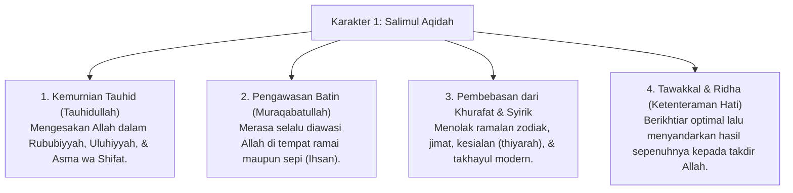

# P3-04-Salimul-Aqidah-Induk (Karakter 1: Aqidah yang Bersih & Lurus)

## Tujuan
Menetapkan kerangka kapasitas menyeluruh untuk **Karakter 1: Salimul Aqidah (Aqidah yang Bersih & Lurus)** dalam ekosistem pesantren TUMBUH, membangun fondasi tauhid murni yang kokoh, kesadaran pengawasan Allah (*Muraqabatullah*), keikhlasan beramal, serta kemerdekaan jiwa dari segala bentuk syirik, takhayul, dan ketergantungan pada selain Allah.

---

## 1. 4 Dimensi Karakter Salimul Aqidah

---

## 2. Matriks Rubrik 4 Level Capaian Salimul Aqidah

| Dimensi Perilaku | Level 1: Emerging (T1) | Level 2: Developing (T2) | Level 3: Proficient (T3) | Level 4: Exemplary (T4 - Qudwah) |
| :--- | :--- | :--- | :--- | :--- |
| **Muraqabatullah (Integritas Saat Sendiri)** | Jujur hanya jika ada musyrif/guru di dekatnya. | Menghindari pelanggaran saat sendiri, namun masih tergoda jika diajak teman. | Konsisten menjaga adab & amanah meski berada di tempat sepi tanpa pengawasan. | Mengajak dan mengingatkan teman sekamar untuk selalu merasa diawasi Allah (*Tawashau bil Haq*). |
| **Bebas Syirik & Takhayul** | Masih percaya ramalan zodiak / mitos hari sial secara tidak sadar. | Menolak jimat/mitos setelah diberi penjelasan dalil oleh asatidz. | Tegas menolak segala bentuk tahayul dan meyakini hanya Allah pengatur takdir. | Menjadi rujukan diskusi aqidah yang menenangkan dan meluruskan syubhat teman. |
| **Doa & Tawakkal** | Berdoa hanya saat menjelang ujian / butuh sesuatu yang mendesak. | Rutin membaca doa harian dan dzikir pagi-petang (*Al-Ma'tsurat*). | Ikhlas berikhtiar maksimal dan berlapang dada menerima takdir Allah (*Ridha*). | Menginspirasi ketenangan ruhiyah dan keikhlasan beramal bagi seluruh santri asrama. |

---

## 3. Protokol Pembiasaan di Asrama (PBIS Tier 1)

1. **Dzikir Al-Ma'tsurat Berjamaah**: Dibaca rutin setiap ba'da Shubuh dan ba'da Ashar di masjid untuk membentengi aqidah santri.
2. **Kajian Tematik Aqidah Aqliyyah**: Membedah dalil-dalil penciptaan alam semesta (*Ayat Kauniyah*) untuk membangun keyakinan rasional yang kokoh.
3. **Pemberian Apresiasi Kejujuran (Poin Kebaikan)**: Musyrif memberikan apresiasi khusus bagi santri yang berani jujur mengakui kekhilafan secara sukarela karena takut kepada Allah.

---

## 4. Status Dokumen
* **Status**: 🌟 **A+ (Dokumen Induk Salimul Aqidah)**
* **Level**: Project 3 - `03 Capacity Framework / ./P3-04-01-Filosofi-dan-Landasan-Turats.md`**.
