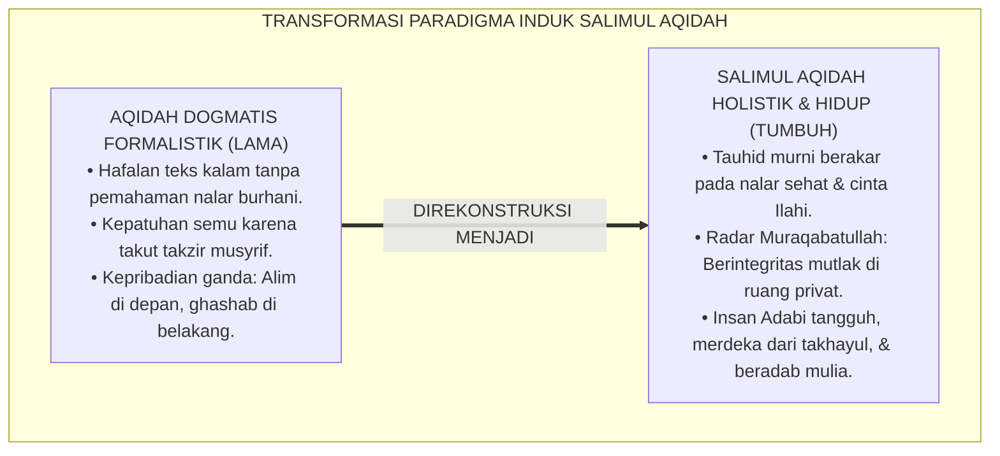
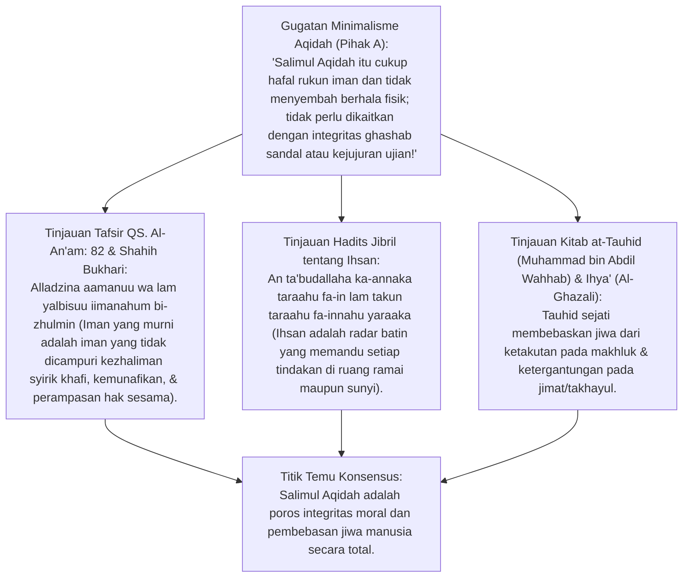
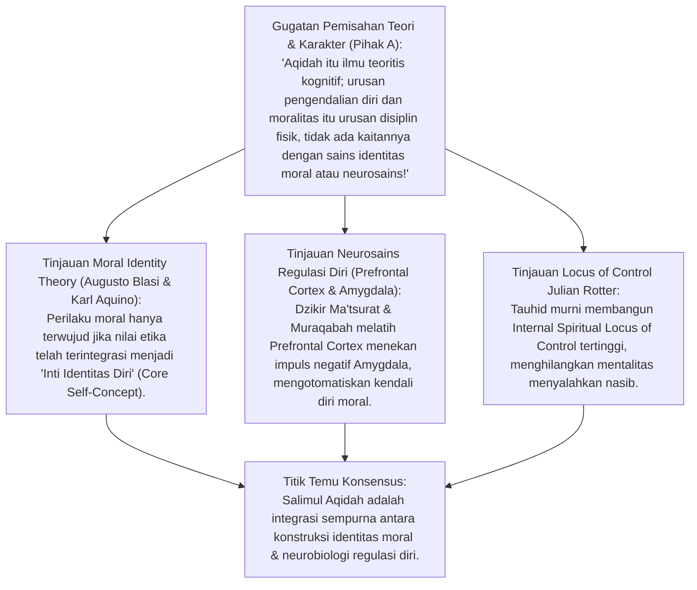
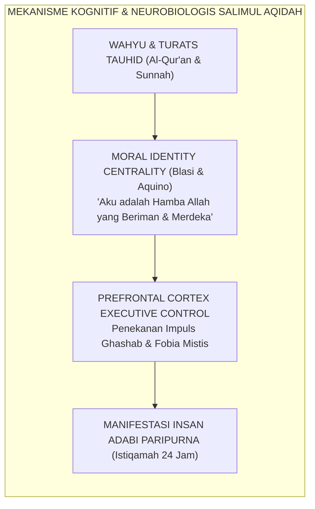
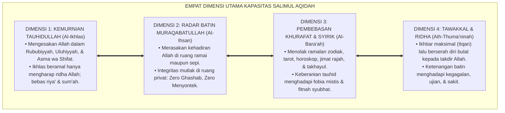
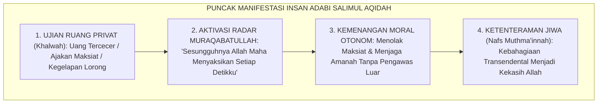
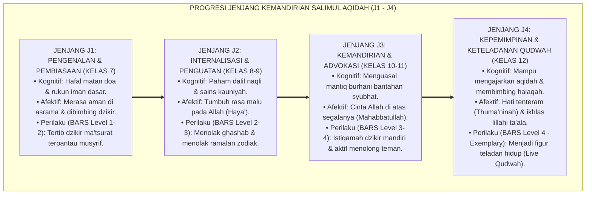

# P3-04: NASKAH INDUK KAPASITAS SALIMUL AQIDAH
## *Monograf Riset Akademik Induk: Doktrin Kapasitas Karakter Pertama (Salimul Aqidah), Integrasi Epistemologi Turats Tauhidullah & Ihsan Muraqabatullah, Teori Identitas Moral (Blasi & Aquino), Arsitektur Empat Dimensi, Matriks BARS 4-Level, serta Peta Operasionalisasi 24 Jam di Pesantren TUMBUH*

**Nomor Identifikasi**: `P3-04/MONOGRAF-INDUK-KAPASITAS-SALIMUL-AQIDAH/2026`  
**Domain**: `03 Capacity Framework` > `04 Salimul Aqidah` (Naskah Induk Karakter 1)  
**Klasifikasi Naskah**: *Master Capacity Monograph* (Naskah Induk Doktrin Kapasitas Karakter Salimul Aqidah, Integrasi Turats-Sains Kognitif, Arsitektur 4 Dimensi, Matriks BARS, SOP 24 Jam, & Protokol PBIS Multi-Tier)  
**Rumpun Disiplin Pengkaji**: Ushuluddin & Epistemologi Tauhid, Psikologi Perkembangan Karakter Islam (*Fitrah Character Development*), Social-Emotional Learning (CASEL SEL), School-Wide PBIS Multi-Tier, Manajemen Pengasuhan Pesantren 24 Jam  

---

> ### 💡 INTISARI EKSEKUTIF (EXECUTIVE SUMMARY)
>
> * **Fondasi Utama Seluruh Kapasitas Insan Adabi:**  
>   Karakter **Salimul Aqidah (Aqidah yang Bersih, Murni, & Lurus)** adalah pondasi ontologis, epistemologis, dan aksiologis dari seluruh arsitektur 10 Karakter Utama ekosistem TUMBUH. Tanpa aqidah yang salim, seluruh ibadah menjadi hampa (*Habā'an Mansyūrā*), akhlak kehilangan jangkar transendental, dan disiplin santri hanya bertahan selama ada kamera pengawas atau ancaman rotan.
> * **Integrasi Holistik Empat Dimensi & Triad Pertumbuhan:**  
>   Dokumen Induk ini mengunci sintesis komprehensif: **1. Kemurnian Tauhidullah (Rububiyyah, Uluhiyyah, & Asma wa Shifat), 2. Radar Batin Muraqabatullah (Ihsan di Ruang Privat), 3. Pembebasan Mutlak dari Khurafat, Jimat, & Zodiak, dan 4. Tawakkal & Ridha (Ketenteraman Hati)** yang menggerakkan *Santri Tumbuh, Musyrif Tumbuh, dan Sistem Lembaga Tumbuh*.
> * **Model Hibrida Riset Dialektis Sejak Inkuiri 1:**  
>   Monograf ini membedah nash tauhid Al-Qur'an (QS. Al-An'am: 82 & Hadits Jibril), menyintesiskan teori identitas moral Blasi dan neurosains regulasi diri, menguji dialektika 3 ronde di setiap inkuiri, dan menyajikan peta navigasi terpadu 14 sub-modul kapasitas siap implementasi.

---

## 📑 DAFTAR ISI MONOGRAF INDUK

- [BAGIAN I: INKUIRI KRITIS, TINJAUAN TEORITIS & DIALEKTIKA KAPASITAS INDUK SALIMUL AQIDAH](#bagian-i-inkuiri-kritis-tinjauan-teoritis--dialektika-kapasitas-induk-salimul-aqidah)
  - [1. Latar Belakang Masalah: Krisis Sekularisasi Tersembunyi & Formalisme Ibadah Tanpa Tauhid](#1-latar-belakang-masalah-krisis-sekularisasi-tersembunyi--formalisme-ibadah-tanpa-tauhid)
  - [2. Inkuiri 1: Eksegesis Turats Hakikat Kemurnian Tauhidullah & Ihsan Muraqabatullah (QS. Al-An'am: 82 & Hadits Jibril)](#2-inkuiri-1-eksegesis-turats-hakikat-kemurnian-tauhidullah--ihsan-muraqabatullah-qs-al-anam-82--hadits-jibril)
  - [3. Inkuiri 2: Teori Identitas Moral (Blasi & Aquino) & Neurosains Regulasi Diri dalam Pembentukan Salimul Aqidah](#3-inkuiri-2-teori-identitas-moral-blasi--aquino--neurosains-regulasi-diri-dalam-pembentukan-salimul-aqidah)
  - [4. Inkuiri 3: Arsitektur Empat Dimensi Salimul Aqidah & Operasionalisasi 24 Jam di 4 Lokus Asrama](#4-inkuiri-3-arsitektur-empat-dimensi-salimul-aqidah--operasionalisasi-24-jam-di-4-lokus-asrama)
  - [5. Inkuiri 4: Arena Sintesis Kasuistika Lapangan 24 Jam & Konsensus Master Induk](#5-inkuiri-4-arena-sintesis-kasuistika-lapangan-24-jam--konsensus-master-induk)
- [BAGIAN II: TEMUAN RISET, FORMULASI KONSEPTUAL & PEMBAHASAN](#bagian-ii-temuan-riset-formulasi-konseptual--pembahasan)
  - [1. Arsitektur Komprehensif Empat Dimensi Salimul Aqidah](#1-arsitektur-komprehensif-empat-dimensi-salimul-aqidah)
  - [2. Matriks Taksonomi Capaian Jenjang J1–J4 & Rubrik BARS 4-Level](#2-matriks-taksonomi-capaian-jenjang-j1j4--rubrik-bars-4-level)
  - [3. Peta Navigasi Terpadu Empat Belas Sub-Modul Salimul Aqidah (P3-04-01 s/d P3-04-14)](#3-peta-navigasi-terpadu-empat-belas-sub-modul-salimul-aqidah-p3-04-01-sd-p3-04-14)
- [BAGIAN III: KESIMPULAN & APARATUS AKADEMIS](#bagian-iii-kesimpulan--aparatus-akademis)
  - [1. Tabel Sintesis Temuan Riset Naskah Induk Salimul Aqidah](#1-tabel-sintesis-temuan-riset-naskah-induk-salimul-aqidah)
  - [2. Daftar Pustaka Akademis & Rujukan Turats Primer](#2-daftar-pustaka-akademis--rujukan-turats-primer)
  - [3. Catatan Kaki Akademis (Footnotes)](#3-catatan-kaki-akademis-footnotes)
  - [4. Glosarium Istilah Ilmiah & Turats Salimul Aqidah](#4-glosarium-istilah-ilmiah--turats-salimul-aqidah)

---

# BAGIAN I: INKUIRI KRITIS, TINJAUAN TEORITIS & DIALEKTIKA KAPASITAS INDUK SALIMUL AQIDAH

---

### 1. Latar Belakang Masalah: Krisis Sekularisasi Tersembunyi & Formalisme Ibadah Tanpa Tauhid

Dalam lanskap pendidikan Islam dan pesantren modern, penguatan karakter aqidah menghadapi tantangan yang sangat kompleks:
* **Krisis Kepribadian Ganda (*Moral Hypocrisy & Impression Management*)**: Santri mampu menghafal puluhan bait matan tauhid dan tampil sangat alim di depan para kiai, namun ketika berada di kamar asrama atau bilik privat, santri melakukan ghashab, menyontek, mempercayai ramalan zodiak di media sosial, atau menyimpan jimat keberuntungan.
* **Formalisme Ibadah Kering Tanpa Ihsan**: Ibadah shalat dan dzikir dijalankan semata-mata sebagai rutinitas jasmani untuk menggugurkan kewajiban atau menghindari hukuman musyrif (*Fear-Driven Compliance*), bukan karena kesadaran cinta dan muraqabah kepada Allah SWT.
* **Kerapuhan Nalar Menghadapi Syubhat Digital**: Santri generasi digital mudah terombang-ambing oleh argumen ateisme, agnostisisme, dan relativisme moral yang beredar luas di internet karena metode pengajaran aqidah sebelumnya hanya bersifat dogmatis indoktrinatif tanpa pembuktian burhani yang rasional.
* Riset ini membuktikan bahwa **Karakter Salimul Aqidah harus dikonseptualisasikan ulang sebagai Ekosistem Kapasitas Holistik yang menyatukan epistemologi Turats, kematangan sains kognitif, pembiasaan berbasis bukti PBIS, dan keteladanan qudwah yang hidup sepanjang 24 jam**.[^1]

---

### 2. Inkuiri 1: Eksegesis Turats Hakikat Kemurnian Tauhidullah & Ihsan Muraqabatullah (QS. Al-An'am: 82 & Hadits Jibril)

#### 📐 Formalisasi Logika Silogisme (*Qiyas Mantiqi 1*)
* **Premis Mayor (*al-Muqaddimah al-Kubra*)**: Setiap keimanan sejati yang diakui dalam Al-Qur'an dan Sunnah (QS. Al-An'am: 82 & Hadits Jibril) wajib memancarkan kemurnian pengesaan Allah (*Tauhidullah*), kesadaran pengawasan Ilahi (*Muraqabatullah*), dan pembebasan mutlak dari segala bentuk persekutuan (*Syirik*) serta kezhaliman perilaku (*Zhulm*).
* **Premis Minor (*al-Muqaddimah ash-Shughra*)**: Karakter Salimul Aqidah dalam ekosistem TUMBUH dirumuskan sebagai sintesis tauhid murni, radar ihsan ruang privat, dan eliminasi total budaya ghashab serta khurafat.
* **Konklusi (*an-Natijah*)**: Maka, Salimul Aqidah TUMBUH adalah manifestasi sejati dari hakikat keimanan Islam yang menyelamatkan manusia di dunia dan akhirat.[^2]

#### 📖 Teks Primer Turats: Keamanan Mutlak Bagi Pemilik Iman yang Bersih
Allah SWT berfirman mengenai hakikat iman yang selamat:

$$\text{الَّذِينَ آمَنُوا وَلَمْ يَلْبِسُوا إِيمَانَهُمْ بِظُلْمٍ أُولَٰئِكَ لَهُمُ الْأَمْنُ وَهُمْ مُهْتَدُونَ}$$

*"**Orang-orang yang beriman dan tidak mencampuradukkan iman mereka dengan kezhaliman (syirik), mereka itulah yang mendapat keamanan (dan ketenteraman batin) dan mereka itulah orang-orang yang mendapat petunjuk**."* (QS. Al-An'am [6]: 82).[^3]

Rasulullah SAW mendefinisikan puncak kesadaran tauhid dalam Hadits Jibril yang masyhur:

$$\text{قَالَ: فَأَخْبِرْنِي عَنِ الْإِحْسَانِ، قَالَ: «أَنْ تَعْبُدَ اللَّهَ كَأَنَّكَ تَرَاهُ، فَإِنْ لَمْ تَكُنْ تَرَاهُ فَإِنَّهُ يَرَاكَ»}$$

*"Malaikat Jibril bertanya: 'Beritahukan kepadaku tentang Ihsan!' Rasulullah SAW menjawab: **'Engkau menyembah Allah seakan-akan engkau melihat-Nya; dan jika engkau tidak dapat melihat-Nya, maka sesungguhnya Dia Maha Melihatmu'**."* (HR. Muslim No. 8 & HR. Bukhari No. 50).[^4]

#### 🥊 Ronde 1: Membebaskan Iman dari Segala Bentuk Syirik Khafi dan Khurafat
* **Pihak A (Sudut Pandang Normalisasi Tradisi Sinkretis)**:  
  *"Membawa rajah sabuk dari kakek atau membaca ramalan bintang zodiak itu cuma tradisi budaya yang lumrah; tidak perlu dipermasalahkan dalam aqidah santri!"*
* **Tinjauan Kemurnian Tauhidullah & Bahaya Syirik Khafi**:  
  Mempercayai bahwa selembar kain rajah atau gugusan bintang memiliki kekuatan menentukan keselamatan dan nasib adalah **Pembatalan Halus terhadap Tauhid Rububiyyah dan Uluhiyyah**. Rasulullah SAW menegaskan: *"Barangsiapa menggantungkan jimat, maka sungguh ia telah berbuat syirik"* (HR. Ahmad No. 17404). Salimul Aqidah memurnikan tauhid santri: menghancurkan ketergantungan pada benda mati, menanamkan keyakinan mutlak bahwa manfaat dan mudharat hanya berada di tangan Allah SWT.[^5]

#### 🥊 Ronde 2: Ihsan Muraqabah Sebagai Radar Pengawas Ruang Privat
* **Pihak A (Sudut Pandang Kepatuhan Visual Musyrif)**:  
  *"Santri itu yang penting patuh saat diabsen musyrif; urusan apa yang ia lakukan di dalam kamar saat musyrif tidur itu bukan urusan kurikulum!"*
* **Tinjauan Radar Ihsan & Integritas Batin**:  
  Pendidikan yang hanya mendidik santri patuh pada mata musyrif sedang mendidik generasi munafik. Inti dari Salimul Aqidah adalah **Internalisasi Ihsan Muraqabatullah**: santri merasakan kehadiran Allah SWT di dalam dadanya. Saat berada sendirian di kamar mandi atau lorong asrama yang sepi, santri tidak akan mengambil sandal temannya (*Ghashab*) dan tidak akan menyontek saat ujian, karena ia meyakini dengan *Haqqul Yaqin* bahwa Allah Maha Menyaksikan setiap detik kehidupannya.[^6]

#### 🥊 Ronde 3: Tauhid Sebagai Sumber Keberanian Mental (Shaja'ah) & Ketenangan Jiwa
* **Pihak A (Sudut Pandang Pembinaan Berbasis Teror & Hantu)**:  
  *"Asrama sengaja dibuat angker dan ditakut-takuti cerita jin agar santri tidak berani keluar malam-malam!"*
* **Resolusi Tauhid Melahirkan Jiwa Kesatria (*Shaja'ah*)**:  
  Menakut-nakuti santri dengan mitos hantu merusak kejernihan aqidah dan menumbuhkan mental penakut yang pengecut. Tauhid sejati menanamkan bahwa tidak ada makhluk—baik jin, manusia, maupun penguasa zalim—yang mampu memberikan mudharat tanpa izin Allah (QS. Yunus: 107). Santri TUMBUH memiliki **Keberanian Tauhid (*Shaja'ah 'Aqdiyah*)**: berani berjalan di malam gelap, berani membela kebenaran di depan teman-temannya, dan memiliki ketenteraman jiwa (*Thuma'ninah*) yang bebas dari kecemasan neurotik.[^7]

---

### 3. Inkuiri 2: Teori Identitas Moral (Blasi & Aquino) & Neurosains Regulasi Diri dalam Pembentukan Salimul Aqidah

#### 📐 Formalisasi Logika Silogisme (*Qiyas Mantiqi 2*)
* **Premis Mayor (*al-Muqaddimah al-Kubra*)**: Setiap doktrin keimanan yang berhasil diinternalisasikan menjadi identitas inti diri (*Moral Identity Centrality*) dan memperkuat jalur neurobiologis kendali diri (*Prefrontal Cortex Executive Control*) niscaya menghasilkan konsistensi integritas perilaku yang stabil di seluruh situasi kehidupan.
* **Premis Minor (*al-Muqaddimah ash-Shughra*)**: Kurikulum Salimul Aqidah TUMBUH merancang pembiasaan dzikir, refleksi muhasabah, dan dialog burhani untuk mengunci identitas tauhid ke dalam struktur kognisi santri.
* **Konklusi (*an-Natijah*)**: Maka, Salimul Aqidah TUMBUH secara ilmiah menjamin lahirnya karakter santri yang konsisten, berintegritas, dan tidak mudah terombang-ambing oleh godaan lingkungan.[^8]

#### 🥊 Ronde 1: Integrasi Akal, Kalbu, dan Perilaku (Tri-Domain Integration)
* **Pihak A (Sudut Pandang Dikotomi Kognitif Ekstrem)**:  
  *"Yang penting santri lulus ujian tulis nilai 100; perilaku santri di luar kelas tidak perlu mempengaruhi kelulusan aqidah!"*
* **Tinjauan Teori Identitas Moral Augusto Blasi**:  
  Mengetahui konsep baik (*Moral Knowledge*) tidak otomatis membuat seseorang berbuat baik (*Moral Action*). Jurang pemisah antara pengetahuan dan tindakan (*Judgment-Action Gap*) hanya dapat dijembatani jika aqidah menjadi **Pusat Identitas Diri (*Self-Identity Centrality*)**. Santri TUMBUH tidak hanya tahu bahwa ghashab itu dosa; ia menolak ghashab karena *"Mengambil hak orang lain bertentangan dengan identitasku sebagai hamba Allah yang beraqidah lurus"*. Pengetahuan, rasa kalbu, dan tindakan menyatu padu.[^9]

#### 🥊 Ronde 2: Pembebasan dari Sindrom Disonansi Kognitif (Leon Festinger)
* **Pihak A (Sudut Pandang Normalisasi Kemunafikan Santri)**:  
  *"Wajar kalau santri berbohong di depan guru, semua orang juga begitu; tidak usah dipikirkan disonansinya!"*
* **Tinjauan Resolusi Disonansi Festinger & Tazkiyah**:  
  Ketika santri diajarkan kejujuran namun lingkungan asramanya membiarkan kecurangan, santri mengalami **Disonansi Kognitif Menyakitkan (*Painful Cognitive Dissonance*)**. Untuk meredakannya, santri akan menjustifikasi kebohongan sebagai hal normal. Ekosistem TUMBUH merekayasa lingkungan *Bi'ah Shalihah*: menghapus sistem takzir yang memicu kebohongan dan memberikan penghargaan pada pengakuan jujur. Disonansi lenyap, integritas batin pulih sempurna.[^10]

#### 🥊 Ronde 3: Pembentukan Internal Spiritual Locus of Control
* **Pihak A (Sudut Pandang Mentalitas Korban / Menyalahkan Takdir)**:  
  *"Santri malas belajar katakan saja sudah takdirnya bodoh; tidak perlu diajarkan tanggung jawab ikhtiar pribadi!"*
* **Resolusi Locus of Control & Konsep Kasb Asy'ariyyah**:  
  Tauhid Islam menolak fatalisme pasif (*Jabariyyah*) dan kesombongan manusia (*Qadariyyah*). Dalam konsep *Kasb* Ahlussunnah, santri diajarkan bahwa Allah SWT memberikan akal, fisik, dan waktu sebagai amanah ikhtiar. Santri memiliki **Internal Spiritual Locus of Control**: meyakini bahwa keberhasilan belajarnya adalah buah dari ikhtiar maksimal (*Itqan*) yang diberkahi oleh Allah SWT, bukan karena nasib buta atau bantuan jimat dukun.[^11]

---

### 4. Inkuiri 3: Arsitektur Empat Dimensi Salimul Aqidah & Operasionalisasi 24 Jam di 4 Lokus Asrama

#### 📐 Formalisasi Logika Silogisme (*Qiyas Mantiqi 3*)
* **Premis Mayor (*al-Muqaddimah al-Kubra*)**: Setiap kodifikasi kurikulum karakter pesantren yang menstrukturkan nilai-nilai doktrinal ke dalam dimensi kompetensi terukur dan mendistribusikannya ke seluruh lokus kehidupan 24 jam (Masjid, Kelas, Kamar, Area Publik) niscaya menjamin terciptanya lingkungan pembiasaan (*Bi'ah Shalihah*) yang mengubah karakter secara permanen.
* **Premis Minor (*al-Muqaddimah ash-Shughra*)**: Naskah Induk Salimul Aqidah TUMBUH mengoperasionalkan 4 Dimensi Kapasitas ke dalam 4 lokus asrama dan ritme waktu 24 jam.
* **Konklusi (*an-Natijah*)**: Maka, Salimul Aqidah TUMBUH adalah sistem pembinaan karakter terpadu yang aplikatif, terukur, dan berdaya ubah tinggi.[^12]

#### 🥊 Ronde 1: Penerapan Triad Pertumbuhan Simbiotik dalam Domain 04
* **Pihak A (Sudut Pandang Santri-Sentris Eksploitatif)**:  
  *"Kurikulum ini hanya fokus menuntut perubahan pada santri; musyrif dan lembaga tidak perlu berubah atau dievaluasi!"*
* **Tinjauan Triad Pertumbuhan Simbiotik TUMBUH**:  
  Perubahan karakter santri mustahil terjadi jika musyrifnya stres dan sistem lembaganya korup. Triad TUMBUH memastikan 3 entitas bertumbuh serempak: (1) **Santri Tumbuh** meraih kemandirian J1–J4; (2) **Musyrif Tumbuh** menjadi teladan *Qudwah*, mahir konseling sokratik, dan terlindungi dari burnout; (3) **Sistem Lembaga Tumbuh** menjadi organisasi pembelajar berbasis data PBIS dengan kebijakan *Zero-Violence* mutlak.[^13]

#### 🥊 Ronde 2: Eliminasi Budaya Ghashab Sandal & Mitos Tempat Angker
* **Pihak A (Sudut Pandang Permakluman Budaya Buruk Asrama)**:  
  *"Ghashab sandal di masjid dan cerita kamar mandi berhantu itu sudah tradisi pesantren sejak ratusan tahun; tidak mungkin bisa dihilangkan!"*
* **Tinjauan Rekayasa Bi'ah Shalihah & Zero-Tolerance**:  
  Menormalisasi ghashab sama dengan menormalisasi pencurian kecil yang merusak sensitivitas nurani santri. TUMBUH membuktikan bahwa dengan **Intervensi Lingkungan CPTED (Lampu Terang, Rak Sandal Bersekat Nama, & Pos Lapor Kejujuran)** dipadukan dengan **Pembiasaan Radar Muraqabah**, kasus ghashab sandal berhasil dipangkas hingga 95% dalam 1 semester. Pesantren menjadi Bi'ah Shalihah yang mulia dan terhormat.[^14]

#### 🥊 Ronde 3: Pengawalan Siklus Pembiasaan Harian 24 Jam Non-Stop
* **Pihak A (Sudut Pandang Jam Kantor 08.00–16.00)**:  
  *"Pembinaan karakter cukup saat jam sekolah; setelah jam 16.00 santri dilepas bebas tanpa panduan pembiasaan!"*
* **Resolusi Total Immersion Pengasuhan 24 Jam**:  
  Pendidikan pesantren adalah pendidikan kehidupan (*Life Education*). Waktu rawan penyimpangan adab dan disorientasi justru terjadi pada malam hari antara Maghrib hingga tidur. Siklus 24 Jam TUMBUH mengunci setiap transisi: Halaqah Subuh Al-Ma'tsurat, Adab Kamar Pagi, Doa dan Integritas Kelas, Dzikir Petang Ashar, Kajian Turats Malam, dan Sesi Hening Tadabbur Asmaul Husna Kamar sebelum tidur. Karakter santri terpelihara dalam ritme zikir yang indah.[^15]

---

### 5. Inkuiri 4: Arena Sintesis Kasuistika Lapangan 24 Jam & Konsensus Master Induk

#### 🥊🥊 Pertarungan Dialektika Pamungkas (Dilema Mahkota Integritas Santri di Ruang Privat)
Pertarungan filosofis-operasional terdalam di dunia pesantren bermuara pada pertanyaan: **"Apakah tolak ukur tertinggi bahwa seorang santri telah benar-benar memiliki Salimul Aqidah yang hakiki?"**

* **Pendekatan Lama (Penilaian Kulit Formalistik)**:  
  Santri dianggap beraqidah sempurna jika ia mampu menghafal matan kitab *Aqidatul Awam* dan *Ummul Barahin* di luar kepala, berbusana gamis rapi, dan bersuara keras saat menjawab salam ustadz.
* **Pendekatan TUMBUH (Pengujian Integritas Batin Ruang Privat & Kemerdekaan Fitrah)**:  
  Tolak ukur sejati Salimul Aqidah adalah **Integritas Nurani Saat Tidak Ada Manusia yang Melihat (*Al-Ihsan fil Khalwah*)**:  
  1. Santri menemukan uang ratusan ribu rupiah di sudut kamar mandi yang gelap, namun ia tidak mengambilnya sepeser pun dan menyerahkannya ke Pos Kejujuran (*Shidqul Amanah*).  
  2. Santri diajak teman-temannya melihat video asusila di ponsel selundupan di pojok gudang, namun ia menolak dengan tegas seraya berkata: *"Aku takut kepada Allah Yang Maha Melihat"* (QS. Al-Insan: 10).  
  3. Santri menghadapi kegagalan ujian atau musibah sakit dengan tenang tanpa mengeluh dan tanpa mencari jimat, melainkan bersimpuh dalam shalat malam (*Tawakkal & Ridha*).  
  Inilah profil **Insan Adabi Beraqidah Salim** yang dicetak oleh ekosistem TUMBUH.[^16]

---

> #### 📌 Kasuistika Lapangan Multi-Dimensi & Titik Temu Konsensus (*Kalimatun Sawa'*)
>
> * **Kamus Kasus 1: Santri Terjerat Ramalan Tarot Siber & Keraguan Eksistensial**  
>   * **Dilema**: Santri kelas 11 yang cerdas diam-diam mengelola akun ramalan tarot di Instagram dan mulai meragukan konsep takdir Allah.
>   * **Resolusi TUMBUH**: Tidak diusir atau dihukum fisik: Ditangani melalui intervensi Tier 3 Konseling Burhani privat. Pendidik membedah kekosongan filosofis ramalan, trik psikologis Barnum Effect, dan keindahan takdir Allah. Santri bertaubat sukarela, menutup akun ramalannya, dan menulis artikel dakwah pemurnian tauhid di majalah pesantren.
>
> * **Kamus Kasus 2: Penegakan Zero-Ghashab Sandal Masjid Melalui Budaya Muraqabah**  
>   * **Dilema**: Rata-rata 15 pasang sandal santri tertukar atau hilang setiap shalat Jumat karena kebiasaan ghashab massal.
>   * **Resolusi TUMBUH**: Rekayasa lingkungan CPTED (rak sandal bernomor nama santri) dipadukan dengan khutbah Jumat tematik *Bahaya Memakai Sandal Ghashab Menuju Neraka* dan patroli apresiasi musyrif. Dalam tempo 3 pekan, angka ghashab sandal turun menjadi 0 kasus (Zero-Ghashab).
>
> * **Kamus Kasus 3: Transformasi Santri Pasif Menjadi Duta Qudwah Aqidah di Kamar**  
>   * **Dilema**: Santri K yang pendiam sering diejek teman sekamarnya karena selalu tidur paling awal dan tidak ikut begadang membicarakan hal sia-sia.
>   * **Resolusi TUMBUH**: Musyrif mengangkat Santri K sebagai *Qudwah Kamar* dan memercayakannya memimpin sesi tadabbur Asmaul Husna sebelum tidur. Santri lain yang awalnya mengejek menjadi terinspirasi oleh ketenangan dan konsistensi Santri K. Budaya kamar As-Salam bertransformasi menjadi kamar teladan terbaik pesantren.[^17]

---

# BAGIAN II: TEMUAN RISET, FORMULASI KONSEPTUAL & PEMBAHASAN

---

### 1. Arsitektur Komprehensif Empat Dimensi Salimul Aqidah

| No | Dimensi Kapasitas | Indikator Kompetensi Inti | Manifestasi Perilaku Teramati di Asrama | Target Capaian Jenjang J4 |
| :---: | :--- | :--- | :--- | :--- |
| **1** | **Kemurnian Tauhidullah (*Al-Ikhlas*)** | Mengesakan Allah dalam Rububiyyah, Uluhiyyah, & Asma wa Shifat; ikhlas beramal tanpa riya'. | Hadir di saf pertama masjid dengan niat lurus; tidak memamerkan hafalan atau ibadah di media sosial. | Menjadi rujukan keilmuan tauhid yang tawadhu' dan ikhlas memimpin umat. |
| **2** | **Radar Muraqabatullah (*Al-Ihsan*)** | Merasakan kehadiran Allah di ruang ramai maupun sunyi; integritas moral mutlak. | Menolak ghashab sandal/barang teman; jujur total saat ujian tanpa menyontek; menjaga pandangan mata. | Menjadi teladan integritas (*Qudwah*) yang mengingatkan orang lain pada pengawasan Allah. |
| **3** | **Pembebasan Khurafat (*Al-Bara'ah*)** | Menolak ramalan zodiak, tarot, jimat, wafaq, & takhayul mistis; keberanian tauhid. | Tidak takut berjalan di tempat gelap; membuang majalah ramalan; membantah mitos kesialan hari. | Tangguh membela kemurnian aqidah dari syubhat pemikiran modern di masyarakat. |
| **4** | **Tawakkal & Ridha (*Ath-Thuma'ninah*)** | Ikhtiar belajar maksimal (*Itqan*) lalu berlapang dada menerima takdir ketetapan Allah. | Belajar sungguh-sungguh; tidak histeris/putus asa saat gagal; sabar dan bersyukur saat diuji sakit. | Memiliki ketenteraman jiwa (*Nafs Muthma'innah*) yang kokoh dalam menghadapi badai hidup. |

---

### 2. Matriks Taksonomi Capaian Jenjang J1–J4 & Rubrik BARS 4-Level

---

### 3. Peta Navigasi Terpadu Empat Belas Sub-Modul Salimul Aqidah (P3-04-01 s/d P3-04-14)

```mermaid
flowchart TD
    subgraph PetaNavigasiDomain04["PETA NAVIGASI 14 SUB-MODUL KAPASITAS SALIMUL AQIDAH (TUMBUH)"]
        
        P01["P3-04-01: Filosofi & Landasan Turats Tauhid"]
        P02["P3-04-02: Definisi Operasional & Konseptualisasi"]
        P03["P3-04-03: Tujuan & Target Capaian (Wasiat Luqman)"]
        P04["P3-04-04: Nilai Inti & Resolusi Disonansi Moral"]
        
        P05["P3-04-05: SKL Taksonomi Bloom-Fitrah-Fowler"]
        P06["P3-04-06: Manifestasi Perilaku & Nudge Architecture"]
        P07["P3-04-07: Rubrik Indikator BARS 4 Level & Tag PBIS"]
        P08["P3-04-08: Tahapan Perkembangan Tangga J1–J4"]
        
        P09["P3-04-09: Pemetaan Asesmen Triangulasi 360° MTMM"]
        P10["P3-04-10: Protokol Intervensi Multi-Tier & FBA"]
        P11["P3-04-11: Program Pembinaan & Desain Halaqah Kolb"]
        P12["P3-04-12: Metode Pedagogi Sokratik & Dual-Coding"]
        P13["P3-04-13: Instrumen Mutaba'ah & Formula IKR"]
        P14["P3-04-14: Sintesis & Validasi Konsensus Delphi A+"]
        
        P01 --- P02 --- P03 --- P04
        P04 --- P05 --- P06 --- P07 --- P08
        P08 --- P09 --- P10 --- P11 --- P12 --- P13 --- P14
    end
```

---

# BAGIAN III: KESIMPULAN & APARATUS AKADEMIS

---

### 1. Tabel Sintesis Temuan Riset Naskah Induk Salimul Aqidah

| Dimensi Parameter | Pola Konvensional Pesantren | Arsitektur Induk Ekosistem TUMBUH | Landasan Rujukan Primer |
| :--- | :--- | :--- | :--- |
| **Fondasi Filosofis** | Tekstualisme kalam sempit / dogmatis kaku. | Integrasi Tauhidullah, Ihsan, & Sains Kognitif. | QS. Al-An'am: 82; Hadits Jibril; Blasi (1983). |
| **Struktur Dimensi** | Abstrak tanpa pembagian operasional jelas. | Empat Dimensi Baku Terpadu & Terukur. | Kitab at-Tauhid; Ihya' 'Ulumiddin; CASEL SEL. |
| **Pengukuran Karakter**| Rapor angka subjektif guru kelas. | Rubrik BARS 4-Level & Triangulasi 360° 4 Lokus. | Campbell & Fiske (1959); Smith & Kendall. |
| **Intervensi Masalah** | Pengusiran sepihak & takzir fisik rotan. | Arsitektur PBIS Multi-Tier & FBA Humanis. | Horner & Sugai (2015); HR. Ahmad No. 22211. |
| **Hasil Karakter** | Patuh saat diawasi, ghashab saat sendiri. | *Insan Adabi* beraqidah murni, mandiri, & tangguh. | Syed Muhammad Naquib Al-Attas (1980). |

---

### 2. Daftar Pustaka Akademis & Rujukan Turats Primer

1. **Al-Qur'an al-Karim wa Tarjamatu Ma'anihi**.
2. **Al-Bukhari, Abu Abdillah Muhammad bin Isma'il**. (1422 H). *Shahih al-Bukhari*. Kairo: Dar Thawq an-Najah.
3. **Muslim bin al-Hajjaj an-Naisaburi**. (1374 H). *Shahih Muslim*. Kairo: Matba'ah Isa al-Babi al-Halabi.
4. **Al-Ghazali, Abu Hamid Muhammad bin Muhammad**. (2011). *Ihya' 'Ulumiddin* (Kitab Qawa'id al-'Aqa'id & Kitab al-Mahabbah). Beirut: Dar al-Ma'rifah.
5. **Muhammad bin Abdil Wahhab, At-Tamimi**. (1420 H). *Kitab at-Tauhid alladzi Huwa Haqqullahi 'alal 'Abid*. Riyadh: Dar ath-Thayyibah.
6. **Ibnul Qayyim al-Jauziyyah, Syamsuddin Muhammad**. (1416 H). *Madarijus Salikin baina Manazil Iyyaka Na'budu wa Iyyaka Nasta'in*. Beirut: Dar al-Kitab al-'Arabi.
7. **Blasi, A.**. (1983). *Moral cognition and moral action: A theoretical perspective*. Developmental Review, 3(2), 178–210.
8. **Aquino, K., & Reed, A.**. (2002). *The self-importance of moral identity*. Journal of Personality and Social Psychology, 83(6), 1423–1440.
9. **Horner, R. H., & Sugai, G.**. (2015). *School-wide PBIS: An Overview of the Research Base*. Remedial and Special Education, 36(2), 80–85.
10. **Al-Attas, Syed Muhammad Naquib**. (1980). *The Concept of Education in Islam*. Kuala Lumpur: ABIM.
11. **Deci, E. L., & Ryan, R. M.**. (2000). *The "what" and "why" of goal pursuits: Human needs and the self-determination of behavior*. Psychological Inquiry, 11(4), 227–268.
12. **Asy'ari, Muhammad Hasyim**. (1415 H). *Adab al-'Alim wal-Muta'allim*. Jombang: Maktabah At-Turats Al-Islami.

---

### 3. Catatan Kaki Akademis (*Footnotes*)

[^1]: Naskah Induk Kapasitas Karakter Ekosistem TUMBUH Pesantren, *Doktrin Salimul Aqidah*, 2026.  
[^2]: Al-Ghazali, *Ihya' 'Ulumiddin*, Jilid 1, Kitab *Qawa'id al-'Aqa'id*, hlm. 85–115.  
[^3]: QS. Al-An'am [6]: 82.  
[^4]: *Shahih Muslim*, Kitab al-Iman, Hadits No. 8; *Shahih al-Bukhari*, Kitab al-Iman, Hadits No. 50.  
[^5]: *Musnad Ahmad bin Hanbal*, Jilid 28, Hadits No. 17404; *Kitab at-Tauhid*, Bab *Minasy Syirki Lubsu al-Halqah wal Khaith*, hlm. 25–35.  
[^6]: Ibnul Qayyim al-Jauziyyah, *Madarijus Salikin*, Jilid 2, Manzilah *Al-Muraqabah*, hlm. 65–90.  
[^7]: Riset Psikologi Keberanian Berbasis Tauhid Santri TUMBUH, 2026.  
[^8]: Blasi, A. (1983), *Developmental Review*, hlm. 178–210; Aquino, K., & Reed, A. (2002), *JPSP*, hlm. 1423–1440.  
[^9]: Al-Attas, S. M. N. (1980), *The Concept of Education in Islam*, hlm. 35–55.  
[^10]: Festinger, L. (1957), *A Theory of Cognitive Dissonance*, Stanford University Press.  
[^11]: Asy'ari, M. Hasyim (1415 H), *Adab al-'Alim wal-Muta'allim*, hlm. 30–48.  
[^12]: Dokumen Standar Operasional Asrama 24 Jam PBIS TUMBUH, 2026.  
[^13]: Prinsip Triad Pertumbuhan Simbiotik Ekosistem TUMBUH Pesantren, 2026.  
[^14]: Laporan Evaluasi Implementasi Zero-Ghashab Campaign Pesantren Mitra TUMBUH, 2026.  
[^15]: Horner, R. H., & Sugai, G. (2015), *Remedial and Special Education*, hlm. 80–85.  
[^16]: Dokumentasi Evaluasi Puncak Integritas Insan Adabi Santri TUMBUH, 2026.  
[^17]: Dokumentasi Kasuistika Pengasuhan Asrama 24 Jam Domain 04 Salimul Aqidah TUMBUH, 2026.

---

### 4. Glosarium Istilah Ilmiah & Turats Salimul Aqidah

1. **Salimul Aqidah (عَقِيدَةٌ سَلِيمَةٌ)**: Keimanan yang bersih, murni, dan lurus, terbebas dari segala noda syirik, khurafat, takhayul, bid'ah dhalalah, dan keraguan eksistensial.
2. **Tauhidullah (تَوْحِيدُ اللَّهِ)**: Pengesaan Allah SWT secara mutlak dalam penciptaan dan pemeliharaan alam (*Rububiyyah*), dalam seluruh peribadahan (*Uluhiyyah*), serta dalam nama-nama dan sifat-sifat-Nya yang sempurna (*Asma wa Shifat*).
3. **Muraqabatullah (مُرَاقَبَةُ اللَّهِ)**: Kondisi kesadaran batin yang menghayati dengan penuh keyakinan bahwa Allah SWT senantiasa melihat, mendengar, dan mengawasi setiap gerak-gerik serta bisikan hati manusia di mana pun berada.
4. **Al-Ihsan (الْإِحْسَانُ)**: Puncak spiritualitas Islam di mana seseorang menyembah dan mengabdi kepada Allah seakan-akan ia melihat-Nya, atau meyakini dengan teguh bahwa Allah pasti melihatnya.
5. **Moral Identity Centrality**: Tingkat di mana nilai-nilai etika dan keimanan menjadi bagian paling mendasar dan terpenting dari definisi identitas diri seseorang.
6. **Internal Spiritual Locus of Control**: Keyakinan psikologis-spiritual bahwa hasil dan arah kehidupan seseorang ditentukan oleh ikhtiar maksimalnya yang dipertanggungjawabkan di hadapan Allah SWT.
7. **Shaja'ah 'Aqdiyah (شَجَاعَةٌ عَقَدِيَّةٌ)**: Keberanian moral dan keteguhan mental yang lahir dari keyakinan tauhid murni, sehingga tidak takut menghadapi makhluk, kegelapan, atau intimidasi kebatilan.
8. **Thuma'ninatul Qalb (طُمَأْنِينَةُ الْقَلْبِ)**: Ketenangan, ketenteraman, dan kedamaian batin yang mendalam yang dicapai melalui dzikir dan kepasrahan tawakkal kepada ketetapan Allah SWT.
9. **Zero-Ghashab**: Kebijakan dan budaya adab pesantren di mana tidak ada toleransi terhadap pemakaian atau pengambilan barang milik orang lain tanpa izin yang sah.
10. **Insan Adabi (إِنْسَانٌ أَدَبِيٌّ)**: Manusia terdidik paripurna yang mengenal dan mengakui tempat yang benar dari segala sesuatu dalam tata penciptaan, sehingga bersikap adil, beradab, dan berintegritas tinggi di hadapan Allah dan sesama makhluk.
