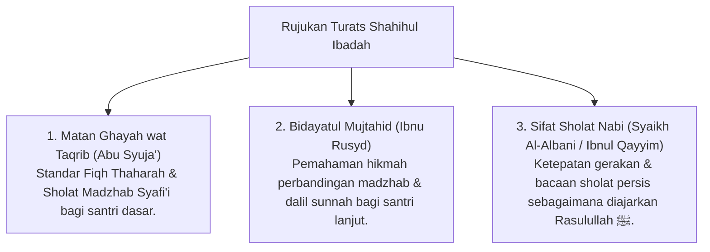

# P3-05-01-Filosofi-dan-Landasan-Turats (Shahihul Ibadah)

## Tujuan
Membedah landasan Fiqh Sunnah, syarat rukun sah ibadah mahdhah, dan rujukan kitab Turats Fiqh klasik mengenai hakikat **Shahihul Ibadah (Ibadah yang Benar Sesuai Sunnah Nabawiyyah)**.

---

## 1. Landasan Nash Al-Qur'an & As-Sunnah

### 1. QS. Al-Baqarah [2]: 43
> وَأَقِيمُوا الصَّلَاةَ وَآتُوا الزَّكَاةَ وَارْكَعُوا مَعَ الرَّاكِعِينَ
> *"Dan dirikanlah sholat, tunaikanlah zakat, dan ruku'lah beserta orang-orang yang ruku' (berjamaah)."*

### 2. HR. Bukhari (No. 631)
> صَلُّوا كَمَا رَأَيْتُمُونِي أُصَلِّي
> *"Sholatlah kalian sebagaimana kalian melihat aku sholat."*

---

## 2. Rujukan Khazanah Turats Klasik

---

## 3. Status Dokumen
* **Status**: 🌟 **A+ (Tervalidasi & Siap Diimplementasikan)**
* **Level**: Project 3 - `03 Capacity Framework / 05 Shahihul Ibadah / 01 Philosophy`
* **Langkah Berikutnya**: **`02 Definition/P3-05-02-Definisi-dan-Konseptualisasi.md`**.
