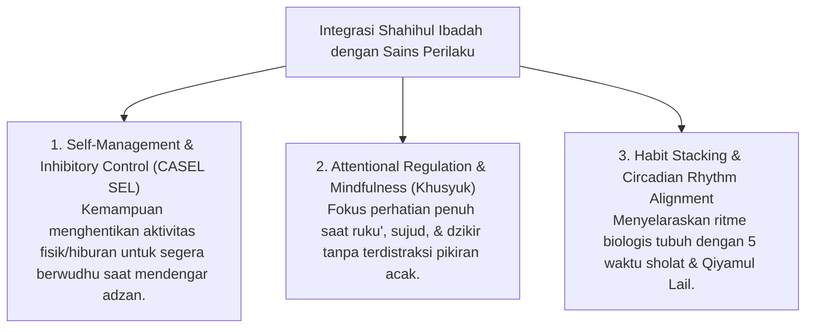

# P3-05-02-Definisi-dan-Konseptualisasi (Shahihul Ibadah)

## Tujuan
Menetapkan definisi operasional, batasan istilah, dan integrasi psikologis modern (*Self-Management, Ritual Behavior & Attentional Control*) dari karakter **Shahihul Ibadah** dalam pembinaan santri 24 jam.

---

## 1. Definisi Operasional Baku

> **Shahihul Ibadah dalam Ekosistem TUMBUH adalah:**  
> *"Kapasitas ketaatan santri dalam menjalankan seluruh rangkaian ibadah mahdhah (khususnya thaharah, sholat 5 waktu berjamaah, dan ibadah nawafil) secara presisi memenuhi syarat dan rukun syariat sesuai Sunnah Rasulullah ﷺ, yang dilaksanakan dengan tuma'ninah, khusyuk, serta melahirkan disiplin hidup pribadi."*

---

## 2. Integrasi Konsep Sains & CASEL SEL

---

## 3. Status Dokumen
* **Status**: 🌟 **A+ (Tervalidasi & Siap Diimplementasikan)**
* **Level**: Project 3 - `03 Capacity Framework / 05 Shahihul Ibadah / 02 Definition`
* **Langkah Berikutnya**: **`05 Competencies/P3-05-05-Standar-Kompetensi-dan-Taksonomi.md`**.
