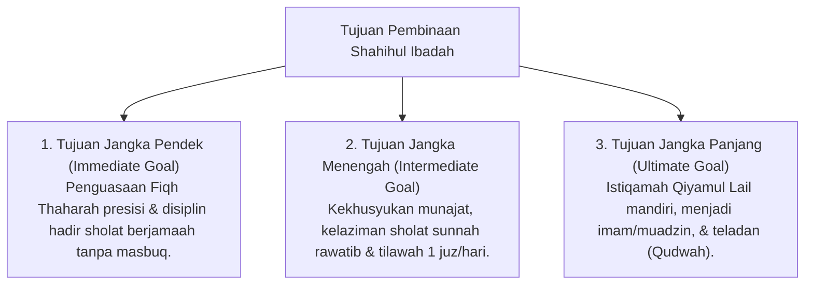

# P3-05-03-Tujuan-dan-Target-Capaian (Shahihul Ibadah)

## Tujuan
Menetapkan tujuan jangka pendek, menengah, dan panjang pembinaan karakter **Shahihul Ibadah** pada santri di lingkungan pesantren TUMBUH.

---

## 1. 3 Tingkatan Tujuan Pembinaan Ibadah

---

## 2. Target Capaian Kuantitatif & Kualitatif

1. **Target Kuantitatif**:
   - 95%+ santri sholat 5 waktu di masjid tepat waktu di shaf awal.
   - 100% santri menuntaskan tilawah Al-Qur'an minimal 1 juz per hari.
2. **Target Kualitatif**:
   - Terbentuknya *Malakah* kekhusyukan dan ketertiban adab masjid yang terbawa hingga ke luar pesantren.

---

## 3. Status Dokumen
* **Status**: 🌟 **A+ (Tervalidasi & Siap Diimplementasikan)**
* **Level**: Project 3 - `03 Capacity Framework / 05 Shahihul Ibadah / 03 Purpose`
