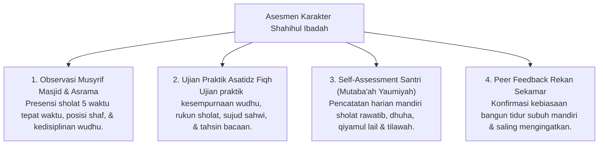

# P3-05-09-Pemetaan-Asesmen-dan-Triangulasi (Shahihul Ibadah)

## Tujuan
Menetapkan pemetaan instrumen asesmen dan metode triangulasi data 360 derajat untuk mengukur ketercapaian karakter **Shahihul Ibadah**.

---

## 1. Matriks Triangulasi Asesmen Karakter Ibadah

---

## 2. Status Dokumen
* **Status**: 🌟 **A+ (Tervalidasi & Siap Diimplementasikan)**
* **Level**: Project 3 - `03 Capacity Framework / 05 Shahihul Ibadah / 09 Assessment Mapping`
