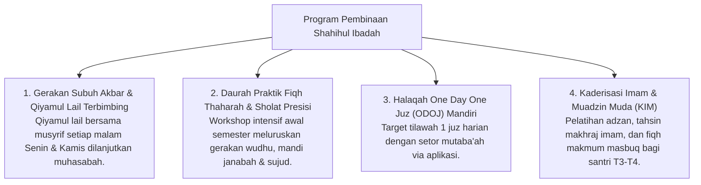

# P3-05-11-Program-Pembinaan-dan-Halaqah (Shahihul Ibadah)

## Tujuan
Menetapkan daftar program pembinaan terstruktur, halaqah ibadah, dan kegiatan pendukung karakter **Shahihul Ibadah** di pesantren TUMBUH.

---

## 1. 4 Program Unggulan Pembinaan Ibadah

---

## 2. Status Dokumen
* **Status**: 🌟 **A+ (Tervalidasi & Siap Diimplementasikan)**
* **Level**: Project 3 - `03 Capacity Framework / 05 Shahihul Ibadah / 11 Programs`
