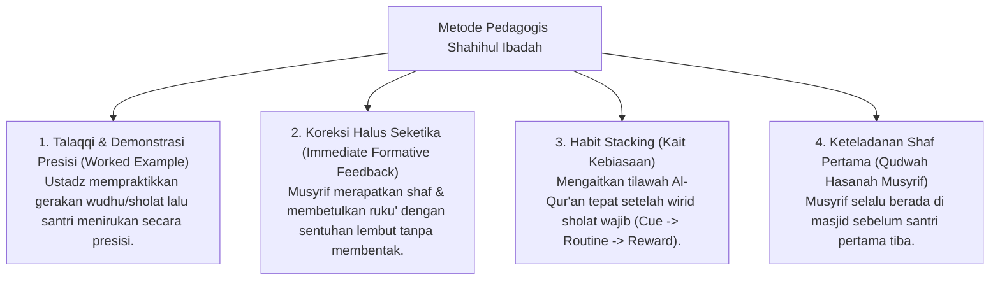

# P3-05-12-Metode-Pedagogi-dan-Didaktik-Ibadah (Shahihul Ibadah)

## Tujuan
Menetapkan metode pedagogi dan pendekatan didaktik interaktif dalam melatihkan ketepatan ibadah mahdhah dan adab masjid bagi santri.

---

## 1. 4 Metode Pedagogi Pengajaran Ibadah

---

## 2. Status Dokumen
* **Status**: 🌟 **A+ (Tervalidasi & Siap Diimplementasikan)**
* **Level**: Project 3 - `03 Capacity Framework / 05 Shahihul Ibadah / 12 Methods`
