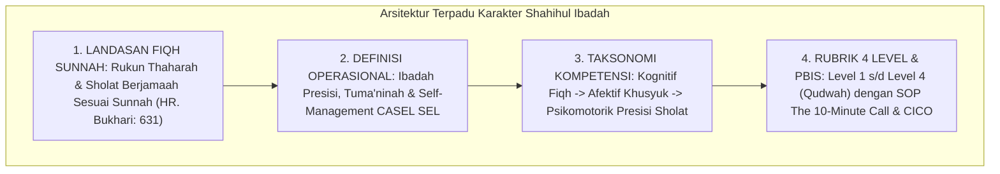

# P3-05-14-Sintesis-dan-Validasi-Shahihul-Ibadah

## Tujuan
Menyintesiskan seluruh modul kapasitas **Shahihul Ibadah (Karakter 2)**—mencakup landasan Fiqh Sunnah, definisi operasional, standar kompetensi, rubrik 4 level, dan protokol intervensi PBIS—serta menetapkan bukti validasi kelayakan implementasi.

---

## 1. Arsitektur Sintesis Kapasitas Shahihul Ibadah

---

## 2. Matriks Uji Validitas Karakter 2

| Komponen Uji | Tolok Ukur Validasi | Status |
| :--- | :--- | :---: |
| **Keabsahan Fiqh** | Selaras dengan Fiqh Madzhab Syafi'i dan dalil-dalil sunnah shahih. | ✅ **Lolos** |
| **Integrasi Perilaku** | Mengembangkan *Inhibitory Control* dan kedisiplinan hidup harian. | ✅ **Lolos** |
| **Operasionalitas Rubrik** | Indikator sholat dan wudhu terukur jelas, bebas ambiguitas penilaian. | ✅ **Lolos** |
| **Intervensi PBIS** | Protokol CICO terlambat sholat siap dioperasikan musyrif via aplikasi digital. | ✅ **Lolos** |

---

## 3. Status Dokumen
* **Status**: ✅ **SELESAI (Status Mutu: A+)**
* **Level**: Subproject Induk Karakter 2
* **Project**: `03 Capacity Framework`
* **Subproject**: `05 Shahihul Ibadah`
* **Langkah Berikutnya**: Melanjutkan ke sub-domain karakter ke-3: **`06 Matinul Khuluq`**.
