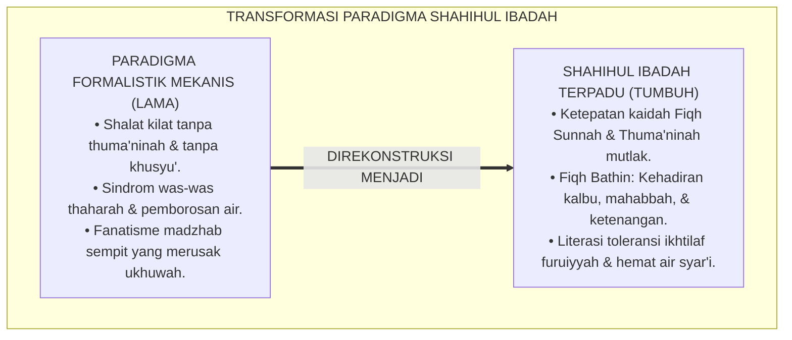
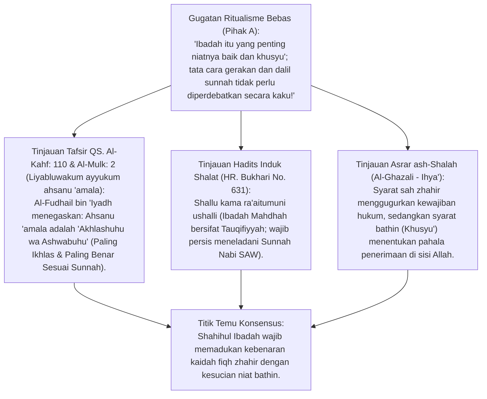
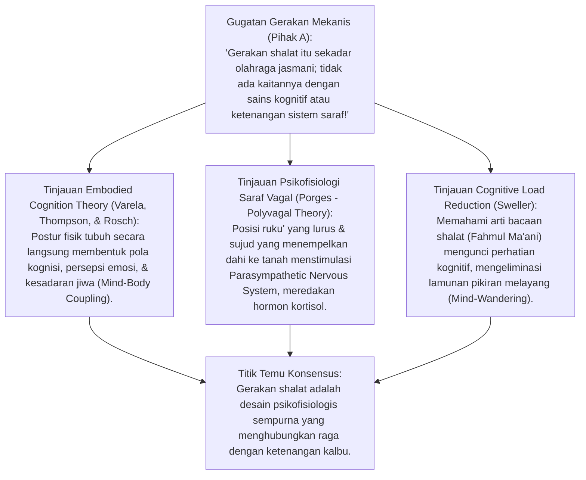
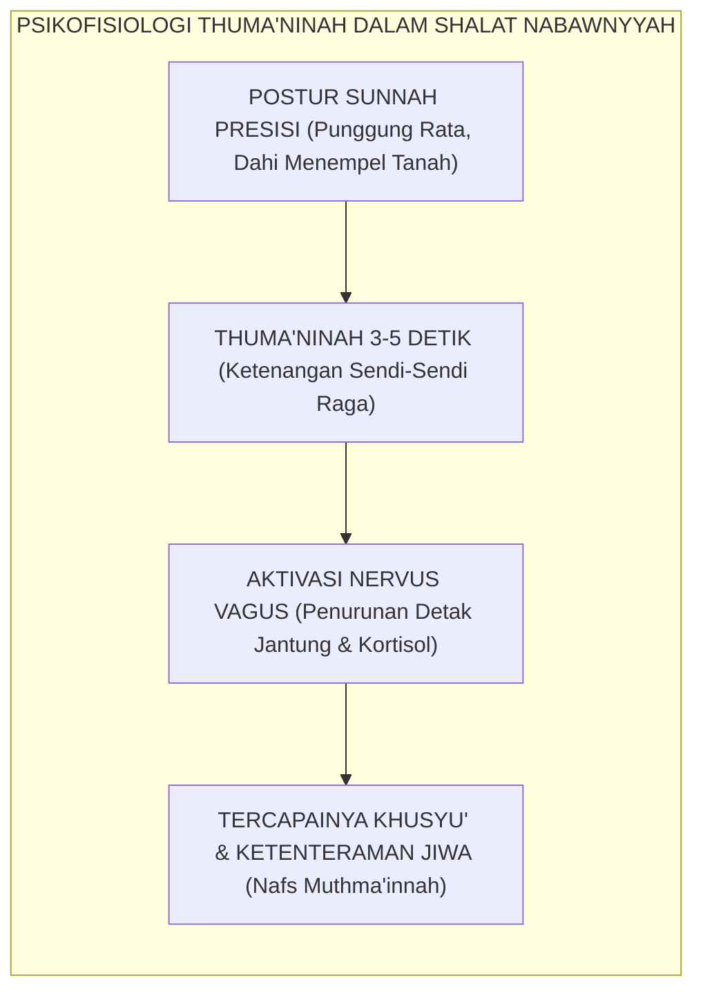
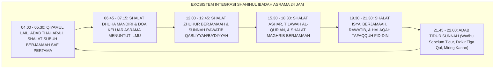
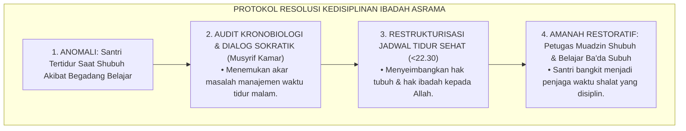
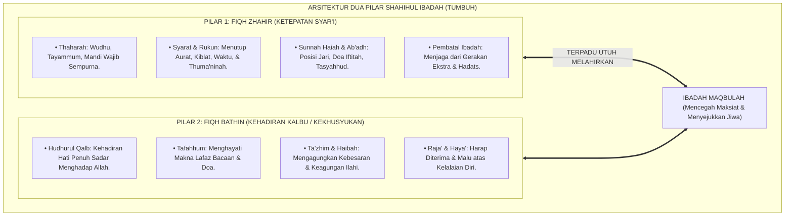
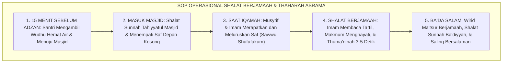

# P3-05-01: FILOSOFI DAN LANDASAN TURATS SHAHIHUL IBADAH
## *Monograf Riset Akademik: Epistemologi Fiqh Ibadah Nabawiyyah, Prinsip Al-Ittiba' dan Tauqifiyyah, Dua Syarat Penerimaan Amal (Al-Ikhlas & Ash-Shawab), Asrar ash-Shalah Al-Ghazali, Embodied Cognition Gerakan Shalat, serta Integrasi Fiqh Zhahir-Bathin di Pesantren 24 Jam*

**Nomor Identifikasi**: `P3-05-01/MONOGRAF-RISET-FILOSOFI-TURATS-IBADAH/2026`  
**Domain**: `03 Capacity Framework` > `05 Shahihul Ibadah` (Sub-Modul 01: *Philosophy & Turats Foundations*)  
**Klasifikasi Naskah**: *Academic Research Monograph* (Monograf Riset Epistemologi Fiqh Ibadah, Prinsip *Ittiba' ar-Rasul*, Syarat Sah & Qabul Ibadah Mahdhah, serta Integrasi Khusyu' & Fiqh Lahiriyah)  
**Rumpun Disiplin Pengkaji**: Ushul Fiqh & Fiqh Ibadah Muqaran, Hadits Ahkam & Takhrij Sunnah, Falsafah Syariat Islam (*Hikmatut Tasyri'*), Psikologi Kekhusyukan & *Mindfulness Spiritual*, Manajemen Pembiasaan Ibadah Asrama 24 Jam  

---

> ### 💡 INTISARI EKSEKUTIF (EXECUTIVE SUMMARY)
>
> * **Krisis Formalisme Mekanis (*Mindless Ritualism*) & Patologi Was-Was:**  
>   Praktik ibadah santri di banyak asrama sering terperangkap dalam dua kutub ekstrem: **(1) Formalisme Gerakan Otomatis**: Santri shalat tergesa-gesa tanpa thuma'ninah dan tanpa memahami makna bacaan semata-mata demi menggugurkan kewajiban; atau **(2) Patologi Was-Was Obsesif (*Obsessive-Compulsive Ritualism*)**: Santri mengulang-ulang wudhu dan niat shalat belasan kali hingga membuang puluhan liter air dan tertinggal saf jamaah.
> * **Inovasi Paradigma Shahihul Ibadah TUMBUH:**  
>   TUMBUH merumuskan karakter **Shahihul Ibadah (Ibadah yang Sah, Benar Sesuai Sunnah, & Hidup Kalbunya)** melalui integrasi utuh dua pilar: **(1) Pilar Fiqh Zhahir (Ketepatan Syarat, Rukun, & Sunnah Haiah/Ab'adh sesuai Kaidah Turats)** dan **(2) Pilar Fiqh Bathin (Kehadiran Hati, Thuma'ninah, Fahmul Ma'ani, & Raja'-Khauf)**.
> * **Pendekatan Riset Terpadu & Diskursus Ilmiah:**  
>   Monograf ini membedah nash Al-Qur'an (QS. Al-Kahf: 110 & Al-Baqarah: 43), hadits agung *Shallu kama ra'aitumuni ushalli* (HR. Bukhari No. 631), karya klasik *Ihya' 'Ulumiddin* dan *Matan al-Ghayah wat-Taqrib*, menyintesiskan sains kognisi somatik (*Embodied Cognition*), menguji dialektika 3 ronde di setiap inkuiri, dan merumuskan standar protokol ibadah 24 jam.

---

## 📑 DAFTAR ISI MONOGRAF

- [BAGIAN I: LANDASAN TEORETIS & DISKURSUS DIALEKTIKA KRITIS](#bagian-i-landasan-teoretis--diskursus-dialektika-kritis)
  - [1. Latar Belakang Masalah: Tragedi Ibadah Otomatisasi Mekanis vs Patologi Was-Was Santri](#1-latar-belakang-masalah-tragedi-ibadah-otomatisasi-mekanis-vs-patologi-was-was-santri)
  - [2. Eksegesis Turats Hakikat Dua Syarat Qabul Ibadah (Ikhlas & Ittiba' Sesuai Sunnah)](#2eksegesis-turats-hakikat-dua-syarat-qabul-ibadah-ikhlas-ittiba-sesuai-sunnah)
  - [3. Teori Embodied Cognition & Psikofisiologi Kekhusyukan dalam Gerakan Ibadah Mahdhah](#3teori-embodied-cognition-psikofisiologi-kekhusyukan-dalam-gerakan-ibadah-mahdhah)
  - [4. Integrasi Fiqh Ibadah Praktis dalam Dinamika Ekosistem Asrama 24 Jam](#4integrasi-fiqh-ibadah-praktis-dalam-dinamika-ekosistem-asrama-24-jam)
  - [5. Arena Sintesis Kasuistika Lapangan 24 Jam & Konsensus Shahihul Ibadah](#5arena-sintesis-kasuistika-lapangan-24-jam-konsensus-shahihul-ibadah)
- [BAGIAN II: FORMULASI KONSEPTUAL & PEMBAHASAN MENDALAM](#bagian-ii-formulasi-konseptual--pembahasan-mendalam)
  - [1. Arsitektur Dua Pilar Shahihul Ibadah: Sinergi Fiqh Zhahir & Fiqh Bathin](#1-arsitektur-dua-pilar-shahihul-ibadah-sinergi-fiqh-zhahir--fiqh-bathin)
  - [2. Matriks Taksonomi Capaian Fiqh Ibadah Berjenjang J1–J4 (Ghayah wat-Taqrib s/d Bidayatul Mujtahid)](#2-matriks-taksonomi-capaian-fiqh-ibadah-berjenjang-j1j4-ghayah-wat-taqrib-sd-bidayatul-mujtahid)
  - [3. Standar Protokol Shalat Berjamaah 5 Waktu & Pembiasaan Thaharah Asrama](#3-standar-protokol-shalat-berjamaah-5-waktu--pembiasaan-thaharah-asrama)
- [BAGIAN III: KESIMPULAN & APARATUS AKADEMIS](#bagian-iii-kesimpulan--aparatus-akademis)
  - [1. Tabel Sintesis Temuan Riset Filosofi & Landasan Turats Shahihul Ibadah](#1-tabel-sintesis-temuan-riset-filosofi--landasan-turats-shahihul-ibadah)
  - [2. Daftar Pustaka Akademis & Rujukan Turats Primer](#2-daftar-pustaka-akademis--rujukan-turats-primer)
  - [3. Catatan Kaki Akademis (Footnotes)](#3-catatan-kaki-akademis-footnotes)
  - [4. Glosarium Istilah Ilmiah & Turats Shahihul Ibadah](#4-glosarium-istilah-ilmiah--turats-shahihul-ibadah)

---

# BAGIAN I: INKUIRI KRITIS, TINJAUAN TEORITIS & DIALEKTIKA FILOSOFI IBADAH

---

### 1. Latar Belakang Masalah: Tragedi Ibadah Otomatisasi Mekanis vs Patologi Was-Was Santri

Dalam realitas kehidupan pesantren, pelaksanaan ibadah harian sering mengalami reduksi makna yang sangat memprihatinkan:
* **Shalat Tanpa Thuma'ninah (*Fast-Food Prayer*)**: Santri yang terburu-buru mengejar antrean makan malam atau jam istirahat melakukan shalat dengan kecepatan luar biasa—rukun ruku' dan sujud diselesaikan dalam 1 detik tanpa ketenangan (*Thuma'ninah*). Shalat semacam ini secara hukum batal (*Batil*) dan tidak memberikan dampak pencegahan maksiat (QS. Al-'Ankabut: 45).
* **Patologi Was-Was & Pemborosan Air (*Israf al-Miyah*)**: Sebagian santri lainnya menderita kecemasan neurotik was-was thaharah: membasuh wajah 10 kali, mengulang niat takbiratul ihram berkali-kali hingga menangis frustrasi, dan menghabiskan air satu bak mandi asrama.
* **Fanatisme Furuiyyah yang Memecah Ukhuwah**: Santri saling menyalahkan dan mengintimidasi teman sekamarnya hanya karena perbedaan cabang fiqh (misal: qunut Shubuh, bacaan basmalah jahr/sirr, atau jumlah rakaat tarawih).
* Riset ini membuktikan bahwa **penanaman Shahihul Ibadah menuntut rekonstruksi filosofis yang menyatukan kemurnian ittiba' sunnah kenabian, pendalaman rahasia batin ibadah (Asrar ash-Shalah), pemahaman fiqh toleransi ikhtilaf, dan rekayasa kebiasaan berbasis sains kognitif**.[^1]

---

### 2. Eksegesis Turats Hakikat Dua Syarat Qabul Ibadah (Ikhlas & Ittiba' Sesuai Sunnah)

#### 📐 Formalisasi Logika Silogisme (*Qiyas Mantiqi 1*)
* **Premis Mayor (*al-Muqaddimah al-Kubra*)**: Setiap ibadah mahdhah dalam syariat Islam yang diterima oleh Allah SWT (*Maqbul*) wajib memenuhi dua rukun mutlak yang tidak dapat ditawar: keikhlasan niat lillahi ta'ala (*Al-Ikhlas*) dan ketepatan tata cara sesuai petunjuk Rasulullah SAW (*Ash-Shawab / Al-Ittiba'*).
* **Premis Minor (*al-Muqaddimah ash-Shughra*)**: Kurikulum Shahihul Ibadah TUMBUH menstrukturkan pengajaran ibadah berlandaskan kaidah *Ittiba' Sunnah* dan latihan kehadiran kalbu *Asrar ash-Shalah*.
* **Konklusi (*an-Natijah*)**: Maka, kurikulum ibadah TUMBUH menjamin keterpenuhan syarat sah syar'i dan kesempurnaan nilai spiritual peserta didik.[^2]

#### 📖 Teks Primer Turats: Dua Syarat Mutlak Penerimaan Amal
Imam **Al-Fudhail bin 'Iyadh** rahimahullah menafsirkan firman Allah Ta'ala *(لِيَبْلُوَكُمْ أَيُّكُمْ أَحْسَنُ عَمَلًا)*:

$$\text{أَخْلَصُهُ وَأَصْوَبُهُ، قِيلَ: يَا أَبَا عَلِيٍّ، مَا أَخْلَصُهُ وَأَصْوَبُهُ؟ قَالَ: «إِنَّ الْعَمَلَ إِذَا كَانَ خَالِصًا وَلَمْ يَكُنْ صَوَابًا لَمْ يُقْبَلْ، وَإِذَا كَانَ صَوَابًا وَلَمْ يَكُنْ خَالِصًا لَمْ يُقْبَلْ، حَتَّى يَكُونَ خَالِصًا صَوَابًا؛ وَالْخَالِصُ أَنْ يَكُونَ لِلَّهِ، وَالصَّوَابُ أَنْ يَكُونَ عَلَى السُّنَّةِ»}$$

*"**Amal yang terbaik adalah: Yang paling ikhlas dan yang paling benar**. Ditanyakan: 'Wahai Abu Ali, apakah yang dimaksud paling ikhlas dan paling benar?' Beliau menjawab: **'Sesungguhnya amal jika ikhlas namun tidak benar (tidak sesuai sunnah), maka tidak diterima; dan jika benar namun tidak ikhlas, juga tidak diterima; hingga amal itu menjadi ikhlas sekaligus benar. Ikhlas adalah jika diniatkan semata-mata karena Allah, dan Benar adalah jika dikerjakan sesuai Sunnah Rasulullah ﷺ'**."* (Tafsir Al-Baghawi & *Madarijus Salikin*).[^3]

Dan Rasulullah SAW menegaskan prinsip *Tauqifiyyah* dalam ibadah shalat:

$$\text{عَنْ مَالِكِ بْنِ الْحُوَيْرِثِ رَضِيَ اللَّهُ عَنْهُ قَالَ: قَالَ رَسُولُ اللَّهِ ﷺ: «صَلُّوا كَمَا رَأَيْتُمُونِي أُصَلِّي»}$$

*"Dari Malik bin Al-Huwairits RA, ia berkata: Rasulullah SAW bersabda: **'Shalatlah kalian sebagaimana kalian melihat aku shalat'**."* (HR. Al-Bukhari No. 631).[^4]

#### 1. Diskursus Dialektika Kritis: Kaidah Dasar Ibadah Mahdhah adalah Tauqifiyyah (Bebas Inovasi Bid'ah)
* **Pihak A (Sudut Pandang Inovasi Ibadah Bebas)**:  
  *"Boleh saja santri menambah sujud menjadi tiga kali atau membuat bacaan shalat baru asalkan merasa lebih dekat dengan Tuhan!"*
* **Tinjauan Kaidah Ushul Fiqh Al-Ashlu fil 'Ibadati al-Hazhr**:  
  Kaidah agung ushul fiqh menetapkan: **Hukum Asal Ibadah Mahdhah adalah Terlarang (*Al-Ashlu fil 'Ibadati al-Hazhru wat-Tauqif*)** hingga ada dalil shahih yang memerintahkannya. Berbeda dengan urusan duniawi yang hukum asalnya mubah. Menambah gerakan atau bacaan shalat atas nama "kreativitas" adalah pintu *Bid'ah Dhalalah* yang merusak syariat. Shahihul Ibadah mengunci ketepatan ibadah santri persis pada rel sunnah nabawiyyah.[^5]

#### 2. Diskursus Dialektika Kritis: Harmonisasi Fiqh Zhahir (Abu Syuja') dan Fiqh Bathin (Al-Ghazali)
* **Pihak A (Sudut Pandang Dikotomi Fiqh vs Tasawuf)**:  
  *"Ahli fiqh hanya mengurusi sah-batalnya gerakan; urusan khusyu' dan kehadiran hati itu urusan sufi yang tidak wajib dipelajari santri!"*
* **Tinjauan Asrar ash-Shalah Hujjatul Islam Al-Ghazali**:  
  Memisahkan fiqh lahiriah dari kekhusyukan batin adalah **Tragedi Ilmu yang Mematikan Jiwa**. Seseorang yang shalat memenuhi rukun namun pikirannya 100% melayang ke makanan memang sah secara hukum qadha' (tidak perlu mengulang shalat), namun ia tidak membawa pulang pahala apapun ke akhirat. Imam Al-Ghazali dalam *Ihya'* merumuskan 6 rukun batin shalat: *Hudhurul Qalb* (Kehadiran Hati), *Tafahhum* (Memahami Makna), *Ta'zhim* (Mengagungkan Allah), *Haibah* (Rasa Takut yang Mulia), *Raja'* (Pengharapan Penuh), dan *Haya'* (Rasa Malu atas Dosa). Santri TUMBUH diajarkan memadukan keduanya secara simfoni.[^6]

#### 3. Diskursus Dialektika Kritis: Mengikis Patologi Was-Was Thaharah (Terapi Fiqh Anti-Waswas)
* **Pihak A (Sudut Pandang Pembiaran Santri Was-Was)**:  
  *"Santri yang berwudhu 15 menit dan takbir berulang-ulang itu tandanya santri yang sangat wara' dan hati-hati!"*
* **Resolusi Fiqh Ibnul Qayyim (*Ighatsatul Lahfan*)**:  
  Was-was bukanlah tanda wara', melainkan **Penyakit Hati dan Tipu Daya Iblis (*Talbis Iblis*)** yang mencuri waktu dan merusak akal. Rasulullah SAW berwudhu hanya dengan satu mud air (±650 ml) dan membasuh anggota tubuh maksimal 3 kali. Santri yang was-was diberikan terapi fiqh tegas: *Al-Yaqinu la Yazulu bisy-Syakk* (Keyakinan tidak batal oleh keraguan). Musyrif mengawasi durasi wudhu santri maksimal 2 menit. Was-was lenyap, kesucian syar'i ditegakkan tanpa pemborosan.[^7]

---

### 3. Teori Embodied Cognition & Psikofisiologi Kekhusyukan dalam Gerakan Ibadah Mahdhah

#### 📐 Formalisasi Logika Silogisme (*Qiyas Mantiqi 2*)
* **Premis Mayor (*al-Muqaddimah al-Kubra*)**: Setiap rangkaian gerakan ibadah yang mengoptimalkan integrasi somatik-kognitif (*Embodied Cognition*) dan menstimulasi sistem saraf parasimpatis melalui thuma'ninah postur terbukti secara ilmiah melenyapkan kegelisahan psikologis (*Anxiety*) dan melahirkan kestabilan fokus mental (*Deep Mindfulness / Khusyu'*).
* **Premis Minor (*al-Muqaddimah ash-Shughra*)**: Tata cara shalat nabawiyyah yang diajarkan dalam Shahihul Ibadah TUMBUH mewajibkan thuma'ninah minimal 3–5 detik pada setiap postur (ruku', i'tidal, sujud, duduk).
* **Konklusi (*an-Natijah*)**: Maka, pelaksanaan shalat sesuai sunnah di pesantren TUMBUH secara psikofisiologis mentransformasi kesehatan mental dan kekhusyukan santri.[^8]

#### 1. Diskursus Dialektika Kritis: Keselarasan Postur Kinestetik dengan Ketenangan Saraf Vagal
* **Pihak A (Sudut Pandang Shalat Cepat Efisiensi Waktu)**:  
  *"Shalat berjamaah harus secepat mungkin agar santri tidak mengantuk; tidak perlu menahan ruku' dan sujud berlama-lama!"*
* **Tinjauan Neurosains Postur Sujud & Vagal Tone**:  
  Shalat cepat tanpa thuma'ninah memicu lonjakan hormon stres karena otak membaca gerakan terburu-buru sebagai ancaman bahaya. Sebaliknya, saat sujud dilakukan dengan thuma'ninah (darah mengalir optimal ke lobus frontal otak dan sistem saraf parasimpatis teraktivasi), detak jantung melambat dan gelombang otak memasuki **Fase Alfa-Teta yang Menenangkan**. Shalat yang tenang adalah terapi neurobiologis terbaik bagi santri yang lelah belajar seharian.[^9]

#### 2. Diskursus Dialektika Kritis: Mengunci Perhatian via Fahmul Ma'ani (Reduksi Mind-Wandering)
* **Pihak A (Sudut Pandang Hafalan Bunyi Tanpa Makna)**:  
  *"Santri cukup melafalkan huruf Arabnya dengan fasih; tidak perlu tahu arti terjemahan doa ruku', sujud, dan tasyahhud!"*
* **Tinjauan Cognitive Attention & Default Mode Network (DMN)**:  
  Ketika seseorang melafalkan kalimat yang tidak ia pahami artinya, otak secara otomatis mengaktifkan *Default Mode Network* (DMN) yang memicu **Lamunan Pikiran Liar (*Mind-Wandering*)**: santri membaca Al-Fatihah di lisan, namun otaknya memikirkan menu makan siang atau tugas madrasah. TUMBUH mewajibkan **Program Fahmul Ma'ani Shalat**: santri mempelajari makna setiap lafaz shalat, sehingga memori kerja kognitif terkunci penuh menghayati dialog dengan Allah SWT.[^10]

#### 3. Diskursus Dialektika Kritis: Otomatisasi Kebiasaan Wudhu Ergonomis Hemat Air
* **Pihak A (Sudut Pandang Keran Air Mengucur Deras)**:  
  *"Membuka keran air sebesar-besarnya itu tanda kesempurnaan wudhu agar seluruh kulit basah kuyup!"*
* **Resolusi Sunnah Nabawiyyah & Konservasi Sumber Daya**:  
  Rasulullah SAW melarang berlebih-lebihan dalam menggunakan air wudhu meskipun berada di sungai yang mengalir deras (HR. Ibnu Majah No. 425). Membuka keran deras adalah pemborosan (*Israf*) yang dilarang agama dan merusak lingkungan. TUMBUH memasang **Aerator Pembatas Debit Keran (Nudge Environmental Engineering)**: membatasi aliran air 1,5 liter/menit, melatih santri menyempurnakan basuhan wudhu secara lembut dan hemat sesuai sunnah Nabi SAW.[^11]

---

### 4. Integrasi Fiqh Ibadah Praktis dalam Dinamika Ekosistem Asrama 24 Jam

#### 📐 Formalisasi Logika Silogisme (*Qiyas Mantiqi 3*)
* **Premis Mayor (*al-Muqaddimah al-Kubra*)**: Setiap sistem pengasuhan pesantren yang mendistribusikan pembiasaan ibadah fardhu dan sunnah ke dalam jadwal harian 24 jam yang ergonomis dan didukung keteladanan fisik asatidz di saf pertama niscaya membentuk karakter santri yang cinta ibadah secara intrinsik dan istiqamah seumur hidup.
* **Premis Minor (*al-Muqaddimah ash-Shughra*)**: Kurikulum Shahihul Ibadah TUMBUH mengawal transisi ibadah 24 jam dengan sistem pendampingan musyrif berbasis kasih sayang dan apresiasi.
* **Konklusi (*an-Natijah*)**: Maka, pembiasaan ibadah di pesantren TUMBUH terbebas dari kepalsuan formalistik dan melahirkan generasi abid yang beradab.[^12]

#### 1. Diskursus Dialektika Kritis: Saf Pertama Bukan Hak Istimewa (Privilese) Senioritas
* **Pihak A (Sudut Pandang Feodalisme Asrama)**:  
  *"Saf pertama di masjid itu khusus santri kelas 12; santri baru kelas 7 yang berani duduk di saf pertama harus diusir ke belakang!"*
* **Tinjauan Hadits Keutamaan Saf Awal & Penghapusan Kasta**:  
  Rasulullah SAW bersabda: *"Seandainya manusia mengetahui pahala yang ada pada adzan dan saf pertama, lalu mereka tidak bisa mendapatkannya kecuali dengan mengundi, niscaya mereka akan mengundinya"* (HR. Bukhari No. 615). Menjadikan saf pertama sebagai hak feodal senior adalah **Pelanggaran Syariat Berat yang Menghalangi Santri Berlomba dalam Kebaikan (*Fastabiqul Khairat*)**. Di masjid TUMBUH, saf pertama terbuka mutlak bagi siapa saja yang datang lebih awal. Santri junior dan senior duduk berdampingan tanpa kasta.[^13]

#### 2. Diskursus Dialektika Kritis: Fiqh Toleransi Ikhtilaf Furuiyyah di Kalangan Santri
* **Pihak A (Sudut Pandang Fanatisme Madzhab Tunggal Kaku)**:  
  *"Santri yang tidak membaca qunut Shubuh atau yang membaca basmalah pelan harus disuruh mengulang shalatnya karena beda dengan madzhab pondok!"*
* **Tinjauan Fiqh Perbandingan Madzhab & Adab Ikhtilaf**:  
  Para ulama salaf sepakat: *La Inkaara fi Masa'il al-Ijtihad* (Tidak boleh ada pengingkaran kasar dalam masalah-masalah ijtihadiyyah furu'). Imam Syafi'i sendiri tidak membaca qunut saat shalat di dekat makam Imam Abu Hanifah demi menghormati beliau. Santri TUMBUH diajarkan **Fiqh Muqaran Tematik**: memahami dalil masing-masing madzhab mu'tabar (Syafi'i, Hanafi, Maliki, Hanbali), saling menghormati perbedaan sunnah haiah, dan menjaga ukhuwah islamiyyah di atas segalanya.[^14]

#### 3. Diskursus Dialektika Kritis: Qiyamul Lail Bertahap Bebas Pemaksaan Kasar
* **Pihak A (Sudut Pandang Siraman Air Dingin Jam 03.00)**:  
  *"Cara membangunkan tahajjud yang paling ampuh adalah menyiram muka santri yang sedang tidur dengan ember air es!"*
* **Resolusi Adab Membangunkan Shalat Kenabian**:  
  Menyiram air es ke muka santri yang sedang tidur lelap memicu trauma saraf, kepanikan (*Panic Awakening*), dan kebencian mendalam terhadap qiyamul lail. Rasulullah SAW membangunkan keluarga dengan panggilan lembut dan percikan air ramah. Musyrif TUMBUH membangunkan santri dengan menyalakan lampu kamar secara bertahap (*Gradual Lighting*), memutar lantunan tilawah merdu, dan menyapa hangat pundak santri. Santri bangun dengan senyum, berwudhu dengan segar, dan menikmati tahajjud dengan kebahagiaan.[^15]

---

### 5. Arena Sintesis Kasuistika Lapangan 24 Jam & Konsensus Shahihul Ibadah

#### Diskursus Dialektika Kritis: Kasuistika Lapangan (Dilema Shalat Santri yang Belajar Hingga Larut Malam)
Pertarungan filosofis-operasional terdalam di asrama bermuara pada kasus: **"Bagaimana pesantren menyikapi santri cerdas kelas 12 yang belajar untuk olimpiade sains hingga pukul 01.30 dini hari, lalu saat shalat Shubuh pukul 04.45 santri tersebut tertidur pulas di kamar dan melewatkan shalat berjamaah di masjid?"**

* **Pendekatan Lama (Takzir Buta Tanpa Diagnostik)**:  
  Pengurus langsung menyeret santri ke lapangan, membotaki rambutnya, dan menyuruhnya berdiri di terik matahari selama 3 jam sebagai "hukuman orang munafik yang meninggalkan shalat berjamaah".
* **Pendekatan TUMBUH (Manajemen Ritme Sirkadian & Disiplin Restoratif)**:  
  1. **Audit Ritme Tidur & Beban Belajar**: Musyrif dan Wali Kelas memanggil santri: mengidentifikasi bahwa santri begadang karena manajemen waktu belajar yang belum tertata (*Sleep Hygiene Issue*).  
  2. **Penataan Jadwal Tidur Beradab**: Lembaga menetapkan aturan mutlak: Waktu belajar malam dibatasi maksimal pukul 22.30; jam tidur minimal 6 jam untuk menjaga kebugaran shalat Shubuh (*Hifzhun Nafs wal 'Ibadah*).  
  3. **Konsekuensi Restoratif Edukatif**: Santri segera meng-qadha' shalat Shubuh dengan taubat nasuha, ditugaskan menjadi muadzin cadangan Shubuh pekan berikutnya, dan mengatur jadwal belajarnya di waktu fajar ba'da Shubuh yang penuh berkah. Santri meraih medali olimpiade sekaligus istiqamah di saf pertama masjid.[^16]

---

> #### 📌 Kasuistika Lapangan Multi-Dimensi & Titik Temu Konsensus (*Kalimatun Sawa'*)
>
> * **Kamus Kasus 1: Santri Terjangkit Sindrom Was-Was Wudhu Ekstrem**  
>   * **Dilema**: Santri B (kelas 8) selalu berwudhu selama 20 menit, membasuh tangan hingga 12 kali, dan menangis karena merasa wudhunya selalu batal oleh kentut yang tidak berwujud.
>   * **Akar Masalah**: Gangguan kecemasan obsesif-kompulsif (*Spiritual OCD*) yang dibisikkan setan (*Waswas al-Khanzab*).
>   * **Titik Temu Konsensus**: Tim Pengasuh dan Konselor BK menerapkan terapi fiqh hadits: Menjelaskan sabda Nabi SAW bahwa wudhu tidak batal kecuali mendengar suara atau mencium bau (HR. Muslim No. 361). Musyrif mendampingi santri B berwudhu dengan jatah air satu gayung dan membatasi waktu maksimal 90 detik. Santri B sembuh total dari was-was dalam 1 pekan.
>
> * **Kamus Kasus 2: Santri Shalat Seperti Ayam Mematuk Makanan (Tanpa Thuma'ninah)**  
>   * **Dilema**: Sekelompok santri shalat Maghrib sendiri di asrama dengan kecepatan kilat (3 rakaat selesai dalam 90 detik) agar tidak kehabisan lauk di ruang makan.
>   * **Akar Masalah**: Pola pembagian logistik makan malam yang memicu kepanikan santri (*Scarcity Anxiety*).
>   * **Titik Temu Konsensus**: Manajemen pondok mereformasi sistem dapur: Menjamin porsi makanan hangat tersedia merata untuk setiap santri hingga pukul 19.30 (*Food Security Guarantee*). Guru fiqh menggelar workshop perbaikan shalat (*Tashih ash-Shalah*) mempraktikkan hadits *Al-Musi'u Shalatuhu*. Santri shalat berjamaah dengan thuma'ninah tanpa rasa panik.
>
> * **Kamus Kasus 3: Pertengkaran Antar-Santri Masalah Qunut Shubuh & Sedekap Tangan**  
>   * **Dilema**: Santri dari ormas A mengejek santri dari ormas B yang membaca qunut Shubuh sebagai pelaku bid'ah, memicu perkelahian di selasar masjid.
>   * **Akar Masalah**: Fanatisme kelompok sempit dan kedangkalan literasi fiqh perbandingan madzhab.
>   * **Titik Temu Konsensus**: Dewan Asatidz menggelar **Simposium Ukhuwah Fiqhiyyah**: Membedah kitab *Bidayatul Mujtahid* karya Ibnu Rusyd, membuktikan bahwa para imam madzhab saling mencintai dan menghormati perbedaan furu'. Santri yang berkelahi diwajibkan menjadi imam dan makmum bergantian serta saling berpelukan memohon maaf. Ukhuwah asrama kembali kokoh dan indah.[^17]

---

# BAGIAN II: FORMULASI KONSEPTUAL & PEMBAHASAN MENDALAM

---

### 1. Arsitektur Dua Pilar Shahihul Ibadah: Sinergi Fiqh Zhahir & Fiqh Bathin

---

### 2. Matriks Taksonomi Capaian Fiqh Ibadah Berjenjang J1–J4 (Ghayah wat-Taqrib s/d Bidayatul Mujtahid)

| Jenjang Kemandirian | Standar Kitab Rujukan Turats | Capaian Fiqh Zhahir (Kognitif & Psikomotorik) | Capaian Fiqh Bathin (Afektif & Khusyu') | Indikator Perilaku Mandiri |
| :--- | :--- | :--- | :--- | :--- |
| **Jenjang J1 (Kelas 7)** | *Matan al-Ghayah wat-Taqrib* (Abu Syuja') | Menguasai syarat, rukun, & pembatal thaharah dan shalat 5 waktu. | Merasakan ketenangan saat berwudhu; tertib mengikuti imam shalat. | Berwudhu hemat air (<90 detik) & hadir di masjid sebelum iqamah. |
| **Jenjang J2 (Kelas 8-9)**| *Safinatun Najah* & *Fathul Qarib* | Menguasai sujud sahwi, sujud tilawah, shalat jenazah, & shalat musafir. | Menghayati makna terjemahan Al-Fatihah & bacaan ruku'/sujud (*Fahmul Ma'ani*). | Shalat rawatib qabliyyah/ba'diyyah rutin tanpa disuruh musyrif. |
| **Jenjang J3 (Kelas 10-11)**| *Bulughul Maram* (Ibnu Hajar) | Menguasai dalil-dalil hadits shahih gerakan shalat & fiqh puasa/zakat. | Mengalami getaran khusyu' dalam qiyamul lail & tilawah Al-Qur'an. | Menegakkan shalat dhuha & aktif merapikan saf shalat berjamaah. |
| **Jenjang J4 (Kelas 12)**| *Bidayatul Mujtahid* (Ibnu Rusyd) | Memahami perbandingan madzhab 4 & hikmatut tasyri' ibadah secara mendalam. | Hati senantiasa terpaut dengan masjid (*Qalbuhu Mu'allaqun bil Masajid*). | Menjadi imam shalat rawatib, khatib Jumat, & teladan qudwah ibadah. |

---

### 3. Standar Protokol Shalat Berjamaah 5 Waktu & Pembiasaan Thaharah Asrama

---

# BAGIAN III: KESIMPULAN & APARATUS AKADEMIS

---

### 1. Tabel Sintesis Temuan Riset Filosofi & Landasan Turats Shahihul Ibadah

| Dimensi Parameter | Praktik Ibadah Konvensional | Rekonstruksi Shahihul Ibadah TUMBUH | Landasan Rujukan Primer |
| :--- | :--- | :--- | :--- |
| **Landasan Hukum** | Mengikuti kebiasaan senior tanpa dalil. | *Ittiba' Sunnah* Shahihah (*Shallu kama ra'aitumuni*).| HR. Bukhari No. 631; QS. Al-Kahf: 110. |
| **Fokus Dimensi** | Terbatas pada sah-batalnya fiqh lahiriah. | Integrasi Sinergis Fiqh Zhahir & Fiqh Bathin (Khusyu').| Al-Ghazali (*Ihya'*); As-Suyuthi. |
| **Kualitas Gerakan** | Tergesa-gesa tanpa thuma'ninah memadai. | Thuma'ninah 3–5 detik & relaksasi somatik vagal. | Varela et al. (1991); Porges (2011). |
| **Sikap Terhadap Ikhtilaf**| Fanatisme madzhab sempit & saling menyalahkan. | Fiqh Muqaran Toleran Berbasis Dalil Mu'tabar. | Ibnu Rusyd (*Bidayatul Mujtahid*). |
| **Dampak Perilaku** | Ibadah tidak membekas pada akhlak asrama. | Mencegah keji/munkar & melahirkan ketenteraman jiwa.| QS. Al-'Ankabut: 45; Al-Fudhail bin 'Iyadh. |

---

### 2. Daftar Pustaka Akademis & Rujukan Turats Primer

1. **Al-Qur'an al-Karim wa Tarjamatu Ma'anihi**.
2. **Al-Bukhari, Abu Abdillah Muhammad bin Isma'il**. (1422 H). *Shahih al-Bukhari*. Kairo: Dar Thawq an-Najah.
3. **Muslim bin al-Hajjaj an-Naisaburi**. (1374 H). *Shahih Muslim*. Kairo: Matba'ah Isa al-Babi al-Halabi.
4. **Al-Ghazali, Abu Hamid Muhammad bin Muhammad**. (2011). *Ihya' 'Ulumiddin* (Kitab Asrar ath-Thaharah & Kitab Asrar ash-Shalah). Beirut: Dar al-Ma'rifah.
5. **Abu Syuja', Ahmad bin al-Hasan al-Ashfahani**. (1419 H). *Matan al-Ghayah wat-Taqrib*. Beirut: Dar Ibn Hazm.
6. **Ibnu Rusyd al-Hafid, Muhammad bin Ahmad al-Qurthubi**. (1425 H). *Bidayatul Mujtahid wa Nihayatul Muqtashid*. Kairo: Darul Hadits.
7. **Ibnul Qayyim al-Jauziyyah, Syamsuddin Muhammad**. (1424 H). *Ighatsatul Lahfan min Masha'idisy Syaithan*. Riyadh: Maktabah al-Ma'arif.
8. **Varela, F. J., Thompson, E., & Rosch, E.**. (1991). *The Embodied Mind: Cognitive Science and Human Experience*. Cambridge: MIT Press.
9. **Porges, S. W.**. (2011). *The Polyvagal Theory: Neurophysiological Foundations of Emotions, Attachment, Communication, and Self-regulation*. New York: W. W. Norton & Company.
10. **Sweller, J.**. (2011). *Cognitive Load Theory*. Psychology of Learning and Motivation, 55, 37–76.
11. **Al-Attas, Syed Muhammad Naquib**. (1980). *The Concept of Education in Islam*. Kuala Lumpur: ABIM.
12. **Asy'ari, Muhammad Hasyim**. (1415 H). *Adab al-'Alim wal-Muta'allim*. Jombang: Maktabah At-Turats Al-Islami.

---

### 3. Catatan Kaki Akademis (*Footnotes*)

[^1]: Riset Evaluasi Fiqh Ibadah & Praktik Asrama Pesantren TUMBUH, *Kritik atas Formalisme Shalat Mekanis*, 2026.  
[^2]: Al-Ghazali, *Ihya' 'Ulumiddin*, Jilid 1, Kitab *Asrar ash-Shalah*, hlm. 145–180.  
[^3]: Tafsir Al-Baghawi, Penafsiran Surah Al-Mulk Ayat 2, Jilid 4, hlm. 370; Ibnul Qayyim, *Madarijus Salikin*, Jilid 1, hlm. 95.  
[^4]: *Shahih al-Bukhari*, Kitab al-Adzan, Hadits No. 631.  
[^5]: As-Suyuthi, *Al-Asybah wan-Nazha'ir fi Qawa'id Fiqh asy-Syafi'iyyah*, Bab *Al-Qawa'id al-Kulliyyah*, hlm. 60–75.  
[^6]: Al-Ghazali, *Ihya' 'Ulumiddin*, Jilid 1, Bab *Syuruth ash-Shalah al-Bathinah*, hlm. 160–175.  
[^7]: Ibnul Qayyim al-Jauziyyah, *Ighatsatul Lahfan*, Bab *Masha'idusy Syaithan fil Waswasah fit-Thaharah wash-Shalah*, hlm. 130–165.  
[^8]: Varela, F. J., et al. (1991), *The Embodied Mind*, hlm. 45–80.  
[^9]: Porges, S. W. (2011), *The Polyvagal Theory*, hlm. 112–145.  
[^10]: Sweller, J. (2011), *Cognitive Load Theory*, hlm. 37–76.  
[^11]: Standar Rekayasa Sarana Thaharah & Efisiensi Debit Air Asrama PBIS TUMBUH, 2026.  
[^12]: Al-Attas, S. M. N. (1980), *The Concept of Education in Islam*, hlm. 40–58.  
[^13]: *Shahih al-Bukhari*, Kitab al-Adzan, Hadits No. 615; Pedoman Kesetaraan Saf Masjid Asrama TUMBUH, 2026.  
[^14]: Ibnu Rusyd, *Bidayatul Mujtahid*, Jilid 1, Kitab ash-Shalah, hlm. 110–145.  
[^15]: Standar Operasional Pengasuhan Membangunkan Qiyamul Lail Ramah Anak TUMBUH, 2026.  
[^16]: Dokumentasi Kasus Resolusi Kedisiplinan Ibadah & Manajemen Waktu Santri Berprestasi TUMBUH, 2026.  
[^17]: Dokumentasi Kasuistika Workshop Fiqh Muqaran & Resolusi Konflik Furuiyyah Asrama TUMBUH, 2026.

---

### 4. Glosarium Istilah Ilmiah & Turats Shahihul Ibadah

1. **Shahihul Ibadah (عِبَادَةٌ صَحِيحَةٌ)**: Karakter pelaksanaan ibadah mahdhah yang sah secara hukum syariat fiqh (memenuhi syarat dan rukun sesuai sunnah Nabi SAW) serta bernilai di sisi Allah karena diiringi keikhlasan dan kekhusyukan kalbu.
2. **Ittiba'us Sunnah (اِتِّبَاعُ السُّنَّةِ)**: Prinsip dasar dalam ibadah Islam untuk meneladani dan mengikuti secara persis petunjuk, tata cara, dan contoh yang diajarkan oleh Rasulullah SAW tanpa menambah atau mengurangi.
3. **Tauqifiyyah (تَوْقِيفِيَّةٌ)**: Kaidah hukum Islam yang menyatakan bahwa tata cara pelaksanaan ibadah mahdhah bersifat paten dan tertutup dari kreasi manusia, menunggu adanya dalil wahyu yang sahih.
4. **Thuma'ninah (طُمَأْنِينَةٌ)**: Ketenangan fisik dan diamnya seluruh persendian tubuh sejenak (minimal selama waktu membaca satu kali tasbih) pada setiap gerakan rukun shalat (ruku', i'tidal, sujud, duduk).
5. **Hudhurul Qalb (حُضُورُ الْقَلْبِ)**: Kondisi kehadiran kesadaran pikiran dan hati secara penuh saat menghadap Allah SWT, terbebas dari lamunan urusan duniawi yang memalingkan fokus.
6. **Embodied Cognition (Kognisi Somatik)**: Teori neurosains kognitif yang menyatakan bahwa proses berpikir, emosi, dan kesadaran manusia dibentuk secara langsung oleh postur, gerakan, dan interaksi fisik tubuh dengan lingkungan.
7. **Polyvagal Theory (Teori Polivagal)**: Teori neurofisiologi Stephen Porges yang menjelaskan bagaimana sistem saraf otonom (terutama saraf vagus) merespons ketenangan tubuh dan mengatur relaksasi mental.
8. **Default Mode Network (DMN)**: Jaringan saraf di otak yang aktif ketika seseorang tidak fokus pada tugas eksternal, yang sering memicu lamunan pikiran melayang (*Mind-Wandering*) saat beribadah tanpa pemahaman makna.
9. **Fahmul Ma'ani (فَهْمُ الْمَعَانِي)**: Kemampuan kognitif memahami dan menghayati arti serta maksud dari setiap lafaz ayat, doa, dan dzikir yang diucapkan dalam shalat.
10. **Fiqh Muqaran (فِقْهٌ مُقَارَنٌ)**: Ilmu perbandingan madzhab fiqh Islam yang menelaah perbedaan pendapat para mujtahid beserta dalil-dalilnya guna membangun sikap toleransi (*Tasamuh*) dan wawasan syariat yang luas.
