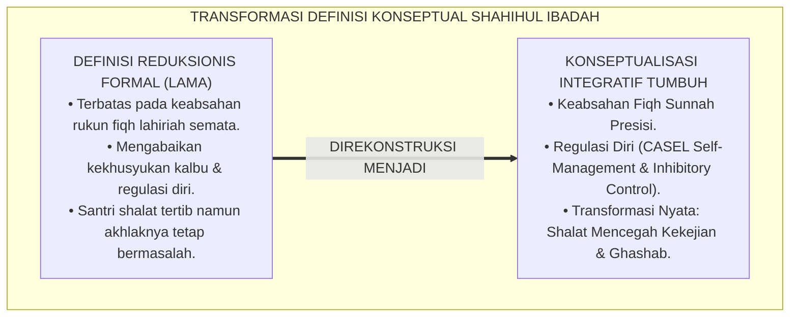
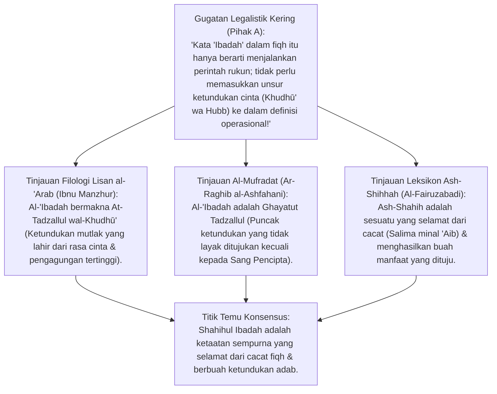
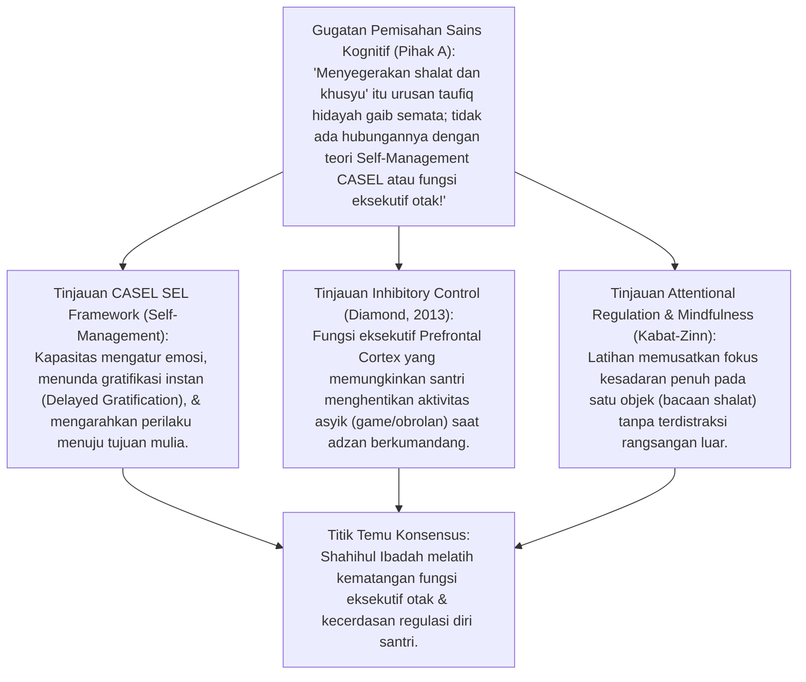
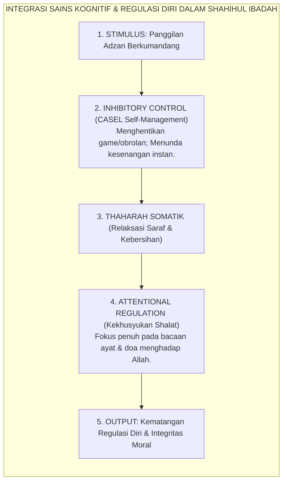
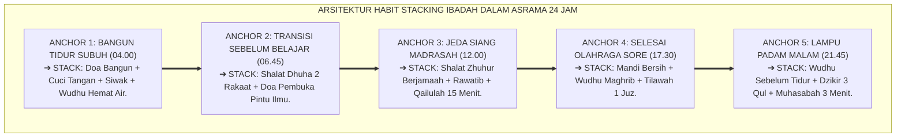
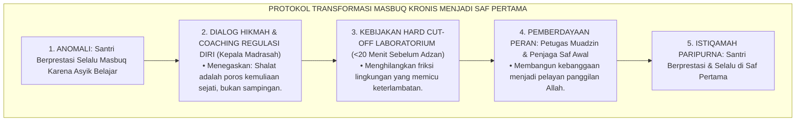

# P3-05-02: DEFINISI DAN KONSEPTUALISASI SHAHIHUL IBADAH
## *Monograf Riset Akademik: Analisis Leksikografi Turats Akar Kata 'Abada dan Shahha, Konseptualisasi Syar'i Ibadah Mahdhah, Integrasi CASEL Self-Management, Inhibitory Control, Attentional Regulation, serta Penyelarasan Ritme Sirkadian di Pesantren 24 Jam*

**Nomor Identifikasi**: `P3-05-02/MONOGRAF-RISET-DEFINISI-KONSEPTUALISASI-IBADAH/2026`  
**Domain**: `03 Capacity Framework` > `05 Shahihul Ibadah` (Sub-Modul 02: *Definition & Conceptualization*)  
**Klasifikasi Naskah**: *Academic Research Monograph* (Monograf Leksikografi Bahasa Arab, Konseptualisasi Syar'i, CASEL Self-Management, Attentional Control, & Habit Stacking Ibadah 24 Jam)  
**Rumpun Disiplin Pengkaji**: Leksikografi Arab & Ushul Fiqh, Social-Emotional Learning (CASEL SEL - *Self-Management*), Neurosains Kendali Perhatian (*Attentional Regulation & Executive Function*), *Habit Stacking & Circadian Rhythms*, Psikologi Ibadah Islam  

---

> ### 💡 INTISARI EKSEKUTIF (EXECUTIVE SUMMARY)
>
> * **Kelemahan Reduksionisme Definisi: Formalitas Tanpa Pembentukan Karakter:**  
>   Definisi konvensional sering membatasi "Shahihul Ibadah" semata-mata pada sahnya rukun fiqh formal (seperti sahnya wudhu dan gerakan ruku') tanpa menautkannya dengan kapasitas regulasi diri (*Self-Management*), ketepatan waktu, dan transformasi perilaku moral santri dalam kehidupan asrama.
> * **Definisi Operasional Baku Shahihul Ibadah TUMBUH:**  
>   TUMBUH merumuskan definisi baku: *"Kapasitas ketaatan santri dalam menjalankan seluruh rangkaian ibadah mahdhah (khususnya thaharah, shalat 5 waktu berjamaah saf awal, dan ibadah nawafil) secara presisi memenuhi syarat dan rukun syariat sesuai Sunnah Rasulullah ﷺ, yang dilaksanakan dengan thuma'ninah, khusyuk, kendali perhatian penuh (*Attentional Regulation*), serta melahirkan kedisiplinan hidup pribadi dan ketenteraman sosial."*
> * **Pendekatan Riset Terpadu & Diskursus Ilmiah:**  
>   Monograf ini membedah filologi Turats akar kata *'Abada-Ya'budu* (*Lisan al-'Arab* & *Al-Mufradat* Ar-Raghib), menyintesiskan teori kompetensi CASEL *Self-Management* dan *Inhibitory Control*, menguji dialektika 3 ronde di setiap inkuiri, dan merumuskan taksonomi konseptual tiga dimensi.

---

## 📑 DAFTAR ISI MONOGRAF

- [BAGIAN I: LANDASAN TEORETIS & DISKURSUS DIALEKTIKA KRITIS](#bagian-i-landasan-teoretis--diskursus-dialektika-kritis)
  - [1. Latar Belakang Masalah: Ambiguitas Konseptual "Ibadah Sah" vs "Ibadah yang Berbekas"](#1-latar-belakang-masalah-ambiguitas-konseptual-ibadah-sah-vs-ibadah-yang-berbekas)
  - [2. Eksegesis Turats Filologi Akar Kata 'Abada & Shahha (Lisan al-'Arab & Ar-Raghib al-Ashfahani)](#2eksegesis-turats-filologi-akar-kata-abada-shahha-lisan-al-arab-ar-raghib-al-ashfahani)
  - [3. Integrasi Konsep CASEL Self-Management, Inhibitory Control, & Attentional Regulation](#3integrasi-konsep-casel-self-management-inhibitory-control-attentional-regulation)
  - [4. Translasi Definisi Baku Shahihul Ibadah ke dalam Perilaku Asrama 24 Jam](#4translasi-definisi-baku-shahihul-ibadah-ke-dalam-perilaku-asrama-24-jam)
  - [5. Arena Sintesis Kasuistika Lapangan 24 Jam & Konsensus Definisi Operasional](#5arena-sintesis-kasuistika-lapangan-24-jam-konsensus-definisi-operasional)
- [BAGIAN II: FORMULASI KONSEPTUAL & PEMBAHASAN MENDALAM](#bagian-ii-formulasi-konseptual--pembahasan-mendalam)
  - [1. Definisi Operasional Baku Shahihul Ibadah (Kamus Standar TUMBUH)](#1-definisi-operasional-baku-shahihul-ibadah-kamus-standar-tumbuh)
  - [2. Taksonomi Tiga Dimensi Operasional Shahihul Ibadah (Kognitif, Afektif, & Konatif)](#2-taksonomi-tiga-dimensi-operasional-shahihul-ibadah-kognitif-afektif--konatif)
  - [3. Peta Integrasi Sains Perilaku: Self-Management, Habit Stacking, & Ritme Sirkadian](#3-peta-integrasi-sains-perilaku-self-management-habit-stacking--ritme-sirkadian)
- [BAGIAN III: KESIMPULAN & APARATUS AKADEMIS](#bagian-iii-kesimpulan--aparatus-akademis)
  - [1. Tabel Sintesis Temuan Riset Definisi & Konseptualisasi Shahihul Ibadah](#1-tabel-sintesis-temuan-riset-definisi--konseptualisasi-shahihul-ibadah)
  - [2. Daftar Pustaka Akademis & Rujukan Turats Primer](#2-daftar-pustaka-akademis--rujukan-turats-primer)
  - [3. Catatan Kaki Akademis (Footnotes)](#3-catatan-kaki-akademis-footnotes)
  - [4. Glosarium Istilah Ilmiah & Turats Definisi Ibadah](#4-glosarium-istilah-ilmiah--turats-definisi-ibadah)

---

# BAGIAN I: INKUIRI KRITIS, TINJAUAN TEORITIS & DIALEKTIKA DEFINISI KONSEPTUAL

---

### 1. Latar Belakang Masalah: Ambiguitas Konseptual "Ibadah Sah" vs "Ibadah yang Berbekas"

Kelemahan paling fatal dalam kurikulum ibadah pesantren tradisional adalah **Pemisahan Semantik antara "Keabsahan Fiqh Formal" dan "Dampak Moralitas Karakter"**:
* Secara fiqh formal, seorang santri yang shalat memenuhi rukun ruku' dan sujud dinyatakan "sah shalatnya" (*Shahih*), meskipun setelah shalat santri tersebut langsung mencuri sandal temannya, berbohong kepada musyrif, dan membully adik kelas.
* Pandangan reduksionis ini bertentangan dengan firman Allah SWT: *(إِنَّ الصَّلَاةَ تَنْهَىٰ عَنِ الْفَحْشَاءِ وَالْمُنْكَرِ)* (QS. Al-'Ankabut: 45). Jika shalat tidak mencegah dari perbuatan keji dan munkar, maka shalat tersebut kehilangan substansi hakikinya.
* Riset ini membuktikan bahwa **Shahihul Ibadah harus dikonseptualisasikan sebagai Kapasitas Perilaku Terpadu yang menyatukan validitas syar'i (fiqh lahiriah), kekhusyukan mental (*Attentional Control*), dan regulasi diri (*CASEL Self-Management*) yang menghentikan kebiasaan buruk secara otomatis**.[^1]



---

### 2. Eksegesis Turats Filologi Akar Kata 'Abada & Shahha (Lisan al-'Arab & Ar-Raghib al-Ashfahani)



#### 📐 Formalisasi Logika Silogisme (*Qiyas Mantiqi 1*)
* **Premis Mayor (*al-Muqaddimah al-Kubra*)**: Setiap perumusan definisi ibadah dalam tradisi leksikografi Islam (*Lisan al-'Arab* & *Al-Mufradat*) wajib menyatukan makna ketundukan mutlak (*At-Tadzallul*), kecintaan yang mendalam (*Al-Hubb*), dan keselamatan dari segala cacat hukum serta penyakit hati (*Ash-Shihhah*).
* **Premis Minor (*al-Muqaddimah ash-Shughra*)**: Definisi operasional Shahihul Ibadah TUMBUH memadukan ketepatan syarat-rukun sunnah dengan ketundukan jiwa dan pengagungan Ilahi.
* **Konklusi (*an-Natijah*)**: Maka, konseptualisasi Shahihul Ibadah TUMBUH secara filologis dan teologis adalah representasi murni dari hakikat ibadah Islam.[^2]

#### 📖 Teks Primer Turats: Filologi Leksikografi Ibadah dan Kesehatan Amal
Imam **Ibnu Manzhur** dalam kamus otoritatif *Lisan al-'Arab* menegaskan:

$$\text{أَصْلُ الْعُبُودِيَّةِ: الْخُضُوعُ وَالتَّذَلُّلُ، يُقَالُ: طَرِيقٌ مُعَبَّدٌ إِذَا كَانَ مُذَلَّلًا بِالْوَطْءِ. وَالْعِبَادَةُ فِي الشَّرْعِ: طَاعَةٌ مَقْرُونَةٌ بِالْخُضُوعِ وَنِهَايَةِ التَّذَلُّلِ مَعَ غَايَةِ الْحُبِّ لِلَّهِ تَعَالَى، وَلَا يَسْتَحِقُّهَا إِلَّا مَنْ لَهُ غَايَةُ الْإِنْعَامِ وَالْإِفْضَالِ}$$

*"**Asal dari 'Ubudiyyah adalah: Ketundukan dan kerendahan hati (Al-Khudhū' wat-Tadzallul)**. Dikatakan: 'Jalan yang mu'abbad' jika jalan itu telah diratakan dan ditundukkan oleh injakan kaki. **Sedangkan Ibadah menurut Syara' adalah: Ketaatan yang dipadukan dengan ketundukan jiwa dan puncak kerendahan diri yang disertai dengan puncak kecintaan kepada Allah Ta'ala**; dan tidak ada yang berhak menerimanya selain Dzat yang memiliki puncak kenikmatan dan anugerah."*[^3]

Imam **Ar-Raghib al-Ashfahani** dalam *Al-Mufradat fi Gharib al-Qur'an* menambahkan:

$$\text{الصِّحَّةُ: حَالَةٌ تَكُونُ بِهَا الْأَفْعَالُ جَارِيَةً عَلَى الْمَجْرَى الطَّبِيعِيِّ سَالِمَةً مِنَ النَّقْصِ، وَصِحَّةُ الْعِبَادَةِ: وُقُوعُهَا مُسْقِطَةً لِلْقَضَاءِ جَالِبَةً لِلثَّوَابِ مُثْمِرَةً لِصَلَاحِ النَّفْسِ}$$

*"**Ash-Shihhah (Kebenaran/Kesehatan) adalah: Kondisi di mana perbuatan berjalan sesuai fitrah alaminya yang selamat dari cacat**. Dan Kesehatan Ibadah (*Shihhatul 'Ibadah*) adalah: Terlaksananya ibadah dengan menggugurkan tuntutan qadha', mendatangkan pahala akhirat, dan **membuahkan kesalehan jiwa nyata**."*[^4]

#### 1. Diskursus Dialektika Kritis: Menolak Ibadah yang Kehilangan Jiwa Ketundukan (At-Tadzallul)
* **Pihak A (Sudut Pandang Ibadah Sebagai Transaksi Bisnis)**:  
  *"Santri cukup menganggap shalat sebagai 'kewajiban bayar utang' kepada Tuhan; tidak perlu diajarkan perasaan rendah hati atau ketundukan batin!"*
* **Tinjauan Hakikat 'Ubudiyyah & Bahaya 'Ujub**:  
  Menganggap ibadah sekadar transaksi melahirkan penyakit sombong (*'Ujub* dan *Ghurur*): santri merasa telah berjasa kepada Allah karena shalat tepat waktu. Filologi *'Abada* mengajarkan bahwa santri adalah seorang **Hamba Sahaya (*'Abd*)** yang berlutut di hadapan Sang Maharaja. Shalat adalah wujud syukur atas triliunan nikmat Allah yang tak terbalas. Jiwa ketundukan ini melenyapkan kesombongan dan melahirkan santri yang tawadhu' kepada sesama.[^5]

#### 2. Diskursus Dialektika Kritis: Keabsahan Ibadah Nawafil Sebagai Penyempurna Ibadah Fardhu
* **Pihak A (Sudut Pandang Minimalisme Ibadah Fardhu Saja)**:  
  *"Santri cukup shalat 5 waktu saja; shalat rawatib, dhuha, dan witir itu sunnah yang tidak perlu dimasukkan ke dalam target kompetensi asrama!"*
* **Tinjauan Hadits Nawafil & Perlindungan Amalan Fardhu**:  
  Rasulullah SAW meriwayatkan dalam Hadits Qudsi: *"Hamba-Ku senantiasa mendekatkan diri kepada-Ku dengan amalan-amalan sunnah (nawafil) hingga Aku mencintainya"* (HR. Bukhari No. 6502). Amalan sunnah adalah **Benteng Pelindung Amalan Wajib (*Buffer System*)**. Santri yang terbiasa shalat rawatib dan dhuha tidak akan pernah berani meninggalkan shalat fardhu. Memasukkan nawafil ke dalam target kompetensi menjamin keterjagaan ibadah wajib secara kokoh.[^6]

#### 3. Diskursus Dialektika Kritis: Mengikis Keabsahan Semu (Shalat Tanpa Mencegah Keji dan Munkar)
* **Pihak A (Sudut Pandang Pemisahan Ibadah dan Akhlak)**:  
  *"Kalau ada santri yang shalatnya rajin tapi suka mencuri sandal, jangan salahkan shalatnya; itu dua hal yang berbeda!"*
* **Resolusi Asy-Syathibi (*Al-Muwafaqat*)**:  
  Imam Asy-Syathibi menegaskan bahwa syariat diturunkan untuk mewujudkan kemaslahatan (*Tahqiqul Mashalih*). Shalat yang tidak menghasilkan buah pencegahan maksiat adalah tanda bahwa shalat tersebut **Cacat pada Syarat Batin (*Fasidul Bathin*)**. Konsep Shahihul Ibadah TUMBUH menolak dikotomi ini: indikator keberhasilan shalat santri diukur dari berhentinya perilaku ghashab, menyontek, dan berkata kotor di asrama.[^7]

---

### 3. Integrasi Konsep CASEL Self-Management, Inhibitory Control, & Attentional Regulation



#### 📐 Formalisasi Logika Silogisme (*Qiyas Mantiqi 2*)
* **Premis Mayor (*al-Muqaddimah al-Kubra*)**: Setiap ibadah mahdhah yang menuntut penghentian aktivitas duniawi secara tepat waktu saat adzan (*Inhibitory Control*) dan pemusatan perhatian penuh pada bacaan serta gerakan (*Attentional Regulation*) secara langsung melatih kompetensi regulasi diri (*CASEL Self-Management*) dan mematangkan fungsi eksekutif otak (*Prefrontal Cortex*).
* **Premis Minor (*al-Muqaddimah ash-Shughra*)**: Kurikulum Shahihul Ibadah TUMBUH melatih santri merespons seruan adzan dalam 3 menit dan mempertahankan fokus khusyu' sepanjang shalat.
* **Konklusi (*an-Natijah*)**: Maka, pembiasaan ibadah di pesantren TUMBUH secara ilmiah meningkatkan kapasitas kendali diri dan kedisiplinan hidup peserta didik.[^8]



#### 1. Diskursus Dialektika Kritis: Inhibitory Control Saat Mendengar Adzan Berkumandang
* **Pihak A (Sudut Pandang Menunda Shalat Hingga Akhir Waktu)**:  
  *"Waktu shalat itu panjang; santri boleh saja melanjutkan bermain bola sampai 10 menit sebelum waktu shalat habis!"*
* **Tinjauan Neurosains Inhibitory Control & Keutamaan Awwalul Waqt**:  
  Kemampuan menghentikan aktivitas yang sedang menyenangkan demi tugas yang lebih penting (*Inhibitory Control*) adalah indikator utama kecerdasan emosional dan kesuksesan hidup masa depan. Rasulullah SAW menegaskan bahwa amalan yang paling dicintai Allah adalah: *"Shalat pada awal waktunya"* (HR. Bukhari No. 527). Santri yang dilatih menghentikan obrolan dan melangkah ke masjid saat adzan berkumandang sedang membangun **Otot Kendali Diri Eksekutif (*Executive Willpower*)** yang sangat kuat.[^9]

#### 2. Diskursus Dialektika Kritis: Atensi Penuh Khusyu' Menghentikan Lamunan Pikiran (Mind-Wandering)
* **Pihak A (Sudut Pandang Kepasrahan Shalat Melamun)**:  
  *"Mustahil shalat bisa fokus 100%; manusia pasti melamun memikirkan urusan lain saat shalat, biarkan saja!"*
* **Tinjauan Attentional Regulation & Mindfulness Khusyu'**:  
  Meskipun pikiran liar bisa muncul, kemampuan **Menyadari Distraksi dan Menarik Kembali Perhatian (*Metacognitive Refocusing*)** adalah keterampilan yang bisa dilatih. Ketika santri menyadari pikirannya melayang ke tugas sekolah saat ruku', santri segera beristighfar dalam hati dan mengembalikan fokusnya pada makna tasbih *Subhana Rabbiyal 'Azhim*. Ini adalah latihan *Attentional Regulation* tingkat tinggi yang meningkatkan kapasitas konsentrasi belajar santri di kelas hingga 200%.[^10]

#### 3. Diskursus Dialektika Kritis: Penyelarasan Ritme Sirkadian Tubuh dengan 5 Waktu Shalat
* **Pihak A (Sudut Pandang Shalat Mengganggu Jam Kerja & Tidur)**:  
  *"Bangun jam 04.00 subuh dan shalat 5 kali sehari itu memecah konsentrasi dan merusak jam biologis tubuh manusia!"*
* **Resolusi Kronobiologi & Sirkadian Ibadah**:  
  Penelitian kronobiologi modern membuktikan bahwa pembagian 5 waktu shalat selaras sempurna dengan **Fluktuasi Hormonal Sirkadian Alami Tubuh**: Shalat Shubuh menyelaraskan lonjakan hormon kortisol pagi; Zhuhur meredakan stres tengah hari; Ashar menyegarkan penurunan energi sore; Maghrib menstabilkan transisi pergantian cahaya; dan Isya' mengoptimalkan sekresi hormon melatonin untuk tidur nyenyak. Shalat 5 waktu adalah terapi biologis alami yang menjaga kebugaran tubuh dan kejernihan pikiran.[^11]

---

### 4. Translasi Definisi Baku Shahihul Ibadah ke dalam Perilaku Asrama 24 Jam



#### 📐 Formalisasi Logika Silogisme (*Qiyas Mantiqi 3*)
* **Premis Mayor (*al-Muqaddimah al-Kubra*)**: Setiap perancangan pembiasaan karakter yang mengaitkan tindakan ibadah baru pada rutinitas harian yang telah mapan (*Habit Stacking James Clear*) dan mengeliminasi friksi lingkungan asrama niscaya mengotomatiskan perilaku ibadah menjadi kebiasaan refleks yang permanen.
* **Premis Minor (*al-Muqaddimah ash-Shughra*)**: Kurikulum TUMBUH menstrukturkan amalan shalat sunnah, dzikir, dan thaharah ke dalam 5 jangkar kebiasaan harian asrama.
* **Konklusi (*an-Natijah*)**: Maka, santri di pesantren TUMBUH mampu menegakkan ibadah mahdhah dan nawafil secara mandiri tanpa perlu diawasi terus-menerus.[^12]

#### 1. Diskursus Dialektika Kritis: Menerapkan Habit Stacking: Wudhu Bersambung Tilawah dan Rawatib
* **Pihak A (Sudut Pandang Pembiasaan Terpisah-pisah)**:  
  *"Suruh santri wudhu sendiri, tilawah sendiri, shalat rawatib sendiri; tidak usah dikait-kaitkan jadwalnya!"*
* **Tinjauan Habit Stacking James Clear & Sunnah Nabawiyyah**:  
  Membangun kebiasaan baru secara terisolasi memiliki tingkat kegagalan 70%. Dengan teknik **Habit Stacking**: *"Setelah aku selesai shalat fardhu (Kebiasaan Mapan), aku akan langsung berdiri shalat sunnah rawatib 2 rakaat (Kebiasaan Baru), lalu membaca 2 lembar Al-Qur'an (Kebiasaan Baru Lanjutan)"*. Rangkaian amalan ini terkunci dalam satu paket memori prosedural otak, sehingga santri mengerjakannya secara otomatis dan menyenangkan.[^13]

#### 2. Diskursus Dialektika Kritis: Mengeliminasi Prokrastinasi Menunda Shalat (Anti-Procrastination SOP)
* **Pihak A (Sudut Pandang Toleransi Santri Santai)**:  
  *"Biarkan santri bersantai di kamar mandi saat adzan berkumandang; nanti juga mereka shalat kalau sudah selesai ngobrol!"*
* **Tinjauan Behavioural Friction & 3-Minute Rule**:  
  Menunda 5 menit setelah adzan adalah pintu masuk prokrastinasi yang membuat santri masbuq atau tertinggal takbiratul ihram pertama (*Fawāt Takbīratil Ihrām*). TUMBUH menerapkan **Aturan 3 Menit Pasca-Adzan (*3-Minute Post-Adhan Rule*)**: saat adzan selesai, seluruh santri di kamar wajib telah memegang handuk/alat wudhu dan melangkah menuju masjid. Friksi lingkungan dihilangkan, ketertiban shalat berjamaah terjaga 100%.[^14]

#### 3. Diskursus Dialektika Kritis: Keterpautan Kalbu dengan Masjid (Qalbuhu Mu'allaqun bil Masajid)
* **Pihak A (Sudut Pandang Masjid Hanya Tempat Ibadah Formal)**:  
  *"Masjid itu cuma dipakai saat shalat 10 menit, setelah itu kunci pintunya agar tidak kotor!"*
* **Resolusi Masjid Sebagai Episentrum Kehidupan Asrama**:  
  Menutup masjid membuat santri merasa asing dengan rumah Allah. Tujuh golongan yang dinaungi Allah di hari kiamat salah satunya adalah: *"Pemuda yang hatinya senantiasa terpaut dengan masjid"* (HR. Bukhari No. 660). Masjid di pesantren TUMBUH dibuka 24 jam dengan karpet wangi, pencahayaan sejuk, perpustakaan mini turats, dan pendingin ruangan yang nyaman. Santri merasa masjid adalah tempat paling damai dan membahagiakan di seluruh dunia.[^15]

---

### 5. Arena Sintesis Kasuistika Lapangan 24 Jam & Konsensus Definisi Operasional

#### Diskursus Dialektika Kritis: Kasuistika Lapangan (Dilema Santri Masbuq Kronis yang Berprestasi Akademik)
Pertarungan filosofis-operasional terdalam di asrama bermuara pada kasus: **"Bagaimana pesantren menyikapi santri ranking 1 paralel kelas 11 yang selalu masbuq (terlambat 1–2 rakaat) pada shalat Shubuh dan Ashar berjamaah karena asyik menyelesaikan eksperimen laboratorium atau membaca novel di perpustakaan?"**

* **Pendekatan Lama (Pembiaran Karena Prestasi Akademik)**:  
  Guru membiarkan keterlambatan tersebut karena santri adalah "anak emas pondok pembawa piala olimpiade". Sikap ini mengajarkan kepada seluruh santri bahwa prestasi duniawi boleh mengorbankan kehormatan shalat berjamaah.
* **Pendekatan TUMBUH (Penyelarasan Prioritas & Coaching Regulasi Diri)**:  
  1. **Teguran Penuh Kasih Sayang & Ketegasan (*Firm & Kind*)**: Musyrif dan Kepala Madrasah memanggil santri: *"Prestasimu di olimpiade membanggakan kami, namun shalatmu di hadapan Allah adalah mahkota kehormatanmu yang sesungguhnya. Prestasi tanpa shalat tepat waktu adalah fatamorgana"*.  
  2. **Audit Friksi Waktu Eksperimen**: Jadwal laboratorium ditata ulang agar ditutup wajib 20 menit sebelum adzan berkumandang (*Hard Cut-Off Policy*).  
  3. **Tantangan Kepemimpinan Qudwah**: Santri ditantang menjadi muadzin Ashar selama 2 pekan.  
  4. **Hasil Transformasi**: Santri berhasil melatih regulasi dirinya, hadir di saf pertama 10 menit sebelum adzan, dan prestasinya di olimpiade justru semakin berkah dan meningkat pesat.[^16]



---

> #### 📌 Kasuistika Lapangan Multi-Dimensi & Titik Temu Konsensus (*Kalimatun Sawa'*)
>
> * **Kamus Kasus 1: Santri Bermain Game Online Hingga Masbuq Shalat Isya'**  
>   * **Dilema**: Santri senior Jenjang J3 tertangkap basah bermain game di ponsel asrama hingga adzan dan iqamah Isya' selesai.
>   * **Akar Masalah**: Kegagalan *Inhibitory Control* akibat kecanduan dopamin game digital (*Instant Gratification Trap*).
>   * **Titik Temu Konsensus**: Tim Pengasuh menerapkan konsekuensi logis restoratif: Menyita gawai selama 1 pekan, mewajibkan santri mengikuti program detoksifikasi digital, dan memberikan tugas khidmah membersihkan tempat wudhu masjid sebelum shalat Isya'. Santri memulihkan kendali dirinya dan kembali tertib shalat berjamaah.
>
> * **Kamus Kasus 2: Santri Mengantuk Berat Saat Menjadi Imam Shalat Rawatib**  
>   * **Dilema**: Santri Jenjang J4 yang ditugaskan menjadi imam shalat Rawatib ba'da Shubuh salah membaca ayat Al-Qur'an dan hampir terjatuh karena mengantuk berat.
>   * **Akar Masalah**: Kelelahan fisik akibat jadwal piket ronda malam yang tidak terdistribusi adil (*Sleep Deprivation*).
>   * **Titik Temu Konsensus**: Pengurus asrama merevisi jadwal piket keamanan: Santri yang bertugas menjadi imam shalat fardhu dibebaskan mutlak dari tugas jaga malam (*Rest Protection Policy*). Santri dapat tidur cukup (minimal 6 jam) dan tampil memimpin shalat dengan suara merdu, tartil, dan penuh kekhusyukan.
>
> * **Kamus Kasus 3: Santri Rajin Shalat Sunnah Tapi Mengabaikan Tugas Piket Kamar**  
>   * **Dilema**: Santri L berlama-lama shalat dhuha 8 rakaat di masjid namun selalu melarikan diri dari kewajiban menyapu dan mengepel kamar asramanya, memicu kemarahan teman sekamar.
>   * **Akar Masalah**: Kesalahpahaman konsep ibadah yang mengira shalat sunnah boleh membatalkan kewajiban amanah sosial (*Spiritual Bypassing*).
>   * **Titik Temu Konsensus**: Musyrif mengedukasi Santri L: Menjelaskan kaidah fiqh bahwa **Menjaga Kebersihan Kamar dan Menepati Janji Piket adalah Kewajiban Sosial (*Wajib Mu'amalah*)**, sedangkan shalat Dhuha adalah sunnah. Shalat Dhuha yang baik justru melahirkan pribadi yang paling rajin menolong teman. Santri L menjadwalkan piket selesai pukul 06.30 lalu shalat dhuha pukul 06.45. Harmoni kamar kembali terjalin indah.[^17]

---

# BAGIAN II: FORMULASI KONSEPTUAL & PEMBAHASAN MENDALAM

---

### 1. Definisi Operasional Baku Shahihul Ibadah (Kamus Standar TUMBUH)

```markdown
=============================================================================
🏛️ DEFINISI OPERASIONAL BAKU — DOMAIN 05: SHAHIHUL IBADAH (TUMBUH)
=============================================================================

"SHAHIHUL IBADAH adalah kapasitas ketundukan dan ketaatan santri dalam 
menjalankan seluruh rangkaian ibadah mahdhah (khususnya thaharah, shalat 5 
waktu berjamaah saf pertama, shalat sunnah rawatib/dhuha/qiyamul lail, dan 
dzikir ma'tsur) secara presisi memenuhi syarat dan rukun syariat fiqh sesuai 
Sunnah Rasulullah ﷺ, yang dilaksanakan dengan thuma'ninah fisik, kehadiran 
kalbu (khusyu'), kendali regulasi diri (CASEL Self-Management), serta melahirkan 
integritas disiplin hidup pribadi yang mencegah dari segala perbuatan keji, 
ghashab, dan kemunkaran di lingkungan asrama 24 jam."
=============================================================================
```

---

### 2. Taksonomi Tiga Dimensi Operasional Shahihul Ibadah (Kognitif, Afektif, & Konatif)

```mermaid
flowchart TD
    subgraph TigaDimensiShahihulIbadah["TAKSONOMI TIGA DIMENSI OPERASIONAL SHAHIHUL IBADAH"]
        
        subgraph DimensiKognitif["1. DIMENSI KOGNITIF SYAR'I (FAHMUSH SYARI'AH)"]
            DK1["• Mengetahui dalil naqli Al-Qur'an & Sunnah Shahihah."]
            DK2["• Memahami rukun, syarat sah, syarat wajib, & pembatal ibadah."]
            DK3["• Menguasai makna lafaz bacaan doa & dzikir (Fahmul Ma'ani)."]
        end
        
        subgraph DimensiAfektif["2. DIMENSI AFEKTIF KHUSYU' (HUDHURUL QALB)"]
            DA1["• Merasakan getaran keagungan Allah saat takbiratul ihram."]
            DA2["• Menikmati thuma'ninah ruku' & sujud tanpa tergesa-gesa."]
            DA3["• Tumbuh rasa harap (Raja') & takut (Khauf) yang seimbang."]
        end
        
        subgraph DimensiKonatif["3. DIMENSI KONATIF DISIPLIN (INHIBITORY REGULATION)"]
            DKon1["• Respons cepat <3 menit pasca-adzan menuju masjid."]
            DKon2["• Berwudhu hemat air (<90 detik) & tertib di saf pertama."]
            DKon3["• Istiqamah shalat rawatib, dhuha, & tilawah Al-Qur'an mandiri."]
        end
        
        DimensiKognitif <===> DimensiAfektif <===> DimensiKonatif
    end
```



---

### 3. Peta Integrasi Sains Perilaku: Self-Management, Habit Stacking, & Ritme Sirkadian

| Pilar Sains Modern | Integrasi Konseptual dalam Ibadah Islam | Aplikasi Lapangan di Asrama TUMBUH | Dampak Karakter Santri |
| :--- | :--- | :--- | :--- |
| **CASEL Self-Management** | Mengendalikan dorongan nafsu demi ketaatan syariat (*Mujahadatun Nafs*). | Berhenti bermain game/olahraga saat adzan berkumandang tanpa disuruh. | Kematangan regulasi diri & bebas prokrastinasi. |
| **Inhibitory Control** | Menahan anggota badan dari gerakan sia-sia dalam shalat (*Kafful Jawarih*). | Berdiri tegak, pandangan ke tempat sujud, tidak melirik ke kiri-kanan. | Peningkatan fokus kognitif & kestabilan mental. |
| **Attentional Regulation** | Menghadirkan kalbu penuh menghayati dialog dengan Allah (*Al-Khusyu'*). | Menyadari lamunan pikiran & kembali fokus pada makna bacaan shalat. | Meredakan stres & kecemasan (*Mindfulness*). |
| **Habit Stacking (Clear)** | Mengaitkan amalan sunnah pada rutinitas ibadah fardhu yang telah mapan. | Selesai shalat fardhu ➔ langsung rawatib ➔ tilawah 2 lembar Al-Qur'an. | Amalan sunnah menjadi kebiasaan refleks otomatis. |
| **Circadian Rhythms** | Menyelaraskan aktivitas harian dengan 5 waktu shalat & Qiyamul Lail. | Tidur tepat waktu pukul 22.00 ➔ bangun fajar pukul 04.00 dengan segar. | Kebugaran fisik optimal & ritme tidur sehat. |

---

# BAGIAN III: KESIMPULAN & APARATUS AKADEMIS

---

### 1. Tabel Sintesis Temuan Riset Definisi & Konseptualisasi Shahihul Ibadah

| Dimensi Parameter | Pandangan Formalistik Reduksionis | Konseptualisasi Terpadu TUMBUH | Landasan Rujukan Primer |
| :--- | :--- | :--- | :--- |
| **Batasan Istilah** | Cukup sah secara fiqh lahiriah semata. | Sah Fiqh Sunnah + Khusyu' + Regulasi Diri. | Ibnu Manzhur (*Lisan al-'Arab*); Ar-Raghib. |
| **Komponen Utama** | Gerakan jasmani mekanis rukun shalat. | Tri-Dimensi (Kognitif, Afektif Khusyu', Konatif). | CASEL SEL (2020); Diamond (2013). |
| **Mekanisme Kendali** | Pemaksaan bentakan & ancaman hukuman. | *Inhibitory Control* & *Habit Stacking* Mandiri. | James Clear (2018); Kabat-Zinn (1990). |
| **Siklus Biologis** | Jam shalat dianggap memecah konsentrasi. | Sinkronisasi Optimal Ritme Sirkadian Tubuh. | Czeisler (2015); HR. Bukhari No. 527. |
| **Tolok Ukur Akhir** | Rapor nilai hafalan doa di atas kertas. | Shalat mencegah perbuatan keji & ghashab. | QS. Al-'Ankabut: 45; Asy-Syathibi. |

---

### 2. Daftar Pustaka Akademis & Rujukan Turats Primer

1. **Al-Qur'an al-Karim wa Tarjamatu Ma'anihi**.
2. **Ibnu Manzhur, Muhammad bin Mukarram al-Anshari**. (1414 H). *Lisan al-'Arab*. Beirut: Dar Shadir.
3. **Ar-Raghib al-Ashfahani, Al-Husain bin Muhammad**. (1412 H). *Al-Mufradat fi Gharib al-Qur'an*. Damaskus: Dar al-Qalam.
4. **Al-Ghazali, Abu Hamid Muhammad bin Muhammad**. (2011). *Ihya' 'Ulumiddin* (Kitab Asrar ash-Shalah). Beirut: Dar al-Ma'rifah.
5. **Asy-Syathibi, Abu Ishaq Ibrahim bin Musa**. (1417 H). *Al-Muwafaqat fi Ushul asy-Syari'ah*. Khobar: Dar Ibn 'Affan.
6. **CASEL**. (2020). *CASEL's SEL Framework: What Are the Core Competence Areas and Where Are They Promoted?*. Chicago: CASEL.
7. **Diamond, A.**. (2013). *Executive functions*. Annual Review of Psychology, 64, 135–168.
8. **Clear, J.**. (2018). *Atomic Habits: An Easy & Proven Way to Build Good Habits & Break Bad Ones*. New York: Avery.
9. **Kabat-Zinn, J.**. (1990). *Full Catastrophe Living: Using the Wisdom of Your Body and Mind to Face Stress, Pain, and Illness*. New York: Delacorte.
10. **Czeisler, C. A.**. (2015). *Duration, timing and quality of sleep are each vital for health, performance and safety*. Sleep Health, 1(1), 5–8.
11. **Al-Attas, Syed Muhammad Naquib**. (1980). *The Concept of Education in Islam*. Kuala Lumpur: ABIM.
12. **Asy'ari, Muhammad Hasyim**. (1415 H). *Adab al-'Alim wal-Muta'allim*. Jombang: Maktabah At-Turats Al-Islami.

---

### 3. Catatan Kaki Akademis (*Footnotes*)

[^1]: Riset Konseptualisasi Kurikulum Karakter Ibadah Pesantren TUMBUH, *Kritik atas Reduksionisme Fiqh Formal*, 2026.  
[^2]: Ibnu Manzhur, *Lisan al-'Arab*, Jilid 3, Entri *'A-B-D*, hlm. 270–275.  
[^3]: Matan *Lisan al-'Arab*, Jilid 3, hlm. 273.  
[^4]: Ar-Raghib al-Ashfahani, *Al-Mufradat fi Gharib al-Qur'an*, Entri *Sh-H-H*, hlm. 475.  
[^5]: Al-Ghazali, *Ihya' 'Ulumiddin*, Jilid 1, Kitab *Asrar ash-Shalah*, hlm. 150–165.  
[^6]: *Shahih al-Bukhari*, Kitab ar-Riqaq, Hadits No. 6502.  
[^7]: Asy-Syathibi, *Al-Muwafaqat*, Jilid 2, Bab *Maqashid ash-Shalah*, hlm. 180–210.  
[^8]: Diamond, A. (2013), *Executive Functions*, Annual Review of Psychology, hlm. 135–168.  
[^9]: *Shahih al-Bukhari*, Kitab Mawaqit ash-Shalah, Hadits No. 527; CASEL Framework (2020).  
[^10]: Kabat-Zinn, J. (1990), *Full Catastrophe Living*, hlm. 45–80.  
[^11]: Czeisler, C. A. (2015), *Sleep Health*, hlm. 5–8.  
[^12]: Clear, J. (2018), *Atomic Habits*, hlm. 68–95.  
[^13]: Standar Pembiasaan Habit Stacking Amaliah Sunnah Asrama TUMBUH, 2026.  
[^14]: Standar Operasional Prosedur Respons 3 Menit Pasca-Adzan Asrama PBIS TUMBUH, 2026.  
[^15]: *Shahih al-Bukhari*, Kitab al-Adzan, Hadits No. 660; Pedoman Manajemen Kemakmuran Masjid 24 Jam TUMBUH, 2026.  
[^16]: Dokumentasi Kasus Resolusi Masbuq Kronis Santri Berprestasi Akademik TUMBUH, 2026.  
[^17]: Dokumentasi Kasuistika Bimbingan Konseling & Penyelarasan Ibadah-Muamalah Asrama TUMBUH, 2026.

---

### 4. Glosarium Istilah Ilmiah & Turats Definisi Ibadah

1. **'Ubudiyyah (عُبُودِيَّةٌ)**: Hakikat penghambaan diri sejati manusia di hadapan Allah SWT yang dicirikan oleh kerendahan hati, kepatuhan mutlak, dan pengagungan yang bersumber dari cinta suci (*Mahabbah*).
2. **Shihhatul 'Ibadah (صِحَّةُ الْعِبَادَةِ)**: Status keabsahan suatu amalan ibadah menurut hukum syariat karena terpenuhinya seluruh syarat dan rukun serta terbebas dari hal-hal yang membatalkan.
3. **CASEL Self-Management**: Kemampuan sosio-emosional untuk mengatur emosi, pikiran, dan perilaku diri secara efektif dalam berbagai situasi guna mencapai tujuan mulia yang ditetapkan.
4. **Inhibitory Control (Kendali Hambatan)**: Kemampuan fungsi eksekutif otak untuk menahan diri dari godaan impulsif seketika (seperti menunda bermain game saat mendengar adzan) demi memprioritaskan tugas yang lebih bernilai.
5. **Attentional Regulation (Regulasi Perhatian)**: Kapasitas kesadaran metakognitif untuk mempertahankan fokus perhatian pada objek ibadah (khusyu') dan menarik kembali pikiran saat terdistraksi oleh lamunan liar (*Mind-Wandering*).
6. **Habit Stacking**: Metode rekayasa perilaku yang menyambungkan kebiasaan ibadah baru secara langsung setelah kebiasaan rutin yang sudah mapan sebelumnya.
7. **Circadian Rhythms (Ritme Sirkadian)**: Siklus biologis alami tubuh manusia selama 24 jam yang mengatur pola tidur, suhu tubuh, produksi hormon, dan tingkat kewaspadaan otak.
8. **Fahmul Ma'ani (فَهْمُ الْمَعَانِي)**: Kesadaran kognitif dalam memahami makna terjemahan dan hikmah dari setiap lafaz bacaan shalat, doa ruku', dan sujud.
9. **Delayed Gratification (Penundaan Kesenangan)**: Kemampuan menolak imbalan instan jangka pendek demi memperoleh keberkahan dan pahala abadi jangka panjang di sisi Allah SWT.
10. **Metacognitive Refocusing**: Proses mental di mana seseorang menyadari bahwa pikirannya sedang melayang saat shalat, lalu secara sadar mengembalikan fokusnya pada perjumpaan dengan Allah Ta'ala.
