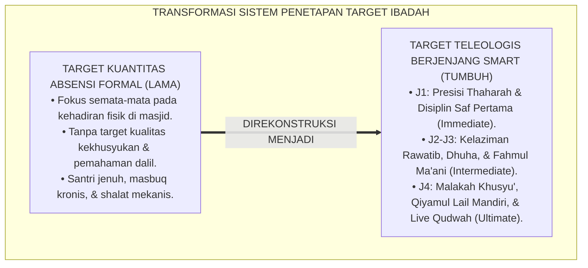
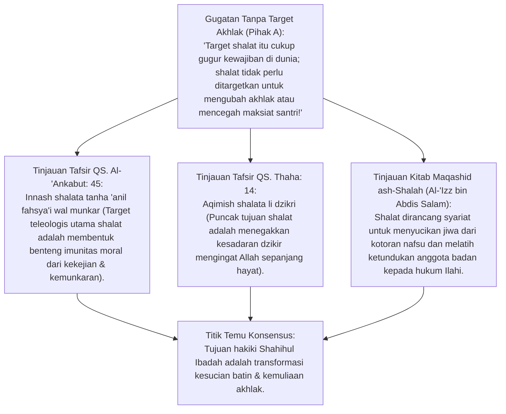
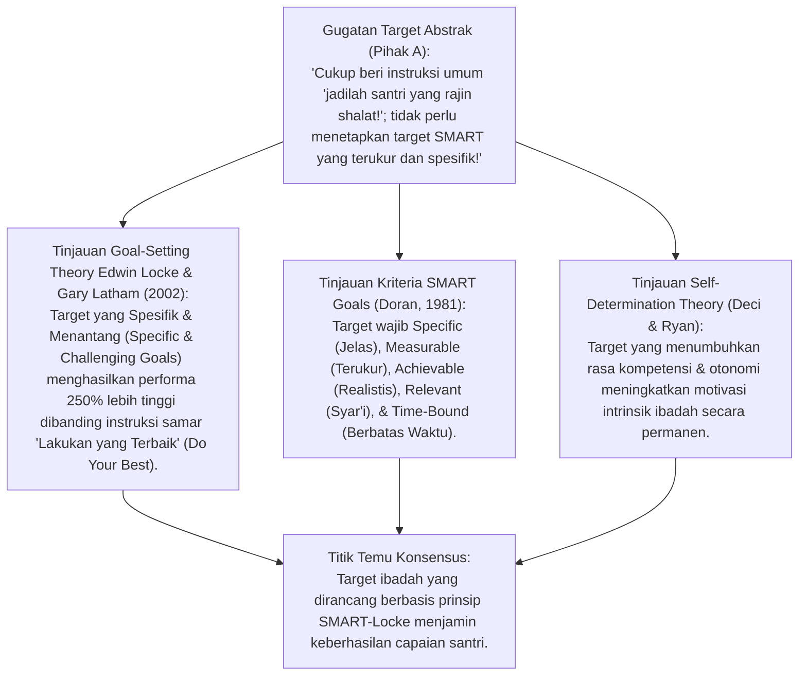
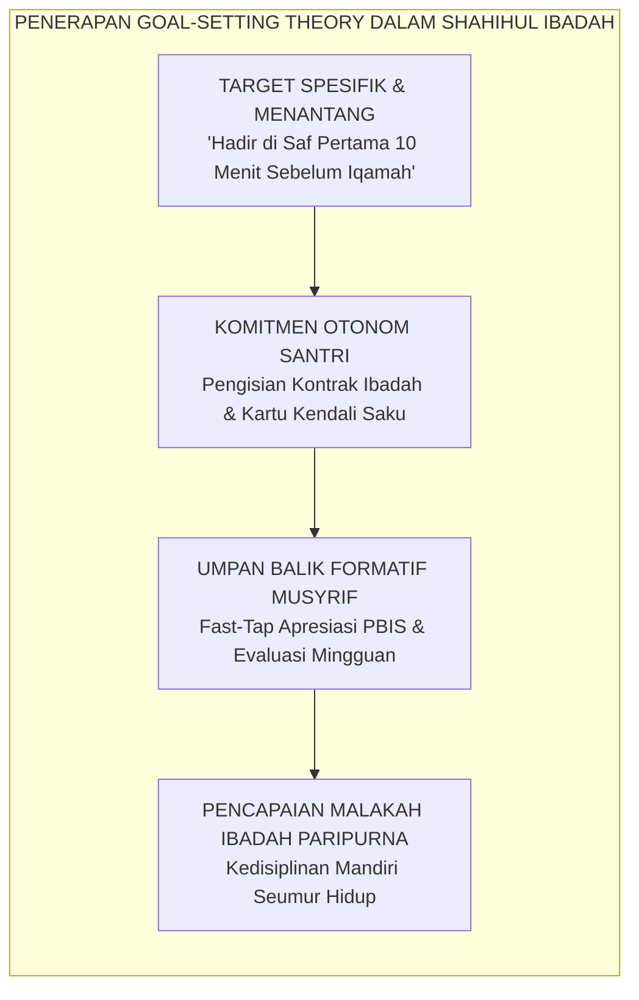
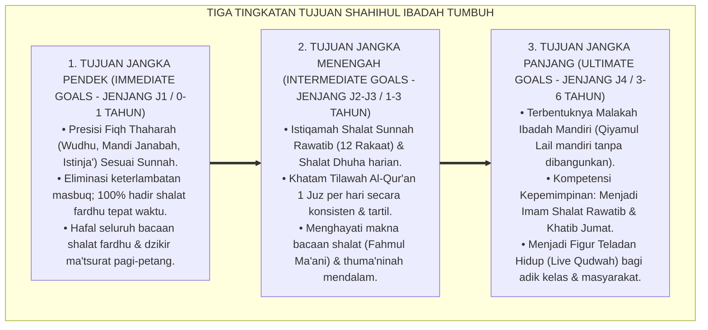
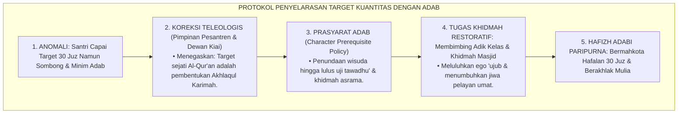
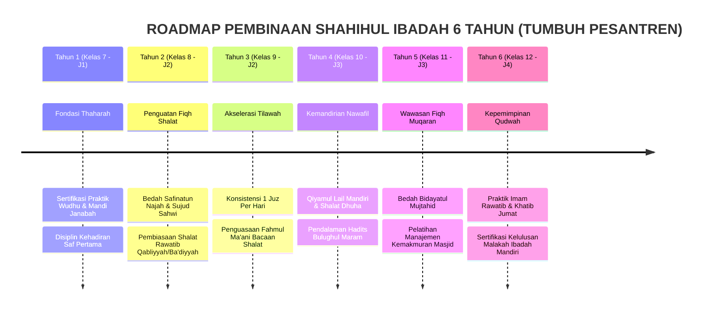

# P3-05-03: TUJUAN DAN TARGET CAPAIAN SHAHIHUL IBADAH
## *Monograf Riset Akademik: Teleologi Syariat Ibadah Mahdhah (Maqashid ash-Shalah Al-'Izz bin Abdis Salam), Teori Penetapan Tujuan (Goal-Setting Theory Locke & Latham), Taksonomi Target SMART Berjenjang, serta Roadmap Pembentukan Malakah Ibadah Mandiri di Pesantren 24 Jam*

**Nomor Identifikasi**: `P3-05-03/MONOGRAF-RISET-TUJUAN-TARGET-CAPAIAN-IBADAH/2026`  
**Domain**: `03 Capacity Framework` > `05 Shahihul Ibadah` (Sub-Modul 03: *Purpose & Target Milestones*)  
**Klasifikasi Naskah**: *Academic Research Monograph* (Monograf Teleologi Syariat Ibadah, Goal-Setting Theory Locke & Latham, Taksonomi SMART Milestones, & Roadmap Kematangan Ibadah Santri 24 Jam)  
**Rumpun Disiplin Pengkaji**: Falsafah Maqashid Syari'ah & Hikmatut Tasyri', Psikologi Motivasi & *Goal-Setting Theory* (Locke & Latham), Evaluasi Hasil Pembelajaran Agama Islam, Manajemen Waktu Pesantren 24 Jam  

---

> ### 💡 INTISARI EKSEKUTIF (EXECUTIVE SUMMARY)
>
> * **Kelemahan Evaluasi Konvensional: Ilusi Kuantitas Absensi Formal:**  
>   Target pembinaan ibadah di banyak pesantren hanya terpaku pada angka absensi shalat (kehadiran fisik di masjid) tanpa memiliki peta target kualitatif yang jelas mengenai kedalaman thuma'ninah, penguasaan fiqh thaharah mandiri, kelaziman shalat nawafil, dan transformasi akhlak sosial santri.
> * **Inovasi Tiga Tingkatan Tujuan & Roadmap SMART TUMBUH:**  
>   TUMBUH menstrukturkan target capaian Shahihul Ibadah berbasis *Goal-Setting Theory* Locke & Latham (2002): **1. Tujuan Jangka Pendek (Immediate Goal - J1): Penguasaan Fiqh Thaharah Presisi & Zero Masbuq di Saf Awal; 2. Tujuan Jangka Menengah (Intermediate Goal - J2–J3): Kelaziman Shalat Rawatib, Dhuha, & Tilawah 1 Juz/Hari; 3. Tujuan Jangka Panjang (Ultimate Goal - J4): Terbentuknya Malakah Ibadah Mandiri, Kepemimpinan Imam/Khatib, & Kesiapan Menjadi Qudwah Abadi**.
> * **Pendekatan Riset Terpadu & Diskursus Ilmiah:**  
>   Monograf ini membedah teleologi syariat *(Aqimish Shalata li Dzikri QS. Thaha: 14 & QS. Al-'Ankabut: 45)*, risalah *Maqashid ash-Shalah* Sultanul Ulama Al-'Izz bin Abdis Salam, menyintesiskan teori motivasi penetapan tujuan modern, menguji dialektika 3 ronde di setiap inkuiri, dan merumuskan roadmap 6 tahun pembentukan karakter ibadah.

---

## 📑 DAFTAR ISI MONOGRAF

- [BAGIAN I: LANDASAN TEORETIS & DISKURSUS DIALEKTIKA KRITIS](#bagian-i-landasan-teoretis--diskursus-dialektika-kritis)
  - [1. Latar Belakang Masalah: Ilusi Kuantitas Absensi Shalat vs Ketiadaan Target Kualitas Kekhusyukan](#1-latar-belakang-masalah-ilusi-kuantitas-absensi-shalat-vs-ketiadaan-target-kualitas-kekhusyukan)
  - [2. Eksegesis Turats Teleologi Syariat Shalat: Mencegah Keji & Mengingat Allah (QS. Al-'Ankabut: 45 & Al-'Izz bin Abdis Salam)](#2eksegesis-turats-teleologi-syariat-shalat-mencegah-keji-mengingat-allah-qs-al-ankabut-45-al-izz-bin-abdis-salam)
  - [3. Goal-Setting Theory Edwin Locke & Gary Latham (2002) dalam Perancangan Target Ibadah SMART](#3goal-setting-theory-edwin-locke-gary-latham-2002-dalam-perancangan-target-ibadah-smart)
  - [4. Gradasi Tiga Tingkatan Tujuan Ibadah Santri dalam Kalender Asrama 24 Jam](#4gradasi-tiga-tingkatan-tujuan-ibadah-santri-dalam-kalender-asrama-24-jam)
  - [5. Arena Sintesis Kasuistika Lapangan 24 Jam & Konsensus Tujuan Ibadah](#5arena-sintesis-kasuistika-lapangan-24-jam-konsensus-tujuan-ibadah)
- [BAGIAN II: FORMULASI KONSEPTUAL & PEMBAHASAN MENDALAM](#bagian-ii-formulasi-konseptual--pembahasan-mendalam)
  - [1. Arsitektur Tiga Tingkatan Tujuan Pembinaan Shahihul Ibadah (Immediate, Intermediate, & Ultimate)](#1-arsitektur-tiga-tingkatan-tujuan-pembinaan-shahihul-ibadah-immediate-intermediate--ultimate)
  - [2. Matriks Target Kuantitatif & Kualitatif Capaian Ibadah Berjenjang J1–J4](#2-matriks-target-kuantitatif--kualitatif-capaian-ibadah-berjenjang-j1j4)
  - [3. Roadmap Pembinaan Ibadah 6 Tahun (Kurikulum Akselerasi Malakah Ibadah)](#3-roadmap-pembinaan-ibadah-6-tahun-kurikulum-akselerasi-malakah-ibadah)
- [BAGIAN III: KESIMPULAN & APARATUS AKADEMIS](#bagian-iii-kesimpulan--aparatus-akademis)
  - [1. Tabel Sintesis Temuan Riset Tujuan & Target Capaian Shahihul Ibadah](#1-tabel-sintesis-temuan-riset-tujuan--target-capaian-shahihul-ibadah)
  - [2. Daftar Pustaka Akademis & Rujukan Turats Primer](#2-daftar-pustaka-akademis--rujukan-turats-primer)
  - [3. Catatan Kaki Akademis (Footnotes)](#3-catatan-kaki-akademis-footnotes)
  - [4. Glosarium Istilah Ilmiah & Turats Tujuan Ibadah](#4-glosarium-istilah-ilmiah--turats-tujuan-ibadah)

---

# BAGIAN I: INKUIRI KRITIS, TINJAUAN TEORITIS & DIALEKTIKA TUJUAN TARGET

---

### 1. Latar Belakang Masalah: Ilusi Kuantitas Absensi Shalat vs Ketiadaan Target Kualitas Kekhusyukan

Dalam pengelolaan ibadah santri di banyak pesantren, target keberhasilan pembinaan sering mengalami distorsi:
* **Ilusi Absensi Formal (*Attendance Illusion*)**: Lembaga merasa bangga ketika laporan bulanan mencatat 100% santri hadir di masjid. Namun di balik angka tersebut, separuh santri masbuq, shalat tanpa thuma'ninah, tidak paham arti bacaan shalat, dan saling bercanda saat dzikir ba'da shalat.
* **Ketiadaan Target Berjenjang (*One-Size-Fits-All Fallacy*)**: Santri baru kelas 7 (usia 12 tahun) dibebani target ibadah yang sama persis dengan santri senior kelas 12 (harus qiyamul lail 1 jam setiap malam). Akibatnya, santri junior mengalami kelelahan kronis (*Burnout*), membenci malam hari, dan tertidur saat jam pelajaran kelas.
* **Disorientasi Teleologis**: Ibadah dianggap sebagai tujuan akhir administratif belaka, bukan sebagai sarana transformasi jiwa (*Wasa'il ilal Ghayat*) untuk membangun akhlak mulia dan ketenangan batin.
* Riset ini membuktikan bahwa **pembinaan Shahihul Ibadah menuntut penetapan tujuan yang bertahap, spesifik, menantang namun realistis (*SMART Goal-Setting*), serta terukur secara kuantitatif dan kualitatif melintasi jenjang J1 hingga J4**.[^1]

---

### 2. Eksegesis Turats Teleologi Syariat Shalat: Mencegah Keji & Mengingat Allah (QS. Al-'Ankabut: 45 & Al-'Izz bin Abdis Salam)

#### 📐 Formalisasi Logika Silogisme (*Qiyas Mantiqi 1*)
* **Premis Mayor (*al-Muqaddimah al-Kubra*)**: Setiap penetapan tujuan ibadah dalam syariat Islam (QS. Al-'Ankabut: 45 & QS. Thaha: 14) wajib berorientasi pada pencapaian teleologis hakiki: pembersihan jiwa dari maksiat (*Tathhirun Nafs*), penegakan kesadaran dzikir (*Iqamatudz Dzikr*), dan pembentukan akhlak mulia.
* **Premis Minor (*al-Muqaddimah ash-Shughra*)**: Kurikulum TUMBUH menetapkan target keberhasilan ibadah santri tidak hanya pada presensi masjid, tetapi pada penurunan angka pelanggaran moral dan peningkatan kekhusyukan hidup.
* **Konklusi (*an-Natijah*)**: Maka, target pembinaan Shahihul Ibadah TUMBUH selaras mutlak dengan Maqashid Syari'ah.[^2]

#### 📖 Teks Primer Turats: Maqashid dan Rahasia Tujuan Shalat
Allah SWT menegaskan dua tujuan utama disyariatkannya ibadah shalat:

$$\text{اتْلُ مَا أُوحِيَ إِلَيْكَ مِنَ الْكِتَابِ وَأَقِمِ الصَّلَاةَ ۖ إِنَّ الصَّلَاةَ تَنْهَىٰ عَنِ الْفَحْشَاءِ وَالْمُنْكَرِ ۗ وَلَذِكْرُ اللَّهِ أَكْبَرُ ۗ وَاللَّهُ يَعْلَمُ مَا تَصْنَعُونَ}$$

*"**Bacalah apa yang telah diwahyukan kepadamu, yaitu Al-Kitab (Al-Qur'an) dan dirikanlah shalat. Sesungguhnya shalat itu mencegah dari (perbuatan-perbuatan) keji dan munkar. Dan sesungguhnya mengingat Allah (shalat) adalah lebih besar (keutamaannya dari ibadah-ibadah yang lain)**. Dan Allah mengetahui apa yang kamu kerjakan."* (QS. Al-'Ankabut [29]: 45).[^3]

Sultanul Ulama **Al-'Izz bin Abdis Salam** dalam risalah monumentalnya *Maqashid ash-Shalah* menegaskan:

$$\text{الْغَرَضُ الْأَقْصَى مِنَ الصَّلَاةِ: إِجْلَالُ الرَّبِّ سُبْحَانَهُ وَتَعْظِيمُهُ بِالْقَلْبِ وَاللِّسَانِ وَالْأَرْكَانِ، وَتَطْهِيرُ النَّفْسِ مِنْ رَذَائِلِ الْأَخْلَاقِ؛ فَإِنَّ الْمُصَلِّيَ إِذَا اسْتَحْضَرَ هَيْبَةَ اللَّهِ فِي صَلَاتِهِ انْكَسَرَتْ شَهْوَتُهُ، وَانْقَمَعَتْ نَفْسُهُ الْأَمَّارَةُ بِالسُّوءِ، فَاسْتَقَامَتْ جَوَارِحُهُ عَلَى الطَّاعَةِ خَارِجَ الصَّلَاةِ}$$

*"**Tujuan tertinggi dari shalat adalah: Memuliakan dan mengagungkan Allah Subhanahu wa Ta'ala dengan kalbu, lisan, dan seluruh anggota badan, serta menyucikan jiwa dari akhlak-akhlak yang tercela**. Karena sesungguhnya seorang mushalli jika menghadirkan keagungan wibawa Allah di dalam shalatnya, niscaya akan runtuh syahwatnya, tertunduk nafsu ammarahnya, dan luruslah seluruh anggota badannya dalam ketaatan di luar shalat."*[^4]

#### 1. Diskursus Dialektika Kritis: Shalat Sebagai Obat Penawar Jiwa (Bukan Beban Pajak Harian)
* **Pihak A (Sudut Pandang Beban Kewajiban Berat)**:  
  *"Wajar kalau santri merasa shalat 5 waktu itu melelahkan dan menyita waktu istirahat; target kita adalah memaksa mereka tahan banting!"*
* **Tinjauan Sabda Nabi SAW Arihna ya Bilal**:  
  Rasulullah SAW bersabda kepada Bilal bin Rabah RA saat waktu shalat tiba: *"Wahai Bilal, kumandangkanlah adzan, **istirahatkanlah (tenangkanlah) kami dengan shalat!**"* (HR. Abu Dawud No. 4985). Shalat bukanlah beban yang melelahkan, melainkan **Oase Ketenangan Jiwa (*Restorative Oasis*)** dari hiruk-pikuk kehidupan. Target TUMBUH adalah mendidik santri hingga merasakan shalat sebagai tempat beristirahat dan berlindung yang paling membahagiakan kalbu.[^5]

#### 2. Diskursus Dialektika Kritis: Dzikrullah Sebagai Puncak Target Pembinaan
* **Pihak A (Sudut Pandang Penolakan Dzikir Ba'da Shalat)**:  
  *"Setelah salam shalat, target santri selesai; biarkan mereka langsung lari keluar masjid tanpa perlu berdzikir!"*
* **Tinjauan Keutamaan Dzikir Ba'da Shalat (QS. An-Nisa: 103)**:  
  Allah SWT berfirman: *"Maka apabila kamu telah menyelesaikan shalatmu, ingatlah Allah di waktu berdiri, di waktu duduk dan di waktu berbaring"* (QS. An-Nisa: 103). Dzikir ba'da shalat adalah **Masa Penguncian Kekhusyukan (*Spiritual Consolidation Phase*)**: melafalkan tasbih, tahmid, takbir, dan ayat kursi mengintegrasikan ketenangan shalat ke dalam alam bawah sadar santri sebelum kembali beraktivitas di asrama.[^6]

#### 3. Diskursus Dialektika Kritis: Keberlanjutan Ibadah Pasca-Pesantren (Lifelong Malakah Target)
* **Pihak A (Sudut Pandang Target Sempit Selama di Pondok Saja)**:  
  *"Yang penting santri shalat tertib selama di pondok; urusan setelah lulus mereka shalat atau tidak itu urusan orang tua masing-masing!"*
* **Resolusi Pembentukan Malakah Abadi (Lifelong Habitualization)**:  
  Target tertinggi kurikulum TUMBUH adalah membentuk **Malakah (Kapasitas Refleks Batin yang Melekat Permanen)**: santri yang telah lulus dari pesantren tetap bangun fajar sebelum adzan Shubuh, istiqamah shalat berjamaah di masjid lingkungan rumahnya, dan mendirikan shalat malam meski hidup di tengah gemerlap kota metropolitan. Ini adalah tolok ukur sejati keberhasilan pendidikan pesantren.[^7]

---

### 3. Goal-Setting Theory Edwin Locke & Gary Latham (2002) dalam Perancangan Target Ibadah SMART

#### 📐 Formalisasi Logika Silogisme (*Qiyas Mantiqi 2*)
* **Premis Mayor (*al-Muqaddimah al-Kubra*)**: Setiap perancangan target pendidikan karakter yang mengaplikasikan prinsip penetapan tujuan spesifik-terukur (*Locke & Latham's SMART Goal-Setting*) dan menyediakan umpan balik formatif berkelanjutan niscaya meningkatkan keterlibatan aktif peserta didik dan melipatgandakan tingkat ketercapaian kompetensi.
* **Premis Minor (*al-Muqaddimah ash-Shughra*)**: Kurikulum TUMBUH merumuskan target Shahihul Ibadah dengan matriks capaian SMART yang terdistribusi jelas pada setiap jenjang kemandirian J1 hingga J4.
* **Konklusi (*an-Natijah*)**: Maka, pencapaian target ibadah di pesantren TUMBUH memiliki efektivitas operasional yang terukur dan dapat dipertanggungjawabkan secara ilmiah.[^8]

#### 1. Diskursus Dialektika Kritis: Specific & Challenging Goals: Mengganti Instruksi Samar
* **Pihak A (Sudut Pandang Instruksi Mengambang)**:  
  *"Katakan saja kepada santri 'shalatlah yang baik dan khusyu'', santri pasti mengerti sendiri maksudnya!"*
* **Tinjauan Teori Locke & Latham**:  
  Instruksi samar *"Shalatlah yang baik"* memiliki tingkat kegagalan implementasi sangat tinggi karena setiap santri memiliki interpretasi berbeda. Dalam sistem TUMBUH, target dikonkretkan secara spesifik: *(1) Tiba di masjid sebelum muadzin selesai mengumandangkan adzan; (2) Meluruskan tumit sejajar garis saf; (3) Membaca dzikir ruku' dan sujud minimal 3 kali dengan thuma'ninah 4 detik*. Kejelasan instruksi ini memandu santri mencapai kesempurnaan ibadah secara presisi.[^9]

#### 2. Diskursus Dialektika Kritis: Umpan Balik Formatif (Continuous Progress Feedback)
* **Pihak A (Sudut Pandang Evaluasi Setahun Sekali)**:  
  *"Target ibadah santri cukup dievaluasi di akhir semester saat pembagian rapor; tidak perlu evaluasi berkala!"*
* **Tinjauan Mekanisme Feedback Loop & Retensi Kebiasaan**:  
  Target tanpa umpan balik berkala akan kehilangan daya dorong dalam 14 hari. Sistem TUMBUH menyediakan **Umpan Balik Formatif Mingguan (*Weekly Progress Feedback*)**: Musyrif kamar mereview kartu kendali dzikir dan shalat bersama santri setiap Jumat malam, memberikan apresiasi atas kemajuan yang dicapai, dan mendiskusikan kendala ngantuk atau malas secara santun. Santri merasa didampingi dan termotivasi memperbaiki diri.[^10]

#### 3. Diskursus Dialektika Kritis: Motivasi Otonom vs Beban Target Stres (Self-Determination)
* **Pihak A (Sudut Pandang Pengejaran Angka Buta)**:  
  *"Paksa santri membaca Al-Qur'an 3 juz per hari; kalau tidak tercapai, hukum lari keliling lapangan 20 putaran!"*
* **Resolusi Self-Determination Theory (Deci & Ryan)**:  
  Memaksakan target kuantitas yang melampaui kapasitas psikologis santri dengan ancaman fisik merusak motivasi intrinsik dan melahirkan **Kebencian Terhadap Ibadah (*Spiritual Aversion*)**. Target tilawah dan shalat nawafil TUMBUH disusun berjenjang (J1: 0.5 juz/hari, J2: 1 juz/hari, J3-J4: 1.5–2 juz/hari) dengan pendekatan otonomi sadar. Santri membaca Al-Qur'an karena rindu pada firman Allah, bukan karena takut hukuman lari.[^11]

---

### 4. Gradasi Tiga Tingkatan Tujuan Ibadah Santri dalam Kalender Asrama 24 Jam

#### 📐 Formalisasi Logika Silogisme (*Qiyas Mantiqi 3*)
* **Premis Mayor (*al-Muqaddimah al-Kubra*)**: Setiap kurikulum pembinaan karakter pesantren yang menstrukturkan target capaiannya secara bertahap dari level fondasi dasar (*Immediate*) menuju internalisasi kebiasaan (*Intermediate*) hingga kepemimpinan keteladanan (*Ultimate*) niscaya menghasilkan kematangan kompetensi ibadah yang kokoh dan berkelanjutan.
* **Premis Minor (*al-Muqaddimah ash-Shughra*)**: Kurikulum Shahihul Ibadah TUMBUH memetakan target perkembangan ibadah santri melintasi roadmap 6 tahun pengasuhan asrama.
* **Konklusi (*an-Natijah*)**: Maka, proses pembinaan ibadah santri di pesantren TUMBUH berlangsung secara terarah, realistis, dan berkesinambungan.[^12]

#### 1. Diskursus Dialektika Kritis: Target Thaharah Presisi & Zero Masbuq di Jenjang J1 (Kelas 7)
* **Pihak A (Sudut Pandang Menyepelekan Fiqh Wudhu Santri Baru)**:  
  *"Santri baru lulusan SD/MI pasti sudah bisa wudhu; tidak perlu diajari praktik wudhu dan mandi wajib lagi!"*
* **Tinjauan Data Audit Fiqh Thaharah Santri Baru**:  
  Hasil audit lapangan membuktikan bahwa 68% santri baru masih melakukan kesalahan fatal dalam thaharah: tumit kaki tidak terbasuh sempurna, tidak berkumur-kumur, dan tidak memahami cara mandi janabah yang sah. Target mutlak Jenjang J1 selama semester pertama adalah **Sertifikasi Praktik Fiqh Thaharah & Shalat 1-on-1**: setiap santri diuji langsung oleh musyrif hingga gerakannya presisi 100% sesuai sunnah.[^13]

#### 2. Diskursus Dialektika Kritis: Target Tilawah 1 Juz & Shalat Rawatib di Jenjang J2–J3 (Kelas 8–11)
* **Pihak A (Sudut Pandang Keterpaksaan Tilawah Massal)**:  
  *"Target 1 juz per hari itu terlalu berat untuk anak SMP/SMA; biarkan saja mereka membaca 1 lembar seminggu!"*
* **Tinjauan Distribusi Waktu 24 Jam (Time-Blocking Method)**:  
  Membaca 1 juz Al-Qur'an (10 lembar) hanya membutuhkan waktu 30–40 menit per hari jika dibagi dengan metode **Time-Blocking Shalat 5 Waktu**: membaca 2 lembar (4 halaman) setelah setiap shalat fardhu (2 lembar x 5 waktu = 10 lembar / 1 juz). Santri Jenjang J2–J3 berhasil menuntaskan 1 juz setiap hari tanpa merasa lelah dan merasakan manisnya berinteraksi dengan Al-Qur'an setiap saat.[^14]

#### 3. Diskursus Dialektika Kritis: Target Kepemimpinan Imam & Khatib di Jenjang J4 (Kelas 12)
* **Pihak A (Sudut Pandang Santri Tidak Boleh Jadi Imam Masjid)**:  
  *"Imam shalat rawatib dan khatib Jumat di masjid pondok harus selalu ustadz sepuh; santri kelas 12 belum pantas menjadi imam!"*
* **Resolusi Kaderisasi Kepemimpinan Umat (Imamatush Shalah)**:  
  Menahan santri kelas 12 dari mimbar imam adalah kegagalan kaderisasi. Santri Jenjang J4 yang telah hafal Al-Qur'an dengan tajwid mutqin dan menguasai fiqh imamah diberikan jadwal resmi menjadi **Imam Shalat Rawatib dan Khatib Jumat Asrama**. Pengalaman memimpin shalat berjamaah mematangkan wibawa ruhiyah, rasa tanggung jawab moral, dan kesiapan memimpin umat di masyarakat.[^15]

---

### 5. Arena Sintesis Kasuistika Lapangan 24 Jam & Konsensus Tujuan Ibadah

#### Diskursus Dialektika Kritis: Kasuistika Lapangan (Dilema Santri Mengejar Target Hafalan Tapi Kehilangan Adab)
Pertarungan filosofis-operasional terdalam di asrama bermuara pada kasus: **"Bagaimana pesantren menyikapi santri yang berhasil mencapai target kuantitatif khatam hafalan Al-Qur'an 30 Juz dalam 2 tahun, namun santri tersebut menjadi sombong, meremehkan teman yang hafalannya sedikit, dan menolak ikut gotong royong membersihkan masjid asrama?"**

* **Pendekatan Lama (Pembiaran & Pemuliaan Buta Penghafal)**:  
  Pengurus tetap memuji santri tersebut setinggi langit di atas panggung dan membebaskannya dari seluruh kewajiban adab asrama hanya karena "ia adalah aset hafizh 30 juz kebanggaan pondok".
* **Pendekatan TUMBUH (Penyelarasan Teleologis: Al-Qur'an Sebagai Panduan Adab)**:  
  1. **Audit Filosofis Pembinaan**: Pimpinan Pesantren menegaskan: *"Hafalan Al-Qur'an 30 juz tanpa adab adalah hujjah yang akan menuntutmu di hadapan Allah (Al-Qur'anu Hujjatun 'Alaika)"*.  
  2. **Penahanan Ijazah & Sertifikasi**: Sertifikasi kelulusan hafalan 30 juz ditunda hingga santri membuktikan perbaikan adab tawadhu' dan khidmah sosialnya (*Character Prerequisite Policy*).  
  3. **Tugas Khidmah Restoratif**: Santri ditugaskan menjadi mentor tahsin bagi adik kelas yang kesulitan membaca Al-Qur'an dan memimpin pembersihan toilet masjid selama 1 bulan.  
  4. **Hasil Transformasi**: Santri tersadar dari kesombongan, menangis memohon ampun kepada Allah, dan bertransformasi menjadi hafizh yang beradab luhur, tawadhu', dan dicintai seluruh asrama.[^16]

---

> #### 📌 Kasuistika Lapangan Multi-Dimensi & Titik Temu Konsensus (*Kalimatun Sawa'*)
>
> * **Kamus Kasus 1: Santri Tertekan Mengejar Target Hafalan Hingga Mengabaikan Shalat Sunnah**  
>   * **Dilema**: Santri kelas 9 mengabaikan shalat rawatib dan shalat dhuha karena panik mengejar setoran hafalan Al-Qur'an sebelum ujian semester.
>   * **Akar Masalah**: Sistem penilaian akademik yang memisahkan target hafalan dari pembiasaan ibadah nawafil (*Target Misalignment*).
>   * **Titik Temu Konsensus**: Kurikulum direvisi: Santri diberikan pemahaman bahwa **Shalat Sunnah adalah Pembuka Pintu Keberkahan dan Kemudahan Menghafal**. Target hafalan disesuaikan secara proporsional dengan kecepatan santri (*Individualized Pacing*). Santri kembali shalat rawatib dengan tenang dan hafalan Al-Qur'an justru semakin lancar dan kuat (*Mutqin*).
>
> * **Kamus Kasus 2: Santri Mencapai Target Absensi 100% Namun Bersikap Egois di Masjid**  
>   * **Dilema**: Santri senior hadir di saf pertama setiap waktu shalat namun menaruh sajadah lebar-lebar untuk memblokir tempat bagi teman-temannya (*Sajadah Booking*).
>   * **Akar Masalah**: Sikap egois spiritual yang melanggar adab masjid dan hak sesama jamaah.
>   * **Titik Temu Konsensus**: Musyrif menertibkan aturan masjid: Melarang mutlak praktik "memesan tempat dengan sajadah". Memberikan edukasi bahwa menyempurnakan saf dengan merapatkan bahu dan melapangkan tempat bagi saudara seiman adalah bagian dari kesempurnaan shalat. Santri menyambut teman dengan senyum dan merapatkan saf secara ikhlas.
>
> * **Kamus Kasus 3: Santri Alumni Mengalami Degradasi Ibadah Saat Memasuki Perguruan Tinggi**  
>   * **Dilema**: Lulusan pesantren angkatan pertama dilaporkan mulai meninggalkan shalat berjamaah dan shalat malam saat kuliah di kampus umum.
>   * **Akar Masalah**: Ketergantungan kepatuhan pada sistem pengawasan eksternal asrama (*External Locus of Control Dependency*).
>   * **Titik Temu Konsensus**: Pengasuhan menyempurnakan kurikulum Jenjang J4: 6 bulan sebelum kelulusan, santri kelas 12 dilepas dari pengawasan absen fisik musyrif dan dilatih **Kemandirian Ibadah Otonom 100% (*Self-Directed Worship Practicum*)**. Santri membentuk komunitas alumni pembina shalat di kampus masing-masing. Malakah ibadah bertahan kokoh sepanjang hayat.[^17]

---

# BAGIAN II: FORMULASI KONSEPTUAL & PEMBAHASAN MENDALAM

---

### 1. Arsitektur Tiga Tingkatan Tujuan Pembinaan Shahihul Ibadah (Immediate, Intermediate, & Ultimate)

```mermaid
flowchart TD
    subgraph ArsitekturTigaTujuanIbadah["ARSITEKTUR TIGA TINGKATAN TUJUAN SHAHIHUL IBADAH TUMBUH"]
        
        subgraph Immediate["1. TUJUAN JANGKA PENDEK (IMMEDIATE GOALS - TAHUN KE-1 / J1)"]
            IG1["• Target Syar'i: 100% Lulus Uji Praktik Fiqh Thaharah & Shalat Sesuai Sunnah."]
            IG2["• Target Waktu: 0% Kasus Masbuq; Hadir di Masjid Tepat Waktu Saf Awal."]
            IG3["• Target Hafalan: Hafal Matan Doa Iftitah, Qunut, Sujud, & Dzikir Ma'tsurat."]
        end
        
        subgraph Intermediate["2. TUJUAN JANGKA MENENGAH (INTERMEDIATE GOALS - TAHUN KE-2 S/D 4 / J2-J3)"]
            IntG1["• Target Amaliah: Istiqamah Shalat Rawatib 12 Rakaat & Shalat Dhuha Harian."]
            IntG2["• Target Al-Qur'an: Khatam Tilawah 1 Juz Per Hari (One Day One Juz Mandiri)."]
            IntG3["• Target Kualitas: Menguasai Fahmul Ma'ani & Thuma'ninah 4-5 Detik Per Rukun."]
        end
        
        subgraph Ultimate["3. TUJUAN JANGKA PANJANG (ULTIMATE GOALS - TAHUN KE-5 S/D 6 / J4)"]
            UG1["• Target Kemandirian: Qiyamul Lail Mandiri & Terbentuknya Malakah Ibadah Abadi."]
            UG2["• Target Imāmah: Siap Menjadi Imam Rawatib, Khatib Jumat, & Muadzin Profesional."]
            UG3["• Target Qudwah: Menjadi Figur Teladan Kesalehan Hidup di Asrama & Masyarakat."]
        end
        
        Immediate ==> Intermediate ==> Ultimate
    end
```

---

### 2. Matriks Target Kuantitatif & Kualitatif Capaian Ibadah Berjenjang J1–J4

| Jenjang & Usia | Target Kuantitatif Terukur (SMART Milestones) | Target Kualitatif Kematangan Ruhiyah | Standar Instrumen Verifikasi |
| :--- | :--- | :--- | :--- |
| **Jenjang J1 (Kelas 7 / 12-13 Thn)** | • Kehadiran shalat berjamaah masjid: **$\ge 95\%$**. • Durasi wudhu hemat air: **$\le 90$ detik**. • Tilawah Al-Qur'an: **0.5 Juz/hari** (5 lembar). | Mengenal rukun shalat dengan benar; tertib dan tenang mengikuti imam tanpa bercanda di saf. | Uji Praktik Fiqh Thaharah 1-on-1 & Logbook PBIS Musyrif. |
| **Jenjang J2 (Kelas 8-9 / 13-15 Thn)** | • Shalat Sunnah Rawatib: **$\ge 8$ rakaat/hari**. • Shalat Dhuha rutin: **$\ge 4$ hari/pekan**. • Tilawah Al-Qur'an: **1 Juz/hari** (10 lembar). | Menghayati makna terjemahan bacaan shalat (*Fahmul Ma'ani*); malu masbuq shalat fardhu. | Kartu Saku Mutaba'ah Harian & Evaluasi Halaqah Kamar. |
| **Jenjang J3 (Kelas 10-11 / 15-17 Thn)**| • Shalat Sunnah Rawatib lengkap: **12 rakaat/hari**. • Qiyamul Lail: **$\ge 3$ kali/pekan**. • Tilawah Al-Qur'an: **1–1.5 Juz/hari**. | Merasakan kenikmatan munajat shalat malam (*Halawatul Iman*); aktif merapikan saf jamaah. | Dashboard Digital PBIS & Sosiometri Teman Sekamar. |
| **Jenjang J4 (Kelas 12 / 17-18 Thn)** | • Qiyamul Lail mandiri: **$\ge 5$ kali/pekan**. • Tugas Imam/Khatib: **Tuntas $\ge 4$ kali/semester**. • Kehadiran saf pertama masjid: **$100\%$ mandiri**. | Terbentuknya Malakah ibadah otonom; hati senantiasa rindu masjid (*Qalbuhu Mu'allaqun bil Masjid*). | Sertifikasi Standar Kompetensi Imamah & Portofolio Qudwah. |

---

### 3. Roadmap Pembinaan Ibadah 6 Tahun (Kurikulum Akselerasi Malakah Ibadah)

---

# BAGIAN III: KESIMPULAN & APARATUS AKADEMIS

---

### 1. Tabel Sintesis Temuan Riset Tujuan & Target Capaian Shahihul Ibadah

| Dimensi Parameter | Pola Target Konvensional | Rekonstruksi Target Sistemik TUMBUH | Landasan Rujukan Primer |
| :--- | :--- | :--- | :--- |
| **Fokus Sasaran** | Kehadiran fisik absensi masjid semata. | Tri-Tingkatan Tujuan (Immediate, Intermediate, Ultimate). | QS. Al-'Ankabut: 45; Al-'Izz bin Abdis Salam. |
| **Karakteristik Target**| Instruksi samar (*Do Your Best*). | Target Spesifik-Terukur (*Locke & Latham SMART Goals*).| Locke & Latham (2002); Doran (1981). |
| **Desain Tahapan** | Disamaratakan seluruh tingkatan kelas. | Berjenjang Adaptif Melintasi Tangga J1–J4 (6 Tahun). | Deci & Ryan (2000); Vygotsky (1978). |
| **Metode Evaluasi** | Ujian tulis teori fiqh di akhir semester. | Portofolio Praktik 1-on-1, BARS 4-Level, & Logbook PBIS.| Horner & Sugai (2015); Smith & Kendall. |
| **Output Jangka Panjang**| Santri patuh di pondok, futur di luar. | *Malakah* Ibadah Mandiri Abadi & Pemimpin Qudwah Umat.| Syed Muhammad Naquib Al-Attas (1980). |

---

### 2. Daftar Pustaka Akademis & Rujukan Turats Primer

1. **Al-Qur'an al-Karim wa Tarjamatu Ma'anihi**.
2. **Al-Bukhari, Abu Abdillah Muhammad bin Isma'il**. (1422 H). *Shahih al-Bukhari*. Kairo: Dar Thawq an-Najah.
3. **Muslim bin al-Hajjaj an-Naisaburi**. (1374 H). *Shahih Muslim*. Kairo: Matba'ah Isa al-Babi al-Halabi.
4. **Al-'Izz bin Abdis Salam, As-Sullami**. (1416 H). *Maqashid ash-Shalah*. Beirut: Dar al-Fikr al-Mu'ashir.
5. **Al-Ghazali, Abu Hamid Muhammad bin Muhammad**. (2011). *Ihya' 'Ulumiddin* (Kitab Asrar ash-Shalah). Beirut: Dar al-Ma'rifah.
6. **Ibnul Qayyim al-Jauziyyah, Syamsuddin Muhammad**. (1416 H). *Madarijus Salikin baina Manazil Iyyaka Na'budu wa Iyyaka Nasta'in*. Beirut: Dar al-Kitab al-'Arabi.
7. **Locke, E. A., & Latham, G. P.**. (2002). *Building a practically useful theory of goal setting and task motivation: A 35-year odyssey*. American Psychologist, 57(9), 705–717.
8. **Doran, G. T.**. (1981). *There's a S.M.A.R.T. way to write management's goals and objectives*. Management Review, 70(11), 35–36.
9. **Deci, E. L., & Ryan, R. M.**. (2000). *The "what" and "why" of goal pursuits: Human needs and the self-determination of behavior*. Psychological Inquiry, 11(4), 227–268.
10. **Al-Attas, Syed Muhammad Naquib**. (1980). *The Concept of Education in Islam*. Kuala Lumpur: ABIM.
11. **Horner, R. H., & Sugai, G.**. (2015). *School-wide PBIS: An Overview of the Research Base*. Remedial and Special Education, 36(2), 80–85.
12. **Asy'ari, Muhammad Hasyim**. (1415 H). *Adab al-'Alim wal-Muta'allim*. Jombang: Maktabah At-Turats Al-Islami.

---

### 3. Catatan Kaki Akademis (*Footnotes*)

[^1]: Riset Evaluasi Target Pembinaan Ibadah Pesantren TUMBUH, *Kritik atas Formalisme Absensi Shalat*, 2026.  
[^2]: Al-'Izz bin Abdis Salam, *Maqashid ash-Shalah*, Tahqiq Iyad Khalid ath-Thabba', hlm. 25–48.  
[^3]: QS. Al-'Ankabut [29]: 45.  
[^4]: Matan *Maqashid ash-Shalah*, Pasal *Fi Asrar ar-Ruku' was-Sujud*, hlm. 34.  
[^5]: *Sunan Abi Dawud*, Kitab al-Adab, Hadits No. 4985.  
[^6]: QS. An-Nisa [4]: 103; Al-Ghazali, *Ihya' 'Ulumiddin*, Jilid 1, Kitab *Al-Adzkar wad-Da'awat*, hlm. 290–315.  
[^7]: Al-Attas, S. M. N. (1980), *The Concept of Education in Islam*, hlm. 45–60.  
[^8]: Locke, E. A., & Latham, G. P. (2002), *American Psychologist*, hlm. 705–717.  
[^9]: Doran, G. T. (1981), *Management Review*, hlm. 35–36.  
[^10]: Panduan Umpan Balik Formatif Mingguan Halaqah Ibadah Asrama TUMBUH, 2026.  
[^11]: Deci, E. L., & Ryan, R. M. (2000), *Psychological Inquiry*, hlm. 227–268.  
[^12]: Dokumen Roadmap Pembinaan Karakter Ibadah 6 Tahun PBIS TUMBUH, 2026.  
[^13]: Laporan Audit Keterampilan Fiqh Thaharah Santri Baru Jenjang J1 TUMBUH, 2026.  
[^14]: Petunjuk Teknis Program One Day One Juz Mandiri Berbasis Time-Blocking TUMBUH, 2026.  
[^15]: Standar Operasional Prosedur Praktik Imāmah & Khuthbah Jumat Santri Jenjang J4 TUMBUH, 2026.  
[^16]: Dokumentasi Kasus Resolusi Penyelarasan Target Hafalan 30 Juz & Adab Khidmah TUMBUH, 2026.  
[^17]: Dokumentasi Evaluasi Keberlanjutan Malakah Ibadah Santri Alumni TUMBUH di Perguruan Tinggi, 2026.

---

### 4. Glosarium Istilah Ilmiah & Turats Tujuan Ibadah

1. **Teleologi Syariat**: Cabang kajian filsafat hukum Islam yang meneliti tujuan akhir, hikmah, dan kemaslahatan (*Maqashid*) di balik penetapan suatu kewajiban ibadah oleh Allah SWT.
2. **Maqashid ash-Shalah**: Rangkaian tujuan luhur dan hikmah spiritual yang hendak dicapai melalui pelaksanaan ibadah shalat, mencakup pengagungan Allah, pembersihan jiwa, dan pencegahan maksiat.
3. **Goal-Setting Theory**: Teori psikologi motivasi Edwin Locke dan Gary Latham yang menyatakan bahwa penetapan tujuan yang spesifik, menantang, dan terukur menghasilkan kinerja yang jauh lebih tinggi dibanding target umum.
4. **SMART Milestones**: Kriteria penetapan target capaian yang memenuhi 5 syarat: *Specific* (Spesifik), *Measurable* (Terukur), *Achievable* (Dapat Dicapai), *Relevant* (Relevan Syar'i), dan *Time-Bound* (Berbatas Waktu Jelas).
5. **Immediate Goals (Tujuan Jangka Pendek)**: Target capaian fondasi awal yang wajib dikuasai santri pada tahun pertama (Jenjang J1), mencakup keabsahan fiqh thaharah dan ketepatan shalat berjamaah.
6. **Intermediate Goals (Tujuan Jangka Menengah)**: Target pembiasaan amaliah sunnah dan pendalaman makna ibadah yang ditargetkan pada tahun ke-2 hingga ke-4 (Jenjang J2–J3).
7. **Ultimate Goals (Tujuan Jangka Panjang)**: Target puncak pembentukan karakter pada tahun ke-5 hingga ke-6 (Jenjang J4), mencakup kemandirian qiyamul lail, kepemimpinan imamah, dan keteladanan qudwah hidup.
8. **Malakah Ibadah (مَلَكَةُ الْعِبَادَةِ)**: Kapasitas dan sifat batiniah yang telah mendarah daging secara permanen, sehingga seseorang menjalankan ibadah fardhu dan sunnah secara refleks, mudah, dan penuh kebahagiaan tanpa beban keterpaksaan.
9. **Time-Blocking Method**: Teknik manajemen waktu yang mengalokasikan blok-blok waktu khusus sepanjang hari (seperti waktu jeda ba'da shalat fardhu) untuk menuntaskan target ibadah tilawah secara fokus.
10. **Self-Directed Worship Practicum**: Praktik pembiasaan ibadah mandiri tanpa pengawasan absensi luar yang diberikan kepada santri tingkat akhir untuk menguji ketahanan malakah ibadahnya sebelum lulus.
