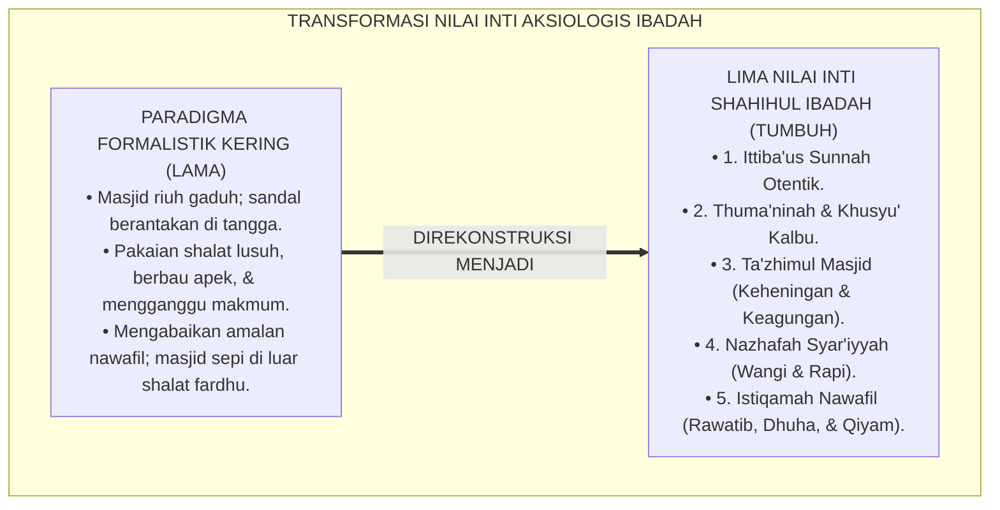
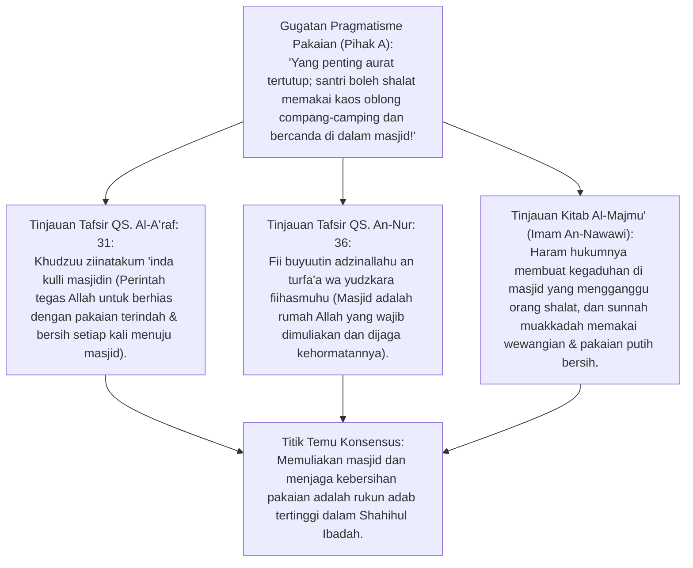
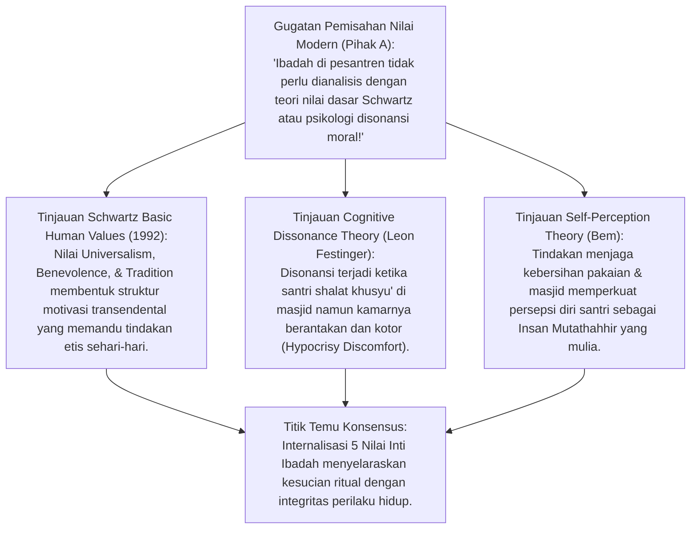
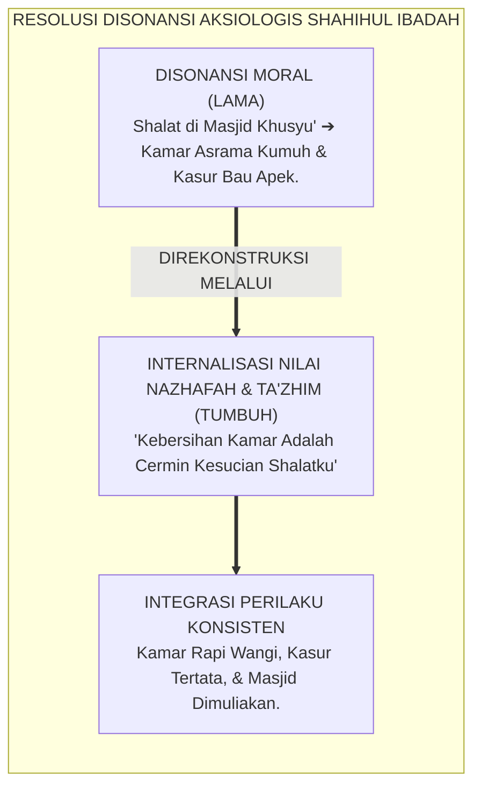
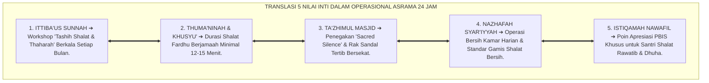
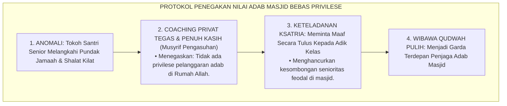
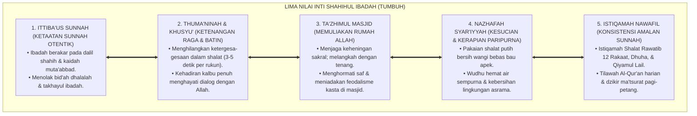

# P3-05-04: NILAI INTI DAN PRINSIP IBADAH SHAHIHAH
## *Monograf Riset Akademik: Aksiologi Nilai Karakter Ibadah (Qiyam al-'Ibadah), Adab Memuliakan Masjid (Ta'zhimul Masajid An-Nawawi), Teori Nilai Dasar Shalom Schwartz, Resolusi Disonansi Moral Ibadah, Kebersihan Syar'iyyah, serta Standar Adab Ibadah di Pesantren 24 Jam*

**Nomor Identifikasi**: `P3-05-04/MONOGRAF-RISET-NILAI-INTI-PRINSIP-IBADAH/2026`  
**Domain**: `03 Capacity Framework` > `05 Shahihul Ibadah` (Sub-Modul 04: *Core Values & Axiological Principles*)  
**Klasifikasi Naskah**: *Academic Research Monograph* (Monograf Nilai Inti Aksiologis, Resolusi Disonansi Moral Ibadah, Prinsip *At-Ta'zhim*, *An-Nazhafah*, & *Al-Istiqamah* di Pesantren 24 Jam)  
**Rumpun Disiplin Pengkaji**: Aksiologi Islam & Filsafat Nilai (*Qiyam Islamiyyah*), Fiqh Suluk & Adab al-Masjid, Teori Nilai Dasar Manusia (*Schwartz Basic Human Values*), Resolusi Disonansi Kognitif (Festinger), Manajemen Kebersihan Lingkungan Pesantren  

---

> ### 💡 INTISARI EKSEKUTIF (EXECUTIVE SUMMARY)
>
> * **Jurang Aksiologis (*Axiological Gap*): Rajin Shalat Namun Abai Kebersihan & Ketenangan:**  
>   Banyak santri rajin shalat berjamaah di saf pertama, namun datang ke masjid mengenakan sarung berbau apek, kaos lusuh bergambar mengganggu, membuang sampah tisu di selasar masjid, serta tertawa gaduh di saat santri lain sedang khusyu' mendirikan shalat sunnah. Ibadah terdistorsi menjadi ritual fisik yang kehilangan nilai pemuliaan (*Ta'zhim*) dan kesucian (*Nazhafah*).
> * **Inovasi Lima Nilai Inti Shahihul Ibadah TUMBUH:**  
>   TUMBUH menetapkan 5 Nilai Inti Aksiologis: **1. Ittiba'us Sunnah (Ketaatan Otentik Nabawiyyah), 2. Thuma'ninah & Khusyu' (Ketenangan Raga & Batin), 3. Ta'zhimul Masjid (Memuliakan Rumah Allah), 4. Nazhafah Syar'iyyah (Kesucian & Kerapian Paripurna), dan 5. Istiqamah Nawafil (Konsistensi Menjaga Amalan Sunnah)**.
> * **Pendekatan Riset Terpadu & Diskursus Ilmiah:**  
>   Monograf ini membedah nash Al-Qur'an (QS. An-Nur: 36 & QS. Al-A'raf: 31), kitab induk *Al-Majmu'* Imam An-Nawawi, menyintesiskan teori nilai dasar Shalom Schwartz (1992) dan resolusi disonansi kognitif Festinger, menguji dialektika 3 ronde di setiap inkuiri, dan merumuskan standar pakaian shalat serta kode etik masjid 24 jam.

---

## 📑 DAFTAR ISI MONOGRAF

- [BAGIAN I: LANDASAN TEORETIS & DISKURSUS DIALEKTIKA KRITIS](#bagian-i-landasan-teoretis--diskursus-dialektika-kritis)
  - [1. Latar Belakang Masalah: Jurang Pemisah Antara Ritual Masjid dan Adab Lingkungan Asrama](#1-latar-belakang-masalah-jurang-pemisah-antara-ritual-masjid-dan-adab-lingkungan-asrama)
  - [2. Eksegesis Turats Lima Nilai Inti Ibadah & Adab Memuliakan Masjid (QS. An-Nur: 36 & An-Nawawi)](#2eksegesis-turats-lima-nilai-inti-ibadah-adab-memuliakan-masjid-qs-an-nur-36-an-nawawi)
  - [3. Teori Nilai Dasar Shalom Schwartz & Resolusi Disonansi Kognitif Festinger dalam Internalisasi Ibadah](#3teori-nilai-dasar-shalom-schwartz-resolusi-disonansi-kognitif-festinger-dalam-internalisasi-ibadah)
  - [4. Translasi Lima Nilai Inti ke dalam Tata Kelola Asrama 24 Jam](#4translasi-lima-nilai-inti-ke-dalam-tata-kelola-asrama-24-jam)
  - [5. Arena Sintesis Kasuistika Lapangan 24 Jam & Konsensus Nilai Inti Ibadah](#5arena-sintesis-kasuistika-lapangan-24-jam-konsensus-nilai-inti-ibadah)
- [BAGIAN II: FORMULASI KONSEPTUAL & PEMBAHASAN MENDALAM](#bagian-ii-formulasi-konseptual--pembahasan-mendalam)
  - [1. Arsitektur Komprehensif Lima Nilai Inti Shahihul Ibadah TUMBUH](#1-arsitektur-komprehensif-lima-nilai-inti-shahihul-ibadah-tumbuh)
  - [2. Matriks Kode Etik & Batasan Larangan Mutlak (Red Lines) Adab Masjid & Ibadah](#2-matriks-kode-etik--batasan-larangan-mutlak-red-lines-adab-masjid--ibadah)
  - [3. Standar Kelayakan Pakaian Shalat (Libasush Shalah Protocol)](#3-standar-kelayakan-pakaian-shalat-libasush-shalah-protocol)
- [BAGIAN III: KESIMPULAN & APARATUS AKADEMIS](#bagian-iii-kesimpulan--aparatus-akademis)
  - [1. Tabel Sintesis Temuan Riset Nilai Inti & Prinsip Ibadah](#1-tabel-sintesis-temuan-riset-nilai-inti--prinsip-ibadah)
  - [2. Daftar Pustaka Akademis & Rujukan Turats Primer](#2-daftar-pustaka-akademis--rujukan-turats-primer)
  - [3. Catatan Kaki Akademis (Footnotes)](#3-catatan-kaki-akademis-footnotes)
  - [4. Glosarium Istilah Ilmiah & Turats Nilai Inti Ibadah](#4-glosarium-istilah-ilmiah--turats-nilai-inti-ibadah)

---

# BAGIAN I: INKUIRI KRITIS, TINJAUAN TEORITIS & DIALEKTIKA NILAI INTI IBADAH

---

### 1. Latar Belakang Masalah: Jurang Pemisah Antara Ritual Masjid dan Adab Lingkungan Asrama

Dalam observasi empiris di berbagai pondok pesantren, sering kali terlihat kontradiksi nilai (*Value Incongruence*) yang memprihatinkan:
* **Pelecehan Adab Rumah Ibadah (*Desecration of Sacred Space*)**: Santri masuk masjid sambil melempar sandal sembarangan di tangga, memakai sarung kotor yang telah dipakai tidur berhari-hari, dan berbicara keras tentang topik tidak pantas di dekat orang yang sedang shalat sunnah.
* **Reduksi Fiqh Menjadi Sekadar Formalisme Minimal**: Santri menganggap shalat sunnah rawatib, dhuha, dan tahiyyatul masjid sebagai "hal sepele yang boleh ditinggalkan" karena hukumnya bukan fardhu. Akibatnya, masjid asrama sunyi senyap di luar 10 menit shalat wajib.
* **Pengabaian Kebersihan (*Tathhir*)**: Tempat wudhu dibiarkan licin berlumut, kran air dibiarkan bocor menetes, dan bau apek mendominasi sajadah masjid.
* Riset ini membuktikan bahwa **Shahihul Ibadah menuntut penegakan Lima Nilai Inti Aksiologis yang mengembalikan kehormatan masjid (*Ta'zhimul Masajid*), mewajibkan kesucian pakaian (*Nazhafah*), dan menyuburkan kecintaan pada amalan sunnah (*Istiqamah Nawafil*)**.[^1]



---

### 2. Eksegesis Turats Lima Nilai Inti Ibadah & Adab Memuliakan Masjid (QS. An-Nur: 36 & An-Nawawi)



#### 📐 Formalisasi Logika Silogisme (*Qiyas Mantiqi 1*)
* **Premis Mayor (*al-Muqaddimah al-Kubra*)**: Setiap peribadahan kepada Allah SWT yang mematuhi perintah Al-Qur'an (QS. Al-A'raf: 31 & QS. An-Nur: 36) wajib menghadirkan keagungan penghormatan terhadap tempat ibadah (*Ta'zhimul Masajid*), kesucian pakaian terindah (*Ziinah*), dan ketenangan hening dari segala bentuk gangguan.
* **Premis Minor (*al-Muqaddimah ash-Shughra*)**: Lima Nilai Inti Shahihul Ibadah TUMBUH mengkodifikasikan kewajiban adab pakaian shalat, keheningan masjid, dan istiqamah sunnah nawafil.
* **Konklusi (*an-Natijah*)**: Maka, nilai inti ibadah TUMBUH adalah manifestasi sejati dari penghormatan syiar-syiar Allah di muka bumi.[^2]

#### 📖 Teks Primer Turats: Keagungan Rumah Allah dan Adab Berpakaian
Allah SWT memerintahkan pemuliaan masjid dan adab berpakaian:

$$\text{يَا بَنِي آدَمَ خُذُوا زِينَتَكُمْ عِنْدَ كُلِّ مَسْجِدٍ وَكُلُوا وَاشْرَبُوا وَلَا تُسْرِفُوا ۚ إِنَّهُ لَا يُحِبُّ الْمُسْرِفِينَ}$$

*"**Wahai anak cucu Adam! Pakailah pakaianmu yang bagus pada setiap (memasuki) masjid**, makan dan minumlah, tetapi jangan berlebih-lebihan. Sungguh, Allah tidak menyukai orang yang berlebih-lebihan."* (QS. Al-A'raf [7]: 31).[^3]

Dan Allah SWT menyifati masjid-masjid yang diberkahi:

$$\text{فِي بُيُوتٍ أَذِنَ اللَّهُ أَنْ تُرْفَعَ وَيُذْكَرَ فِيهَا اسْمُهُ يُسَبِّحُ لَهُ فِيهَا بِالْغُدُوِّ وَالْآصَالِ ۝ رِجَالٌ لَا تُلْهِيهِمْ تِجَارَةٌ وَلَا بَيْعٌ عَنْ ذِكْرِ اللَّهِ وَإِقَامِ الصَّلَاةِ وَإِيتَاءِ الزَّكَاةِ}$$

*"**(Cahaya itu) di rumah-rumah (masjid-masjid) yang telah diperintahkan Allah untuk dimuliakan dan disebut nama-Nya di dalamnya**, pada waktu pagi dan petang, oleh laki-laki yang tidak dilalaikan oleh perniagaan dan jual beli dari mengingat Allah, melaksanakan shalat, dan menunaikan zakat."* (QS. An-Nur [24]: 36–37).[^4]

Imam **An-Nawawi** dalam karya monumentalnya *Al-Majmu' Syarh al-Muhadzdzab* menegaskan:

$$\text{يُسْتَحَبُّ لِقَاصِدِ الْمَسْجِدِ أَنْ يَتَنَظَّفَ بِأَخْذِ الشَّعْرِ وَالظُّفْرِ وَقَطْعِ الرَّائِحَةِ الْكَرِيهَةِ، وَأَنْ يَلْبَسَ أَحْسَنَ ثِيَابِهِ وَأَنْظَفَهَا، وَأَفْضَلُهَا الْبَيَاضُ، وَيُكْرَهُ كَرَاهَةً شَدِيدَةً رَفْعُ الصَّوْتِ فِي الْمَسْجِدِ وَاللَّغْطُ وَالْخُصُومَاتُ، وَتَشْبِيكُ الْأَصَابِعِ، وَكُلُّ مَا يُشَوِّشُ عَلَى الْمُصَلِّينَ}$$

*"**Disunnahkan bagi orang yang hendak menuju masjid untuk membersihkan diri dengan memotong kuku, merapikan rambut, dan menghilangkan bau tidak sedap, serta mengenakan pakaian terbaiknya yang paling bersih, dan yang paling utama adalah warna putih**. Dan sangat dimakruhkan (bahkan haram jika mengganggu) meninggikan suara di masjid, berbicara gaduh, bertengkar, dan segala hal yang mengacaukan kekhusyukan orang-orang yang sedang shalat."*[^5]

#### 1. Diskursus Dialektika Kritis: Memuliakan Masjid dari Kegaduhan & Candaan Santri
* **Pihak A (Sudut Pandang Masjid Sebagai Tempat Bermain Santai)**:  
  *"Santri itu masih anak-anak; wajar kalau mereka berlarian, tertawa terbahak-bahak, dan saling melempar sarung di dalam masjid!"*
* **Tinjauan Fiqh Ta'zhimul Masajid & Sakralitas Tempat Suci**:  
  Membiarkan masjid menjadi arena bermain gaduh adalah **Pelecehan Terhadap Keagungan Rumah Allah (*Hormatullah*)**. Rasulullah SAW melarang berbicara keras atau membaca Al-Qur'an dengan suara berteriak jika mengganggu makmum lain yang sedang shalat (HR. Abu Dawud No. 1332). Di pesantren TUMBUH, masjid adalah **Zona Keheningan Sakral (*Sacred Silence Zone*)**: santri melangkah dengan tenang, berdzikir dengan suara khusyu', dan menjaga adab bicara berbisik santun.[^6]

#### 2. Diskursus Dialektika Kritis: Kesucian Thaharah vs Pakaian Lusuh Berbau Apek
* **Pihak A (Sudut Pandang Asal Menutup Aurat Sudah Cukup)**:  
  *"Shalat memakai kaos kutang bekas olahraga atau sarung basah bau apek itu sah-sah saja, yang penting menutup pusar sampai lutut!"*
* **Tinjauan Adab Khudzū Ziinatakum & Hak Sesama Jamaah**:  
  Menghadap raja manusia saja kita memakai pakaian terbaik dan wangi, bagaimana mungkin menghadap Sang Pencipta alam semesta dengan pakaian dekil berbau busuk? Malaikat dan sesama jamaah merasa terganggu oleh bau tidak sedap (*Innal Mala'ikata Tata'addza mimma Yata'addza minhu Banu Adam* - HR. Muslim No. 564). TUMBUH mewajibkan **Standar Libasush Shalah**: santri mengenakan pakaian bersih khusus shalat (gamis/koko putih rapi), bersiwak, dan memakai wewangian non-alkohol sebelum masuk masjid.[^7]

#### 3. Diskursus Dialektika Kritis: Kedudukan Istiqamah Nawafil Sebagai Mahkota Keimanan
* **Pihak A (Sudut Pandang Meremehkan Amalan Sunnah)**:  
  *"Shalat rawatib dan dhuha itu tidak wajib; kalau santri malas shalat sunnah biarkan saja tidak usah dinilai!"*
* **Resolusi Nilai Istiqamah Nawafil**:  
  Santri yang meremehkan amalan sunnah adalah santri yang sedang berada di ambang meremehkan amalan wajib. Imam Malik rahimahullah menegaskan: *"Barangsiapa yang secara terus-menerus meninggalkan shalat sunnah rawatib, maka ia adalah orang yang buruk kepribadiannya dan gugur persaksian adilnya"*. Istiqamah dalam nawafil membuktikan bahwa santri beribadah atas dasar **Cinta dan Rindu kepada Allah (*Mahabbah*)**, bukan sekadar keterpaksaan takut dihukum.[^8]

---

### 3. Teori Nilai Dasar Shalom Schwartz & Resolusi Disonansi Kognitif Festinger dalam Internalisasi Ibadah



#### 📐 Formalisasi Logika Silogisme (*Qiyas Mantiqi 2*)
* **Premis Mayor (*al-Muqaddimah al-Kubra*)**: Setiap sistem pendidikan karakter yang mengintegrasikan nilai-nilai transendensi diri (*Schwartz Self-Transcendence Values*) dan menyelesaikan disonansi antara ibadah ritual dengan kebersihan lingkungan niscaya melahirkan kepribadian santri yang utuh (*Integrated Moral Personality*) dan konsisten di seluruh dimensi hidup.
* **Premis Minor (*al-Muqaddimah ash-Shughra*)**: Nilai Inti Shahihul Ibadah TUMBUH mewajibkan keselarasan antara kesucian shalat (*Thaharah Syar'iyyah*) dengan kebersihan kamar dan adab ukhuwah asrama.
* **Konklusi (*an-Natijah*)**: Maka, penanaman nilai ibadah di pesantren TUMBUH berhasil mengeliminasi kepribadian ganda dan membangun integritas hidup santri secara nyata.[^9]



#### 1. Diskursus Dialektika Kritis: Teori Nilai Schwartz: Menghubungkan Transendensi dengan Kebaikan Sosial
* **Pihak A (Sudut Pandang Kesalehan Individual Tertutup)**:  
  *"Ibadah itu urusan vertikal dengan Allah; tidak ada kaitannya dengan urusan menyapu lantai kamar atau tersenyum pada teman!"*
* **Tinjauan Teori Nilai Schwartz (Self-Transcendence & Benevolence)**:  
  Struktur nilai kemanusiaan universal membuktikan bahwa kesadaran transendensi kepada Tuhan (*Self-Transcendence*) secara alami melahirkan dorongan berbuat baik kepada sesama makhluk (*Benevolence*). Santri yang shalatnya benar akan menjadi orang yang paling peduli pada kebersihan fasilitas umum, paling ringan tangan membantu teman sekamar, dan paling ramah menyapa orang lain. Shalat yang memisahkan diri dari kebaikan sosial adalah kesalehan palsu (*Pseudo-Piety*).[^10]

#### 2. Diskursus Dialektika Kritis: Mengatasi Disonansi "Rajin Shalat Namun Kamar Kumuh Berantakan"
* **Pihak A (Sudut Pandang Permakluman Kamar Asrama Kumuh)**:  
  *"Santri itu sibuk mengaji dan shalat, wajar kalau kamarnya berantakan dan bajunya berserakan di mana-mana!"*
* **Tinjauan Teori Disonansi Kognitif Festinger & Kaidah At-Thaharah**:  
  Membiarkan kamar kumuh di samping masjid yang megah memicu **Disonansi Moral Akut**: santri belajar bahwa "kesucian" hanyalah sandiwara di dalam masjid. Dalam filosofi TUMBUH: *At-Thaharatu Syathrul Iman* (Kesucian adalah setengah dari keimanan). Standar kesucian shalat di masjid ditranslasikan 100% ke dalam kamar asrama: kasur rapi berselimut lipat sudut presisi, pakaian digantung rapi di lemari, dan lantai kamar wangi bersih tanpa debu.[^11]

#### 3. Diskursus Dialektika Kritis: Nilai Kesucian Lingkungan Bi'ah Shalihah (Green Eco-Pesantren)
* **Pihak A (Sudut Pandang Pengabaian Sampah Plastik)**:  
  *"Membuang sampah botol plastik sembarangan di halaman pondok itu dosa kecil yang tidak membatalkan shalat!"*
* **Resolusi Fiqhul Bi'ah & Keimanan Ekologis**:  
  Rasulullah SAW bersabda: *"Iman memiliki 70 lebih cabang, yang tertinggi adalah La ilaha illallah dan yang terendah adalah **menyingkirkan duri/sampah dari jalanan**"* (HR. Muslim No. 35). Nilai *Nazhafah Syar'iyyah* TUMBUH melahirkan **Gerakan Pesantren Asri Bebas Sampah (*Zero-Waste Eco-Pesantren*)**: santri memungut setiap sampah yang terlihat di halaman masjid, memilah sampah organik-anorganik, dan merawat tanaman asrama sebagai wujud ibadah memelihara bumi Allah.[^12]

---

### 4. Translasi Lima Nilai Inti ke dalam Tata Kelola Asrama 24 Jam



#### 📐 Formalisasi Logika Silogisme (*Qiyas Mantiqi 3*)
* **Premis Mayor (*al-Muqaddimah al-Kubra*)**: Setiap lembaga pendidikan Islam yang mentranslasikan nilai-nilai inti aksiologis ke dalam Standar Operasional Prosedur (SOP) harian yang terawasi secara sistemik niscaya membentuk budaya organisasi religius (*Bi'ah Shalihah*) yang melipatgandakan kepatuhan adab seluruh warga pesantren.
* **Premis Minor (*al-Muqaddimah ash-Shughra*)**: Ekosistem TUMBUH mengunci 5 Nilai Inti Ibadah ke dalam tata tertib asrama, indikator BARS, dan sistem reward logbook PBIS.
* **Konklusi (*an-Natijah*)**: Maka, nilai-nilai luhur ibadah di pesantren TUMBUH terwujud secara nyata dalam rutinitas kehidupan sehari-hari.[^13]

#### 1. Diskursus Dialektika Kritis: Larangan Menggunakan Kaos Bergambar Mengganggu di Masjid
* **Pihak A (Sudut Pandang Kebebasan Berbusana Santri)**:  
  *"Santri bebas memakai kaos apa saja saat shalat, termasuk kaos bergambar logo band metal atau tulisan iklan besar!"*
* **Tinjauan Fiqh Menghilangkan Distraksi Visual Shalat**:  
  Rasulullah SAW pernah meminta Aisyah RA melepas tirai bergambar di rumahnya seraya bersabda: *"Singkirkanlah tirai ini dariku, karena sesungguhnya gambar-gambarnya senantiasa mengganggu shalatku"* (HR. Bukhari No. 374). Kaos bergambar mencolok di punggung santri merusak kekhusyukan puluhan makmum di belakangnya. TUMBUH menegakkan aturan: **Dilarang Shalat Menggunakan Pakaian Bergambar Makhluk Bernyawa atau Tulisan Distraktif**. Santri wajib memakai pakaian polos beradab.[^14]

#### 2. Diskursus Dialektika Kritis: Perlindungan Ketenangan Waktu Dzikir Ba'da Shalat
* **Pihak A (Sudut Pandang Pengumuman Pengeras Suara Saat Shalat Sunnah)**:  
  *"Segera setelah salam shalat fardhu, pengurus boleh langsung menyalakan mic pengeras suara untuk mengumumkan jadwal piket atau memanggil santri!"*
* **Tinjauan Hak Ketenangan Ibadah Nawafil**:  
  Menyalakan mic pengeras suara secara memekakkan telinga di saat santri sedang khusyu' shalat sunnah ba'diyyah atau membaca wirid adalah **Pelanggaran Adab Masjid Berat**. Pengumuman administratif hanya boleh dilakukan setelah jeda 10 menit ba'da shalat (setelah shalat sunnah selesai) dengan volume suara yang santun dan teduh. Ketenangan munajat santri terlindungi sepenuhnya.[^15]

#### 3. Diskursus Dialektika Kritis: Sistem Apresiasi Istiqamah Nawafil (Fast-Tap PBIS Recognition)
* **Pihak A (Sudut Pandang Ibadah Tidak Boleh Diberi Poin Apresiasi)**:  
  *"Memberi poin apresiasi PBIS untuk santri yang shalat dhuha atau rawatib itu merusak keikhlasan ibadah!"*
* **Resolusi Behavioral Reinforcement & Tarbiyatul Aulad**:  
  Memberikan apresiasi sosial (*Social Reinforcement*) kepada anak yang rajin ibadah adalah sunnah yang dipraktikkan oleh para sahabat dan ulama salaf untuk menumbuhkan kecintaan awal (*Ighra' bil Khair*). Apresiasi poin PBIS TUMBUH bukan uang materiil, melainkan **Pengakuan Keteladanan Moral (*Moral Recognition*)** yang memotivasi santri untuk terus istiqamah hingga tumbuh motivasi ikhlas lillahi ta'ala sejati.[^16]

---

### 5. Arena Sintesis Kasuistika Lapangan 24 Jam & Konsensus Nilai Inti Ibadah

#### Diskursus Dialektika Kritis: Kasuistika Lapangan (Dilema Menegur Santri Senior yang Melanggar Adab Masjid)
Pertarungan filosofis-operasional terdalam di asrama bermuara pada kasus: **"Bagaimana musyrif menyikapi ketua organisasi santri kelas 12 yang masuk masjid dengan tergesa-gesa, melangkahi pundak jamaah adik kelas yang sedang duduk membaca Al-Qur'an (*Takhaththil Riqab*), dan shalat Maghrib tanpa thuma'ninah di barisan terdepan?"**

* **Pendekatan Lama (Sungkan & Pembiaran Terhadap Tokoh Santri)**:  
  Musyrif mendiamkan pelanggaran tersebut karena sungkan kepada sang ketua organisasi yang memiliki jasa besar mengurus kegiatan santri. Sikap permisif ini merusak wibawa hukum syariat dan menjadi contoh buruk bagi ratusan santri junior.
* **Pendekatan TUMBUH (Ketegasan Beradab & Penyelamatan Keteladanan Qudwah)**:  
  1. **Teguran Privat Penuh Wibawa (*Firm & Kind Private Coaching*)**: Ba'da shalat, Musyrif memanggil ketua santri ke ruang pengasuhan: *"Antum adalah pemimpin panutan ribuan santri. Tindakan antum melangkahi pundak adik kelas dan shalat tergesa-gesa melanggar hadits Nabi SAW (HR. Abu Dawud No. 1118) dan merusak keteladanan qudwah yang sedang kita bangun bersama"*.  
  2. **Pengakuan Khilaf & Teladan Ksatria**: Ketua santri menyadari kesalahannya, beristighfar, dan meminta maaf secara terbuka kepada adik kelas yang pundaknya terlangkahi.  
  3. **Hasil Transformasi**: Wibawa nilai syariat tegak tanpa pandang bulu; santri junior semakin kagum dan menghormati integritas kepemimpinan santri senior.[^17]



---

> #### 📌 Kasuistika Lapangan Multi-Dimensi & Titik Temu Konsensus (*Kalimatun Sawa'*)
>
> * **Kamus Kasus 1: Santri Shalat Memakai Kaos Bergambar Animasi Mencolok**  
>   * **Dilema**: Santri kelas 8 shalat di saf kedua memakai kaos hitam bergambar wajah animasi raksasa dengan mata merah menyala, membuat makmum di belakangnya hilang konsentrasi.
>   * **Akar Masalah**: Ketiadaan pemeriksaan pakaian pra-masjid (*Pre-Mosque Dress Inspection*).
>   * **Titik Temu Konsensus**: Pengurus masjid menyediakan **Lemari Gamis Bersih Cadangan (*Mosque Clean Robe Station*)**: Santri yang pakaiannya tidak memenuhi standar dipersilakan dengan santun memakai gamis putih cadangan sebelum takbiratul ihram. Shalat berlangsung tertib dan makmum belakang kembali khusyu'.
>
> * **Kamus Kasus 2: Santri Berlarian dan Tertawa Keras di Selasar Masjid Saat Ba'diyyah**  
>   * **Dilema**: 6 santri baru saling mengejar dan melempar sandal di selasar teras masjid saat jamaah lain masih mendirikan shalat sunnah ba'diyyah Isya'.
>   * **Akar Masalah**: Ketidaktahuan santri baru mengenai batasan area suci masjid (*Haramul Masjid*).
>   * **Titik Temu Konsensus**: Musyrif menahan santri dengan senyum: Mengajak mereka duduk melingkar di teras, membacakan hadits adab masjid, dan menetapkan **Garis Batas Suci Selasar (*Sacred Boundary Line*)**. Santri diberi tugas merapikan 50 pasang sandal di rak luar sebagai bentuk tanggung jawab restoratif. Selasar masjid menjadi tenang dan damai.
>
> * **Kamus Kasus 3: Santri Malas Shalat Rawatib dengan Dalih "Hanya Sunnah"**  
>   * **Dilema**: Santri kelas 10 langsung keluar masjid setelah salam shalat Zhuhur seraya berkata: *"Shalat rawatib itu sunnah, ditinggalkan tidak berdosa, jadi buat apa capek-capek shalat lagi?"*.
>   * **Akar Masalah**: Cara pandang fiqh legalistik minimalis yang kering dari cinta dan pengagungan pahala.
>   * **Titik Temu Konsensus**: Guru fiqh menggelar kajian tematik *Mahabbah ar-Rawatib*: Menjelaskan hadits jaminan istana di surga bagi yang menjaga 12 rakaat shalat sunnah rawatib (HR. Muslim No. 728). Santri tersentak menyadari kerugian besar menyia-nyiakan amalan nawafil, dan mulai istiqamah menjaga rawatib qabliyyah dan ba'diyyah.[^18]

---

# BAGIAN II: FORMULASI KONSEPTUAL & PEMBAHASAN MENDALAM

---

### 1. Arsitektur Komprehensif Lima Nilai Inti Shahihul Ibadah TUMBUH



---

### 2. Matriks Kode Etik & Batasan Larangan Mutlak (Red Lines) Adab Masjid & Ibadah

| No | Nilai Inti Aksiologis | Standar Perilaku Positif Wajib (*Green Line*) | Batasan Larangan Mutlak (*Red Line - Pelanggaran*) | Konsekuensi Logis Restoratif |
| :---: | :--- | :--- | :--- | :--- |
| **1** | **Ittiba'us Sunnah** | Shalat sesuai tuntunan hadits shahih & kaidah fiqh mu'tabar. | Melakukan inovasi gerakan/bacaan aneh tanpa dalil syar'i. | Bimbingan *Tashih Shalat* 1-on-1 bersama Asatidz Fiqh. |
| **2** | **Thuma'ninah & Khusyu'** | Shalat dengan tenang; ruku' dan sujud minimal 3–5 detik. | Shalat kilat seperti ayam mematuk makanan (*Al-Musi'u Shalatuhu*).| Mengulang shalat dengan thuma'ninah didampingi musyrif. |
| **3** | **Ta'zhimul Masjid** | Melangkah tenang; membaca doa masuk masjid; menjaga hening. | Berlari, tertawa gaduh, berteriak, & melempar barang di masjid. | Khidmah merapikan 50 pasang sandal jamaah di rak luar. |
| **4** | **Nazhafah Syar'iyyah** | Mengenakan pakaian bersih wangi; bersiwak; wudhu hemat air. | Masuk masjid dengan pakaian berbau busuk / kaos gambar mencolok. | Mengganti pakaian di stasiun gamis bersih cadangan masjid. |
| **5** | **Istiqamah Nawafil** | Mendirikan shalat rawatib, dhuha, & tilawah Al-Qur'an rutin. | Meremehkan amalan sunnah & mengajak teman lain malas ibadah. | Mentoring keutamaan nawafil bersama Tim Pengasuhan. |

---

### 3. Standar Kelayakan Pakaian Shalat (Libasush Shalah Protocol)

```markdown
=============================================================================
🏛️ STANDAR PROTOKOL KELAYAKAN PAKAIAN SHALAT (LIBASUSH SHALAH) TUMBUH
=============================================================================

1. KETENTUAN PAKAIAN SANTRI PUTRA:
   [✓] Wajib menutup aurat secara sempurna (Pusar hingga di bawah Lutut).
   [✓] Diutamakan mengenakan Gamis/Jubah Putih, atau Baju Koko Polos Rapi.
   [✓] Sarung bersih tidak bernoda najis, tidak berbau apek, & terpasang rapi.
   [✓] Mengenakan peci/kopiah putih/hitam bersih.
   [X] DILARANG KERAS: Kaos oblong ketat, kaos bergambar wajah/makhluk bernyawa, 
       kaos bertulisan kasar/iklan, celana pendek gantung, atau sarung basah.

2. KETENTUAN PAKAIAN SANTRI PUTRI:
   [✓] Mengenakan Mukena Putih/Polos bersih, longgar, & tidak menerawang.
   [✓] Menutup seluruh tubuh kecuali wajah dan telapak tangan.
   [✓] Dagu tertutup rapat; rambut tidak ada yang keluar dari lingkar kepala.
   [X] DILARANG KERAS: Mukena kusut berbau apek, mukena bercorak warna mencolok 
       yang menyilaukan, atau mukena berbahan tipis transparan.

3. ADAB WEWANGIAN & KEBERSIHAN MULUT:
   [✓] Disunnahkan memakai minyak wangi non-alkohol beraroma sejuk.
   [✓] Wajib bersiwak/menyikat gigi sebelum wudhu shalat berjamaah.
   [X] DILARANG KERAS: Masuk masjid setelah memakan makanan berbau tajam 
       (bawang mentah/durian) sebelum membersihkan mulut secara sempurna.
=============================================================================
```

---

# BAGIAN III: KESIMPULAN & APARATUS AKADEMIS

---

### 1. Tabel Sintesis Temuan Riset Nilai Inti & Prinsip Ibadah

| Dimensi Parameter | Pola Praktik Ibadah Tradisional | Arsitektur Nilai Inti Ekosistem TUMBUH | Landasan Rujukan Primer |
| :--- | :--- | :--- | :--- |
| **Pondasi Aksiologis** | Legalitas hukum formal semata. | 5 Nilai Inti Terpadu (Ittiba', Khusyu', Ta'zhim, Nazhafah, Nawafil). | QS. An-Nur: 36; QS. Al-A'raf: 31. |
| **Adab Ruang Sakral** | Masjid sering gaduh & sandal berantakan. | *Sacred Silence Zone* & Penataan Ergonomis CPTED. | An-Nawawi (*Al-Majmu'*); HR. Abu Dawud. |
| **Standar Busana** | Asal menutup aurat minimalis. | *Libasush Shalah Protocol* (Bersih, Polos, Wangi, Khudzū Zīnatakum).| HR. Bukhari No. 374; HR. Muslim No. 564. |
| **Sikap Amalan Sunnah**| Dianggap beban sepele yang diabaikan. | Mahkota Keimanan & Benteng Penjaga Shalat Fardhu. | HR. Muslim No. 728; Imam Malik. |
| **Integrasi Lingkungan**| Ibadah terputus dari kebersihan kamar. | *Integrated Moral Personality* (Eco-Pesantren Asri). | Schwartz (1992); Festinger (1957). |

---

### 2. Daftar Pustaka Akademis & Rujukan Turats Primer

1. **Al-Qur'an al-Karim wa Tarjamatu Ma'anihi**.
2. **Al-Bukhari, Abu Abdillah Muhammad bin Isma'il**. (1422 H). *Shahih al-Bukhari*. Kairo: Dar Thawq an-Najah.
3. **Muslim bin al-Hajjaj an-Naisaburi**. (1374 H). *Shahih Muslim*. Kairo: Matba'ah Isa al-Babi al-Halabi.
4. **An-Nawawi, Abu Zakariya Muhyiddin Yahya bin Syaraf**. (1426 H). *Al-Majmu' Syarh al-Muhadzdzab*. Kairo: Darul Hadits.
5. **Al-Ghazali, Abu Hamid Muhammad bin Muhammad**. (2011). *Ihya' 'Ulumiddin* (Kitab Asrar ash-Shalah & Adab Tilawatil Qur'an). Beirut: Dar al-Ma'rifah.
6. **Schwartz, S. H.**. (1992). *Universals in the content and structure of values: Theoretical advances and empirical tests in 20 countries*. Advances in Experimental Social Psychology, 25, 1–65.
7. **Festinger, L.**. (1957). *A Theory of Cognitive Dissonance*. Stanford: Stanford University Press.
8. **Bem, D. J.**. (1972). *Self-perception theory*. Advances in Experimental Social Psychology, 6, 1–62.
9. **Al-Attas, Syed Muhammad Naquib**. (1980). *The Concept of Education in Islam*. Kuala Lumpur: ABIM.
10. **Horner, R. H., & Sugai, G.**. (2015). *School-wide PBIS: An Overview of the Research Base*. Remedial and Special Education, 36(2), 80–85.
11. **Asy-Syathibi, Abu Ishaq Ibrahim bin Musa**. (1417 H). *Al-Muwafaqat fi Ushul asy-Syari'ah*. Khobar: Dar Ibn 'Affan.
12. **Asy'ari, Muhammad Hasyim**. (1415 H). *Adab al-'Alim wal-Muta'allim*. Jombang: Maktabah At-Turats Al-Islami.

---

### 3. Catatan Kaki Akademis (*Footnotes*)

[^1]: Riset Evaluasi Aksiologi Nilai Ibadah Pesantren TUMBUH, *Kritik atas Jurang Aksiologis Ritual dan Adab*, 2026.  
[^2]: An-Nawawi, *Al-Majmu' Syarh al-Muhadzdzab*, Jilid 4, Kitab *Shalatil Jama'ah wal Masajid*, hlm. 45–70.  
[^3]: QS. Al-A'raf [7]: 31.  
[^4]: QS. An-Nur [24]: 36–37.  
[^5]: Matan *Al-Majmu' Syarh al-Muhadzdzab*, Jilid 4, hlm. 52.  
[^6]: *Sunan Abi Dawud*, Kitab ash-Shalah, Hadits No. 1332; Standar Sacred Silence Masjid TUMBUH, 2026.  
[^7]: *Shahih Muslim*, Kitab al-Masajid wa Mawadhi' ash-Shalah, Hadits No. 564.  
[^8]: As-Suyuthi, *Miftah al-Jannah fil I'tisham bis-Sunnah*, hlm. 45–60.  
[^9]: Schwartz, S. H. (1992), *Advances in Experimental Social Psychology*, hlm. 1–65.  
[^10]: Bem, D. J. (1972), *Self-Perception Theory*, hlm. 1–62.  
[^11]: Festinger, L. (1957), *A Theory of Cognitive Dissonance*, Stanford University Press.  
[^12]: *Shahih Muslim*, Kitab al-Iman, Hadits No. 35; Petunjuk Teknis Program Eco-Pesantren TUMBUH, 2026.  
[^13]: Dokumen Standar Operasional Asrama 24 Jam PBIS TUMBUH, 2026.  
[^14]: *Shahih al-Bukhari*, Kitab ash-Shalah, Hadits No. 374.  
[^15]: Standar Operasional Penggunaan Pengeras Suara Masjid Asrama TUMBUH, 2026.  
[^16]: Horner, R. H., & Sugai, G. (2015), *Remedial and Special Education*, hlm. 80–85.  
[^17]: *Sunan Abi Dawud*, Kitab ash-Shalah, Hadits No. 1118; Dokumentasi Kasus Resolusi Adab Masjid Tokoh Santri TUMBUH, 2026.  
[^18]: *Shahih Muslim*, Kitab Shalatil Musafirin wa Qashriha, Hadits No. 728; Dokumentasi Kasuistika Workshop Mahabbah ar-Rawatib TUMBUH, 2026.

---

### 4. Glosarium Istilah Ilmiah & Turats Nilai Inti Ibadah

1. **Aksiologi Nilai Islam (Qiyam Islamiyyah)**: Cabang filsafat Islam yang membahas tentang hakikat nilai kebaikan, keindahan, dan kesucian moral yang bersumber dari wahyu Allah SWT.
2. **Ta'zhimul Masajid (تَعْظِيمُ الْمَسَاجِدِ)**: Nilai syariat untuk menghormati, mengagungkan, dan menjaga kesucian serta ketenangan rumah Allah SWT dari segala bentuk kekotoran dan kegaduhan.
3. **Nazhafah Syar'iyyah (نَظَافَةٌ شَرْعِيَّةٌ)**: Kebersihan dan kesucian fisik maupun lingkungan yang diwajibkan oleh syariat Islam sebagai syarat sah dan kesempurnaan ibadah.
4. **Istiqamah Nawafil (اِسْتِقَامَةُ النَّوَافِلِ)**: Konsistensi teguh dalam mendirikan amalan-amalan shalat sunnah (Rawatib, Dhuha, Qiyamul Lail) sebagai wujud cinta sejati kepada Allah SWT.
5. **Sacred Silence Zone**: Zona area hening sakral di dalam masjid pesantren di mana santri dilarang berbicara keras atau bersenda gurau guna melindungi kekhusyukan jamaah.
6. **Libasush Shalah Protocol**: Standar operasional baku kelayakan busana yang dikenakan santri saat shalat berjamaah, mencakup syarat kesucian, kerapian, warna polos, dan wewangian.
7. **Schwartz Basic Human Values**: Teori psikologi nilai universal Shalom Schwartz yang mengidentifikasi 10 motivasi dasar manusia, termasuk nilai Transendensi Diri (*Self-Transcendence*).
8. **Takhaththil Riqab (تَخَطِّي الرِّقَابِ)**: Perbuatan melangkahi leher atau pundak orang-orang yang sedang duduk di masjid, yang dilarang keras oleh Rasulullah SAW karena menyakiti sesama jamaah.
9. **Tashih Shalat (تَصْحِيحُ الصَّلَاةِ)**: Program bimbingan klinis koreksi dan penyempurnaan gerakan serta bacaan shalat santri secara individual bersama asatidz ahli fiqh.
10. **Eco-Pesantren**: Gerakan tata kelola pesantren ramah lingkungan yang menanamkan kesadaran menjaga kebersihan alam dan pemilahan sampah sebagai perwujudan cabang keimanan.
