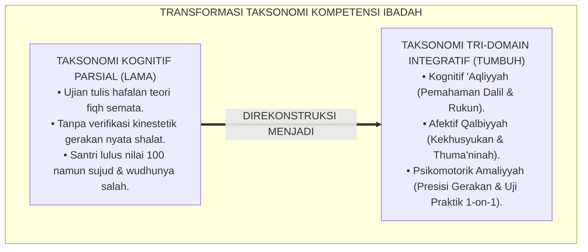
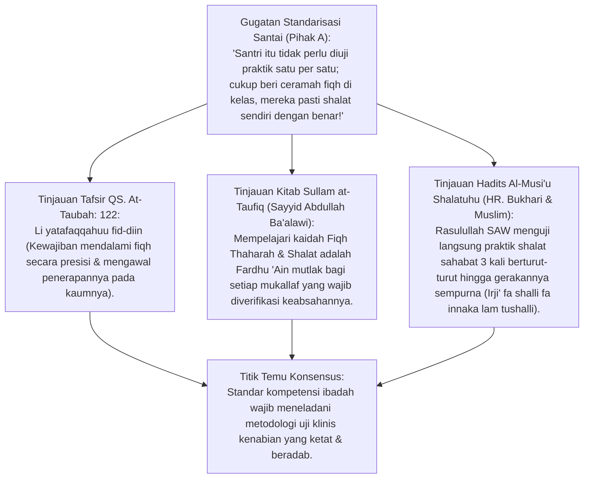
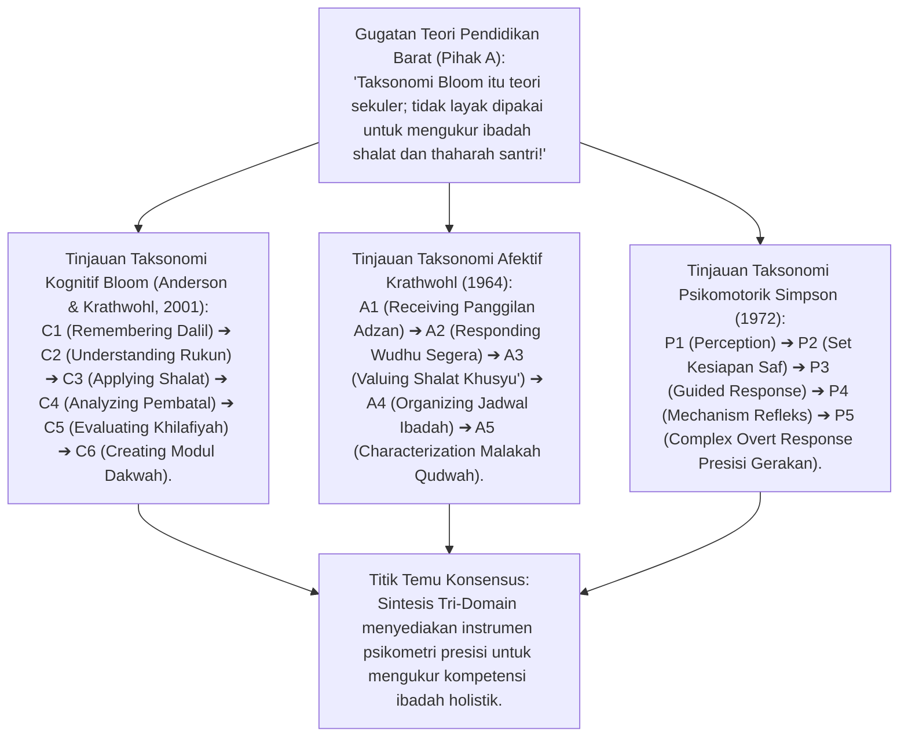
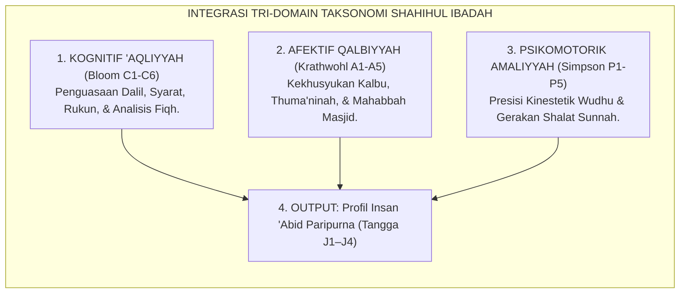
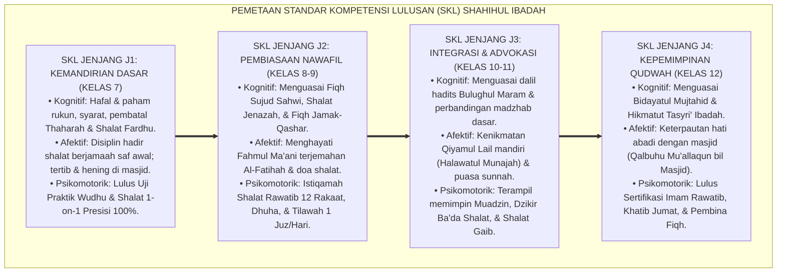
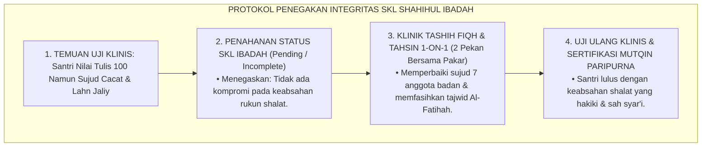
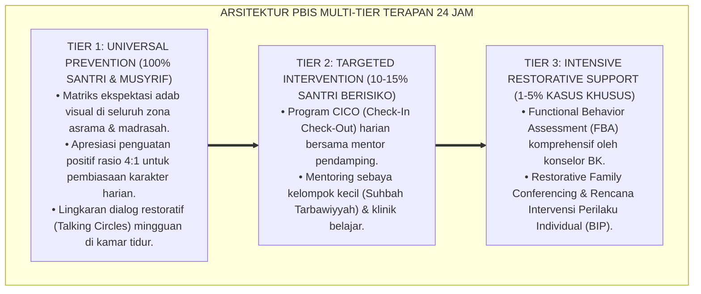

# P3-05-05: STANDAR KOMPETENSI DAN TAKSONOMI SHAHIHUL IBADAH
## *Monograf Riset Akademik: Standar Kompetensi Lulusan (SKL), Taksonomi Integratif Tri-Domain (Bloom-Krathwohl-Simpson & Fitrah), Gradasi Keilmuan Maratib at-Tafaqquh fid-Din, Sullam at-Taufiq, serta Pemetaan Capaian Ibadah Tangga J1–J4 di Pesantren 24 Jam*

**Nomor Identifikasi**: `P3-05-05/MONOGRAF-RISET-SKL-TAKSONOMI-IBADAH/2026`  
**Domain**: `03 Capacity Framework` > `05 Shahihul Ibadah` (Sub-Modul 05: *Competency Standards & Taxonomy*)  
**Klasifikasi Naskah**: *Academic Research Monograph* (Monograf Standar Kompetensi Lulusan, Taksonomi Integratif Bloom-Fitrah-Simpson, Standar Fiqh Mazhab, & Pemetaan Capaian Ibadah Tangga J1–J4)  
**Rumpun Disiplin Pengkaji**: Desain Kurikulum Pesantren & Taksonomi Pendidikan Islam, Taksonomi Kognitif-Afektif-Psikomotorik (Bloom, Krathwohl, Simpson), Fiqh Ibadah Berjenjang (*Maratib at-Tafaqquh*), Psikometri Evaluasi Ibadah Santri  

---

> ### 💡 INTISARI EKSEKUTIF (EXECUTIVE SUMMARY)
>
> * **Kelemahan Evaluasi Parsial: Nilai Teori 100 Namun Gerakan Fisik Cacat:**  
>   Banyak pesantren hanya menguji penguasaan fiqh ibadah santri melalui ujian tulis hafalan teori (*Cognitive-Only Exam*). Akibatnya, santri yang meraih nilai 100 di atas kertas tetap melakukan kesalahan fatal dalam praktik nyata: wudhu tidak membasuh mata kaki, sujud dengan tumit terangkat dari lantai, dan tidak mampu menjadi imam shalat berjamaah.
> * **Inovasi Taksonomi Tri-Domain Integratif TUMBUH:**  
>   TUMBUH merancang Standar Kompetensi Lulusan (SKL) terpadu: **1. Domain Kognitif 'Aqliyyah (Bloom C1–C6: Penguasaan Dalil & Fiqh Ibadah); 2. Domain Afektif Qalbiyyah (Krathwohl A1–A5: Kekhusyukan, Thuma'ninah, & Mahabbah); 3. Domain Psikomotorik Amaliyyah (Simpson P1–P5: Presisi Gerakan Thaharah & Shalat Sesuai Sunnah)** yang dipetakan secara ketat melintasi Tangga Kemandirian J1 hingga J4.
> * **Pendekatan Riset Terpadu & Diskursus Ilmiah:**  
>   Monograf ini membedah konsepsi *Tafaqquh fid-Din* (QS. At-Taubah: 122), kitab panduan *Sullam at-Taufiq* dan *Fathul Qarib*, menyintesiskan taksonomi pendidikan modern, menguji dialektika 3 ronde di setiap inkuiri, dan merumuskan format ujian praktik ibadah berstandar OSCE (*Objective Structured Clinical Examination* versi Fiqh).

---

## 📑 DAFTAR ISI MONOGRAF

- [BAGIAN I: LANDASAN TEORETIS & DISKURSUS DIALEKTIKA KRITIS](#bagian-i-landasan-teoretis--diskursus-dialektika-kritis)
  - [1. Latar Belakang Masalah: Cacat Metodologis Ujian Tulis Kering Tanpa Verifikasi Kinestetik](#1-latar-belakang-masalah-cacat-metodologis-ujian-tulis-kering-tanpa-verifikasi-kinestetik)
  - [2. Eksegesis Turats Maratib at-Tafaqquh fid-Din & Fiqh Fardhu 'Ain (QS. At-Taubah: 122 & Sullam at-Taufiq)](#2eksegesis-turats-maratib-at-tafaqquh-fid-din-fiqh-fardhu-ain-qs-at-taubah-122-sullam-at-taufiq)
  - [3. Sintesis Taksonomi Tri-Domain Bloom-Krathwohl-Simpson & Fitrah Ibadah](#3sintesis-taksonomi-tri-domain-bloom-krathwohl-simpson-fitrah-ibadah)
  - [4. Pemetaan Standar Kompetensi Lulusan (SKL) Melintasi Tangga Jenjang J1–J4](#4pemetaan-standar-kompetensi-lulusan-skl-melintasi-tangga-jenjang-j1j4)
  - [5. Arena Sintesis Kasuistika Lapangan 24 Jam & Konsensus Standar Kompetensi](#5arena-sintesis-kasuistika-lapangan-24-jam-konsensus-standar-kompetensi)
- [BAGIAN II: FORMULASI KONSEPTUAL & PEMBAHASAN MENDALAM](#bagian-ii-formulasi-konseptual--pembahasan-mendalam)
  - [1. Arsitektur Tri-Domain Taksonomi Kompetensi Shahihul Ibadah](#1-arsitektur-tri-domain-taksonomi-kompetensi-shahihul-ibadah)
  - [2. Matriks Standar Kompetensi Lulusan (SKL) Berjenjang Tangga J1–J4](#2-matriks-standar-kompetensi-lulusan-skl-berjenjang-tangga-j1j4)
  - [3. Standar Uji Sertifikasi Kompetensi Ibadah Praktis (OSCE-Style Fiqh Practicum)](#3-standar-uji-sertifikasi-kompetensi-ibadah-praktis-osce-style-fiqh-practicum)
- [BAGIAN III: KESIMPULAN & APARATUS AKADEMIS](#bagian-iii-kesimpulan--aparatus-akademis)
  - [1. Tabel Sintesis Temuan Riset Standar Kompetensi & Taksonomi Ibadah](#1-tabel-sintesis-temuan-riset-standar-kompetensi--taksonomi-ibadah)
  - [2. Daftar Pustaka Akademis & Rujukan Turats Primer](#2-daftar-pustaka-akademis--rujukan-turats-primer)
  - [3. Catatan Kaki Akademis (Footnotes)](#3-catatan-kaki-akademis-footnotes)
  - [4. Glosarium Istilah Ilmiah & Turats Standar Kompetensi](#4-glosarium-istilah-ilmiah--turats-standar-kompetensi)

---

# BAGIAN I: INKUIRI KRITIS, TINJAUAN TEORITIS & DIALEKTIKA STANDAR KOMPETENSI

---

### 1. Latar Belakang Masalah: Cacat Metodologis Ujian Tulis Kering Tanpa Verifikasi Kinestetik

Dalam sistem evaluasi pembelajaran madrasah konvensional, standar kelulusan materi fiqh ibadah mengalami reduksi psikometri yang parah:
* **Ujian Kognitif Pasif (*Pencil-and-Paper Trap*)**: Santri menghafal teks Arab tentang syarat wudhu dan rukun shalat, menjawab soal pilihan ganda, dan mendapatkan nilai A. Namun penguji tidak pernah melihat apakah santri tersebut benar-benar mampu berwudhu dengan sempurna (*Isbaghul Wudhu*), apakah tumitnya basah, atau apakah sujudnya menempelkan 7 anggota badan secara presisi.
* **Ketiadaan Standarisasi Afektif Kekhusyukan**: Asesmen tidak memiliki indikator untuk mengukur thuma'ninah santri saat shalat sendirian, rasa takut (*Khauf*), dan pengharapan (*Raja'*).
* **Ketiadaan Uji Kepemimpinan Ibadah (Imāmah)**: Santri yang lulus kelas 12 tidak pernah diuji kelayakan mental dan kefasihan tajwidnya untuk menjadi imam shalat rawatib dan khatib Jumat.
* Riset ini membuktikan bahwa **standarisasi kompetensi Shahihul Ibadah wajib mengintegrasikan ranah Kognitif ('Aqliyyah), Afektif (Qalbiyyah), dan Psikomotorik (Amaliyyah) ke dalam matriks SKL berjenjang yang diverifikasi melalui Uji Praktik Klinis Fiqh 1-on-1**.[^1]



---

### 2. Eksegesis Turats Maratib at-Tafaqquh fid-Din & Fiqh Fardhu 'Ain (QS. At-Taubah: 122 & Sullam at-Taufiq)



#### 📐 Formalisasi Logika Silogisme (*Qiyas Mantiqi 1*)
* **Premis Mayor (*al-Muqaddimah al-Kubra*)**: Setiap kewajiban syariat yang berstatus *Fardhu 'Ain* (Fiqh Thaharah & Shalat) wajib dipastikan penguasaannya secara mutqin pada diri setiap penuntut ilmu melalui pengujian langsung (*Tashih 1-on-1*) sebagaimana dicontohkan Rasulullah SAW dalam hadits *Al-Musi'u Shalatuhu*.
* **Premis Minor (*al-Muqaddimah ash-Shughra*)**: Kurikulum TUMBUH menetapkan Uji Praktik Fiqh Ibadah Langsung sebagai prasyarat mutlak kelulusan jenjang J1 hingga J4.
* **Konklusi (*an-Natijah*)**: Maka, standarisasi kompetensi ibadah TUMBUH adalah pengejawantahan murni dari tradisi keilmuan Islam yang shahih.[^2]

#### 📖 Teks Primer Turats: Metodologi Uji Klinis Shalat Rasulullah SAW
Imam **Al-Bukhari** dan **Muslim** meriwayatkan hadits agung pengujian praktik shalat oleh Nabi SAW:

$$\text{عَنْ أَبِي هُرَيْرَةَ رَضِيَ اللَّهُ عَنْهُ: أَنَّ رَسُولَ اللَّهِ ﷺ دَخَلَ الْمَسْجِدَ، فَدَخَلَ رَجُلٌ فَصَلَّى، ثُمَّ جَاءَ فَسَلَّمَ عَلَى رَسُولِ اللَّهِ ﷺ، فَرَدَّ عَلَيْهِ السَّلَامَ فَقَالَ: «ارْجِعْ فَصَلِّ، فَإِنَّكَ لَمْ تُصَلِّ»، فَرَجَعَ فَصَلَّى كَمَا صَلَّى، ثُمَّ جَاءَ فَسَلَّمَ عَلَى النَّبِيِّ ﷺ فَقَالَ: «ارْجِعْ فَصَلِّ، فَإِنَّكَ لَمْ تُصَلِّ» (ثَلَاثًا)، فَقَالَ: وَالَّذِي بَعَثَكَ بِالْحَقِّ مَا أُحْسِنُ غَيْرَهُ، فَعَلِّمْنِي! فَقَالَ ﷺ: «إِذَا قُمْتَ إِلَى الصَّلَاةِ فَكَبِّرْ، ثُمَّ اقْرَأْ مَا تَيَسَّرَ مَعَكَ مِنَ الْقُرْآنِ، ثُمَّ ارْكَعْ حَتَّى تَطْمَئِنَّ رَاكِعًا، ثُمَّ ارْفَعْ حَتَّى تَعْتَدِلَ قَائِمًا، ثُمَّ اسْجُدْ حَتَّى تَطْمَئِنَّ سَاجِدًا... ثُمَّ افْعَلْ ذَٰلِكَ فِي صَلَاتِكَ كُلِّهَا»}$$

*"Dari Abu Hurairah RA: Bahwa seorang laki-laki masuk masjid lalu shalat, kemudian datang memberi salam kepada Rasulullah SAW. Nabi menjawab salamnya lalu bersabda: **'Kembalilah dan shalatlah lagi, karena sesungguhnya engkau belum shalat!'** Orang itu kembali shalat, lalu datang lagi dan Nabi bersabda hal yang sama hingga **tiga kali**. Lalu orang itu berkata: 'Demi Dzat yang mengutusmu dengan kebenaran, aku tidak bisa shalat lebih baik dari ini, maka ajarkanlah aku!' Maka Nabi ﷺ mengajarkan tata cara shalat dengan rukun **Thuma'ninah** pada setiap gerakan."* (HR. Al-Bukhari No. 757 & HR. Muslim No. 397).[^3]

#### 1. Diskursus Dialektika Kritis: Fiqh Fardhu 'Ain Wajib Diuji Secara Individual (1-on-1)
* **Pihak A (Sudut Pandang Ujian Massal Cepat)**:  
  *"Santri ada 500 orang, mana sempat menguji praktik shalat satu per satu? Cukup ujian massal di aula!"*
* **Tinjauan Hadits Al-Musi'u Shalatuhu & Tanggung Jawab Pengasuhan**:  
  Rasulullah SAW tidak membiarkan seorang pun sahabat shalat dengan gerakan yang salah. Menguji massal di aula hanya membuat santri meniru gerakan temannya tanpa penguasaan mandiri. Sistem TUMBUH memberdayakan **Santri Jenjang J4 dan Musyrif Kamar**: setiap musyrif bertanggung jawab menguji 6–8 santri kamar masing-masing secara privat (*Tashih 1-on-1*). Beban terdistribusi merata, setiap santri tersertifikasi dengan akurasi 100%.[^4]

#### 2. Diskursus Dialektika Kritis: Gradasi Pemahaman Madzhab Berjenjang (Maratib at-Tafaqquh)
* **Pihak A (Sudut Pandang Mencampuradukkan Madzhab Sejak Dini)**:  
  *"Santri kelas 7 langsung diajarkan kitab perbandingan madzhab 4 agar pikirannya terbuka!"*
* **Tinjauan Kaidah Maratib at-Ta'lim & Bahaya Kerancuan Fiqh**:  
  Mengajarkan perbedaan madzhab kepada santri pemula (usia 12 tahun) memicu **Kebingungan Fiqh (*Confusion & Talbis*)**: santri belum kokoh memegang satu madzhab namun sudah dibingungkan oleh perdebatan dalil. TUMBUH menerapkan gradasi kitab: **Jenjang J1–J2 Mengokohkan Madzhab Syafi'i Dasar (*Matan Taqrib & Fathul Qarib*)**; setelah pondasinya mutqin, **Jenjang J3–J4 Diajarkan Perbandingan Madzhab & Hikmah Tasyri' (*Bidayatul Mujtahid & Bulughul Maram*)**. Struktur berpikir santri menjadi kokoh dan toleran.[^5]

#### 3. Diskursus Dialektika Kritis: Kriteria Kelulusan Mutqin: Tanpa Toleransi Kesalahan Rukun
* **Pihak A (Sudut Pandang Nilai Rata-rata Kompensasi)**:  
  *"Kalau santri salah rukun wudhu tapi nilai ujian aqidahnya 100, luluskan saja dengan nilai rata-rata 80!"*
* **Resolusi Kaidah Ma la Yatimmul Wajibu Illa Bihi fa Huwa Wajib**:  
  Dalam fiqh ibadah, kesalahan pada satu rukun membatalkan seluruh ibadah. Tidak ada konsep "kompensasi nilai rata-rata" untuk rukun thaharah dan shalat. Santri yang belum sempurna membasuh anggota wudhu wajib mengikuti **Remedial Praktik Klinis Fiqh** hingga gerakannya presisi 100%. Standar keilmuan dijaga dengan integritas mutlak.[^6]

---

### 3. Sintesis Taksonomi Tri-Domain Bloom-Krathwohl-Simpson & Fitrah Ibadah



#### 📐 Formalisasi Logika Silogisme (*Qiyas Mantiqi 2*)
* **Premis Mayor (*al-Muqaddimah al-Kubra*)**: Setiap standarisasi kompetensi pendidikan karakter yang memadukan gradasi kognitif (*Bloom*), internalisasi nilai afektif (*Krathwohl*), dan kemahiran motorik kinestetik (*Simpson*) niscaya menghasilkan instrumen evaluasi yang komprehensif, valid, dan objektif.
* **Premis Minor (*al-Muqaddimah ash-Shughra*)**: Matriks Taksonomi Shahihul Ibadah TUMBUH mengintegrasikan ketiga domain tersebut ke dalam rubrik capaian fitrah ibadah.
* **Konklusi (*an-Natijah*)**: Maka, standar kompetensi ibadah TUMBUH memiliki akurasi psikometri modern yang memperkokoh kemuliaan syariat.[^7]



#### 1. Diskursus Dialektika Kritis: Domain Kognitif 'Aqliyyah: Dari C1 Menghafal Menuju C4 Menganalisis
* **Pihak A (Sudut Pandang Terjebak Hafalan C1)**:  
  *"Santri cukup hafal matan Taqrib; tidak perlu diajak menganalisis kasus fiqh kontemporer seperti shalat di pesawat atau tayamum debu AC!"*
* **Tinjauan Revisi Taksonomi Bloom (Anderson & Krathwohl)**:  
  Hanya menuntut hafalan (C1) membuat santri bingung ketika menghadapi situasi nyata di luar asrama. Dalam taksonomi TUMBUH: Santri Jenjang J1 menguasai C1–C2 (menghafal dan memahami rukun); Santri Jenjang J2 menguasai C3 (menerapkan dalam shalat harian); Santri Jenjang J3 menguasai C4–C5 (menganalisis dalil pembatal dan mengevaluasi kasus fiqh musafir); dan Santri Jenjang J4 menguasai C6 (merancang panduan adab ibadah bagi adik kelas). Kognisi santri matang dan solutif.[^8]

#### 2. Diskursus Dialektika Kritis: Domain Afektif Qalbiyyah: Menuju Level A5 Karakterisasi Nilai Khusyu'
* **Pihak A (Sudut Pandang Pengabaian Evaluasi Afektif)**:  
  *"Kekhusyukan hati itu di dalam dada, tidak bisa diukur dengan taksonomi afektif; abaikan saja penilaian afektif!"*
* **Tinjauan Taksonomi Afektif Krathwohl & Indikator BARS**:  
  Kekhusyukan batin memang tidak terlihat, namun **Manifestasi Afektifnya Dapat Diobservasi Secara Jelas**: santri yang berada pada level *A1 (Receiving)* mendengarkan adzan; level *A2 (Responding)* segera berwudhu; level *A3 (Valuing)* menikmati shalat thuma'ninah tanpa gelisah; level *A4 (Organizing)* menjadwalkan tilawah 1 juz mandiri; dan level *A5 (Characterization)* memiliki *Malakah* kesalehan hidup yang memancar dalam ketenangan wajah dan adabnya. Evaluasi afektif terukur secara objektif.[^9]

#### 3. Diskursus Dialektika Kritis: Domain Psikomotorik Amaliyyah: Kemahiran Refleks Presisi (Level P4–P5)
* **Pihak A (Sudut Pandang Menganggap Gerakan Shalat Pasti Benar Sendirinya)**:  
  *"Semua orang yang punya tangan dan kaki pasti bisa shalat; tidak perlu dinilai aspek psikomotoriknya!"*
* **Resolusi Taksonomi Psikomotorik Elizabeth Simpson**:  
  Banyak santri shalat dengan postur cacat: punggung melengkung saat ruku', jari kaki terlipat ke belakang saat sujud, dan tangan bergoyang-goyang saat i'tidal. Level *P4 (Mechanism)* memastikan gerakan wudhu dan shalat menjadi refleks otomatis yang benar; level *P5 (Complex Overt Response)* memastikan santri mampu memimpin shalat berjamaah sebagai imam dengan gerakan tartil, suara lantang, dan postur sempurna di hadapan ratusan makmum.[^10]

---

### 4. Pemetaan Standar Kompetensi Lulusan (SKL) Melintasi Tangga Jenjang J1–J4



#### 📐 Formalisasi Logika Silogisme (*Qiyas Mantiqi 3*)
* **Premis Mayor (*al-Muqaddimah al-Kubra*)**: Setiap institusi pendidikan Islam yang menetapkan Standar Kompetensi Lulusan (SKL) berjenjang dengan indikator capaian yang jelas melintasi tahapan usia santri niscaya menjamin tercapainya profil lulusan yang mutqin dalam ilmu, khusyu' dalam ibadah, dan siap memimpin umat.
* **Premis Minor (*al-Muqaddimah ash-Shughra*)**: Kurikulum TUMBUH memetakan SKL Shahihul Ibadah secara komprehensif dari jenjang dasar J1 hingga kepemimpinan J4.
* **Konklusi (*an-Natijah*)**: Maka, lulusan pesantren TUMBUH memiliki standar mutu keilmuan dan praktik ibadah yang teruji keunggulannya.[^11]

#### 1. Diskursus Dialektika Kritis: SKL Jenjang J1: Fondasi Zero-Defect Fiqh Thaharah
* **Pihak A (Sudut Pandang Santri Baru Langsung Dibebani Target Tinggi)**:  
  *"Santri kelas 7 harus langsung ditargetkan hafal kitab fiqh tebal dan shalat malam 11 rakaat!"*
* **Tinjauan Prioritas Kompetensi Dasar J1**:  
  Membebani santri baru dengan materi rumit sebelum menguasai gerakan dasar adalah kesalahan kurikulum. Target utama SKL J1 adalah **Zero-Defect Fiqh Thaharah & Shalat**: memastikan wudhu, mandi janabah, shalat 5 waktu berjamaah, dan dzikir ma'tsurat santri benar 100%. Jika fondasi ini kokoh, seluruh bangunan ibadah di jenjang berikutnya akan berdiri tegak dengan mudah.[^12]

#### 2. Diskursus Dialektika Kritis: SKL Jenjang J2–J3: Penguasaan Amaliah Nawafil & Fahmul Ma'ani
* **Pihak A (Sudut Pandang Cukup Ibadah Wajib Saja Hingga Lulus)**:  
  *"Santri kelas 11 tidak perlu diajari fiqh jenazah atau shalat gerhana, itu materi langka yang jarang dipakai!"*
* **Tinjauan Kelengkapan Fiqh Kifayah & Kesiapan Hidup**:  
  Santri Jenjang J2–J3 harus menguasai materi fiqh yang lebih luas: shalat jenazah, shalat jamak-qashar musafir, sujud sahwi, dan sujud tilawah, dipadukan dengan pemahaman arti bacaan shalat (*Fahmul Ma'ani*). Santri tidak hanya siap shalat sendiri, tetapi siap memandikan, mengafani, dan menshalatkan jenazah di masyarakat.[^13]

#### 3. Diskursus Dialektika Kritis: SKL Jenjang J4: Sertifikasi Standar Imam Rawatib & Khatib Jumat
* **Pihak A (Sudut Pandang Lulus Tanpa Uji Kompetensi Kepemimpinan)**:  
  *"Santri kelas 12 yang sudah menyelesaikan masa belajar langsung beri ijazah saja, tidak perlu ujian imamah!"*
* **Resolusi Sertifikasi Kompetensi Imamah & Khuthbah**:  
  Santri lulusan pesantren akan dipandang oleh masyarakat sebagai rujukan utama agama. Santri Jenjang J4 wajib lulus **Uji Sertifikasi Kompetensi Imamah**: diuji tajwid hafalan Al-Qur'an (makharijul huruf, sifat huruf, mad), kefasihan bacaan jahr, ketenangan memimpin saf, dan kemampuan menyampaikan khutbah Jumat yang berbobot dan menggetarkan kalbu. Lulusan TUMBUH tampil sebagai pemimpin yang berwibawa.[^14]

---

### 5. Arena Sintesis Kasuistika Lapangan 24 Jam & Konsensus Standar Kompetensi

#### Diskursus Dialektika Kritis: Kasuistika Lapangan (Dilema Kelulusan Santri Berotak Cemerlang Namun Cacat Praktik Shalat)
Pertarungan filosofis-pedagogis terdalam bermuara pada kasus: **"Bagaimana Dewan Penguji menyikapi santri kelas 12 yang meraih nilai 100 dalam ujian tertulis fiqh dan diterima di universitas ternama, namun saat Uji Praktik Klinis Shalat (OSCE Fiqh) ditemukan bahwa sujudnya mengangkat kedua kaki dari lantai (melanggar rukun sujud 7 anggota badan) dan bacaan Al-Fatihahnya mengandung Lahn Jaliy (merusak makna ayat)?"**

* **Pendekatan Lama (Kompensasi Nilai & Pelulusan Formalitas)**:  
  Dewan penguji meluluskan santri tersebut karena sungkan dan merasa "nilai akademiknya sudah sangat tinggi, urusan sujud dan tajwid bisa diperbaiki sendiri nanti".
* **Pendekatan TUMBUH (Integritas Mutlak Syariat & Pendampingan Intensif)**:  
  1. **Penahanan Status Kelulusan SKL Ibadah**: Dewan Penguji secara tegas menyatakan status santri: *Pending / Conditional Incomplete* (Belum Memenuhi Standar Kompetensi Rukun Ibadah).  
  2. **Klinik Tashih Fiqh & Tahsin Kilat (Tier 2 Coaching)**: Santri diberikan bimbingan privat 1-on-1 bersama Pakar Fiqh dan Muqri' Al-Qur'an selama 2 pekan: mengoreksi posisi sujud 7 anggota badan dan memfasihkan makhraj huruf Al-Fatihah.  
  3. **Uji Ulang Klinis**: Santri diuji ulang dan berhasil mempraktikkan shalat dengan sempurna. Ijazah diserahkan dengan penuh kebanggaan dan integritas.  
  4. **Hasil Transformasi**: Santri bersyukur seumur hidup karena pesantren tidak membiarkannya shalat dalam keadaan batal, dan ia kuliah dengan membawa shalat yang sah dan membanggakan.[^15]



---

> #### 📌 Kasuistika Lapangan Multi-Dimensi & Titik Temu Konsensus (*Kalimatun Sawa'*)
>
> * **Kamus Kasus 1: Santri Terpilih Menjadi Imam Rawatib Namun Terbata-bata Membaca Ayat**  
>   * **Dilema**: Santri Jenjang J4 yang ditugaskan menjadi imam shalat Maghrib lupa ayat dan mengulang-ulang bacaan hingga makmum di belakang resah.
>   * **Akar Masalah**: Ketiadaan proses verifikasi kelancaran hafalan pra-imāmah (*Pre-Imamah Screening*).
>   * **Titik Temu Konsensus**: Pengurus masjid menetapkan **SOP Verifikasi Pra-Imāmah**: Santri yang bertugas menjadi imam shalat jahr wajib menyetorkan bacaan surat yang akan dibaca kepada musyrif 30 menit sebelum adzan berkumandang. Santri tampil percaya diri, bacaan tartil lancar, dan jamaah shalat dengan khusyu'.
>
> * **Kamus Kasus 2: Santri Senior Menolak Membimbing Praktik Wudhu Santri Baru**  
>   * **Dilema**: Santri Jenjang J3 menolak tugas mendampingi praktik wudhu santri baru kelas 7 dengan alasan ingin fokus belajar untuk ujian masuk perguruan tinggi.
>   * **Akar Masalah**: Belum dipahaminya bahwa membimbing adik kelas (*Khidmah Tarbawiyyah*) adalah indikator kompetensi puncak SKL Jenjang J3–J4.
>   * **Titik Temu Konsensus**: Pendidik mengedukasi santri: Menjelaskan bahwa mengajarkan ilmu adalah jalan keberkahan pemahaman (*Man 'Alama 'Ilman fa Lahu Ajru Man 'Amila Bihi*). Praktik membimbing adik kelas dijadikan poin penilaian portofolio kepemimpinan. Santri senior antusias mendampingi adik kelas dengan penuh kasih sayang.
>
> * **Kamus Kasus 3: Diskrepansi Penilaian Gerakan Shalat Antar-Guru Penguji**  
>   * **Dilema**: Guru A menyatakan gerakan ruku' santri sudah sah, sedangkan Guru B menyatakan belum sah karena sudut punggung kurang 5 derajat.
>   * **Akar Masalah**: Ketiadaan rubrik psikomotorik objektif berbasis BARS (*Inter-Rater Reliability Issue*).
>   * **Titik Temu Konsensus**: Tim Kurikulum menetapkan **Rubrik Praktik Shalat Berbasis Video Standar (Standardized Video Rubric)**: Guru penguji disamakan persepsinya melalui pelatihan kalibrasi penilai (*Rater Calibration Workshop*), mencapai reliabilitas Cohen's Kappa $\ge 0.85$. Penilaian ujian praktik shalat menjadi seragam, objektif, dan adil.[^16]

---

# BAGIAN II: FORMULASI KONSEPTUAL & PEMBAHASAN MENDALAM

---

### 1. Arsitektur Tri-Domain Taksonomi Kompetensi Shahihul Ibadah

```mermaid
flowchart TD
    subgraph ArsitekturTriDomainSKLIbadah["ARSITEKTUR TRI-DOMAIN SKL SHAHIHUL IBADAH (TUMBUH)"]
        
        subgraph DomainKognitif["1. DOMAIN KOGNITIF 'AQLIYYAH (BLOOM C1 - C6)"]
            C1_C2["• C1-C2: Hafal & Paham Rukun, Syarat, & Pembatal Thaharah/Shalat."]
            C3_C4["• C3-C4: Menerapkan Shalat Sunnah & Menganalisis Kasus Fiqh Musafir."]
            C5_C6["• C5-C6: Mengevaluasi Dalil Perbandingan Madzhab & Merancang Dakwah."]
        end
        
        subgraph DomainAfektif["2. DOMAIN AFEKTIF QALBIYYAH (KRATHWOHL A1 - A5)"]
            A1_A2["• A1-A2: Menghormati Panggilan Adzan & Segera Berwudhu."]
            A3_A4["• A3-A4: Merasakan Nikmat Khusyu' & Menata Jadwal Tilawah 1 Juz."]
            A5["• A5: Karakterisasi Malakah Kesalehan Abadi & Hati Rindu Masjid."]
        end
        
        subgraph DomainPsikomotorik["3. DOMAIN PSIKOMOTORIK AMALIYYAH (SIMPSON P1 - P5)"]
            P1_P2["• P1-P2: Kesiapan Fisik Saf Pertama & Thaharah Hemat Air."]
            P3_P4["• P3-P4: Presisi Gerakan Thuma'ninah 7 Anggota Badan Refleks."]
            P5["• P5: Kemahiran Memimpin Shalat Berjamaah Sebagai Imam & Khatib."]
        end
        
        DomainKognitif <===> DomainAfektif <===> DomainPsikomotorik
    end
```



---

### 2. Matriks Standar Kompetensi Lulusan (SKL) Berjenjang Tangga J1–J4

| Jenjang | Dimensi Kognitif ('Aqliyyah) | Dimensi Afektif (Qalbiyyah) | Dimensi Psikomotorik (Amaliyyah) | Standar Kitab & Metrik Capaian |
| :--- | :--- | :--- | :--- | :--- |
| **Jenjang J1 (Kelas 7)** | Menguasai Fiqh Thaharah (wudhu, tayamum, mandi wajib) & syarat/rukun shalat fardhu. | Tertib shalat berjamaah 5 waktu di saf awal; hening & tenang di masjid. | Gerakan wudhu sempurna (<90 detik) & shalat presisi lulus uji 1-on-1. | *Matan al-Ghayah wat-Taqrib* (Bab Thaharah & Shalat); Uji Lulus 100%. |
| **Jenjang J2 (Kelas 8-9)**| Menguasai Fiqh Sujud Sahwi, Shalat Rawatib, Shalat Jenazah, & Jamak-Qashar. | Menghayati *Fahmul Ma'ani* bacaan shalat; malu terlambat masbuq shalat fardhu. | Istiqamah shalat rawatib 8–12 rakaat/hari & tilawah Al-Qur'an 1 juz/hari. | *Safinatun Najah* & *Fathul Qarib*; Rapor Portofolio Mutaba'ah. |
| **Jenjang J3 (Kelas 10-11)**| Menguasai dalil hadits gerakan shalat, fiqh puasa/zakat, & perbandingan madzhab dasar. | Menikmati Qiyamul Lail mandiri (*Halawatul Munajah*) & puasa sunnah. | Terampil menjadi muadzin, memimpin dzikir ba'da shalat, & membimbing adik kelas. | *Bulughul Maram* (Kitab ash-Shalah); Praktik Lapangan Asrama. |
| **Jenjang J4 (Kelas 12)**| Menguasai *Hikmatut Tasyri'* ibadah & fiqh muqaran komprehensif. | Hati senantiasa terpaut dengan masjid (*Qalbuhu Mu'allaqun bil Masjid*). | Lulus sertifikasi Imam Rawatib, Khatib Jumat, & teladan qudwah ibadah. | *Bidayatul Mujtahid*; Sertifikat Kompetensi Imamah Resmi. |

---

### 3. Standar Uji Sertifikasi Kompetensi Ibadah Praktis (OSCE-Style Fiqh Practicum)

```markdown
=============================================================================
🏛️ STANDAR UJI SERTIFIKASI PRAKTIK FIQH IBADAH (OSCE-STYLE FIQH PRACTICUM)
=============================================================================

STASIUN 1: PRAKTIK FIQH THAHARAH (WUDHU & MANDI JANABAH)
- Indikator: Tertib basuhan wudhu, sela-sela jari, basuhan mata kaki sempurna, 
  efisiensi air (<1 gayung / kran kecil), & hafalan doa ma'tsur sebelum/sesudah.
- Waktu: 3 Menit per Santri | Penguji: Musyrif Kamar

STASIUN 2: PRAKTIK KINESTETIK SHALAT FARDHU (TASHIH SHALAT)
- Indikator: Takbiratul ihram tegak, sedekap di atas pusar/dada, ruku' punggung rata 
  thuma'ninah 4 detik, i'tidal lurus, sujud 7 anggota badan sempurna, duduk tasyahhud 
  iftirasy/tawarruk, & salam noleh sempurna.
- Waktu: 5 Menit per Santri | Penguji: Asatidz Fiqh

STASIUN 3: BACAAN & FAHMUL MA'ANI (TAHSIN & MAKNA SHALAT)
- Indikator: Tajwid fasih Surat Al-Fatihah bebas Lahn Jaliy/Khafiy, doa iftitah, 
  tasbih ruku'/sujud, doa duduk di antara dua sujud, bacaan tasyahhud & shalawat.
- Waktu: 4 Menit per Santri | Penguji: Muqri' Al-Qur'an

STASIUN 4: KELAYAKAN IMAMAH & ADAB MASJID (KHUSUS JENJANG J3–J4)
- Indikator: Ketenangan memimpin saf (Sawwu Shufufakum), kelantangan takbir intiqal, 
  bacaan tartil jahr merdu, & kesiapan mental khutbah Jumat.
- Waktu: 7 Menit per Santri | Penguji: Dewan Kiai / Imam Besar Masjid
=============================================================================
```

---

---

### Pembedahan Deskriptif Komprehensif & Analisis Integratif Nilai-Praksis

Penerapan konsep **P3-05-05: STANDAR KOMPETENSI DAN TAKSONOMI SHAHIHUL IBADAH** di ekosistem pesantren TUMBUH memerlukan pemahaman multidimensional yang memadukan khazanah turats syariat dan konsensus sains pendidikan modern:

#### A. Pilar 1: Fondasi Epistemologi & Integrasi Nilai Syar'i (Ashalah Turatsiyyah)
Setiap praksis kepengasuhan dan pembelajaran berakar kuat pada maqashid syari'ah, mendudukkan adab di atas ilmu (*Al-Adab Qablal 'Ilm*), dan memastikan bahwa seluruh ikhtiar institusional diniatkan semata-mata untuk menggapai ridha Allah SWT (*Ikhlasun Niyyah*).

#### B. Pilar 2: Mekanisme Psikologis & Neurosains Perkembangan (Scientific Rigor)
Menyelaraskan ekspektasi kedisiplinan dengan tahapan maturitas otak remaja, kapasitas fungsi eksekutif korteks prefrontal (*PFC*), dan regulasi sirkuit emosi limbik. Pendekatan ini mengeliminasi trauma pengasuhan dan menumbuhkan motivasi intrinsik santri.

#### C. Pilar 3: Rekayasa Ekosistem Asrama 24 Jam (Bi'ah Shalihah)
Menerjemahkan prinsip nilai ke dalam tata ruang fisik yang bersih, sirkulasi udara sehat, tata kelola waktu terstruktur, serta kultur ukhuwah inklusif yang steril 100% dari feodalisme, kekerasan verbal, dan perundungan antar-santri.

#### D. Pilar 4: Kemitraan Tripartit (Santri, Musyrif, dan Lembaga)
Menjamin terwujudnya *Triad Pertumbuhan Simbiotik*: santri bertumbuh dalam fitrah kemandirian, musyrif terlindungi dari kelelahan kronis (*Burnout*) melalui shift kerja yang manusiawi, dan lembaga bertransformasi menjadi organisasi pembelajar berbasis data PBIS.

---

### Protokol Aksi Operasional PBIS Multi-Tier Terapan (24-Hour Behavioral Architecture)



---

# BAGIAN III: KESIMPULAN & APARATUS AKADEMIS

---

### 1. Tabel Sintesis Temuan Riset Standar Kompetensi & Taksonomi Ibadah

| Dimensi Parameter | Pola Evaluasi Tradisional | Standarisasi Tri-Domain TUMBUH | Landasan Rujukan Primer |
| :--- | :--- | :--- | :--- |
| **Model Taksonomi** | Kognitif teoritis semata (*Bloom Only*). | Tri-Domain Integratif (Kognitif, Afektif, Psikomotorik). | Bloom (2001); Krathwohl (1964); Simpson. |
| **Metode Ujian** | Kertas ujian pilihan ganda di kelas. | Uji Praktik Klinis Fiqh 1-on-1 (*OSCE-Style Fiqh*). | HR. Bukhari No. 757 (*Al-Musi'u Shalatuhu*). |
| **Gradasi Materi** | Dicampuradukkan tanpa jenjang kematangan. | Berjenjang Terstruktur Tangga J1 s/d J4 (6 Tahun). | QS. At-Taubah: 122; Ba'alawi (*Sullam*). |
| **Kriteria Kelulusan**| Nilai rata-rata kompensasi angka. | *Zero-Defect Mastery* pada Syarat & Rukun Fardhu 'Ain.| Kaidah Ushul Fiqh; Asy-Syathibi. |
| **Output Kompetensi** | Hafal teori namun canggung dalam praktik. | Lulusan Mutqin, Khusyu', & Siap Jadi Imam/Khatib Umat.| Syed Muhammad Naquib Al-Attas (1980). |

---

### 2. Daftar Pustaka Akademis & Rujukan Turats Primer

1. **Al-Qur'an al-Karim wa Tarjamatu Ma'anihi**.
2. **Al-Bukhari, Abu Abdillah Muhammad bin Isma'il**. (1422 H). *Shahih al-Bukhari*. Kairo: Dar Thawq an-Najah.
3. **Muslim bin al-Hajjaj an-Naisaburi**. (1374 H). *Shahih Muslim*. Kairo: Matba'ah Isa al-Babi al-Halabi.
4. **Ba'alawi, Sayyid Abdullah bin Husain**. (1418 H). *Sullam at-Taufiq ila Mahabbatillahi 'alat Tahqiq*. Surabaya: Al-Haramain.
5. **Al-Ghazi, Muhammad bin Qasim**. (1420 H). *Fathul Qarib al-Mujib fi Syarh Alfazh al-Kitab*. Beirut: Dar Ibn Hazm.
6. **Ibnu Rusyd al-Hafid, Muhammad bin Ahmad al-Qurthubi**. (1425 H). *Bidayatul Mujtahid wa Nihayatul Muqtashid*. Kairo: Darul Hadits.
7. **Anderson, L. W., & Krathwohl, D. R.**. (2001). *A Taxonomy for Learning, Teaching, and Assessing: A Revision of Bloom's Taxonomy of Educational Objectives*. New York: Longman.
8. **Simpson, E. J.**. (1972). *The Classification of Educational Objectives in the Psychomotor Domain*. Washington, DC: Gryphon House.
9. **Krathwohl, D. R., Bloom, B. S., & Masia, B. B.**. (1964). *Taxonomy of Educational Objectives: The Classification of Educational Goals. Handbook II: Affective Domain*. New York: David McKay.
10. **Al-Attas, Syed Muhammad Naquib**. (1980). *The Concept of Education in Islam*. Kuala Lumpur: ABIM.
11. **Horner, R. H., & Sugai, G.**. (2015). *School-wide PBIS: An Overview of the Research Base*. Remedial and Special Education, 36(2), 80–85.
12. **Asy'ari, Muhammad Hasyim**. (1415 H). *Adab al-'Alim wal-Muta'allim*. Jombang: Maktabah At-Turats Al-Islami.

---

### 3. Catatan Kaki Akademis (*Footnotes*)

[^1]: Riset Evaluasi Standar Kompetensi Fiqh Ibadah Pesantren TUMBUH, *Kritik atas Cacat Ujian Kognitif Tertulis*, 2026.  
[^2]: Ba'alawi, Sayyid Abdullah, *Sullam at-Taufiq*, Bab *Bayan Fara'idh ash-Shalah wa Syuruthiha*, hlm. 18–35.  
[^3]: *Shahih al-Bukhari*, Kitab al-Adzan, Hadits No. 757; *Shahih Muslim*, Kitab ash-Shalah, Hadits No. 397.  
[^4]: Standar Operasional Prosedur Uji Praktik Fiqh 1-on-1 Musyrif Asrama TUMBUH, 2026.  
[^5]: Al-Ghazi, *Fathul Qarib al-Mujib*, Jilid 1, Kitab ash-Shalah, hlm. 40–75.  
[^6]: As-Suyuthi, *Al-Asybah wan-Nazha'ir*, Kaidah *Ma la Yatimmul Wajib*, hlm. 55–68.  
[^7]: Anderson, L. W., & Krathwohl, D. R. (2001), *A Taxonomy for Learning, Teaching, and Assessing*, hlm. 65–98.  
[^8]: Simpson, E. J. (1972), *Psychomotor Domain*, hlm. 40–72.  
[^9]: Krathwohl, D. R., et al. (1964), *Affective Domain*, hlm. 35–60.  
[^10]: Panduan Rubrik Observasi Kinestetik Shalat Berbasis Simpson TUMBUH, 2026.  
[^11]: Dokumen Standar Kompetensi Lulusan (SKL) Berjenjang J1–J4 TUMBUH, 2026.  
[^12]: Silabus Matrikulasi Fiqh Thaharah Dasar Santri Baru Jenjang J1 TUMBUH, 2026.  
[^13]: Silabus Fiqh Nawafil & Fahmul Ma'ani Santri Jenjang J2–J3 TUMBUH, 2026.  
[^14]: Standar Sertifikasi Kompetensi Imam Rawatib & Khatib Jumat Jenjang J4 TUMBUH, 2026.  
[^15]: Dokumentasi Kasus Resolusi Klinis Uji Shalat Prasyarat Kelulusan Santri Berprestasi TUMBUH, 2026.  
[^16]: Dokumentasi Workshop Kalibrasi Penilai Rubrik Praktik Shalat Penguji Fiqh TUMBUH, 2026.

---

### 4. Glosarium Istilah Ilmiah & Turats Standar Kompetensi

1. **Standar Kompetensi Lulusan (SKL)**: Kriteria kualifikasi kemampuan peserta didik yang mencakup sikap, pengetahuan, dan keterampilan yang harus dicapai setelah menyelesaikan masa pembinaan ibadah.
2. **Maratib at-Tafaqquh (مَرَاتِبُ التَّفَقُّهِ)**: Tingkatan dan tahapan pembelajaran fiqh secara berjenjang dalam tradisi Islam, dimulai dari penguasaan fardhu 'ain dasar hingga perbandingan madzhab tingkat lanjut.
3. **Al-Musi'u Shalatuhu (الْمُسِيءُ صَلَاتَهُ)**: Sebutan dalam literatur hadits untuk seorang sahabat yang shalat tergesa-gesa tanpa thuma'ninah, yang dijadikan dalil metodologis kewajiban uji praktik shalat langsung oleh Nabi SAW.
4. **Taksonomi Tri-Domain**: Model klasifikasi tujuan pendidikan komprehensif yang memadukan domain Kognitif (*Bloom/Anderson*), domain Afektif (*Krathwohl*), dan domain Psikomotorik (*Simpson*).
5. **OSCE-Style Fiqh Practicum**: Format ujian praktik fiqh terstruktur di mana santri melewati beberapa stasiun uji klinis (thaharah, shalat, tajwid, imamah) untuk dinilai secara objektif dengan rubrik baku.
6. **Lahn Jaliy (لَحْنٌ جَلِيٌّ)**: Kesalahan fatal dalam membaca Al-Qur'an (seperti mengubah harakat atau huruf) yang dapat merusak arti ayat dan membatalkan shalat jika terjadi pada Surat Al-Fatihah.
7. **Isbaghul Wudhu (إِسْبَاغُ الْوُضُوءِ)**: Menyempurnakan basuhan wudhu secara merata ke seluruh anggota tubuh yang wajib dibasuh sesuai batas-batas syar'i tanpa ada yang terlewat.
8. **Fardhu 'Ain (فَرْضُ عَيْنٍ)**: Kewajiban syariat yang dibebankan secara individual kepada setiap muslim yang telah baligh dan berakal, yang tidak dapat diwakilkan oleh orang lain.
9. **Malakah (مَلَكَةٌ)**: Sifat atau kapasitas mental-perilaku yang tertanam kuat dan mendarah daging dalam jiwa, sehingga tindakan ibadah dilakukan secara mudah dan spontan tanpa beban.
10. **Tashih 1-on-1**: Metode pengujian dan bimbingan tatap muka individual antara satu santri dengan satu penguji ahli untuk memastikan ketepatan gerakan dan bacaan ibadah secara presisi.
