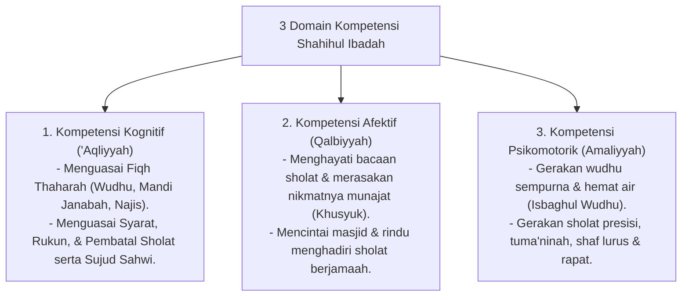

# P3-05-05-Standar-Kompetensi-dan-Taksonomi (Shahihul Ibadah)

## Tujuan
Menetapkan **Standar Capaian Pembelajaran & Taksonomi Kompetensi** karakter Shahihul Ibadah untuk seluruh jenjang santri di pesantren TUMBUH.

---

## 1. 3 Domain Kompetensi Shahihul Ibadah

---

## 2. Matriks Capaian Berjenjang Sesuai Jenjang Kemandirian TUMBUH (J1–J4)

* **Jenjang T1 (Kelas 7 / 10 Baru)**: Menguasai praktik wudhu dan sholat sesuai madzhab, tidak masbuq, menghafal dzikir ba'da sholat dan dzikir Al-Ma'tsurat.
* **Jenjang T2 (Kelas 8 / 11)**: Konsisten tiba di masjid sebelum adzan, sholat sunnah rawatib qabliyah-ba'diyah, tilawah 1 juz mandiri.
* **Jenjang T3 (Kelas 9 / 12)**: Memahami dalil Fiqh perbandingan madzhab, istiqamah Qiyamul Lail mandiri 3x sepekan, puasa sunnah Senin-Kamis.
* **Jenjang T4 (Santri Akhir / Teladan)**: Menjadi imam sholat rawatib dan qiyamul lail, memimpin muadzin, serta membimbing tahsin tajwid adik kelasnya (*Qudwah Hasanah*).

---

## 3. Status Dokumen
* **Status**: 🌟 **A+ (Tervalidasi & Siap Diimplementasikan)**
* **Level**: Project 3 - `03 Capacity Framework / 05 Shahihul Ibadah / ./P3-05-07-Rubrik-Indikator-Perilaku-4-Level.md`**.
