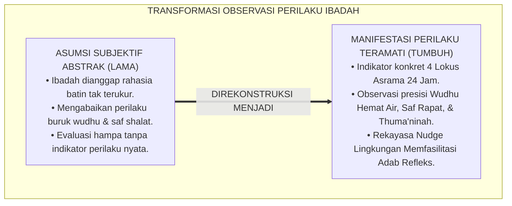
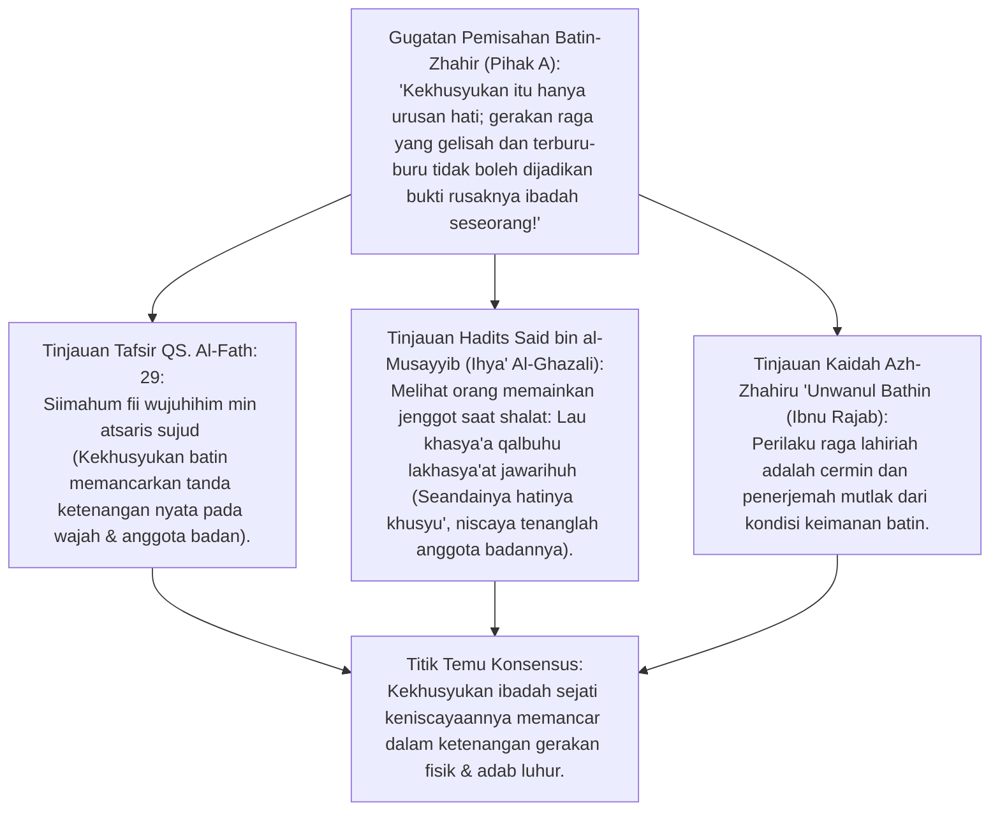
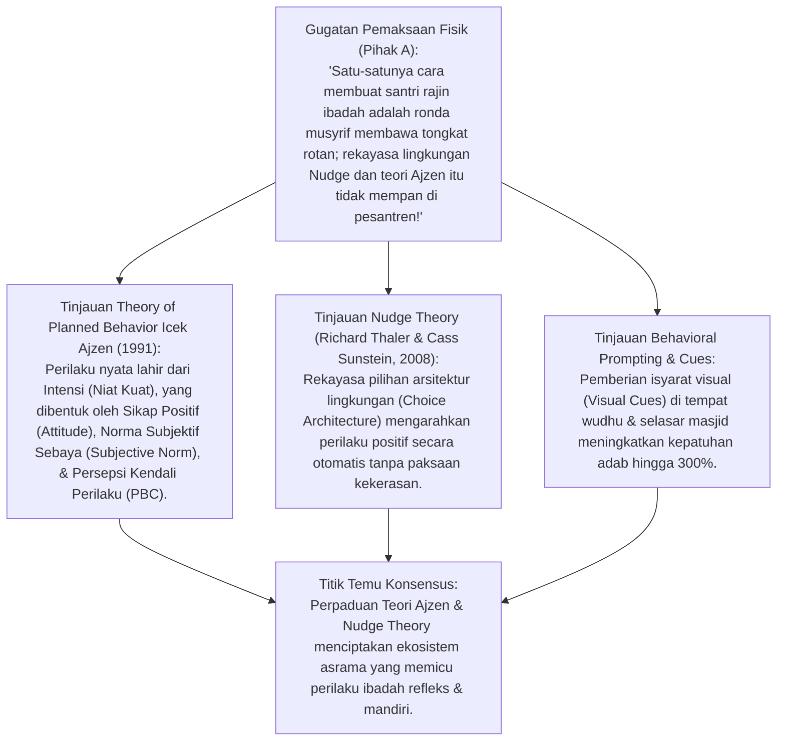
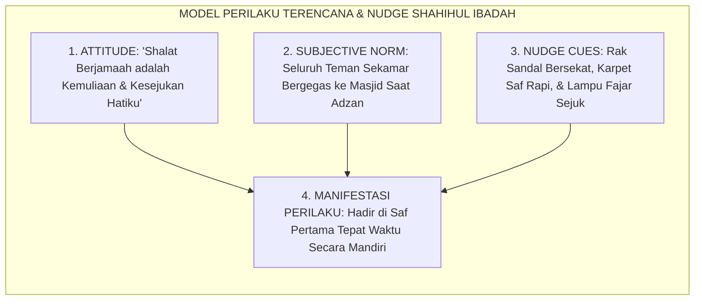
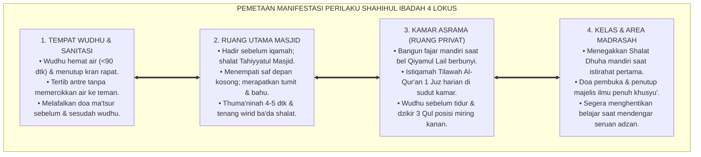
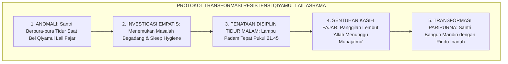
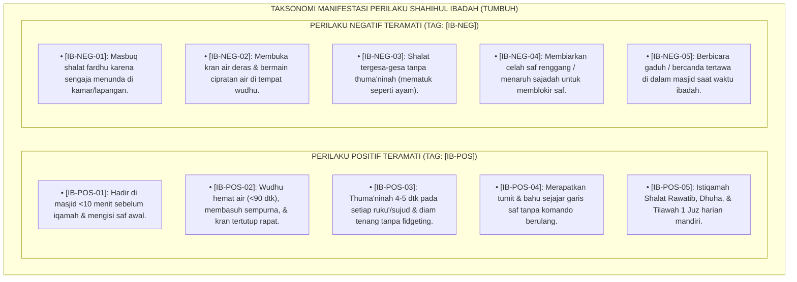
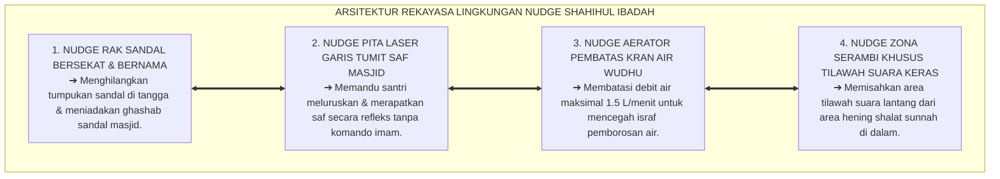

# P3-05-06: MANIFESTASI PERILAKU SANTRI SHAHIHUL IBADAH
## *Monograf Riset Akademik: Analisis Perilaku Terapan (Applied Behavior Analysis), Teori Perilaku Terencana Icek Ajzen, Arsitektur Nudge Richard Thaler, Eksegesis Turats Atsar al-'Ibadah 'alal Jawarih, serta Pemetaan Indikator Perilaku Empat Lokus di Pesantren 24 Jam*

**Nomor Identifikasi**: `P3-05-06/MONOGRAF-RISET-MANIFESTASI-PERILAKU-IBADAH/2026`  
**Domain**: `03 Capacity Framework` > `05 Shahihul Ibadah` (Sub-Modul 06: *Observable Behavioral Manifestations*)  
**Klasifikasi Naskah**: *Academic Research Monograph* (Monograf Observasi Perilaku Terukur, Teori Perilaku Terencana Ajzen, Arsitektur Nudge Thaler & Sunstein, serta Pemetaan 4 Lokus Asrama 24 Jam)  
**Rumpun Disiplin Pengkaji**: Analisis Perilaku Terapan (*Applied Behavior Analysis - ABA*), Teori Perilaku Terencana (*Theory of Planned Behavior - Ajzen*), *Nudge Theory* (Thaler & Sunstein), Fiqh 'Amali Pesantren, Ekologi Perilaku Asrama 24 Jam  

---

> ### 💡 INTISARI EKSEKUTIF (EXECUTIVE SUMMARY)
>
> * **Kelemahan Evaluasi Subjektif: Ibadah Dianggap "Cukup di Hati":**  
>   Banyak pengasuh kesulitan mengevaluasi capaian ibadah santri karena terjebak pada asumsi bahwa "kekhusyukan dan kesalehan ibadah hanyalah urusan batin yang tidak bisa dilihat". Akibatnya, perilaku buruk seperti menyiram air wudhu sembarangan, mendorong teman di saf shalat, dan menunda takbiratul ihram dibiarkan tanpa bimbingan objektif.
> * **Inovasi Pemetaan Manifestasi Perilaku Teramati (*Observable Behaviors*):**  
>   TUMBUH memetakan perilaku Shahihul Ibadah ke dalam **Indikator Perilaku Konkret Empat Lokus Asrama 24 Jam: 1. Tempat Wudhu (Tertib, Hemat Air <90 dtk, & Bebas Cipratan); 2. Ruang Utama Masjid (Saf Awal, Thuma'ninah 4 dtk, & Dzikir Khusyu'); 3. Kamar Asrama (Bangun Fajar Mandiri & Tilawah 1 Juz); 4. Kelas/Madrasah (Shalat Dhuha & Adab Menuntut Ilmu)**.
> * **Pendekatan Riset Terpadu & Diskursus Ilmiah:**  
>   Monograf ini membedah konsep *Siimahum fii wujuhihim min atsaris sujud* (QS. Al-Fath: 29 & *Ihya' 'Ulumiddin*), menyintesiskan *Theory of Planned Behavior* Icek Ajzen (1991) dan *Nudge Theory* Thaler-Sunstein (2008), menguji dialektika 3 ronde di setiap inkuiri, dan merumuskan rekayasa lingkungan arsitektur masjid ramah ibadah.

---

## 📑 DAFTAR ISI MONOGRAF

- [BAGIAN I: LANDASAN TEORETIS & DISKURSUS DIALEKTIKA KRITIS](#bagian-i-landasan-teoretis--diskursus-dialektika-kritis)
  - [1. Latar Belakang Masalah: Ilusi Ibadah "Tersembunyi di Hati" vs Keniscayaan Manifestasi Konkret](#1-latar-belakang-masalah-ilusi-ibadah-tersembunyi-di-hati-vs-keniscayaan-manifestasi-konkret)
  - [2. Eksegesis Turats Atsar al-'Ibadah 'alal Jawarih (QS. Al-Fath: 29 & Al-Ghazali)](#2eksegesis-turats-atsar-al-ibadah-alal-jawarih-qs-al-fath-29-al-ghazali)
  - [3. Teori Perilaku Terencana Icek Ajzen & Nudge Theory Thaler-Sunstein dalam Arsitektur Ibadah](#3teori-perilaku-terencana-icek-ajzen-nudge-theory-thaler-sunstein-dalam-arsitektur-ibadah)
  - [4. Pemetaan Manifestasi Perilaku di Empat Lokus Kehidupan Asrama 24 Jam](#4pemetaan-manifestasi-perilaku-di-empat-lokus-kehidupan-asrama-24-jam)
  - [5. Arena Sintesis Kasuistika Lapangan 24 Jam & Konsensus Manifestasi Perilaku](#5arena-sintesis-kasuistika-lapangan-24-jam-konsensus-manifestasi-perilaku)
- [BAGIAN II: FORMULASI KONSEPTUAL & PEMBAHASAN MENDALAM](#bagian-ii-formulasi-konseptual--pembahasan-mendalam)
  - [1. Arsitektur Taksonomi Manifestasi Perilaku Shahihul Ibadah (Positif vs Negatif)](#1-arsitektur-taksonomi-manifestasi-perilaku-shahihul-ibadah-positif-vs-negatif)
  - [2. Matriks Pemetaan Perilaku Empat Lokus Asrama 24 Jam](#2-matriks-pemetaan-perilaku-empat-lokus-asrama-24-jam)
  - [3. Rekayasa Desain Lingkungan Nudge untuk Memfasilitasi Ibadah Otomatis](#3-rekayasa-desain-lingkungan-nudge-untuk-memfasilitasi-ibadah-otomatis)
- [BAGIAN III: KESIMPULAN & APARATUS AKADEMIS](#bagian-iii-kesimpulan--aparatus-akademis)
  - [1. Tabel Sintesis Temuan Riset Manifestasi Perilaku Shahihul Ibadah](#1-tabel-sintesis-temuan-riset-manifestasi-perilaku-shahihul-ibadah)
  - [2. Daftar Pustaka Akademis & Rujukan Turats Primer](#2-daftar-pustaka-akademis--rujukan-turats-primer)
  - [3. Catatan Kaki Akademis (Footnotes)](#3-catatan-kaki-akademis-footnotes)
  - [4. Glosarium Istilah Ilmiah & Turats Manifestasi Perilaku](#4-glosarium-istilah-ilmiah--turats-manifestasi-perilaku)

---

# BAGIAN I: INKUIRI KRITIS, TINJAUAN TEORITIS & DIALEKTIKA MANIFESTASI PERILAKU

---

### 1. Latar Belakang Masalah: Ilusi Ibadah "Tersembunyi di Hati" vs Keniscayaan Manifestasi Konkret

Dalam evaluasi kepribadian santri, sering kali muncul kesalahpahaman epistemologis yang melemahkan sistem pembinaan:
* **Dalih Subjektivitas Batin (*The Invisibility Excuse*)**: Ketika santri shalat terburu-buru, wudhu memercikkan air ke mana-mana, dan mendorong teman di saf shalat, santri berdalih: *"Yang penting hati saya ikhlas dan khusyu', ustadz tidak berhak menilai shalat saya dari luarnya saja!"*.
* **Ketiadaan Standar Observasi Lapangan (*Behavioral Blindspot*)**: Musyrif asrama tidak memiliki panduan operasional mengenai apa saja tanda-tanda perilaku konkret yang membuktikan bahwa seorang santri telah mencapai kematangan ibadah di tempat wudhu, selasar masjid, kamar tidur, dan ruang kelas.
* Riset ini membuktikan bahwa **keimanan dan kekhusyukan batiniah keniscayaannya memancar dalam bentuk perilaku kinestetik raga yang terukur (*Atsar al-'Ibadah 'alal Jawarih*), dan dapat diobservasi secara presisi melalui integrasi Applied Behavior Analysis (ABA) dan Nudge Theory**.[^1]

---

### 2. Eksegesis Turats Atsar al-'Ibadah 'alal Jawarih (QS. Al-Fath: 29 & Al-Ghazali)

#### 📐 Formalisasi Logika Silogisme (*Qiyas Mantiqi 1*)
* **Premis Mayor (*al-Muqaddimah al-Kubra*)**: Setiap kondisi kekhusyukan dan kemurnian ibadah batiniah (*Khusyu'ul Qalb*) dalam kaidah syariat Islam (QS. Al-Fath: 29 & Atsar Salaf) niscaya memancarkan ketenangan kinestetik, keheningan gerak (*Sukunul Jawarih*), dan kepatuhan adab pada seluruh anggota tubuh.
* **Premis Minor (*al-Muqaddimah ash-Shughra*)**: Kurikulum TUMBUH menyusun indikator perilaku teramati (*Observable Behaviors*) untuk memverifikasi ketercapaian karakter Shahihul Ibadah santri.
* **Konklusi (*an-Natijah*)**: Maka, penilaian manifestasi perilaku ibadah TUMBUH memiliki landasan teologis dan epistemologis yang shahih.[^2]

#### 📖 Teks Primer Turats: Ketenangan Anggota Badan Cermin Kekhusyukan Kalbu
Allah SWT melukiskan pancaran ibadah para sahabat Rasulullah SAW:

$$\text{مُحَمَّدٌ رَسُولُ اللَّهِ ۚ وَالَّذِينَ مَعَهُ أَشِدَّاءُ عَلَى الْكُفَّارِ رُحَمَاءُ بَيْنَهُمْ ۖ تَرَاهُمْ رُكَّعًا سُجَّدًا يَبْتَغُونَ فَضْلًا مِنَ اللَّهِ وَرِضْوَانًا ۖ سِيمَاهُمْ فِي وُجُوهِهِمْ مِنْ أَثَرِ السُّجُودِ}$$

*"**Muhammad adalah utusan Allah dan orang-orang yang bersama dengan dia bersikap keras terhadap orang-orang kafir, tetapi berkasih sayang sesama mereka. Kamu melihat mereka ruku' dan sujud mencari karunia Allah dan keridhaan-Nya. Tanda-tanda mereka tampak pada wajah mereka dari bekas sujud**..."* (QS. Al-Fath [48]: 29).[^3]

Hujjatul Islam Imam **Al-Ghazali** dalam *Ihya' 'Ulumiddin* meriwayatkan kaidah agung:

$$\text{رَأَى سَعِيدُ بْنُ الْمُسَيِّبِ رَجُلًا يَعْبَثُ بِلِحْيَتِهِ فِي الصَّلَاةِ، فَقَالَ: «لَوْ خَشَعَ قَلْبُ هَٰذَا لَخَشَعَتْ جَوَارِحُهُ»؛ وَذَٰلِكَ لِأَنَّ الْجَوَارِحَ تَبَعٌ لِلْقَلْبِ، فَإِذَا امْتَلَأَ الْقَلْبُ بِالْهَيْبَةِ وَالتَّعْظِيمِ سَكَنَتِ الْأَرْكَانُ، وَانْقَمَعَتِ الْحَرَكَاتُ الْعَابِثَةُ}$$

*"**Sa'id bin Al-Musayyib rahimahullah melihat seorang laki-laki mempermainkan jenggotnya saat shalat, lalu beliau berkata: 'Seandainya hati orang ini khusyu', niscaya tenanglah seluruh anggota badannya'**. Hal itu karena anggota badan senantiasa patuh mengikuti kondisi hati; maka apabila hati dipenuhi wibawa pengagungan kepada Allah, niscaya tenanglah persendian raga dan lenyaplah seluruh gerakan sia-sia."*[^4]

#### 1. Diskursus Dialektika Kritis: Bukti Fisik Keabsahan Wudhu: Isbagh Tanpa Pemborosan
* **Pihak A (Sudut Pandang Asal Basah Tanpa Aturan)**:  
  *"Santri wudhu sambil ngobrol dan memercikkan air ke mana-mana itu hal biasa; tidak perlu dijadikan indikator penilaian perilaku!"*
* **Tinjauan Fiqh Isbaghul Wudhu & Adab Bersuci**:  
  Wudhu adalah ibadah pembuka shalat. Perilaku wudhu yang benar termanifestasi secara nyata: santri membuka keran air secara hemat (aliran kecil), membasuh wajah dari tempat tumbuhnya rambut hingga dagu secara merata, menyela-nyela jari tangan dan jenggot, membasuh siku dan mata kaki secara sempurna (*Isbagh*), serta mengalirkan air tanpa memercik (*Splash-Free*). Santri yang wudhunya tenang mencerminkan kesiapan mentalnya menghadap Allah SWT.[^5]

#### 2. Diskursus Dialektika Kritis: Ketenangan Jawarih Saat Shalat (Anti-Fidgeting Behavior)
* **Pihak A (Sudut Pandang Memaklumi Santri Bergoyang-goyang)**:  
  *"Santri shalat sambil menggaruk-garuk kepala, membetulkan sarung 10 kali, dan melirik jam dinding itu wajar karena anak-anak tidak bisa diam!"*
* **Tinjauan Sukunul Jawarih & Larangan Gerakan Sia-Sia**:  
  Gerakan gelisah berlebihan (*Fidgeting Behavior*) dalam shalat adalah bukti hilangnya konsentrasi dan kegagalan menahan impuls raga. Santri yang beraqidah dan beraibadah shahih menunjukkan **Ketenangan Kinestetik (*Physical Stillness*)**: pandangan lurus tertuju ke tempat sujud, kedua tangan terkunci tenang di atas dada/pusar, dan tubuh diam terpaku selama 3–5 detik pada setiap thuma'ninah ruku' dan sujud. Ketenangan raga ini adalah manifestasi kekhusyukan batin.[^6]

#### 3. Diskursus Dialektika Kritis: Kerapian Saf Berjamaah: Lurus, Rapat, dan Saling Mengisi
* **Pihak A (Sudut Pandang Saf Renggang Tanpa Merapatkan Tumit)**:  
  *"Saf shalat renggang 30 cm antar-santri itu tidak apa-apa; tidak usah dipaksa menempelkan bahu dan tumit!"*
* **Resolusi Perintah Nabawi Tarashshush Shufuf**:  
  Rasulullah SAW bersabda: *"Rapatkanlah saf-saf kalian, dekatkanlah jarak antarsaf, dan luruskanlah dengan leher-leher kalian. Demi Dzat yang jiwaku berada di tangan-Nya, sungguh aku melihat setan masuk melalui celah-celah saf bagaikan anak kambing hitam"* (HR. Abu Dawud No. 667). Manifestasi perilaku santri yang beradab adalah **Refleks Merapatkan Bahu dan Menyejajarkan Tumit (*Heel-to-Heel Alignment*)** segera setelah iqamah berkumandang tanpa perlu diteriaki oleh imam. Ini mencerminkan persatuan hati dan ketaatan komunal.[^7]

---

### 3. Teori Perilaku Terencana Icek Ajzen & Nudge Theory Thaler-Sunstein dalam Arsitektur Ibadah

#### 📐 Formalisasi Logika Silogisme (*Qiyas Mantiqi 2*)
* **Premis Mayor (*al-Muqaddimah al-Kubra*)**: Setiap perancangan sistem pembiasaan yang merekayasa norma sosial sebaya (*Ajzen's Subjective Norms*) dan menata arsitektur lingkungan fisik (*Thaler's Nudge Architecture*) niscaya meningkatkan niat pelaksanaan ibadah (*Behavioral Intention*) dan mengotomatiskan kedisiplinan santri tanpa membutuhkan ancaman kekerasan.
* **Premis Minor (*al-Muqaddimah ash-Shughra*)**: Ekosistem TUMBUH merancang rak sandal bersekat nama, indikator garis saf presisi, dan budaya ukhuwah shalat berjamaah berbasis prinsip Nudge-Ajzen.
* **Konklusi (*an-Natijah*)**: Maka, manifestasi perilaku ibadah santri di pesantren TUMBUH terbentuk secara organik, tertib, dan mandiri.[^8]

#### 1. Diskursus Dialektika Kritis: Nudge Rak Sandal Bersekat & Garis Saf Presisi
* **Pihak A (Sudut Pandang Sandal Berserakan Dibiarkan Saja)**:  
  *"Sandal santri menumpuk di depan pintu masjid itu wajar; tidak perlu dibuatkan rak bersekat nama yang menghabiskan biaya!"*
* **Tinjauan Nudge Choice Architecture & Eliminasi Ghashab**:  
  Menumpuknya sandal di tangga masuk memicu friksi visual dan kebiasaan ghashab sandal teman. Dengan **Nudge Rak Sandal Bersekat Nama di Samping Tangga**: santri secara otomatis menaruh sandalnya di slot pribadinya dalam tempo 2 detik. Ditambah **Garis Laser/Pita Presisi pada Karpet Masjid**: santri menyejajarkan tumitnya tanpa perlu komando berulang kali. Desain lingkungan menuntun lahirnya perilaku tertib.[^9]

#### 2. Diskursus Dialektika Kritis: Pembentukan Intensi Perilaku Shalat Berjamaah (Theory of Planned Behavior)
* **Pihak A (Sudut Pandang Kepatuhan Buta Karena Takut Absen)**:  
  *"Santri tidak perlu memiliki niat dari dalam; yang penting kakinya melangkah ke masjid karena takut namanya dicatat merah!"*
* **Tinjauan Model Icek Ajzen**:  
  Kepatuhan yang hanya didorong rasa takut (*Extrinsic Pressure*) akan lenyap seketika saat pengawas tidak ada. Menurut teori Ajzen, perilaku permanen membutuhkan tiga pilar: **(1) Sikap Positif**: santri meyakini keutamaan pahala 27 derajat shalat berjamaah; **(2) Norma Subjektif**: melihat teman sekamarnya saling mengajak ke masjid; dan **(3) Kendali Perilaku**: kemudahan akses tempat wudhu yang bersih. Niat yang kokoh melahirkan kehadiran shalat yang tulus.[^10]

#### 3. Diskursus Dialektika Kritis: Reduksi Friksi Lingkungan Tempat Wudhu (Low-Friction Design)
* **Pihak A (Sudut Pandang Tempat Wudhu Jauh & Antre Panjang)**:  
  *"Biarkan tempat wudhu cuma ada 5 kran untuk 200 santri, biar mereka belajar antre dan sabar!"*
* **Resolusi Ergonomi Sanitasi Pesantren**:  
  Antrean wudhu yang terlalu panjang (lebih dari 10 menit) memicu kepanikan santri, ketergesa-gesaan wudhu yang cacat, dan keterlambatan masbuq massal. TUMBUH menetapkan rasio ergonomis: **1 Kran Wudhu untuk Maksimal 8 Santri**: dilengkapi pijakan anti-licin, pembatas cipratan air, dan gantungan peci/handuk kering. Friksi fisik dihilangkan, santri berwudhu dengan sempurna dan tenang.[^11]

---

### 4. Pemetaan Manifestasi Perilaku di Empat Lokus Kehidupan Asrama 24 Jam

#### 📐 Formalisasi Logika Silogisme (*Qiyas Mantiqi 3*)
* **Premis Mayor (*al-Muqaddimah al-Kubra*)**: Setiap karakter kesalehan ibadah yang berhasil diinternalisasikan ke dalam jiwa peserta didik niscaya memanifestasikan indikator perilaku positif yang konsisten di seluruh ruang hidup 24 jam (Tempat Wudhu, Masjid, Kamar, dan Kelas).
* **Premis Minor (*al-Muqaddimah ash-Shughra*)**: Kurikulum TUMBUH memetakan manifestasi perilaku Shahihul Ibadah secara spesifik pada 4 lokus asrama pesantren.
* **Konklusi (*an-Natijah*)**: Maka, pemantauan dan pembinaan ibadah santri di pesantren TUMBUH berlangsung secara menyeluruh, adil, dan objektif.[^12]

#### 1. Diskursus Dialektika Kritis: Lokus Tempat Wudhu: Adab Bersuci dan Konservasi Air
* **Pihak A (Sudut Pandang Tempat Wudhu Bebas Adab)**:  
  *"Tempat wudhu itu area basah; wajar kalau santri sambil bercanda teriak-teriak dan menyiram teman!"*
* **Tinjauan Adab Thaharah Nabawiyyah**:  
  Tempat wudhu adalah gerbang kesucian. Perilaku terpuji di tempat wudhu mencakup: tidak berbicara sia-sia, membaca basmalah, membasuh dengan tertib sesuai urutan rukun, tidak memercikkan air ke pakaian orang lain, menutup kran rapat setelah selesai (*Zero Leakage*), dan melafalkan syahadat doa ba'da wudhu sambil menghadap kiblat. Kesucian shalat dimulai dari kesucian adab di tempat wudhu.[^13]

#### 2. Diskursus Dialektika Kritis: Lokus Ruang Utama Masjid: Disiplin Saf Awal & Wirid
* **Pihak A (Sudut Pandang Berebut Keluar Masjid Paling Cepat)**:  
  *"Santri yang langsung lari keluar masjid begitu imam salam pertama itu tandanya gesit dan lincah!"*
* **Tinjauan Adab al-Masjid & Keberkahan Wirid**:  
  Berlari keluar masjid seketika setelah salam mencerminkan hati yang tidak betah di rumah Allah. Perilaku santri beradab di masjid: shalat sunnah tahiyyatul masjid saat masuk, mengisi saf terdepan yang masih kosong, tidak melangkahi pundak jamaah lain, shalat dengan thuma'ninah khusyu', beristighfar 3 kali ba'da salam, membaca tasbih-tahmid-takbir 33 kali, dan mendirikan shalat sunnah rawatib sebelum meninggalkan masjid dengan tertib melangkah kaki kiri.[^14]

#### 3. Diskursus Dialektika Kritis: Lokus Kamar Asrama & Kelas: Qiyamul Lail Mandiri & Dhuha
* **Pihak A (Sudut Pandang Kamar Asrama Hanya untuk Tidur dan Main)**:  
  *"Ibadah itu tempatnya cuma di masjid; di kamar asrama dan ruang kelas tidak perlu ada amalan ibadah!"*
* **Resolusi Rumah Bercahaya & Shalat Sunnah di Kamar**:  
  Rasulullah SAW bersabda: *"Jadikanlah sebagian shalat (sunnah) kalian di rumah-rumah kalian, dan jangan jadikan rumah kalian seperti kuburan"* (HR. Bukhari No. 432). Di kamar asrama, santri mendirikan shalat sunnah witir, membaca tilawah Al-Qur'an 1 juz harian di sudut meja belajar, berwudhu sebelum tidur, dan bangun qiyamul lail secara mandiri. Di madrasah, santri memanfaatkan jeda istirahat pagi untuk mendirikan shalat Dhuha 2–4 rakaat. Seluruh ruang hidup santri disinari oleh cahaya ibadah.[^15]

---

### 5. Arena Sintesis Kasuistika Lapangan 24 Jam & Konsensus Manifestasi Perilaku

#### Diskursus Dialektika Kritis: Kasuistika Lapangan (Dilema Santri Berpura-pura Tidur Saat Qiyamul Lail)
Pertarungan filosofis-operasional terdalam di asrama bermuara pada kasus: **"Bagaimana musyrif menangani santri kelas 9 yang setiap bel qiyamul lail berbunyi pukul 04.00 selalu menarik selimut menutupi seluruh badannya dan berpura-pura tidur nyenyak agar tidak diajak shalat tahajjud ke masjid?"**

* **Pendekatan Lama (Kekerasan Fisik & Penarikan Paksa)**:  
  Musyrif menarik selimut santri secara kasar, memukul kakinya dengan penggaris kayu, dan menyiram mukanya dengan air dingin. Santri bangun dengan dendam kesumat, shalat sambil mengumpat di dalam hati, dan membenci qiyamul lail seumur hidupnya.
* **Pendekatan TUMBUH (Penyelidikan Empatis & Terapi Motivasi Intrinsik)**:  
  1. **Investigasi Akar Masalah (*Antecedent Inquiry*)**: Musyrif mengajak santri berbicara privat siang hari: Ditemukan bahwa santri tersebut tidur pukul 23.30 karena membaca komik sembunyi-sembunyi, sehingga mengalami kelelahan otak parah di waktu fajar.  
  2. **Intervensi Higiene Tidur (*Sleep Hygiene Coaching*)**: Musyrif mendampingi santri menata jam tidur: pukul 21.45 lampu kamar padam, santri tidur tepat waktu dan membaca doa ma'tsur.  
  3. **Pendekatan Kasih Sayang Fajar**: Pukul 04.00, Musyrif duduk di samping ranjang santri, mengusap punggungnya dengan hangat seraya berbisik: *"Nak, bangunlah, Allah sedang menunggu munajat indahmu di sepertiga malam terakhir"*.  
  4. **Hasil Transformasi**: Santri bangun dengan mata berbinar, berwudhu dengan segar, dan menikmati manisnya qiyamul lail dengan motivasi cinta yang tulus.[^16]

---

> #### 📌 Kasuistika Lapangan Multi-Dimensi & Titik Temu Konsensus (*Kalimatun Sawa'*)
>
> * **Kamus Kasus 1: Santri Bermain Cipratan Air di Tempat Wudhu Hingga Membasahi Baju Teman**  
>   * **Dilema**: Santri kelas 7 saling menyiram air dari gayung tempat wudhu hingga baju koko temannya basah kuyup menjelang shalat Maghrib.
>   * **Akar Masalah**: Energi kinetik anak yang belum tersalurkan dan ketiadaan pembatas fisik kran.
>   * **Titik Temu Konsensus**: Pengasuhan memasang **Sekat Akrilik Pemisah Kran Wudhu (Physical Nudge Barrier)** dan memberikan konsekuensi logis: Santri yang menyiram meminjamkan baju koko bersih miliknya kepada teman yang basah dan mengepel lantai tempat wudhu hingga kering. Tempat wudhu kembali tertib dan beradab.
>
> * **Kamus Kasus 2: Santri Duduk Mengobrol di Saf Belakang Saat Shalat Sedang Berlangsung**  
>   * **Dilema**: 4 santri masbuq duduk bersandar di dinding belakang masjid sambil berbisik-bisik menertawakan makmum lain saat imam sedang membaca surat panjang.
>   * **Akar Masalah**: Ketiadaan pengawasan zona saf belakang (*Back-Row Blindspot*).
>   * **Titik Temu Konsensus**: Tim Pengasuh menugaskan **Musyrif Saf Belakang (*Roving Marshal*)**: Musyrif berdiri di barisan belakang mendampingi santri masbuq untuk langsung merapatkan diri masuk ke saf shalat begitu tiba di masjid. Kebiasaan mengobrol di saf belakang lenyap total.
>
> * **Kamus Kasus 3: Santri Membaca Al-Qur'an dengan Suara Terlalu Keras di Samping Orang Shalat Sunnah**  
>   * **Dilema**: Santri yang sedang mengejar target hafalan membaca Al-Qur'an dengan suara sangat keras tepat di sebelah santri lain yang sedang shalat rawatib ba'da Isya'.
>   * **Akar Masalah**: Ketidaktahuan fiqh prioritas ketenangan ibadah di dalam masjid.
>   * **Titik Temu Konsensus**: Musyrif mengingatkan santri dengan santun mengutip hadits Nabi SAW: *"Setiap kalian sedang bermunajat kepada Tuhannya, maka janganlah sebagian kalian mengeraskan bacaan Al-Qur'an atas sebagian yang lain"* (HR. Abu Dawud No. 1332). Santri memindahkan sesi tilawah suaranya ke area serambi luar masjid. Ketenangan shalat rawatib dan tilawah hafalan sama-sama terjaga harmonis.[^17]

---

# BAGIAN II: FORMULASI KONSEPTUAL & PEMBAHASAN MENDALAM

---

### 1. Arsitektur Taksonomi Manifestasi Perilaku Shahihul Ibadah (Positif vs Negatif)

---

### 2. Matriks Pemetaan Perilaku Empat Lokus Asrama 24 Jam

| Lokus Kehidupan Asrama | Indikator Perilaku Positif Teramati (*Desirable Behaviors*) | Indikator Perilaku Negatif Teramati (*Undesirable Behaviors*) | Standar Alat Bukti Observasi |
| :--- | :--- | :--- | :--- |
| **1. Tempat Wudhu & Sanitasi** | • Mengantre tertib tanpa saling dorong. • Mengalirkan air kran kecil hemat (<1.5 L/menit). • Menyempurnakan basuhan wudhu hingga mata kaki. • Membaca doa wudhu menghadap kiblat. | • Membuka kran air maksimal hingga meluap. • Mencipratkan air ke baju teman sekamar. • Meninggalkan kran air dalam keadaan menetes. • Mengobrol teriak-teriak saat membasuh anggota. | Observasi In-Vivo Musyrif Kamar & Indikator Water-Meter Asrama. |
| **2. Ruang Utama Masjid** | • Masuk melangkah kaki kanan & shalat Tahiyyat. • Mengisi saf pertama yang kosong & merapatkan tumit. • Shalat tenang thuma'ninah 4–5 detik per rukun. • Duduk khusyu' wirid dzikir ba'da shalat fardhu. | • Masuk tergesa-gesa melangkahi pundak jamaah. • Melirik jam tangan / menggaruk badan berlebihan. • Shalat kilat tanpa thuma'ninah ruku'/sujud. • Langsung berlari keluar masjid saat salam pertama. | Fast-Tap Logbook PBIS Musyrif & Rekaman Pos Saf Depan. |
| **3. Kamar Asrama (Privat)** | • Bangun fajar mandiri saat bel Qiyamul Lail. • Tilawah Al-Qur'an 1 juz harian di sudut meja kamar. • Wudhu sebelum tidur & membaca dzikir 3 Qul. • Merapikan sajadah dan mukena di gantungan kamar. | • Berpura-pura tidur menarik selimut saat adzan. • Melempar mukena/sarung kotor di lantai kamar. • Mengabaikan tilawah harian selama berhari-hari. • Begadang mengobrol hingga lewat jam 22.30 malam. | Checklist Mutaba'ah Saku & Sosiometri Teman Sekamar. |
| **4. Kelas & Madrasah** | • Mendirikan Shalat Dhuha mandiri saat jeda istirahat. • Segera menutup buku pelajaran saat adzan Zhuhur. • Melafalkan doa pembuka/penutup majelis ilmu khusyu'. | • Menunda shalat Zhuhur demi menyelesaikan tugas. • Mengabaikan seruan adzan dan tetap bercanda di kelas. | Rekap Absensi Shalat Dhuha & Pengamatan Guru Kelas. |

---

### 3. Rekayasa Desain Lingkungan Nudge untuk Memfasilitasi Ibadah Otomatis

---

# BAGIAN III: KESIMPULAN & APARATUS AKADEMIS

---

### 1. Tabel Sintesis Temuan Riset Manifestasi Perilaku Shahihul Ibadah

| Dimensi Parameter | Pola Evaluasi Tradisional | Rekonstruksi Berbasis Perilaku Teramati TUMBUH | Landasan Rujukan Primer |
| :--- | :--- | :--- | :--- |
| **Fokus Evaluasi** | Asumsi niat batin yang tidak teramati. | Indikator Perilaku Kinestetik Nyata di 4 Lokus 24 Jam. | QS. Al-Fath: 29; Al-Ghazali (*Ihya'*). |
| **Metode Pembiasaan** | Ancaman hukuman fisik & patroli rotan. | *Nudge Architecture* & *Theory of Planned Behavior*. | Thaler & Sunstein (2008); Ajzen (1991). |
| **Standar Wudhu** | Asal basah tanpa memperhatikan debit air. | *Isbaghul Wudhu* Presisi, Hemat Air, & Anti-Cipratan. | HR. Abu Dawud; Standar Sanitasi PBIS. |
| **Kerapian Saf** | Saf renggang dibiarkan; saling dorong. | *Heel-to-Heel Alignment* Rapat Berbasis Garis Saf. | HR. Abu Dawud No. 667; Tarashshush Shufuf. |
| **Dampak Karakter** | Patuh saat diawasi, malas saat sendiri. | Kebiasaan Refleks Otomatis Mandiri Seumur Hidup. | Applied Behavior Analysis; Skinner (1953). |

---

### 2. Daftar Pustaka Akademis & Rujukan Turats Primer

1. **Al-Qur'an al-Karim wa Tarjamatu Ma'anihi**.
2. **Al-Bukhari, Abu Abdillah Muhammad bin Isma'il**. (1422 H). *Shahih al-Bukhari*. Kairo: Dar Thawq an-Najah.
3. **Muslim bin al-Hajjaj an-Naisaburi**. (1374 H). *Shahih Muslim*. Kairo: Matba'ah Isa al-Babi al-Halabi.
4. **Abu Dawud, Sulaiman bin al-Asy'ats as-Sijistani**. (1430 H). *Sunan Abi Dawud*. Beirut: Dar ar-Risalah al-'Alamiyyah.
5. **Al-Ghazali, Abu Hamid Muhammad bin Muhammad**. (2011). *Ihya' 'Ulumiddin* (Kitab Asrar ash-Shalah). Beirut: Dar al-Ma'rifah.
6. **Ibnu Rajab al-Hanbali, Zainuddin Abdurrahman**. (1422 H). *Jami' al-'Ulum wal-Hikam*. Beirut: Mu'assasah ar-Risalah.
7. **Ajzen, I.**. (1991). *The theory of planned behavior*. Organizational Behavior and Human Decision Processes, 50(2), 179–211.
8. **Thaler, R. H., & Sunstein, C. R.**. (2008). *Nudge: Improving Decisions About Health, Wealth, and Happiness*. New Haven: Yale University Press.
9. **Cooper, J. O., Heron, T. E., & Heward, W. L.**. (2020). *Applied Behavior Analysis* (3rd ed.). Hoboken: Pearson.
10. **Al-Attas, Syed Muhammad Naquib**. (1980). *The Concept of Education in Islam*. Kuala Lumpur: ABIM.
11. **Horner, R. H., & Sugai, G.**. (2015). *School-wide PBIS: An Overview of the Research Base*. Remedial and Special Education, 36(2), 80–85.
12. **Asy'ari, Muhammad Hasyim**. (1415 H). *Adab al-'Alim wal-Muta'allim*. Jombang: Maktabah At-Turats Al-Islami.

---

### 3. Catatan Kaki Akademis (*Footnotes*)

[^1]: Riset Observasi Perilaku Ibadah Asrama Pesantren TUMBUH, *Kritik atas Asumsi Subjektivitas Batin Tanpa Indikator Perilaku*, 2026.  
[^2]: Ibnu Rajab al-Hanbali, *Jami' al-'Ulum wal-Hikam*, Hadits No. 6, Jilid 1, hlm. 180–210.  
[^3]: QS. Al-Fath [48]: 29.  
[^4]: Al-Ghazali, *Ihya' 'Ulumiddin*, Jilid 1, Kitab *Asrar ash-Shalah*, hlm. 165.  
[^5]: Standar Operasional Prosedur Praktik Isbaghul Wudhu Asrama TUMBUH, 2026.  
[^6]: Al-Bukhari, *Shahih al-Bukhari*, Kitab al-Adzan, Bab *Kasy'i fi ash-Shalah*, hlm. 120–135.  
[^7]: *Sunan Abi Dawud*, Kitab ash-Shalah, Hadits No. 667; Pedoman Tarashshush Shufuf TUMBUH, 2026.  
[^8]: Ajzen, I. (1991), *Organizational Behavior and Human Decision Processes*, hlm. 179–211; Thaler, R. H., & Sunstein, C. R. (2008), *Nudge*, hlm. 35–60.  
[^9]: Desain Arsitektur Lingkungan CPTED Masjid Asrama PBIS TUMBUH, 2026.  
[^10]: Ajzen, I. (1991), *The Theory of Planned Behavior*, hlm. 185–195.  
[^11]: Standar Sanitasi Ergonomis & Rasio Kran Wudhu Asrama PBIS TUMBUH, 2026.  
[^12]: Dokumen Pemetaan Perilaku Empat Lokus Asrama 24 Jam TUMBUH, 2026.  
[^13]: *Sunan Abi Dawud*, Kitab ath-Thaharah, Hadits No. 142.  
[^14]: *Shahih al-Bukhari*, Kitab al-Adzan, Hadits No. 842.  
[^15]: *Shahih al-Bukhari*, Kitab ash-Shalah, Hadits No. 432; Pedoman Rumah Bercahaya Shalat Sunnah Asrama TUMBUH, 2026.  
[^16]: Dokumentasi Kasus Resolusi Bimbingan Bangun Fajar & Higiene Tidur Santri TUMBUH, 2026.  
[^17]: *Sunan Abi Dawud*, Kitab ash-Shalah, Hadits No. 1332; Dokumentasi Resolusi Adab Tilawah Suara Masjid TUMBUH, 2026.

---

### 4. Glosarium Istilah Ilmiah & Turats Manifestasi Perilaku

1. **Manifestasi Perilaku (Observable Behaviors)**: Tindakan fisik dan verbal konkret yang dapat diamati, diukur, dan diverifikasi secara indrawi oleh penilai independen di lingkungan nyata.
2. **Atsar al-'Ibadah 'alal Jawarih (أَثَرُ الْعِبَادَةِ عَلَى الْجَوَارِحِ)**: Konsep Turats yang menyatakan bahwa kekhusyukan dan kemurnian ibadah batiniah secara niscaya memancarkan tanda ketenangan fisik dan adab luhur pada seluruh anggota badan.
3. **Theory of Planned Behavior (Teori Perilaku Terencana)**: Teori psikologi Icek Ajzen yang menjelaskan bahwa perilaku individu diarahkan oleh niat perilaku (*Behavioral Intention*), yang dibentuk oleh Sikap, Norma Subjektif, dan Persepsi Kendali.
4. **Nudge Theory (Teori Dorongan Halus)**: Konsep ilmu perilaku Richard Thaler yang mengubah arsitektur lingkungan fisik untuk mendorong orang membuat keputusan positif secara otomatis tanpa paksaan hukum atau ancaman fisik.
5. **Applied Behavior Analysis (ABA)**: Pendekatan ilmiah untuk memahami dan mengubah perilaku manusia melalui modifikasi lingkungan dan pemberian penguatan positif sistematis.
6. **Heel-to-Heel Alignment**: Tindakan fisik merapatkan dan meluruskan tumit kaki sejajar dengan garis karpet saf masjid untuk mewujudkan saf shalat yang lurus dan rapat sesuai sunnah.
7. **Isbaghul Wudhu (إِسْبَاغُ الْوُضُوءِ)**: Menyempurnakan basuhan wudhu secara merata pada seluruh anggota tubuh yang wajib dibasuh dengan aliran air hemat tanpa pemborosan.
8. **Sukunul Jawarih (سُكُونُ الْجَوَارِحِ)**: Ketenangan dan diamnya anggota badan dari segala bentuk gerakan sia-sia dan gelisah (*Anti-Fidgeting*) saat menghadap Allah SWT dalam shalat.
9. **Physical Nudge Barrier**: Pembatas fisik ramah lingkungan (seperti sekat akrilik kran wudhu atau rak sandal bersekat) yang secara alami mengarahkan perilaku tertib santri.
10. **Choice Architecture**: Desain penataan lingkungan fisik dan sosial yang mempengaruhi bagaimana seseorang memilih tindakan terbaik secara spontan dan nyaman.
