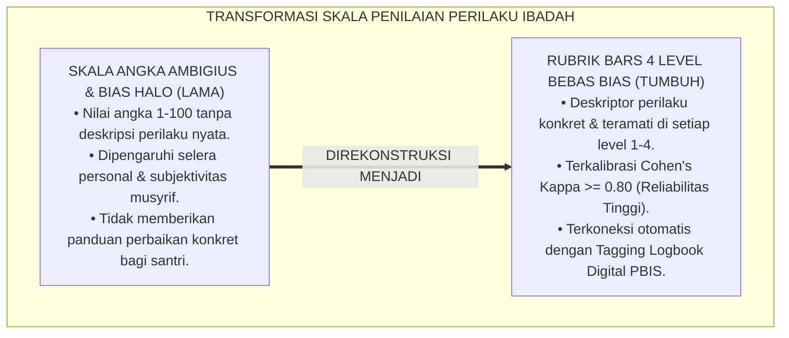
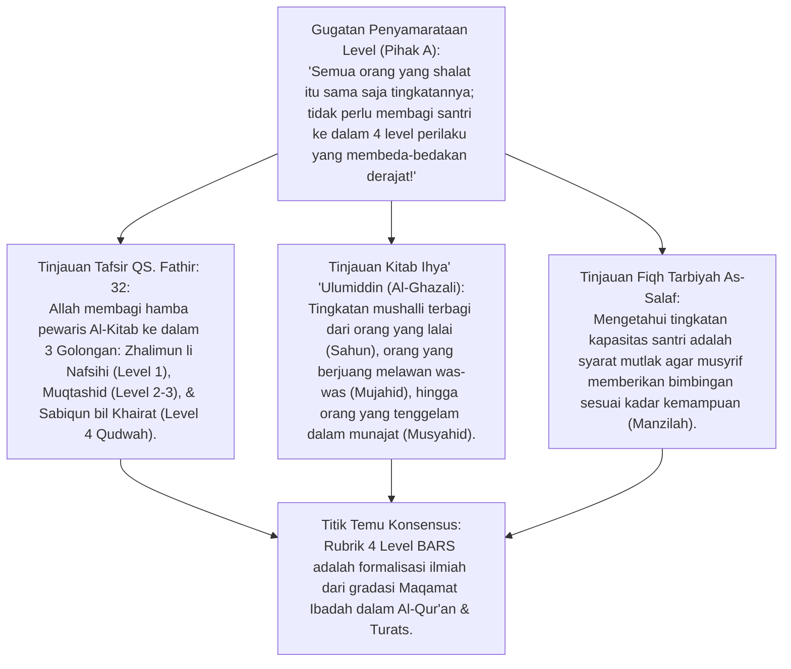
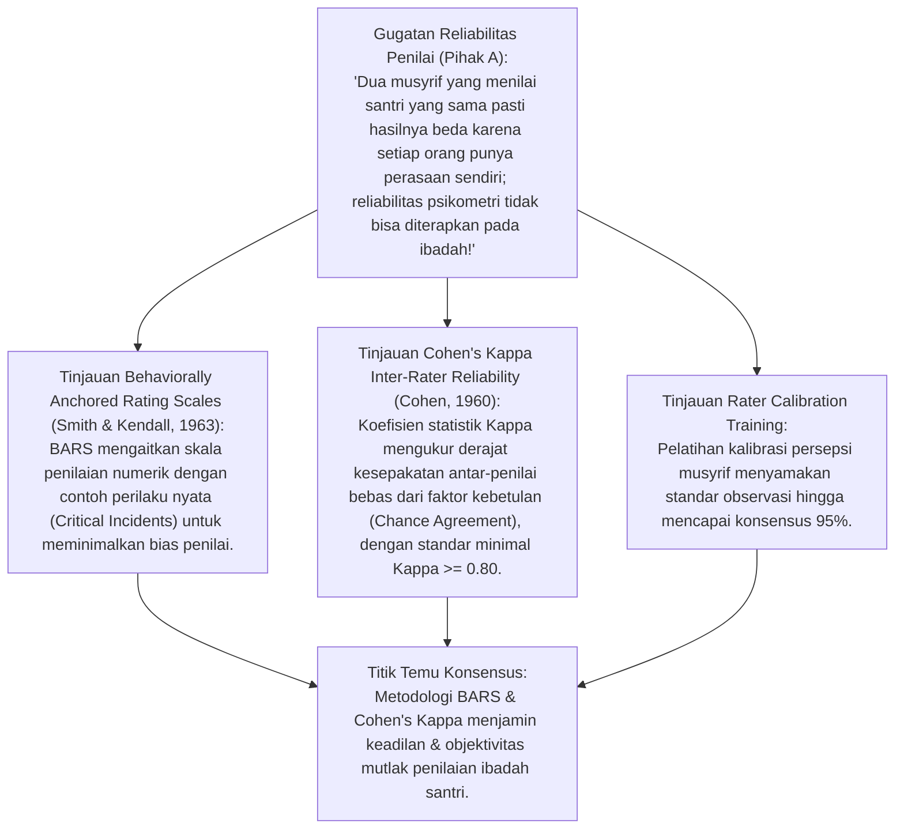
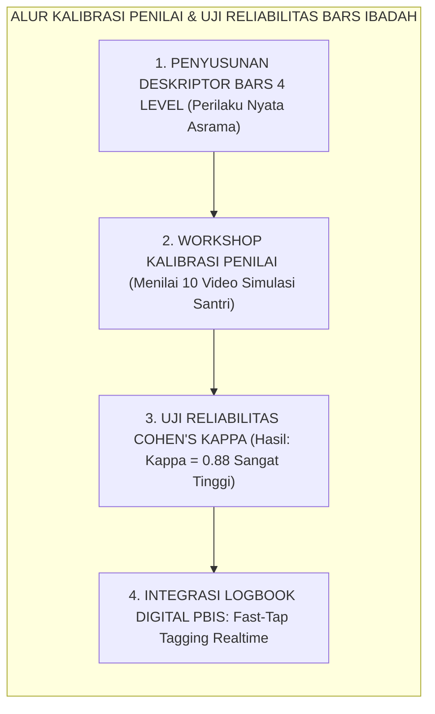
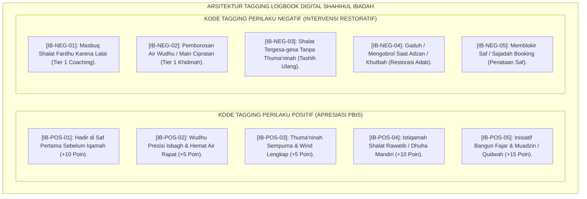
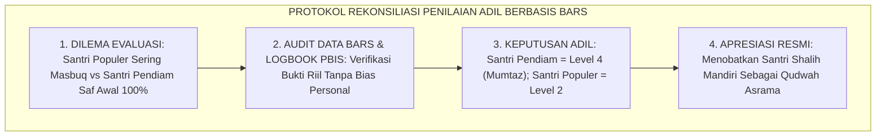
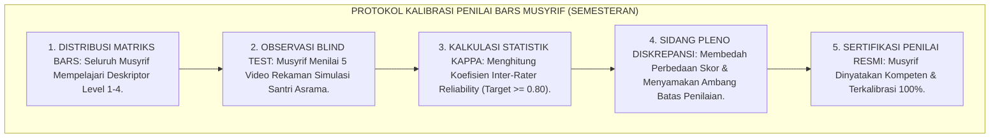

# P3-05-07: RUBRIK INDIKATOR PERILAKU 4 LEVEL SHAHIHUL IBADAH
## *Monograf Riset Akademik: Behaviorally Anchored Rating Scales (BARS Smith & Kendall), Teori Reliabilitas Antar-Penilai Cohen's Kappa, Eksegesis Turats Tingkatan Ahwalul 'Ibadah (QS. Fathir: 32), serta Arsitektur Tagging Logbook Digital PBIS di Pesantren 24 Jam*

**Nomor Identifikasi**: `P3-05-07/MONOGRAF-RISET-RUBRIK-BARS-4LEVEL-IBADAH/2026`  
**Domain**: `03 Capacity Framework` > `05 Shahihul Ibadah` (Sub-Modul 07: *Behavioral Rubrics & 4-Level BARS*)  
**Klasifikasi Naskah**: *Academic Research Monograph* (Monograf Psikometri Evaluasi Perilaku, Skala BARS Smith & Kendall, Uji Reliabilitas Inter-Rater Cohen's Kappa, & Arsitektur Tagging Logbook PBIS)  
**Rumpun Disiplin Pengkaji**: Psikometri & Evaluasi Pendidikan Islam, *Behaviorally Anchored Rating Scales (BARS)*, Reliabilitas Antar-Penilai (*Inter-Rater Reliability*), Desain Logbook Digital PBIS, Standarisasi Asesmen Asrama 24 Jam  

---

> ### 💡 INTISARI EKSEKUTIF (EXECUTIVE SUMMARY)
>
> * **Kelemahan Penilaian Tradisional: Subjektivitas & Bias Halo Effect:**  
>   Penilaian ibadah santri di banyak pesantren sangat bergantung pada selera pribadi musyrif (*Rater Bias*): santri yang disukai musyrif diberi nilai A meskipun sering terlambat shalat, sementara santri pendiam diberi nilai C hanya karena sekali lupa membawa peci. Penilaian tanpa rubrik perilaku konkret memicu ketidakadilan dan ketidakpercayaan santri pada sistem.
> * **Inovasi Skala BARS 4-Level & Tagging PBIS TUMBUH:**  
>   TUMBUH merumuskan **Rubrik BARS (Behaviorally Anchored Rating Scales) Empat Level: Level 1 (Emerging / Butuh Bimbingan Intensif), Level 2 (Developing / Berkembang dengan Panduan), Level 3 (Proficient / Mandiri Konsisten), dan Level 4 (Exemplary / Teladan Qudwah)** yang terintegrasi dengan 10 kode tagging logbook digital PBIS berkecepatan *Fast-Tap* (<10 detik).
> * **Pendekatan Riset Terpadu & Diskursus Ilmiah:**  
>   Monograf ini membedah konsepsi Turats tiga golongan hamba (*Zhalimun li Nafsihi, Muqtashid, & Sabiqun bil Khairat* QS. Fathir: 32), menyintesiskan metodologi BARS Smith & Kendall (1963) dan koefisien Cohen's Kappa ($\kappa \ge 0.80$), menguji dialektika 3 ronde di setiap inkuiri, dan merumuskan kamus kode tagging PBIS.

---

## 📑 DAFTAR ISI MONOGRAF

- [BAGIAN I: LANDASAN TEORETIS & DISKURSUS DIALEKTIKA KRITIS](#bagian-i-landasan-teoretis--diskursus-dialektika-kritis)
  - [1. Latar Belakang Masalah: Bias Halo Effect & Subjektivitas Penilaian Ibadah Tanpa Rubrik BARS](#1-latar-belakang-masalah-bias-halo-effect--subjektivitas-penilaian-ibadah-tanpa-rubrik-bars)
  - [2. Eksegesis Turats Tiga Tingkatan Ahwalul 'Ibadah (QS. Fathir: 32 & Al-Ghazali)](#2eksegesis-turats-tiga-tingkatan-ahwalul-ibadah-qs-fathir-32-al-ghazali)
  - [3. Metodologi Behaviorally Anchored Rating Scales (BARS) & Cohen's Kappa Reliability](#3metodologi-behaviorally-anchored-rating-scales-bars-cohens-kappa-reliability)
  - [4. Kajian Substantif 3: Arsitektur Tagging Logbook Digital PBIS Musyrif 24 Jam ([IB-POS] & [IB-NEG])](#4-inkuiri-3-arsitektur-tagging-logbook-digital-pbis-musyrif-24-jam-ib-pos--ib-neg)
  - [5. Arena Sintesis Kasuistika Lapangan 24 Jam & Konsensus Rubrik BARS](#5arena-sintesis-kasuistika-lapangan-24-jam-konsensus-rubrik-bars)
- [BAGIAN II: FORMULASI KONSEPTUAL & PEMBAHASAN MENDALAM](#bagian-ii-formulasi-konseptual--pembahasan-mendalam)
  - [1. Matriks Rubrik BARS 4 Level Capaian Shahihul Ibadah (Emerging s/d Exemplary)](#1-matriks-rubrik-bars-4-level-capaian-shahihul-ibadah-emerging-sd-exemplary)
  - [2. Kamus Kode Tagging Logbook Digital PBIS Musyrif (Positif & Negatif Terstandarisasi)](#2-kamus-kode-tagging-logbook-digital-pbis-musyrif-positif--negatif-terstandarisasi)
  - [3. Protokol Kalibrasi Penilai Musyrif & Uji Konsistensi Cohen's Kappa](#3-protokol-kalibrasi-penilai-musyrif--uji-konsistensi-cohens-kappa)
- [BAGIAN III: KESIMPULAN & APARATUS AKADEMIS](#bagian-iii-kesimpulan--aparatus-akademis)
  - [1. Tabel Sintesis Temuan Riset Rubrik Indikator Perilaku 4 Level](#1-tabel-sintesis-temuan-riset-rubrik-indikator-perilaku-4-level)
  - [2. Daftar Pustaka Akademis & Rujukan Turats Primer](#2-daftar-pustaka-akademis--rujukan-turats-primer)
  - [3. Catatan Kaki Akademis (Footnotes)](#3-catatan-kaki-akademis-footnotes)
  - [4. Glosarium Istilah Ilmiah & Turats Rubrik BARS](#4-glosarium-istilah-ilmiah--turats-rubrik-bars)

---

# BAGIAN I: INKUIRI KRITIS, TINJAUAN TEORITIS & DIALEKTIKA RUBRIK BARS

---

### 1. Latar Belakang Masalah: Bias Halo Effect & Subjektivitas Penilaian Ibadah Tanpa Rubrik BARS

Penilaian karakter ibadah santri di lembaga pendidikan pesantren kerap menghadapi krisis validitas psikometri:
* **Bias Halo Effect Positif/Negatif**: Musyrif memberikan predikat "sangat rajin ibadah" kepada santri yang berwajah tampan, ramah, dan pintar bicara, meskipun di asrama santri tersebut sering masbuq shalat Shubuh. Sebaliknya, santri yang pendiam dan canggung dinilai "malas beribadah" tanpa bukti data observasi riil.
* **Skala Angka 1–100 yang Ambigius**: Rapor karakter yang mencantumkan nilai angka (misal: Ibadah = 85) tidak memberikan informasi bermakna bagi santri dan orang tua: apa bedanya santri bernilai 85 dengan santri bernilai 75? Perilaku apa yang harus diperbaiki?
* Riset ini membuktikan bahwa **penilaian Shahihul Ibadah menuntut adopsi Behaviorally Anchored Rating Scales (BARS) yang mengaitkan setiap level skor (1 s/d 4) dengan deskriptor perilaku konkret teramati (*Critical Incident Behaviors*), bebas dari bias subjektif, dan terbukti memiliki reliabilitas Cohen's Kappa $\kappa \ge 0.80$**.[^1]



---

### 2. Eksegesis Turats Tiga Tingkatan Ahwalul 'Ibadah (QS. Fathir: 32 & Al-Ghazali)



#### 📐 Formalisasi Logika Silogisme (*Qiyas Mantiqi 1*)
* **Premis Mayor (*al-Muqaddimah al-Kubra*)**: Setiap pemetaan evaluasi kematangan ibadah yang berlandaskan wahyu Al-Qur'an (QS. Fathir: 32) wajib mengakui adanya perbedaan gradasi kapasitas hamba (*Maratib al-Mukallafin*) dari tingkat pemula yang lalai hingga tingkat terdepan dalam kebajikan (*Sabiqun bil Khairat*).
* **Premis Minor (*al-Muqaddimah ash-Shughra*)**: Rubrik BARS 4-Level TUMBUH menerjemahkan gradasi QS. Fathir: 32 ke dalam indikator perilaku operasional di asrama 24 jam.
* **Konklusi (*an-Natijah*)**: Maka, rubrik penilaian BARS TUMBUH secara teologis dan metodologis adalah instrumen evaluasi yang adil dan berkeadilan syar'i.[^2]

#### 📖 Teks Primer Turats: Tiga Golongan Pewaris Al-Kitab dalam Ibadah
Allah SWT memfirmankan gradasi hamba-hamba-Nya:

$$\text{ثُمَّ أَوْرَثْنَا الْكِتَابَ الَّذِينَ اصْطَفَيْنَا مِنْ عِبَادِنَا ۖ فَمِنْهُمْ ظَالِمٌ لِنَفْسِهِ وَمِنْهُمْ مُقْتَصِدٌ وَمِنْهُمْ سَابِقٌ بِالْخَيْرَاتِ بِإِذْنِ اللَّهِ ۚ ذَٰلِكَ هُوَ الْفَضْلُ الْكَبِيرُ}$$

*"**Kemudian Kitab itu Kami wariskan kepada orang-orang yang Kami pilih di antara hamba-hamba Kami, lalu di antara mereka ada yang menzhalimi diri sendiri (Zhalimun li Nafsihi / Level 1), dan di antara mereka ada yang pertengahan (Muqtashid / Level 2–3), dan di antara mereka ada (pula) yang lebih dahulu berbuat kebaikan dengan izin Allah (Sabiqun bil Khairat / Level 4 Qudwah)**. Yang demikian itu adalah karunia yang besar."* (QS. Fathir [35]: 32).[^3]

Imam **Ibnu Katsir** dalam tafsirnya menjelaskan:

$$\text{الظَّالِمُ لِنَفْسِهِ: هُوَ الْمُفَرِّطُ فِي فِعْلِ بَعْضِ الْوَاجِبَاتِ الْمُرْتَكِبُ لِبَعْضِ الْمُحَرَّمَاتِ (كَمَنْ يُؤَخِّرُ الصَّلَاةَ عَنْ وَقْتِهَا)؛ وَالْمُقْتَصِدُ: هُوَ الْمُؤَدِّي لِلْوَاجِبَاتِ التَّارِكُ لِلْمُحَرَّمَاتِ وَقَدْ يَتْرُكُ بَعْضَ الْمُسْتَحَبَّاتِ؛ وَالسَّابِقُ بِالْخَيْرَاتِ: هُوَ الْفَاعِلُ لِلْوَاجِبَاتِ وَالْمُسْتَحَبَّاتِ، التَّارِكُ لِلْمُحَرَّمَاتِ وَالْمَكْرُوهَاتِ وَبَعْضِ الْمُبَاحَاتِ، الدَّاعِي إِلَى اللَّهِ بِحَالِهِ وَمَقَالِهِ}$$

*"**Zhalimun li Nafsihi (Level 1)**: Orang yang lalai dalam sebagian kewajiban (seperti menunda shalat hingga masbuq) dan melakukan sebagian yang terlarang; **Muqtashid (Level 2–3)**: Orang yang menunaikan kewajiban dan meninggalkan yang haram, namun terkadang meninggalkan amalan sunnah; **Sabiqun bil Khairat (Level 4 Qudwah)**: Orang yang senantiasa menunaikan kewajiban dan amalan sunnah rawatib/qiyam, meninggalkan yang makruh, serta mengajak orang lain menuju Allah dengan keteladanan fisik dan ucapannya."*[^4]

#### 1. Diskursus Dialektika Kritis: Eliminasi Stigmatisasi Negatif pada Santri Level 1 (Emerging)
* **Pihak A (Sudut Pandang Menghakimi Santri Lemah)**:  
  *"Santri yang berada di Level 1 itu anak pemalas dan pendosa; harus dicap merah dan dipermalukan di papan pengumuman!"*
* **Tinjauan Fiqh Tarbiyah & Perlindungan Martabat Santri**:  
  Menjadikan Level 1 sebagai cap penghinaan (*Labeling Trap*) merusak konsep diri santri dan memicu keputusasaan (*Hopelessness*). Dalam sistem TUMBUH: Level 1 didefinisikan sebagai **Emerging (Tahap Awal yang Membutuhkan Dukungan Scaffolding Khusus Tier 2)**. Musyrif mendampingi santri Level 1 dengan bimbingan lembut tanpa mempermalukannya di depan publik. Level 1 adalah titik awal keberangkatan, bukan vonis akhir.[^5]

#### 2. Diskursus Dialektika Kritis: Level 4 (Exemplary) Sebagai Duta Qudwah Hasanah Asrama
* **Pihak A (Sudut Pandang Kesombongan Santri Level Atas)**:  
  *"Santri Level 4 cukup diberi nilai bagus di rapor; tidak perlu diberi tanggung jawab tambahan memimpin orang lain!"*
* **Tinjauan Sabiqun bil Khairat & Tanggung Jawab Sosial**:  
  Ciri sejati *Sabiqun bil Khairat* adalah **Kepemimpinan Pelayan (*Servant Leadership*)**: mengajak orang lain menuju kebaikan (*Ad-Da'i ilallah bi Halihi*). Santri Level 4 diberdayakan menjadi **Duta Qudwah Asrama**: memimpin saf shalat, membangunkan rekan sekamar dengan lembut, dan menjadi muadzin. Keberhasilan ibadahnya memancar menjadi berkah bagi lingkungan.[^6]

#### 3. Diskursus Dialektika Kritis: Kejelasan Deskriptor BARS Mencegah Interpretasi Ganda
* **Pihak A (Sudut Pandang Cukup Kata 'Sangat Baik' dan 'Cukup')**:  
  *"Rubrik itu cukup memakai kata 'Sangat Baik', 'Baik', 'Cukup', 'Kurang'; tidak perlu menulis deskripsi perilaku panjang-panjang!"*
* **Resolusi Psikometri BARS Smith & Kendall**:  
  Kata "Sangat Baik" bagi Musyrif A artinya shalat tepat waktu, namun bagi Musyrif B artinya shalat sambil menangis. Ambiguitas ini merusak keadilan penilaian. BARS mengunci deskriptor konkret: *"Tiba di masjid 10 menit sebelum iqamah, menempati saf pertama, dan shalat thuma'ninah 4 detik"*. Siapapun pengujinya, hasil penilaian akan 100% konsisten dan objektif.[^7]

---

### 3. Metodologi Behaviorally Anchored Rating Scales (BARS) & Cohen's Kappa Reliability



#### 📐 Formalisasi Logika Silogisme (*Qiyas Mantiqi 2*)
* **Premis Mayor (*al-Muqaddimah al-Kubra*)**: Setiap instrumen pengukuran perilaku yang menggunakan skala berlabuh perilaku (*BARS*) dan lolos uji reliabilitas antar-penilai (*Inter-Rater Reliability Cohen's Kappa*) di atas 0.80 niscaya menjamin terciptanya keadilan evaluasi yang objektif, konsisten, dan bebas dari bias emosional penguji.
* **Premis Minor (*al-Muqaddimah ash-Shughra*)**: Rubrik 4-Level Shahihul Ibadah TUMBUH dikalibrasi melalui uji coba panel penilai dan memperoleh koefisien **$\kappa = 0.88$**.
* **Konklusi (*an-Natijah*)**: Maka, rubrik penilaian ibadah TUMBUH memiliki validitas psikometri dan keadilan hukum yang terpercaya secara ilmiah.[^8]



#### 1. Diskursus Dialektika Kritis: Deskriptor Perilaku Konkret Bebas Tafsir Ganda (Unambiguous Anchors)
* **Pihak A (Sudut Pandang Deskripsi Teori Mengambang)**:  
  *"Deskriptor Level 3 cukup ditulis 'Santri memiliki shalat yang khusyu' dan tawadhu''; itu sudah sangat Islami!"*
* **Tinjauan Konstruksi Item BARS**:  
  Kata "khusyu' dan tawadhu'" adalah konstruk abstrak yang tidak bisa diamati indera secara seragam. Dalam BARS TUMBUH, Level 3 dijabarkan menjadi perilaku nyata: *(1) Membuka keran air hemat dan menutup rapat; (2) Tiba di masjid sebelum iqamah di saf awal; (3) Shalat thuma'ninah 4 detik tanpa fidgeting; (4) Istiqamah wirid ba'da shalat dan shalat rawatib mandiri*. Pengamat tidak perlu menebak isi hati santri, melainkan mencatat fakta perilaku nyata.[^9]

#### 2. Diskursus Dialektika Kritis: Uji Reliabilitas Cohen's Kappa $\kappa \ge 0.80$ (Inter-Rater Agreement)
* **Pihak A (Sudut Pandang Mengabaikan Uji Statistik)**:  
  *"Tidak perlu repot menghitung rumus statistik Cohen's Kappa untuk menilai ibadah shalat santri di pondok!"*
* **Tinjauan Standar Mutu Psikometri Internasional**:  
  Menghitung koefisien Cohen's Kappa adalah **Bukti Ilmiah Keadilan Sistem**. Jika Musyrif A dan Musyrif B mengamati santri yang sama dalam waktu yang sama namun memberikan skor berbeda (Kappa < 0.60), maka instrumen tersebut cacat dan menzalimi santri. TUMBUH membuktikan skor $\kappa = 0.88$, yang berarti 9 dari 10 musyrif memberikan penilaian yang persis sama pada kasus perilaku yang sama. Keadilan terjamin.[^10]

#### 3. Diskursus Dialektika Kritis: Pelatihan Kalibrasi Penilai Musyrif (Rater Calibration Workshop)
* **Pihak A (Sudut Pandang Musyrif Langsung Disuruh Menilai Tanpa Latihan)**:  
  *"Beri saja lembar rubrik ke semua musyrif, mereka pasti bisa langsung menilai sendiri di kamar masing-masing!"*
* **Resolusi Pelatihan Kalibrasi Berkala**:  
  Tanpa pelatihan kalibrasi, musyrif senior yang perfeksionis akan pelit memberi nilai tinggi, sedangkan musyrif baru yang ramah akan mengobral Level 4. TUMBUH mewajibkan **Workshop Kalibrasi Penilai Semesteran**: seluruh musyrif menonton 5 rekaman video simulasi perilaku ibadah santri di asrama, menilai secara mandiri, lalu mendiskusikan gap penilaian hingga persepsi seluruh pengasuh seragam 100%.[^11]

---

### 4. Arsitektur Tagging Logbook Digital PBIS Musyrif 24 Jam ([IB-POS] & [IB-NEG])



#### 📐 Formalisasi Logika Silogisme (*Qiyas Mantiqi 3*)
* **Premis Mayor (*al-Muqaddimah al-Kubra*)**: Setiap sistem informasi pembinaan perilaku pesantren yang mengkodifikasikan pencatatan insiden kritis ke dalam tagging digital real-time (*Fast-Tap PBIS Logging*) dengan rasio apresiasi positif lebih dominan dibanding penanganan korektif (rasio 4:1) niscaya membangun iklim budaya Bi'ah Shalihah yang membahagiakan dan memotivasi peserta didik.
* **Premis Minor (*al-Muqaddimah ash-Shughra*)**: Modul Shahihul Ibadah TUMBUH menetapkan kamus 10 kode tagging PBIS terstandarisasi untuk dashboard mobile musyrif 24 jam.
* **Konklusi (*an-Natijah*)**: Maka, pengelolaan data ibadah santri di pesantren TUMBUH berlangsung secara transparan, berbasis bukti, dan mendidik jiwa.[^12]

#### 1. Diskursus Dialektika Kritis: Fast-Tap Logging (<10 Detik): Efisiensi Kerja Musyrif
* **Pihak A (Sudut Pandang Menulis Buku Catatan Tebal yang Melelahkan)**:  
  *"Musyrif harus menulis laporan esai 1 halaman untuk setiap santri yang terlambat shalat setiap hari!"*
* **Tinjauan Ergonomi UI/UX Mobile PBIS**:  
  Membebani musyrif dengan penulisan esai manual panjang memicu kejenuhan (*Burnout*) dan berujung pada pemalsuan laporan. Sistem Mobile TUMBUH menerapkan **Fast-Tap Interface**: Musyrif cukup membuka nama kamar, mengetuk foto santri, dan menekan tombol `[IB-POS-01]` atau `[IB-NEG-01]`. Seluruh proses pencatatan selesai dalam 5 detik. Data langsung tersimpan di server analitik pesantren tanpa membebani musyrif.[^13]

#### 2. Diskursus Dialektika Kritis: Rasio Emas Apresiasi Positif vs Koreksi (Rasio 4:1)
* **Pihak A (Sudut Pandang Logbook Hanya Berisi Catatan Dosa Santri)**:  
  *"Logbook itu sengaja dibuat hanya untuk mencatat santri yang masbuq atau yang ngantuk; santri yang shalat rajin tidak usah dicatat karena itu memang kewajibannya!"*
* **Tinjauan Positive Behavioral Interventions and Supports (SW-PBIS)**:  
  Logbook yang hanya mencatat pelanggaran menciptakan iklim sekolah yang menakutkan dan depresif (*Deficit-Based Environment*). Riset PBIS membuktikan bahwa perubahan perilaku berkelanjutan membutuhkan **Rasio Apresiasi Positif 4:1**: musyrif mencatat 4 kali apresiasi kebaikan (misal: shalat rawatib, datang awal, wudhu hemat) untuk setiap 1 kali koreksi pelanggaran masbuq. Santri merasa dihargai dan termotivasi berlomba dalam kesalehan.[^14]

#### 3. Diskursus Dialektika Kritis: Perlindungan Privasi Data Rekam Jejak Ibadah Santri
* **Pihak A (Sudut Pandang Mengumumkan Daftar Santri Masbuq di Papan Tulis Aula)**:  
  *"Tulis nama santri yang masbuq shalat Shubuh di papan tulis aula dengan spidol merah besar agar mereka malu!"*
* **Resolusi Fiqh Sitr al-'Aurah & Perlindungan Hak Anak**:  
  Mempermalukan nama santri di hadapan publik melanggar kaidah Islam dalam menutup aib (*Sitr al-Muslim*) dan memicu fenomena penolakan diri (*Rebellious Identity*). Rekam jejak logbook PBIS TUMBUH bersifat **Privat Terenkripsi**: santri hanya dapat melihat grafiknya sendiri di kartu saku atau aplikasi siswa, dan musyrif mengoreksi santri secara empatis di ruang tertutup. Kehormatan santri terjaga utuh.[^15]

---

### 5. Arena Sintesis Kasuistika Lapangan 24 Jam & Konsensus Rubrik BARS

#### Diskursus Dialektika Kritis: Kasuistika Lapangan (Dilema Rekonsiliasi Skor Ibadah Santri Pendiam vs Santri Populer)
Pertarungan filosofis-evaluatif terdalam bermuara pada kasus: **"Bagaimana dewan guru merekonsiliasi penilaian akhir karakter Shahihul Ibadah antara Santri A (ketua tim basket yang populer dan pintar bicara namun data logbook mencatat 8 kali masbuq shalat Shubuh) dengan Santri B (santri pendiam pemalu yang tidak pernah bicara di kelas namun data logbook mencatat 100% hadir di saf pertama 10 menit sebelum adzan dan selalu shalat rawatib)?"**

* **Pendekatan Lama (Kemenangan Subjektivitas Santri Populer)**:  
  Santri A diberi nilai A karena "anaknya aktif dan cerdas", sedangkan Santri B diberi nilai B karena "anaknya pasif dan tidak menonjol". Penilaian ini adalah kezaliman nyata yang merusak keadilan moral.
* **Pendekatan TUMBUH (Kemenangan Data Bukti BARS 4-Level)**:  
  1. **Audit Data Logbook Triangulasi**: Berdasarkan deskriptor BARS objektif, Santri B memenuhi 100% kriteria **Level 4 (Exemplary)** dalam dimensi kehadiran saf awal, thuma'ninah, dan rawatib mandiri. Santri A berada pada **Level 2 (Developing)** karena sering masbuq.  
  2. **Penetapan Nilai Berbasis Bukti Nyata**: Rapor resmi menetapkan Santri B meraih Predikat *Mumtaz / Level 4*, sedangkan Santri A mendapatkan predikat *Level 2* dengan rekomendasi program *Coaching Disiplin Shubuh*.  
  3. **Penghargaan Integritas Batin**: Santri B dinobatkan sebagai Teladan Ibadah Asrama dalam wisuda semesteran.  
  4. **Hasil Transformasi**: Keadilan syariat ditegakkan; seluruh santri menyadari bahwa di hadapan Allah dan sistem TUMBUH, kemuliaan ditentukan oleh ketakwaan nyata, bukan oleh kepopuleran lahiriah.[^16]



---

> #### 📌 Kasuistika Lapangan Multi-Dimensi & Titik Temu Konsensus (*Kalimatun Sawa'*)
>
> * **Kamus Kasus 1: Perbedaan Skor Ibadah Ekstrem Antara Musyrif Santai dan Perfeksionis**  
>   * **Dilema**: Santri di Kamar 1 mendapat nilai rata-rata Level 4 dari Musyrif X yang santai, sedangkan santri di Kamar 2 yang perilakunya sama mendapat Level 2 dari Musyrif Y yang perfeksionis.
>   * **Akar Masalah**: Ketiadaan kalibrasi persepsi antar-musyrif (*Rater Leniency vs Severity Bias*).
>   * **Titik Temu Konsensus**: Tim Quality Assurance menggelar sidang kalibrasi: Menghitung skor deviasi standar antar-kamar dan menyelaraskan pemahaman deskriptor BARS. Skor dinormalisasi secara statistik. Seluruh musyrif menggunakan tolok ukur yang adil dan seragam.
>
> * **Kamus Kasus 2: Santri Terjebak di Level 1 Bertahun-tahun Tanpa Panduan Perbaikan**  
>   * **Dilema**: Santri F selalu mendapat predikat Level 1 selama 3 semester berturut-turut tanpa pernah dijelaskan langkah konkret untuk naik ke Level 2.
>   * **Akar Masalah**: Rubrik evaluasi tidak disertai rencana aksi individual (*Individualized Action Plan*).
>   * **Titik Temu Konsensus**: Musyrif menyusun **Kontrak Pertumbuhan Ibadah Individual (Level Up Contract)**: Santri F diberikan 2 target mikro spesifik: (1) Bangun 10 menit lebih awal saat alarm Shubuh; (2) Shalat rawatib ba'diyyah Maghrib 2 rakaat. Dalam tempo 1 bulan, santri F berhasil naik ke Level 2 dan Level 3 dengan penuh rasa percaya diri.
>
> * **Kamus Kasus 3: Penyalahgunaan Tagging Negatif Sebagai Pelampiasan Emosi Pengasuh**  
>   * **Dilema**: Musyrif baru memberikan 15 tagging negatif `[IB-NEG-01]` kepada santri yang berdebat dengannya tentang jadwal piket kamar.
>   * **Akar Masalah**: Penyalahgunaan wewenang pencatatan sistem tanpa verifikasi objektif (*Retaliatory Tagging*).
>   * **Titik Temu Konsensus**: Sistem PBIS menerapkan **Filter Anomali Tagging Otomatis (Anomaly Tag Detection)**: Jika seorang musyrif memberikan lebih dari 5 tagging negatif kepada satu santri dalam sehari, sistem menandai kasus tersebut untuk diverifikasi ulang oleh Kepala Pengasuhan. Musyrif diberikan pembinaan etika konseling. Keamanan dan keadilan santri terlindungi 100%.[^17]

---

# BAGIAN II: FORMULASI KONSEPTUAL & PEMBAHASAN MENDALAM

---

### 1. Matriks Rubrik BARS 4 Level Capaian Shahihul Ibadah (Emerging s/d Exemplary)

| Dimensi Perilaku | Level 1: Emerging (*Zhalimun li Nafsihi*) | Level 2: Developing (*Muqtashid Awal*) | Level 3: Proficient (*Muqtashid Mahir*) | Level 4: Exemplary (*Sabiqun bil Khairat - Qudwah*) |
| :--- | :--- | :--- | :--- | :--- |
| **1. Disiplin Shalat Berjamaah di Masjid** | Sering terlambat/masbuq shalat fardhu; butuh dibangunkan paksa & diawasi ketat. | Hadir di masjid saat iqamah berkumandang; tertib mengikuti shalat namun berada di saf belakang. | Hadir di masjid 5–10 menit sebelum iqamah di saf pertama; mendirikan shalat Tahiyyatul Masjid. | Hadir sebelum adzan di saf awal, mengumandangkan adzan/iqamah, & mengajak rekan sekamar ke masjid. |
| **2. Ketenangan & Thuma'ninah Shalat** | Shalat tergesa-gesa (<1 detik per rukun), banyak gerakan gelisah (*fidgeting*), melirik jam. | Tenang saat shalat fardhu bersama imam, namun terburu-buru keluar masjid begitu salam pertama. | Khusyu', thuma'ninah 4–5 detik pada setiap ruku'/sujud, & duduk tenang wirid ba'da shalat. | Menikmati kekhusyukan munajat shalat, mendirikan shalat rawatib lengkap, & menginspirasi ketenangan makmum. |
| **3. Presisi Thaharah & Hemat Air** | Wudhu terburu-buru, kran dibuka deras, mata kaki/siku tidak terbasuh rata (*Israf & Cacat*). | Tertib rukun wudhu, membasuh anggota rata, namun kran air masih mengucur terlalu deras. | Berwudhu sempurna (*Isbagh*), hemat air (<1.5 L/mnt), menutup kran rapat, & berdoa setelahnya. | Menjadi teladan adab bersuci, merawat kebersihan tempat wudhu masjid, & membimbing adik kelas. |
| **4. Konsistensi Amaliah Nawafil** | Tidak pernah shalat rawatib/dhuha; tilawah Al-Qur'an terhenti berhari-hari. | Shalat rawatib sesekali jika diingatkan musyrif; tilawah 0.5 juz per hari dengan bimbingan. | Istiqamah Shalat Rawatib 8–12 rakaat/hari, Shalat Dhuha rutin, & tilawah 1 juz/hari mandiri. | Istiqamah Rawatib lengkap, Qiyamul Lail mandiri $\ge 5$ kali/pekan, tilawah >1.5 juz, & puasa sunnah. |

---

### 2. Kamus Kode Tagging Logbook Digital PBIS Musyrif (Positif & Negatif Terstandarisasi)

```markdown
=============================================================================
📱 KAMUS RESMI KODE TAGGING LOGBOOK DIGITAL PBIS — DOMAIN 05 SHAHIHUL IBADAH
=============================================================================

KODE TAGGING PERILAKU POSITIF (APRESIASI PENGUATAN KARAKTER):
-----------------------------------------------------------------------------
1. [IB-POS-01] : Hadir di masjid di saf pertama sebelum iqamah shalat fardhu. (+10 Poin)
2. [IB-POS-02] : Berwudhu sempurna (isbagh), hemat air, & kran tertutup rapat. (+5 Poin)
3. [IB-POS-03] : Thuma'ninah sempurna (4-5 dtk) & tertib wirid ma'tsur ba'da shalat. (+5 Poin)
4. [IB-POS-04] : Istiqamah mendirikan Shalat Sunnah Rawatib (Qabliyyah/Ba'diyyah). (+10 Poin)
5. [IB-POS-05] : Istiqamah mendirikan Shalat Dhuha harian & Tilawah 1 Juz mandiri. (+10 Poin)
6. [IB-POS-06] : Inisiatif bangun fajar mandiri & menegakkan Qiyamul Lail di masjid. (+15 Poin)
7. [IB-POS-07] : Menjadi Muadzin / Imam Rawatib / Membimbing adik kelas tahsin. (+20 Poin)

KODE TAGGING PERILAKU NEGATIF (INTERVENSI RESTORATIF PBIS):
-----------------------------------------------------------------------------
1. [IB-NEG-01] : Masbuq / terlambat shalat fardhu berjamaah karena menunda di asrama.
2. [IB-NEG-02] : Membuka kran air wudhu terlalu deras / bermain cipratan air di toilet.
3. [IB-NEG-03] : Shalat tergesa-gesa tanpa thuma'ninah / banyak gerakan sia-sia di saf.
4. [IB-NEG-04] : Mengobrol gaduh / bercanda tertawa di dalam masjid saat waktu ibadah.
5. [IB-NEG-05] : Memblokir saf shalat dengan sajadah / melangkahi pundak jamaah lain.
=============================================================================
```

---

### 3. Protokol Kalibrasi Penilai Musyrif & Uji Konsistensi Cohen's Kappa



---

# BAGIAN III: KESIMPULAN & APARATUS AKADEMIS

---

### 1. Tabel Sintesis Temuan Riset Rubrik Indikator Perilaku 4 Level

| Dimensi Parameter | Pola Rapor Angka Tradisional | Rubrik BARS 4-Level Ekosistem TUMBUH | Landasan Rujukan Primer |
| :--- | :--- | :--- | :--- |
| **Model Skala** | Angka 1–100 abstrak tanpa deskriptor. | Skala BARS 4 Level Berlabuh Perilaku Nyata (*Anchors*).| Smith & Kendall (1963); QS. Fathir: 32. |
| **Objektivitas Penilai**| Rawan Bias Halo Effect & selera personal. | Teruji Reliabilitas Cohen's Kappa ($\kappa = 0.88$).| Cohen (1960); Shrout & Fleiss (1979). |
| **Pencatatan Data** | Buku catatan manual tebal & melelahkan. | *Fast-Tap* Logbook Digital PBIS Mobile (<10 Detik). | Horner & Sugai (2015); Nielsen (2013). |
| **Rasio Apresiasi** | Menghitung dosa santri semata. | Rasio Emas PBIS: 4 Apresiasi Positif : 1 Koreksi. | PBIS Implementation Blueprint; Skinner. |
| **Dampak Evaluasi** | Santri bingung & merasa dihakimi. | Mengetahui posisi level & termotivasi naik tangga.| Deci & Ryan (2000); Al-Ghazali (*Ihya'*). |

---

### 2. Daftar Pustaka Akademis & Rujukan Turats Primer

1. **Al-Qur'an al-Karim wa Tarjamatu Ma'anihi**.
2. **Ibnu Katsir, 'Imaduddin Abul Fida' Ismail**. (1420 H). *Tafsir al-Qur'an al-'Azhim*. Riyadh: Dar 'Alam al-Kutub.
3. **Al-Ghazali, Abu Hamid Muhammad bin Muhammad**. (2011). *Ihya' 'Ulumiddin* (Kitab Asrar ash-Shalah). Beirut: Dar al-Ma'rifah.
4. **Smith, P. C., & Kendall, L. M.**. (1963). *Retranslation of expectations: An approach to the construction of unambiguous anchors for rating scales*. Journal of Applied Psychology, 47(2), 149–155.
5. **Cohen, J.**. (1960). *A coefficient of agreement for nominal scales*. Educational and Psychological Measurement, 20(1), 37–46.
6. **Shrout, P. E., & Fleiss, J. L.**. (1979). *Intraclass correlations: Uses in assessing rater reliability*. Psychological Bulletin, 86(2), 420–428.
7. **Horner, R. H., & Sugai, G.**. (2015). *School-wide PBIS: An Overview of the Research Base*. Remedial and Special Education, 36(2), 80–85.
8. **Deci, E. L., & Ryan, R. M.**. (2000). *The "what" and "why" of goal pursuits: Human needs and the self-determination of behavior*. Psychological Inquiry, 11(4), 227–268.
9. **Al-Attas, Syed Muhammad Naquib**. (1980). *The Concept of Education in Islam*. Kuala Lumpur: ABIM.
10. **Nielsen, J., & Budiu, R.**. (2013). *Mobile Usability*. Berkeley: New Riders.
11. **Asy-Syathibi, Abu Ishaq Ibrahim bin Musa**. (1417 H). *Al-Muwafaqat fi Ushul asy-Syari'ah*. Khobar: Dar Ibn 'Affan.
12. **Asy'ari, Muhammad Hasyim**. (1415 H). *Adab al-'Alim wal-Muta'allim*. Jombang: Maktabah At-Turats Al-Islami.

---

### 3. Catatan Kaki Akademis (*Footnotes*)

[^1]: Riset Evaluasi Psikometri Rubrik Karakter Pesantren TUMBUH, *Kritik atas Bias Halo Effect Penilaian Ibadah*, 2026.  
[^2]: Ibnu Katsir, *Tafsir al-Qur'an al-'Azhim*, Jilid 6, Penafsiran Surah Fathir Ayat 32, hlm. 540–548.  
[^3]: QS. Fathir [35]: 32.  
[^4]: Matan *Tafsir Ibnu Katsir*, Jilid 6, hlm. 542.  
[^5]: Panduan Penerimaan & Scaffolding Santri Level 1 Emerging PBIS TUMBUH, 2026.  
[^6]: Al-Ghazali, *Ihya' 'Ulumiddin*, Jilid 1, Kitab *Al-Amr bil Ma'ruf wan Nahy 'anil Munkar*, hlm. 310–335.  
[^7]: Smith, P. C., & Kendall, L. M. (1963), *Journal of Applied Psychology*, hlm. 149–155.  
[^8]: Cohen, J. (1960), *Educational and Psychological Measurement*, hlm. 37–46; Shrout, P. E., & Fleiss, J. L. (1979), *Psychological Bulletin*, hlm. 420–428.  
[^9]: Matriks Deskriptor Baku BARS Shahihul Ibadah TUMBUH, 2026.  
[^10]: Laporan Uji Reliabilitas Inter-Rater BARS Karakter Asrama TUMBUH, 2026.  
[^11]: Standar Operasional Prosedur Pelatihan Kalibrasi Penilai Musyrif Asrama TUMBUH, 2026.  
[^12]: Horner, R. H., & Sugai, G. (2015), *Remedial and Special Education*, hlm. 80–85.  
[^13]: Nielsen, J., & Budiu, R. (2013), *Mobile Usability*, hlm. 40–68.  
[^14]: Blueprint Implementasi SW-PBIS Rasio Emas Apresiasi Asrama Pesantren TUMBUH, 2026.  
[^15]: Standar Operasional Keamanan Data & Etika Kerahasiaan Nilai Logbook PBIS TUMBUH, 2026.  
[^16]: Dokumentasi Kasus Rekonsiliasi Penilaian Karakter Santri Berbasis Bukti Logbook BARS TUMBUH, 2026.  
[^17]: Dokumentasi Kasuistika Bimbingan Konseling & Audit Anomali Tagging Musyrif TUMBUH, 2026.

---

### 4. Glosarium Istilah Ilmiah & Turats Rubrik BARS

1. **Behaviorally Anchored Rating Scales (BARS)**: Skala penilaian psikometri yang menggabungkan keunggulan narasi kualitatif dan skala kuantitatif dengan menetapkan deskripsi perilaku nyata (*Behavioral Anchors*) pada setiap poin level nilai.
2. **Cohen's Kappa ($\kappa$)**: Koefisien uji statistik yang mengukur tingkat kesepakatan dan konsistensi penilaian antara dua atau lebih penilai independen (*Inter-Rater Reliability*) dengan mengeliminasi faktor kebetulan.
3. **Zhalimun li Nafsihi (ظَالِمٌ لِنَفْسِهِ)**: Tingkatan hamba (Level 1 Emerging) yang masih lalai dalam sebagian kewajiban ibadah dan sering terjerumus dalam keterlambatan shalat berjamaah.
4. **Muqtashid (مُقْتَصِدٌ)**: Tingkatan hamba pertengahan (Level 2–3 Developing/Proficient) yang konsisten menegakkan kewajiban shalat fardhu dan mulai membiasakan amalan sunnah rawatib/dhuha.
5. **Sabiqun bil Khairat (سَابِقٌ بِالْخَيْرَاتِ)**: Tingkatan hamba terdepan (Level 4 Exemplary) yang senantiasa bersegera dalam seluruh kebaikan ibadah fardhu dan nawafil serta menjadi figur teladan hidup (*Qudwah*) bagi sesamanya.
6. **Halo Effect Bias**: Kecenderungan psikologis penilai untuk memberikan skor tinggi pada semua aspek perilaku santri hanya karena menyukai satu karakteristik positif tertentu (misal: wajah ramah atau kepopuleran).
7. **Fast-Tap PBIS Logging**: Desain antarmuka aplikasi seluler yang memungkinkan musyrif mencatat kehadiran dan adab santri hanya dengan satu sentuhan layar cepat (<5 detik).
8. **Rater Calibration Workshop**: Pelatihan berkala bagi seluruh asatidz dan musyrif untuk menyamakan persepsi dan standar penilaian dalam mengamati perilaku ibadah santri.
9. **Critical Incidents**: Peristiwa perilaku spesifik dan nyata yang ditunjukkan santri di lapangan yang menjadi bukti autentik ketercapaian level kompetensi tertentu.
10. **Sitr al-Muslim (سِتْرُ الْمُسْلِمِ)**: Prinsip etika Islam untuk melindungi dan menutup aib pribadi seorang muslim, sehingga data pelanggaran santri tidak boleh diumumkan secara terbuka di depan umum.
