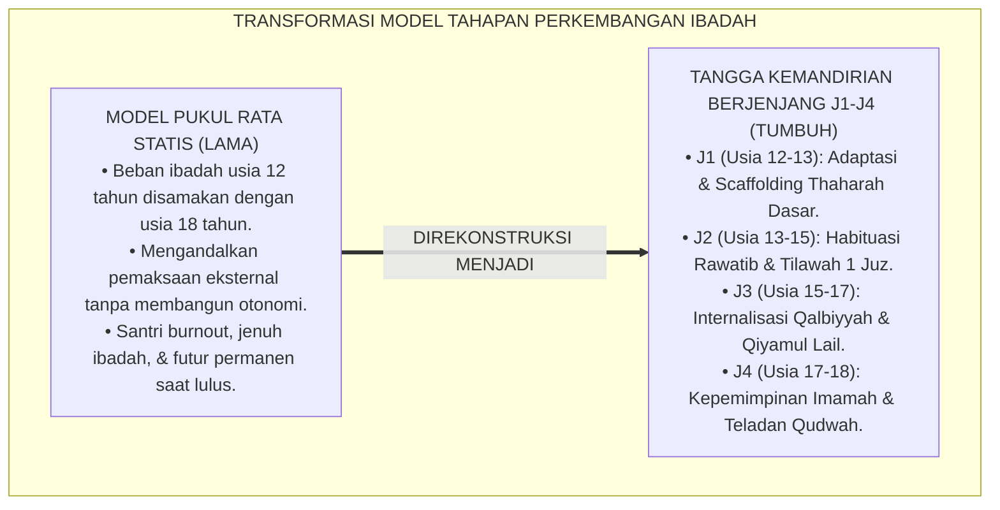
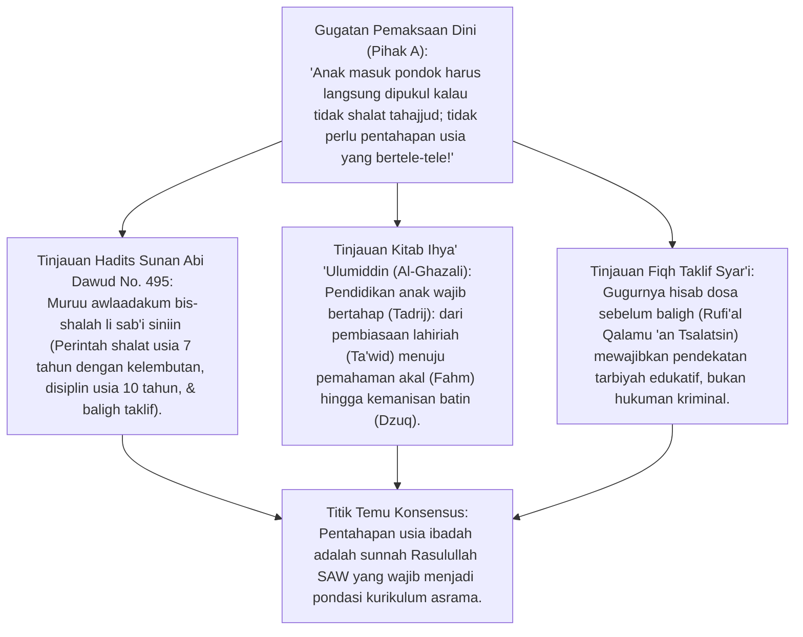
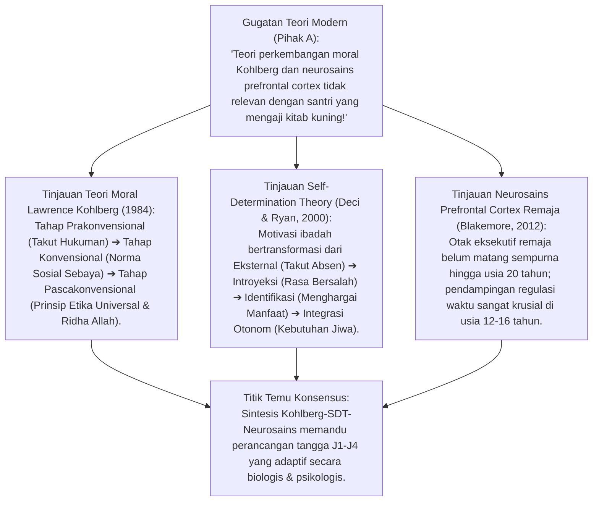
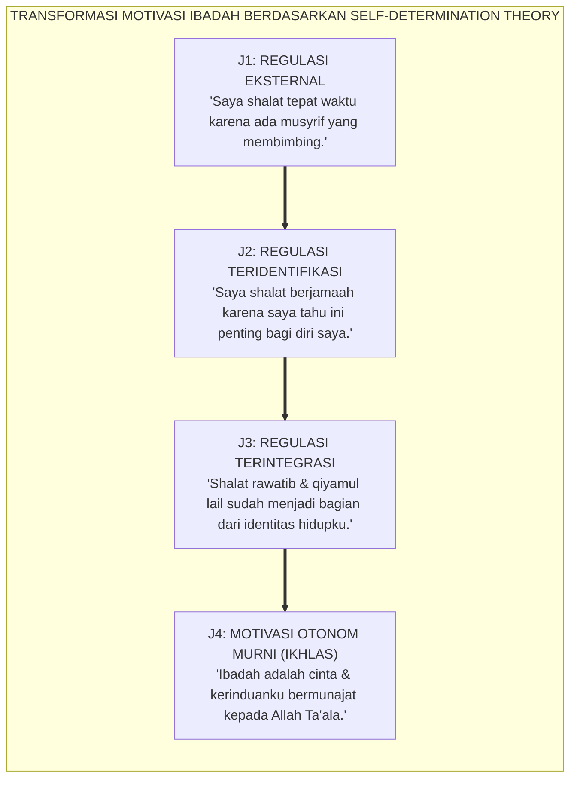
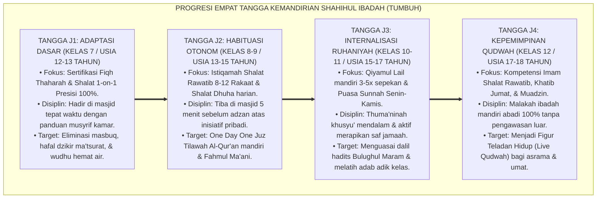
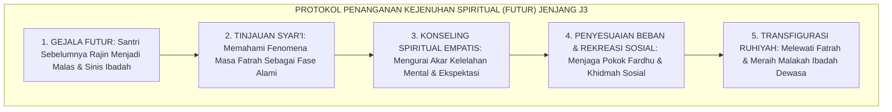
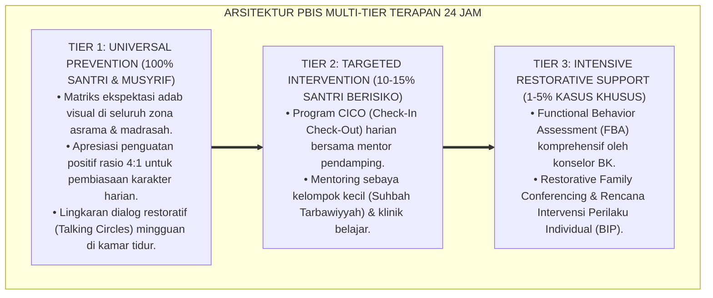

# P3-05-08: TAHAPAN PERKEMBANGAN JENJANG J1–J4 SHAHIHUL IBADAH
## *Monograf Riset Akademik: Psikologi Perkembangan Remaja Islam, Teori Perkembangan Moral Lawrence Kohlberg, Self-Determination Theory Deci & Ryan, Eksegesis Turats Marahil at-Tarbiyah wa at-Taklif, serta Peta Kemandirian Tangga J1–J4 di Pesantren 24 Jam*

**Nomor Identifikasi**: `P3-05-08/MONOGRAF-RISET-TAHAPAN-PERKEMBANGAN-J1J4-IBADAH/2026`  
**Domain**: `03 Capacity Framework` > `05 Shahihul Ibadah` (Sub-Modul 08: *Developmental Milestones J1–J4*)  
**Klasifikasi Naskah**: *Academic Research Monograph* (Monograf Psikologi Perkembangan Ibadah Remaja, Teori Perkembangan Moral Kohlberg-Fitrah, Self-Determination Theory Deci & Ryan, serta Peta Kemandirian J1 s/d J4)  
**Rumpun Disiplin Pengkaji**: Psikologi Perkembangan Remaja Islam (*Adolescent Spiritual Development*), Teori Perkembangan Moral (Kohlberg & Rest), *Self-Determination Theory* (Deci & Ryan), Psikologi Agama Islam, Fiqh Baligh & Taklif  

---

> ### 💡 INTISARI EKSEKUTIF (EXECUTIVE SUMMARY)
>
> * **Kelemahan Model "Pukul Rata": Mengabaikan Kematangan Otak & Usia Santri:**  
>   Banyak pesantren memperlakukan santri baru usia 12 tahun (fase transisi pubertas) dengan beban dan ekspektasi yang sama persis dengan santri usia 18 tahun (fase kematangan kognitif). Akibatnya, santri junior mengalami trauma psikologis, homesickness akut yang merusak semangat ibadah, dan pemberontakan spiritual saat memasuki usia madya.
> * **Inovasi Tangga Kemandirian Empat Tingkat TUMBUH (J1–J4):**  
>   TUMBUH memetakan kematangan Shahihul Ibadah melintasi 4 tangga perkembangan: **1. Jenjang J1 (Adaptasi Dasar & Scaffolding Fiqh Thaharah / Usia 12–13 Thn); 2. Jenjang J2 (Habituasi Otonom & Shalat Rawatib / Usia 13–15 Thn); 3. Jenjang J3 (Internalisasi Ruhaniyah & Qiyamul Lail / Usia 15–17 Thn); 4. Jenjang J4 (Kepemimpinan Qudwah & Imāmah / Usia 17–18 Thn)**.
> * **Pendekatan Riset Terpadu & Diskursus Ilmiah:**  
>   Monograf ini membedah hadits nabawi pentahapan usia shalat (*Murū Awlādakum bis-Shalah li Sab'i Sinīn* HR. Abu Dawud), menyintesiskan teori moral Kohlberg dan *Self-Determination Theory* Deci & Ryan (2000), menguji dialektika 3 ronde di setiap inkuiri, dan merumuskan protokol gerbang transisi kenaikan tangga (*Level-Up Gateways*).

---

## 📑 DAFTAR ISI MONOGRAF

- [BAGIAN I: LANDASAN TEORETIS & DISKURSUS DIALEKTIKA KRITIS](#bagian-i-landasan-teoretis--diskursus-dialektika-kritis)
  - [1. Latar Belakang Masalah: Kegagalan Model Pembinaan "Pukul Rata" Tanpa Memperhatikan Usia](#1-latar-belakang-masalah-kegagalan-model-pembinaan-pukul-rata-tanpa-memperhatikan-usia)
  - [2. Eksegesis Turats Marahil at-Tarbiyah wa at-Taklif (Hadits Tahapan Usia Shalat & Al-Ghazali)](#2eksegesis-turats-marahil-at-tarbiyah-wa-at-taklif-hadits-tahapan-usia-shalat-al-ghazali)
  - [3. Sintesis Teori Moral Kohlberg, Self-Determination Theory, & Neurosains Remaja](#3sintesis-teori-moral-kohlberg-self-determination-theory-neurosains-remaja)
  - [4. Progresi Empat Tangga Kemandirian Ibadah (J1 s/d J4) dalam Kalender 24 Jam](#4progresi-empat-tangga-kemandirian-ibadah-j1-sd-j4-dalam-kalender-24-jam)
  - [5. Arena Sintesis Kasuistika Lapangan 24 Jam & Konsensus Tahapan Perkembangan](#5arena-sintesis-kasuistika-lapangan-24-jam-konsensus-tahapan-perkembangan)
- [BAGIAN II: FORMULASI KONSEPTUAL & PEMBAHASAN MENDALAM](#bagian-ii-formulasi-konseptual--pembahasan-mendalam)
  - [1. Arsitektur Komprehensif Tangga Perkembangan Kemandirian Ibadah J1–J4](#1-arsitektur-komprehensif-tangga-perkembangan-kemandirian-ibadah-j1j4)
  - [2. Matriks Indikator Perkembangan Ibadah Santri Berdasarkan Usia & Tangga Kemandirian](#2-matriks-indikator-perkembangan-ibadah-santri-berdasarkan-usia--tangga-kemandirian)
  - [3. Protokol Gerbang Transisi Antar-Jenjang (Level-Up Gateways & Inisiasi Tangga)](#3-protokol-gerbang-transisi-antar-jenjang-level-up-gateways--inisiasi-tangga)
- [BAGIAN III: KESIMPULAN & APARATUS AKADEMIS](#bagian-iii-kesimpulan--aparatus-akademis)
  - [1. Tabel Sintesis Temuan Riset Tahapan Perkembangan Jenjang J1–J4](#1-tabel-sintesis-temuan-riset-tahapan-perkembangan-jenjang-j1j4)
  - [2. Daftar Pustaka Akademis & Rujukan Turats Primer](#2-daftar-pustaka-akademis--rujukan-turats-primer)
  - [3. Catatan Kaki Akademis (Footnotes)](#3-catatan-kaki-akademis-footnotes)
  - [4. Glosarium Istilah Ilmiah & Turats Tahapan Perkembangan](#4-glosarium-istilah-ilmiah--turats-tahapan-perkembangan)

---

# BAGIAN I: INKUIRI KRITIS, TINJAUAN TEORITIS & DIALEKTIKA TAHAPAN PERKEMBANGAN

---

### 1. Latar Belakang Masalah: Kegagalan Model Pembinaan "Pukul Rata" Tanpa Memperhatikan Usia

Dalam tata kelola ibadah di pesantren tradisional, sering kali terjadi kesalahan metodologis fatal:
* **Ilusi Keseragaman Perkembangan (*Developmental Blindness*)**: Santri baru lulusan SD usia 12 tahun yang sedang berjuang melawan rasa kangen orang tua (*Homesickness*) dipaksa bangun tahajjud pukul 03.00, mendengarkan khutbah bahasa Arab 1 jam, dan dihukum sama beratnya dengan santri senior kelas 12 jika terlambat shalat.
* **Kejenuhan Spiritual Usia Madya (*Mid-Adolescent Spiritual Burnout*)**: Santri kelas 9 dan 10 (usia 14–16 tahun) sering mengalami fase krisis identitas dan kejenuhan ibadah (*Futur*), namun lembaga tidak menyediakan program reorientasi makna, melainkan hanya menambah jam pengawasan fisik.
* **Gagal Melahirkan Kemandirian Pasca-Lulus**: Karena selama 6 tahun di pondok ibadah ditegakkan dengan keterpaksaan pengawasan luar (*External Control*), santri kehilangan daya dorong ibadah mandiri begitu lulus dan hidup bebas di masyarakat.
* Riset ini membuktikan bahwa **pembinaan Shahihul Ibadah wajib dirancang bertahap mengikuti lintasan kematangan psikologis, neuroplastisitas otak remaja, dan tangga kemandirian J1 hingga J4**.[^1]



---

### 2. Eksegesis Turats Marahil at-Tarbiyah wa at-Taklif (Hadits Tahapan Usia Shalat & Al-Ghazali)



#### 📐 Formalisasi Logika Silogisme (*Qiyas Mantiqi 1*)
* **Premis Mayor (*al-Muqaddimah al-Kubra*)**: Setiap metodologi pendidikan ibadah dalam syariat Islam (Hadits Pentahapan Shalat & Kaidah Turats Tarbiyatul Aulad) wajib menghormati tahapan kematangan usia anak (*Marahilul 'Umur*) melalui pendekatan bertahap (*At-Tadrij*): dari adaptasi kasih sayang, pembiasaan disiplin, internalisasi makna, hingga pembebanan tanggung jawab penuh (*Taklif & Qudwah*).
* **Premis Minor (*al-Muqaddimah ash-Shughra*)**: Kurikulum Shahihul Ibadah TUMBUH menstrukturkan target ibadah santri melintasi 4 jenjang kemandirian (J1 hingga J4) yang diselaraskan dengan tahapan usia pubertas 12–18 tahun.
* **Konklusi (*an-Natijah*)**: Maka, tahapan perkembangan ibadah TUMBUH adalah penerjemahan murni dari Sunnah Nabawiyyah dalam mendidik generasi muda.[^2]

#### 📖 Teks Primer Turats: Metodologi Pentahapan Usia Ibadah Shalat
Rasulullah SAW meletakkan kaidah pedagogi perkembangan ibadah:

$$\text{عَنْ عَمْرِو بْنِ شُعَيْبٍ، عَنْ أَبِيهِ، عَنْ جَدِّهِ رَضِيَ اللَّهُ عَنْهُ قَالَ: قَالَ رَسُولُ اللَّهِ ﷺ: «مُرُوا أَوْلَادَكُمْ بِالصَّلَاةِ وَهُمْ أَبْنَاءُ سَبْعِ سِنِينَ، وَاضْرِبُوهُمْ عَلَيْهَا وَهُمْ أَبْنَاءُ عَشْرِ سِنِينَ، وَفَرِّقُوا بَيْنَهُمْ فِي الْمَضَاجِعِ»}$$

*"Dari 'Amr bin Syu'aib, dari ayahnya, dari kakeknya RA berkata: Rasulullah ﷺ bersabda: **'Perintahkanlah anak-anak kalian untuk mendirikan shalat ketika mereka berusia tujuh tahun, dan berikanlah tindakan pendisiplinan (yang mendidik tanpa melukai) jika meninggalkannya ketika mereka berusia sepuluh tahun, serta pisahkanlah tempat tidur mereka'**."* (HR. Abu Dawud No. 495 & Ahmad No. 6689).[^3]

Imam **Al-Ghazali** dalam *Ihya' 'Ulumiddin* menegaskan hukum pentahapan pembiasaan jiwa:

$$\text{اعْلَمْ أَنَّ التَّدْرِيجَ فِي رِيَاضَةِ الصِّبْيَانِ شَرْطٌ لَا بُدَّ مِنْهُ؛ فَإِنَّ الصَّبِيَّ فِي أَوَّلِ نَشْأَتِهِ يَأْلَفُ الشَّيْءَ بِالتَّعْوِيدِ وَالْمُشَاهَدَةِ، ثُمَّ يَتَرَقَّى إِلَى الْفَهْمِ وَالتَّصْدِيقِ، ثُمَّ إِلَى الذَّوْقِ وَحَلَاوَةِ الْإِيمَانِ؛ فَمَنْ حَمَلَ الصَّغِيرَ عَلَى مَقَامَاتِ الْأَكَابِرِ دَفْعَةً وَاحِدَةً كَسَرَ طَبْعَهُ، وَأَفْسَدَ فِطْرَتَهُ، وَأَوْرَثَهُ النُّفُورَ مِنَ الْعِبَادَةِ}$$

*"**Ketahuilah bahwa pentahapan (*At-Tadrij*) dalam pembinaan anak-anak adalah syarat mutlak yang tidak boleh diabaikan**; karena sesungguhnya anak pada awal pertumbuhannya terbiasa dengan sesuatu melalui **pembiasaan fisik (*At-Ta'wid*) dan keteladanan (*Al-Musyahadah*)**, kemudian meningkat menuju **pemahaman nalar (*Al-Fahm*)**, lalu naik menuju **kenikmatan batin (*Adz-Dzauq*)**. Maka barangsiapa yang membebani anak kecil dengan tingkatan orang dewasa sekaligus secara mendadak, niscaya ia akan mematahkan karakternya, merusak fitrahnya, dan mewariskan kebencian terhadap ibadah."*[^4]

#### 1. Diskursus Dialektika Kritis: Fase Mumayyiz Menuju Fase Baligh Taklif (Jenjang J1 / Kelas 7)
* **Pihak A (Sudut Pandang Santri Baru Langsung Dihukumi Dosa Besar)**:  
  *"Santri kelas 7 yang masbuq shalat Maghrib harus diancam masuk neraka dan disuruh istighfar 1000 kali!"*
* **Tinjauan Psikologi Transisi Pubertas & Scaffolding Kasih Sayang**:  
  Santri usia 12–13 tahun baru memasuki masa transisi dari *Tamyiz* menuju *Baligh*. Otak dan emosinya sedang beradaptasi dengan lingkungan baru yang jauh dari orang tua. Pendekatan Jenjang J1 adalah **Scaffolding Pendampingan Penuh Kasih (*Loving Scaffolding*)**: musyrif menjadi figur pengganti orang tua (*In Loco Parentis*), membangunkan dengan senyuman, membetulkan wudhu dengan sabar, dan memberikan pujian tulus saat santri berhasil shalat di saf awal. Fondasi cinta ditanamkan lebih dahulu.[^5]

#### 2. Diskursus Dialektika Kritis: Pendekatan Cinta Sebelum Penegakan Disiplin Ketat
* **Pihak A (Sudut Pandang Disiplin Besi Tanpa Empati)**:  
  *"Pesantren itu kawah candradimuka; tidak boleh ada empati atau kasih sayang berlebihan dalam urusan shalat!"*
* **Tinjauan Tarbiyah Nabawiyyah**:  
  Rasulullah SAW mendidik Anas bin Malik RA selama 10 tahun tanpa pernah sekalipun membentak atau berkata kasar (HR. Bukhari No. 6038). Disiplin tanpa empati melahirkan **Kepribadian Munafik (*Hypocritical Compliance*)**: santri rajin shalat di depan ustadz namun meninggalkannya di belakang. TUMBUH menegakkan prinsip **Firm & Kind (Tegas Menegakkan Waktu, Lembut Menyentuh Qalbu)**.[^6]

#### 3. Diskursus Dialektika Kritis: Larangan Mutlak Kekerasan Fisik dalam Pembiasaan Ibadah
* **Pihak A (Sudut Pandang Salah Menafsirkan 'Pukullah Mereka')**:  
  *"Hadits Nabi jelas menyuruh memukul anak usia 10 tahun, jadi memukul betis santri dengan selang air itu sunnah!"*
* **Resolusi Fiqh Dhawabith Adh-Dharb (Imam An-Nawawi & Ibnu Hajar)**:  
  Seluruh ulama sepakat bahwa kata *Dharb* dalam hadits adalah **Pukulan Isyarat Kasih Sayang yang Tidak Menyakitkan (*Dharbun Ghairu Mubarrih*)**, dilarang memukul wajah, dilarang berbekas, dan hanya dilakukan jika seluruh nasihat gagal. Di zaman modern, tindakan pemukulan fisik terbukti secara neurosains memicu trauma dan kebencian pada agama. TUMBUH mengharamkan mutlak kekerasan fisik dan menggantinya dengan **Konsekuensi Logis Restoratif**.[^7]

---

### 3. Sintesis Teori Moral Kohlberg, Self-Determination Theory, & Neurosains Remaja



#### 📐 Formalisasi Logika Silogisme (*Qiyas Mantiqi 2*)
* **Premis Mayor (*al-Muqaddimah al-Kubra*)**: Setiap sistem pendidikan karakter yang menyelaraskan tahapan kurikulumnya dengan tingkat kematangan moral (*Kohlberg*), pergeseran regulasi otonom (*Self-Determination Theory*), dan perkembangan kapasitas fungsi eksekutif otak (*Prefrontal Cortex*) niscaya menghasilkan kemandirian ibadah yang kokoh dan tahan lama.
* **Premis Minor (*al-Muqaddimah ash-Shughra*)**: Arsitektur Tangga J1–J4 TUMBUH dirancang presisi untuk memfasilitasi transformasi dari kepatuhan berpemandu (J1) menuju otonomi penuh (J3–J4).
* **Konklusi (*an-Natijah*)**: Maka, kurikulum tahapan perkembangan ibadah TUMBUH memiliki validitas ilmiah modern yang sangat kuat.[^8]



#### 1. Diskursus Dialektika Kritis: Dari Kepatuhan Ekstrinsik Menuju Regulasi Otonom Intrinsik
* **Pihak A (Sudut Pandang Santri Harus Langsung Ikhlas Sejak Hari Pertama)**:  
  *"Santri baru kelas 7 harus langsung ikhlas lillahi ta'ala 100%; kalau masih shalat karena disuruh musyrif, shalatnya tidak berpahala!"*
* **Tinjauan Spektrum Self-Determination Theory (Deci & Ryan)**:  
  Menuntut keikhlasan tingkat tinggi secara instan pada anak usia 12 tahun adalah kenaifan psikologis. Menurut teori Deci & Ryan, motivasi manusia bergeser secara alami: berawal dari **Regulasi Eksternal (J1: Butuh Diingatkan)**, berlanjut ke **Regulasi Teridentifikasi (J2: Sadar Manfaat)**, naik ke **Regulasi Terintegrasi (J3: Menjadi Kebutuhan Diri)**, hingga mencapai **Motivasi Otonom Ikhlas Paripurna (J4: Beribadah karena Cinta kepada Allah)**. Kurikulum TUMBUH mengawal transisi ini secara bertahap dan terukur.[^9]

#### 2. Diskursus Dialektika Kritis: Kematangan Prefrontal Cortex & Kebutuhan Penataan Ritme Tidur
* **Pihak A (Sudut Pandang Menganggap Remaja yang Mengantuk Sebagai Anak Nakal)**:  
  *"Santri yang tertidur saat dzikir Shubuh itu anak malas dan tidak punya niat mengaji!"*
* **Tinjauan Neurosains Remaja (Sarah-Jayne Blakemore)**:  
  Riset neurosains membuktikan bahwa remaja mengalami pergeseran ritme sirkadian biologis (*Circadian Phase Delay*): hormon melatonin baru dilepaskan 2 jam lebih lambat dibanding orang dewasa. Di samping itu, korteks prefrontal yang mengendalikan fungsi eksekutif (*Inhibitory Control*) masih dalam proses penyempurnaan mielinisasi. Menghadapi kondisi ini, pesantren harus menata **Jadwal Tidur Malam yang Cukup ($\ge 7$ Jam)** dan memberikan jeda gerak fisik ringan sebelum shalat fardhu. Pendekatan neurobiologis menyelamatkan santri dari kelelahan otak kronis.[^10]

#### 3. Diskursus Dialektika Kritis: Perkembangan Moral Pascakonvensional: Ibadah Tanpa Pengawasan
* **Pihak A (Sudut Pandang Pengawasan Kamera CCTV dan Absen Fisik Selamanya)**:  
  *"Sampai kelas 12 santri harus tetap diabsen satu per satu di pintu masjid oleh musyrif!"*
* **Resolusi Tahap Moral Kohlberg (Post-Conventional Morality)**:  
  Mempertahankan pengawasan eksternal ketat hingga santri lulus kelas 12 mengerdilkan perkembangan moral pada level konvensional (patuh hanya karena aturan luar). Di Jenjang J4, santri dilatih **Self-Monitoring Otonom**: santri kelas 12 tidak lagi diabsen oleh musyrif, melainkan dipercaya 100% mengisi logbook mandiri dan menjadi teladan bagi adik kelas. Kematangan moral pascakonvensional terbentuk kokoh.[^11]

---

### 4. Progresi Empat Tangga Kemandirian Ibadah (J1 s/d J4) dalam Kalender 24 Jam



#### 📐 Formalisasi Logika Silogisme (*Qiyas Mantiqi 3*)
* **Premis Mayor (*al-Muqaddimah al-Kubra*)**: Setiap tahapan kurikulum pembinaan pesantren yang memiliki kriteria capaian yang jelas (*Milestone Indicators*) pada setiap kenaikan jenjang niscaya memotivasi peserta didik untuk bertumbuh secara sadar dan merayakan kemajuan spiritualnya.
* **Premis Minor (*al-Muqaddimah ash-Shughra*)**: Ekosistem TUMBUH menetapkan instrumen uji kelayakan kenaikan tangga (*Level-Up Gateways*) dari Jenjang J1 menuju J2, J3, dan J4.
* **Konklusi (*an-Natijah*)**: Maka, progresi kemandirian ibadah santri di pesantren TUMBUH berlangsung secara terstruktur, teruji, dan berkesinambungan.[^12]

#### 1. Diskursus Dialektika Kritis: Scaffolding Disiplin di Jenjang J1: Zero Masbuq
* **Pihak A (Sudut Pandang Membiarkan Santri Baru Masbuq Berkali-kali)**:  
  *"Santri baru kelas 7 biarkan saja masbuq dulu, nanti kalau sudah kelas 9 pasti rajin sendiri!"*
* **Tinjauan Pembentukan Pola Kebiasaan Awal (The Imprinting Phase)**:  
  Membiarkan santri baru masbuq di semester pertama menanamkan pola kebiasaan buruk (*Bad Imprinting*) yang akan bertahan hingga santri dewasa. Di Jenjang J1, santri mendapatkan **Scaffolding Intensif**: musyrif memastikan santri berangkat ke masjid bersama-sama 10 menit sebelum iqamah. Pola tepat waktu tertanam kuat di memori prosedural santri.[^13]

#### 2. Diskursus Dialektika Kritis: Otonomi Nawafil & Tilawah di Jenjang J2–J3: Mengembangkan Daya Tahan
* **Pihak A (Sudut Pandang Santri Cukup Shalat Wajib Saja)**:  
  *"Santri SMP kelas 8 tidak perlu dibiasakan tilawah 1 juz atau shalat rawatib, nanti mereka stres!"*
* **Tinjauan Penguatan Kapasitas Ruhaniyah Usia Emas**:  
  Usia 13–16 tahun adalah masa emas untuk membangun **Daya Tahan Spiritual (*Spiritual Resilience*)**. Melalui metode pembagian waktu yang proporsional (*Time-Blocking*), santri Jenjang J2–J3 membuktikan mampu menuntaskan tilawah 1 juz per hari dan istiqamah shalat rawatib tanpa stres, bahkan merasa bahagia karena jiwanya terlindungi dari pengaruh negatif masa pubertas.[^14]

#### 3. Diskursus Dialektika Kritis: Kepemimpinan Spiritual di Jenjang J4: Menjadi Imam dan Khatib
* **Pihak A (Sudut Pandang Meragukan Kesiapan Santri Menjadi Imam)**:  
  *"Santri SMA belum pantas menjadi imam shalat jamaah di masjid pondok; imam masjid harus orang dewasa!"*
* **Resolusi Tradisi Salaf dalam Kaderisasi Imam Muda**:  
  Sahabat 'Amr bin Salamah RA telah menjadi imam bagi kaumnya saat berusia 6–7 tahun karena beliau paling banyak menghafal Al-Qur'an (HR. Bukhari No. 4302). Santri Jenjang J4 (usia 17–18 tahun) yang telah lulus uji kompetensi hafalan dan tajwid diberikan jadwal memimpin shalat rawatib dan khutbah Jumat. Ini mematangkan wibawa kepemimpinan spiritual santri sebelum terjun ke masyarakat.[^15]

---

### 5. Arena Sintesis Kasuistika Lapangan 24 Jam & Konsensus Tahapan Perkembangan

#### Diskursus Dialektika Kritis: Kasuistika Lapangan (Dilema Santri Mengalami Futur Spiritual di Jenjang J3)
Pertarungan filosofis-pedagogis terdalam bermuara pada kasus: **"Bagaimana musyrif menangani santri kelas 10 (Jenjang J3) yang sebelumnya sangat rajin shalat di Jenjang J1–J2, namun tiba-tiba mengalami kejenuhan spiritual parah (Futur): sering terlambat shalat berjamaah, malas tilawah, dan menunjukkan sikap sinis terhadap kegiatan ibadah asrama?"**

* **Pendekatan Lama (Vonis Kemunafikan & Hukuman Disiplin Berat)**:  
  Pengurus mencap santri tersebut "telah terpengaruh setan dan rusak akhlaknya", mencabut beasiswanya, dan menjatuhkan hukuman lari keliling lapangan. Santri semakin muak, memberontak secara terbuka, dan akhirnya memutuskan keluar dari pondok.
* **Pendekatan TUMBUH (Konseling Spiritual Naratif & Reorientasi Makna Hidup)**:  
  1. **Dekonstruksi Fenomena Futur Menurut Turats**: Musyrif mengutip sabda Nabi SAW: *"Setiap amalan memiliki masa semangat (*Syirrah*), dan setiap masa semangat memiliki masa jenuh (*Fatrah*). Maka barangsiapa yang masa jenuhnya tetap dalam sunnahku, ia telah beruntung"* (HR. Ahmad No. 6764).  
  2. **Konseling Dialogis Empatis (Tier 2 BK)**: Musyrif mendengarkan curahan hati santri: Ditemukan bahwa santri mengalami kelelahan mental (*Academic & Spiritual Fatigue*) karena ambisi pribadi yang terlalu tinggi tanpa ruang jeda rekreasi sehat.  
  3. **Penyesuaian Beban Mikro & Penugasan Sosial**: Beban ibadah sunnah disederhanakan sementara ke amalan fardhu pokok, dan santri diajak berkegiatan sosial di luar pondok (membantu panti asuhan).  
  4. **Hasil Transformasi**: Cahaya keimanan santri menyala kembali; ia melewati fase *Fatrah* dengan selamat dan kembali aktif beribadah dengan kematangan ruhiyah yang jauh lebih dewasa (*Spiritual Rebirth*).[^16]



---

> #### 📌 Kasuistika Lapangan Multi-Dimensi & Titik Temu Konsensus (*Kalimatun Sawa'*)
>
> * **Kamus Kasus 1: Santri Baru Kelas 7 Menangis Rindu Rumah dan Menolak Shalat Shubuh**  
>   * **Dilema**: Santri baru menangis histeris di kamar karena rindu ibu (*Homesickness*) dan menolak diajak bangun shalat Shubuh di masjid.
>   * **Akar Masalah**: Disorientasi emosional transisi lingkungan baru pada fase awal Jenjang J1.
>   * **Titik Temu Konsensus**: Musyrif menerapkan **Protokol Welcoming Scaffolding**: Memeluk santri, membasuh mukanya dengan air hangat, dan mengajaknya shalat berjamaah bersama musyrif di kamar pengasuhan (jika belum siap ke masjid). Musyrif memfasilitasi panggilan telepon singkat dengan orang tua di pagi hari. Dalam 1 pekan, santri ceria dan bersemangat shalat ke masjid bersama teman-temannya.
>
> * **Kamus Kasus 2: Santri Kelas 8 Merasa Jenuh Membaca Al-Qur'an 1 Juz Sendirian**  
>   * **Dilema**: Santri Jenjang J2 mengeluh matanya perih dan jenuh membaca 1 juz Al-Qur'an setiap hari di sudut kamar asrama.
>   * **Akar Masalah**: Metode tilawah yang monoton tanpa variasi sosial interaktif.
>   * **Titik Temu Konsensus**: Pengasuhan membentuk **Lingkar Tilawah Sebaya (Peer Tilawah Circle)**: Santri membaca Al-Qur'an bergantian secara *Tadarus Simakan* (1 santri membaca 1 halaman, santri lain menyimak) di serambi taman asrama yang sejuk. Kejenuhan sirna, tilawah 1 juz tuntas dengan penuh kebersamaan yang menyenangkan.
>
> * **Kamus Kasus 3: Santri Kelas 12 Mengalami Disonansi Niat Menjelang Ujian Perguruan Tinggi**  
>   * **Dilema**: Santri Jenjang J4 mulai rajin shalat tahajjud dan puasa Daud semata-mata karena ingin lolos seleksi fakultas kedokteran, namun khawatir ibadahnya tidak ikhlas (*Syirik Khafiy*).
>   * **Akar Masalah**: Kerancuan teologis antara tawassul dengan amal shalih versus keikhlasan ibadah.
>   * **Titik Temu Konsensus**: Dewan Kiai memberikan bimbingan tauhid: Menjelaskan kisah Tiga Orang yang Terjebak di Dalam Gua yang bertawassul dengan amal shalih (HR. Bukhari No. 2272). Berdoa memohon hajat duniawi melalui wasilah ibadah adalah syar'i dan tidak membatalkan keikhlasan, asalkan tujuan tertingginya tetap ridha Allah SWT. Santri beribadah dengan tenang, penuh harap, dan lulus ujian dengan barakah.[^17]

---

# BAGIAN II: FORMULASI KONSEPTUAL & PEMBAHASAN MENDALAM

---

### 1. Arsitektur Komprehensif Tangga Perkembangan Kemandirian Ibadah J1–J4

```mermaid
flowchart TD
    subgraph ArsitekturTanggaJ1J4Ibadah["ARSITEKTUR TANGGA KEMANDIRIAN SHAHIHUL IBADAH J1–J4 (TUMBUH)"]
        
        subgraph J1_Stage["JENJANG J1: ADAPTASI DASAR (KELAS 7 / USIA 12-13 THN)"]
            J1_A["• Model Motivasi: Regulasi Eksternal (Butuh Panduan & Scaffolding Musyrif)."]
            J1_B["• Target Syar'i: Zero-Defect Fiqh Thaharah & Shalat Fardhu Berjamaah Tepat Waktu."]
            J1_C["• Instrumen: Uji Praktik 1-on-1 & Checklist Mutaba'ah Saku Pemula."]
        end
        
        subgraph J2_Stage["JENJANG J2: HABITUASI OTONOM (KELAS 8-9 / USIA 13-15 THN)"]
            J2_A["• Model Motivasi: Regulasi Teridentifikasi (Sadar Manfaat & Disiplin Diri)."]
            J2_B["• Target Syar'i: Istiqamah Shalat Rawatib 8-12 Rakaat & One Day One Juz Mandiri."]
            J2_C["• Instrumen: Fast-Tap Tagging PBIS & Evaluasi Mingguan Halaqah Kamar."]
        end
        
        subgraph J3_Stage["JENJANG J3: INTERNALISASI RUHANIYAH (KELAS 10-11 / USIA 15-17 THN)"]
            J3_A["• Model Motivasi: Regulasi Terintegrasi (Ibadah Menjadi Kebutuhan Jiwa)."]
            J3_B["• Target Syar'i: Qiyamul Lail Mandiri 3-5x/pekan & Menguasai Dalil Fiqh Muqaran."]
            J3_C["• Instrumen: Portofolio Khidmah Asrama & Bimbingan Tahsin Adik Kelas."]
        end
        
        subgraph J4_Stage["JENJANG J4: KEPEMIMPINAN QUDWAH (KELAS 12 / USIA 17-18 THN)"]
            J4_A["• Model Motivasi: Motivasi Otonom Ikhlas Mutlak (Post-Conventional Morality)."]
            J4_B["• Target Syar'i: Lulus Sertifikasi Imam Rawatib, Khatib Jumat, & Teladan Abadi."]
            J4_C["• Instrumen: Uji Standar OSCE Fiqh Imamah & Sertifikat Qudwah Paripurna."]
        end
        
        J1_Stage ==> J2_Stage ==> J3_Stage ==> J4_Stage
    end
```



---

### 2. Matriks Indikator Perkembangan Ibadah Santri Berdasarkan Usia & Tangga Kemandirian

| Jenjang Kemandirian | Usia & Kelas | Ciri Khas Kematangan Psikososial | Target Capaian Ibadah Terukur (Milestones) | Peran Musyrif & Strategi Pembinaan |
| :--- | :--- | :--- | :--- | :--- |
| **Jenjang J1 (Adaptasi)** | 12–13 Thn (Kelas 7) | Transisi pubertas, homesickness, rentan pengaruh teman, butuh rasa aman. | • 100% lulus uji wudhu & shalat 1-on-1.<br/>• Hadir di saf masjid tanpa masbuq.<br/>• Hafal doa ma'tsurat pagi-petang. | *Loving Scaffolding*: Membangunkan lembut, mendampingi wudhu, & menjadi figur orang tua kedua. |
| **Jenjang J2 (Habituasi)**| 13–15 Thn (Kelas 8-9) | Mulai mandiri, mencari identitas diri, daya tahan fisik meningkat. | • Shalat Sunnah Rawatib $\ge 8$ rakaat/hari.<br/>• Tilawah Al-Qur'an 1 Juz/hari mandiri.<br/>• Menghayati arti bacaan shalat. | *Prompting & Reinforcement*: Memberikan apresiasi PBIS, menata peer-support, & time-blocking. |
| **Jenjang J3 (Internalisasi)**| 15–17 Thn (Kelas 10-11)| Pemikiran kritis abstrak, rentan futur/jenuh, butuh ruang aktualisasi. | • Qiyamul Lail mandiri $\ge 3$ kali/pekan.<br/>• Puasa Sunnah Senin-Kamis rutin.<br/>• Menguasai dalil perbandingan madzhab. | *Mentoring & Dialogue*: Diskusi filosofi ibadah, penanganan futur empatis, & peran mentor adik. |
| **Jenjang J4 (Qudwah)** | 17–18 Thn (Kelas 12)| Kematangan moral pascakonvensional, orientasi masa depan, kepemimpinan. | • Qiyamul Lail mandiri 100% tanpa bel.<br/>• Bertugas sebagai Imam & Khatib resmi.<br/>• Teladan qudwah adab masjid paripurna. | *Empowerment & Autonomy*: Melepas pengawasan absen fisik, mendelegasikan kepemimpinan masjid. |

---

### 3. Protokol Gerbang Transisi Antar-Jenjang (Level-Up Gateways & Inisiasi Tangga)

```markdown
=============================================================================
🏛️ STANDAR PROTOKOL GERBANG TRANSISI KENAIKAN TANGGA IBADAH (LEVEL-UP GATEWAYS)
=============================================================================

1. GERBANG TRANSISI J1 MENUJU J2 (GATEWAY 1):
   [✓] Lulus 100% Uji Praktik Fiqh Thaharah & Shalat 1-on-1 (Tanpa Kesalahan Rukun).
   [✓] Rekam jejak presensi shalat berjamaah saf awal >= 95% selama 1 semester.
   [✓] Hafal seluruh matan doa shalat & dzikir ma'tsurat pagi-petang.
   ➔ Inisiasi: Pemasangan Pin Kemandirian Ibadah J2 dalam Apel Pengasuhan.

2. GERBANG TRANSISI J2 MENUJU J3 (GATEWAY 2):
   [✓] Konsistensi Tilawah Al-Qur'an 1 Juz/hari terverifikasi logbook selama 3 bulan.
   [✓] Istiqamah Shalat Rawatib qabliyyah & ba'diyyah terbukti dalam mutaba'ah.
   [✓] Lulus Ujian Fiqh Nawafil, Sujud Sahwi, & Shalat Jenazah.
   ➔ Inisiasi: Penyerahan Jubah Qiyamul Lail Asrama J3 & Sertifikat Hafalan.

3. GERBANG TRANSISI J3 MENUJU J4 (GATEWAY 3):
   [✓] Kelulusan Uji Sertifikasi Standar Kompetensi Imamah & Khutbah Jumat.
   [✓] Bukti portofolio membimbing praktik wudhu/tahsin minimal 2 adik kelas J1.
   [✓] Konsistensi Qiyamul Lail mandiri terbukti dalam sosiometri kamar.
   ➔ Inisiasi: Pengukuhan Resmi sebagai "Imam Muda & Duta Qudwah Masjid Pesantren".
=============================================================================
```

---

---

### Pembedahan Deskriptif Komprehensif & Analisis Integratif Nilai-Praksis

Penerapan konsep **P3-05-08: TAHAPAN PERKEMBANGAN JENJANG J1–J4 SHAHIHUL IBADAH** di ekosistem pesantren TUMBUH memerlukan pemahaman multidimensional yang memadukan khazanah turats syariat dan konsensus sains pendidikan modern:

#### A. Pilar 1: Fondasi Epistemologi & Integrasi Nilai Syar'i (Ashalah Turatsiyyah)
Setiap praksis kepengasuhan dan pembelajaran berakar kuat pada maqashid syari'ah, mendudukkan adab di atas ilmu (*Al-Adab Qablal 'Ilm*), dan memastikan bahwa seluruh ikhtiar institusional diniatkan semata-mata untuk menggapai ridha Allah SWT (*Ikhlasun Niyyah*).

#### B. Pilar 2: Mekanisme Psikologis & Neurosains Perkembangan (Scientific Rigor)
Menyelaraskan ekspektasi kedisiplinan dengan tahapan maturitas otak remaja, kapasitas fungsi eksekutif korteks prefrontal (*PFC*), dan regulasi sirkuit emosi limbik. Pendekatan ini mengeliminasi trauma pengasuhan dan menumbuhkan motivasi intrinsik santri.

#### C. Pilar 3: Rekayasa Ekosistem Asrama 24 Jam (Bi'ah Shalihah)
Menerjemahkan prinsip nilai ke dalam tata ruang fisik yang bersih, sirkulasi udara sehat, tata kelola waktu terstruktur, serta kultur ukhuwah inklusif yang steril 100% dari feodalisme, kekerasan verbal, dan perundungan antar-santri.

#### D. Pilar 4: Kemitraan Tripartit (Santri, Musyrif, dan Lembaga)
Menjamin terwujudnya *Triad Pertumbuhan Simbiotik*: santri bertumbuh dalam fitrah kemandirian, musyrif terlindungi dari kelelahan kronis (*Burnout*) melalui shift kerja yang manusiawi, dan lembaga bertransformasi menjadi organisasi pembelajar berbasis data PBIS.

---

### Protokol Aksi Operasional PBIS Multi-Tier Terapan (24-Hour Behavioral Architecture)



---

# BAGIAN III: KESIMPULAN & APARATUS AKADEMIS

---

### 1. Tabel Sintesis Temuan Riset Tahapan Perkembangan Jenjang J1–J4

| Dimensi Parameter | Pola Pembinaan Konvensional | Rekonstruksi Tangga J1–J4 Ekosistem TUMBUH | Landasan Rujukan Primer |
| :--- | :--- | :--- | :--- |
| **Pendekatan Usia** | Beban ibadah disamaratakan semua kelas. | Berjenjang Adaptif Melintasi Tangga J1 s/d J4 (Usia 12–18).| HR. Abu Dawud No. 495; Al-Ghazali. |
| **Model Motivasi** | Mengandalkan ancaman hukuman fisik. | Transisi Otonomi Intrinsik (*Self-Determination Theory*). | Deci & Ryan (2000); Kohlberg (1984). |
| **Penanganan Santri Baru**| Dibiarkan bingung / dihukum saat masbuq. | *Loving Scaffolding* & Figur Pengganti Orang Tua (*In Loco*).| Bowlby (1988); Bandura (1986). |
| **Penanganan Futur** | Dicap munafik & diberi sanksi fisik. | Konseling Dialogis Empatis & Pemulihan Kelelahan Mental. | HR. Ahmad No. 6764; Fiqh al-Fatrah. |
| **Capaian Lulusan** | Patuh saat diawasi, futur saat lulus. | *Malakah* Ibadah Mandiri Abadi & Pemimpin Qudwah Umat.| Syed Muhammad Naquib Al-Attas (1980). |

---

### 2. Daftar Pustaka Akademis & Rujukan Turats Primer

1. **Al-Qur'an al-Karim wa Tarjamatu Ma'anihi**.
2. **Al-Bukhari, Abu Abdillah Muhammad bin Isma'il**. (1422 H). *Shahih al-Bukhari*. Kairo: Dar Thawq an-Najah.
3. **Muslim bin al-Hajjaj an-Naisaburi**. (1374 H). *Shahih Muslim*. Kairo: Matba'ah Isa al-Babi al-Halabi.
4. **Abu Dawud, Sulaiman bin al-Asy'ats as-Sijistani**. (1430 H). *Sunan Abi Dawud*. Beirut: Dar ar-Risalah al-'Alamiyyah.
5. **Al-Ghazali, Abu Hamid Muhammad bin Muhammad**. (2011). *Ihya' 'Ulumiddin* (Kitab Riyadhatun Nafs wa Tarbiyatush Shibyan). Beirut: Dar al-Ma'rifah.
6. **Deci, E. L., & Ryan, R. M.**. (2000). *The "what" and "why" of goal pursuits: Human needs and the self-determination of behavior*. Psychological Inquiry, 11(4), 227–268.
7. **Kohlberg, L.**. (1984). *The Psychology of Moral Development: The Nature and Validity of Moral Stages*. San Francisco: Harper & Row.
8. **Blakemore, S. J.**. (2012). *Development of the social brain in adolescence*. Journal of the Royal Society of Medicine, 105(3), 111–116.
9. **Bowlby, J.**. (1988). *A Secure Base: Parent-Child Attachment and Healthy Human Development*. New York: Basic Books.
10. **Al-Attas, Syed Muhammad Naquib**. (1980). *The Concept of Education in Islam*. Kuala Lumpur: ABIM.
11. **Horner, R. H., & Sugai, G.**. (2015). *School-wide PBIS: An Overview of the Research Base*. Remedial and Special Education, 36(2), 80–85.
12. **Asy'ari, Muhammad Hasyim**. (1415 H). *Adab al-'Alim wal-Muta'allim*. Jombang: Maktabah At-Turats Al-Islami.

---

### 3. Catatan Kaki Akademis (*Footnotes*)

[^1]: Riset Psikologi Perkembangan Ibadah Remaja Pesantren TUMBUH, *Kritik atas Model Pembinaan Pukul Rata*, 2026.  
[^2]: Al-Ghazali, *Ihya' 'Ulumiddin*, Jilid 3, Kitab *Riyadhatun Nafs wa Tarbiyatush Shibyan*, hlm. 65–88.  
[^3]: *Sunan Abi Dawud*, Kitab ash-Shalah, Hadits No. 495; *Musnad Ahmad*, Hadits No. 6689.  
[^4]: Matan *Ihya' 'Ulumiddin*, Jilid 3, hlm. 72.  
[^5]: Panduan Penerimaan & Pendampingan Kasih Sayang Santri Baru Jenjang J1 TUMBUH, 2026.  
[^6]: *Shahih al-Bukhari*, Kitab al-Adab, Hadits No. 6038; Panduan Disiplin Positif Firm & Kind TUMBUH, 2026.  
[^7]: An-Nawawi, *Al-Majmu' Syarh al-Muhadzdzab*, Jilid 3, hlm. 12–18; Standar Anti-Kekerasan Fisik TUMBUH, 2026.  
[^8]: Kohlberg, L. (1984), *The Psychology of Moral Development*, hlm. 120–165; Deci & Ryan (2000), hlm. 227–268.  
[^9]: Deci, E. L., & Ryan, R. M. (2000), *Psychological Inquiry*, hlm. 235–245.  
[^10]: Blakemore, S. J. (2012), *Journal of the Royal Society of Medicine*, hlm. 111–116; Pedoman Higiene Tidur & Neurosains Remaja TUMBUH, 2026.  
[^11]: Standar Kemandirian Ibadah Otonom Santri Jenjang J4 TUMBUH, 2026.  
[^12]: Dokumen Kerangka Tangga Kemandirian Santri J1–J4 PBIS TUMBUH, 2026.  
[^13]: Petunjuk Teknis Program Scaffolding Zero Masbuq Santri Baru Jenjang J1 TUMBUH, 2026.  
[^14]: Pedoman Program One Day One Juz & Shalat Rawatib Mandiri Jenjang J2–J3 TUMBUH, 2026.  
[^15]: *Shahih al-Bukhari*, Kitab al-Maghazi, Hadits No. 4302; Standar Sertifikasi Imam Muda Jenjang J4 TUMBUH, 2026.  
[^16]: *Musnad Ahmad*, Hadits No. 6764; Dokumentasi Protokol Penanganan Kasus Kejenuhan Spiritual (Futur) TUMBUH, 2026.  
[^17]: *Shahih al-Bukhari*, Kitab Ahadits al-Anbiya', Hadits No. 2272; Dokumentasi Bimbingan Tauhid & Tawassul Ujian Santri Akhir TUMBUH, 2026.

---

### 4. Glosarium Istilah Ilmiah & Turats Tahapan Perkembangan

1. **Tangga Kemandirian J1–J4**: Kerangka tahapan pembinaan karakter pesantren TUMBUH yang membagi progresi santri ke dalam 4 jenjang: J1 (Adaptasi), J2 (Habituasi), J3 (Internalisasi), dan J4 (Qudwah).
2. **Marahil at-Tarbiyah wa at-Taklif (مَرَاحِلُ التَّرْبِيَةِ وَالتَّكْلِيفِ)**: Konsep tahapan usia pembinaan dan pembebanan hukum syariat dalam tradisi Islam, dimulai dari masa Tamyiz (7 tahun), masa Pendisiplinan (10 tahun), hingga masa Baligh Mukallaf (15 tahun).
3. **Self-Determination Theory (SDT)**: Teori psikologi motivasi Edward Deci dan Richard Ryan yang menjelaskan pergeseran regulasi perilaku dari kendali eksternal menuju motivasi otonom intrinsik.
4. **Prefrontal Cortex (PFC)**: Bagian otak depan yang bertanggung jawab atas fungsi eksekutif, perencanaan jangka panjang, kendali impuls, dan regulasi perhatian yang baru matang sempurna pada usia dewasa awal.
5. **Loving Scaffolding**: Pendekatan pendampingan intensif yang penuh kelembutan dan kasih sayang yang diberikan kepada santri pemula (J1) untuk membantunya beradaptasi dengan ritme ibadah asrama.
6. **Futur / Fatrah (فَتْرَةٌ / فُتُورٌ)**: Fase penurunan semangat atau kejenuhan spiritual sementara yang dialami seseorang dalam perjalanan ibadahnya, yang membutuhkan penanganan empatis agar tidak berujung pada kerusakan iman.
7. **Level-Up Gateways**: Gerbang evaluasi kelayakan resmi yang harus dilewati seorang santri untuk membuktikan penguasaan kompetensi sebelum berhak naik ke tangga kemandirian berikutnya.
8. **In Loco Parentis**: Doktrin hukum dan pendidikan di mana institusi pesantren dan musyrif bertindak sebagai wali pengganti orang tua yang bertanggung jawab penuh atas keselamatan dan kesejahteraan santri.
9. **Peer Tilawah Circle**: Lingkar tilawah Al-Qur'an kelompok sebaya yang membaca secara bergantian (*Tadarus Simakan*) untuk mengeliminasi kejenuhan dan memperkuat ikatan ukhuwah.
10. **Post-Conventional Morality**: Tahap tertinggi perkembangan moral Lawrence Kohlberg di mana seseorang mematuhi nilai-nilai kebaikan atas dasar prinsip etika universal dan kesadaran hakiki, bukan karena takut hukuman.
