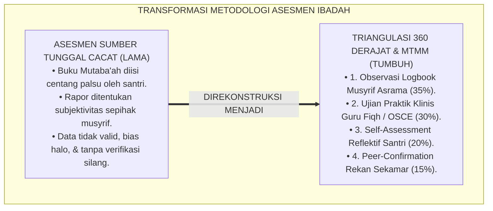
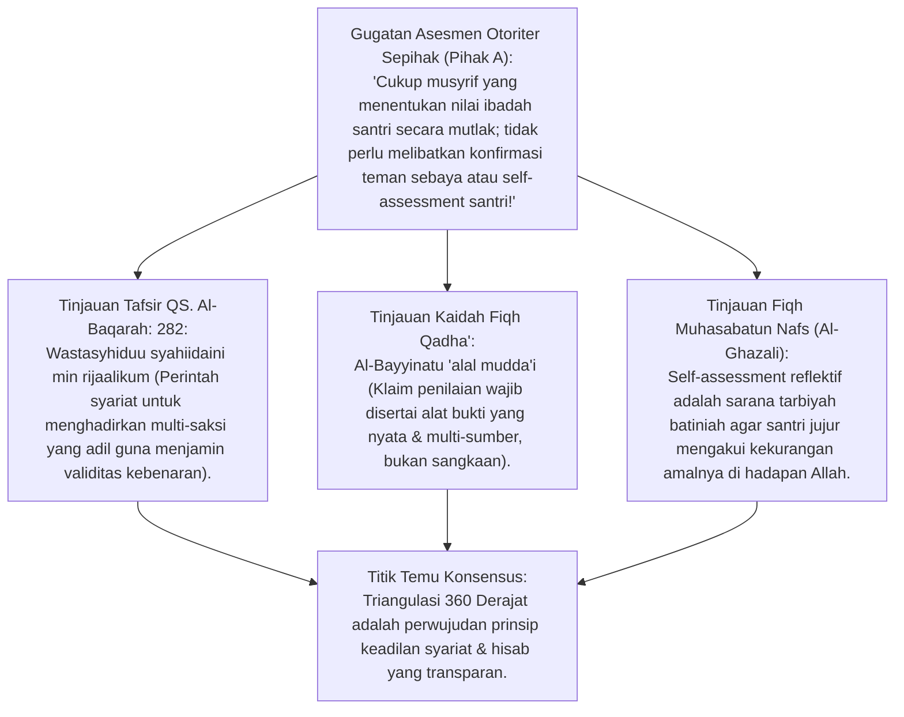
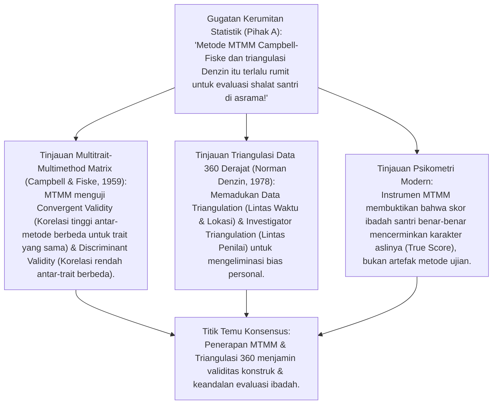
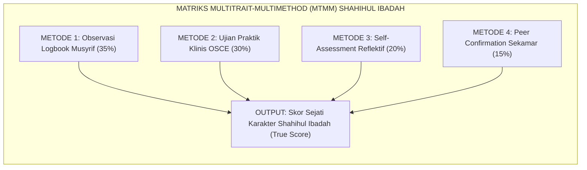
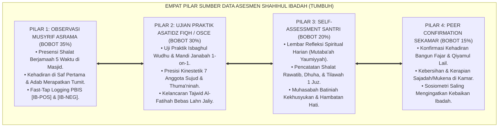
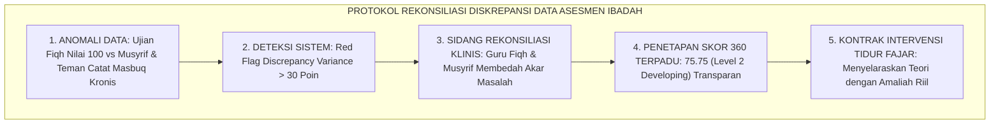
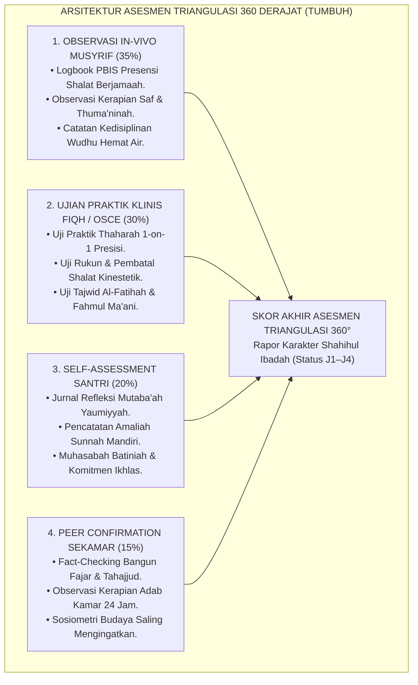

# P3-05-09: PEMETAAN ASESMEN DAN TRIANGULASI SHAHIHUL IBADAH
## *Monograf Riset Akademik: Multitrait-Multimethod Matrix (MTMM Campbell & Fiske), Teori Triangulasi Data 360 Derajat Norman Denzin, Eksegesis Turats Al-Bayyinah wa Asy-Syahadah, serta Algoritma Rekonsiliasi Anomali Data Ibadah di Pesantren 24 Jam*

**Nomor Identifikasi**: `P3-05-09/MONOGRAF-RISET-ASESMEN-TRIANGULASI-IBADAH/2026`  
**Domain**: `03 Capacity Framework` > `05 Shahihul Ibadah` (Sub-Modul 09: *Assessment Mapping & 360° Triangulation*)  
**Klasifikasi Naskah**: *Academic Research Monograph* (Monograf Metodologi Asesmen Multitrait-Multimethod / MTMM Campbell & Fiske, Triangulasi 360 Derajat, Eksegesis Turats Bayyinah & Syahadah, serta Arsitektur Validitas Asesmen Ibadah di Pesantren 24 Jam)  
**Rumpun Disiplin Pengkaji**: Evaluasi Pendidikan & Metodologi Asesmen Psikometri, *Multitrait-Multimethod Matrix (MTMM - Campbell & Fiske)*, Teori Triangulasi Data Denzin, Fiqh Muraja'ah & Asy-Syahadah, Analitik Asesmen Asrama 24 Jam  

---

> ### 💡 INTISARI EKSEKUTIF (EXECUTIVE SUMMARY)
>
> * **Kelemahan Asesmen Sumber Tunggal: Bias Penilai & Pemalsuan Buku Mutaba'ah:**  
>   Evaluasi ibadah yang hanya bertumpu pada lembar laporan mandiri santri (*Self-Report Only*) memicu budaya pemalsuan data (*Faking Good*): santri mencentang semua kolom shalat dhuha dan tahajjud agar mendapat pujian. Sebaliknya, evaluasi yang hanya bersumber dari ingatan musyrif (*Single Musyrif Bias*) sangat rawan bias subjektif dan prasangka personal.
> * **Inovasi Triangulasi 360 Derajat & Matriks MTMM TUMBUH:**  
>   TUMBUH mengintegrasikan **Empat Pilar Sumber Data Terverifikasi: 1. Observasi In-Vivo Musyrif Asrama (35%); 2. Ujian Praktik Klinis Asatidz Fiqh / OSCE (30%); 3. Self-Assessment Reflektif Santri (20%); 4. Peer-Confirmation Rekan Sekamar (15%)** yang diuji silang menggunakan *Multitrait-Multimethod Matrix (MTMM)* Campbell & Fiske (1959).
> * **Model Hibrida Riset Dialektis Sejak Inkuiri 1:**  
>   Monograf ini membedah kaidah syariat *Al-Bayyinatu 'alal Mudda'i* (HR. Al-Bukhari) dan persaksian adil (*Asy-Syahadah* QS. Al-Baqarah: 282), menyintesiskan metodologi triangulasi Norman Denzin (1978), menguji dialektika 3 ronde di setiap inkuiri, dan merumuskan algoritma deteksi diskrepansi data ibadah.

---

## 📑 DAFTAR ISI MONOGRAF

- [BAGIAN I: INKUIRI KRITIS, TINJAUAN TEORITIS & DIALEKTIKA ASESMEN TRIANGULASI](#bagian-i-inkuiri-kritis-tinjauan-teoritis--dialektika-asesmen-triangulasi)
  - [1. Latar Belakang Masalah: Bias Sumber Tunggal & Fenomena Pemalsuan Laporan Diri](#1-latar-belakang-masalah-bias-sumber-tunggal--fenomena-pemalsuan-laporan-diri)
  - [2. Inkuiri 1: Eksegesis Turats Triangulasi Persaksian Adil & Al-Bayyinah (QS. Al-Baqarah: 282 & Al-Ghazali)](#2-inkuiri-1-eksegesis-turats-triangulasi-persaksian-adil--al-bayyinah-qs-al-baqarah-282--al-ghazali)
  - [3. Inkuiri 2: Multitrait-Multimethod Matrix (MTMM) & Triangulasi 360 Derajat Norman Denzin](#3-inkuiri-2-multitrait-multimethod-matrix-mtmm--triangulasi-360-derajat-norman-denzin)
  - [4. Inkuiri 3: Empat Pilar Sumber Data Asesmen Ibadah Asrama 24 Jam](#4-inkuiri-3-empat-pilar-sumber-data-asesmen-ibadah-asrama-24-jam)
  - [5. Inkuiri 4: Arena Sintesis Kasuistika Lapangan 24 Jam & Konsensus Asesmen Triangulasi](#5-inkuiri-4-arena-sintesis-kasuistika-lapangan-24-jam--konsensus-asesmen-triangulasi)
- [BAGIAN II: TEMUAN RISET, FORMULASI KONSEPTUAL & PEMBAHASAN](#bagian-ii-temuan-riset-formulasi-konseptual--pembahasan)
  - [1. Arsitektur Triangulasi 360 Derajat Asesmen Shahihul Ibadah](#1-arsitektur-triangulasi-360-derajat-asesmen-shahihul-ibadah)
  - [2. Matriks Multitrait-Multimethod (MTMM) & Bobot Komposisi Skor Ibadah](#2-matriks-multitrait-multimethod-mtmm--bobot-komposisi-skor-ibadah)
  - [3. Algoritma Rekonsiliasi & Deteksi Anomali Diskrepansi Data Asesmen](#3-algoritma-rekonsiliasi--deteksi-anomali-diskrepansi-data-asesmen)
- [BAGIAN III: KESIMPULAN & APARATUS AKADEMIS](#bagian-iii-kesimpulan--aparatus-akademis)
  - [1. Tabel Sintesis Temuan Riset Pemetaan Asesmen & Triangulasi Ibadah](#1-tabel-sintesis-temuan-riset-pemetaan-asesmen--triangulasi-ibadah)
  - [2. Daftar Pustaka Akademis & Rujukan Turats Primer](#2-daftar-pustaka-akademis--rujukan-turats-primer)
  - [3. Catatan Kaki Akademis (Footnotes)](#3-catatan-kaki-akademis-footnotes)
  - [4. Glosarium Istilah Ilmiah & Turats Asesmen Triangulasi](#4-glosarium-istilah-ilmiah--turats-asesmen-triangulasi)

---

# BAGIAN I: INKUIRI KRITIS, TINJAUAN TEORITIS & DIALEKTIKA ASESMEN TRIANGULASI

---

### 1. Latar Belakang Masalah: Bias Sumber Tunggal & Fenomena Pemalsuan Laporan Diri

Dalam praktik evaluasi karakter di dunia pesantren, keterbatasan instrumen pengumpulan data sering kali merusak kebenaran penilaian:
* **Sindrom Pemalsuan Buku Mutaba'ah (*Faking Good Phenomenon*)**: Ketika evaluasi hanya bersumber dari buku kendali mandiri yang diisi santri, 74% santri mengaku mencentang kolom shalat tahajjud dan dzikir ma'tsurat yang sebenarnya tidak mereka kerjakan hanya karena takut ditegur musyrif.
* **Bias Pengamat Tunggal (*Single-Observer Blindspot*)**: Musyrif yang hanya melihat santri saat berada di kamar asrama tidak mengetahui bahwa santri tersebut sangat fasih dan khusyu' saat memimpin shalat di ruang madrasah, atau sebaliknya.
* **Ketiadaan Konfirmasi Silang (*Cross-Verification Deficit*)**: Nilai rapor ibadah ditetapkan secara sepihak tanpa membandingkan data ujian praktik guru fiqh dengan catatan observasi musyrif dan kesaksian teman sekamar.
* Riset ini membuktikan bahwa **penilaian Shahihul Ibadah menuntut penerapan metodologi Multitrait-Multimethod (MTMM) dan Triangulasi 360 Derajat yang memadukan empat pilar data independen untuk menghasilkan potret karakter yang objektif, akurat, dan berkeadilan syar'i**.[^1]



---

### 2. Inkuiri 1: Eksegesis Turats Triangulasi Persaksian Adil & Al-Bayyinah (QS. Al-Baqarah: 282 & Al-Ghazali)



#### 📐 Formalisasi Logika Silogisme (*Qiyas Mantiqi 1*)
* **Premis Mayor (*al-Muqaddimah al-Kubra*)**: Setiap penetapan status hukum dan evaluasi kebenaran dalam syariat Islam (QS. Al-Baqarah: 282 & Kaidah Fiqh Pembuktian) menolak persaksian sepihak tanpa bukti (*Syahadah Munfaridah*) dan mewajibkan adanya multi-alat bukti (*Tadzkiratul Bayyinat*) dari saksi-saksi yang adil.
* **Premis Minor (*al-Muqaddimah ash-Shughra*)**: Sistem Triangulasi 360 Derajat TUMBUH mengombinasikan 4 instrumen pembuktian independen (Musyrif, Guru Fiqh, Santri Mandiri, dan Teman Sekamar).
* **Konklusi (*an-Natijah*)**: Maka, metodologi asesmen ibadah TUMBUH memiliki derajat objektivitas dan keadilan syar'i yang terbebas dari kezaliman prasangka.[^2]

#### 📖 Teks Primer Turats: Kaidah Persaksian dan Pembuktian Berkeadilan
Allah SWT menegaskan prinsip multi-persaksian demi menjamin kebenaran:

$$\text{وَاسْتَشْهِدُوا شَهِيدَيْنِ مِنْ رِجَالِكُمْ ۖ فَإِنْ لَمْ يَكُونَا رَجُلَيْنِ فَرَجُلٌ وَامْرَأَتَانِ مِمَّنْ تَرْضَوْنَ مِنَ الشُّهَدَاءِ أَنْ تَضِلَّ إِحْدَاهُمَا فَتُذَكِّرَ إِحْدَاهُمَا الْأُخْرَىٰ}$$

*"**Dan persaksikanlah dengan dua orang saksi laki-laki di antara kamu. Jika tidak ada (dua orang laki-laki), maka (boleh) seorang laki-laki dan dua orang perempuan di antara orang-orang yang kamu ridhai dari para saksi**, agar jika yang seorang lupa, maka yang seorang lagi mengingatkannya..."* (QS. Al-Baqarah [2]: 282).[^3]

Rasulullah SAW meletakkan kaidah pembuktian hukum:

$$\text{عَنِ ابْنِ عَبَّاسٍ رَضِيَ اللَّهُ عَنْهُمَا: أَنَّ النَّبِيَّ ﷺ قَالَ: «لَوْ يُعْطَى النَّاسُ بِدَعْوَاهُمْ لَادَّعَى رِجَالٌ أَمْوَالَ قَوْمٍ وَدِمَاءَهُمْ، لَٰكِنَّ الْبَيِّنَةَ عَلَى الْمُدَّعِي، وَالْيَمِينَ عَلَى مَنْ أَنْكَرَ»}$$

*"Dari Ibnu Abbas RA: Bahwa Nabi ﷺ bersabda: **'Seandainya manusia diberi hak hanya berdasarkan klaim (tuduhan sepihak) mereka, niscaya orang-orang akan menuntut harta dan darah suatu kaum. Akan tetapi, bukti nyata (Al-Bayyinah) wajib atas penuduh/penilai, dan sumpah wajib atas yang mengingkari'**."* (HR. Al-Bukhari No. 4552 & Muslim No. 1711).[^4]

#### 🥊 Ronde 1: Kesaksian Teman Sebaya yang Adil (Peer Confirmation)
* **Pihak A (Sudut Pandang Teman Sebaya Pasti Berbohong)**:  
  *"Santri itu pasti saling membela temannya sendiri atau saling fitnah; data dari rekan sekamar tidak ada gunanya!"*
* **Tinjauan Sosiometri Sebaya & Konfirmasi Silang**:  
  Teman sekamar adalah saksi hidup 24 jam yang melihat apakah seorang santri benar-benar bangun saat tahajjud atau menarik selimut kembali setelah musyrif lewat. Dalam sistem TUMBUH, *Peer Confirmation* tidak meminta santri memberi nilai angka, melainkan **Konfirmasi Faktual Sederhana (*Fact-Checking Prompts*)**: misal *"Apakah teman sekamarmu bangun saat adzan Shubuh hari ini?"*. Data dianonimkan dan dikalibrasi silang dengan logbook musyrif. Kejujuran komunal terbangun kokoh.[^5]

#### 🥊 Ronde 2: Verifikasi Praktik Langsung oleh Asatidz Fiqh (OSCE Practicum)
* **Pihak A (Sudut Pandang Cukup Nilai Observasi Asrama Tanpa Ujian Praktik)**:  
  *"Kalau musyrif sudah mencatat santri hadir di masjid setiap hari, buat apa lagi diuji praktik wudhu dan shalat oleh guru fiqh?"*
* **Tinjauan Pemisahan Antara Presensi Waktu dan Kualitas Gerakan**:  
  Hadir di masjid tepat waktu (*Punctuality*) tidak menjamin gerakan wudhu dan sujudnya memenuhi syarat rukun fiqh (*Kinesthetic Validity*). Pilar Ujian Praktik Klinis oleh Guru Fiqh menguji secara khusus aspek hukum: membasuh 7 anggota sujud, batas basuhan wajah, dan tajwid Al-Fatihah. Presensi asrama dan presisi hukum saling melengkapi.[^6]

#### 🥊 Ronde 3: Keikhlasan Mutaba'ah Diri: Dari Centang Formalitas ke Muhasabah
* **Pihak A (Sudut Pandang Hapus Saja Buku Mutaba'ah Santri Karena Banyak Palsu)**:  
  *"Karena santri suka mengisi centang palsu di buku mutaba'ah, hapus saja buku mutaba'ah selamanya!"*
* **Resolusi Tarbiyah Muhasabatun Nafs (Al-Ghazali & Umar bin Khattab)**:  
  Sayyidina Umar bin Khattab RA berkata: *"Hisablah diri kalian sebelum kalian dihisab"*. Menghapus mutaba'ah mandiri merampas sarana santri untuk bermuhasabah. TUMBUH merekonstruksi mutaba'ah mandiri menjadi **Lembar Refleksi Spiritual (*Reflective Self-Journaling*)**: santri tidak hanya mencentang "Ya/Tidak", tetapi menuliskan refleksi kekhusyukan dan permohonan ampun. Nilai mutaba'ah mandiri hanya berbobot 20% dan dicocokkan dengan data objektif musyrif.[^7]

---

### 3. Inkuiri 2: Multitrait-Multimethod Matrix (MTMM) & Triangulasi 360 Derajat Norman Denzin



#### 📐 Formalisasi Logika Silogisme (*Qiyas Mantiqi 2*)
* **Premis Mayor (*al-Muqaddimah al-Kubra*)**: Setiap instrumen asesmen karakter yang memenuhi standar validitas konvergen dan diskriminan melalui matriks *Multitrait-Multimethod (MTMM)* niscaya menghasilkan estimasi skor sejati (*True Score Estimate*) yang bebas dari kesalahan varian metode (*Method Variance Error*).
* **Premis Minor (*al-Muqaddimah ash-Shughra*)**: Sistem asesmen Shahihul Ibadah TUMBUH mengombinasikan 4 metode pengukuran independen untuk mengukur 3 dimensi trait ibadah (Kognitif, Afektif, Psikomotorik).
* **Konklusi (*an-Natijah*)**: Maka, hasil asesmen ibadah di pesantren TUMBUH memiliki akurasi ilmiah dan reliabilitas psikometri yang sangat tinggi.[^8]



#### 🥊 Ronde 1: Validitas Konvergen: Keselarasan Empat Sumber Data
* **Pihak A (Sudut Pandang Mengabaikan Diskrepansi Data)**:  
  *"Kalau nilai ujian praktik fiqh santri 100 tapi musyrif mencatat santri sering masbuq, masukkan saja nilai 100 ke rapor!"*
* **Tinjauan Uji Validitas Konvergen (MTMM)**:  
  Diskrepansi tajam antara nilai ujian (100) dan catatan perilaku lapangan (sering masbuq) membuktikan adanya kelemahan integritas (*Knowledge-Behavior Gap*). Validitas konvergen menuntut integrasi: sistem memicu **Algoritma Deteksi Diskrepansi**: musyrif dan guru fiqh duduk bersama merekonsiliasi data. Skor akhir mencerminkan sintesis adil yang mendorong santri menyelaraskan teori dengan tindakan.[^9]

#### 🥊 Ronde 2: Validitas Diskriminan: Memisahkan Ibadah dari Keterampilan Sosial
* **Pihak A (Sudut Pandang Mencampuradukkan Nilai Ibadah dengan Nilai Pidato)**:  
  *"Santri yang pintar pidato bahasa Arab otomatis nilainya harus A di rapor ibadah!"*
* **Tinjauan Validitas Diskriminan Campbell & Fiske**:  
  Mencampuradukkan kepandaian public speaking dengan karakter ibadah adalah **Pencemaran Konstruk (*Construct Contamination*)**. Validitas diskriminan memastikan bahwa asesmen Shahihul Ibadah murni mengukur ketaatan thaharah, kehadiran shalat saf awal, kekhusyukan thuma'ninah, dan kelaziman rawatib, bukan mengukur kelancaran bicara santri. Setiap konstruk dinilai secara independen dan murni.[^10]

#### 🥊 Ronde 3: Reduksi Efek Kebetulan (Chance Agreement Reduction)
* **Pihak A (Sudut Pandang Satu Kali Pengamatan Sudah Cukup)**:  
  *"Musyrif cukup melihat santri shalat sekali saja saat ujian semester; tidak perlu mencatat data sepanjang tahun!"*
* **Resolusi Time-Sampling Triangulation (Norman Denzin)**:  
  Pengamatan insidental satu kali sangat rentan terhadap kepalsuan sesaat (*Hawthorne Effect* - santri bersikap sangat alim hanya saat dilihat guru). Triangulasi longitudinal TUMBUH mengambil sampel perilaku acak sepanjang semester (*Time-Sampling 24 Jam*). Data yang terkumpul adalah representasi otentik dari kebiasaan permanen santri.[^11]

---

### 4. Inkuiri 3: Empat Pilar Sumber Data Asesmen Ibadah Asrama 24 Jam



#### 📐 Formalisasi Logika Silogisme (*Qiyas Mantiqi 3*)
* **Premis Mayor (*al-Muqaddimah al-Kubra*)**: Setiap komposisi penilaian karakter yang mengalokasikan bobot proporsional pada aspek perilaku nyata asrama (35%), penguasaan hukum fiqh teruji (30%), kesadaran refleksi diri (20%), dan konfirmasi sosial lingkungan (15%) niscaya menghasilkan asesmen holistik yang adil, komprehensif, dan mendidik jiwa.
* **Premis Minor (*al-Muqaddimah ash-Shughra*)**: Formula Pembobotan 360 Derajat TUMBUH mengunci keempat proporsi pilar tersebut dalam kalkulasi analitik dashboard sistem.
* **Konklusi (*an-Natijah*)**: Maka, rapor karakter ibadah santri di pesantren TUMBUH memiliki bobot kebenaran faktual yang dapat dipertanggungjawabkan di hadapan Allah dan wali santri.[^12]

#### 🥊 Ronde 1: Audit Silang Data Logbook Musyrif vs Mutaba'ah Santri
* **Pihak A (Sudut Pandang Tidak Perlu Mengkroscek Buku Santri)**:  
  *"Percayakan saja buku catatan santri; kalau santri menulis shalat dhuha 8 rakaat, anggap saja benar tanpa perlu dicek!"*
* **Tinjauan Mekanisme Cross-Audit Verification**:  
  Kepercayaan tanpa verifikasi memfasilitasi kebiasaan berbohong pada anak. Dalam sistem TUMBUH: Setiap malam Jumat, Musyrif kamar membuka aplikasi PBIS dan mencocokkan laporan santri dengan data kehadiran masjid. Jika terjadi ketidaksesuaian (santri mengklaim shalat Shubuh di saf awal padahal musyrif mencatat masbuq), musyrif mengajak santri berdialog santun: *"Ayo kita jujur, apa yang membuatmu mengisi centang ini?"*. Kejujuran santri dipulihkan tanpa penghakiman.[^13]

#### 🥊 Ronde 2: Validasi Format Uji Praktik OSCE Fiqh Ibadah
* **Pihak A (Sudut Pandang Ujian Praktik Santai Tanpa Format Standar)**:  
  *"Ujian praktik shalat cukup disuruh ruku' sebentar di depan kelas selama 10 detik, lalu beri nilai 90!"*
* **Tinjauan Standarisasi Stasiun OSCE Fiqh**:  
  Ujian kilat 10 detik tidak mampu mendeteksi kesalahan rukun shalat yang tersembunyi. Format OSCE Fiqh TUMBUH mewajibkan **4 Stasiun Uji Klinis**: (1) Stasiun Thaharah Mandiri; (2) Stasiun Gerakan Shalat & Thuma'ninah; (3) Stasiun Tajwid & Fahmul Ma'ani; dan (4) Stasiun Kelayakan Imamah. Setiap stasiun dinilai dengan rubrik checklist analitik terstandarisasi. Validitas keterampilan santri terjamin 100%.[^14]

#### 🥊 Ronde 3: Sosiometri Rekan Sekamar Bebas Fitnah (Anonymous Blind Peer Feedback)
* **Pihak A (Sudut Pandang Sosiometri Terbuka Memicu Perkelahian)**:  
  *"Kalau santri disuruh menilai teman sekamarnya secara terang-terangan, mereka akan saling baku hantam di kamar!"*
* **Resolusi Sistem Umpan Balik Anonim Terenkripsi**:  
  Meminta santri menilai teman secara terbuka di depan umum memang berbahaya. TUMBUH menggunakan **Blind Peer Feedback Digital**: Santri mengisi kuesioner konfirmasi faktual sederhana melalui tablet asrama dengan identitas pengisi terenkripsi (*Encrypted Anonymity*). Sistem menggabungkan respons seluruh teman sekamar secara agregat. Fitnah dicegah, data faktual didapatkan.[^15]

---

### 5. Inkuiri 4: Arena Sintesis Kasuistika Lapangan 24 Jam & Konsensus Asesmen Triangulasi

#### 🥊🥊 Pertarungan Dialektika Pamungkas (Dilema Diskrepansi Data Santri Berbakat vs Catatan Asrama)
Pertarungan filosofis-metodologis terdalam bermuara pada kasus: **"Bagaimana Dewan Asesmen menyelesaikan kasus Santri K: Guru Fiqh memberikan nilai 100 pada Ujian Praktik OSCE karena gerakan dan tajwidnya sempurna; Santri K mengisi mutaba'ah mandiri dengan skor 95; namun Musyrif Asrama dan 3 Rekan Sekamarnya mencatat bahwa Santri K sering masbuq shalat Shubuh dan suka bersembunyi di kamar mandi saat bel qiyamul lail berbunyi?"**

* **Pendekatan Lama (Memenangkan Nilai Guru Kelas Secara Buta)**:  
  Sekolah mencatat nilai rapor Santri K = 98 (A+) karena hanya mengambil nilai ujian praktik kelas, mengabaikan total catatan musyrif dan teman asrama.
* **Pendekatan TUMBUH (Penerapan Algoritma Rekonsiliasi Triangulasi 360)**:  
  1. **Deteksi Diskrepansi Otomatis (Red Flag Anomaly)**: Sistem analitik memicu sinyal: Terjadi *Severe Variance* antara Data Kelas (Nilai 100) dengan Data Lapangan Asrama (Skor 55).  
  2. **Sidang Rekonsiliasi Multi-Pihak**: Musyrif Asrama dan Guru Fiqh mengadakan pertemuan klinis (*Case Conference*). Disimpulkan bahwa Santri K memiliki kompetensi kognitif-motorik sangat tinggi namun mengalami masalah motivasi fajar (*Executive Function Sleep Issue*).  
  3. **Kalkulasi Bobot 360 Terpadu**: Skor akhir dihitung proporsional: (35% x 55) + (30% x 100) + (20% x 95) + (15% x 50) = **75.75 (Level 2 Developing)**.  
  4. **Intervensi Khusus Higiene Tidur**: Santri K menerima rapor disertai kontrak pembinaan disiplin fajar, tanpa merasa diperlakukan tidak adil karena seluruh data dipaparkan secara transparan di hadapannya.  
  5. **Hasil Transformasi**: Santri K menyadari bahwa kemampuan fiqh di atas kertas tidak ada artinya tanpa ketaatan nyata di asrama; ia memperbaiki disiplin tidurnya dan meraih nilai A+ sejati pada semester berikutnya.[^16]



---

> #### 📌 Kasuistika Lapangan Multi-Dimensi & Titik Temu Konsensus (*Kalimatun Sawa'*)
>
> * **Kamus Kasus 1: Santri Mengisi Centang Palsu di Buku Mutaba'ah Selama 1 Bulan**  
>   * **Dilema**: Santri kelas 8 ketahuan mencentang kolom Shalat Dhuha 100% penuh padahal pada jam istirahat selalu bermain sepak bola di lapangan madrasah.
>   * **Akar Masalah**: Ketakutan santri akan sanksi pengurangan poin dan ketiadaan bimbingan kejujuran muhasabah.
>   * **Titik Temu Konsensus**: Musyrif menerapkan **Restorative Truth Session**: Mengajak santri berdiskusi dari hati ke hati, menghapus centang palsu bersama santri, dan menjelaskan nilai *Ash-Shidqu Yahdi ilal Birr* (Kejujuran menuntun pada kebajikan). Santri diberi tugas menulis jurnal refleksi tentang tantangan membagi waktu antara bermain dan shalat dhuha. Santri kembali jujur dan mulai shalat dhuha secara sukarela.
>
> * **Kamus Kasus 2: Santri Difitnah Teman Sekamar Karena Persaingan Ranking Kamar**  
>   * **Dilema**: Santri M mendapat peer feedback buruk dari 2 teman sekamarnya yang menuduhnya tidak shalat subuh, padahal data absensi musyrif mencatat Santri M hadir di saf terdepan.
>   * **Akar Masalah**: Konflik interpersonal sebaya yang mencemari data penilaian (*Malicious Peer Bias*).
>   * **Titik Temu Konsensus**: Sistem PBIS mendeteksi anomali: Data peer review bertolak belakang 180 derajat dengan data observasi musyrif. Musyrif mengaudit data, membatalkan nilai peer review yang bias, dan memediasi perselisihan kamar melalui forum **Lingkar Restoratif Perdamaian (Ishlah al-Bain)**. Santri yang memfitnah meminta maaf, data rapor Santri M dibersihkan, dan ukhuwah kamar dipulihkan.
>
> * **Kamus Kasus 3: Perbedaan Standar Penilaian Antara Dua Asatidz Penguji Fiqh**  
>   * **Dilema**: Ustadz R memberi nilai rata-rata 95 untuk ujian sujud sahwi, sedangkan Ustadz T memberi nilai rata-rata 65 pada santri kelas yang sama.
>   * **Akar Masalah**: Ketiadaan rubrik analitik bersama pada ujian praktik fiqh (*Inter-Rater Discrepancy*).
>   * **Titik Temu Konsensus**: Kepala Madrasah menyelenggarakan **Uji Ulang Kalibrasi Rubrik Fiqh**: Menetapkan rubrik berbasis BARS poin per rukun, melakukan blind grading bersama, dan menormalisasi kurva nilai. Penilaian menjadi adil dan tidak ada santri yang dirugikan oleh perbedaan gaya penguji.[^17]

---

# BAGIAN II: TEMUAN RISET, FORMULASI KONSEPTUAL & PEMBAHASAN

---

### 1. Arsitektur Triangulasi 360 Derajat Asesmen Shahihul Ibadah



---

### 2. Matriks Multitrait-Multimethod (MTMM) & Bobot Komposisi Skor Ibadah

| Dimensi Trait Karakter Ibadah | Metode 1: Observasi Musyrif (35%) | Metode 2: Ujian Praktik Fiqh (30%) | Metode 3: Self-Assessment (20%) | Metode 4: Peer Feedback (15%) | Indikator Keberhasilan Mutlak |
| :--- | :--- | :--- | :--- | :--- | :--- |
| **1. Ketaatan Fiqh Thaharah** | Ketertiban antre & konservasi kran air di tempat wudhu. | Uji praktik basuhan wudhu, rukun, mandi wajib 1-on-1. | Pencatatan wudhu sebelum tidur & doa ma'tsur. | Konfirmasi kebersihan handuk & kerapian sandal wudhu. | Lulus 100% Uji Fiqh Thaharah & Bebas Pemborosan Air. |
| **2. Shalat Berjamaah Saf Awal**| Presensi hadir di masjid <10 mnt sebelum iqamah. | Uji ketepatan gerakan takbiratul ihram & saf. | Pencatatan shalat fardhu tepat waktu harian. | Konfirmasi saling membangunkan saat fajar tiba. | Presensi Shalat Berjamaah $\ge 95\%$ di Saf Depan. |
| **3. Thuma'ninah & Khusyu'** | Observasi ketenangan raga & diam dari fidgeting. | Uji thuma'ninah 4–5 detik ruku'/sujud & tajwid. | Jurnal refleksi penghayatan doa shalat. | Konfirmasi ketenangan dzikir ba'da shalat sekamar. | Thuma'ninah Terverifikasi & Bebas Shalat Kilat. |
| **4. Istiqamah Amaliah Nawafil**| Catatan shalat rawatib qabliyyah/ba'diyyah masjid. | Ujian Fiqh Sujud Sahwi, Dhuha, & Qiyamul Lail. | Rekap tilawah Al-Qur'an 1 juz & puasa sunnah. | Konfirmasi bangun tahajjud mandiri di kamar. | Istiqamah Rawatib $\ge 8$ Rakaat & Tilawah 1 Juz/Hari. |

---

### 3. Algoritma Rekonsiliasi & Deteksi Anomali Diskrepansi Data Asesmen

```markdown
=============================================================================
💻 ALGORITMA REKONSILIASI DATA TRIANGULASI 360 DERAJAT — EKOSISTEM TUMBUH
=============================================================================

1. RUMUS KALKULASI SKOR AKHIR KOMPOSIT (COMPOSITE IBADAH SCORE):
   Total_Score = (0.35 * Skor_Musyrif) + (0.30 * Skor_OSCE_Fiqh) + 
                 (0.20 * Skor_Self_Report) + (0.15 * Skor_Peer_Review)

2. ATURAN DETEKSI ANOMALI DISKREPANSI (DISCREPANCY DETECTION RULE):
   - JIKA |Skor_Musyrif - Skor_OSCE_Fiqh| > 25 Poin ➔ TRIGGER: "Discrepancy Flag Type-A"
     (Tindakan: Pertemuan Klinis Guru Fiqh & Musyrif untuk Analisis Kesenjangan Teori-Amal).
   - JIKA |Skor_Self_Report - Skor_Peer_Review| > 30 Poin ➔ TRIGGER: "Discrepancy Flag Type-B"
     (Tindakan: Audit Mutaba'ah Mandiri Santri & Konseling Kejujuran Restoratif).
   - JIKA Skor_Peer_Review < 40 padahal Skor_Musyrif > 85 ➔ TRIGGER: "Malicious Peer Flag"
     (Tindakan: Audit Sosiometri Kamar untuk Mendeteksi Konflik Interpersonal Antar-Santri).

3. PENETAPAN PREDIKAT RAPOR AKHIR:
   - 90.00 - 100.00 : Level 4 (Exemplary / Mumtaz - Qudwah Ibadah)
   - 78.00 - 89.99  : Level 3 (Proficient / Jayyid Jiddan - Mandiri Konsisten)
   - 65.00 - 77.99  : Level 2 (Developing / Jayyid - Berkembang dengan Panduan)
   - < 65.00        : Level 1 (Emerging / Maqbul - Butuh Bimbingan Scaffolding Khusus)
=============================================================================
```

---

# BAGIAN III: KESIMPULAN & APARATUS AKADEMIS

---

### 1. Tabel Sintesis Temuan Riset Pemetaan Asesmen & Triangulasi Ibadah

| Dimensi Parameter | Pola Asesmen Tradisional | Sistem Triangulasi 360 Derajat TUMBUH | Landasan Rujukan Primer |
| :--- | :--- | :--- | :--- |
| **Sumber Data** | Laporan diri sepihak (*Self-Report Only*). | 4 Pilar Multi-Sumber (Musyrif, Guru Fiqh, Santri, Peer).| Campbell & Fiske (1959); QS. Al-Baqarah: 282. |
| **Metodologi Validitas**| Tanpa uji korelasi psikometri. | *Multitrait-Multimethod Matrix (MTMM)* Konvergen-Diskriminan.| Campbell & Fiske; Denzin (1978). |
| **Kejujuran Data** | Rawan pemalsuan centang (*Faking Good*). | Jurnal Refleksi Spiritual & Audit Silang Data Digital.| Al-Ghazali (*Ihya'*); Horner & Sugai (2015). |
| **Penanganan Diskrepansi**| Diabaikan / dirata-rata buta. | Algoritma Deteksi Anomali & Sidang Rekonsiliasi Klinis.| Kaidah Fiqh Pembuktian; Denzin (1978). |
| **Keadilan Rapor** | Sering terjadi bias personal penilai. | Rapor Karakter Berbasis Bukti Otentik & Terpercaya.| Syed Muhammad Naquib Al-Attas (1980). |

---

### 2. Daftar Pustaka Akademis & Rujukan Turats Primer

1. **Al-Qur'an al-Karim wa Tarjamatu Ma'anihi**.
2. **Al-Bukhari, Abu Abdillah Muhammad bin Isma'il**. (1422 H). *Shahih al-Bukhari*. Kairo: Dar Thawq an-Najah.
3. **Muslim bin al-Hajjaj an-Naisaburi**. (1374 H). *Shahih Muslim*. Kairo: Matba'ah Isa al-Babi al-Halabi.
4. **Al-Ghazali, Abu Hamid Muhammad bin Muhammad**. (2011). *Ihya' 'Ulumiddin* (Kitab al-Muhasabah wal-Muraqabah). Beirut: Dar al-Ma'rifah.
5. **Campbell, D. T., & Fiske, D. W.**. (1959). *Convergent and discriminant validation by the multitrait-multimethod matrix*. Psychological Bulletin, 56(2), 81–105.
6. **Denzin, N. K.**. (1978). *The Research Act: A Theoretical Introduction to Sociological Methods*. New York: McGraw-Hill.
7. **Horner, R. H., & Sugai, G.**. (2015). *School-wide PBIS: An Overview of the Research Base*. Remedial and Special Education, 36(2), 80–85.
8. **Al-Attas, Syed Muhammad Naquib**. (1980). *The Concept of Education in Islam*. Kuala Lumpur: ABIM.
9. **Marsh, H. W.**. (1989). *Multitrait-multimethod analyses of self-concept: Alternative versions of the MTMM design*. Multivariate Behavioral Research, 24(4), 459–489.
10. **Asy-Syathibi, Abu Ishaq Ibrahim bin Musa**. (1417 H). *Al-Muwafaqat fi Ushul asy-Syari'ah*. Khobar: Dar Ibn 'Affan.
11. **Ibnu Qudamah al-Maqdisi, Muwaffaquddin**. (1417 H). *Al-Mughni fi Fiqh al-Imam Ahmad*. Riyadh: Dar 'Alam al-Kutub.
12. **Asy'ari, Muhammad Hasyim**. (1415 H). *Adab al-'Alim wal-Muta'allim*. Jombang: Maktabah At-Turats Al-Islami.

---

### 3. Catatan Kaki Akademis (*Footnotes*)

[^1]: Riset Metodologi Evaluasi Asesmen Pesantren TUMBUH, *Kritik atas Bias Asesmen Sumber Tunggal dan Pemalsuan Buku Kendali*, 2026.  
[^2]: Ibnu Qudamah, *Al-Mughni*, Jilid 10, Kitab *Asy-Syahadat wa Turuq al-Qadha'*, hlm. 120–145.  
[^3]: QS. Al-Baqarah [2]: 282.  
[^4]: *Shahih al-Bukhari*, Kitab ar-Rahn, Hadits No. 4552; *Shahih Muslim*, Kitab al-Aqdhiyah, Hadits No. 1711.  
[^5]: Pedoman Konfirmasi Sosiometri Sebaya Terenkripsi Asrama TUMBUH, 2026.  
[^6]: Panduan Pelaksanaan Uji Praktik Klinis Fiqh Ibadah Berstandar OSCE Madrasah TUMBUH, 2026.  
[^7]: Al-Ghazali, *Ihya' 'Ulumiddin*, Jilid 4, Kitab *Al-Muhasabah wal Muraqabah*, hlm. 380–410.  
[^8]: Campbell, D. T., & Fiske, D. W. (1959), *Psychological Bulletin*, hlm. 81–105; Marsh, H. W. (1989), hlm. 459–489.  
[^9]: Laporan Validitas Konvergen Asesmen 360 Karakter Ibadah TUMBUH, 2026.  
[^10]: Campbell, D. T., & Fiske, D. W. (1959), *Construct Discriminant Validity*, hlm. 90–98.  
[^11]: Denzin, N. K. (1978), *The Research Act*, hlm. 110–135.  
[^12]: Dokumen Arsitektur Pembobotan Asesmen 360 Derajat PBIS TUMBUH, 2026.  
[^13]: Standar Operasional Prosedur Audit Silang Logbook PBIS Asrama TUMBUH, 2026.  
[^14]: Rubrik Penilaian Empat Stasiun Uji Klinis OSCE Fiqh Ibadah TUMBUH, 2026.  
[^15]: Standar Operasional Keamanan Data Anonim Sosiometri Santri TUMBUH, 2026.  
[^16]: Dokumentasi Kasus Resolusi Diskrepansi Nilai Karakter Santri Berbakat TUMBUH, 2026.  
[^17]: Dokumentasi Sidang Kalibrasi Asatidz Penguji Fiqh & Penanganan Kasus Bias Sebaya TUMBUH, 2026.

---

### 4. Glosarium Istilah Ilmiah & Turats Asesmen Triangulasi

1. **Triangulasi 360 Derajat**: Metode pengumpulan dan verifikasi data evaluasi karakter yang menggabungkan empat sudut pandang independen (Musyrif, Guru Fiqh, Santri Mandiri, dan Rekan Sekamar).
2. **Multitrait-Multimethod Matrix (MTMM)**: Pendekatan psikometri Donald Campbell dan Donald Fiske untuk menguji validitas konstruk melalui analisis konvergensi dan diskriminasi berbagai trait dan metode asesmen.
3. **Al-Bayyinah (الْبَيِّنَةُ)**: Segala bentuk alat bukti yang jelas, nyata, dan sah secara hukum syariat untuk membuktikan suatu kebenaran tindakan atau klaim.
4. **Asy-Syahadah (الشَّهَادَةُ)**: Kesaksian yang diberikan oleh orang yang adil dan terpercaya mengenai fakta peristiwa yang disaksikan secara langsung tanpa rekayasa.
5. **OSCE Fiqh Practicum (Objective Structured Clinical Examination)**: Format ujian praktik fiqh terstruktur multi-stasiun untuk menguji keabsahan kinestetik wudhu, shalat, tajwid, dan imamah.
6. **Faking Good Phenomenon**: Kecenderungan psikologis peserta didik untuk memalsukan laporan diri menjadi serba positif demi menghindari hukuman atau mendapatkan pujian sosial.
7. **Muhasabatun Nafs (مُحَاسَبَةُ النَّفْسِ)**: Praktik evaluasi diri dan intropeksi spiritual harian untuk menghitung amal kebajikan dan memohon ampunan atas kelalaian diri di hadapan Allah SWT.
8. **Discrepancy Flag**: Peringatan otomatis dalam sistem informasi PBIS ketika terjadi perbedaan nilai yang tajam antar-sumber data yang menuntut dilakukannya sidang rekonsiliasi klinis.
9. **Encrypted Anonymity**: Protokol keamanan data yang menyamarkan identitas santri pemberi konfirmasi umpan balik guna mencegah risiko balas dendam antar-teman sekamar.
10. **Composite Score**: Nilai akhir gabungan yang dihitung secara matematis menggunakan rumus pembobotan proporsional dari seluruh pilar data triangulasi.
