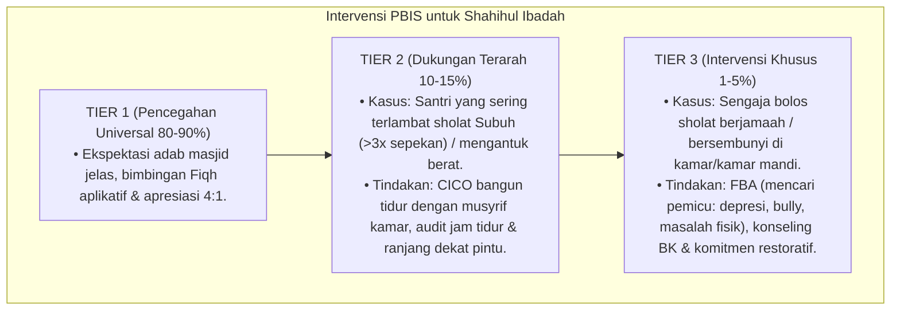

# P3-05-10-Protokol-Intervensi-dan-Pembiasaan (Shahihul Ibadah)

## Tujuan
Menetapkan protokol pembiasaan harian ibadah (*Habituation SOP*) dan pemetaan intervensi bertingkat (*PBIS Multi-Tier Intervention*) untuk mengawal kedisiplinan dan keistiqamahan ibadah seluruh santri.

---

## 1. Protokol Pembiasaan Rutin Masjid & Asrama (Tier 1: Universal 100%)

1. **SOP Bangun Shubuh & Qiyamul Lail**:
   - Bel asrama berbunyi 45 menit sebelum adzan Shubuh. Musyrif berkeliling menyapa hangat tanpa memukul pintu/ranjang secara kasar.
2. **Kaidah 10 Menit Menuju Masjid (*The 10-Minute Call*)**:
   - Seluruh santri sudah berwudhu dan berjalan tertib menuju masjid 10 menit sebelum adzan berkumandang.
3. **Halaqah Tilawah 1 Juz Per Hari (*One Day One Juz*)**:
   - Terbagi dalam 2 sesi: 1/2 juz ba'da Shubuh dan 1/2 juz ba'da Maghrib/Isya.

---

## 2. Pemetaan Intervensi Khusus PBIS

---

## 3. Status Dokumen
* **Status**: 🌟 **A+ (Tervalidasi & Siap Diimplementasikan)**
* **Level**: Project 3 - `03 Capacity Framework / 05 Shahihul Ibadah / ./P3-05-14-Sintesis-dan-Validasi-Shahihul-Ibadah.md`**.
