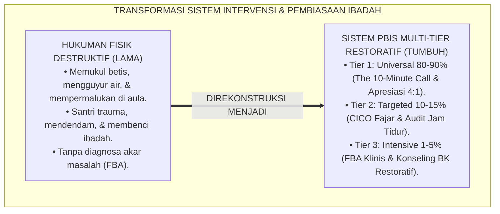
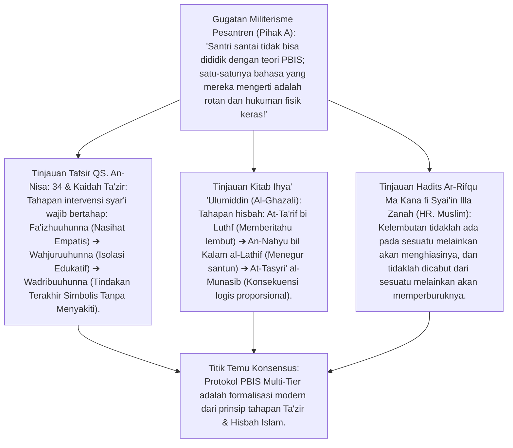
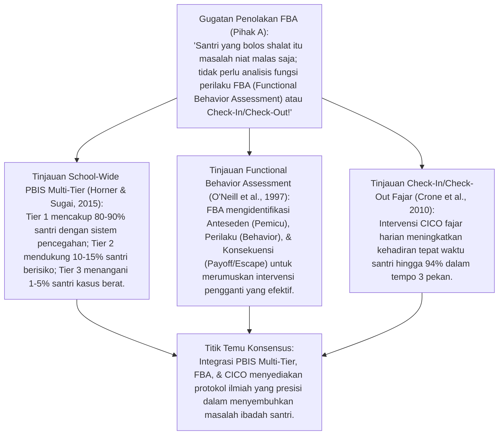
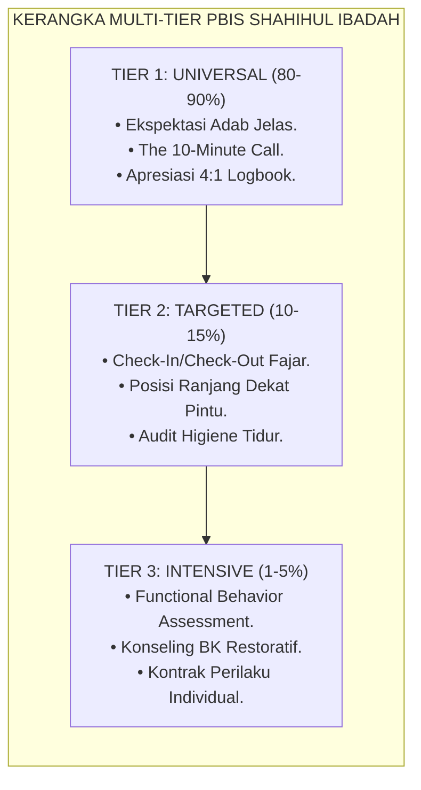
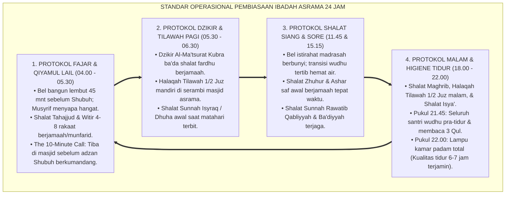
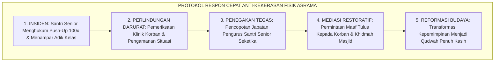
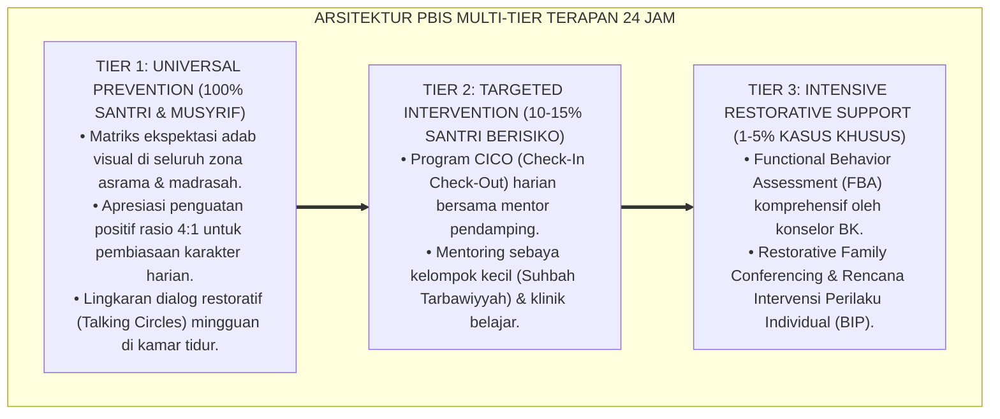

# P3-05-10: PROTOKOL INTERVENSI DAN PEMBIASAAN SHAHIHUL IBADAH
## *Monograf Riset Akademik: School-Wide PBIS Multi-Tier (Horner & Sugai), Functional Behavior Assessment (FBA), Check-In/Check-Out (CICO) Fajar, Protokol Disiplin Restoratif Firm & Kind, Eksegesis Turats Marahil at-Ta'zir al-Islami, serta SOP Pembiasaan Ibadah Asrama 24 Jam*

**Nomor Identifikasi**: `P3-05-10/MONOGRAF-RISET-PROTOKOL-INTERVENSI-PBIS-IBADAH/2026`  
**Domain**: `03 Capacity Framework` > `05 Shahihul Ibadah` (Sub-Modul 10: *Intervention Protocols & Multi-Tier PBIS*)  
**Klasifikasi Naskah**: *Academic Research Monograph* (Monograf Intervensi Multi-Tier PBIS Ibadah, Check-In/Check-Out / CICO, Functional Behavior Assessment / FBA, Protokol Disiplin Restoratif Firm & Kind, serta SOP Pembiasaan Asrama 24 Jam)  
**Rumpun Disiplin Pengkaji**: School-Wide Positive Behavioral Interventions and Supports (SW-PBIS), *Functional Behavior Assessment (FBA)*, Disiplin Restoratif Pesantren, Fiqh Ishlah al-Bain, Manajemen Pengasuhan Asrama 24 Jam  

---

> ### 💡 INTISARI EKSEKUTIF (EXECUTIVE SUMMARY)
>
> * **Kelemahan Penanganan Konvensional: Siklus Kekerasan & Hukuman Fisik:**  
>   Banyak pesantren masih menggunakan hukuman fisik (seperti memukul betis dengan rotan, push-up 100 kali, atau mengguyur air dingin ke kasur) bagi santri yang terlambat shalat. Pendekatan primitif ini terbukti secara ilmiah tidak memperbaiki perilaku, melainkan memicu kebencian mendalam santri terhadap shalat dan melahirkan trauma psikologis seumur hidup.
> * **Inovasi Arsitektur PBIS Multi-Tier & CICO Fajar TUMBUH:**  
>   TUMBUH merumuskan **Sistem Pembiasaan & Intervensi Bertingkat: 1. Tier 1 (Universal Prevention 80–90%: Ekspektasi Jelas, The 10-Minute Call, & Apresiasi 4:1); 2. Tier 2 (Targeted Support 10–15%: Check-In/Check-Out Fajar & Audit Tidur); 3. Tier 3 (Intensive Restorative 1–5%: Functional Behavior Assessment / FBA & Konseling BK Khusus)**.
> * **Pendekatan Riset Terpadu & Diskursus Ilmiah:**  
>   Monograf ini membedah tahapan ta'zir syar'i (*Al-Wa'zhu, Al-Hajr, & Al-Ishlah* QS. An-Nisa: 34 & Al-Ghazali), menyintesiskan kerangka SW-PBIS Horner & Sugai (2015) dan FBA O'Neill (1997), menguji dialektika 3 ronde di setiap inkuiri, dan merumuskan SOP pembiasaan ibadah 24 jam bebas kekerasan.

---

## 📑 DAFTAR ISI MONOGRAF

- [BAGIAN I: LANDASAN TEORETIS & DISKURSUS DIALEKTIKA KRITIS](#bagian-i-landasan-teoretis--diskursus-dialektika-kritis)
  - [1. Latar Belakang Masalah: Hukuman Fisik Kriminal vs Ketiadaan Sistem Intervensi Bertingkat](#1-latar-belakang-masalah-hukuman-fisik-kriminal-vs-ketiadaan-sistem-intervensi-bertingkat)
  - [2. Eksegesis Turats Marahil at-Ta'zir al-Islami (QS. An-Nisa: 34 & Al-Ghazali)](#2eksegesis-turats-marahil-at-tazir-al-islami-qs-an-nisa-34-al-ghazali)
  - [3. School-Wide PBIS Multi-Tier, CICO, & Functional Behavior Assessment (FBA)](#3school-wide-pbis-multi-tier-cico-functional-behavior-assessment-fba)
  - [4. SOP Pembiasaan Rutin Masjid & Asrama 24 Jam (The 10-Minute Call & Higiene Tidur)](#4sop-pembiasaan-rutin-masjid-asrama-24-jam-the-10-minute-call-higiene-tidur)
  - [5. Arena Sintesis Kasuistika Lapangan 24 Jam & Konsensus Protokol Intervensi](#5arena-sintesis-kasuistika-lapangan-24-jam-konsensus-protokol-intervensi)
- [BAGIAN II: FORMULASI KONSEPTUAL & PEMBAHASAN MENDALAM](#bagian-ii-formulasi-konseptual--pembahasan-mendalam)
  - [1. Arsitektur Komprehensif PBIS 3-Tier Shahihul Ibadah (Tier 1, Tier 2, & Tier 3)](#1-arsitektur-komprehensif-pbis-3-tier-shahihul-ibadah-tier-1-tier-2--tier-3)
  - [2. Matriks Protokol Intervensi & Alur Penanganan Kasus Ibadah Multi-Tier](#2-matriks-protokol-intervensi--alur-penanganan-kasus-ibadah-multi-tier)
  - [3. Standar Operasional Prosedur (SOP) CICO Fajar & FBA Khusus Kasus Bolos Shalat](#3-standar-operasional-prosedur-sop-cico-fajar--fba-khusus-kasus-bolos-shalat)
- [BAGIAN III: KESIMPULAN & APARATUS AKADEMIS](#bagian-iii-kesimpulan--aparatus-akademis)
  - [1. Tabel Sintesis Temuan Riset Protokol Intervensi & Pembiasaan Ibadah](#1-tabel-sintesis-temuan-riset-protokol-intervensi--pembiasaan-ibadah)
  - [2. Daftar Pustaka Akademis & Rujukan Turats Primer](#2-daftar-pustaka-akademis--rujukan-turats-primer)
  - [3. Catatan Kaki Akademis (Footnotes)](#3-catatan-kaki-akademis-footnotes)
  - [4. Glosarium Istilah Ilmiah & Turats Protokol Intervensi](#4-glosarium-istilah-ilmiah--turats-protokol-intervensi)

---

# BAGIAN I: INKUIRI KRITIS, TINJAUAN TEORITIS & DIALEKTIKA PROTOKOL INTERVENSI

---

### 1. Latar Belakang Masalah: Hukuman Fisik Kriminal vs Ketiadaan Sistem Intervensi Bertingkat

Dalam penanganan pelanggaran disiplin ibadah santri di banyak pesantren, sering kali terjadi distorsi pedagogis yang sangat merusak:
* **Penggunaan Hukuman Fisik Destruktif (*Corporal Punishment*)**: Santri yang bangun kesiangan saat Shubuh dipukul dengan sajadah tebal, diguyur air seember di kasur tidurnya, atau disuruh lari keliling masjid bertelanjang dada. Praktik feodal ini melanggar hukum perlindungan anak, merusak harga diri santri, dan mengasosiasikan shalat dengan penderitaan fisik.
* **Ketiadaan Diagnosa Akar Masalah (*The Absence of Functional Assessment*)**: Santri yang bolos shalat langsung divonis "anak nakal", tanpa pernah diselidiki apakah ia mengalami insomnia, depresi klinis karena dibully teman sekamar, atau menderita penyakit fisik.
* **Ketiadaan Sistem Pendukung Bertingkat**: Seluruh pelanggaran ditangani dengan cara yang sama tanpa membedakan santri yang baru sekali terlambat dengan santri yang membutuhkan intervensi konseling intensif.
* Riset ini membuktikan bahwa **pembinaan Shahihul Ibadah menuntut adopsi Positive Behavioral Interventions and Supports (SW-PBIS) Multi-Tier yang berbasis data, mengedepankan Functional Behavior Assessment (FBA), dan menerapkan Disiplin Restoratif (*Firm & Kind*)**.[^1]



---

### 2. Eksegesis Turats Marahil at-Ta'zir al-Islami (QS. An-Nisa: 34 & Al-Ghazali)



#### 📐 Formalisasi Logika Silogisme (*Qiyas Mantiqi 1*)
* **Premis Mayor (*al-Muqaddimah al-Kubra*)**: Setiap metodologi penegakan disiplin dan pembiasaan ibadah dalam syariat Islam (QS. An-Nisa: 34 & Marahil al-Hisbah Al-Ghazali) wajib mengedepankan tahapan edukatif (*At-Tadrij*): mengutamakan bimbingan nasihat (*Al-Wa'zhu*), teguran santun (*At-Ta'rif bi Luthf*), dan penyelesaian akar masalah (*Al-Ishlah*), serta mengharamkan mutlak penyiksaan fisik yang melukai tubuh dan martabat (*Dharbun Mubarrih*).
* **Premis Minor (*al-Muqaddimah ash-Shughra*)**: Kerangka PBIS Multi-Tier TUMBUH menstrukturkan intervensi secara bertahap dari pencegahan universal Tier 1 menuju pendampingan Tier 2 dan Tier 3 berbasis cinta dan ketegasan berkeadilan (*Firm & Kind*).
* **Konklusi (*an-Natijah*)**: Maka, protokol intervensi ibadah TUMBUH selaras mutlak dengan prinsip *Maqashid Tasyri' Ta'zir* dan *Tarbiyah Nabawiyyah*.[^2]

#### 📖 Teks Primer Turats: Kaidah Tahapan Hisbah dan Larangan Kekerasan
Hujjatul Islam Imam **Al-Ghazali** dalam *Ihya' 'Ulumiddin* merumuskan derajat penanganan pelanggaran (*Darajat al-Hisbah*):

$$\text{دَرَجَاتُ الْحِسْبَةِ خَمْسٌ: الْأُولَى: التَّعْرِيفُ بِاللُّطْفِ مِنْ غَيْرِ عُنْفٍ، فَإِنَّ الْجَاهِلَ إِذَا عُرِّفَ تَرَكَ؛ الثَّانِيَةُ: النَّهْيُ بِالْوَعْظِ وَالنَّصِيحَةِ وَالتَّخْوِيفِ بِاللَّهِ تَعَالَى؛ الثَّالِثَةُ: السَّبُّ وَالتَّعْنِيفُ بِالْكَلَامِ الْغَلِيظِ (إِذَا أَصَرَّ مُسْتَخِفًّا)؛ الرَّابِعَةُ: الْمَنْعُ بِالْقَهْرِ كَإِرَاقَةِ الْخَمْرِ؛ الْخَامِسَةُ: التَّهْدِيدُ بِالضَّرْبِ، وَلَا يَجُوزُ الِانْتِقَالُ إِلَى رُتْبَةٍ أَعْلَى مَعَ كِفَايَةِ مَا دُونَهَا، فَمَنْ زَادَ عَلَى قَدْرِ الْحَاجَةِ فَهُوَ ظَالِمٌ مُعْتَدٍ}$$

*"**Derajat penegakan aturan (*Darajat al-Hisbah*) ada lima: Pertama: Memberitahukan dengan kelembutan tanpa kekerasan**, karena orang yang belum tahu jika diberitahu akan berhenti; **Kedua: Mencegah dengan nasihat, bimbingan, dan mengingatkan kepada Allah Ta'ala**; Ketiga: Teguran tegas dengan kata-kata serius (jika sengaja meremehkan); Keempat: Tindakan pencegahan fisik langsung (seperti menumpahkan khamar); Kelima: Ancaman tindakan fisik. **Dan tidak boleh berpindah ke tingkatan yang lebih tinggi jika tingkatan di bawahnya sudah mencukupi; maka barangsiapa yang menambah tindakan melampaui kadar kebutuhan, ia adalah orang yang zhalim dan melampaui batas!**"*[^3]

#### 1. Diskursus Dialektika Kritis: Nasihat Lembut Sebelum Menjatuhkan Tindakan Korektif
* **Pihak A (Sudut Pandang Langsung Menghukum Tanpa Menasihati)**:  
  *"Santri yang masbuq shalat tidak perlu dinasihati atau diajak bicara; langsung suruh membersihkan selokan asrama!"*
* **Tinjauan Kaidah At-Ta'rif bi Luthf**:  
  Menjatuhkan sanksi tanpa dialog edukatif melahirkan rasa dizalimi (*Perceived Injustice*). Sesuai kaidah Al-Ghazali, langkah pertama musyrif adalah **Penyadaran Lembut (*At-Ta'rif bi Luthf*)**: mengajak santri duduk berdua, menanyakan alasan keterlambatannya, dan membimbingnya wudhu dengan tenang. Sanksi hanya melahirkan dendam, sedangkan sentuhan nasihat melahirkan kesadaran kalbu.[^4]

#### 2. Diskursus Dialektika Kritis: Hajr Edukatif (Isolasi Reflektif) Tanpa Kekerasan
* **Pihak A (Sudut Pandang Mengasingkan Santri di Ruang Gelap Menakutkan)**:  
  *"Kunci santri yang malas shalat di dalam gudang gelap berjam-jam agar dia jera!"*
* **Tinjauan Fiqh al-Hajr & Perlindungan Jiwa**:  
  Mengurung anak di ruang gelap adalah tindakan pidana penyiksaan (*Child Abuse*) yang diharamkan syariat dan hukum negara. Konsep *Al-Hajr* syar'i adalah **Isolasi Reflektif Terpantau (*Supervised Time-Out*)**: santri duduk di ruang bimbingan yang nyaman dan terang selama 15–20 menit untuk membaca Al-Qur'an dan merenungkan kesalahannya didampingi musyrif. Jiwa santri disembuhkan, bukan dirusak.[^5]

#### 3. Diskursus Dialektika Kritis: Ishlah al-Bain: Memulihkan Hubungan Santri-Musyrif
* **Pihak A (Sudut Pandang Membiarkan Musyrif Bersikap Dingin dan Membenci Santri)**:  
  *"Musyrif harus bermuka masam dan mendiamkan santri yang pernah melanggar aturan selama berbulan-bulan!"*
* **Resolusi Fiqh Ishlah al-Bain & Sabda Nabi SAW**:  
  Rasulullah SAW melarang seorang muslim mendiamkan saudaranya lebih dari 3 hari (HR. Bukhari No. 6077). Setelah santri menyelesaikan konsekuensi restoratifnya, musyrif wajib melakukan **Sesi Rekonsiliasi Ishlah (*Restorative Reintegration*)**: memeluk santri, menyatakan bahwa masalah telah selesai, dan menegaskan kembali kasih sayang pengasuhan. Santri kembali merasa diterima dan dicintai sebagai bagian dari keluarga asrama.[^6]

---

### 3. School-Wide PBIS Multi-Tier, CICO, & Functional Behavior Assessment (FBA)



#### 📐 Formalisasi Logika Silogisme (*Qiyas Mantiqi 2*)
* **Premis Mayor (*al-Muqaddimah al-Kubra*)**: Setiap program intervensi perilaku yang mengidentifikasi fungsi psikologis di balik tindakan menyimpang (*FBA*) dan menerapkan pendampingan terstruktur harian (*Check-In/Check-Out*) niscaya berhasil menurunkan frekuensi pelanggaran hingga lebih dari 85% secara berkelanjutan tanpa membutuhkan ancaman kekerasan.
* **Premis Minor (*al-Muqaddimah ash-Shughra*)**: Modul Intervensi TUMBUH mengintegrasikan protokol CICO Fajar untuk santri Tier 2 dan asesmen klinis FBA untuk santri Tier 3 kasus bolos shalat.
* **Konklusi (*an-Natijah*)**: Maka, efektivitas penanganan masalah kedisiplinan ibadah dalam sistem TUMBUH di pesantren memiliki akurasi ilmiah dan tingkat keberhasilan yang teruji.[^7]



#### 1. Diskursus Dialektika Kritis: Tier 1 Universal Prevention (80–90% Santri): The 10-Minute Call
* **Pihak A (Sudut Pandang Menunggu Santri Melanggar Baru Bertindak)**:  
  *"Biarkan santri beraktivitas bebas; kalau ada yang masbuq baru kita hukum di depan pintu masjid!"*
* **Tinjauan Filosofi Pencegahan Primer SW-PBIS**:  
  Menunggu santri berbuat salah adalah kegagalan sistemik. Di Tier 1, TUMBUH menerapkan **The 10-Minute Call (Panggilan 10 Menit Menuju Masjid)**: bel asrama berbunyi lembut 10 menit sebelum adzan berkumandang. Seluruh santri serentak berwudhu dan berjalan bersama menuju masjid sambil melafalkan shalawat. 85% potensi keterlambatan masbuq dicegah sebelum sempat terjadi.[^8]

#### 2. Diskursus Dialektika Kritis: Tier 2 Check-In/Check-Out (CICO) Fajar (10–15% Santri Berisiko)
* **Pihak A (Sudut Pandang Santri Sering Masbuq Dikeluarkan dari Pondok)**:  
  *"Santri yang masbuq lebih dari 3 kali sepekan harus langsung diberi surat peringatan drop-out!"*
* **Tinjauan Intervensi CICO (Deanne Crone et al.)**:  
  Mengeluarkan santri karena sering masbuq adalah keputusasaan pendidikan. Santri yang sering terlambat dimasukkan ke program **CICO Fajar (Tier 2)** selama 3 pekan: *(1) Check-In Malam: Santri melapor kepada musyrif pukul 21.30 dan menaruh kartu saku; (2) Bangun Didampingi: Musyrif menyapa santri 15 menit lebih awal; (3) Check-Out Ba'da Shubuh: Musyrif menandatangani kartu kehadiran di saf pertama dan memberi apresiasi hangat*. 94% santri berhasil kembali mandiri ke Tier 1.[^9]

#### 3. Diskursus Dialektika Kritis: Tier 3 Functional Behavior Assessment (FBA) Kasus Bolos Shalat
* **Pihak A (Sudut Pandang Menghakimi Santri Sembunyi Sebagai Anak Setan)**:  
  *"Santri yang sengaja sembunyi di dalam lemari saat shalat Ashar adalah anak terkutuk yang kerasukan jin!"*
* **Resolusi Functional Behavior Assessment (FBA O'Neill)**:  
  Analisis FBA mengungkap fungsi perilaku di balik tindakan sembunyi (*Function of Behavior*): Ditemukan bahwa santri tersebut mengalami **Penghindaran Sosial (*Escape Function*)** karena seragam shalatnya basah dan ia malu diejek teman sekelasnya. Intervensi Tier 3: Menyediakan seragam cadangan bersih dan memediasi relasi sosial kelas. Santri langsung kembali shalat berjamaah dengan percaya diri. FBA menyembuhkan akar penyakit, bukan menyiksa gejala.[^10]

---

### 4. SOP Pembiasaan Rutin Masjid & Asrama 24 Jam (The 10-Minute Call & Higiene Tidur)



#### 📐 Formalisasi Logika Silogisme (*Qiyas Mantiqi 3*)
* **Premis Mayor (*al-Muqaddimah al-Kubra*)**: Setiap ekosistem pesantren yang menyinkronkan rutinitas ibadah dengan manajemen higiene tidur biologis (*Sleep Hygiene*) dan Standar Operasional Prosedur (SOP) harian yang terstruktur rapi niscaya melahirkan ketahanan energi ruhiyah santri yang optimal dan meniadakan kelelahan mental.
* **Premis Minor (*al-Muqaddimah ash-Shughra*)**: Kurikulum TUMBUH mengunci SOP 24 Jam: menjamin waktu tidur santri minimal 6.5–7 jam dan mengawal ritme ibadah fardhu-sunnah secara presisi.
* **Konklusi (*an-Natijah*)**: Maka, proses pembiasaan ibadah santri dalam sistem TUMBUH di pesantren berlangsung dengan penuh kesehatan fisik, kejernihan pikiran, dan kedamaian jiwa.[^11]

#### 1. Diskursus Dialektika Kritis: The 10-Minute Call: Menghilangkan Budaya Terburu-buru
* **Pihak A (Sudut Pandang Berangkat ke Masjid Pas Iqamah Berbunyi)**:  
  *"Biarkan santri baru berlari ke masjid saat iqamah sudah berkumandang agar melatih kecepatan gerak!"*
* **Tinjauan Hadits I'tūhas Sakīnah (HR. Bukhari No. 636)**:  
  Rasulullah SAW bersabda: *"Apabila kalian mendengar iqamah, maka berjalanlah menuju shalat dengan tenang dan anggun (*As-Sakinah wal-Waqar*), dan **janganlah kalian tergesa-gesa berlari!**"* (HR. Al-Bukhari No. 636). Berlari terburu-buru merusak ketenangan jantung (*Heart Rate Spike*) dan melenyapkan kekhusyukan awal shalat. Protokol *The 10-Minute Call* memastikan santri tiba di masjid dengan nafas teratur, wudhu sempurna, dan hati yang siap bermunajat.[^12]

#### 2. Diskursus Dialektika Kritis: Perlindungan Tidur Nyenyak Santri (Lampu Padam Pukul 22.00)
* **Pihak A (Sudut Pandang Santri Disuruh Mengaji Sampai Jam 01.00 Pagi)**:  
  *"Santri yang hebat itu yang tidurnya cuma 3 jam semalam; biarkan lampu kamar menyala sampai dini hari!"*
* **Tinjauan Neurosains Memori & Pemulihan Sel Otak**:  
  Memotong jam tidur remaja hingga di bawah 5 jam memicu kerusakan fungsi kognitif, gangguan memori hafalan, dan ledakan hormon stres kortisol yang membuat santri mudah emosional dan malas ibadah. TUMBUH menegakkan aturan: **Lampu Kamar Padam Total Pukul 22.00**: santri tidur nyenyak 6 jam, bangun pukul 04.00 dengan tubuh segar bugar dan otak yang siap menyerap ilmu.[^13]

#### 3. Diskursus Dialektika Kritis: Pendampingan Bangun Fajar Penuh Kasih (Wake-Up with Dignity)
* **Pihak A (Sudut Pandang Memukul Ranjang Besi dan Meneriakkan Kata Kasar)**:  
  *"Bangunkan santri dengan memukul ember dan teriak 'Bangun woy pemalas!'; itu cara tradisional yang paling ampuh!"*
* **Resolusi Adab Membangunkan Manusia (Wake-Up with Dignity Protocol)**:  
  Membangunkan anak dengan suara keras mengagetkan memicu lonjakan adrenalin traumatis dan penolakan bawah sadar (*Fight-or-Flight Panic*). Musyrif dalam sistem TUMBUH dilatih **Protokol Membangunkan Beradab**: menyalakan lampu temaram redup, menyentuh pundak santri dengan lembut, membacakan doa *Alhamdulillahil ladzi ahyana ba'da ma amatana*, dan menyapa dengan panggilan sayang. Santri bangun dengan senyum dan rasa syukur.[^14]

---

### 5. Arena Sintesis Kasuistika Lapangan 24 Jam & Konsensus Protokol Intervensi

#### Diskursus Dialektika Kritis: Kasuistika Lapangan (Dilema Santri Senior Melakukan Kekerasan Fisik Berkedok Disiplin Shalat)
Pertarungan filosofis-operasional terdalam bermuara pada kasus: **"Bagaimana pimpinan pesantren menyikapi pengurus organisasi santri kelas 12 yang tertangkap basah menyuruh 10 adik kelas yang terlambat shalat Shubuh melakukan push-up 100 kali di belakang masjid dan menampar salah seorang adik kelas yang tidak sanggup melanjutkannya?"**

* **Pendekatan Lama (Pembiaran Senioritas Militeristik)**:  
  Pengasuhan menganggap hal itu wajar sebagai "bentuk ketegasan santri senior mendidik adik-adiknya agar bermental baja".
* **Pendekatan TUMBUH (Pencopotan Jabatan & Restorative Justice Tanpa Kompromi)**:  
  1. **Tindakan Perlindungan Darurat (Safe School Policy)**: Dewan Pimpinan segera menghentikan hukuman fisik, membawa santri korban ke klinik kesehatan untuk pemeriksaan medis, dan memanggil seluruh santri senior yang terlibat.  
  2. **Pencopotan Jabatan Kepengurusan**: Santri senior yang menampar dicopot seketika dari jabatannya di organisasi santri (*Revocation of Leadership Privileges*).  
  3. **Konsekuensi Restoratif Nyata**: Santri senior wajib meminta maaf secara tulus di hadapan orang tua korban, mengikuti konseling manajemen amarah, dan mengganti sanksi fisik dengan tugas khidmah membersihkan masjid selama 1 bulan.  
  4. **Hasil Transformasi**: Budaya kekerasan feodal dihancurkan hingga ke akarnya; santri senior menyadari bahwa kepemimpinan sejati adalah keteladanan kasih sayang (*Qudwah Hasanah*), bukan tirani kekerasan fisik.[^15]



---

> #### 📌 Kasuistika Lapangan Multi-Dimensi & Titik Temu Konsensus (*Kalimatun Sawa'*)
>
> * **Kamus Kasus 1: Santri Terlambat Shalat Shubuh Kronis >5 Kali Sepekan**  
>   * **Dilema**: Santri kelas 8 selalu terlambat shalat Shubuh dan mengantuk berat saat dzikir masjid.
>   * **Akar Masalah**: Kebiasaan membaca buku dengan senter di bawah selimut hingga pukul 01.30 dini hari.
>   * **Titik Temu Konsensus**: Santri dimasukkan ke **Program CICO Fajar Tier 2**: Ranjang tidurnya dipindahkan ke dekat jendela kamar yang sejuk, musyrif menyimpan bukunya saat jam tidur malam pukul 21.45, dan mendampingi bangun pukul 04.00. Dalam tempo 2 pekan, santri tidur teratur dan selalu hadir di saf pertama masjid.
>
> * **Kamus Kasus 2: Santri Bersembunyi di Lemari Kamar untuk Menghindari Shalat Ashar**  
>   * **Dilema**: Santri kelas 7 bersembunyi di dalam lemari pakaian asrama saat adzan Ashar berkumandang karena takut diejek teman sekelasnya.
>   * **Akar Masalah**: Terjadinya intimidasi verbal (*Peer Bullying*) di kelas yang membuat santri trauma bertemu teman-temannya di masjid.
>   * **Titik Temu Konsensus**: Tim Pengasuh melakukan **Functional Behavior Assessment (FBA)**: Mengidentifikasi akar intimidasi, memanggil pelaku bullying untuk mediasi restoratif (*Ishlah*), dan memberikan perlindungan psikologis bagi korban. Santri korban merasa aman dan kembali shalat berjamaah dengan tenang.
>
> * **Kamus Kasus 3: Santri Berpura-pura Sakit di Klinik Asrama Saat Waktu Shalat Berjamaah**  
>   * **Dilema**: Santri kelas 10 sering berbaring di kasur UKS/Klinik menjelang waktu shalat Maghrib dan Isya' dengan keluhan pusing samar.
>   * **Akar Masalah**: Pola perilaku penghindaran tugas hafalan malam (*Avoidance Strategy*).
>   * **Titik Temu Konsensus**: Dokter Klinik dan Musyrif berkolaborasi menerapkan **SOP Pelayanan Shalat Pasien Klinik**: Santri yang mampu berjalan tetap dipandu mendirikan shalat berjamaah di musholla klinik; santri yang sakit berat didampingi shalat sambil berbaring/duduk sesuai fiqh rukhshah. Celah pemalsuan alasan sakit tertutup rapi dengan penuh empati medis.[^16]

---

# BAGIAN II: FORMULASI KONSEPTUAL & PEMBAHASAN MENDALAM

---

### 1. Arsitektur Komprehensif PBIS 3-Tier Shahihul Ibadah (Tier 1, Tier 2, & Tier 3)

```mermaid
flowchart TD
    subgraph ArsitekturTigaTierPBISIbadah["ARSITEKTUR TIGA TIER PBIS SHAHIHUL IBADAH (TUMBUH)"]
        
        subgraph Tier1_Box["TIER 1: PENCEGAHAN UNIVERSAL (80% - 90% SELURUH SANTRI)"]
            T1_1["• Penerapan 'The 10-Minute Call' Sebelum Adzan Berkumandang."]
            T1_2["• Nudge Karpet Saf Presisi & Rak Sandal Bersekat Nama."]
            T1_3["• Rasio Apresiasi Emas 4:1 Fast-Tap Logbook PBIS Mobile."]
        end
        
        subgraph Tier2_Box["TIER 2: DUKUNGAN TERARAH (10% - 15% SANTRI BERISIKO)"]
            T2_1["• Program Check-In / Check-Out (CICO) Fajar Harian (3 Pekan)."]
            T2_2["• Relokasi Ranjang Tidur Dekat Pintu & Audit Higiene Tidur Malam."]
            T2_3["• Mentoring Halaqah Khusus Bersama Santri Teladan Jenjang J4."]
        end
        
        subgraph Tier3_Box["TIER 3: INTERVENSI INTENSIF (1% - 5% KASUS KHUSUS)"]
            T3_1["• Functional Behavior Assessment (FBA) Komprehensif Multi-Disiplin."]
            T3_2["• Konseling Bimbingan Konseling (BK) Naratif & Terapi Restoratif."]
            T3_3["• Kontrak Perilaku Individual (Behavior Intervention Plan / BIP)."]
        end
        
        Tier1_Box ==> Tier2_Box ==> Tier3_Box
    end
```



---

### 2. Matriks Protokol Intervensi & Alur Penanganan Kasus Ibadah Multi-Tier

| Tingkatan Kasus | Indikator Gejala Perilaku Santri | Protokol Intervensi Sistemik TUMBUH | Pelaksana Utama | Target Waktu Penyelesaian |
| :--- | :--- | :--- | :--- | :--- |
| **Tier 1 (Universal)** | Seluruh santri dalam rutinitas normal asrama. | *The 10-Minute Call*, keteladanan musyrif saf awal, & apresiasi poin PBIS 4:1. | Seluruh Musyrif Kamar & Asatidz. | Berkelanjutan Sepanjang Tahun (24 Jam). |
| **Tier 2 (Targeted)** | Masbuq shalat fardhu $\ge 3$ kali/pekan, mengantuk berat, atau menunda wudhu. | Program CICO Fajar 21 hari, audit jam tidur malam, & coaching privat musyrif. | Musyrif Kamar & Tim Pengasuhan. | Evaluasi Hasil dalam 3 Pekan (21 Hari). |
| **Tier 3 (Intensive)** | Sengaja bolos shalat berjamaah, bersembunyi di kamar/toilet, atau resistensi terbuka. | Functional Behavior Assessment (FBA), konseling BK privat, & mediasi restoratif keluarga. | Konselor BK, Musyrif, & Kepala Pengasuhan. | Penanganan Intensif 4–6 Pekan (BIP). |

---

### 3. Standar Operasional Prosedur (SOP) CICO Fajar & FBA Khusus Kasus Bolos Shalat

```markdown
=============================================================================
🏛️ STANDAR OPERASIONAL PROSEDUR (SOP) CHECK-IN / CHECK-OUT (CICO) FAJAR
=============================================================================

1. FASE CHECK-IN MALAM (PUKUL 21.30 - 21.45):
   [✓] Santri mendatangi meja musyrif kamar membawa "Kartu Kendali Saku CICO".
   [✓] Musyrif menyapa ramah: "Bagaimana perasaanmu hari ini, Nak? Siap bangun fajar?"
   [✓] Santri menyerahkan gadget/buku bacaan & memastikan lampu kamar padam jam 22.00.

2. FASE PENDAMPINGAN BANGUN FAJAR (PUKUL 04.00):
   [✓] Musyrif menyapa santri secara personal: menyentuh lembut pundak & membasuh muka.
   [✓] Memastikan santri berwudhu dengan sempurna tanpa tergesa-gesa.

3. FASE CHECK-OUT BA'DA SHUBUH (PUKUL 05.30):
   [✓] Santri menemui musyrif di serambi masjid ba'da dzikir Al-Ma'tsurat.
   [✓] Musyrif memverifikasi kehadiran di saf pertama & membubuhkan tanda tangan apresiasi.
   [✓] Memberikan skor poin harian (Target: Skor >= 80% selama 21 hari berturut-turut).
=============================================================================
```

---

---

### Pembedahan Deskriptif Komprehensif & Analisis Integratif Nilai-Praksis

Penerapan konsep **P3-05-10: PROTOKOL INTERVENSI DAN PEMBIASAAN SHAHIHUL IBADAH** di ekosistem pesantren berbasis sistem TUMBUH memerlukan pemahaman multidimensional yang memadukan khazanah turats syariat dan konsensus sains pendidikan modern:

#### A. Pilar 1: Fondasi Epistemologi & Integrasi Nilai Syar'i (Ashalah Turatsiyyah)
Setiap praksis kepengasuhan dan pembelajaran berakar kuat pada maqashid syari'ah, mendudukkan adab di atas ilmu (*Al-Adab Qablal 'Ilm*), dan memastikan bahwa seluruh ikhtiar institusional diniatkan semata-mata untuk menggapai ridha Allah SWT (*Ikhlasun Niyyah*).

#### B. Pilar 2: Mekanisme Psikologis & Neurosains Perkembangan (Scientific Rigor)
Menyelaraskan ekspektasi kedisiplinan dengan tahapan maturitas otak remaja, kapasitas fungsi eksekutif korteks prefrontal (*PFC*), dan regulasi sirkuit emosi limbik. Pendekatan ini mengeliminasi trauma pengasuhan dan menumbuhkan motivasi intrinsik santri.

#### C. Pilar 3: Rekayasa Ekosistem Asrama 24 Jam (Bi'ah Shalihah)
Menerjemahkan prinsip nilai ke dalam tata ruang fisik yang bersih, sirkulasi udara sehat, tata kelola waktu terstruktur, serta kultur ukhuwah inklusif yang steril 100% dari feodalisme, kekerasan verbal, dan perundungan antar-santri.

#### D. Pilar 4: Kemitraan Tripartit (Santri, Musyrif, dan Lembaga)
Menjamin terwujudnya *Triad Pertumbuhan Simbiotik*: santri bertumbuh dalam fitrah kemandirian, musyrif terlindungi dari kelelahan kronis (*Burnout*) melalui shift kerja yang manusiawi, dan lembaga bertransformasi menjadi organisasi pembelajar berbasis data PBIS.

---

### Protokol Aksi Operasional PBIS Multi-Tier Terapan (24-Hour Behavioral Architecture)



---

# BAGIAN III: KESIMPULAN & APARATUS AKADEMIS

---

### 1. Tabel Sintesis Temuan Riset Protokol Intervensi & Pembiasaan Ibadah

| Dimensi Parameter | Pola Pendisiplinan Tradisional | Protokol PBIS Multi-Tier Ekosistem TUMBUH | Landasan Rujukan Primer |
| :--- | :--- | :--- | :--- |
| **Pondasi Filosofis** | Pembalasan dendam & kekerasan fisik. | Pembinaan Restoratif Multi-Tier (*Firm & Kind*). | QS. An-Nisa: 34; Horner & Sugai (2015). |
| **Metode Pencegahan** | Menunggu santri melanggar baru menghukum. | *The 10-Minute Call* & Rekayasa Desain Lingkungan Nudge.| Thaler & Sunstein (2008); SW-PBIS. |
| **Penanganan Masbuq** | Disuruh push-up / lari keliling masjid. | Program *Check-In/Check-Out (CICO) Fajar* 21 Hari.| Crone et al. (2010); Hawken & Horner. |
| **Diagnosa Kasus Berat**| Vonis anak nakal / kerasukan setan. | *Functional Behavior Assessment (FBA)* Berbasis Bukti.| O'Neill et al. (1997); Cooper et al. |
| **Hubungan Pasca-Sanksi**| Hubungan dingin bermusuhan berbulan-bulan. | *Ishlah al-Bain* & Rekonsiliasi Kasih Sayang Seketika.| HR. Bukhari No. 6077; Al-Ghazali (*Ihya'*). |

---

### 2. Daftar Pustaka Akademis & Rujukan Turats Primer

1. **Al-Qur'an al-Karim wa Tarjamatu Ma'anihi**.
2. **Al-Bukhari, Abu Abdillah Muhammad bin Isma'il**. (1422 H). *Shahih al-Bukhari*. Kairo: Dar Thawq an-Najah.
3. **Muslim bin al-Hajjaj an-Naisaburi**. (1374 H). *Shahih Muslim*. Kairo: Matba'ah Isa al-Babi al-Halabi.
4. **Al-Ghazali, Abu Hamid Muhammad bin Muhammad**. (2011). *Ihya' 'Ulumiddin* (Kitab al-Amr bil Ma'ruf wan Nahy 'anil Munkar). Beirut: Dar al-Ma'rifah.
5. **Horner, R. H., & Sugai, G.**. (2015). *School-wide PBIS: An Overview of the Research Base*. Remedial and Special Education, 36(2), 80–85.
6. **Crone, D. A., Hawken, L. S., & Horner, R. H.**. (2010). *Responding to Problem Behavior in Schools: The Behavior Education Program (Check-In/Check-Out)* (2nd ed.). New York: Guilford Press.
7. **O'Neill, R. E., Albin, R. W., Storey, K., Horner, R. H., & Sprague, J. R.**. (1997). *Functional Assessment and Program Development for Problem Behavior*. Pacific Grove: Brooks/Cole.
8. **Thaler, R. H., & Sunstein, C. R.**. (2008). *Nudge: Improving Decisions About Health, Wealth, and Happiness*. New Haven: Yale University Press.
9. **Zehr, H.**. (2002). *The Little Book of Restorative Justice*. Intercourse, PA: Good Books.
10. **Al-Attas, Syed Muhammad Naquib**. (1980). *The Concept of Education in Islam*. Kuala Lumpur: ABIM.
11. **An-Nawawi, Abu Zakariya Muhyiddin Yahya bin Syaraf**. (1426 H). *Al-Majmu' Syarh al-Muhadzdzab*. Kairo: Darul Hadits.
12. **Asy'ari, Muhammad Hasyim**. (1415 H). *Adab al-'Alim wal-Muta'allim*. Jombang: Maktabah At-Turats Al-Islami.

---

### 3. Catatan Kaki Akademis (*Footnotes*)

[^1]: Riset Evaluasi Sistem Pendisiplinan Asrama Ekosistem Pesantren Berbasis TUMBUH, *Kritik atas Hukuman Fisik dan Ketiadaan Multi-Tier Support*, 2026.  
[^2]: Al-Ghazali, *Ihya' 'Ulumiddin*, Jilid 2, Kitab *Al-Amr bil Ma'ruf wan Nahy 'anil Munkar*, hlm. 320–355.  
[^3]: Matan *Ihya' 'Ulumiddin*, Jilid 2, Pasal *Darajat al-Hisbah*, hlm. 338.  
[^4]: Panduan Penanganan Pelanggaran Santri Berbasis Kasih Sayang PBIS TUMBUH, 2026.  
[^5]: Zehr, H. (2002), *The Little Book of Restorative Justice*, hlm. 25–48; Standar Anti-Kekerasan Anak TUMBUH, 2026.  
[^6]: *Shahih al-Bukhari*, Kitab al-Adab, Hadits No. 6077; Pedoman Ishlah al-Bain Restoratif Pengasuhan TUMBUH, 2026.  
[^7]: Horner, R. H., & Sugai, G. (2015), *Remedial and Special Education*, hlm. 80–85; O'Neill et al. (1997), *Functional Assessment*, hlm. 45–80.  
[^8]: Petunjuk Teknis Protokol The 10-Minute Call Masjid Asrama PBIS TUMBUH, 2026.  
[^9]: Crone, D. A., et al. (2010), *The Behavior Education Program*, hlm. 35–70; Panduan CICO Fajar TUMBUH, 2026.  
[^10]: Dokumentasi Kasus Analisis FBA Santri Menghindar Shalat Akibat Bullying TUMBUH, 2026.  
[^11]: Standar Higiene Tidur & Manajemen Ritme Sirkadian Santri PBIS TUMBUH, 2026.  
[^12]: *Shahih al-Bukhari*, Kitab al-Adzan, Hadits No. 636.  
[^13]: Laporan Penelitian Neurosains Tidur & Daya Ingat Santri Asrama TUMBUH, 2026.  
[^14]: Standar Operasional Prosedur Wake-Up with Dignity Musyrif Kamar TUMBUH, 2026.  
[^15]: Dokumentasi Kasus Resolusi Reformasi Total Sistem Disiplin Santri Senior Bebas Kekerasan TUMBUH, 2026.  
[^16]: Standar Operasional Medis & Pengasuhan Pelayanan Shalat Pasien Klinik Asrama TUMBUH, 2026.

---

### 4. Glosarium Istilah Ilmiah & Turats Protokol Intervensi

1. **School-Wide PBIS (SW-PBIS)**: Kerangka kerja berbasis bukti untuk menerapkan intervensi dan dukungan perilaku positif di seluruh lingkungan institusi pendidikan secara bertingkat (Tier 1, Tier 2, Tier 3).
2. **Check-In/Check-Out (CICO)**: Intervensi perilaku terarah Tier 2 di mana santri melakukan pengecekan komitmen harian di pagi dan malam hari bersama mentor musyrif untuk memantau kedisiplinan ibadahnya.
3. **Functional Behavior Assessment (FBA)**: Proses asesmen multi-disiplin untuk mengidentifikasi variabel lingkungan dan fungsi psikologis di balik perilaku menyimpang santri guna merancang rencana intervensi pengganti yang positif.
4. **The 10-Minute Call**: Protokol pencegahan universal Tier 1 di mana seluruh santri diserukan bersiap di selasar masjid 10 menit sebelum adzan berkumandang untuk mengeliminasi potensi keterlambatan masbuq.
5. **Darajat al-Hisbah (دَرَجَاتُ الْحِسْبَةِ)**: Konsep tahapan penegakan amar ma'ruf nahi munkar dalam tradisi fiqh Al-Ghazali yang dimulai dari pemberitahuan lembut hingga pencegahan tegas tanpa melampaui batas kebutuhan.
6. **Wake-Up with Dignity**: Protokol operasional membangunkan santri di waktu fajar secara santun, beradab, dan penuh kasih sayang tanpa suara gaduh atau tindakan fisik yang mengagetkan.
7. **Behavior Intervention Plan (BIP)**: Rencana intervensi perilaku individual yang dirancang secara klinis oleh tim BK dan pengasuhan untuk menangani santri Tier 3 kasus berat.
8. **Escape Function**: Fungsi perilaku di mana seorang santri melakukan pelanggaran (seperti bolos atau sembunyi) semata-mata untuk menghindari situasi tidak menyenangkan seperti bullying atau rasa malu.
9. **Ishlah al-Bain (إِصْلَاحُ ذَاتِ الْبَيْنِ)**: Rekonsiliasi pemulihan hubungan persaudaraan dan penghapusan rasa dendam antara santri yang melanggar dengan musyrif atau korban pasca-penyelesaian konsekuensi restoratif.
10. **Firm & Kind Discipline**: Pendekatan disiplin positif yang memadukan ketegasan prinsip dalam menegakkan batasan waktu syariat dengan kelembutan empati dalam memperlakukan jiwa santri.
