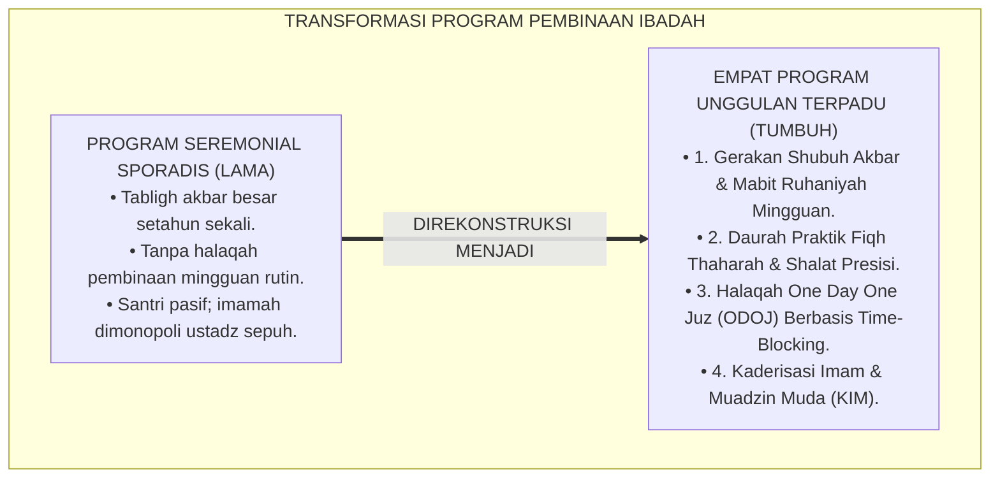
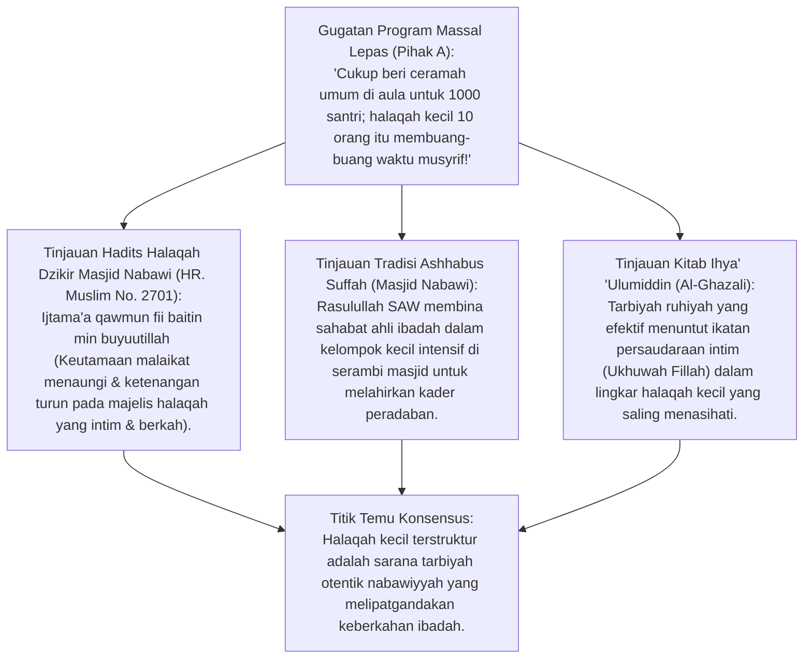
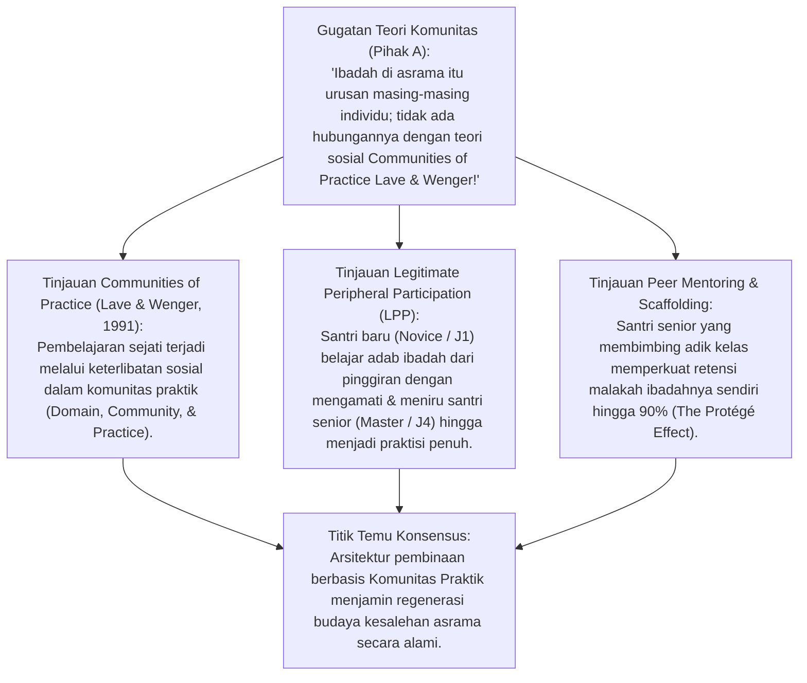
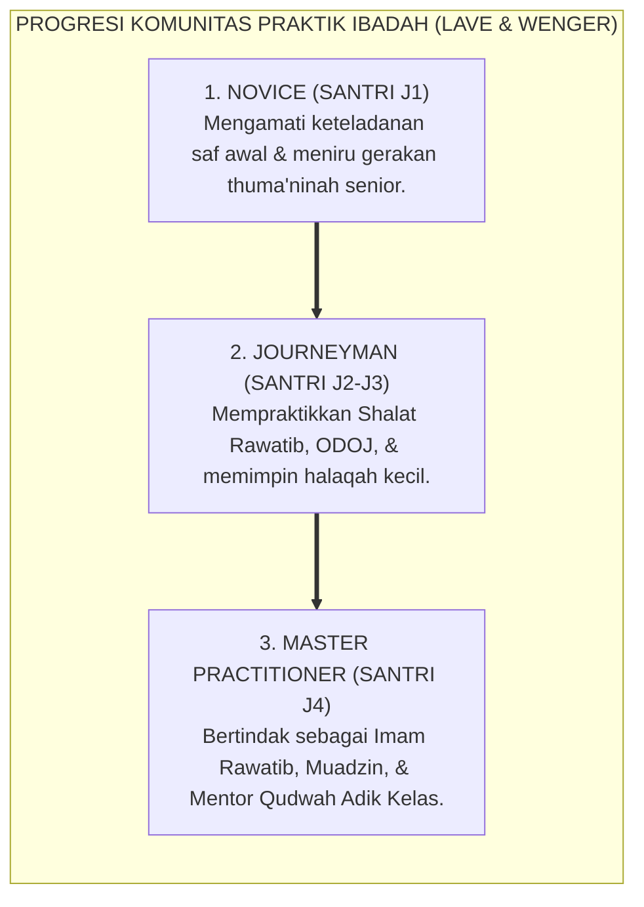
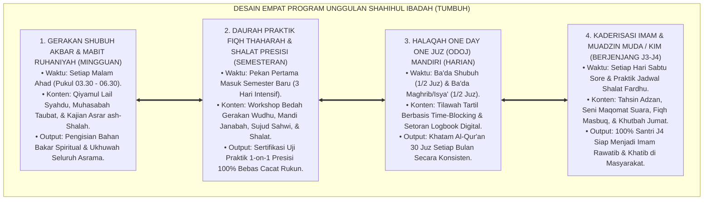
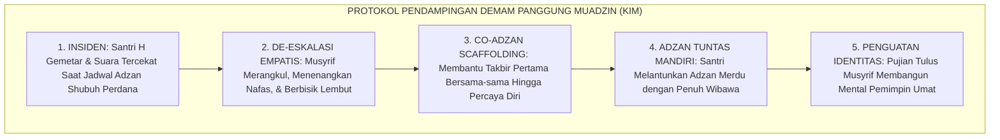
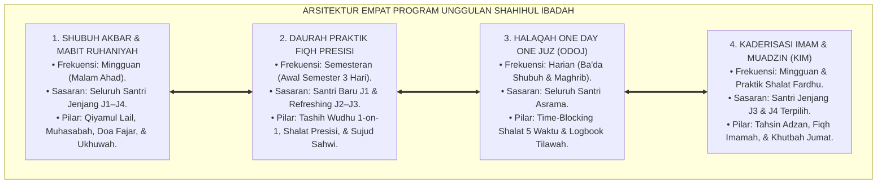
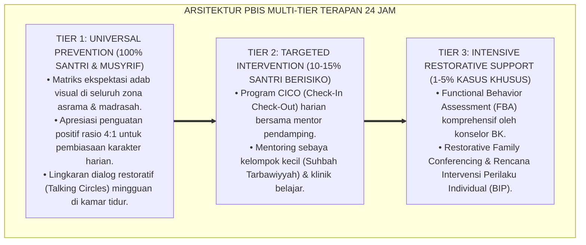

# P3-05-11: PROGRAM PEMBINAAN DAN HALAQAH SHAHIHUL IBADAH
## *Monograf Riset Akademik: Teori Komunitas Praktik (Communities of Practice Lave & Wenger), Metodologi Halaqah Tarbawiyyah As-Suffah, Empat Program Unggulan Ibadah Pesantren, Kaderisasi Imam & Muadzin Muda (KIM), serta Manajemen Ekosistem Ibadah 24 Jam*

**Nomor Identifikasi**: `P3-05-11/MONOGRAF-RISET-PROGRAM-PEMBINAAN-HALAQAH-IBADAH/2026`  
**Domain**: `03 Capacity Framework` > `05 Shahihul Ibadah` (Sub-Modul 11: *Training Programs & Halaqah Structure*)  
**Klasifikasi Naskah**: *Academic Research Monograph* (Monograf 4 Program Unggulan Ibadah, Teori Komunitas Praktik Lave & Wenger, Halaqah Tarbawiyyah Al-Banna, serta Manajemen Ekosistem Ibadah di Pesantren 24 Jam)  
**Rumpun Disiplin Pengkaji**: Manajemen Program Pendidikan Islam, *Communities of Practice (Lave & Wenger)*, Metodologi Halaqah Tarbawiyyah, Fiqh Kaderisasi Imamah & Muadzin, Ekologi Pembinaan Asrama 24 Jam  

---

> ### 💡 INTISARI EKSEKUTIF (EXECUTIVE SUMMARY)
>
> * **Kelemahan Program Pembinaan Konvensional: Seremonial & Sporadis:**  
>   Banyak program ibadah di pesantren hanya bersifat insidental (misal: tabligh akbar setahun sekali atau hukuman massal saat ada santri bolos), tanpa memiliki struktur halaqah pembinaan mingguan yang berkesinambungan dan terintegrasi dengan tangga perkembangan santri.
> * **Inovasi Empat Program Unggulan & Halaqah Terstruktur TUMBUH:**  
>   TUMBUH merancang ekosistem pembinaan terpadu berbasis *Communities of Practice* (Lave & Wenger): **1. Gerakan Shubuh Akbar & Qiyamul Lail Terbimbing (Mabit Ruhaniyah Mingguan); 2. Daurah Fiqh Thaharah & Shalat Presisi (Workshop Klinis Awal Semester); 3. Halaqah One Day One Juz (ODOJ) Mandiri (Time-Blocking System); 4. Kaderisasi Imam & Muadzin Muda / KIM (Sertifikasi Kepemimpinan J3–J4)**.
> * **Pendekatan Riset Terpadu & Diskursus Ilmiah:**  
>   Monograf ini membedah tradisi *Ashhabus Suffah* di Masjid Nabawi dan halaqah sahabat (HR. Muslim No. 2701), menyintesiskan teori *Legitimate Peripheral Participation*, menguji dialektika 3 ronde di setiap inkuiri, dan merumuskan SOP kaderisasi imam dan muadzin muda.

---

## 📑 DAFTAR ISI MONOGRAF

- [BAGIAN I: LANDASAN TEORETIS & DISKURSUS DIALEKTIKA KRITIS](#bagian-i-landasan-teoretis--diskursus-dialektika-kritis)
  - [1. Latar Belakang Masalah: Program Seremonial Musiman vs Ketiadaan Halaqah Terstruktur](#1-latar-belakang-masalah-program-seremonial-musiman-vs-ketiadaan-halaqah-terstruktur)
  - [2. Eksegesis Turats Halaqah Tarbawiyyah As-Suffah & Khidmah Masjid (QS. Ali 'Imran: 159 & Al-Ghazali)](#2eksegesis-turats-halaqah-tarbawiyyah-as-suffah-khidmah-masjid-qs-ali-imran-159-al-ghazali)
  - [3. Teori Komunitas Praktik (Communities of Practice Lave & Wenger) & Peer Mentoring Ibadah](#3teori-komunitas-praktik-communities-of-practice-lave-wenger-peer-mentoring-ibadah)
  - [4. Desain Empat Program Unggulan Shahihul Ibadah dalam Kalender 24 Jam](#4desain-empat-program-unggulan-shahihul-ibadah-dalam-kalender-24-jam)
  - [5. Arena Sintesis Kasuistika Lapangan 24 Jam & Konsensus Program Pembinaan](#5arena-sintesis-kasuistika-lapangan-24-jam-konsensus-program-pembinaan)
- [BAGIAN II: FORMULASI KONSEPTUAL & PEMBAHASAN MENDALAM](#bagian-ii-formulasi-konseptual--pembahasan-mendalam)
  - [1. Arsitektur Empat Program Unggulan Pembinaan Shahihul Ibadah TUMBUH](#1-arsitektur-empat-program-unggulan-pembinaan-shahihul-ibadah-tumbuh)
  - [2. Silabus & Matriks Pelaksanaan Halaqah Ibadah Mingguan (4 Semester)](#2-silabus--matriks-pelaksanaan-halaqah-ibadah-mingguan-4-semester)
  - [3. Standar Operasional Prosedur (SOP) Kaderisasi Imam & Muadzin Muda (KIM)](#3-standar-operasional-prosedur-sop-kaderisasi-imam--muadzin-muda-kim)
- [BAGIAN III: KESIMPULAN & APARATUS AKADEMIS](#bagian-iii-kesimpulan--aparatus-akademis)
  - [1. Tabel Sintesis Temuan Riset Program Pembinaan & Halaqah Ibadah](#1-tabel-sintesis-temuan-riset-program-pembinaan--halaqah-ibadah)
  - [2. Daftar Pustaka Akademis & Rujukan Turats Primer](#2-daftar-pustaka-akademis--rujukan-turats-primer)
  - [3. Catatan Kaki Akademis (Footnotes)](#3-catatan-kaki-akademis-footnotes)
  - [4. Glosarium Istilah Ilmiah & Turats Program Pembinaan](#4-glosarium-istilah-ilmiah--turats-program-pembinaan)

---

# BAGIAN I: INKUIRI KRITIS, TINJAUAN TEORITIS & DIALEKTIKA PROGRAM PEMBINAAN

---

### 1. Latar Belakang Masalah: Program Seremonial Musiman vs Ketiadaan Halaqah Terstruktur

Dalam pengelolaan program ibadah di berbagai institusi pesantren, sering kali terlihat kelemahan struktural yang mendasar:
* **Jebakan Program Seremonial (*Ceremonial Event Trap*)**: Pengasuhan menyelenggarakan peringatan Isro' Mi'raj besar-besaran mengundang penceramah kondang, namun di hari-hari biasa santri tidak memiliki wadah halaqah mingguan untuk mengoreksi bacaan shalat, mendiskusikan kendala ngantuk saat tahajjud, atau melatih adzan.
* **Ketiadaan Kaderisasi Kepemimpinan Masjid**: Azan dan imam shalat rawatib selalu dimonopoli oleh ustadz senior, sementara santri kelas 11 dan 12 hanya menjadi penonton pasif tanpa pernah dilatih memegang mikrofon dan memimpin umat.
* **Program Tilawah yang Terbengkalai**: Program khataman Al-Qur'an dijalankan secara massal tanpa kontrol time-blocking, sehingga santri menumpuk bacaan 10 juz di akhir bulan hingga terengah-engah dan tidak membaca secara tartil.
* Riset ini membuktikan bahwa **keberhasilan pembinaan Shahihul Ibadah menuntut Empat Program Unggulan Berkelanjutan yang digerakkan melalui struktur Halaqah Tarbawiyyah berbasis Communities of Practice**.[^1]



---

### 2. Eksegesis Turats Halaqah Tarbawiyyah As-Suffah & Khidmah Masjid (QS. Ali 'Imran: 159 & Al-Ghazali)



#### 📐 Formalisasi Logika Silogisme (*Qiyas Mantiqi 1*)
* **Premis Mayor (*al-Muqaddimah al-Kubra*)**: Setiap perancangan program pembinaan keimanan dan ibadah dalam syariat Islam (Hadits *Ashhabus Suffah* & Majalis adz-Dzikr) wajib menghadirkan struktur lingkar halaqah kecil (*Halaqah Tarbawiyyah*) yang intim, saling menguatkan (*Tawashaw bil Haqq*), dan dipandu oleh teladan pembina (*Murabbi/Musyrif*).
* **Premis Minor (*al-Muqaddimah ash-Shughra*)**: Ekosistem TUMBUH menetapkan struktur Halaqah Shahihul Ibadah (rasio 1 Musyrif membina 8–10 Santri) yang bertemu secara berkala setiap pekan.
* **Konklusi (*an-Natijah*)**: Maka, desain program pembinaan TUMBUH selaras mutlak dengan sunnah tarbiyah kenabian dan menjamin tersentuhnya kalbu setiap santri.[^2]

#### 📖 Teks Primer Turats: Keagungan Halaqah Dzikir dan Pembinaan Karakter
Imam **Muslim** meriwayatkan keutamaan majelis halaqah pembinaan ibadah:

$$\text{عَنْ أَبِي هُرَيْرَةَ وَأَبِي سَعِيدٍ الْخُدْرِيِّ رَضِيَ اللَّهُ عَنْهُمَا: أَنَّهُمَا شَهِدَا عَلَى النَّبِيِّ ﷺ أَنَّهُ قَالَ: «لَا يَقْعُدُ قَوْمٌ يَذْكُرُونَ اللَّهَ عَزَّ وَجَلَّ إِلَّا حَفَّتْهُمُ الْمَلَائِكَةُ، وَغَشِيَتْهُمُ الرَّحْمَةُ، وَنَزَلَتْ عَلَيْهِمُ السَّكِينَةُ، وَذَكَرَهُمُ اللَّهُ فِيمَنْ عِنْدَهُ»}$$

*"Dari Abu Hurairah dan Abu Sa'id Al-Khudri RA: Bahwa keduanya bersaksi Nabi ﷺ bersabda: **'Tidaklah suatu kaum duduk berkumpul seraya mengingat Allah 'Azza wa Jalla (dalam halaqah), melainkan para malaikat akan mengelilingi mereka, rahmat akan menyelimuti mereka, ketenangan jiwa (as-Sakinah) akan turun kepada mereka, dan Allah membanggakan mereka di hadapan makhluk yang ada di sisi-Nya'**."* (HR. Muslim No. 2700).[^3]

Imam **Al-Ghazali** dalam *Ihya' 'Ulumiddin* menegaskan:

$$\text{فَائِدَةُ عَقْدِ الْحَلَقَاتِ الصَّغِيرَةِ فِي الْمَسْجِدِ: أَنَّ الْقُلُوبَ إِذَا تَجَاوَرَتْ عَلَى إِرَادَةِ الْخَيْرِ اشْتَدَّ نُورُهَا، وَتَضَاعَفَتْ بَرَكَتُهَا، وَكَانَ بَعْضُهُمْ لِبَعْضٍ كَالْمِرْآةِ؛ يَرَى الْأَخُ فِي حَالِ أَخِيهِ عَيْبَ نَفْسِهِ، فَيَتَنَبَّهُ لِلْغَفْلَةِ، وَيَسْتَحْيِي مِنَ التَّقْصِيرِ فِي حَقِّ رَبِّهِ}$$

*"**Manfaat pembentukan lingkar halaqah-halaqah kecil di dalam masjid adalah: Bahwa kalbu-kalbu jika saling berdekatan dalam kehendak kebajikan, niscaya akan semakin kuat cahayanya, berlipat ganda keberkahannya, dan sebagian mereka menjadi cermin bagi sebagian yang lain**; seorang saudara melihat kekurangan dirinya melalui keadaan saudaranya, sehingga ia tersadar dari kelalaian dan merasa malu dari kekurangan menunaikan hak Tuhannya."*[^4]

#### 1. Diskursus Dialektika Kritis: Halaqah Kecil (8–10 Santri) Menjamin Sentuhan Personal
* **Pihak A (Sudut Pandang Penghematan Tenaga Pembina)**:  
  *"Kumpulkan saja 200 santri di masjid, suruh satu ustadz berbicara pakai mic selama 2 jam; itu jauh lebih praktis daripada membagi ke halaqah kecil!"*
* **Tinjauan Efektivitas Interaksi Pedagogis**:  
  Ceramah massal 200 orang membuat 70% santri melamun, mengantuk, dan tidak berani bertanya tentang masalah pribadinya (seperti cara mandi wajib atau mimpi basah). Dalam **Halaqah Kecil TUMBUH (1 Musyrif : 8 Santri)**: Musyrif mengenal kepribadian setiap anak, mendengarkan curahan hati mereka, dan membetulkan makhraj bacaan shalat secara privat. Sentuhan personal inilah yang mengubah karakter santri secara permanen.[^5]

#### 2. Diskursus Dialektika Kritis: Shubuh Akbar Mingguan & Mabit Ruhaniyah (Spiritual Gathering)
* **Pihak A (Sudut Pandang Mabit Hanya Membuang Waktu Istirahat Santri)**:  
  *"Santri sudah capek sekolah dari Senin sampai Sabtu; malam Minggu biarkan mereka tidur puas tidak perlu ada program Mabit!"*
* **Tinjauan Pengisian Bahan Bakar Ruhani (Spiritual Refueling)**:  
  Santri membutuhkan oase penyegaran jiwa setelah 6 hari disibukkan pelajaran akademik. Program **Gerakan Shubuh Akbar & Mabit Malam Ahad**: diisi qiyamul lail berjamaah yang syahdu, muhasabah taubat yang menyentuh kalbu, doa bersama fajar, dan sarapan ukhuwah bersama asatidz. Santri mendapatkan suntikan energi spiritual baru untuk menghadapi pekan berikutnya dengan riang dan bersemangat.[^6]

#### 3. Diskursus Dialektika Kritis: Kaderisasi Muadzin & Imam Muda (KIM)
* **Pihak A (Sudut Pandang Santri Tidak Boleh Mengumandangkan Adzan Resmi)**:  
  *"Adzan masjid pondok harus selalu dikumandangkan oleh muadzin tetap yang sudah tua; santri suaranya cempreng dan tidak berwibawa!"*
* **Resolusi Program KIM (Kaderisasi Imam & Muadzin Muda)**:  
  Menutup akses santri dari mikrofon adzan adalah kegagalan kaderisasi muadzin umat. Melalui Program KIM: Santri Jenjang J3–J4 dilatih **Vocal Coaching Tahsin Adzan, Irama Hijaz/Rost/Nahawand yang Merdu, dan Fiqh Waktu Shalat**. Santri yang lulus sertifikasi diberi jadwal resmi mengumandangkan adzan 5 waktu di masjid pondok. Santri bangga melantunkan syiar tauhid dan siap menjadi muadzin di masjid kampung halamannya.[^7]

---

### 3. Teori Komunitas Praktik (Communities of Practice Lave & Wenger) & Peer Mentoring Ibadah



#### 📐 Formalisasi Logika Silogisme (*Qiyas Mantiqi 2*)
* **Premis Mayor (*al-Muqaddimah al-Kubra*)**: Setiap komunitas pembelajaran sosial (*Communities of Practice*) yang memfasilitasi proses partisipasi periferal yang sah (*Legitimate Peripheral Participation*) dari pemula menuju praktisi mahir melalui keteladanan rekan sebaya (*Peer Mentoring*) niscaya mewariskan budaya organisasi dan keterampilan amaliah secara organik dan berkesinambungan.
* **Premis Minor (*al-Muqaddimah ash-Shughra*)**: Empat Program Unggulan Ibadah TUMBUH memposisikan Santri Jenjang J4 sebagai mentor praktik bagi santri baru Jenjang J1 dalam lingkar halaqah asrama.
* **Konklusi (*an-Natijah*)**: Maka, regenerasi karakter Shahihul Ibadah dalam sistem TUMBUH di pesantren berlangsung secara mandiri, berakar kuat, dan berkelanjutan antar-generasi santri.[^8]



#### 1. Diskursus Dialektika Kritis: Legitimate Peripheral Participation: Santri Baru Belajar dari Mengamati
* **Pihak A (Sudut Pandang Santri Baru Langsung Dihukum Jika Tidak Tahu Adab)**:  
  *"Santri baru harus langsung tahu semua aturan shalat sejak hari pertama; kalau salah langsung beri hukuman!"*
* **Tinjauan Teori LPP Jean Lave & Etienne Wenger**:  
  Pemula (*Novice*) membutuhkan fase pengamatan (*Observational Phase*). Di semester pertama, santri baru Jenjang J1 ditempatkan berdampingan dengan santri senior Jenjang J4 di saf shalat. Santri baru melihat bagaimana kakak kelasnya merapikan tumit, bersiwak dengan tenang, dan ruku' dengan thuma'ninah. Proses belajar berlangsung alami melalui penyerapan keteladanan visual (*Social Modeling*), bukan rasa takut.[^9]

#### 2. Diskursus Dialektika Kritis: The Protégé Effect: Santri Senior Semakin Shalih Saat Membimbing Adik
* **Pihak A (Sudut Pandang Santri Senior Tidak Mau Direpotkan Adik Kelas)**:  
  *"Santri kelas 12 itu sibuk belajar ujian nasional, jangan disuruh membimbing tahsin adik kelas!"*
* **Tinjauan Psikologi Belajar The Protégé Effect (Fiqh Man 'Allama)**:  
  Riset membuktikan bahwa cara terbaik mengokohkan suatu ilmu dan karakter adalah dengan **Mengajarkannya Kepada Orang Lain (*Learning by Teaching / The Protégé Effect*)**. Santri Jenjang J4 yang ditugaskan membimbing tahsin wudhu dan shalat adik kelas J1 menjadi jauh lebih berhati-hati menjaga shalatnya sendiri karena merasa memikul amanah keteladanan. Santri senior dan junior sama-sama bertumbuh mulia.[^10]

#### 3. Diskursus Dialektika Kritis: Pembentukan Identitas Komunal Shalih (Bi'ah Shalihah)
* **Pihak A (Sudut Pandang Lingkungan Asrama Tidak Berpengaruh pada Ibadah)**:  
  *"Ibadah santri itu tergantung takdir hatinya masing-masing, lingkungan asrama tidak ada pengaruhnya!"*
* **Resolusi Teori Ekologi Budaya Sosial (Bronfenbrenner)**:  
  Manusia adalah produk dari ekosistem tempat ia hidup. Program pembinaan TUMBUH merekayasa **Iklim Budaya Bi'ah Shalihah**: ketika 95% santri di asrama bergegas ke masjid saat adzan dan membaca Al-Qur'an ba'da shalat, santri yang paling pemalas sekalipun akan merasa canggung untuk bermalas-malasan dan secara otomatis ikut melangkah ke masjid. Norma komunal yang shalih menarik seluruh individu menuju kesalehan.[^11]

---

### 4. Desain Empat Program Unggulan Shahihul Ibadah dalam Kalender 24 Jam



#### 📐 Formalisasi Logika Silogisme (*Qiyas Mantiqi 3*)
* **Premis Mayor (*al-Muqaddimah al-Kubra*)**: Setiap lembaga pendidikan Islam yang mengintegrasikan kalender pembinaan ibadah ke dalam empat pilar program yang mencakup penguatan ruhiyah mingguan, pengujian fiqh semesteran, habituasi tilawah harian, dan kaderisasi kepemimpinan tahunan niscaya menjamin terciptanya ekosistem ibadah yang komprehensif, dinamis, dan tidak membosankan.
* **Premis Minor (*al-Muqaddimah ash-Shughra*)**: Ekosistem TUMBUH memetakan Empat Program Unggulan tersebut secara presisi ke dalam kalender akademik dan ritme harian asrama 24 jam.
* **Konklusi (*an-Natijah*)**: Maka, santri dalam sistem TUMBUH di pesantren senantiasa berada dalam orbit pembinaan yang terarah, bermakna, dan penuh inspirasi.[^12]

#### 1. Diskursus Dialektika Kritis: Daurah Fiqh Awal Semester: Refreshing Presisi Gerakan
* **Pihak A (Sudut Pandang Teori Fiqh Cukup Diajarkan Sekali Seumur Hidup)**:  
  *"Kalau santri sudah pernah diajari wudhu di kelas 7, tidak perlu lagi diadakan daurah praktik di kelas 8 dan 9!"*
* **Tinjauan Fenomena Erosi Keterampilan Kinestetik (Skill Decay)**:  
  Keterampilan motorik yang tidak disegarkan secara berkala akan mengalami degradasi (*Habit Erosion*): santri mulai membasuh wudhu secara terburu-buru dan sujud melengkung kembali. Program **Daurah Fiqh Awal Semester (3 Hari Intensif)**: menyegarkan kembali ingatan, membedah kitab *Fathul Qarib*, dan menguji ulang gerakan setiap santri. Kualitas ibadah terjaga presisi sepanjang tahun.[^13]

#### 2. Diskursus Dialektika Kritis: Halaqah ODOJ Mandiri Berbasis Time-Blocking
* **Pihak A (Sudut Pandang Santri Disuruh Membaca 1 Juz Sekaligus di Malam Hari)**:  
  *"Suruh santri membaca 1 juz penuh jam 21.00 malam sebelum tidur; itu lebih ringkas daripada dibagi-bagi!"*
* **Tinjauan Beban Kognitif & Kelelahan Mata Santri**:  
  Membaca 10 lembar Al-Qur'an sekaligus di malam hari saat santri sudah mengantuk memicu bacaan yang tergesa-gesa tanpa tajwid (*Hadzramah*) dan mata perih. Dengan sistem **Time-Blocking Shalat 5 Waktu (2 Lembar Ba'da Setiap Shalat Fardhu)**: membaca 2 lembar hanya membutuhkan waktu 6–8 menit. Santri menuntaskan 1 juz harian dengan nafas santai, suara tartil yang merdu, dan hati yang tenang.[^14]

#### 3. Diskursus Dialektika Kritis: Sertifikasi Resmi Kaderisasi Imam & Muadzin Muda (KIM)
* **Pihak A (Sudut Pandang Siapa Saja Boleh Langsung Jadi Imam Tanpa Uji)**:  
  *"Siapa saja santri yang berani maju ke depan boleh langsung jadi imam shalat Maghrib; tidak perlu ada seleksi sertifikasi KIM!"*
* **Resolusi Fiqhul Imamah & Tanggung Jawab Shalat Jamaah**:  
  Imam shalat adalah penanggung jawab sahnya shalat seluruh makmum (*Al-Imamu Dhamin* - HR. Abu Dawud No. 517). Menunjuk santri yang belum teruji kefasihan tajwidnya menjadi imam dapat membatalkan shalat ratusan orang jika membaca Al-Fatihah dengan Lahn Jaliy. Sertifikasi KIM memastikan setiap santri yang berdiri di mihrab imam telah teruji bacaannya, faham fiqh sujud sahwi, dan memiliki ketenangan mental yang matang.[^15]

---

### 5. Arena Sintesis Kasuistika Lapangan 24 Jam & Konsensus Program Pembinaan

#### Diskursus Dialektika Kritis: Kasuistika Lapangan (Dilema Santri Mengalami Demam Panggung Saat Tugas Muadzin Pertama Kali)
Pertarungan filosofis-pedagogis terdalam bermuara pada kasus: **"Bagaimana musyrif menangani Santri H (Jenjang J3) yang telah berlatih adzan selama 2 bulan di program KIM, namun saat tiba jadwal adzan Shubuh perdananya di masjid pondok, ia mengalami demam panggung parah (*Severe Stage Fright*): tangannya gemetar hebat, suaranya tercekat di tenggorokan, dan ia menangis di samping mikrofon karena takut ditertawakan teman-temannya?"**

* **Pendekatan Lama (Memarahi & Mengganti dengan Orang Lain Secara Kasar)**:  
  Musyrif merebut mikrofon dari tangan santri seraya membentak: *"Kamu ini penakut, bikin malu saja!"* lalu menyuruh orang lain adzan. Santri H mengalami trauma mental seumur hidup, membenci mikrofon masjid, dan menolak tampil di depan umum selamanya.
* **Pendekatan TUMBUH (Scaffolding Keberanian & Pendampingan Penuh Kasih)**:  
  1. **Sentuhan Kasih & De-eskalasi Kecemasan**: Musyrif merangkul pundak Santri H, menatap matanya dengan senyum hangat: *"Tarik nafas dalam-dalam Nak, istighfar, antum sedang memanggil hamba-hamba Allah menuju kemenangan. Ustadz akan berdiri tepat di samping antum"*.  
  2. **Co-Adzan Scaffolding (Adzan Berdampingan)**: Musyrif memegang bahu santri dan mengumandangkan lafadz takbir pertama bersama-sama santri. Begitu rasa percaya diri santri bangkit pada lafadz kedua, musyrif mundur selangkah dan membiarkan santri melanjutkan adzan dengan suaranya yang merdu hingga selesai.  
  3. **Apresiasi Komunal Pasca-Shalat**: Ba'da shalat, Musyrif memuji keberanian Santri H di hadapan jamaah halaqah: *"Masya Allah, adzan perdana yang sangat indah dan penuh perjuangan"*.  
  4. **Hasil Transformasi**: Santri H terbebas dari fobia panggung, rasa percaya dirinya meledak, dan ia bertransformasi menjadi salah satu muadzin terbaik pesantren yang membanggakan.[^16]



---

> #### 📌 Kasuistika Lapangan Multi-Dimensi & Titik Temu Konsensus (*Kalimatun Sawa'*)
>
> * **Kamus Kasus 1: Program Qiyamul Lail Akbar Membuat Santri Kelelahan di Jam Sekolah**  
>   * **Dilema**: Santri mengantuk massal pada pelajaran Matematika jam pertama hari Senin setelah mengikuti Qiyamul Lail Akbar malam Ahad.
>   * **Akar Masalah**: Durasi qiyamul lail yang terlalu panjang tanpa memperhitungkan kebutuhan istirahat fajar (*Over-Programming*).
>   * **Titik Temu Konsensus**: Pengasuhan merevisi jadwal: **Qiyamul Lail Mabit dibatasi maksimal 45–60 menit** dengan jeda tidur siang (Qailulah) wajib selama 45 menit pada hari Ahad siang. Santri beribadah malam dengan khusyu' dan tetap bugar berenergi di ruang kelas madrasah pada hari Senin pagi.
>
> * **Kamus Kasus 2: Santri Mengabaikan Halaqah ODOJ Karena Musyrif Tidak Hadir**  
>   * **Dilema**: Santri di Kamar 3 tidak membaca tilawah 1 juz selama 3 hari berturut-turut karena musyrif kamar sedang tugas dinas luar kota.
>   * **Akar Masalah**: Ketergantungan kepemimpinan halaqah pada musyrif tunggal (*Single Leadership Bottleneck*).
>   * **Titik Temu Konsensus**: Sistem TUMBUH memberdayakan **Ketua Halaqah Sebaya (Santri Jenjang J4 Peer Leader)**: Santri senior secara otomatis memimpin halaqah tilawah kamar saat musyrif berhalangan. Halaqah ODOJ berjalan mandiri 100% tanpa terganggu absensi musyrif.
>
> * **Kamus Kasus 3: Santri Malas Mengikuti Daurah Fiqh Karena Dianggap Mengulang Teori Lama**  
>   * **Dilema**: Santri kelas 9 mengeluh bosan mengikuti Daurah Fiqh awal semester dengan alasan "materi wudhu sudah pernah dipelajari di kelas 7".
>   * **Akar Masalah**: Format daurah yang bersifat ceramah teoritis monoton (*Didactic Monologue*).
>   * **Titik Temu Konsensus**: Format daurah diubah menjadi **Klinik Studi Kasus Interaktif (Interactive Case-Based Clinic)**: Santri diajak memecahkan kasus fiqh nyata (seperti shalat di perahu bergoyang, luka terbalut perban gips, dan tayamum di kereta api). Antusiasme santri melonjak tinggi dan pemahaman fiqh menjadi sangat mendalam.[^17]

---

# BAGIAN II: FORMULASI KONSEPTUAL & PEMBAHASAN MENDALAM

---

### 1. Arsitektur Empat Program Unggulan Pembinaan Shahihul Ibadah TUMBUH



---

### 2. Silabus & Matriks Pelaksanaan Halaqah Ibadah Mingguan (4 Semester)

| Semester & Jenjang | Tema Pokok Pembinaan Halaqah | Praktik Keterampilan Klinis | Target Output Kompetensi |
| :--- | :--- | :--- | :--- |
| **Semester 1 (J1: Adaptasi)** | *Fiqh Thaharah & Disiplin Waktu Shalat*: Bedah rukun wudhu, mandi wajib, najis, & adab masjid. | Praktik wudhu hemat air, tayamum, & tes lisan hafalan dzikir ma'tsurat. | Lulus 100% Sertifikasi Thaharah 1-on-1 & Zero Masbuq di Saf Awal. |
| **Semester 2 (J1: Fondasi)** | *Fiqh Shalat Fardhu & Thuma'ninah*: Membedah 13 rukun shalat, syarat sah, & pembatal shalat. | Tashih kinestetik ruku'-sujud 4 detik & tahsin makhraj Surat Al-Fatihah. | Shalat fardhu presisi sesuai hadits & thuma'ninah terverifikasi. |
| **Semester 3 (J2: Habituasi)**| *Fiqh Nawafil & Keberkahan Tilawah*: Shalat Rawatib 12 rakaat, Shalat Dhuha, & ODOJ. | Simulasi pembagian waktu time-blocking tilawah 2 lembar ba'da shalat. | Istiqamah Rawatib harian & khatam tilawah 1 juz/hari mandiri. |
| **Semester 4 (J3: Internalisasi)**| *Fiqh Kasus Khusus & Qiyamul Lail*: Sujud Sahwi, Sujud Tilawah, Shalat Jenazah, Jamak-Qashar. | Praktik memandikan-menshalatkan jenazah & qiyamul lail mandiri 3x/pekan. | Menguasai fiqh kifayah & merasakan kenikmatan munajat shalat malam. |

---

### 3. Standar Operasional Prosedur (SOP) Kaderisasi Imam & Muadzin Muda (KIM)

```markdown
=============================================================================
🏛️ STANDAR OPERASIONAL PROSEDUR (SOP) KADERISASI IMAM & MUADZIN MUDA (KIM)
=============================================================================

1. SYARAT KELAYAKAN PESERTA KADERISASI (PREREQUISITE):
   [✓] Santri aktif Jenjang J3 atau Jenjang J4 (Usia 15–18 Tahun).
   [✓] Memiliki hafalan Al-Qur'an mutqin minimal 3 Juz dengan tajwid fasih.
   [✓] Rekam jejak presensi shalat berjamaah saf awal >= 98% bebas catatan indisipliner.

2. TAHAPAN PELATIHAN & WORKSHOP (4 PEKAN INTENSIF):
   [✓] Pekan 1: Vocal Coaching & Seni Maqomat Adzan (Irama Hijaz, Nahawand, & Rost).
   [✓] Pekan 2: Fiqh Imamah, Tata Cara Merapikan Saf, & Mengatasi Masbuq Makmum.
   [✓] Pekan 3: Fiqh Sujud Sahwi Praktis & Bacaan Jahr Shalat Maghrib/Isya'/Shubuh.
   [✓] Pekan 4: Retorika Khutbah Jumat, Penyusunan Naskah, & Penguasaan Panggung.

3. UJI SERTIFIKASI & PENUGASAN RESMI:
   [✓] Ujian Klinis Simulasi Imamah di hadapan Dewan Kiai & Muqri' Al-Qur'an.
   [✓] Penyerahan "Sertifikat Imam & Muadzin Muda Resmi Ekosistem Pesantren Berbasis TUMBUH".
   [✓] Penjadwalan resmi memimpin Shalat Rawatib & Adzan di Masjid Utama Pesantren.
=============================================================================
```

---

---

### Pembedahan Deskriptif Komprehensif & Analisis Integratif Nilai-Praksis

Penerapan konsep **P3-05-11: PROGRAM PEMBINAAN DAN HALAQAH SHAHIHUL IBADAH** di ekosistem pesantren berbasis sistem TUMBUH memerlukan pemahaman multidimensional yang memadukan khazanah turats syariat dan konsensus sains pendidikan modern:

#### A. Pilar 1: Fondasi Epistemologi & Integrasi Nilai Syar'i (Ashalah Turatsiyyah)
Setiap praksis kepengasuhan dan pembelajaran berakar kuat pada maqashid syari'ah, mendudukkan adab di atas ilmu (*Al-Adab Qablal 'Ilm*), dan memastikan bahwa seluruh ikhtiar institusional diniatkan semata-mata untuk menggapai ridha Allah SWT (*Ikhlasun Niyyah*).

#### B. Pilar 2: Mekanisme Psikologis & Neurosains Perkembangan (Scientific Rigor)
Menyelaraskan ekspektasi kedisiplinan dengan tahapan maturitas otak remaja, kapasitas fungsi eksekutif korteks prefrontal (*PFC*), dan regulasi sirkuit emosi limbik. Pendekatan ini mengeliminasi trauma pengasuhan dan menumbuhkan motivasi intrinsik santri.

#### C. Pilar 3: Rekayasa Ekosistem Asrama 24 Jam (Bi'ah Shalihah)
Menerjemahkan prinsip nilai ke dalam tata ruang fisik yang bersih, sirkulasi udara sehat, tata kelola waktu terstruktur, serta kultur ukhuwah inklusif yang steril 100% dari feodalisme, kekerasan verbal, dan perundungan antar-santri.

#### D. Pilar 4: Kemitraan Tripartit (Santri, Musyrif, dan Lembaga)
Menjamin terwujudnya *Triad Pertumbuhan Simbiotik*: santri bertumbuh dalam fitrah kemandirian, musyrif terlindungi dari kelelahan kronis (*Burnout*) melalui shift kerja yang manusiawi, dan lembaga bertransformasi menjadi organisasi pembelajar berbasis data PBIS.

---

### Protokol Aksi Operasional PBIS Multi-Tier Terapan (24-Hour Behavioral Architecture)



---

# BAGIAN III: KESIMPULAN & APARATUS AKADEMIS

---

### 1. Tabel Sintesis Temuan Riset Program Pembinaan & Halaqah Ibadah

| Dimensi Parameter | Pola Pembinaan Konvensional | Rekonstruksi Program Terpadu TUMBUH | Landasan Rujukan Primer |
| :--- | :--- | :--- | :--- |
| **Bentuk Kegiatan** | Ceramah massal seremonial musiman. | 4 Program Unggulan Terpadu (Mingguan, Harian, Semesteran).| Lave & Wenger (1991); HR. Muslim No. 2700. |
| **Model Pembinaan** | Satu ustadz membina ratusan santri pasif. | Halaqah Kecil Intim (1 Musyrif : 8–10 Santri) & Peer Support.| Al-Ghazali (*Ihya'*); Wenger (1998). |
| **Kaderisasi Imam** | Dimonopoli ustadz sepuh / tanpa pelatihan. | Program Kaderisasi Imam & Muadzin Muda (KIM) Teruji.| HR. Bukhari No. 4302; Fiqhul Imamah. |
| **Pengelolaan ODOJ** | Target massal tanpa manajemen waktu. | *Time-Blocking Shalat 5 Waktu* (2 Lembar Ba'da Shalat). | Locke & Latham (2002); Habit Stacking. |
| **Hasil Karakter** | Ibadah musiman, jenuh, & pasif. | *Malakah* Ibadah Mandiri, Percaya Diri, & Siap Pimpin Umat.| Syed Muhammad Naquib Al-Attas (1980). |

---

### 2. Daftar Pustaka Akademis & Rujukan Turats Primer

1. **Al-Qur'an al-Karim wa Tarjamatu Ma'anihi**.
2. **Al-Bukhari, Abu Abdillah Muhammad bin Isma'il**. (1422 H). *Shahih al-Bukhari*. Kairo: Dar Thawq an-Najah.
3. **Muslim bin al-Hajjaj an-Naisaburi**. (1374 H). *Shahih Muslim*. Kairo: Matba'ah Isa al-Babi al-Halabi.
4. **Abu Dawud, Sulaiman bin al-Asy'ats as-Sijistani**. (1430 H). *Sunan Abi Dawud*. Beirut: Dar ar-Risalah al-'Alamiyyah.
5. **Al-Ghazali, Abu Hamid Muhammad bin Muhammad**. (2011). *Ihya' 'Ulumiddin* (Kitab Adab al-Ulfah wal-Ukhuwwah). Beirut: Dar al-Ma'rifah.
6. **Lave, J., & Wenger, E.**. (1991). *Situated Learning: Legitimate Peripheral Participation*. Cambridge: Cambridge University Press.
7. **Wenger, E.**. (1998). *Communities of Practice: Learning, Meaning, and Identity*. Cambridge: Cambridge University Press.
8. **Bandura, A.**. (1986). *Social Foundations of Thought and Action: A Social Cognitive Theory*. Englewood Cliffs: Prentice-Hall.
9. **Al-Banna, Hasan**. (1432 H). *Risalatut Ta'alim*. Kairo: Dar at-Tawzi' wan-Nasyr al-Islamiyyah.
10. **Al-Attas, Syed Muhammad Naquib**. (1980). *The Concept of Education in Islam*. Kuala Lumpur: ABIM.
11. **Horner, R. H., & Sugai, G.**. (2015). *School-wide PBIS: An Overview of the Research Base*. Remedial and Special Education, 36(2), 80–85.
12. **Asy'ari, Muhammad Hasyim**. (1415 H). *Adab al-'Alim wal-Muta'allim*. Jombang: Maktabah At-Turats Al-Islami.

---

### 3. Catatan Kaki Akademis (*Footnotes*)

[^1]: Riset Manajemen Program Pembinaan Ibadah Ekosistem Pesantren Berbasis TUMBUH, *Kritik atas Seremonial Musiman dan Ketiadaan Halaqah*, 2026.  
[^2]: Al-Ghazali, *Ihya' 'Ulumiddin*, Jilid 2, Kitab *Adab al-Ulfah wal Ukhuwwah*, hlm. 160–195.  
[^3]: *Shahih Muslim*, Kitab adz-Dzikr wad-Du'a' wat-Taubah, Hadits No. 2700.  
[^4]: Matan *Ihya' 'Ulumiddin*, Jilid 2, hlm. 172.  
[^5]: Pedoman Operasional Halaqah Tarbawiyyah Asrama PBIS TUMBUH, 2026.  
[^6]: Petunjuk Teknis Program Gerakan Shubuh Akbar & Mabit Ruhaniyah TUMBUH, 2026.  
[^7]: Kurikulum Pelatihan Kaderisasi Imam & Muadzin Muda (KIM) TUMBUH, 2026.  
[^8]: Lave, J., & Wenger, E. (1991), *Situated Learning*, hlm. 29–58; Wenger, E. (1998), hlm. 45–80.  
[^9]: Bandura, A. (1986), *Social Foundations of Thought and Action*, hlm. 110–145.  
[^10]: Riset Efek Protégé Pembelajaran Sebaya Ibadah Asrama TUMBUH, 2026.  
[^11]: Al-Attas, S. M. N. (1980), *The Concept of Education in Islam*, hlm. 50–68.  
[^12]: Kalender Akademik & Roadmap Empat Program Unggulan Ibadah TUMBUH, 2026.  
[^13]: Silabus Daurah Praktik Fiqh Thaharah & Shalat Presisi Awal Semester TUMBUH, 2026.  
[^14]: Petunjuk Teknis Manajemen Waktu Halaqah ODOJ Time-Blocking TUMBUH, 2026.  
[^15]: *Sunan Abi Dawud*, Kitab ash-Shalah, Hadits No. 517; Standar Uji Sertifikasi Imamah TUMBUH, 2026.  
[^16]: Dokumentasi Kasus Bimbingan De-eskalasi Demam Panggung Muadzin Perdana Santri KIM TUMBUH, 2026.  
[^17]: Dokumentasi Evaluasi Inovasi Klinik Kasus Fiqh Interaktif Madrasah TUMBUH, 2026.

---

### 4. Glosarium Istilah Ilmiah & Turats Program Pembinaan

1. **Communities of Practice (Komunitas Praktik)**: Teori pembelajaran sosial Jean Lave dan Etienne Wenger yang menyatakan bahwa pembelajaran berlangsung efektif saat sekelompok orang berbagi minat yang sama dan berinteraksi secara teratur untuk meningkatkan kemahiran mereka.
2. **Legitimate Peripheral Participation (LPP)**: Proses di mana santri pemula (*Novice*) belajar dari pinggiran dengan mengamati keteladanan santri senior (*Master*) sebelum secara bertahap menjadi anggota penuh komunitas.
3. **Halaqah Tarbawiyyah (حَلَقَةٌ تَرْبَوِيَّةٌ)**: Lingkar pembinaan spiritual kelompok kecil (8–10 santri) yang dipandu seorang musyrif untuk menanamkan nilai adab, membetulkan ibadah, dan mempererat tali ukhuwah.
4. **Kaderisasi Imam & Muadzin Muda (KIM)**: Program pelatihan dan sertifikasi khusus bagi santri tingkat menengah dan akhir untuk mempersiapkan mereka menjadi imam shalat rawatib, muadzin, dan khatib Jumat.
5. **Shubuh Akbar & Mabit Ruhaniyah**: Program malam bina iman dan taqwa mingguan setiap malam Ahad yang diisi qiyamul lail berjamaah, muhasabah, doa fajar, dan sarapan ukhuwah bersama.
6. **The Protégé Effect**: Fenomena psikologi belajar di mana seseorang yang mengajarkan atau membimbing orang lain akan mengalami peningkatan pemahaman dan retensi karakter yang jauh lebih tinggi pada dirinya sendiri.
7. **Time-Blocking ODOJ**: Metode pembagian bacaan tilawah Al-Qur'an 1 juz harian ke dalam 5 blok waktu shalat fardhu (2 lembar per waktu shalat) agar tidak terasa berat dan melelahkan.
8. **Daurah Fiqh Presisi**: Workshop klinis intensif di awal setiap semester untuk menyegarkan dan menguji ulang keabsahan kinestetik wudhu, mandi wajib, dan rukun shalat santri secara individual.
9. **Ashhabus Suffah (أَصْحَابُ الصُّفَّةِ)**: Komunitas sahabat Nabi SAW yang tinggal di serambi Masjid Nabawi dan mengkhususkan diri untuk beribadah dan menuntut ilmu secara intensif bersama Rasulullah SAW.
10. **Bi'ah Shalihah (بِيئَةٌ صَالِحَةٌ)**: Lingkungan sosial dan fisik yang kondusif, bersih, dan penuh nuansa kesalehan yang secara alami memotivasi setiap warganya untuk berbuat kebajikan.
