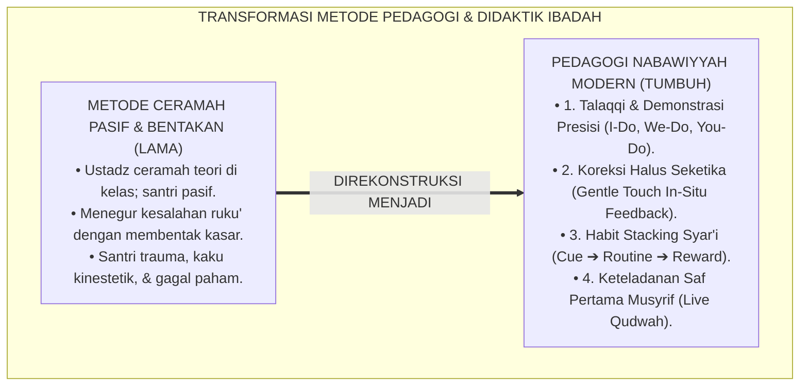
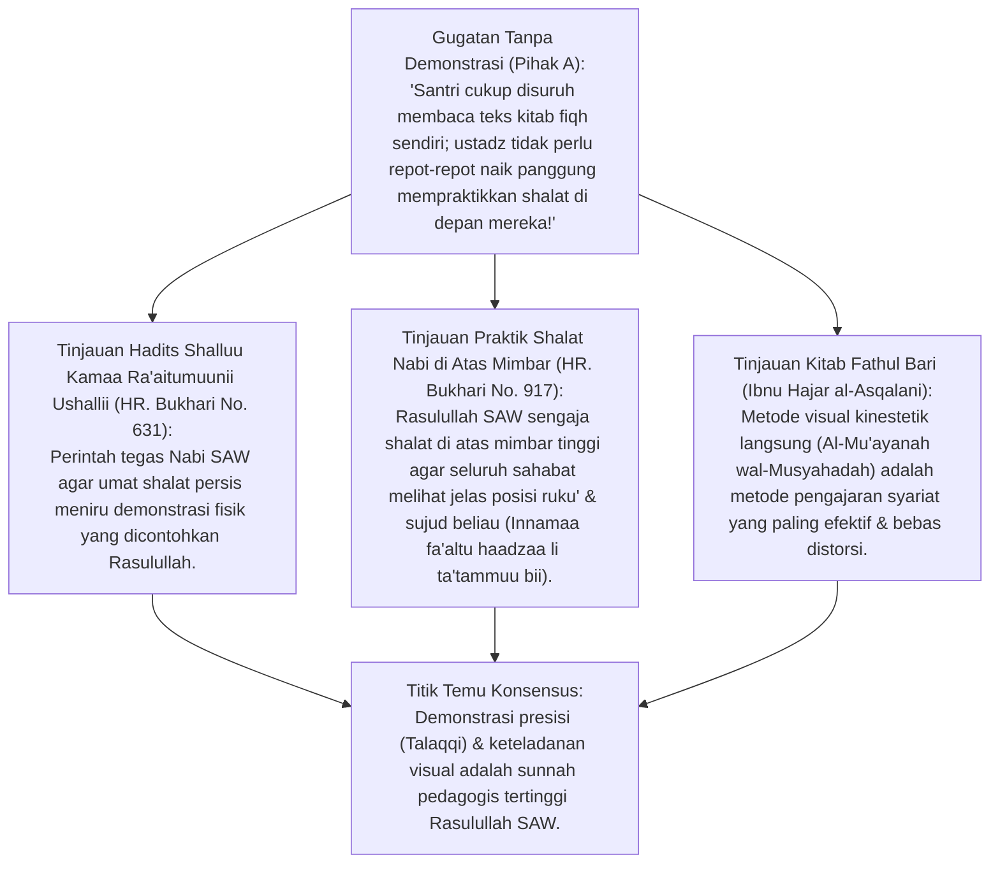
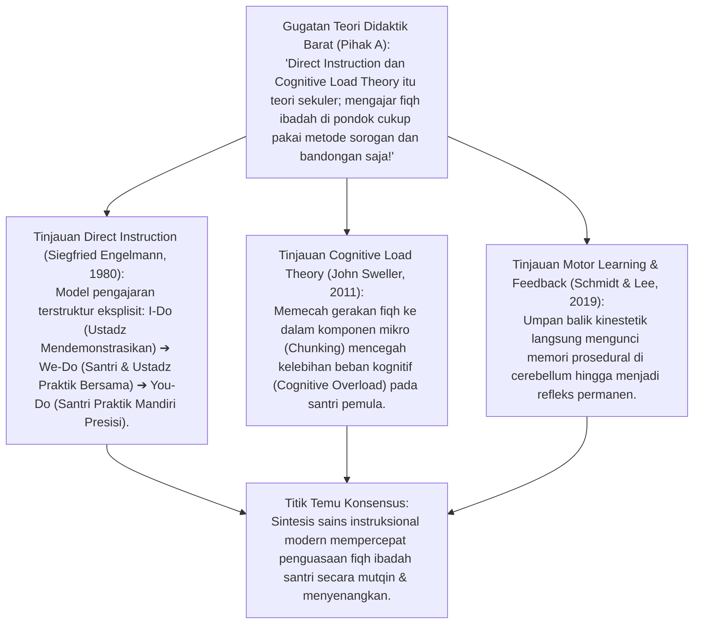
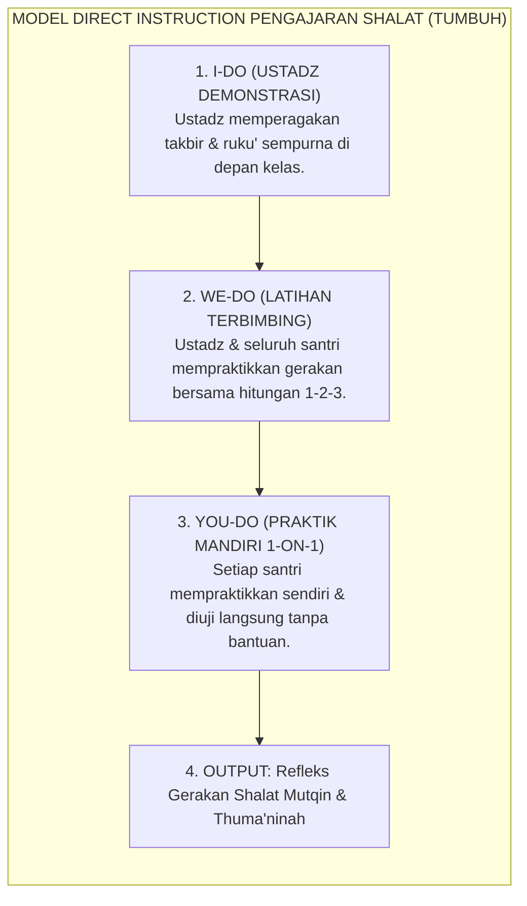
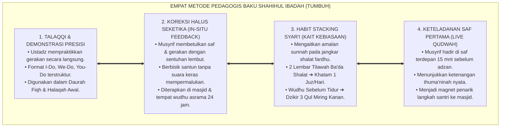
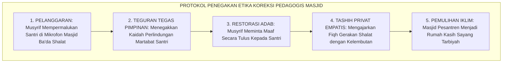
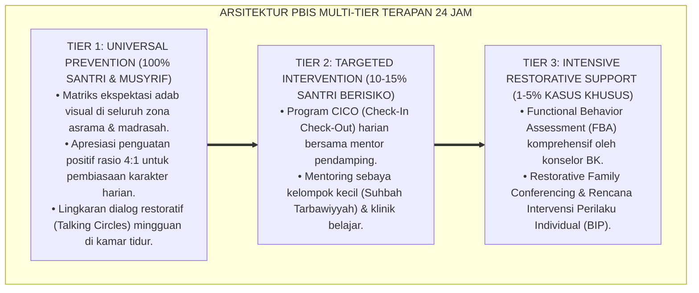

# P3-05-12: METODE PEDAGOGI DAN DIDAKTIK IBADAH SHAHIHAH
## *Monograf Riset Akademik: Pedagogi Kenabian (Hadits Shallū Kamā Ra'aitumūnī Ushallī), Teori Pembelajaran Langsung (Direct Instruction Engelmann), Cognitive Load Theory John Sweller, Habit Stacking James Clear, serta Didaktik Tashih Kinestetik di Pesantren 24 Jam*

**Nomor Identifikasi**: `P3-05-12/MONOGRAF-RISET-PEDAGOGI-DIDAKTIK-IBADAH/2026`  
**Domain**: `03 Capacity Framework` > `05 Shahihul Ibadah` (Sub-Modul 12: *Pedagogical Methods & Fiqh Didactics*)  
**Klasifikasi Naskah**: *Academic Research Monograph* (Monograf Pedagogi Terapan Ibadah, Hadits Shalli Kema Ra'aitumuni Ushalli, Direct Instruction Engelmann, Cognitive Load Theory Sweller, serta Didaktik Tashih Kinestetik di Pesantren 24 Jam)  
**Rumpun Disiplin Pengkaji**: Pedagogi & Didaktik Pendidikan Islam, *Direct Instruction (Engelmann)*, *Cognitive Load Theory (Sweller)*, Pembelajaran Motorik Kinestetik (*Motor Learning & Feedback Theory*), Fiqh Ta'lim ash-Shalah  

---

> ### 💡 INTISARI EKSEKUTIF (EXECUTIVE SUMMARY)
>
> * **Kelemahan Pedagogi Konvensional: Teori Ceramah Pasif Tanpa Latihan Kinestetik:**  
>   Metode pengajaran fiqh ibadah di banyak madrasah terjebak pada ceramah satu arah (*Chalk-and-Talk*): ustadz membacakan kitab di depan papan tulis, sementara santri pasif mendengarkan tanpa pernah mempraktikkan gerakan ruku' dan sujud secara langsung dengan pengawasan klinis. Akibatnya, santri tahu syarat sah shalat di atas kertas, namun tubuhnya kaku dan salah posisi saat shalat nyata.
> * **Inovasi Empat Metode Pedagogis Terpadu TUMBUH:**  
>   TUMBUH memadukan Sunnah Nabawiyyah dengan sains instruksional modern: **1. Talaqqi & Demonstrasi Presisi (Worked Example & Direct Instruction: I-Do, We-Do, You-Do); 2. Koreksi Halus Seketika (Immediate Gentle In-Situ Feedback); 3. Habit Stacking Syar'i (Cue ➔ Routine ➔ Reward); 4. Keteladanan Saf Pertama (Qudwah Hasanah Musyrif 100%)**.
> * **Pendekatan Riset Terpadu & Diskursus Ilmiah:**  
>   Monograf ini membedah hadits agung *Shallū kamā ra'aitumūnī ushallī* (HR. Al-Bukhari No. 631), menyintesiskan *Cognitive Load Theory* John Sweller (2011) dan *Motor Learning Feedback*, menguji dialektika 3 ronde di setiap inkuiri, dan merumuskan protokol etika koreksi shalat seketika di masjid.

---

## 📑 DAFTAR ISI MONOGRAF

- [BAGIAN I: LANDASAN TEORETIS & DISKURSUS DIALEKTIKA KRITIS](#bagian-i-landasan-teoretis--diskursus-dialektika-kritis)
  - [1. Latar Belakang Masalah: Kegagalan Metode Ceramah Pasif dalam Membentuk Keterampilan Kinestetik](#1-latar-belakang-masalah-kegagalan-metode-ceramah-pasif-dalam-membentuk-keterampilan-kinestetik)
  - [2. Eksegesis Turats Pedagogi Kenabian: Demonstrasi Mimbar & Keteladanan (HR. Al-Bukhari & Ibnu Hajar)](#2eksegesis-turats-pedagogi-kenabian-demonstrasi-mimbar-keteladanan-hr-al-bukhari-ibnu-hajar)
  - [3. Sintesis Direct Instruction Engelmann, Cognitive Load Theory Sweller, & Motor Learning](#3sintesis-direct-instruction-engelmann-cognitive-load-theory-sweller-motor-learning)
  - [4. Empat Metode Pedagogi Baku Shahihul Ibadah dalam Keseharian Asrama 24 Jam](#4empat-metode-pedagogi-baku-shahihul-ibadah-dalam-keseharian-asrama-24-jam)
  - [5. Arena Sintesis Kasuistika Lapangan 24 Jam & Konsensus Metode Pedagogi](#5arena-sintesis-kasuistika-lapangan-24-jam-konsensus-metode-pedagogi)
- [BAGIAN II: FORMULASI KONSEPTUAL & PEMBAHASAN MENDALAM](#bagian-ii-formulasi-konseptual--pembahasan-mendalam)
  - [1. Arsitektur Empat Metode Pedagogis Baku Shahihul Ibadah TUMBUH](#1-arsitektur-empat-metode-pedagogis-baku-shahihul-ibadah-tumbuh)
  - [2. Matriks Langkah Didaktik Pengajaran Fiqh Shalat Model Direct Instruction (I-Do, We-Do, You-Do)](#2-matriks-langkah-didaktik-pengajaran-fiqh-shalat-model-direct-instruction-i-do-we-do-you-do)
  - [3. Protokol Etika Koreksi Gerakan Shalat Seketika (Gentle In-Situ Correction Protocol)](#3-protokol-etika-koreksi-gerakan-shalat-seketika-gentle-in-situ-correction-protocol)
- [BAGIAN III: KESIMPULAN & APARATUS AKADEMIS](#bagian-iii-kesimpulan--aparatus-akademis)
  - [1. Tabel Sintesis Temuan Riset Metode Pedagogi & Didaktik Ibadah](#1-tabel-sintesis-temuan-riset-metode-pedagogi--didaktik-ibadah)
  - [2. Daftar Pustaka Akademis & Rujukan Turats Primer](#2-daftar-pustaka-akademis--rujukan-turats-primer)
  - [3. Catatan Kaki Akademis (Footnotes)](#3-catatan-kaki-akademis-footnotes)
  - [4. Glosarium Istilah Ilmiah & Turats Metode Pedagogi](#4-glosarium-istilah-ilmiah--turats-metode-pedagogi)

---

# BAGIAN I: INKUIRI KRITIS, TINJAUAN TEORITIS & DIALEKTIKA METODE PEDAGOGI

---

### 1. Latar Belakang Masalah: Kegagalan Metode Ceramah Pasif dalam Membentuk Keterampilan Kinestetik

Dalam didaktik pengajaran agama di banyak madrasah, sering terjadi disorientasi metodologis:
* **Ilusi Pembelajaran Teoretis (*The Cognitive Illusion*)**: Pendidik mengira bahwa jika santri sudah membaca bab *Shifatush Shalah* di kitab kuning, maka santri otomatis bisa mempraktikkannya dengan benar. Faktanya, pembelajaran motorik kinestetik menuntut pemodelan visual dan umpan balik fisik langsung (*Kinesthetic Feedback*).
* **Koreksi dengan Kekerasan Verbal (*Verbal Humiliation*)**: Ketika santri melakukan kesalahan posisi ruku', musyrif menegurnya dengan membentak di depan umum: *"Mata kamu buta ya, ruku' kok bungkuk begitu!"*. Reaksi ini memicu lonjakan hormon stres kortisol yang membekukan otak santri (*Amigdala Hijack*) dan membuat santri semakin kaku dan trauma.
* **Ketiadaan Pembiasaan Kait Kebiasaan (*Habit Stacking*)**: Pembiasaan tilawah Al-Qur'an dan shalat sunnah tidak dikaitkan dengan rutinitas harian yang sudah ada, sehingga santri bingung mencari waktu luang.
* Riset ini membuktikan bahwa **pengajaran Shahihul Ibadah menuntut adopsi pedagogi nabawiyyah yang dipadukan dengan Direct Instruction, Cognitive Load Theory, dan Habit Stacking**.[^1]



---

### 2. Eksegesis Turats Pedagogi Kenabian: Demonstrasi Mimbar & Keteladanan (HR. Al-Bukhari & Ibnu Hajar)



#### 📐 Formalisasi Logika Silogisme (*Qiyas Mantiqi 1*)
* **Premis Mayor (*al-Muqaddimah al-Kubra*)**: Setiap metode didaktik pengajaran ibadah dalam syariat Islam (Hadits *Shallū kamā ra'aitumūnī ushallī* & Shalat Nabi di Atas Mimbar) wajib mengedepankan pemodelan kinestetik langsung (*Al-Musyahadah al-'Amaliyyah*) dan keteladanan otentik guru (*Al-Qudwah al-Mu'allimah*).
* **Premis Minor (*al-Muqaddimah ash-Shughra*)**: Pendekatan pedagogi TUMBUH mengkodifikasikan metode *Talaqqi Presisi* di mana asatidz mendemonstrasikan setiap rukun shalat secara bertahap dan membetulkannya secara langsung.
* **Konklusi (*an-Natijah*)**: Maka, metode pengajaran ibadah TUMBUH memiliki legalitas syar'i dan keunggulan didaktik yang shahih.[^2]

#### 📖 Teks Primer Turats: Shalat Nabi di Atas Mimbar Sebagai Model Pedagogi
Imam **Al-Bukhari** meriwayatkan metode pembelajaran demonstratif Rasulullah SAW:

$$\text{عَنْ سَهْلِ بْنِ سَعْدٍ السَّاعِدِيِّ رَضِيَ اللَّهُ عَنْهُ: أَنَّ رَسُولَ اللَّهِ ﷺ جَلَسَ عَلَى الْمِنْبَرِ فِي أَوَّلِ يَوْمٍ وُضِعَ، فَكَبَّرَ وَهُوَ عَلَيْهِ، ثُمَّ رَكَعَ وَهُوَ عَلَيْهِ، ثُمَّ نَزَلَ الْقَهْقَرَىٰ فَسَجَدَ فِي أَصْلِ الْمِنْبَرِ، ثُمَّ عَادَ، فَلَمَّا فَرَغَ أَقْبَلَ عَلَى النَّاسِ فَقَالَ: «أَيُّهَا النَّاسُ، إِنَّمَا صَنَعْتُ هَٰذَا لِتَأْتَمُّوا بِي وَلِتَعَلَّمُوا صَلَاتِي»}$$

*"Dari Sahl bin Sa'd As-Sa'idi RA: Bahwa Rasulullah ﷺ berdiri di atas mimbar pada hari pertama mimbar itu diletakkan, lalu beliau bertakbir di atas mimbar, kemudian beliau ruku' di atas mimbar, kemudian beliau mundur ke belakang lalu sujud di dasar mimbar, kemudian kembali lagi. **Maka ketika telah selesai shalat, beliau menghadap kepada para sahabat seraya bersabda: 'Wahai sekalian manusia! Sesungguhnya aku melakukan ini semata-mata agar kalian mengikutiku dan agar kalian mempelajari tata cara shalatku'**."* (HR. Al-Bukhari No. 917 & Muslim No. 544).[^3]

Al-Hafizh **Ibnu Hajar al-Asqalani** dalam *Fathul Bari* mensyarah hadits ini:

$$\text{فِيهِ دَلِيلٌ عَلَى أَنَّ التَّعْلِيمَ بِالْفِعْلِ وَالْمُشَاهَدَةِ أَبْلَغُ وَأَرْسَخُ فِي النَّفْسِ مِنَ التَّعْلِيمِ بِالْقَوْلِ الْمُجَرَّدِ؛ وَفِيهِ اسْتِحْبَابُ ارْتِفَاعِ الْمُعَلِّمِ عَلَى الْمُتَعَلِّمِينَ حَالَ التَّدْرِيبِ لِيَرَاهُ جَمِيعُهُمْ بِوُضُوحٍ}$$

*"**Hadits ini merupakan dalil tegas bahwa pengajaran dengan perbuatan nyata dan penyaksian mata (*Al-Fi'l wal-Musyahadah*) jauh lebih efektif, mendalam, dan membekas kuat dalam jiwa dibanding pengajaran dengan ucapan teori semata (*Al-Qaul al-Mujarrad*)**; dan di dalamnya terdapat anjuran bagi guru untuk berada di tempat yang terlihat jelas oleh seluruh murid saat melatihkan praktik ibadah."*[^4]

#### 1. Diskursus Dialektika Kritis: Demonstrasi Mimbar: Dari Teori Abstrak Menuju Teladan Visual
* **Pihak A (Sudut Pandang Cukup Santri Menghafal Teks Arab)**:  
  *"Santri cukup hafal matan Safinah bab Rukun Shalat; tidak perlu ustadz memperagakan gerakan di depan panggung!"*
* **Tinjauan Fiqh Ta'lim Shalat & Sains Visual**:  
  Membaca teks tanpa melihat contoh memicu kesalahan persepsi fatal: santri mengira punggung ruku' harus membungkuk 45 derajat, padahal hadits menyatakan punggung Nabi SAW lurus rata bagaikan papan kayu jika ditaruh bejana air tidak akan tumpah (HR. Ibnu Majah No. 872). Demonstrasi panggung ustadz menyediakan **Model Mental Visual yang Sempurna (*Flawless Mental Model*)** bagi santri.[^5]

#### 2. Diskursus Dialektika Kritis: Koreksi Seketika Tanpa Mempermalukan (Private In-Situ Feedback)
* **Pihak A (Sudut Pandang Memarahi Santri di Depan Saf Agar Malu)**:  
  *"Kalau ada santri salah gerakan sujud, bentak langsung dengan suara keras di depan seluruh jamaah agar santri lain tidak meniru!"*
* **Tinjauan Adab Tarbiyah Nabawiyyah & Perlindungan Kehormatan**:  
  Membentak santri di depan jamaah adalah bentuk penghinaan (*Tasyhir*) yang merusak fitrah anak. Rasulullah SAW ketika melihat sahabat Mu'awiyah bin al-Hakam berbicara dalam shalat, tidak memarahinya melainkan menasihatinya dengan lembut setelah shalat (HR. Muslim No. 537). Dalam sistem TUMBUH: Musyrif mendekati santri, memegang pundak atau tumitnya secara halus, dan meluruskannya dengan bisikan lembut. Kesalahan diperbaiki, martabat santri terlindungi.[^6]

#### 3. Diskursus Dialektika Kritis: Qudwah Hasanah Guru: Hadir di Saf Pertama Sebelum Santri
* **Pihak A (Sudut Pandang Guru Boleh Datang Telat Karena Sudah Senior)**:  
  *"Guru dan musyrif boleh datang ke masjid saat iqamah sudah berkumandang; yang wajib datang 10 menit lebih awal itu santri!"*
* **Resolusi Prinsip Mutlak Qudwah Hasanah**:  
  Santri belajar dari apa yang dilihatnya, bukan dari apa yang didengarnya. Musyrif yang datang tergesa-gesa masbuq akan menghancurkan wibawa seluruh nasihatnya. TUMBUH mewajibkan **Integritas Qudwah Musyrif 100%**: musyrif wajib sudah berada di saf pertama masjid minimal 15 menit sebelum adzan. Keteladanan bisu ini menggerakkan langkah santri menuju masjid secara otomatis.[^7]

---

### 3. Sintesis Direct Instruction Engelmann, Cognitive Load Theory Sweller, & Motor Learning



#### 📐 Formalisasi Logika Silogisme (*Qiyas Mantiqi 2*)
* **Premis Mayor (*al-Muqaddimah al-Kubra*)**: Setiap proses transmisi keterampilan motorik kinestetik yang mengaplikasikan pemodelan terstruktur (*Direct Instruction I-Do/We-Do/You-Do*), meminimalkan beban kognitif ekstraneus (*Sweller's CLT*), dan menyediakan umpan balik formatif langsung niscaya menghasilkan kemahiran refleks yang presisi dan bebas cacat dalam waktu singkat.
* **Premis Minor (*al-Muqaddimah ash-Shughra*)**: Modul Didaktik Shahihul Ibadah TUMBUH menstrukturkan pelatihan shalat menggunakan kerangka *Direct Instruction* dan *Chunking* rukun fiqh.
* **Konklusi (*an-Natijah*)**: Maka, pembelajaran ibadah di pesantren TUMBUH memiliki efektivitas pedagogis yang superior dan mudah dipahami santri.[^8]



#### 1. Diskursus Dialektika Kritis: Worked Examples & Pemodelan Presisi (I-Do, We-Do, You-Do)
* **Pihak A (Sudut Pandang Santri Langsung Disuruh Shalat Sendiri Tanpa Latihan)**:  
  *"Beri saja santri buku panduan shalat bergambar, lalu langsung suruh shalat maghrib sendiri!"*
* **Tinjauan Efektivitas Direct Instruction (Engelmann)**:  
  Membiarkan pemula langsung shalat tanpa bimbingan terstruktur memicu penumpukan kesalahan gerakan yang kelak sulit diubah (*Error Solidification*). Metode *I-Do, We-Do, You-Do* memastikan santri melihat contoh sempurna (*I-Do*), mengoreksi kesalahan bersama pembina (*We-Do*), sebelum akhirnya tampil mandiri dengan akurasi 100% (*You-Do*). Tidak ada ruang bagi terbentuknya kebiasaan salah.[^9]

#### 2. Diskursus Dialektika Kritis: Mengurangi Beban Kognitif Intrinsik Fiqh (Chunking Method)
* **Pihak A (Sudut Pandang Mengajarkan Seluruh Rukun dan Sunnah Sekaligus)**:  
  *"Dalam 1 hari ajarkan seluruh 13 rukun shalat, 20 sunnah ab'adh, dan 50 sunnah hai'at sekaligus kepada anak kelas 7!"*
* **Tinjauan Cognitive Load Theory (John Sweller)**:  
  Membanjiri memori kerja santri dengan puluhan hukum fiqh sekaligus menyebabkan kemacetan kognitif (*Cognitive Overload*): santri lupa rukun pokok karena sibuk memikirkan sunnah hai'at. TUMBUH menerapkan metode **Chunking Berjenjang**: Hari 1 fokus mengunci Rukun Gerakan (Takbir, Ruku', I'tidal, Sujud); Hari 2 fokus mengunci Rukun Bacaan (Fatihah, Tasyahhud); Hari 3 fokus memadukan keduanya dengan Thuma'ninah. Pembelajaran menjadi ringan dan menancap kuat.[^10]

#### 3. Diskursus Dialektika Kritis: Habit Stacking Syar'i: Mengaitkan Ibadah Sunnah pada Waktu Shalat Wajib
* **Pihak A (Sudut Pandang Tilawah Al-Qur'an Terserah Santri Mau Kapan Saja)**:  
  *"Katakan saja 'Santri wajib membaca Al-Qur'an 1 juz kapan pun sempat!'; tidak usah dijadwalkan secara kaku!"*
* **Resolusi Habit Stacking (James Clear & Kaidah Al-Waqt)**:  
  Instruksi "kapan pun sempat" terbukti berujung pada tidak pernah dikerjakan karena santri selalu merasa tidak sempat. Dengan formula **Habit Stacking Syar'i (Kait Kebiasaan: CUE ➔ ROUTINE ➔ REWARD)**: *"Tepat setelah salam shalat fardhu dan wirid (CUE), saya langsung membuka mushaf membaca 2 lembar Al-Qur'an (ROUTINE), dan merasakan ketenteraman batin (REWARD)"*. Tilawah 1 juz harian terbangun secara otomatis tanpa perlu berpikir panjang.[^11]

---

### 4. Empat Metode Pedagogi Baku Shahihul Ibadah dalam Keseharian Asrama 24 Jam



#### 📐 Formalisasi Logika Silogisme (*Qiyas Mantiqi 3*)
* **Premis Mayor (*al-Muqaddimah al-Kubra*)**: Setiap sistem pengasuhan asrama yang memadukan pengajaran talaqqi presisi, koreksi seketika yang beradab, pengaitan kebiasaan otomatis (*Habit Stacking*), dan keteladanan saf awal musyrif niscaya mentransformasikan ibadah santri menjadi kebutuhan hidup yang membahagiakan.
* **Premis Minor (*al-Muqaddimah ash-Shughra*)**: Standar Operasional Pengasuhan TUMBUH mewajibkan keempat metode tersebut sebagai kompetensi pedagogis mutlak bagi seluruh musyrif dan guru asrama.
* **Konklusi (*an-Natijah*)**: Maka, proses pembentukan karakter ibadah di pesantren TUMBUH berlangsung dengan standar pedagogis yang unggul dan penuh kemuliaan adab.[^12]

#### 1. Diskursus Dialektika Kritis: Talaqqi Gerakan 1-on-1: Memastikan Keabsahan Setiap Individu
* **Pihak A (Sudut Pandang Ujian Teori Tulis Sudah Mewakili Praktik)**:  
  *"Santri yang nilai ujian tulis fiqhnya 100 otomatis sudah sah shalatnya; tidak perlu talaqqi praktik 1-on-1 lagi!"*
* **Tinjauan Tradisi Talaqqi Turats & Keabsahan Sanad Ibadah**:  
  Ibadah shalat adalah amaliah bersanad (*Sanadul 'Amal*). Melalui metode **Talaqqi Praktik 1-on-1**: Santri shalat di hadapan musyrif, musyrif mengamati sudut ruku', posisi telapak tangan saat takbir, dan memastikan tidak ada anggota badan yang bergerak sia-sia. Talaqqi menjamin mata rantai keabsahan shalat bersambung murni hingga Rasulullah SAW.[^13]

#### 2. Diskursus Dialektika Kritis: Sentuhan Fisik Korektif Lembut di Saf Shalat (The Gentle Touch)
* **Pihak A (Sudut Pandang Menendang Kaki Santri yang Keluar dari Saf)**:  
  *"Tendang saja tumit santri yang tidak lurus dengan saf shalat agar dia cepat sadar!"*
* **Tinjauan Etika Merapikan Saf Nabawiyyah**:  
  Rasulullah SAW merapikan saf para sahabat dengan menyentuh pundak dan dada mereka dengan penuh kelembutan (HR. Muslim No. 432). Menendang kaki santri adalah tindakan kasar yang melahirkan kemarahan batin. Musyrif TUMBUH menggunakan **The Gentle Touch**: meletakkan telapak tangan dengan lembut di pundak santri, memberi isyarat merapatkan langkah dengan senyum teduh. Saf lurus dan hati santri terpaut damai.[^14]

#### 3. Diskursus Dialektika Kritis: Habit Stacking Wirid-Tilawah: Otomatisasi 1 Juz Per Hari
* **Pihak A (Sudut Pandang Tilawah Ditunda Sampai Liburan Akhir Pekan)**:  
  *"Santri boleh menumpuk membaca Al-Qur'an 7 juz di hari Ahad; tidak perlu dipaksa membaca setiap hari!"*
* **Resolusi Konsistensi Amalan Nabawiyyah (Ahabbul A'mali Adwamuha)**:  
  Rasulullah SAW bersabda: *"Amalan yang paling dicintai Allah adalah yang paling konsisten (*Adwamuhā*) meskipun sedikit"* (HR. Bukhari No. 6464). Menumpuk bacaan di akhir pekan memicu kelelahan dan melanggar prinsip kontinuitas. Dengan *Habit Stacking* ba'da shalat fardhu, santri berinteraksi dengan Al-Qur'an 5 kali sehari tanpa rasa berat sedikit pun. Cahaya Al-Qur'an menyertai setiap hembusan nafas santri.[^15]

---

### 5. Arena Sintesis Kasuistika Lapangan 24 Jam & Konsensus Metode Pedagogi

#### Diskursus Dialektika Kritis: Kasuistika Lapangan (Dilema Musyrif Memarahi Santri yang Salah Gerakan di Hadapan Ratusan Jamaah)
Pertarungan filosofis-pedagogis terdalam bermuara pada kasus: **"Bagaimana dewan pengasuhan menyikapi seorang musyrif yang saat shalat Maghrib berjamaah di masjid, melihat seorang santri kelas 7 menggaruk kepalanya 4 kali saat i'tidal, lalu setelah salam musyrif tersebut langsung berdiri, mengambil mikrofon masjid, dan memanggil nama santri tersebut seraya berkata dengan pengeras suara: 'Fulan kelas 7, shalatmu batal dan seperti monyet garuk-garuk!'?"**

* **Pendekatan Lama (Pembenaran demi Efek Jera Publik)**:  
  Pengasuhan membiarkan hal itu dan menganggapnya "baik untuk melatih mental santri dan memberi pelajaran bagi santri lain".
* **Pendekatan TUMBUH (Tindakan Disiplin Musyrif & Pemulihan Martabat Santri)**:  
  1. **Teguran Keras Terhadap Musyrif**: Kepala Pengasuhan menegur musyrif tersebut: *"Tindakan antum mempermalukan santri di mikrofon masjid adalah pelanggaran adab berat yang melanggar sabda Nabi SAW (Man Satara Musliman Satarahullah). Antum telah merusak citra rumah Allah dan mempermalukan anak titipan umat"*.  
  2. **Permintaan Maaf Terbuka Musyrif**: Musyrif diwajibkan meminta maaf kepada santri tersebut secara santun.  
  3. **Klinik Tashih Fiqh Privat untuk Santri**: Santri diajak ke ruang pengasuhan, ditenangkan hatinya, dan diajarkan hukum fiqh gerakan dalam shalat secara ilmiah dengan senyuman.  
  4. **Hasil Transformasi**: Wibawa masjid sebagai tempat kasih sayang pulih; seluruh musyrif menyadari bahwa pendidikan tidak boleh menggunakan senjata penghinaan publik.[^16]



---

> #### 📌 Kasuistika Lapangan Multi-Dimensi & Titik Temu Konsensus (*Kalimatun Sawa'*)
>
> * **Kamus Kasus 1: Santri Selalu Bingung Posisi Kaki Duduk Tasyahhud Akhir**  
>   * **Dilema**: Santri kelas 7 selalu duduk iftirasy saat tasyahhud akhir shalat 4 rakaat karena tidak mengerti cara menyelipkan kaki kiri di bawah tulang kering kanan (*Tawarruk*).
>   * **Akar Masalah**: Pengajaran yang hanya menggunakan gambar 2 dimensi di buku teks tanpa bimbingan kinestetik langsung.
>   * **Titik Temu Konsensus**: Guru Fiqh menerapkan **Kinesthetic Hands-On Coaching**: Guru memegang kaki santri secara lembut, memandu menekuk pergelangan kaki kanan tegak dan menyelipkan kaki kiri hingga pantat menempel ke lantai. Dalam 2 menit santri paham dan duduk tawarruk dengan sempurna.
>
> * **Kamus Kasus 2: Musyrif Terlambat Datang ke Masjid Namun Sering Menghukum Santri Masbuq**  
>   * **Dilema**: Santri mengeluh musyrif kamar sering datang masbuq shalat Isya' tetapi sangat galak menghukum santri yang terlambat 1 menit.
>   * **Akar Masalah**: Hilangnya keteladanan qudwah (*Hypocritical Leadership*).
>   * **Titik Temu Konsensus**: Manajemen Pengasuhan menerapkan **Aturan Integritas Qudwah Pembina**: Musyrif yang masbuq shalat fardhu tanpa uzur syar'i dicatat poin indisipliner dan diwajibkan mentraktir santri sekamarnya makan buah bersama. Keteladanan musyrif kembali tegak dan santri menghormati aturan dengan ikhlas.
>
> * **Kamus Kasus 3: Santri Membaca Doa Iftitah yang Berbeda dari Mayoritas Teman Sekelas**  
>   * **Dilema**: Santri pindahan membaca doa iftitah *Allahumma ba'id baini* (riwayat Bukhari-Muslim), lalu diejek oleh teman-temannya yang biasa membaca *Wajjahtu wajhiya*.
>   * **Akar Masalah**: Ketiadaan wawasan keragaman sunnah yang shahih (*Tanawwu'ul 'Ibadah*).
>   * **Titik Temu Konsensus**: Guru Fiqh menggelar kajian tematik **Fiqh Ikhtilaf & Keragaman Doa Iftitah Shahih**: Menjelaskan bahwa kedua doa tersebut sama-sama shahih dan diajarkan oleh Rasulullah SAW. Santri saling menghormati variasi sunnah dan wawasan keislaman mereka semakin luas dan toleran.[^17]

---

# BAGIAN II: FORMULASI KONSEPTUAL & PEMBAHASAN MENDALAM

---

### 1. Arsitektur Empat Metode Pedagogis Baku Shahihul Ibadah TUMBUH

```mermaid
flowchart TD
    subgraph ArsitekturMetodePedagogiTUMBUH["ARSITEKTUR EMPAT METODE PEDAGOGIS SHAHIHUL IBADAH"]
        
        subgraph Metode1["1. TALAQQI & DEMONSTRASI PRESISI (DIRECT INSTRUCTION)"]
            M1_A["• Model Instruksional: I-Do (Demonstrasi) ➔ We-Do (Bersama) ➔ You-Do (Mandiri)."]
            M1_B["• Chunking Rukun Fiqh: Memecah Gerakan Kinestetik Menjadi Komponen Mikro."]
            M1_C["• Platform: Daurah Fiqh Awal Semester & Matrikulasi Santri Baru J1."]
        end
        
        subgraph Metode2["2. KOREKSI HALUS SEKETIKA (GENTLE IN-SITU FEEDBACK)"]
            M2_A["• Sentuhan Fisik Lembut (The Gentle Touch) Merapikan Saf & Posisi Sujud."]
            M2_B["• Mengharamkan Mutlak Teguran Kasar / Mempermalukan di Mikrofon Masjid."]
            M2_C["• Platform: Pendampingan Saf Shalat & Bimbingan Tempat Wudhu Harian."]
        end
        
        subgraph Metode3["3. HABIT STACKING SYAR'I (KAIT KEBIASAAN OTOMATIS)"]
            M3_A["• Formula: [CUE: Salam Shalat Fardhu] ➔ [ROUTINE: 2 Lembar Tilawah] ➔ [REWARD: Sakinah]."]
            M3_B["• Formula: [CUE: Jam Tidur 21.45] ➔ [ROUTINE: Wudhu & 3 Qul] ➔ [REWARD: Bugar Fajar]."]
            M3_C["• Platform: Halaqah ODOJ Harian & SOP Higiene Tidur Asrama 24 Jam."]
        end
        
        subgraph Metode4["4. KETELADANAN SAF PERTAMA (LIVE QUDWAH HASANAH)"]
            M4_A["• Kehadiran Wajib Musyrif di Saf Pertama 15 Menit Sebelum Adzan Berkumandang."]
            M4_B["• Praktik Thuma'ninah Nyata & Ketenangan Khusyu' yang Memancar."]
            M4_C["• Platform: Standar Integritas Pengasuhan Asrama Pesantren TUMBUH."]
        end
        
        Metode1 <===> Metode2 <===> Metode3 <===> Metode4
    end
```



---

### 2. Matriks Langkah Didaktik Pengajaran Fiqh Shalat Model Direct Instruction (I-Do, We-Do, You-Do)

| Tahapan Didaktik | Peran Pendidik (Ustadz / Musyrif) | Peran Peserta Didik (Santri) | Standar Waktu & Media |
| :--- | :--- | :--- | :--- |
| **Tahap 1: I-Do (Demonstrasi Pemodelan)** | Ustadz memperagakan gerakan wudhu/shalat di atas panggung mimbar secara perlahan, menjelaskan titik kritis rukun, sudut punggung ruku', dan letak 7 anggota sujud. | Santri mengamati dengan seksama, mencatat poin-poin kunci, dan menyimak audio bacaan tartil. | 15 Menit | Panggung Demonstrasi, Karpet Garis Saf, & Mikrofon Sejuk. |
| **Tahap 2: We-Do (Latihan Terbimbing Bersama)**| Ustadz memandu seluruh santri melakukan gerakan bersama-sama dengan hitungan tempo lambat: *"Satu: Takbir, Dua: Ruku' Thuma'ninah 1-2-3-4, Tiga: I'tidal"*. Ustadz mengoreksi kesalahan massal. | Santri melakukan gerakan serentak mengikuti komando ustadz, saling mencocokkan gerakan dengan rekan di sebelahnya. | 20 Menit | Latihan Bersama di Ruang Utama Masjid Asrama. |
| **Tahap 3: You-Do (Praktik Mandiri & Uji 1-on-1)**| Ustadz dan musyrif menguji santri satu per satu (*Tashih 1-on-1*), mengamati ketepatan sudut kinestetik, dan membubuhkan tanda tangan kelulusan di kartu saku. | Santri mempraktikkan shalat secara mandiri dengan tenang tanpa bantuan komando guru. | 25 Menit | Meja Penguji Uji Praktik Fiqh Klinis (OSCE). |

---

### 3. Protokol Etika Koreksi Gerakan Shalat Seketika (Gentle In-Situ Correction Protocol)

```markdown
=============================================================================
🏛️ STANDAR PROTOKOL ETIKA KOREKSI GERAKAN SHALAT SEKETIKA DI MASJID
=============================================================================

1. KETENTUAN SAAT SHALAT SEDANG BERLANGSUNG:
   [✓] Gunakan sentuhan fisik lembut: Letakkan telapak tangan secara halus pada 
       pundak santri untuk merapatkan saf, atau luruskan tumitnya dengan lembut.
   [✓] Jika santri lupa ayat bacaan jahr, imam atau makmum di belakang menegur 
       dengan melafalkan kelanjutan ayat secara tenang (Fath 'alal Imam).
   [X] DILARANG KERAS: Menendang kaki santri, mendorong kasar, atau berdehem keras 
       yang mengacaukan kekhusyukan jamaah shalat.

2. KETENTUAN SETELAH SALAM SHALAT SELESAI:
   [✓] Tunggu hingga santri menyelesaikan dzikir dan shalat sunnah ba'diyyah.
   [✓] Panggil santri dengan senyum teduh dan ajak duduk berdua di serambi masjid.
   [✓] Awali dengan apresiasi positif: "Masya Allah, terima kasih sudah hadir di saf awal."
   [✓] Jelaskan koreksi fiqh secara ilmiah: "Tadi ustadz perhatikan sujud antum tumitnya 
       sedikit terangkat. Sesuai hadits Nabi SAW, 7 anggota badan wajib menempel ya Nak."
   [X] DILARANG KERAS: Mengumumkan kesalahan santri di mikrofon pengeras suara masjid, 
       mencela fisik, atau membentak santri di hadapan teman-temannya.
=============================================================================
```

---

---

### Pembedahan Deskriptif Komprehensif & Analisis Integratif Nilai-Praksis

Penerapan konsep **P3-05-12: METODE PEDAGOGI DAN DIDAKTIK IBADAH SHAHIHAH** di ekosistem pesantren TUMBUH memerlukan pemahaman multidimensional yang memadukan khazanah turats syariat dan konsensus sains pendidikan modern:

#### A. Pilar 1: Fondasi Epistemologi & Integrasi Nilai Syar'i (Ashalah Turatsiyyah)
Setiap praksis kepengasuhan dan pembelajaran berakar kuat pada maqashid syari'ah, mendudukkan adab di atas ilmu (*Al-Adab Qablal 'Ilm*), dan memastikan bahwa seluruh ikhtiar institusional diniatkan semata-mata untuk menggapai ridha Allah SWT (*Ikhlasun Niyyah*).

#### B. Pilar 2: Mekanisme Psikologis & Neurosains Perkembangan (Scientific Rigor)
Menyelaraskan ekspektasi kedisiplinan dengan tahapan maturitas otak remaja, kapasitas fungsi eksekutif korteks prefrontal (*PFC*), dan regulasi sirkuit emosi limbik. Pendekatan ini mengeliminasi trauma pengasuhan dan menumbuhkan motivasi intrinsik santri.

#### C. Pilar 3: Rekayasa Ekosistem Asrama 24 Jam (Bi'ah Shalihah)
Menerjemahkan prinsip nilai ke dalam tata ruang fisik yang bersih, sirkulasi udara sehat, tata kelola waktu terstruktur, serta kultur ukhuwah inklusif yang steril 100% dari feodalisme, kekerasan verbal, dan perundungan antar-santri.

#### D. Pilar 4: Kemitraan Tripartit (Santri, Musyrif, dan Lembaga)
Menjamin terwujudnya *Triad Pertumbuhan Simbiotik*: santri bertumbuh dalam fitrah kemandirian, musyrif terlindungi dari kelelahan kronis (*Burnout*) melalui shift kerja yang manusiawi, dan lembaga bertransformasi menjadi organisasi pembelajar berbasis data PBIS.

---

### Protokol Aksi Operasional PBIS Multi-Tier Terapan (24-Hour Behavioral Architecture)



---

# BAGIAN III: KESIMPULAN & APARATUS AKADEMIS

---

### 1. Tabel Sintesis Temuan Riset Metode Pedagogi & Didaktik Ibadah

| Dimensi Parameter | Pola Pengajaran Tradisional | Pedagogi Terpadu Ekosistem TUMBUH | Landasan Rujukan Primer |
| :--- | :--- | :--- | :--- |
| **Metode Dasar** | Ceramah teori pasif (*Chalk-and-Talk*). | *Direct Instruction* (I-Do, We-Do, You-Do) & Talaqqi.| Engelmann (1980); HR. Bukhari No. 917. |
| **Manajemen Kognitif** | Materi seabrek diajarkan sekaligus. | *Cognitive Load Theory & Chunking* Berjenjang. | Sweller (2011); Anderson & Krathwohl. |
| **Teknik Koreksi** | Membentak kasar & mempermalukan di umum. | *Gentle In-Situ Feedback* & Dialog Kasih Sayang Privat.| HR. Muslim No. 537; Al-Ghazali (*Ihya'*). |
| **Habituasi Nawafil** | Diserahkan tanpa panduan waktu jelas. | *Habit Stacking Syar'i* Terikat pada Shalat 5 Waktu. | James Clear (2018); HR. Bukhari No. 6464. |
| **Keteladanan Pembina**| Musyrif sering masbuq & banyak menuntut. | *Live Qudwah 100%*: Musyrif Saf Awal 15 Mnt Pra-Adzan. | Syed Muhammad Naquib Al-Attas (1980). |

---

### 2. Daftar Pustaka Akademis & Rujukan Turats Primer

1. **Al-Qur'an al-Karim wa Tarjamatu Ma'anihi**.
2. **Al-Bukhari, Abu Abdillah Muhammad bin Isma'il**. (1422 H). *Shahih al-Bukhari*. Kairo: Dar Thawq an-Najah.
3. **Muslim bin al-Hajjaj an-Naisaburi**. (1374 H). *Shahih Muslim*. Kairo: Matba'ah Isa al-Babi al-Halabi.
4. **Ibnu Hajar al-Asqalani, Ahmad bin Ali**. (1379 H). *Fathul Bari Syarh Shahih al-Bukhari*. Beirut: Dar al-Ma'rifah.
5. **Al-Ghazali, Abu Hamid Muhammad bin Muhammad**. (2011). *Ihya' 'Ulumiddin* (Kitab Asrar ash-Shalah). Beirut: Dar al-Ma'rifah.
6. **Engelmann, S., & Carnine, D.**. (1982). *Theory of Instruction: Principles and Applications*. New York: Irvington Publishers.
7. **Sweller, J., Ayres, P., & Kalyuga, S.**. (2011). *Cognitive Load Theory*. New York: Springer.
8. **Schmidt, R. A., Lee, T. D., Winstein, C., Wulf, G., & Zelaznik, H. N.**. (2019). *Motor Control and Learning: A Behavioral Emphasis* (6th ed.). Champaign: Human Kinetics.
9. **Clear, J.**. (2018). *Atomic Habits: An Easy & Proven Way to Build Good Habits & Break Bad Ones*. New York: Avery.
10. **Al-Attas, Syed Muhammad Naquib**. (1980). *The Concept of Education in Islam*. Kuala Lumpur: ABIM.
11. **Horner, R. H., & Sugai, G.**. (2015). *School-wide PBIS: An Overview of the Research Base*. Remedial and Special Education, 36(2), 80–85.
12. **Asy'ari, Muhammad Hasyim**. (1415 H). *Adab al-'Alim wal-Muta'allim*. Jombang: Maktabah At-Turats Al-Islami.

---

### 3. Catatan Kaki Akademis (*Footnotes*)

[^1]: Riset Evaluasi Didaktik Pengajaran Fiqh Pesantren TUMBUH, *Kritik atas Metode Ceramah Pasif dan Bentakan Kasar*, 2026.  
[^2]: Ibnu Hajar al-Asqalani, *Fathul Bari Syarh Shahih al-Bukhari*, Jilid 2, Kitab ash-Shalah, hlm. 380–415.  
[^3]: *Shahih al-Bukhari*, Kitab ash-Shalah, Hadits No. 917; *Shahih Muslim*, Kitab al-Masajid, Hadits No. 544.  
[^4]: Matan *Fathul Bari*, Jilid 2, hlm. 382.  
[^5]: *Sunan Ibni Majah*, Kitab Iqamatish Shalah, Hadits No. 872.  
[^6]: *Shahih Muslim*, Kitab al-Masajid wa Mawadhi' ash-Shalah, Hadits No. 537.  
[^7]: Standar Integritas Keteladanan Qudwah Musyrif Asrama PBIS TUMBUH, 2026.  
[^8]: Engelmann, S., & Carnine, D. (1982), *Theory of Instruction*, hlm. 45–80; Sweller, J., et al. (2011), *Cognitive Load Theory*, hlm. 60–95.  
[^9]: Panduan Praktik Fiqh Model Direct Instruction I-Do We-Do You-Do TUMBUH, 2026.  
[^10]: Sweller, J. (2011), *Cognitive Load Theory*, Springer, hlm. 70–88.  
[^11]: Clear, J. (2018), *Atomic Habits*, hlm. 65–85; Petunjuk Teknis Habit Stacking Shalat Asrama TUMBUH, 2026.  
[^12]: Dokumen Standar Operasional Pedagogi Pengasuhan Asrama 24 Jam TUMBUH, 2026.  
[^13]: Standar Uji Sertifikasi Fiqh Talaqqi 1-on-1 Santri TUMBUH, 2026.  
[^14]: *Shahih Muslim*, Kitab ash-Shalah, Hadits No. 432; Pedoman The Gentle Touch Penataan Saf TUMBUH, 2026.  
[^15]: *Shahih al-Bukhari*, Kitab ar-Riqaq, Hadits No. 6464.  
[^16]: Dokumentasi Kasus Resolusi Etika Koreksi Pedagogis Mikrofon Masjid TUMBUH, 2026.  
[^17]: Dokumentasi Workshop Fiqh Tanawwu'ul 'Ibadah & Keragaman Doa Shahih Madrasah TUMBUH, 2026.

---

### 4. Glosarium Istilah Ilmiah & Turats Metode Pedagogi

1. **Direct Instruction (Pengajaran Langsung)**: Model pembelajaran terstruktur Siegfried Engelmann yang memandu peserta didik langkah demi langkah melalui tahapan *I-Do* (Demonstrasi Guru), *We-Do* (Praktik Terbimbing), dan *You-Do* (Praktik Mandiri).
2. **Cognitive Load Theory (Teori Beban Kognitif)**: Teori John Sweller yang menyatakan bahwa kapasitas memori kerja manusia terbatas, sehingga materi ajar harus dipecah menjadi unit-unit kecil (*Chunking*) agar mudah diserap otak.
3. **Shallū Kamā Ra'aitumūnī Ushallī (صَلُّوا كَمَا رَأَيْتُمُونِي أُصَلِّي)**: Sabda agung Nabi SAW: "Shalatlah kalian sebagaimana kalian melihat aku shalat", yang menjadi dasar teologis kewajiban pemodelan demonstrasi fisik dalam pengajaran shalat.
4. **Talaqqi Presisi (تَلَقٍّ دَقِيقٌ)**: Metode belajar tatap muka langsung di mana santri menirukan gerakan dan melafalkan bacaan ibadah di hadapan guru secara berhadapan satu per satu untuk memastikan ketepatannya.
5. **Gentle In-Situ Feedback**: Metode koreksi kesalahan gerakan shalat yang dilakukan secara langsung di tempat kejadian dengan sentuhan fisik lembut dan bisikan santun tanpa mempermalukan santri di depan umum.
6. **Habit Stacking (Kait Kebiasaan)**: Teknik ilmu perilaku James Clear yang menautkan kebiasaan baru yang hendak dibangun (misal: tilawah 2 lembar) tepat setelah kebiasaan rutin yang sudah mapan (misal: shalat fardhu).
7. **The Gentle Touch**: Sentuhan telapak tangan yang lembut dan hangat dari musyrif pada pundak atau tumit santri untuk merapikan saf shalat tanpa bentakan atau kontak fisik kasar.
8. **Worked Examples**: Contoh peragaan langkah demi langkah yang ditunjukkan guru secara sempurna sebelum peserta didik diminta mengerjakan latihan sendiri.
9. **Tanawwu'ul 'Ibadah (تَنَوُّعُ الْعِبَادَةِ)**: Keragaman variasi bacaan atau gerakan ibadah yang sama-sama bersumber dari hadits-hadits shahih (seperti variasi doa iftitah atau qunut) yang mendidik santri berjiwa toleran.
10. **Live Qudwah**: Keteladanan hidup nyata yang diperlihatkan oleh figur guru dan musyrif dalam kehidupan sehari-hari (seperti senantiasa shalat di saf pertama) yang menjadi magnet penggerak santri.
