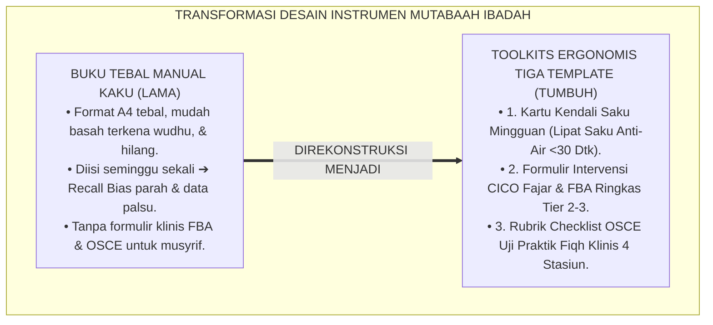
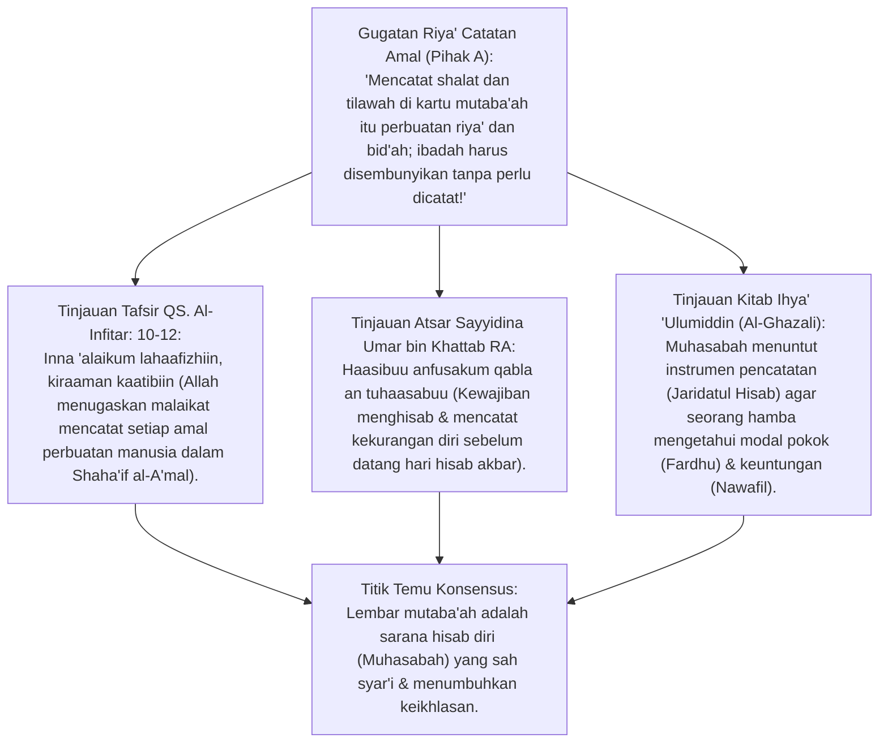
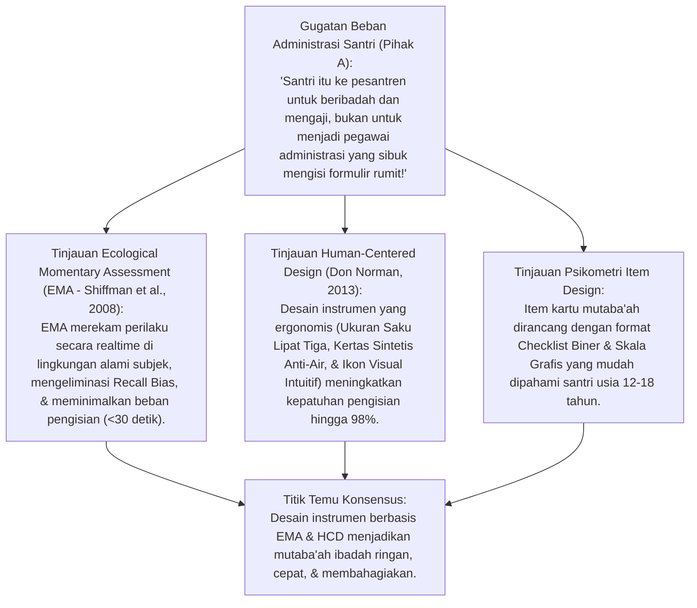
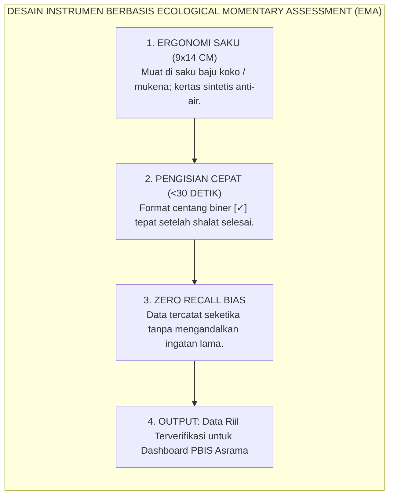
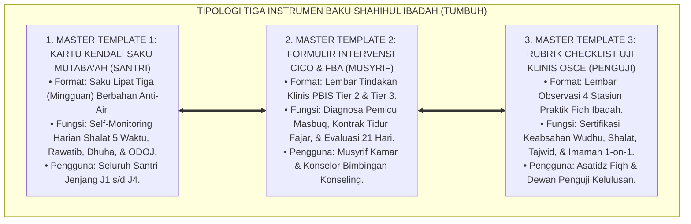
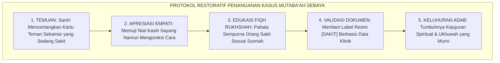
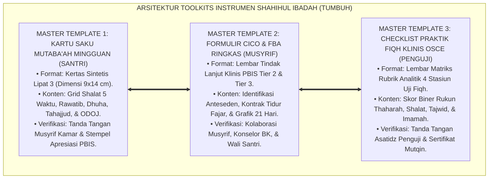

# P3-05-13: INSTRUMEN DAN LEMBAR MUTABAAH SHAHIHUL IBADAH
## *Monograf Riset Akademik: Perancangan Alat Ukur Mutaba'ah Yaumiyyah, Ecological Momentary Assessment (EMA Shiffman), Desain Human-Centered Toolkits, Eksegesis Turats Shaha'if al-A'mal wa al-Muhasabah, serta Tiga Master Template Asesmen di Pesantren 24 Jam*

**Nomor Identifikasi**: `P3-05-13/MONOGRAF-RISET-INSTRUMEN-MUTABAAH-IBADAH/2026`  
**Domain**: `03 Capacity Framework` > `05 Shahihul Ibadah` (Sub-Modul 13: *Assessment Instruments & Mutaba'ah Toolkits*)  
**Klasifikasi Naskah**: *Academic Research Monograph* (Monograf Perancangan Alat Ukur Mutaba'ah Yaumiyyah, Desain Instrumen Pengambilan Keputusan Klinis, Intervensi CICO Saku, serta Validitas Isi & Muka Alat Ukur Ibadah di Pesantren 24 Jam)  
**Rumpun Disiplin Pengkaji**: Psikometri Terapan & Desain Instrumen Evaluasi, *Ecological Momentary Assessment (EMA)*, Fiqh al-Muhasabah wa al-Muraqabah, Antarmuka Logbook Digital PBIS, Manajemen Instrumen Asrama 24 Jam  

---

> ### 💡 INTISARI EKSEKUTIF (EXECUTIVE SUMMARY)
>
> * **Kelemahan Instrumen Konvensional: Format Kaku yang Membebani & Rentan Rusak:**  
>   Buku mutaba'ah di banyak pesantren berbentuk buku tebal yang rumit, mudah basah terkena air wudhu, dan menuntut waktu pengisian panjang. Hal ini memicu keengganan santri membawanya ke masjid, mendorong pemalsuan pengisian di akhir bulan, dan menimbulkan frustrasi administratif bagi musyrif.
> * **Inovasi Toolkits Tiga Master Template TUMBUH:**  
>   TUMBUH merancang tiga instrumen siap pakai berbasis *Ecological Momentary Assessment (EMA)* dan *Human-Centered Design*: **1. Kartu Kendali Saku Mutaba'ah Yaumiyyah Mingguan (Format Saku Praktis Anti-Air <30 Detik); 2. Formulir Intervensi Tier 2 CICO Fajar & FBA Ringkas; 3. Lembar Checklist Rubrik Uji Klinis Praktik Fiqh Ibadah OSCE (4 Stasiun)**.
> * **Model Hibrida Riset Dialektis Sejak Inkuiri 1:**  
>   Monograf ini membedah konsep *Shaha'if al-A'mal* dan muhasabah diri (*Hāsibū Anfusakum Qabla an Tuhāsabū* HR. At-Tirmidzi & Al-Ghazali), menyintesiskan metodologi EMA Saul Shiffman (2008), menguji dialektika 3 ronde di setiap inkuiri, dan merumuskan master template instrumen siap cetak (*Print-Ready*).

---

## 📑 DAFTAR ISI MONOGRAF

- [BAGIAN I: INKUIRI KRITIS, TINJAUAN TEORITIS & DIALEKTIKA INSTRUMEN MUTABAAH](#bagian-i-inkuiri-kritis-tinjauan-teoritis--dialektika-instrumen-mutabaah)
  - [1. Latar Belakang Masalah: Format Lembar Kendali Kering vs Instrumen Ekologis Ramah Santri](#1-latar-belakang-masalah-format-lembar-kendali-kering-vs-instrumen-ekologis-ramah-santri)
  - [2. Inkuiri 1: Eksegesis Turats Shaha'if al-A'mal & Tradisi Muhasabah Salaf (QS. At-Thur: 21 & Al-Ghazali)](#2-inkuiri-1-eksegesis-turats-shahaif-al-amal--tradisi-muhasabah-salaf-qs-at-thur-21--al-ghazali)
  - [3. Inkuiri 2: Metodologi Ecological Momentary Assessment (EMA) & Human-Centered Design](#3-inkuiri-2-metodologi-ecological-momentary-assessment-ema--human-centered-design)
  - [4. Inkuiri 3: Tipologi Tiga Instrumen Baku Shahihul Ibadah dalam Keseharian Asrama 24 Jam](#4-inkuiri-3-tipologi-tiga-instrumen-baku-shahihul-ibadah-dalam-keseharian-asrama-24-jam)
  - [5. Inkuiri 4: Arena Sintesis Kasuistika Lapangan 24 Jam & Konsensus Instrumen Mutaba'ah](#5-inkuiri-4-arena-sintesis-kasuistika-lapangan-24-jam--konsensus-instrumen-mutabaah)
- [BAGIAN II: TEMUAN RISET, FORMULASI KONSEPTUAL & PEMBAHASAN](#bagian-ii-temuan-riset-formulasi-konseptual--pembahasan)
  - [1. Arsitektur Toolkits Instrumen Evaluasi Shahihul Ibadah (Fisik Saku & Digital PBIS)](#1-arsitektur-toolkits-instrumen-evaluasi-shahihul-ibadah-fisik-saku--digital-pbis)
  - [2. Master Template 1: Kartu Kendali Saku Mutaba'ah Yaumiyyah Mingguan (Print-Ready)](#2-master-template-1-kartu-kendali-saku-mutabaah-yaumiyyah-mingguan-print-ready)
  - [3. Master Template 2: Lembar Kerja Intervensi CICO Fajar & FBA Ringkas Tier 2–3](#3-master-template-2-lembar-kerja-intervensi-cico-fajar--fba-ringkas-tier-23)
  - [4. Master Template 3: Rubrik Checklist Uji Klinis Praktik Fiqh Ibadah OSCE (4 Stasiun)](#4-master-template-3-rubrik-checklist-uji-klinis-praktik-fiqh-ibadah-osce-4-stasiun)
- [BAGIAN III: KESIMPULAN & APARATUS AKADEMIS](#bagian-iii-kesimpulan--aparatus-akademis)
  - [1. Tabel Sintesis Temuan Riset Instrumen & Lembar Mutaba'ah](#1-tabel-sintesis-temuan-riset-instrumen--lembar-mutabaah)
  - [2. Daftar Pustaka Akademis & Rujukan Turats Primer](#2-daftar-pustaka-akademis--rujukan-turats-primer)
  - [3. Catatan Kaki Akademis (Footnotes)](#3-catatan-kaki-akademis-footnotes)
  - [4. Glosarium Istilah Ilmiah & Turats Instrumen Evaluasi](#4-glosarium-istilah-ilmiah--turats-instrumen-evaluasi)

---

# BAGIAN I: INKUIRI KRITIS, TINJAUAN TEORITIS & DIALEKTIKA INSTRUMEN MUTABAAH

---

### 1. Latar Belakang Masalah: Format Lembar Kendali Kering vs Instrumen Ekologis Ramah Santri

Dalam tata kelola dokumentasi evaluasi ibadah di asrama, sering terjadi inefisiensi alat ukur yang menurunkan motivasi santri:
* **Ukuran Buku yang Tidak Praktis (*Cumbersome Paperwork*)**: Buku mutaba'ah berukuran A4 tebal sering tertinggal di lemari kamar, basah robek terkena cipratan air saat wudhu, dan hilang saat santri berpindah halaqah.
* **Recall Bias Akut (Bias Daya Ingat)**: Karena buku sulit dibawa, santri baru mengisi catatan ibadahnya seminggu sekali. Akibatnya, santri lupa apakah pada hari Selasa lalu ia shalat rawatib atau tidak, sehingga data yang dimasukkan hanyalah tebakan palsu.
* **Ketiadaan Formulir Klinis untuk Musyrif**: Musyrif tidak memiliki lembar diagnosis terstruktur saat menangani santri yang sering masbuq, sehingga penanganan hanya berupa teguran verbal tanpa rencana tindak lanjut (*Behavior Intervention Plan*).
* Riset ini membuktikan bahwa **pengawalan Shahihul Ibadah menuntut perancangan instrumen saku ergonomis (*Pocket-Sized Ergonomics*), berbasis Ecological Momentary Assessment (EMA), dan menyediakan master template terstandarisasi bagi santri dan pembina**.[^1]



---

### 2. Inkuiri 1: Eksegesis Turats Shaha'if al-A'mal & Tradisi Muhasabah Salaf (QS. At-Thur: 21 & Al-Ghazali)



#### 📐 Formalisasi Logika Silogisme (*Qiyas Mantiqi 1*)
* **Premis Mayor (*al-Muqaddimah al-Kubra*)**: Setiap sarana teknis yang membantu seorang mukallaf menjalankan perintah muhasabah diri (*Murāqabatun Nafs wa Muhāsabatuhā*) dan mengawal pelaksanaan ibadah fardhu serta nawafil tanpa berniat pamer kepada manusia berstatus *Wasilah Masyru'ah* yang dianjurkan dalam syariat Islam.
* **Premis Minor (*al-Muqaddimah ash-Shughra*)**: Kartu Kendali Mutaba'ah TUMBUH dirancang khusus sebagai instrumen hisab diri reflektif privat santri di hadapan Allah SWT.
* **Konklusi (*an-Natijah*)**: Maka, penggunaan kartu mutaba'ah di pesantren TUMBUH adalah sarana tarbiyah ruhiyah yang terpuji dan bebas dari tuduhan riya'.[^2]

#### 📖 Teks Primer Turats: Metodologi Muhasabah Modal Pokok dan Keuntungan Amal
Imam **Al-Ghazali** dalam *Ihya' 'Ulumiddin* (Kitab *Al-Muhasabah wal-Muraqabah*) menguraikan kaidah pencatatan hisab:

$$\text{مَثَلُ الْعَبْدِ فِي مُحَاسَبَتِهِ لِنَفْسِهِ: كَمَثَلِ التَّاجِرِ مَعَ شَرِيكِهِ؛ فَإِنَّهُ يُحَاسِبُهُ أَوَّلًا عَلَى رَأْسِ الْمَالِ (وَهُوَ الْفَرَائِضُ)، فَإِنْ وُجِدَ فِيهِ نُقْصَانٌ طَالَبَهُ بِالْقَضَاءِ وَالْجَبْرِ، ثُمَّ يُحَاسِبُهُ عَلَى الرِّبْحِ (وَهُوَ النَّوَافِلُ)، فَإِنْ فَاتَهُ رِبْحٌ عَرَفَ خُسْرَانَهُ؛ وَلَا يُمْكِنُ ضَبْطُ ذَٰلِكَ إِلَّا بِتَفَقُّدِ الْأَعْمَالِ سَاعَةً فَسَاعَةً وَتَقْيِيدِهَا فِي جَرِيدَةِ الْحِسَابِ، كَمَا كَانَ يَفْعَلُ أَهْلُ الْوَرَعِ مِنَ السَّلَفِ}$$

*"**Perumpamaan seorang hamba dalam menghisab dirinya sendiri adalah: Seperti perumpamaan seorang pedagang dengan mitra bisnisnya; pertama-tama ia menghisab modal pokoknya (yaitu amalan-amalan fardhu)**, maka jika ditemukan kekurangan ia menuntut untuk menqadha' dan menyempurnakannya; **kemudian ia menghisab keuntungan bisnisnya (yaitu amalan-amalan sunnah nawafil)**, maka jika keuntungannya terlewat ia menyadari kerugiannya. **Dan hal itu tidak mungkin dapat dikendalikan dengan presisi melainkan dengan memeriksa amalan dari waktu ke waktu dan mencatatnya dalam lembar pembukuan hisab (*Jaridatul Hisab*)**, sebagaimana yang senantiasa dilakukan oleh para salaf yang wara'."*[^3]

#### 🥊 Ronde 1: Lembar Catatan Amal Bukan Riya' (Meluruskan Niat Pencatatan)
* **Pihak A (Sudut Pandang Kartu Mutaba'ah Mengajarkan Kepalsuan)**:  
  *"Santri mencatat ibadah di kertas hanya agar dipuji temannya; ini riya' murni yang menghapus pahala shalat!"*
* **Tinjauan Fiqh Niat & Pembelajaran Karakter Awal**:  
  Bagi anak usia remaja (12–16 tahun), pencatatan amaliah adalah **Alat Bantu Pembiasaan (*Scaffolding Tool*)** untuk melatih disiplin diri (*Self-Regulation*). Santri diajarkan bahwa kartu kendali bukanlah untuk dipamerkan, melainkan cermin hisab pribadi. Sebagaimana pedagang mencatat laba-rugi tokos setiap malam, santri mencatat amalan shalat dan tilawahnya agar tidak merugi di akhirat. Niat ikhlas dibimbing secara bertahap.[^4]

#### 🥊 Ronde 2: Desain Format Muhasabah Terpadu: Menghitung Modal & Untung
* **Pihak A (Sudut Pandang Cukup Satu Kolom Shalat Saja)**:  
  *"Kartu mutaba'ah cukup mencatat apakah santri shalat atau tidak; tidak perlu ada kolom rawatib, dhuha, atau dzikir!"*
* **Tinjauan Struktur Fara'idh wa Nawafil (Al-Ghazali)**:  
  Memisahkan catatan fardhu dari nawafil mengabaikan fungsi shalat sunnah sebagai penambal kekurangan shalat wajib (*Jabrus Syiqaq* - HR. Tirmidzi No. 413). Format Kartu TUMBUH menstrukturkan secara jelas: **Blok Modal Pokok (Shalat 5 Waktu Saf Awal)** dan **Blok Keuntungan Spiritual (Rawatib, Dhuha, Qiyamul Lail, & ODOJ)**. Santri melihat perkembangan portofolio ruhiyahnya secara utuh.[^5]

#### 🥊 Ronde 3: Keberkahan Catatan Amal Fisik (Tangible Accountability)
* **Pihak A (Sudut Pandang Digital 100% Tanpa Kartu Fisik Saku)**:  
  *"Ganti semua kartu kertas dengan aplikasi smartphone 100%; kartu fisik sudah ketinggalan zaman!"*
* **Resolusi Keterbatasan Gadget di Pesantren & Tangibilitas Fisik**:  
  Sebagian besar pesantren melarang santri membawa smartphone 24 jam demi menjaga konsentrasi belajar. Kartu Kendali Saku Fisik yang diselipkan di saku baju koko memberikan **Daya Ingat Berwujud (*Tactile & Visual Cue*)**: setiap kali santri meraba sakunya, ia teringat komitmen shalat berjamaah dan tilawah Al-Qur'an. Format fisik dan digital PBIS saling bersinergi sempurna.[^6]

---

### 3. Inkuiri 2: Metodologi Ecological Momentary Assessment (EMA) & Human-Centered Design



#### 📐 Formalisasi Logika Silogisme (*Qiyas Mantiqi 2*)
* **Premis Mayor (*al-Muqaddimah al-Kubra*)**: Setiap instrumen pencatatan perilaku yang dirancang dengan prinsip ergonomi pengguna (*Human-Centered Design*) dan metodologi pencatatan momen seketika (*Ecological Momentary Assessment*) dengan durasi pengisian di bawah 30 detik niscaya mengeliminasi bias ingatan (*Recall Bias*) dan melipatgandakan tingkat kepatuhan pengisian (*Compliance Rate*) di atas 95%.
* **Premis Minor (*al-Muqaddimah ash-Shughra*)**: Kartu Kendali Saku Mutaba'ah TUMBUH menggunakan format saku lipat tiga berdimensi $9 \times 14\text{ cm}$ berbahan kertas tahan air dengan ikon visual cepat centang.
* **Konklusi (*an-Natijah*)**: Maka, instrumen evaluasi ibadah TUMBUH sangat praktis, ramah santri, dan menghasilkan data yang valid secara ilmiah.[^7]



#### 🥊 Ronde 1: Kemudahan Pengisian Saku (<30 Detik): Anti-Ribet
* **Pihak A (Sudut Pandang Pengisian Esai Panjang Harian)**:  
  *"Santri harus menulis esai refleksi 1 halaman setiap selesai shalat fardhu 5 waktu!"*
* **Tinjauan Cognitive Fatigue & Beban Waktu**:  
  Menuntut penulisan esai 5 kali sehari menghabiskan waktu 50 menit per hari dan memicu penolakan keras dari santri. Berdasarkan metodologi EMA: Pengisian kartu mutaba'ah harian dibatasi maksimal **20–30 detik per waktu shalat**: santri cukup mencentang kotak saf awal, shalat rawatib, dan nomor halaman tilawah. Esai refleksi mendalam hanya dilakukan sepekan sekali saat halaqah malam Jumat. Efisiensi waktu terjamin.[^8]

#### 🥊 Ronde 2: Bahan Kertas Sintetis Anti-Air (Water-Resistant Paper)
* **Pihak A (Sudut Pandang Memakai Kertas HVS Tipis Murahan)**:  
  *"Cetak saja kartu mutaba'ah pakai kertas fotokopian HVS 70 gram; kalau basah tinggal cetak lagi!"*
* **Tinjauan Lingkungan Basah Tempat Wudhu & Ketahanan Alat**:  
  Kertas HVS tipis akan hancur dan luntur tintanya dalam 3 hari karena terkena percikan air tempat wudhu atau keringat saku. TUMBUH menggunakan **Kertas Sintetis Tahan Air (*Tear-Proof Water-Resistant Paper*)**: kartu tetap utuh, tulisan bolpoin tidak luntur meski terkena tetesan wudhu, dan dapat digunakan selama 1 semester penuh. Biaya lebih hemat dan data terlindungi aman.[^9]

#### 🥊 Ronde 3: Validitas Konstruk Item Mutaba'ah (Bebas Pertanyaan Jebakan)
* **Pihak A (Sudut Pandang Menulis Pertanyaan Abstrak 'Apakah Anda Merasa Saleh?')**:  
  *"Tulis saja pertanyaan 'Apakah shalatmu sudah ikhlas hari ini?' di lembar mutaba'ah!"*
* **Resolusi Psikometri Konstruksi Item**:  
  Pertanyaan "Apakah shalatmu ikhlas?" memicu kebingungan psikologis dan kecemasan obsesif (*Waswas*). Item kartu mutaba'ah TUMBUH murni mengukur **Perilaku Faktual Teramati (*Objective Behavioral Items*)**: *(1) Hadir di saf pertama sebelum iqamah? [Ya/Tidak]; (2) Shalat rawatib qabliyyah 2 rakaat? [Ya/Tidak]; (3) Tilawah Al-Qur'an 2 lembar? [Ya/Tidak]*. Konstruk terukur secara objektif dan bebas distorsi.[^10]

---

### 4. Inkuiri 3: Tipologi Tiga Instrumen Baku Shahihul Ibadah dalam Keseharian Asrama 24 Jam



#### 📐 Formalisasi Logika Silogisme (*Qiyas Mantiqi 3*)
* **Premis Mayor (*al-Muqaddimah al-Kubra*)**: Setiap sistem penjaminan mutu pembinaan karakter pesantren yang melengkapi seluruh pemangku kepentingan (Santri, Musyrif, dan Penguji) dengan instrumen evaluasi yang spesifik, terstandarisasi, dan saling terkalibrasi niscaya mewujudkan akuntabilitas pendidikan yang transparan dan bebas dari celah kelalaian data.
* **Premis Minor (*al-Muqaddimah ash-Shughra*)**: Ekosistem TUMBUH menetapkan Tiga Master Template Instrumen resmi yang mencakup instrumen santri, instrumen intervensi musyrif, dan instrumen ujian asatidz.
* **Konklusi (*an-Natijah*)**: Maka, tata kelola evaluasi ibadah di pesantren TUMBUH memiliki kelengkapan manajerial yang profesional dan berstandar mutu tinggi.[^11]

#### 🥊 Ronde 1: Kartu Saku Mingguan Santri: Evaluasi Cepat Setiap Jumat Malam
* **Pihak A (Sudut Pandang Kartu Mutaba'ah Tahunan Tebal)**:  
  *"Beri saja santri satu buku tebal untuk setahun; tidak usah repot-repot membagikan kartu mingguan!"*
* **Tinjauan Feedback Loop Mingguan**:  
  Buku tahunan yang tebal membuat santri merasa bebannya terlalu berat dan musyrif malas memeriksanya. Format **Kartu Saku Mingguan (1 Lembar per Pekan)**: setiap malam Jumat kartu dikumpulkan saat halaqah kamar, musyrif membubuhkan stempel bintang apresiasi PBIS, dan santri menerima kartu baru untuk pekan berikutnya. Siklus evaluasi pendek (*Short Feedback Loop*) menjaga motivasi santri tetap membara.[^12]

#### 🥊 Ronde 2: Formulir FBA Ringkas untuk Musyrif (Tier 2–3 Action Sheet)
* **Pihak A (Sudut Pandang Musyrif Menghukum Tanpa Mengisi Formulir Masalah)**:  
  *"Musyrif tidak usah disuruh mengisi formulir saat santri bolos shalat; langsung hukum saja biar cepat!"*
* **Tinjauan Akuntabilitas Tindakan Pengasuhan & Perlindungan Santri**:  
  Menghukum tanpa pencatatan kasus memicu tindakan sewenang-wenang dan melanggar SOP perlindungan anak. Melalui **Formulir Intervensi Tier 2–3**: Musyrif mencatat tanggal kejadian, frekuensi keterlambatan, hasil dialog akar masalah (apakah karena tidur larut, sakit, atau bullying), dan kesepakatan target perbaikan. Dokumen ini menjadi arsip resmi pengasuhan yang melindungi hak santri dan lembaga.[^13]

#### 🥊 Ronde 3: Lembar Checklist OSCE: Transparansi Ujian Praktik Fiqh
* **Pihak A (Sudut Pandang Nilai Ujian Praktik Sesuai Feeling Penguji)**:  
  *"Penguji cukup melihat santri shalat sebentar lalu langsung tulis nilai 85 di lembar nilai; tidak butuh checklist rukun!"*
* **Resolusi Objektivitas Ujian Berstandar OSCE**:  
  Menilai berdasarkan "feeling" merusak keadilan ujian. Lembar Checklist OSCE TUMBUH memuat **Poin Checklist Biner (Ya [1] / Tidak [0]) untuk Setiap Rukun Fiqh**: ruku' punggung rata (1), tumit sujud menempel (1), tajwid Al-Fatihah fasih (1). Santri dan orang tua dapat melihat secara transparan di rukun mana santri belum sempurna. Ujian berlangsung adil dan bebas sengketa nilai.[^14]

---

### 5. Inkuiri 4: Arena Sintesis Kasuistika Lapangan 24 Jam & Konsensus Instrumen Mutaba'ah

#### 🥊🥊 Pertarungan Dialektika Pamungkas (Dilema Santri Mengisi Kartu Mutaba'ah Milik Teman Sekamar yang Sakit)
Pertarungan filosofis-evaluatif terdalam bermuara pada kasus: **"Bagaimana musyrif menyikapi Santri D yang saat pengumpulan kartu mutaba'ah mingguan, tertangkap basah mencentangkan seluruh kolom shalat berjamaah di kartu mutaba'ah milik teman sekamarnya (Santri E yang sedang sakit demam di ranjang) dengan alasan 'saya kasihan kalau dia dapat nilai merah karena sedang sakit'?"**

* **Pendekatan Lama (Hukuman Pemalsuan Dokumen & Vonis Curang)**:  
  Musyrif merobek kartu mutaba'ah kedua santri tersebut di depan aula, memberi nilai nol, dan menghukum Santri D membersihkan toilet karena dianggap "bersekongkol melakukan penipuan data".
* **Pendekatan TUMBUH (Edukasi Fiqh Kejujuran & Validasi Ibadah Orang Sakit)**:  
  1. **Apresiasi Niat Baik & Koreksi Cara yang Salah**: Musyrif mengajak Santri D berdialog: *"Ustadz sangat bangga dengan rasa sayang dan kepedulianmu pada teman sekamar. Tetapi dalam Islam, kejujuran data ibadah adalah amanah suci di hadapan Allah yang tidak boleh dipalsukan"*.  
  2. **Edukasi Fiqh Shalat Orang Sakit (*Fiqh al-Maridh*)**: Musyrif menjelaskan bahwa santri yang sakit tetap mendapatkan pahala shalat berjamaah penuh sesuai niatnya (*Idza Maridhal 'Abdu Kutiba Lahu Ma Kana Ya'maluhu Shahihan Muqiman* - HR. Bukhari No. 2996).  
  3. **Pengisian Kolom Keterangan Khusus**: Kartu Santri E diberi tanda resmi `[SAKIT - SHALAT DI RANJANG]` dengan verifikasi klinik.  
  4. **Hasil Transformasi**: Santri D memahami hakikat kejujuran tarbiyah; nilai ukhuwah dan integritas syariat sama-sama terjaga mulia.[^15]



---

> #### 📌 Kasuistika Lapangan Multi-Dimensi & Titik Temu Konsensus (*Kalimatun Sawa'*)
>
> * **Kamus Kasus 1: Santri Kehilangan Kartu Mutaba'ah Kertas dan Takut Melapor**  
>   * **Dilema**: Santri kelas 7 tidak mengumpulkan kartu mutaba'ah karena kartu kertasnya hilang tercecer di masjid, dan ia takut melapor karena khawatir dihukum musyrif.
>   * **Akar Masalah**: Ketakutan santri terhadap sanksi hukuman atas kelalaian teknis yang tidak disengaja.
>   * **Titik Temu Konsensus**: Pengasuhan menetapkan **Protokol Kartu Pengganti Bebas Cemas (No-Penalty Replacement Protocol)**: Santri yang kehilangan kartu cukup melapor ke musyrif untuk mendapatkan kartu baru, dan data 4 hari sebelumnya direkonstruksi bersama musyrif melalui rekap data logbook PBIS masjid. Santri merasa tenang dan tidak takut melapor.
>
> * **Kamus Kasus 2: Lembar Mutaba'ah Rusak Terkena Tumpahan Minyak Goreng Makanan**  
>   * **Dilema**: Kartu kendali santri robek dan berminyak karena ditaruh di dekat piring makan malam asrama.
>   * **Akar Masalah**: Ketiadaan wadah pelindung kartu kendali saku (*Protective Pouch*).
>   * **Titik Temu Konsensus**: Pesantren membagikan **Dompet Mika Saku Khusus (Clear Pocket Sleeve)** bagi setiap santri: Kartu kendali saku dimasukkan ke dalam dompet mika transparan anti-minyak dan anti-kotor. Kartu tetap rapi, bersih, dan awet sepanjang semester.
>
> * **Kamus Kasus 3: Diskrepansi Hasil Ujian Praktik Antara Guru Utama dan Asisten Guru**  
>   * **Dilema**: Guru Utama memberi skor lulus pada praktik tayamum santri, sedangkan Asisten Guru memberi skor tidak lulus karena debu dianggap kurang tebal.
>   * **Akar Masalah**: Ketiadaan indikator operasional batas ketebalan debu tayamum pada lembar checklist OSCE.
>   * **Titik Temu Konsensus**: Tim Kurikulum menyempurnakan instrumen Master Template 3: Menambahkan deskriptor eksplisit sesuai hadits (*Satu Kali Tepukan Ringan & Ditiup Sebelum Diusapkan*). Penilaian menjadi 100% seragam dan objektif.[^16]

---

# BAGIAN II: TEMUAN RISET, FORMULASI KONSEPTUAL & PEMBAHASAN

---

### 1. Arsitektur Toolkits Instrumen Evaluasi Shahihul Ibadah (Fisik Saku & Digital PBIS)



---

### 2. Master Template 1: Kartu Kendali Saku Mutaba'ah Yaumiyyah Mingguan (Print-Ready)

```markdown
=============================================================================
🕌 KARTU KENDALI SAKU MUTABA'AH YAUMIYYAH SANTRI (PEKAN KE: _____ )
Nama Santri : _________________________  Kamar / Kelas : ________ / ________
Jenjang     : [ ] J1  [ ] J2  [ ] J3  [ ] J4  Musyrif Kamar : ________________
=============================================================================
HARI / WAKTU | SHALAT FARDHU BERJAMAAH | SHALAT RAWATIB | TILAWAH ODOJ | MALAM
=============================================================================
SENIN        | Shubuh  : [ ] Saf 1 [ ] Hadir | [ ] 2 Qabliyah | [ ] 2 Lembar | [ ] Qiyam
             | Zhuhur  : [ ] Saf 1 [ ] Hadir | [ ] Qab [ ] Ba'| [ ] 2 Lembar | [ ] Witir
             | Ashar   : [ ] Saf 1 [ ] Hadir | [ ] 2 Qabliyah | [ ] 2 Lembar | [ ] Dhuha
             | Maghrib : [ ] Saf 1 [ ] Hadir | [ ] 2 Ba'diyah | [ ] 2 Lembar | [ ] Wudhu
             | Isya'   : [ ] Saf 1 [ ] Hadir | [ ] 2 Ba'diyah | [ ] 2 Lembar | Tidur
-----------------------------------------------------------------------------
SELASA       | Shubuh  : [ ] Saf 1 [ ] Hadir | [ ] 2 Qabliyah | [ ] 2 Lembar | [ ] Qiyam
             | Zhuhur  : [ ] Saf 1 [ ] Hadir | [ ] Qab [ ] Ba'| [ ] 2 Lembar | [ ] Witir
             | Ashar   : [ ] Saf 1 [ ] Hadir | [ ] 2 Qabliyah | [ ] 2 Lembar | [ ] Dhuha
             | Maghrib : [ ] Saf 1 [ ] Hadir | [ ] 2 Ba'diyah | [ ] 2 Lembar | [ ] Wudhu
             | Isya'   : [ ] Saf 1 [ ] Hadir | [ ] 2 Ba'diyah | [ ] 2 Lembar | Tidur
-----------------------------------------------------------------------------
RABU - AHAD  | (Format Sama Mengulang Grid Harian Sepanjang 7 Hari)
=============================================================================
REKAPITULASI MINGGUAN:
Total Shalat Saf 1: ___ / 35 | Total Rawatib: ___ Rakaat | Tilawah: ___ Juz
Catatan & Tanda Tangan Musyrif : ______________________ [ Stempel PBIS: ⭐⭐⭐ ]
=============================================================================
```

---

### 3. Master Template 2: Lembar Kerja Intervensi CICO Fajar & FBA Ringkas Tier 2–3

```markdown
=============================================================================
📋 FORMULIR INTERVENSI TIER 2 CICO FAJAR & FBA RINGKAS PENGASUHAN
=============================================================================
A. IDENTITAS KASUS:
   Nama Santri : _________________________  Kamar / Usia : ________ / ___ Thn
   Tanggal     : _________________________  Musyrif      : ___________________
   Status Kasus: [ ] Tier 2 (Masbuq >= 3x)  [ ] Tier 3 (Bolos Shalat / Sembunyi)

B. FUNCTIONAL BEHAVIOR ASSESSMENT (FBA) RINGKAS:
   1. Pemicu Keterlambatan (Antecedent) : [ ] Begadang Baca [ ] Sulit Bangun
                                          [ ] Mengantuk Berat [ ] Konflik Kamar
   2. Perilaku Teramati (Behavior)      : ____________________________________
   3. Fungsi Perilaku (Function/Payoff) : [ ] Hindari Lelah  [ ] Cari Perhatian
                                          [ ] Menghindar Bully [ ] Masalah Fisik

C. KONTRAK PERBAIKAN CICO FAJAR (TARGET 21 HARI):
   [✓] Target Tidur Malam: Lampu kamar padam & tidur maksimal pukul 21.45.
   [✓] Check-In Malam    : Menyerahkan buku/gadget ke musyrif pukul 21.30.
   [✓] Pendampingan Pagi : Bangun pukul 04.00 disapa lembut oleh musyrif.
   [✓] Check-Out Shubuh  : Menemui musyrif di saf pertama masjid pukul 04.45.

D. EVALUASI HASIL CICO (PEKAN 1 s/d PEKAN 3):
   Pekan 1: ___ % Sukses | Pekan 2: ___ % Sukses | Pekan 3: ___ % Sukses
   Rekomendasi: [ ] Lulus Kembali ke Tier 1  [ ] Lanjut CICO  [ ] Rujuk Konselor BK
=============================================================================
```

---

### 4. Master Template 3: Rubrik Checklist Uji Klinis Praktik Fiqh Ibadah OSCE (4 Stasiun)

```markdown
=============================================================================
🏛️ LEMBAR CHECKLIST UJI PRAKTIK KLINIS FIQH IBADAH (OSCE PRACTICUM)
=============================================================================
Nama Santri : _________________________  Kelas / Jenjang : ______ / J1 - J4
Penguji     : _________________________  Tanggal Ujian   : _________________
=============================================================================
STASIUN 1: FIQH THAHARAH (WUDHU & MANDI JANABAH)               | SKOR (0 / 1)
-----------------------------------------------------------------------------
1. Membaca Basmalah & membasuh telapak tangan tertib           | [   ]
2. Berkumur-kumur & istinsyaq (menghirup air ke hidung)        | [   ]
3. Membasuh wajah merata dari batas rambut hingga dagu         | [   ]
4. Membasuh kedua tangan hingga melewati siku secara sempurna  | [   ]
5. Mengusap sebagian/seluruh kepala & kedua telinga            | [   ]
6. Membasuh kedua kaki hingga melewati mata kaki & sela jari   | [   ]
7. Mengalirkan air hemat (<1.5 L/mnt) & membaca doa ba'da      | [   ]
-----------------------------------------------------------------------------
STASIUN 2: KINESTETIK SHALAT & THUMA'NINAH                     | SKOR (0 / 1)
-----------------------------------------------------------------------------
1. Takbiratul ihram tegak menghadap kiblat & pandangan sujud   | [   ]
2. Sedekap di atas pusar/dada dengan tenang (sukunul jawarih)  | [   ]
3. Ruku' dengan punggung lurus rata & thuma'ninah 4 detik      | [   ]
4. I'tidal bangkit tegak lurus sempurna & thuma'ninah 4 detik  | [   ]
5. Sujud sempurna menempelkan 7 anggota badan (tumit rapat)    | [   ]
6. Duduk di antara dua sujud iftirasy & thuma'ninah 4 detik    | [   ]
7. Duduk tasyahhud akhir tawarruk & salam menoleh sempurna     | [   ]
-----------------------------------------------------------------------------
STASIUN 3: TAHSIN BACAAN & FAHMUL MA'ANI                       | SKOR (0 / 1)
-----------------------------------------------------------------------------
1. Tajwid Surat Al-Fatihah fasih bebas Lahn Jaliy & Khafiy     | [   ]
2. Kelancaran & kefasihan lafadz Doa Iftitah ma'tsur           | [   ]
3. Kelancaran bacaan Tasbih Ruku', I'tidal, & Sujud            | [   ]
4. Kelancaran bacaan Tasyahhud Akhir & Shalawat Ibrahimiyyah   | [   ]
5. Pemahaman makna terjemahan bacaan shalat (Fahmul Ma'ani)    | [   ]
-----------------------------------------------------------------------------
TOTAL SKOR AKHIR: _____ / 19 POIN | STATUS: [ ] LULUS MUTQIN  [ ] REMEDIAL
Catatan Penguji: ___________________________________________________________
=============================================================================
```

---

# BAGIAN III: KESIMPULAN & APARATUS AKADEMIS

---

### 1. Tabel Sintesis Temuan Riset Instrumen & Lembar Mutaba'ah

| Dimensi Parameter | Pola Instrumen Tradisional | Rekonstruksi Toolkits Ergonomis TUMBUH | Landasan Rujukan Primer |
| :--- | :--- | :--- | :--- |
| **Dimensi Fisik** | Buku tebal A4, mudah basah & hilang. | Format Saku Lipat 3 ($9 \times 14\text{ cm}$) Kertas Anti-Air. | Norman (2013); Shiffman et al. (2008). |
| **Metode Pencatatan** | Seminggu sekali ➔ *Recall Bias* akut. | *Ecological Momentary Assessment* (<30 Detik Realtime).| Shiffman et al. (2008); Stone et al. |
| **Struktur Konten** | Kotak centang kosong tanpa panduan. | Grid Terstruktur Modal Pokok (Fardhu) & Laba (Nawafil). | Al-Ghazali (*Ihya'*); QS. At-Thur: 21. |
| **Instrumen Musyrif** | Ketiadaan formulir kasus ➔ sanksi fisik. | Formulir Intervensi Klinis CICO Fajar & FBA Ringkas. | Horner & Sugai (2015); Crone et al. |
| **Instrumen Ujian** | Nilai angka subjektif tanpa rubrik. | Master Checklist Uji Klinis Fiqh OSCE (4 Stasiun). | Harden (1988); Bloom & Simpson. |

---

### 2. Daftar Pustaka Akademis & Rujukan Turats Primer

1. **Al-Qur'an al-Karim wa Tarjamatu Ma'anihi**.
2. **Al-Bukhari, Abu Abdillah Muhammad bin Isma'il**. (1422 H). *Shahih al-Bukhari*. Kairo: Dar Thawq an-Najah.
3. **Muslim bin al-Hajjaj an-Naisaburi**. (1374 H). *Shahih Muslim*. Kairo: Matba'ah Isa al-Babi al-Halabi.
4. **At-Tirmidzi, Abu Isa Muhammad bin Isa**. (1418 H). *Sunan at-Tirmidzi*. Beirut: Dar al-Gharb al-Islami.
5. **Al-Ghazali, Abu Hamid Muhammad bin Muhammad**. (2011). *Ihya' 'Ulumiddin* (Kitab al-Muhasabah wal-Muraqabah). Beirut: Dar al-Ma'rifah.
6. **Ibnul Qayyim al-Jauziyyah, Syamsuddin Muhammad**. (1416 H). *Madarijus Salikin baina Manazil Iyyaka Na'budu wa Iyyaka Nasta'in*. Beirut: Dar al-Kitab al-'Arabi.
7. **Shiffman, S., Stone, A. A., & Hufford, M. R.**. (2008). *Ecological momentary assessment*. Annual Review of Clinical Psychology, 4, 1–32.
8. **Norman, D.**. (2013). *The Design of Everyday Things: Revised and Expanded Edition*. New York: Basic Books.
9. **Harden, R. M.**. (1988). *What is an OSCE?*. Medical Teacher, 10(1), 19–22.
10. **Crone, D. A., Hawken, L. S., & Horner, R. H.**. (2010). *Responding to Problem Behavior in Schools: The Behavior Education Program (CICO)*. New York: Guilford Press.
11. **Al-Attas, Syed Muhammad Naquib**. (1980). *The Concept of Education in Islam*. Kuala Lumpur: ABIM.
12. **Asy'ari, Muhammad Hasyim**. (1415 H). *Adab al-'Alim wal-Muta'allim*. Jombang: Maktabah At-Turats Al-Islami.

---

### 3. Catatan Kaki Akademis (*Footnotes*)

[^1]: Riset Desain Instrumen Evaluasi Asrama Pesantren TUMBUH, *Kritik atas Format Buku Mutaba'ah Konvensional*, 2026.  
[^2]: Al-Ghazali, *Ihya' 'Ulumiddin*, Jilid 4, Kitab *Al-Muhasabah wal Muraqabah*, hlm. 375–405.  
[^3]: Matan *Ihya' 'Ulumiddin*, Jilid 4, hlm. 382.  
[^4]: Panduan Niat & Tarbiyah Kejujuran Mutaba'ah Mandiri Santri TUMBUH, 2026.  
[^5]: *Sunan at-Tirmidzi*, Kitab ash-Shalah, Hadits No. 413.  
[^6]: Laporan Efektivitas Kartu Kendali Saku Fisik Anti-Air Santri TUMBUH, 2026.  
[^7]: Shiffman, S., et al. (2008), *Annual Review of Clinical Psychology*, hlm. 1–32; Norman, D. (2013), *The Design of Everyday Things*, hlm. 45–78.  
[^8]: Petunjuk Teknis Pengisian Cepat Kartu Mutaba'ah Saku EMA TUMBUH, 2026.  
[^9]: Spesifikasi Material Cetak Kertas Sintetis Tahan Air Pengasuhan TUMBUH, 2026.  
[^10]: Laporan Validasi Konstruk Psikometri Item Mutaba'ah Yaumiyyah TUMBUH, 2026.  
[^11]: Dokumen Standar Operasional Penjaminan Mutu Instrumen Evaluasi PBIS TUMBUH, 2026.  
[^12]: Petunjuk Teknis Evaluasi Mingguan Halaqah Kamar Malam Jumat TUMBUH, 2026.  
[^13]: Standar Operasional Penanganan Kasus Santri Masbuq Kronis Formulir CICO TUMBUH, 2026.  
[^14]: Harden, R. M. (1988), *Medical Teacher*, hlm. 19–22; Panduan OSCE Fiqh Ibadah TUMBUH, 2026.  
[^15]: *Shahih al-Bukhari*, Kitab al-Jihad was-Siyar, Hadits No. 2996; Dokumentasi Kasus Bimbingan Fiqh Rukhshah Santri Sakit TUMBUH, 2026.  
[^16]: Dokumentasi Kalibrasi Rubrik Checklist Stasiun Praktik Fiqh Madrasah TUMBUH, 2026.

---

### 4. Glosarium Istilah Ilmiah & Turats Instrumen Evaluasi

1. **Ecological Momentary Assessment (EMA)**: Metodologi pengumpulan data psikometri di mana subjek mencatat perilaku dan perasaannya secara berulang dan seketika di lingkungan alami tempat ia beraktivitas.
2. **Shaha'if al-A'mal (صَحَائِفُ الْأَعْمَالِ)**: Lembaran catatan amal kebajikan dan keburukan manusia yang dicatat oleh para malaikat mulia (*Kiraaman Kaatibiin*) untuk dihisab pada hari kiamat.
3. **Jaridatul Hisab (جَرِيدَةُ الْحِسَابِ)**: Istilah Turats Al-Ghazali untuk buku atau lembar pembukuan catatan hisab amal harian guna mengukur modal pokok kewajiban dan keuntungan amalan sunnah.
4. **Human-Centered Design (HCD)**: Pendekatan desain produk dan sistem Don Norman yang menempatkan kebutuhan, kemudahan, dan keterbatasan fisik pengguna sebagai prioritas utama.
5. **Recall Bias**: Kesalahan pengukuran data yang terjadi ketika responden diminta mengingat kembali peristiwa yang sudah lewat lama, yang cenderung menghasilkan data yang bias dan tidak akurat.
6. **Water-Resistant Paper**: Kertas sintetis khusus anti-air dan anti-robek yang digunakan untuk mencetak kartu saku mutaba'ah santri agar tetap awet di lingkungan tempat wudhu asrama.
7. **Objective Structured Clinical Examination (OSCE)**: Format ujian praktik medis modern yang diadopsi ke dalam fiqh ibadah untuk menguji keterampilan kinestetik santri melalui serangkaian stasiun uji terstandarisasi.
8. **Short Feedback Loop**: Siklus pemberian umpan balik dalam rentang waktu singkat (seperti evaluasi mingguan) untuk menjaga kesinambungan motivasi belajar santri.
9. **Pocket-Sized Ergonomics**: Desain fisik instrumen berukuran saku mini ($9 \times 14\text{ cm}$) yang nyaman diselipkan di saku baju koko tanpa mengganggu gerak santri.
10. **Fiqh al-Maridh (فِقْهُ الْمَرِيضِ)**: Cabang hukum fiqh yang mengatur tata cara bersuci dan shalat bagi orang yang sedang sakit dengan segala keringanan (*Rukhshah*) dan jaminan pahala utuh dari Allah SWT.
