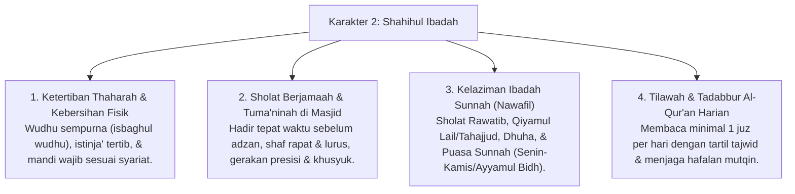

# P3-05-Shahihul-Ibadah-Induk (Karakter 2: Ibadah yang Benar Sesuai Sunnah)

## Tujuan
Menetapkan kerangka kapasitas menyeluruh untuk **Karakter 2: Shahihul Ibadah (Ibadah yang Benar Sesuai Sunnah)** dalam ekosistem pesantren TUMBUH: membimbing santri menguasai Fiqh Thaharah yang presisi, sholat 5 waktu berjamaah di shaf terdepan dengan khusyuk dan tuma'ninah, istiqamah mengamalkan ibadah sunnah, serta menjauhkan diri dari bid'ah yang menyimpang.

---

## 1. 4 Dimensi Karakter Shahihul Ibadah

---

## 2. Matriks Rubrik 4 Level Capaian Shahihul Ibadah

| Dimensi Perilaku | Level 1: Emerging (T1) | Level 2: Developing (T2) | Level 3: Proficient (T3) | Level 4: Exemplary (T4 - Qudwah) |
| :--- | :--- | :--- | :--- | :--- |
| **Disiplin Sholat Berjamaah** | Sering terlambat/masbuq, butuh digugah berulang kali oleh musyrif. | Tiba di masjid saat adzan berkumandang dengan kesadaran sendiri. | Tiba di masjid 5–10 menit sebelum adzan di shaf terdepan, sholat sunnah qabliyah. | Menjadi muadzin/imam, mengkondisikan ketenangan masjid, mengajak adik kelas. |
| **Thaharah & Wudhu** | Wudhu tergesa-gesa, membuang air berlebih (*Israf*), kaki belum basah merata. | Wudhu tertib dan hemat air, namun jarang membaca doa setelah wudhu. | Wudhu sempurna (*Isbagh*), hemat air, dan tertib membaca doa setelahnya. | Mengajarkan tata cara wudhu & mandi janabah yang benar kepada rekan sekamarnya. |
| **Ibadah Sunnah & Tilawah** | Melaksanakan sholat sunnah/tilawah hanya jika diperintah dalam KBM. | Rutin tilawah terjadwal, sesekali sholat rawatib dan dhuha. | Istiqamah 1 juz tilawah mandiri, sholat rawatib lengkap, dan bangun qiyamul lail. | Membimbing halaqah tahsin kamar dan menginspirasi keistiqamahan ibadah malam. |

---

## 3. Protokol Pembiasaan di Asrama (PBIS Tier 1)

1. **Aturan Emas Menuju Masjid (*The 10-Minute Call*)**:
   - Seluruh santri wajib menghentikan aktivitas kamar dan berwudhu 10 menit sebelum adzan berkumandang.
2. **Kajian Fiqh Ibadah Aplikatif Mingguan**:
   - Praktik langsung (*Workshops*) tata cara sholat, sujud sahwi, dan pensucian najis di asrama.
3. **Pencatatan Portofolio Mutaba'ah Yaumiyah**:
   - Rekam jejak sholat berjamaah, rawatib, dan tilawah tercatat via logbook digital dengan prinsip *positive reinforcement*.

---

## 4. Status Dokumen
* **Status**: 🌟 **A+ (Dokumen Induk Shahihul Ibadah)**
* **Level**: Project 3 - `03 Capacity Framework / 05 Shahihul Ibadah`
* **Langkah Berikutnya**: **`01 Philosophy/P3-05-01-Filosofi-dan-Landasan-Turats.md`**.
