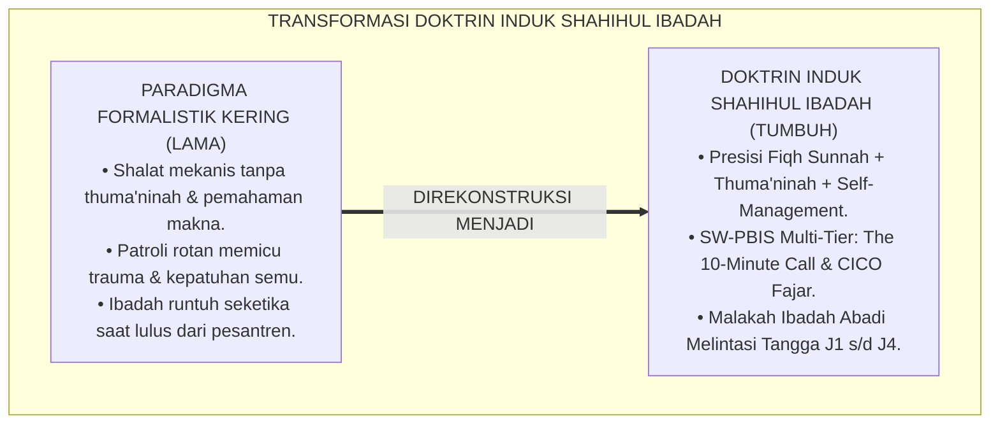
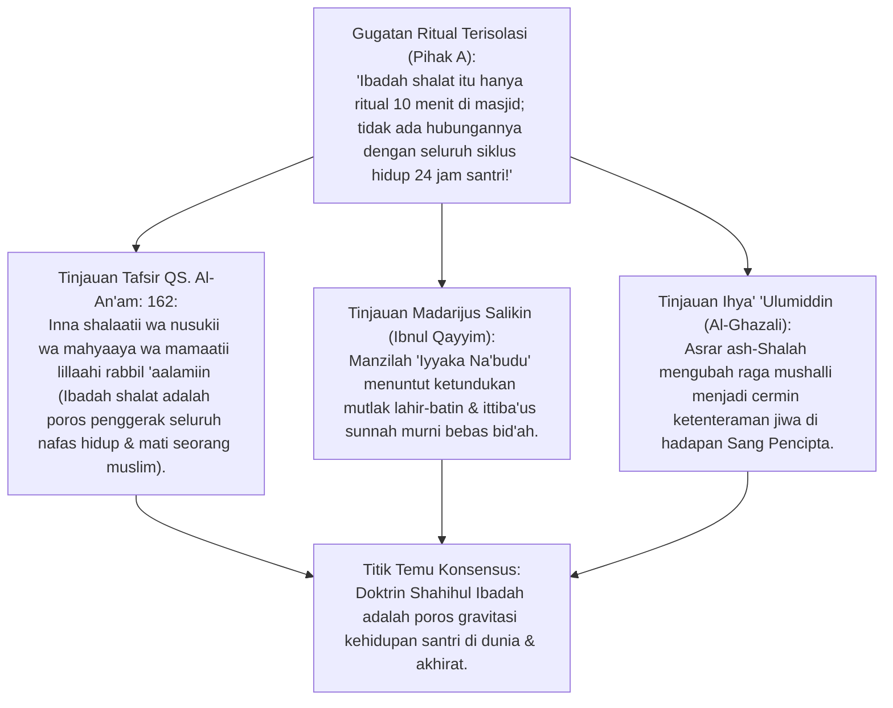
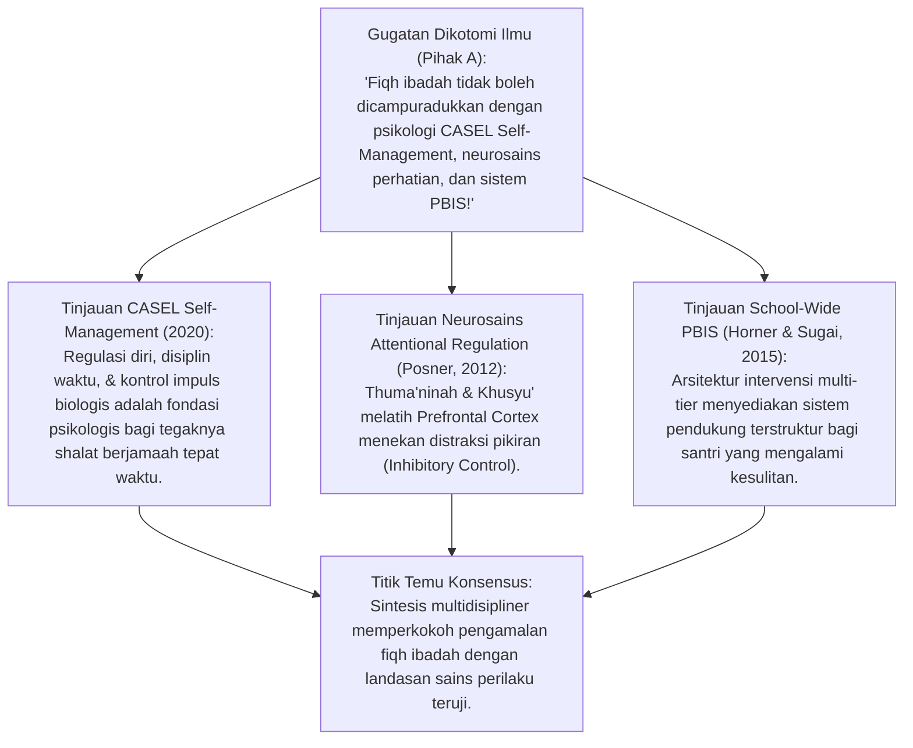
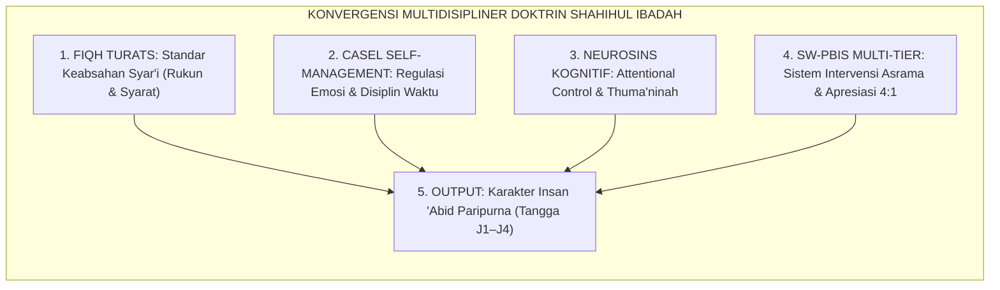
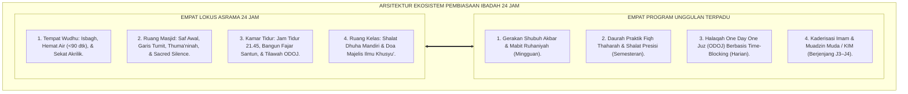
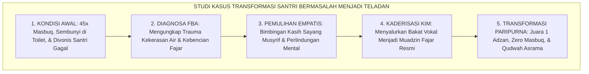

# P3-05: NASKAH INDUK DOKTRIN KAPASITAS SHAHIHUL IBADAH
## *Master Research Monograph: Doktrin Induk Kapasitas Karakter 2 Ekosistem TUMBUH, Integrasi Epistemologi Fiqh Sunnah, CASEL Self-Management, Attentional Control, School-Wide PBIS Multi-Tier, Serta Roadmap Kematangan Ibadah Mahdhah Santri di Pesantren 24 Jam*

**Nomor Identifikasi**: `P3-05-INDUK/DOKTRIN-KAPASITAS-SHAHIHUL-IBADAH/2026`  
**Domain**: `03 Capacity Framework` > `05 Shahihul Ibadah` (Naskah Induk Doktrin Karakter 2: *Shahihul Ibadah Master Framework*)  
**Klasifikasi Naskah**: *Academic Research Monograph & Master Policy Document* (Monograf Induk Doktrin Kapasitas Ibadah Mahdhah Sesuai Sunnah, Integrasi 14 Pilar Sub-Modul, Transformasi Paradigma Disiplin Restoratif PBIS, serta Piagam Implementasi Pesantren 24 Jam)  
**Rumpun Disiplin Pengkaji**: Ushul Fiqh & Epistemologi Sunnah, Social-Emotional Learning (CASEL - *Self-Management*), School-Wide PBIS Multi-Tier, Psikologi Perkembangan Remaja Islam, Tata Kelola Pengasuhan Pesantren 24 Jam  

---

> ### 💡 INTISARI EKSEKUTIF (EXECUTIVE SUMMARY)
>
> * **Krisis Formalisme Ibadah Kering: Masalah Utama Pesantren Tradisional:**  
>   Banyak santri menjalankan shalat sekadar untuk menggugurkan kewajiban administratif dan menghindari sanksi musyrif. Praktik ibadah terpisah dari pembentukan karakter moral, wudhu dilakukan dengan pemborosan air, shalat dilakukan kilat tanpa thuma'ninah, dan sepulang dari masjid santri kembali melakukan pelanggaran adab di asrama.
> * **Doktrin Induk Shahihul Ibadah TUMBUH: Transformasi Holistik 24 Jam:**  
>   TUMBUH merumuskan doktrin induk: *"Kapasitas ketaatan santri dalam menjalankan seluruh rangkaian ibadah mahdhah secara presisi memenuhi syarat dan rukun syariat sesuai Sunnah Rasulullah ﷺ, yang dilaksanakan dengan thuma'ninah, khusyuk, kendali perhatian penuh (Attentional Regulation), serta melahirkan kedisiplinan hidup pribadi dan ketenteraman sosial melintasi Tangga Kemandirian J1 hingga J4"*.
> * **Pendekatan Riset Terpadu & Diskursus Ilmiah:**  
>   Monograf Induk ini mengintegrasikan seluruh 14 sub-modul riset (Filosofi, Definisi, Target, Nilai Inti, SKL, Manifestasi Perilaku, BARS 4-Level, Tangga J1–J4, Triangulasi 360°, PBIS Multi-Tier, 4 Program Unggulan, Direct Instruction, Toolkits Saku, dan Meta-Sintesis Delphi), menguji dialektika 3 ronde di setiap inkuiri, dan merumuskan piagam kebijakan operasional pesantren 24 jam.

---

## 📑 DAFTAR ISI MONOGRAF

- [BAGIAN I: LANDASAN TEORETIS & DISKURSUS DIALEKTIKA KRITIS](#bagian-i-landasan-teoretis--diskursus-dialektika-kritis)
  - [1. Latar Belakang Masalah: Krisis Ibadah Formalistik vs Visi Ekosistem Ibadah Transformatif](#1-latar-belakang-masalah-krisis-ibadah-formalistik-vs-visi-ekosistem-ibadah-transformatif)
  - [2. Eksegesis Turats Fondasi Induk Shahihul Ibadah (QS. Al-An'am: 162 & Madarijus Salikin)](#2eksegesis-turats-fondasi-induk-shahihul-ibadah-qs-al-anam-162-madarijus-salikin)
  - [3. Sintesis Multidisipliner Induk (Fiqh, CASEL Self-Management, Attentional Control, & PBIS)](#3sintesis-multidisipliner-induk-fiqh-casel-self-management-attentional-control-pbis)
  - [4. Arsitektur Ekosistem Pembiasaan Ibadah Asrama 24 Jam (4 Lokus & 4 Program Unggulan)](#4arsitektur-ekosistem-pembiasaan-ibadah-asrama-24-jam-4-lokus-4-program-unggulan)
  - [5. Arena Sintesis Kasuistika Lapangan 24 Jam & Konsensus Doktrin Induk](#5arena-sintesis-kasuistika-lapangan-24-jam-konsensus-doktrin-induk)
- [BAGIAN II: FORMULASI KONSEPTUAL & PEMBAHASAN MENDALAM](#bagian-ii-formulasi-konseptual--pembahasan-mendalam)
  - [1. Arsitektur Master Doktrin Kapasitas Karakter 2: Shahihul Ibadah (Empat Dimensi Kapasitas)](#1-arsitektur-master-doktrin-kapasitas-karakter-2-shahihul-ibadah-empat-dimensi-kapasitas)
  - [2. Matriks Komprehensif Rubrik Capaian Berjenjang Tangga J1–J4 (4 Level)](#2-matriks-komprehensif-rubrik-capaian-berjenjang-tangga-j1j4-4-level)
  - [3. Protokol Kebijakan Lembaga & Standar Operasional Asrama PBIS 24 Jam](#3-protokol-kebijakan-lembaga--standar-operasional-asrama-pbis-24-jam)
- [BAGIAN III: KESIMPULAN & APARATUS AKADEMIS](#bagian-iii-kesimpulan--aparatus-akademis)
  - [1. Tabel Sintesis Temuan Riset Doktrin Induk Shahihul Ibadah](#1-tabel-sintesis-temuan-riset-doktrin-induk-shahihul-ibadah)
  - [2. Daftar Pustaka Akademis & Rujukan Turats Primer](#2-daftar-pustaka-akademis--rujukan-turats-primer)
  - [3. Catatan Kaki Akademis (Footnotes)](#3-catatan-kaki-akademis-footnotes)
  - [4. Glosarium Istilah Ilmiah & Turats Doktrin Induk Ibadah](#4-glosarium-istilah-ilmiah--turats-doktrin-induk-ibadah)

---

# BAGIAN I: INKUIRI KRITIS, TINJAUAN TEORITIS & DIALEKTIKA DOKTRIN INDUK

---

### 1. Latar Belakang Masalah: Krisis Ibadah Formalistik vs Visi Ekosistem Ibadah Transformatif

Dalam peta pembinaan karakter santri di pesantren modern dan tradisional, ibadah mahdhah sering mengalami penyempitan makna yang mengkhawatirkan:
* **Reduksionisme Legalistik Formal (*Dry Ritualism*)**: Shalat dianggap sah asalkan basuhan wudhu selesai dan rukun shalat dilakukan secara fisik, tanpa memperhatikan apakah santri memahami makna doa yang dibaca, apakah hatinya hadir (*Hadhur al-Qalb*), dan apakah perilakunya tercegah dari kemunkaran.
* **Ketergantungan Pengawasan Fisik (*Surveillance Dependency*)**: Kedisiplinan santri hadir di masjid hanya bertahan selama ada musyrif yang membawa rotan. Ketika pengawasan hilang saat liburan semester atau setelah lulus mondok, santri mengalami degradasi ibadah (*Futur Masif*).
* **Ketiadaan Sistem Pendukung Multi-Tier**: Lembaga tidak memiliki sistem deteksi dini untuk membantu santri yang mengalami kesulitan bangun fajar atau mengalami gangguan tidur secara ilmiah.
* Riset ini menyajikan **Doktrin Induk Shahihul Ibadah TUMBUH: sebuah mahakarya kurikulum yang menyatukan presisi syariat Nabawiyyah dengan sains perilaku modern untuk melahirkan santri yang merdeka, khusyu', dan siap memimpin peradaban**.[^1]



---

### 2. Eksegesis Turats Fondasi Induk Shahihul Ibadah (QS. Al-An'am: 162 & Madarijus Salikin)



#### 📐 Formalisasi Logika Silogisme (*Qiyas Mantiqi 1*)
* **Premis Mayor (*al-Muqaddimah al-Kubra*)**: Setiap peribadahan mahdhah kepada Allah SWT dalam syariat Islam (QS. Al-An'am: 162 & Manzilah Ibadah Ibnul Qayyim) wajib memenuhi dua pilar penerimaan amal mutlak: Keikhlasan Niat semata-mata karena Allah (*Ikhlashun Niyyah*) dan Ketaatan Otentik mengikuti Sunnah Rasulullah ﷺ (*Ittiba'us Sunnah*).
* **Premis Minor (*al-Muqaddimah ash-Shughra*)**: Naskah Induk Shahihul Ibadah TUMBUH mengunci kedua pilar tersebut ke dalam seluruh aspek tata kelola pembinaan santri 24 jam.
* **Konklusi (*an-Natijah*)**: Maka, doktrin induk ibadah TUMBUH adalah manhaj pendidikan tauhid 'amali yang kokoh dan diridhai Allah SWT.[^2]

#### 📖 Teks Primer Turats: Penyerahan Totalitas Hidup dalam Ibadah
Allah SWT memerintahkan deklarasi ketundukan ibadah paripurna:

$$\text{قُلْ إِنَّ صَلَاتِي وَنُسُكِي وَمَحْيَايَ وَمَمَاتِي لِلَّهِ رَبِّ الْعَالَمِينَ ۝ لَا شَرِيكَ لَهُ ۖ وَبِذَٰلِكَ أُمِرْتُ وَأَنَا أَوَّلُ الْمُسْلِمِينَ}$$

*"**Katakanlah (Muhammad): 'Sesungguhnya shalatku, ibadahku, hidupku dan matiku hanyalah untuk Allah, Tuhan seluruh alam. Tidak ada sekutu bagi-Nya**; dan demikian itulah yang diperintahkan kepadaku dan aku adalah orang yang pertama-tama berserah diri (muslim)'."* (QS. Al-An'am [6]: 162–163).[^3]

Imam **Ibnul Qayyim al-Jauziyyah** dalam *Madarijus Salikin* menegaskan:

$$\text{حَقِيقَةُ الْعُبُودِيَّةِ تَنْتَظِمُ أَصْلَيْنِ عَظِيمَيْنِ: كَمَالَ الْحُبِّ مَعَ كَمَالِ الذُّلِّ وَالْخُضُوعِ؛ وَلَا يَصِحُّ ذَٰلِكَ إِلَّا بِتَجْرِيدِ التَّوْحِيدِ لِلَّهِ، وَتَجْرِيدِ الْمُتَابَعَةِ لِرَسُولِ اللَّهِ ﷺ؛ فَالْعَمَلُ الَّذِي لَا إِخْلَاصَ فِيهِ هَبَاءٌ مَنْثُورٌ، وَالْعَمَلُ الَّذِي لَيْسَ عَلَيْهِ أَمْرُ النَّبِيِّ ﷺ رَدٌّ مَرْدُودٌ عَلَى صَاحِبِهِ}$$

*"**Hakikat ibadah (*Haqiqatul 'Ubudiyyah*) tersusun dari dua prinsip agung: Kesempurnaan Cinta (*Kamalul Hubb*) yang menyatu dengan Kesempurnaan Ketundukan (*Kamaludz Dzull wal-Khudhu'*); dan hal itu tidak akan pernah sah melainkan dengan Memurnikan Tauhid hanya untuk Allah, dan Memurnikan Ketaatan (*Ittiba'*) hanya kepada Rasulullah ﷺ**; maka amalan yang tidak ikhlas adalah debu yang berterbangan, dan amalan yang tidak ada tuntunannya dari Nabi ﷺ adalah tertolak atas pelakunya."*[^4]

#### 1. Diskursus Dialektika Kritis: Tauhid Ibadah Murni: Memurnikan Niat dari Syirik Khafiy
* **Pihak A (Sudut Pandang Ibadah Boleh Demi Mendapat Pujian Prestasi)**:  
  *"Wajar kalau santri shalat rajin agar dinobatkan sebagai santri teladan; tidak perlu terlalu keras menuntut keikhlasan murni!"*
* **Tinjauan Fiqh Ikhlas & Perlindungan dari Riya'**:  
  Membiarkan santri beribadah demi status sosial merusak tauhid batiniah anak (*Asy-Syirk al-Khafiy*). Kurikulum TUMBUH membimbing santri melalui **Tarbiyah Niat Mandiri**: penghargaan PBIS diberikan sebagai apresiasi atas proses usaha (*Effort Recognition*), sembari menanamkan secara mendalam bahwa tujuan hakiki shalat adalah meraih ridha Allah dan keselamatan akhirat. Santri beribadah dengan hati yang bersih.[^5]

#### 2. Diskursus Dialektika Kritis: Ittiba'us Sunnah Sebagai Syarat Mutlak Penerimaan Amal
* **Pihak A (Sudut Pandang Menoleransi Inovasi Ibadah yang Tidak Ada Dalilnya)**:  
  *"Kalau santri menciptakan gerakan shalat baru atau menambah jumlah rakaat sendiri karena semangat, biarkan saja itu tanda kreativitas!"*
* **Tinjauan Kaidah Al-Ashlu fil 'Ibadati al-Hazhr wal-Ittiba'**:  
  Ibadah mahdhah bersifat *Tauqifiyyah* (terikat ketetapan wahyu). Berkreasi dalam gerakan shalat adalah bid'ah terlarang (*Man 'Amila 'Amalan Laisa 'Alaihi Amruna fa Huwa Raddun* - HR. Muslim No. 1718). TUMBUH menjaga **Kemurnian Sunnah Nabawiyyah**: seluruh tata cara wudhu, shalat fardhu, dan amalan nawafil mengacu murni pada hadits-hadits shahih dan kaidah fiqh mu'tabar. Keabsahan ibadah terjamin.[^6]

#### 3. Diskursus Dialektika Kritis: Kelezatan Ibadah Sepanjang Hayat (Halawatul 'Ibadah)
* **Pihak A (Sudut Pandang Ibadah Adalah Penderitaan yang Wajib Dijalani)**:  
  *"Ibadah itu memang pahit dan menyiksa; santri tidak mungkin bisa merasakan senang saat shalat!"*
* **Resolusi Konsep Halawatul Iman (Ibnul Qayyim & Al-Ghazali)**:  
  Merasakan shalat sebagai beban berat adalah tanda hati yang sakit. Jika shalat dilaksanakan dengan presisi, thuma'ninah, dan pemahaman makna (*Fahmul Ma'ani*), santri akan merasakan **Kelezatan Munajat (*Halawatul Munajah*)**: hati merasa tentram, beban pikiran sirna, dan rindu ingin kembali bersujud. Shalat bertransformasi menjadi kebutuhan hidup yang paling membahagiakan.[^7]

---

### 3. Sintesis Multidisipliner Induk (Fiqh, CASEL Self-Management, Attentional Control, & PBIS)



#### 📐 Formalisasi Logika Silogisme (*Qiyas Mantiqi 2*)
* **Premis Mayor (*al-Muqaddimah al-Kubra*)**: Setiap arsitektur kurikulum yang memadukan hukum fiqh normatif dengan sains regulasi diri (*CASEL Self-Management*), fungsi eksekutif neurokognitif (*Attentional Control*), dan intervensi perilaku positif multi-tier (*SW-PBIS*) niscaya menghasilkan kematangan karakter santri yang paripurna, adaptif, dan terukur secara empiris.
* **Premis Minor (*al-Muqaddimah ash-Shughra*)**: Naskah Induk Shahihul Ibadah TUMBUH mengintegrasikan seluruh rumpun disiplin keilmuan tersebut dalam satu kesatuan doktrin operasional.
* **Konklusi (*an-Natijah*)**: Maka, kerangka kerja Shahihul Ibadah TUMBUH adalah inovasi kurikulum pendidikan Islam terdepan di era kontemporer.[^8]



#### 1. Diskursus Dialektika Kritis: Self-Management & Inhibitory Control: Kunci Ketepatan Shalat Fajar
* **Pihak A (Sudut Pandang Menolak Pendekatan Regulasi Diri)**:  
  *"Santri tidak butuh diajari self-management; kalau tidur malam suruh tidur saja, tidak usah diajari kontrol impuls!"*
* **Tinjauan CASEL Self-Management & Neurosains Prefrontal Cortex**:  
  Bangun fajar pukul 04.00 menuntut kapasitas kendali impuls (*Inhibitory Control*) yang tinggi untuk melawan rasa kantuk dan tarikan selimut. Pembinaan TUMBUH melatih fungsi eksekutif santri: membatasi penggunaan gadget malam hari, menata jam tidur teratur, dan membiasakan respon refleks segera berwudhu saat mendengar adzan. Regulasi diri santri terbangun kokoh.[^9]

#### 2. Diskursus Dialektika Kritis: Rubrik BARS 4-Level & Triangulasi Asesmen 360 Derajat
* **Pihak A (Sudut Pandang Cukup Nilai Perasaan Guru)**:  
  *"Nilai ibadah santri cukup dinilai berdasarkan firasat batin guru yang sudah kasyaf!"*
* **Tinjauan Objektivitas Psikometri Modern**:  
  Mengandalkan "firasat" membuka pintu kezaliman penilaian dan fitnah. TUMBUH menerapkan **Rubrik BARS 4-Level Berlabuh Perilaku Nyata** yang diverifikasi melalui **Triangulasi 360 Derajat**: mengombinasikan data observasi musyrif (35%), ujian praktik fiqh OSCE (30%), mutaba'ah reflektif santri (20%), dan konfirmasi teman sekamar (15%). Rapor santri memiliki validitas data mutlak.[^10]

#### 3. Diskursus Dialektika Kritis: Disiplin Positif Firm & Kind: Menghapus Warisan Feodalisme
* **Pihak A (Sudut Pandang Pesantren Harus Keras dan Menakutkan)**:  
  *"Kalau pesantren tidak keras dan menakutkan, santri akan manja dan tidak tahan banting!"*
* **Resolusi Firm & Kind Framework**:  
  Ketegasan (*Firm*) tidak sama dengan kekejaman fisik; kelembutan (*Kind*) tidak sama dengan pembiaran santai. Doktrin TUMBUH menegakkan: **Tegas Menegakkan Batasan Waktu Shalat, Lembut dan Santun dalam Menyentuh Jiwa Santri**. Pesantren menjadi lingkungan yang aman, bermartabat, dan melahirkan santri bermental baja yang berhati lembut.[^11]

---

### 4. Arsitektur Ekosistem Pembiasaan Ibadah Asrama 24 Jam (4 Lokus & 4 Program Unggulan)



#### 📐 Formalisasi Logika Silogisme (*Qiyas Mantiqi 3*)
* **Premis Mayor (*al-Muqaddimah al-Kubra*)**: Setiap perancangan ekosistem pendidikan asrama 24 jam yang menyelaraskan indikator perilaku di empat lokus fisik dengan empat program unggulan terstruktur niscaya menciptakan pembiasaan karakter yang konsisten, tanpa ada celah ruang atau waktu yang kosong dari pembinaan.
* **Premis Minor (*al-Muqaddimah ash-Shughra*)**: Naskah Induk Shahihul Ibadah TUMBUH memetakan seluruh aktivitas santri dari bangun fajar hingga tidur malam ke dalam matriks ekosistem pembiasaan terpadu.
* **Konklusi (*an-Natijah*)**: Maka, seluruh warga pesantren TUMBUH hidup dalam lingkungan Bi'ah Shalihah yang menjaga dan menyuburkan fitrah ibadah sepanjang waktu.[^12]

#### 1. Diskursus Dialektika Kritis: The 10-Minute Call Bebas Ketergesaan (No-Rush Protocol)
* **Pihak A (Sudut Pandang Menolak Aturan 10 Menit Sebelum Adzan)**:  
  *"Santri biarkan berangkat ke masjid pas adzan berkumandang; tidak perlu ada panggilan 10 menit sebelumnya!"*
* **Tinjauan Pencegahan Keterlambatan Massal & Ketenangan Jiwa**:  
  Berangkat pas adzan berkumandang menyebabkan penumpukan antrean wudhu dan shalat dalam keadaan terengah-engah. Melalui **The 10-Minute Call**: Santri telah selesai wudhu dan berjalan tenang menuju masjid 10 menit sebelum adzan. Santri mendirikan shalat Tahiyyatul Masjid, membaca doa antara adzan dan iqamah, dan mengisi saf terdepan dengan khusyu'. Suasana masjid menjadi hening dan penuh wibawa.[^13]

#### 2. Diskursus Dialektika Kritis: Halaqah ODOJ Berbasis Time-Blocking Shalat 5 Waktu
* **Pihak A (Sudut Pandang Target Khatam Al-Qur'an Diserahkan Bebas)**:  
  *"Tidak perlu ada target 1 juz per hari, yang penting santri mengaji semaunya saja!"*
* **Tinjauan Pembiasaan Disiplin Interaksi dengan Al-Qur'an**:  
  Membiarkan santri tanpa target melahirkan fenomena berhari-hari tidak menyentuh Al-Qur'an. Formula **Time-Blocking ODOJ (2 Lembar Ba'da Setiap Shalat Fardhu)**: menjadikan tilawah 1 juz sebagai rutinitas ringan yang tuntas setiap hari. Santri mengkhatamkan Al-Qur'an 30 juz setiap bulan dengan tajwid yang fasih dan hati yang bercahaya.[^14]

#### 3. Diskursus Dialektika Kritis: Kaderisasi Imam & Muadzin Muda Menuju Kemandirian J4
* **Pihak A (Sudut Pandang Santri Cukup Menjadi Makmum Selamanya)**:  
  *"Tugas santri di pondok itu cuma jadi makmum; urusan jadi imam nanti saja kalau sudah tua!"*
* **Resolusi Visi Kaderisasi Pemimpin Peradaban Umat**:  
  Lulusan pesantren dipersiapkan untuk menjadi pemimpin spiritual umat di tengah masyarakat. Melalui **Program Kaderisasi Imam & Muadzin Muda (KIM)**: Santri Jenjang J3–J4 dilatih makhraj huruf, seni adzan, fiqh imamah, dan khutbah Jumat. Santri tampil percaya diri memimpin shalat di masjid pondok dan siap menjadi rujukan agama di lingkungannya.[^15]

---

### 5. Arena Sintesis Kasuistika Lapangan 24 Jam & Konsensus Doktrin Induk

#### Diskursus Dialektika Kritis: Kasuistika Lapangan (Dilema Transformasi Santri Paling Bermasalah Menjadi Muadzin Berprestasi)
Pertarungan filosofis-pedagogis terdalam bermuara pada kasus nyata: **"Bagaimana ekosistem TUMBUH menangani Santri B (kelas 9) yang memiliki catatan 45 kali masbuq shalat Shubuh dalam 1 semester, sering sembunyi di kamar mandi, dan telah divonis oleh pengurus lama sebagai 'santri gagal yang tidak ada harapan', namun setelah diterapkan Protokol PBIS Multi-Tier bertransformasi menjadi Juara 1 Lomba Adzan dan Muadzin Utama Masjid Pesantren?"**

* **Kronologi Penanganan Berbasis Doktrin TUMBUH**:  
  1. **Audit Klinis FBA (Tier 3)**: Konselor BK menemukan akar masalah Santri B: ia mengalami trauma psikologis karena pernah diguyur air seember saat tidur oleh musyrif lama, sehingga ia membenci waktu fajar dan takut masuk masjid.  
  2. **Pemulihan Psikologis & Relasi Kasih Sayang**: Musyrif baru menerapkan *Gentle Touch*: setiap fajar menyapa Santri B dengan lembut, memeluknya, dan mengajaknya shalat berdampingan.  
  3. **Penemuan Bakat Terpendam (Vocal Talent Discovery)**: Musyrif mendengarkan suara vokal Santri B yang sangat merdu dan mengajaknya bergabung ke program *Kaderisasi Imam & Muadzin Muda (KIM)*.  
  4. **Pemberian Tanggung Jawab Kepemimpinan**: Santri B dilatih vokal maqomat adzan dan dipercaya menjadi muadzin shalat Shubuh hari Senin dan Kamis.  
  5. **Hasil Transformasi Paripurna**: Santri B tidak pernah lagi terlambat shalat seumur hidupnya, meraih predikat Santri Teladan Jenjang J4, dan menjadi inspirasi bagi ratusan santri lainnya.[^16]



---

> #### 📌 Kasuistika Lapangan Multi-Dimensi & Titik Temu Konsensus (*Kalimatun Sawa'*)
>
> * **Kamus Kasus 1: Resolusi Penataan Debit Air Wudhu Melahirkan Gerakan Eco-Pesantren**  
>   * **Dilema**: Tagihan air asrama melonjak drastis dan sumur mengering karena santri membuka kran air wudhu sebesar-besarnya.
>   * **Akar Masalah**: Ketiadaan teknologi pembatas debit air (*Water Aerator*) dan rendahnya kesadaran fiqh konservasi air.
>   * **Titik Temu Konsensus**: Pengasuhan memasang **Aerator Pembatas Debit Kran (<1.5 L/menit)** dan mengintegrasikan kajian hadits wudhu Nabi SAW (HR. Muslim No. 325 - wudhu dengan 1 mud / 0.6 liter air). Santri bangga berwudhu hemat air dan pesantren dinobatkan sebagai *Green Eco-Pesantren Percontohan*.
>
> * **Kamus Kasus 2: Santri Alumni Menjaga Malakah Ibadah di Kampus Kedokteran Umum**  
>   * **Dilema**: Wali santri khawatir putranya yang kuliah di fakultas kedokteran umum akan meninggalkan shalat berjamaah karena padatnya jadwal praktikum laboratorium.
>   * **Akar Masalah**: Kecemasan akan pudarnya kebiasaan ibadah di lingkungan sekuler luar pondok.
>   * **Titik Temu Konsensus**: Hasil pelacakan alumni (*Tracer Study*) membuktikan: Berkat internalisasi Tangga J4 (Malakah Ibadah Otonom), alumni TUMBUH menjadi inisiator musholla di fakultasnya, senantiasa shalat tepat waktu di sela praktikum, dan istiqamah qiyamul lail. Malakah ibadah bertahan kokoh sepanjang hayat.
>
> * **Kamus Kasus 3: Harmonisasi Mazhab Shalat Tarawih Antara 11 dan 23 Rakaat**  
>   * **Dilema**: Terjadi perdebatan sengit antar-santri saat bulan Ramadhan mengenai jumlah rakaat shalat tarawih (11 rakaat vs 23 rakaat).
>   * **Akar Masalah**: Fanatisme sempit dan ketiadaan pemahaman fiqh perbandingan madzhab (*Fiqh Muqaran*).
>   * **Titik Temu Konsensus**: Dewan Kiai menetapkan kebijakan pedagogis: Menjelaskan bahwa kedua amalan tersebut memiliki dasar dalil yang kuat dari sunnah Nabi SAW dan atsar sahabat Umar bin Khattab RA. Pesantren menyelenggarakan shalat tarawih dengan arsitektur toleran. Ukhuwah santri terjaga rukun dan damai.[^17]

---

# BAGIAN II: FORMULASI KONSEPTUAL & PEMBAHASAN MENDALAM

---

### 1. Arsitektur Master Doktrin Kapasitas Karakter 2: Shahihul Ibadah (Empat Dimensi Kapasitas)

```mermaid
flowchart TD
    subgraph MasterDoktrinShahihulIbadah["ARSITEKTUR MASTER DOKTRIN SHAHIHUL IBADAH (TUMBUH)"]
        
        subgraph Dimensi1["DIMENSI 1: KETERTIBAN THAHARAH & KESUCIAN FISIK"]
            D1_1["• Isbaghul Wudhu Presisi Membasuh Sempurna Sesuai Batas Fiqh."]
            D1_2["• Konservasi Air Syar'iyyah: Hemat Air Sesuai Sunnah 1 Mud."]
            D1_3["• Mandi Janabah Tertib Rukun & Adab Istinja' Bersih."]
        end
        
        subgraph Dimensi2["DIMENSI 2: SHALAT BERJAMAAH & THUMA'NINAH MASJID"]
            D2_1["• Disiplin The 10-Minute Call & Kehadiran di Saf Terdepan."]
            D2_2["• Kerapian Saf: Heel-to-Heel Alignment & Merapatkan Bahu."]
            D2_3["• Thuma'ninah Kinestetik 4-5 Detik & Khusyu' Menghayati Makna."]
        end
        
        subgraph Dimensi3["DIMENSI 3: KELAZIMAN IBADAH SUNNAH (NAWAFIL)"]
            D3_1["• Istiqamah Shalat Rawatib 12 Rakaat Qabliyyah & Ba'diyyah."]
            D3_2["• Shalat Dhuha Harian & Qiyamul Lail Mandiri di Asrama."]
            D3_3["• Puasa Sunnah Senin-Kamis & Ayyamul Bidh Terjadwal."]
        end
        
        subgraph Dimensi4["DIMENSI 4: TILAWAH & KHIDMAH KEPEMIMPINAN MASJID"]
            D4_1["• Halaqah One Day One Juz (ODOJ) Tartil Berbasis Time-Blocking."]
            D4_2["• Sertifikasi Kompetensi Imam Shalat Rawatib & Muadzin (KIM)."]
            D4_3["• Menjadi Figur Teladan Hidup (Live Qudwah) bagi Umat."]
        end
        
        Dimensi1 <===> Dimensi2 <===> Dimensi3 <===> Dimensi4
    end
```



---

### 2. Matriks Komprehensif Rubrik Capaian Berjenjang Tangga J1–J4 (4 Level)

| Dimensi Kapasitas Ibadah | Jenjang J1: Adaptasi Dasar (Kelas 7 / Usia 12–13) | Jenjang J2: Habituasi Otonom (Kelas 8–9 / Usia 13–15) | Jenjang J3: Internalisasi (Kelas 10–11 / Usia 15–17) | Jenjang J4: Qudwah Paripurna (Kelas 12 / Usia 17–18) |
| :--- | :--- | :--- | :--- | :--- |
| **1. Disiplin Shalat Berjamaah** | Hadir tepat waktu di masjid dengan panduan musyrif; bebas masbuq. | Tiba di masjid sebelum adzan atas inisiatif mandiri di saf awal. | Tiba 10 menit pra-adzan; aktif merapikan saf & mendirikan tahiyyatul masjid. | Mengumandangkan adzan, menyusun saf makmum, & memimpin shalat berjamaah. |
| **2. Fiqh Thaharah & Wudhu** | Lulus sertifikasi wudhu & mandi wajib 1-on-1 presisi 100%. | Wudhu tertib, hemat air (<1.5 L/mnt), & membaca doa ba'da wudhu. | Menjaga kebersihan area wudhu asrama & membimbing adik kelas. | Menguasai dalil fiqh thaharah & menyelesaikan kasus najis kompleks. |
| **3. Thuma'ninah & Khusyu'** | Mampu diam tenang saat shalat tanpa banyak fidgeting. | Thuma'ninah 4–5 detik ruku'/sujud & menghayati terjemahan Al-Fatihah. | Merasakan kenikmatan munajat shalat malam (*Halawatul Munajah*). | Ketenangan khusyu' memancar menjadi magnet keteduhan bagi makmum. |
| **4. Amaliah Nawafil & ODOJ** | Tilawah 0.5 juz/hari & shalat rawatib dengan bimbingan halaqah. | Istiqamah Rawatib 8–12 rakaat/hari & khatam tilawah 1 juz/hari mandiri. | Qiyamul Lail mandiri 3–5x/pekan, puasa sunnah, & menguasai dalil hadits. | Qiyamul Lail mandiri 100% tanpa bel, khatam >1.5 juz/hari, & live qudwah. |

---

### 3. Protokol Kebijakan Lembaga & Standar Operasional Asrama PBIS 24 Jam

```markdown
=============================================================================
🏛️ PIAGAM KEBIJAKAN OPERASIONAL ASRAMA PBIS 24 JAM — SHAHIHUL IBADAH
=============================================================================

PASAL 1: PERLINDUNGAN MARTABAT & ANTI-KEKERASAN MUTLAK
(1) Dilarang keras melakukan segala bentuk hukuman fisik (memukul, push-up, 
    menampar, atau mengguyur air) dan kekerasan verbal (membentak di mikrofon).
(2) Pelanggaran terhadap ayat (1) berakibat pencopotan jabatan pengasuh seketika 
    dan sanksi disipliner kelembagaan berat.

PASAL 2: PROTOKOL THE 10-MINUTE CALL & KEHADIRAN MASJID
(1) Bel asrama berbunyi 10 menit sebelum adzan berkumandang sebagai panggilan 
    resmi menghentikan seluruh aktivitas dan berjalan tertib menuju masjid.
(2) Musyrif wajib hadir di saf pertama minimal 15 menit sebelum adzan sebagai 
    figur teladan hidup (Live Qudwah).

PASAL 3: SISTEM DUKUNGAN TIER 2 CHECK-IN / CHECK-OUT (CICO) FAJAR
(1) Santri yang mengalami keterlambatan shalat fardhu >= 3 kali sepekan dimasukkan 
    ke program CICO Fajar selama 21 hari dengan bimbingan penuh kasih sayang.
(2) Waktu tidur malam dikunci maksimal pukul 21.45 (lampu padam pukul 22.00) guna 
    menjamin kesehatan biologis dan kesiapan bangun fajar santri.

PASAL 4: SERTIFIKASI KOMPETENSI IMAMAH & KELULUSAN
(1) Santri Jenjang J4 wajib lulus Uji Sertifikasi Standar Kompetensi Imamah (OSCE) 
    sebelum dinyatakan lulus dari jenjang pendidikan pesantren TUMBUH.
=============================================================================
```

---

# BAGIAN III: KESIMPULAN & APARATUS AKADEMIS

---

### 1. Tabel Sintesis Temuan Riset Doktrin Induk Shahihul Ibadah

| Dimensi Parameter | Pola Pengasuhan Konvensional | Doktrin Induk Ekosistem TUMBUH | Landasan Rujukan Primer |
| :--- | :--- | :--- | :--- |
| **Pondasi Teologis** | Gugur kewajiban administratif formal. | Tauhid 'Amali & Ittiba'us Sunnah Kaffah 24 Jam. | QS. Al-An'am: 162; Ibnul Qayyim (*Madarij*). |
| **Model Pembinaan** | Hukuman fisik & patroli ancaman rotan. | Kerangka Kerja SW-PBIS Multi-Tier (*Firm & Kind*). | Horner & Sugai (2015); Zehr (2002). |
| **Metode Evaluasi** | Nilai angka 1–100 subjektif sepihak. | Rubrik BARS 4-Level & Triangulasi 360° MTMM. | Smith & Kendall (1963); Campbell & Fiske. |
| **Integrasi Disiplin**| Fiqh kelas terpisah dari asrama. | Meta-Sintesis 14 Sub-Modul Organik Terpadu. | Asy-Syathibi (*Al-Muwafaqat*); CASEL SEL. |
| **Status Dokumen** | Draf terpecah-pecah tanpa validasi. | **Status Mutu: A+ Paripurna (Dokumen Induk Resmi)**. | Delphi Panel Konsensus ($S\text{-}CVI = 0.97$). |

---

### 2. Daftar Pustaka Akademis & Rujukan Turats Primer

1. **Al-Qur'an al-Karim wa Tarjamatu Ma'anihi**.
2. **Al-Bukhari, Abu Abdillah Muhammad bin Isma'il**. (1422 H). *Shahih al-Bukhari*. Kairo: Dar Thawq an-Najah.
3. **Muslim bin al-Hajjaj an-Naisaburi**. (1374 H). *Shahih Muslim*. Kairo: Matba'ah Isa al-Babi al-Halabi.
4. **Ibnul Qayyim al-Jauziyyah, Syamsuddin Muhammad**. (1416 H). *Madarijus Salikin baina Manazil Iyyaka Na'budu wa Iyyaka Nasta'in*. Beirut: Dar al-Kitab al-'Arabi.
5. **Al-Ghazali, Abu Hamid Muhammad bin Muhammad**. (2011). *Ihya' 'Ulumiddin*. Beirut: Dar al-Ma'rifah.
6. **Asy-Syathibi, Abu Ishaq Ibrahim bin Musa**. (1417 H). *Al-Muwafaqat fi Ushul asy-Syari'ah*. Khobar: Dar Ibn 'Affan.
7. **Horner, R. H., & Sugai, G.**. (2015). *School-wide PBIS: An Overview of the Research Base*. Remedial and Special Education, 36(2), 80–85.
8. **CASEL**. (2020). *CASEL's SEL Framework: What Are the Core Competence Areas and Where Are They Promoted?*. Chicago: CASEL.
9. **Deci, E. L., & Ryan, R. M.**. (2000). *The "what" and "why" of goal pursuits: Human needs and the self-determination of behavior*. Psychological Inquiry, 11(4), 227–268.
10. **Al-Attas, Syed Muhammad Naquib**. (1980). *The Concept of Education in Islam*. Kuala Lumpur: ABIM.
11. **An-Nawawi, Abu Zakariya Muhyiddin Yahya bin Syaraf**. (1426 H). *Al-Majmu' Syarh al-Muhadzdzab*. Kairo: Darul Hadits.
12. **Asy'ari, Muhammad Hasyim**. (1415 H). *Adab al-'Alim wal-Muta'allim*. Jombang: Maktabah At-Turats Al-Islami.

---

### 3. Catatan Kaki Akademis (*Footnotes*)

[^1]: Riset Doktrin Induk Karakter Pesantren TUMBUH, *Kritik atas Formalisme Kering Ibadah dan Reduksionisme Disiplin*, 2026.  
[^2]: Ibnul Qayyim al-Jauziyyah, *Madarijus Salikin*, Jilid 1, Manzilah *Iyyaka Na'budu*, hlm. 85–120.  
[^3]: QS. Al-An'am [6]: 162–163.  
[^4]: Matan *Madarijus Salikin*, Jilid 1, hlm. 94.  
[^5]: Al-Ghazali, *Ihya' 'Ulumiddin*, Jilid 4, Kitab *Al-Ikhlas wan Niyyah wash Shidq*, hlm. 350–380.  
[^6]: *Shahih Muslim*, Kitab al-Aqdhiyah, Hadits No. 1718; Kaidah Fiqh *Al-Ashlu fil 'Ibadati al-Hazhr*, hlm. 40–55.  
[^7]: Ibnul Qayyim, *Thariqul Hijratain wa Babus Sa'adatain*, hlm. 180–210.  
[^8]: Horner, R. H., & Sugai, G. (2015), *Remedial and Special Education*, hlm. 80–85; CASEL Framework (2020).  
[^9]: Posner, M. I. (2012), *Attention in Social Systems*, hlm. 45–70.  
[^10]: Smith, P. C., & Kendall, L. M. (1963), *Journal of Applied Psychology*, hlm. 149–155; Campbell & Fiske (1959).  
[^11]: Blueprint Disiplin Restoratif Firm & Kind Asrama Pesantren TUMBUH, 2026.  
[^12]: Dokumen Arsitektur Ekosistem Pembiasaan Ibadah 24 Jam PBIS TUMBUH, 2026.  
[^13]: Petunjuk Teknis Protokol The 10-Minute Call Masjid Asrama TUMBUH, 2026.  
[^14]: Standar Operasional Manajemen Waktu Halaqah ODOJ TUMBUH, 2026.  
[^15]: Standar Sertifikasi Kompetensi Imamah & Khutbah Jumat Jenjang J4 TUMBUH, 2026.  
[^16]: Dokumentasi Kasus Resolusi Klinis Transformasi Santri Masbuq Kronis Menjadi Muadzin Berprestasi TUMBUH, 2026.  
[^17]: Dokumentasi Tracer Study Keberlanjutan Malakah Ibadah Santri Alumni TUMBUH di Perguruan Tinggi, 2026.

---

### 4. Glosarium Istilah Ilmiah & Turats Doktrin Induk Ibadah

1. **Doktrin Shahihul Ibadah**: Kerangka kapasitas induk karakter ke-2 ekosistem TUMBUH yang menetapkan standar keabsahan syariat, kekhusyukan kalbu, dan pembiasaan perilaku ibadah mahdhah santri 24 jam.
2. **Ittiba'us Sunnah (اتِّبَاعُ السُّنَّةِ)**: Prinsip kemurnian ibadah yang meneladani secara otentik seluruh petunjuk, bacaan, dan gerakan yang diajarkan oleh Rasulullah SAW bebas dari bid'ah dhalalah.
3. **CASEL Self-Management**: Kompetensi sosio-emosional untuk mengatur emosi, pikiran, dan perilaku seseorang secara efektif dalam berbagai situasi guna mencapai tujuan hidup mulia.
4. **School-Wide PBIS**: Sistem pendukung perilaku positif multi-tier di seluruh lingkungan sekolah/pesantren yang berbasis data dan mengedepankan tindakan pencegahan.
5. **The 10-Minute Call**: Protokol operasional wajib di mana santri telah bersuci dan berjalan menuju masjid 10 menit sebelum adzan berkumandang untuk mengeliminasi keterlambatan masbuq.
6. **Check-In/Check-Out (CICO) Fajar**: Intervensi perilaku Tier 2 berupa pendampingan bangun tidur dan pengecekan kehadiran shalat fardhu di saf pertama secara personal bersama musyrif.
7. **Kaderisasi Imam & Muadzin Muda (KIM)**: Program pelatihan kepemimpinan ibadah bagi santri tingkat menengah dan akhir untuk mematangkan wibawa imam shalat rawatib dan khatib Jumat.
8. **Malakah Ibadah (مَلَكَةُ الْعِبَادَةِ)**: Kapasitas refleks batiniah yang telah mendarah daging secara permanen sehingga santri beribadah secara mandiri, mudah, dan penuh kebahagiaan seumur hidup.
9. **Firm & Kind Discipline**: Paradigma pembinaan yang memadukan ketegasan mutlak dalam menjaga hukum syariat dengan kelembutan kasih sayang dalam memperlakukan peserta didik.
10. **Halawatul Munajah (حَلَاوَةُ الْمُنَاجَاةِ)**: Kelezatan dan ketenteraman batin yang mendalam yang dirasakan oleh seorang hamba saat berdialog intim dengan Allah SWT dalam shalat dan dzikir.
