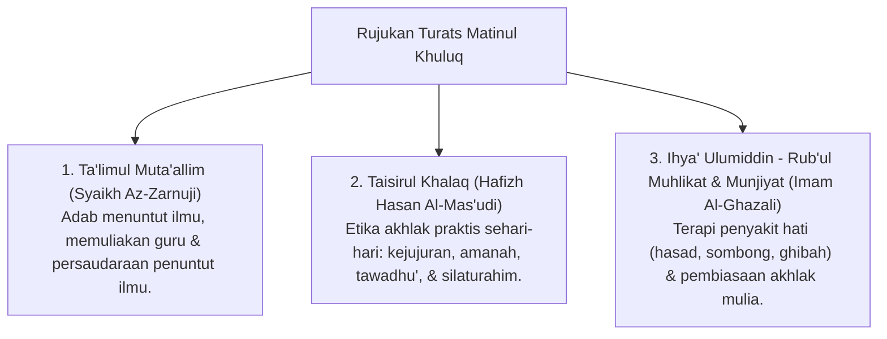

# P3-06-01-Filosofi-dan-Landasan-Turats (Matinul Khuluq)

## Tujuan
Membedah landasan filosofis, ontologis moral, dan rujukan kitab Turats klasik mengenai hakikat **Matinul Khuluq (Akhlak yang Kokoh & Mulia)**.

---

## 1. Landasan Nash Al-Qur'an & As-Sunnah

### 1. QS. Al-Qalam [68]: 4
> وَإِنَّكَ لَعَلَىٰ خُلُقٍ عَظِيمٍ
> *"Dan sesungguhnya engkau (Muhammad) benar-benar berbudi pekerti yang agung."*

### 2. HR. Tirmidzi (No. 2003 - Hadits Hasan Shahih)
> إِنَّ مِنْ أَحَبِّكُمْ إِلَيَّ وَأَقْرَبِكُمْ مِنِّي مَجْلِسًا يَوْمَ الْقِيَامَةِ أَحَاسِنَكُمْ أَخْلَاقًا
> *"Sesungguhnya yang paling aku cintai di antara kalian dan paling dekat tempat duduknya denganku pada hari kiamat adalah yang paling baik akhlaknya."*

---

## 2. Rujukan Khazanah Turats Klasik

---

## 3. Status Dokumen
* **Status**: 🌟 **A+ (Tervalidasi & Siap Diimplementasikan)**
* **Level**: Project 3 - `03 Capacity Framework / 06 Matinul Khuluq / 01 Philosophy`
