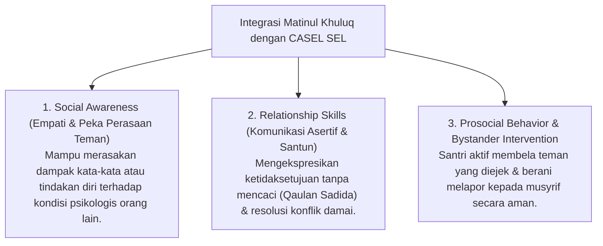

# P3-06-02-Definisi-dan-Konseptualisasi (Matinul Khuluq)

## Tujuan
Menetapkan definisi operasional, batasan istilah, dan integrasi sains modern (*Relationship Skills, Empathy, & Social Awareness - CASEL SEL*) dari karakter **Matinul Khuluq**.

---

## 1. Definisi Operasional Baku

> **Matinul Khuluq dalam Ekosistem TUMBUH adalah:**  
> *"Kapasitas moral santri yang memiliki budi pekerti kokoh (*Malakah Khuluqiyyah*), tercermin dalam tutur kata santun, penghormatan tinggi kepada guru, perlakuan adil dan penuh kasih sayang kepada teman sebaya, penolakan mutlak terhadap aksi perundungan (*Zero Bullying*), serta kesiapan menyelesaikan konflik secara damai (*Ishlah*)."*

---

## 2. Integrasi Konsep Sains & CASEL SEL

---

## 3. Status Dokumen
* **Status**: 🌟 **A+ (Tervalidasi & Siap Diimplementasikan)**
* **Level**: Project 3 - `03 Capacity Framework / 06 Matinul Khuluq / 02 Definition`
