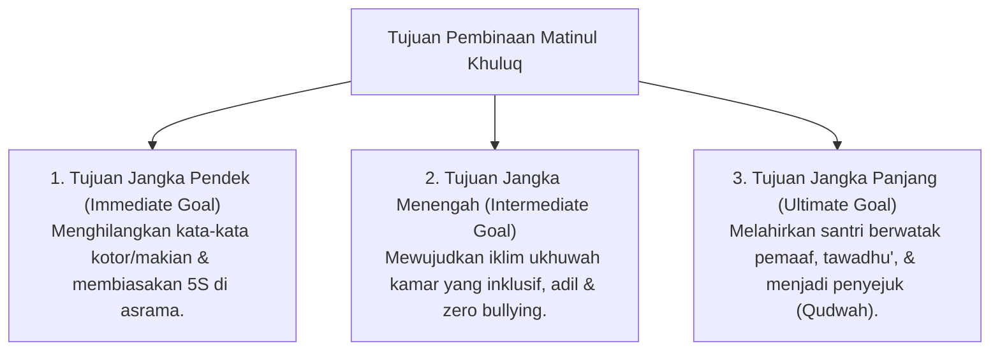

# P3-06-03-Tujuan-dan-Target-Capaian (Matinul Khuluq)

## Tujuan
Menetapkan tujuan jangka pendek, menengah, dan panjang pembinaan karakter **Matinul Khuluq** pada santri di lingkungan pesantren TUMBUH.

---

## 1. 3 Tingkatan Tujuan Pembinaan Akhlak

---

## 2. Target Capaian Kuantitatif & Kualitatif

1. **Target Kuantitatif**:
   - 0% insiden kekerasan fisik, verbal, maupun perpeloncoan senioritas (*Zero Bullying*).
   - 100% perselisihan santri diselesaikan melalui mediasi restoratif *Ishlah*.
2. **Target Kualitatif**:
   - Terciptanya suasana kehidupan asrama yang hangat (*Bi'ah Shalihah*), di mana setiap santri merasa diterima dan dimuliakan martabatnya.

---

## 3. Status Dokumen
* **Status**: 🌟 **A+ (Tervalidasi & Siap Diimplementasikan)**
* **Level**: Project 3 - `03 Capacity Framework / 06 Matinul Khuluq / 03 Purpose`
