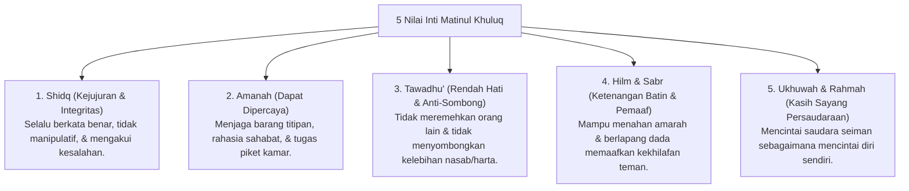

# P3-06-04-Nilai-Inti-dan-Prinsip-Akhlak (Matinul Khuluq)

## Tujuan
Merumuskan nilai-nilai inti (*Core Values*) dan prinsip syariat yang menjiwai karakter **Matinul Khuluq** dalam kehidupan santri.

---

## 1. 5 Nilai Inti Matinul Khuluq

---

## 2. Status Dokumen
* **Status**: 🌟 **A+ (Tervalidasi & Siap Diimplementasikan)**
* **Level**: Project 3 - `03 Capacity Framework / 06 Matinul Khuluq / 04 Core Values`
