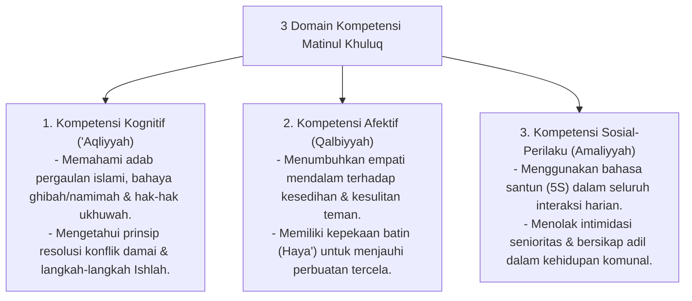

# P3-06-05-Standar-Kompetensi-dan-Taksonomi (Matinul Khuluq)

## Tujuan
Menetapkan **Standar Capaian Pembelajaran & Taksonomi Kompetensi** karakter Matinul Khuluq untuk seluruh jenjang santri di pesantren TUMBUH.

---

## 1. 3 Domain Kompetensi Matinul Khuluq

---

## 2. Matriks Capaian Berjenjang Sesuai Tangga TUMBUH

* **Jenjang T1 (Kelas 7 / 10 Baru)**: Menghentikan kebiasaan umpatan kasar, memanggil teman dengan nama baik, memuliakan ustadz/musyrif.
* **Jenjang T2 (Kelas 8 / 11)**: Mampu bekerjasama secara harmonis dalam piket kamar, menolong rekan yang sakit, menghargai privasi lemari teman.
* **Jenjang T3 (Kelas 9 / 12)**: Mampu meredakan perselisihan sebaya secara mandiri (*Peer Mediation*), berani membela santri baru dari ejekan.
* **Jenjang T4 (Santri Akhir / Teladan)**: Menjadi figur pengayom asrama (*Qudwah Hasanah*), membimbing santri junior tanpa arogansi senioritas feodal.

---

## 3. Status Dokumen
* **Status**: 🌟 **A+ (Tervalidasi & Siap Diimplementasikan)**
* **Level**: Project 3 - `03 Capacity Framework / 06 Matinul Khuluq / 05 Competencies`
