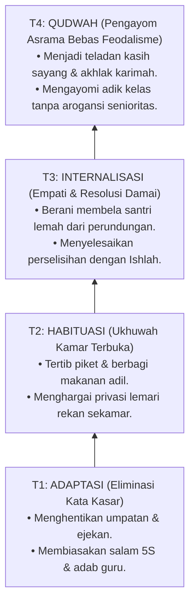

# P3-06-08-Tahapan-Perkembangan-Tangga-T1-T4 (Matinul Khuluq)

## Tujuan
Memetakan tahapan perkembangan karakter **Matinul Khuluq** melintasi jenjang **Tangga TUMBUH (T1, T2, T3, T4)**.

---

## 1. Roadmap Perkembangan Akhlak Santri

---

## 2. Status Dokumen
* **Status**: 🌟 **A+ (Tervalidasi & Siap Diimplementasikan)**
* **Level**: Project 3 - `03 Capacity Framework / 06 Matinul Khuluq / 08 Development Levels`
