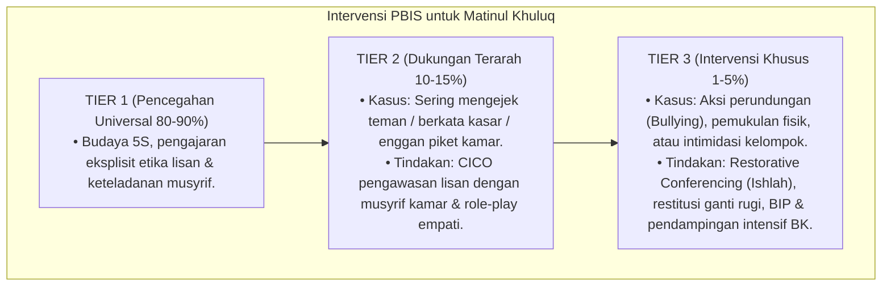

# P3-06-10-Protokol-Intervensi-dan-Pembiasaan (Matinul Khuluq)

## Tujuan
Menetapkan protokol pembiasaan akhlak asrama (*Habituation SOP*) dan pemetaan intervensi bertingkat (*PBIS Multi-Tier Intervention*) untuk menumbuhkan adab ukhuwah dan menuntaskan perilaku tidak santun/bullying.

---

## 1. Protokol Pembiasaan Rutin Asrama (Tier 1: Universal 100%)

1. **Budaya 5S (Senyum, Salam, Sapa, Sopan, Santun)**:
   - Wajib diterapkan oleh asatidz, musyrif, dan santri dalam setiap pertemuan di lorong, kelas, dan masjid.
2. **Kaidah Kamar Damai (*Peaceful Dorm Rules*)**:
   - Tata tertib kamar disepakati bersama oleh seluruh penghuni kamar di awal semester.
3. **Pemberian Apresiasi Kebaikan (Rasio 4:1)**:
   - Musyrif mencatat dan memuji santri yang bersikap santun atau membantu teman via logbook digital.

---

## 2. Pemetaan Intervensi Khusus PBIS

---

## 3. Status Dokumen
* **Status**: 🌟 **A+ (Tervalidasi & Siap Diimplementasikan)**
* **Level**: Project 3 - `03 Capacity Framework / 06 Matinul Khuluq / 10 Intervention Mapping`
