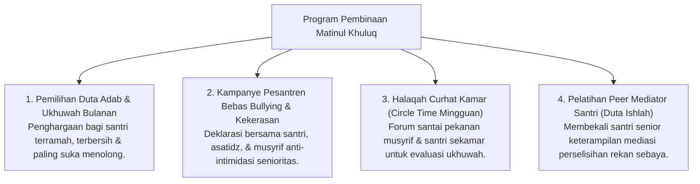

# P3-06-11-Program-Pembinaan-dan-Halaqah (Matinul Khuluq)

## Tujuan
Menetapkan daftar program pembinaan terstruktur, kegiatan ukhuwah, dan proyek penguatan karakter **Matinul Khuluq** di pesantren TUMBUH.

---

## 1. 4 Program Unggulan Pembinaan Akhlak

---

## 2. Status Dokumen
* **Status**: 🌟 **A+ (Tervalidasi & Siap Diimplementasikan)**
* **Level**: Project 3 - `03 Capacity Framework / 06 Matinul Khuluq / 11 Programs`
